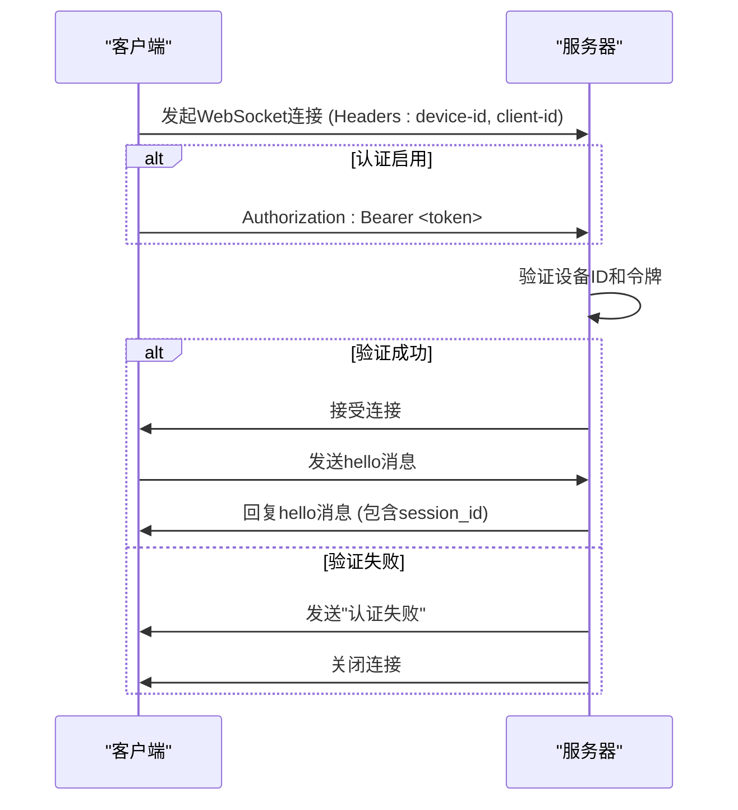
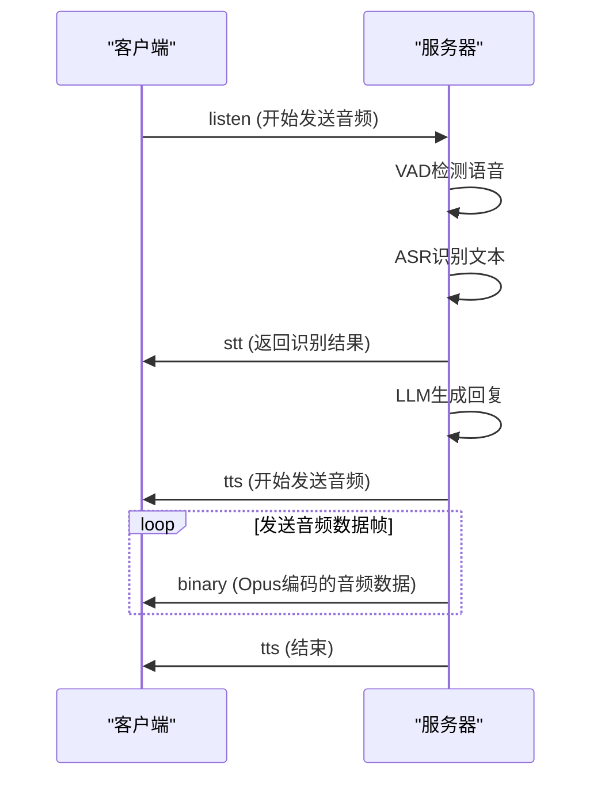

# API参考

<cite>
**本文档中引用的文件**  
- [app.py](file://app.py)
- [core/websocket_server.py](file://core/websocket_server.py)
- [core/http_server.py](file://core/http_server.py)
- [core/api/ota_handler.py](file://core/api/ota_handler.py)
- [core/api/vision_handler.py](file://core/api/vision_handler.py)
- [core/connection.py](file://core/connection.py)
- [core/auth.py](file://core/auth.py)
- [core/handle/textMessageType.py](file://core/handle/textMessageType.py)
- [test/js/core/network/websocket.js](file://test/js/core/network/websocket.js)
</cite>

## 目录
1. [WebSocket API](#websocket-api)
2. [HTTP API](#http-api)
3. [MCP API](#mcp-api)
4. [连接生命周期与错误处理](#连接生命周期与错误处理)
5. [安全考虑](#安全考虑)

## WebSocket API

本节详细描述了WebSocket API的连接协议、消息类型和通信模式。客户端通过`ws://<host>:8000/ws`连接到服务器，进行实时的双向通信。

### 连接协议

客户端通过WebSocket协议连接到服务器，连接地址为`ws://<host>:8000/xiaozhi/v1/`。连接时，客户端必须在请求头中提供`device-id`和`client-id`。如果启用了认证，还需要在`Authorization`头中提供`Bearer`令牌。服务器会首先验证连接，然后建立WebSocket会话。



**Diagram sources**
- [core/websocket_server.py](file://core/websocket_server.py#L56-L206)
- [core/auth.py](file://core/auth.py#L52-L73)

**Section sources**
- [app.py](file://app.py#L66-L68)
- [core/websocket_server.py](file://core/websocket_server.py#L46-L55)

### 消息类型与格式

WebSocket API支持多种消息类型，包括`audio`、`text`和`event`。消息通过JSON格式进行交换，服务器和客户端可以双向发送和接收消息。

#### 消息Schema

| 字段名 | 数据类型 | 是否必需 | 说明 |
| :--- | :--- | :--- | :--- |
| `type` | string | 是 | 消息类型，如`hello`、`listen`、`tts`、`stt`、`llm`、`mcp`、`abort`、`server` |
| `session_id` | string | 否 | 会话ID，由服务器在`hello`响应中提供 |
| `device_id` | string | 否 | 设备ID，连接时通过请求头传递 |
| `text` | string | 否 | 文本内容，用于`listen`、`stt`、`llm`等消息 |
| `state` | string | 否 | 状态，如`start`、`stop`、`sentence_start`、`sentence_end`，用于`audio`和`tts`消息 |
| `payload` | object | 否 | 负载数据，用于`mcp`消息，遵循MCP规范 |

#### 消息示例

**客户端发送音频数据帧**

```json
{
  "type": "listen",
  "mode": "auto",
  "state": "detect",
  "text": ""
}
```

**服务器接收文本/音频响应**

```json
{
  "type": "tts",
  "state": "start",
  "session_id": "abc123"
}
```

```json
{
  "type": "tts",
  "state": "sentence_start",
  "text": "你好，我是小智。",
  "session_id": "abc123"
}
```

```json
{
  "type": "tts",
  "state": "stop",
  "session_id": "abc123"
}
```

**双向通信流程**



**Diagram sources**
- [core/connection.py](file://core/connection.py#L265-L281)
- [test/js/core/network/websocket.js](file://test/js/core/network/websocket.js#L196-L215)

**Section sources**
- [core/handle/textMessageType.py](file://core/handle/textMessageType.py#L4-L12)
- [test/js/core/network/websocket.js](file://test/js/core/network/websocket.js#L72-L135)

## HTTP API

本节文档化了两个主要的HTTP API端点：OTA更新接口和视觉分析接口。

### OTA更新接口

该接口用于设备的固件更新，通过HTTP GET和POST请求获取更新配置。

- **HTTP方法**: `GET`, `POST`
- **URL路径**: `/xiaozhi/ota/`
- **请求头**: `device-id`, `client-id`
- **认证**: 可选，如果启用了认证，服务器会生成令牌

#### 请求体Schema

POST请求的请求体为JSON格式，包含设备的应用和设备信息。

| 字段名 | 数据类型 | 是否必需 | 说明 |
| :--- | :--- | :--- | :--- |
| `application` | object | 是 | 应用信息 |
| `application.version` | string | 是 | 应用版本 |
| `device` | object | 否 | 设备信息 |
| `device.model` | string | 否 | 设备型号 |

#### 响应体Schema

服务器返回一个JSON对象，包含服务器时间、固件信息和连接配置。

| 字段名 | 数据类型 | 是否必需 | 说明 |
| :--- | :--- | :--- | :--- |
| `server_time` | object | 是 | 服务器时间 |
| `server_time.timestamp` | number | 是 | 时间戳（毫秒） |
| `server_time.timezone_offset` | number | 是 | 时区偏移（分钟） |
| `firmware` | object | 是 | 固件信息 |
| `firmware.version` | string | 是 | 固件版本 |
| `firmware.url` | string | 是 | 固件下载URL |
| `websocket` | object | 否 | WebSocket配置 |
| `websocket.url` | string | 否 | WebSocket地址 |
| `websocket.token` | string | 否 | WebSocket认证令牌 |

#### 调用示例

使用curl命令：

```bash
curl -X POST http://localhost:8003/xiaozhi/ota/ \
  -H "device-id: 123456" \
  -H "client-id: client123" \
  -d '{"application": {"version": "1.0.0"}}'
```

**Section sources**
- [core/http_server.py](file://core/http_server.py#L48-L51)
- [core/api/ota_handler.py](file://core/api/ota_handler.py#L64-L200)

### 视觉分析接口

该接口用于接收图像数据并返回分析结果。

- **HTTP方法**: `GET`, `POST`
- **URL路径**: `/mcp/vision/explain`
- **请求头**: `Authorization: Bearer <token>`, `Device-Id`, `Client-Id`
- **认证**: 必需，使用JWT令牌

#### 请求体Schema

POST请求使用`multipart/form-data`格式。

| 字段名 | 数据类型 | 是否必需 | 说明 |
| :--- | :--- | :--- | :--- |
| `question` | text | 是 | 问题文本 |
| `image` | file | 是 | 图像文件，支持JPEG、PNG、GIF、BMP、TIFF、WEBP格式，最大5MB |

#### 响应体Schema

服务器返回一个JSON对象。

| 字段名 | 数据类型 | 是否必需 | 说明 |
| :--- | :--- | :--- | :--- |
| `success` | boolean | 是 | 是否成功 |
| `action` | string | 是 | 动作类型 |
| `response` | string | 是 | 分析结果 |

#### 调用示例

使用JavaScript代码：

```javascript
const formData = new FormData();
formData.append('question', '图片里有什么？');
formData.append('image', imageFile);

fetch('http://localhost:8003/mcp/vision/explain', {
  method: 'POST',
  headers: {
    'Authorization': 'Bearer your-token',
    'Device-Id': '123456',
    'Client-Id': 'client123'
  },
  body: formData
})
.then(response => response.json())
.then(data => console.log(data));
```

**Section sources**
- [core/http_server.py](file://core/http_server.py#L56-L59)
- [core/api/vision_handler.py](file://core/api/vision_handler.py#L39-L174)

## MCP API

MCP（Modular Control Protocol）相关的API主要通过WebSocket传输，遵循MCP规范。

### MCP消息格式

MCP消息通过WebSocket的`mcp`类型消息传输，其`payload`字段遵循JSON-RPC 2.0规范。

```json
{
  "type": "mcp",
  "session_id": "abc123",
  "payload": {
    "jsonrpc": "2.0",
    "id": 1,
    "method": "tools/list",
    "params": {}
  }
}
```

### MCP方法

- `initialize`: 初始化MCP客户端。
- `tools/list`: 获取可用工具列表。
- `tools/call`: 调用指定工具。

**Section sources**
- [core/providers/tools/device_mcp/mcp_handler.py](file://core/providers/tools/device_mcp/mcp_handler.py#L114-L226)
- [test/js/core/network/websocket.js](file://test/js/core/network/websocket.js#L137-L192)

## 连接生命周期与错误处理

### 连接生命周期

WebSocket连接的生命周期包括连接、握手、通信和关闭。

1. **连接**: 客户端发起WebSocket连接。
2. **握手**: 客户端发送`hello`消息，服务器回复`hello`消息，包含`session_id`。
3. **通信**: 双方通过文本和二进制消息进行通信。
4. **关闭**: 任何一方可以关闭连接，服务器会清理资源。

### 错误码

- **连接失败**: 如果连接时缺少`device-id`或认证失败，服务器会发送"认证失败"并关闭连接。
- **认证失败**: 如果提供的令牌无效或过期，服务器会返回401状态码。

**Section sources**
- [core/connection.py](file://core/connection.py#L165-L230)
- [core/auth.py](file://core/auth.py#L52-L73)

## 安全考虑

- **Origin检查**: 服务器通过CORS头允许所有来源（`Access-Control-Allow-Origin: *`）。
- **认证**: 使用HMAC-SHA256签名的令牌进行认证，令牌包含时间戳，具有过期机制。
- **敏感信息**: 配置文件中的敏感信息（如密钥）会被过滤。

**Section sources**
- [core/auth.py](file://core/auth.py#L13-L73)
- [core/api/vision_handler.py](file://core/api/vision_handler.py#L176-L182)