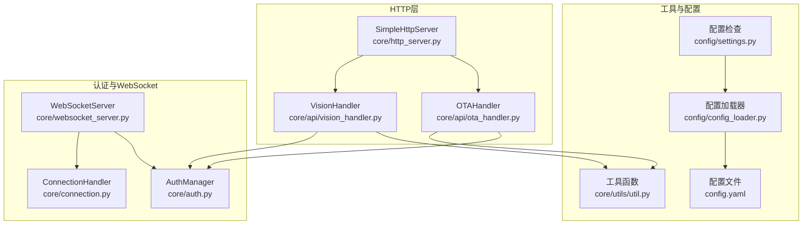
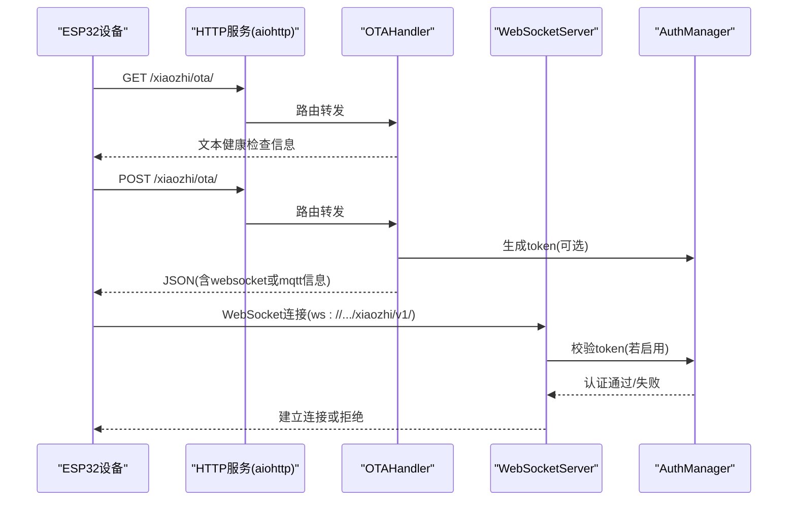
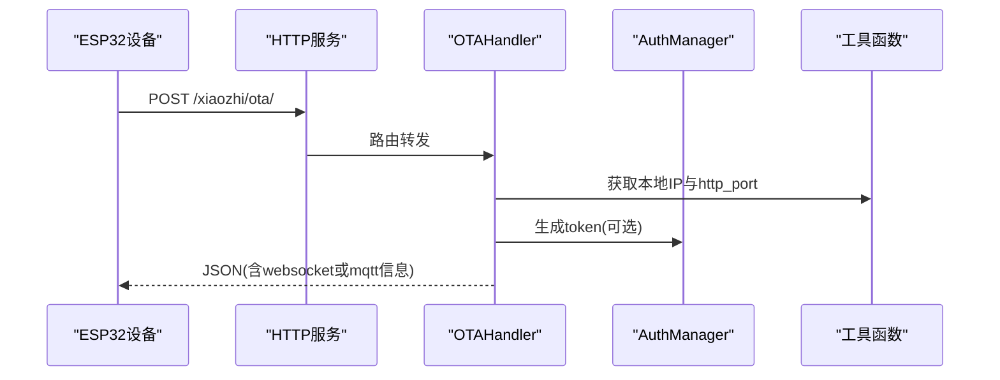
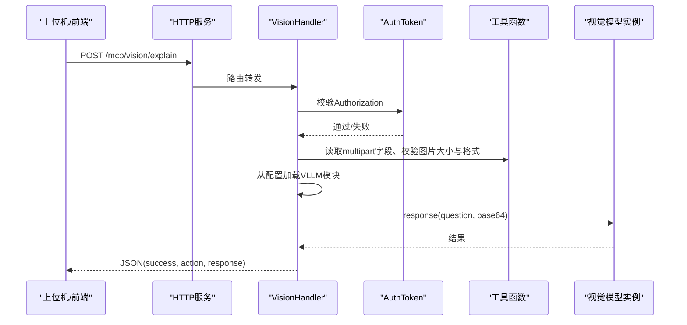
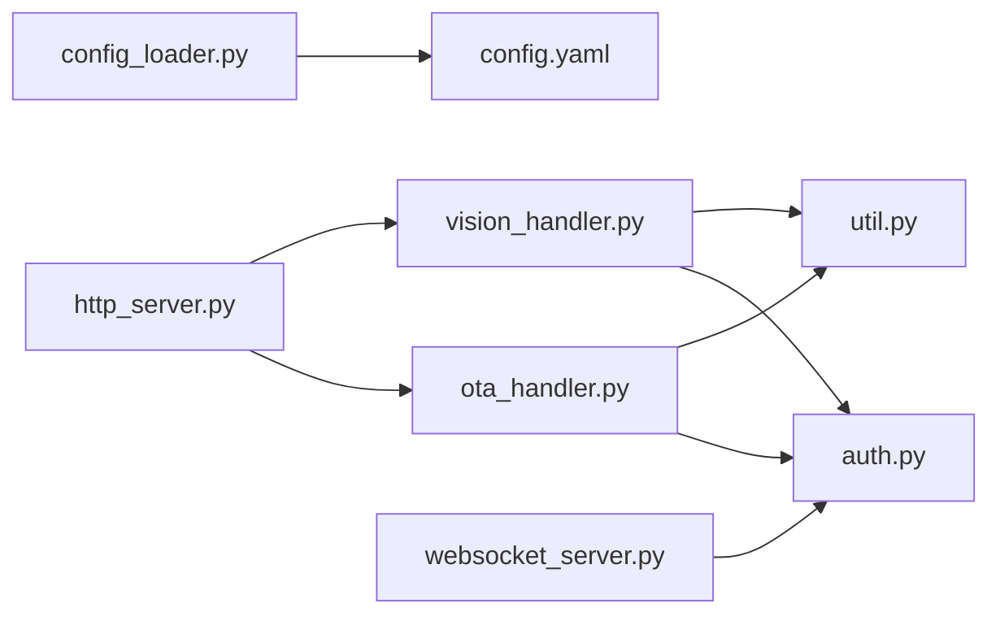

# HTTP API

<cite>
**本文引用的文件**
- [http_server.py](file://core/http_server.py)
- [ota_handler.py](file://core/api/ota_handler.py)
- [vision_handler.py](file://core/api/vision_handler.py)
- [base_handler.py](file://core/api/base_handler.py)
- [util.py](file://core/utils/util.py)
- [config.yaml](file://config.yaml)
- [config_loader.py](file://config/config_loader.py)
- [settings.py](file://config/settings.py)
- [auth.py](file://core/auth.py)
- [websocket_server.py](file://core/websocket_server.py)
- [connection.py](file://core/connection.py)
- [app.py](file://app.py)
- [ota-connector.js](file://test/js/core/network/ota-connector.js)
</cite>

## 目录
1. [简介](#简介)
2. [项目结构](#项目结构)
3. [核心组件](#核心组件)
4. [架构总览](#架构总览)
5. [详细组件分析](#详细组件分析)
6. [依赖关系分析](#依赖关系分析)
7. [性能考量](#性能考量)
8. [故障排查指南](#故障排查指南)
9. [结论](#结论)
10. [附录](#附录)

## 简介
本文件为系统提供的两个核心HTTP端点的全面参考文档，面向ESP32设备与上位机/前端调用者，涵盖：
- OTA更新接口：GET与POST，用于ESP32设备固件更新与连接信息下发（WebSocket/MQTT），支持通过配置文件定制行为。
- 视觉分析接口：POST，接收multipart/form-data格式的图像文件，调用视觉模型进行内容分析，返回JSON格式的解释结果。

同时，文档说明HTTP API由aiohttp驱动，路由在http_server.py中配置；并讨论安全性（认证、白名单、CORS）、与WebSocket服务的协同工作方式，以及使用curl的调用示例。

## 项目结构
- HTTP路由与服务入口位于 core/http_server.py，负责注册OTA与视觉分析接口的GET/POST/OPTIONS路由。
- OTA接口处理器位于 core/api/ota_handler.py，负责解析设备请求头、生成WebSocket/MQTT连接信息、可选生成认证token。
- 视觉分析接口处理器位于 core/api/vision_handler.py，负责解析multipart/form-data、校验图片格式与大小、调用视觉模型并返回JSON结果。
- 工具函数位于 core/utils/util.py，提供本地IP获取、图片格式校验、视觉分析URL生成等。
- 配置文件位于 config.yaml，其中server段包含http_port、websocket、vision_explain、auth、auth_key、mqtt_gateway等关键配置项。
- 认证与WebSocket服务位于 core/auth.py 与 core/websocket_server.py，分别提供token生成/校验与WebSocket连接认证。

图表来源
- [http_server.py](file://core/http_server.py#L41-L60)
- [ota_handler.py](file://core/api/ota_handler.py#L15-L25)
- [vision_handler.py](file://core/api/vision_handler.py#L19-L25)
- [util.py](file://core/utils/util.py#L488-L504)
- [config.yaml](file://config.yaml#L9-L41)
- [auth.py](file://core/auth.py#L13-L73)
- [websocket_server.py](file://core/websocket_server.py#L15-L45)
- [connection.py](file://core/connection.py#L157-L194)

章节来源
- [http_server.py](file://core/http_server.py#L41-L60)
- [config.yaml](file://config.yaml#L9-L41)

## 核心组件
- HTTP路由与服务启动：SimpleHttpServer在启动时根据配置注册OTA与视觉分析接口的GET/POST/OPTIONS路由，并绑定处理器。
- OTA接口处理器：支持GET健康检查与POST设备连接信息下发（WebSocket或MQTT），可选生成认证token，支持白名单直通。
- 视觉分析接口处理器：支持GET健康检查与POST图像分析，解析multipart/form-data，校验图片格式与大小，调用视觉模型并返回统一JSON结构。
- 工具函数：提供本地IP获取、图片格式校验、视觉分析URL生成等。
- 配置文件：server段包含http_port、websocket、vision_explain、auth、auth_key、mqtt_gateway等关键配置项。
- 认证与WebSocket：AuthManager生成/校验token，WebSocketServer在连接建立前进行认证，支持白名单直通。

章节来源
- [http_server.py](file://core/http_server.py#L41-L60)
- [ota_handler.py](file://core/api/ota_handler.py#L64-L183)
- [vision_handler.py](file://core/api/vision_handler.py#L39-L151)
- [util.py](file://core/utils/util.py#L488-L534)
- [config.yaml](file://config.yaml#L9-L41)
- [auth.py](file://core/auth.py#L13-L73)
- [websocket_server.py](file://core/websocket_server.py#L184-L205)

## 架构总览
系统采用aiohttp提供HTTP服务，WebSocket由websockets提供，二者共享认证与配置体系。OTA接口用于ESP32设备获取连接信息（WebSocket或MQTT），视觉分析接口用于上位机/前端提交图像进行内容分析。

图表来源
- [http_server.py](file://core/http_server.py#L41-L60)
- [ota_handler.py](file://core/api/ota_handler.py#L64-L183)
- [websocket_server.py](file://core/websocket_server.py#L184-L205)
- [auth.py](file://core/auth.py#L36-L73)

## 详细组件分析

### OTA更新接口
- 方法与路径
  - GET /xiaozhi/ota/：健康检查，返回文本信息，包含向设备下发的WebSocket地址。
  - POST /xiaozhi/ota/：设备连接信息下发，返回JSON，包含服务器时间、固件信息、以及WebSocket或MQTT连接信息。
- 请求头
  - device-id：设备唯一标识，必填。
  - client-id：客户端标识，必填。
- 响应
  - GET：text/plain，包含WebSocket地址。
  - POST：application/json，包含：
    - server_time：timestamp（毫秒）、timezone_offset（分钟）。
    - firmware：version（字符串）、url（字符串，当前为空）。
    - websocket：url（字符串）、token（字符串，可选）。
    - mqtt：endpoint、client_id、username、password、publish_topic、subscribe_topic（当配置了mqtt_gateway时）。
- 行为与配置
  - 若配置了mqtt_gateway且非空，则下发MQTT连接信息；否则下发WebSocket连接信息。
  - 若启用auth.enabled且未在allowed_devices白名单内，则生成token并随websocket返回。
  - websocket地址优先使用server.websocket配置，若仍为占位符则自动生成http_port端口的/ws地址。
- CORS
  - 统一添加CORS头，允许的Header包含client-id、content-type、device-id。

图表来源
- [http_server.py](file://core/http_server.py#L41-L60)
- [ota_handler.py](file://core/api/ota_handler.py#L64-L183)
- [util.py](file://core/utils/util.py#L42-L52)
- [auth.py](file://core/auth.py#L36-L50)

章节来源
- [http_server.py](file://core/http_server.py#L41-L60)
- [ota_handler.py](file://core/api/ota_handler.py#L64-L183)
- [base_handler.py](file://core/api/base_handler.py#L10-L17)
- [util.py](file://core/utils/util.py#L42-L52)
- [config.yaml](file://config.yaml#L9-L41)

### 视觉分析接口
- 方法与路径
  - GET /mcp/vision/explain：健康检查，返回文本信息或提示配置问题。
  - POST /mcp/vision/explain：multipart/form-data图像分析，返回JSON。
- 请求头
  - Authorization：Bearer <token>，必填，用于认证。
  - Device-Id：设备ID，需与token中的设备ID一致。
  - Client-Id：客户端ID，可选。
- 请求体
  - multipart/form-data：
    - question：字符串字段，表示分析问题或提示。
    - image：二进制文件字段，支持JPEG、PNG、GIF、BMP、TIFF、WEBP。
    - 最大文件大小：5MB。
- 响应
  - 成功：application/json，包含success（布尔）、action（字符串，RESPONSE）、response（模型返回内容）。
  - 失败：application/json，包含success（布尔）与message（字符串）。
- 行为与配置
  - 若启用read_config_from_api，将从管理API拉取私有配置（按device-id/client-id）。
  - 通过selected_module.VLLM与VLLM配置选择视觉模型，调用create_instance后执行response(question, base64)。
  - 若未设置默认视觉分析模块，将返回错误。
- CORS
  - 统一添加CORS头，允许的Header包含client-id、content-type、device-id。

图表来源
- [http_server.py](file://core/http_server.py#L54-L60)
- [vision_handler.py](file://core/api/vision_handler.py#L39-L151)
- [util.py](file://core/utils/util.py#L488-L534)

章节来源
- [http_server.py](file://core/http_server.py#L54-L60)
- [vision_handler.py](file://core/api/vision_handler.py#L39-L151)
- [base_handler.py](file://core/api/base_handler.py#L10-L17)
- [util.py](file://core/utils/util.py#L488-L534)
- [config.yaml](file://config.yaml#L201-L220)

### 配置文件与自定义行为
- server.http_port：HTTP服务端口，用于OTA与视觉分析接口。
- server.websocket：向设备下发的WebSocket地址模板，若仍为占位符则自动生成。
- server.vision_explain：向设备下发的视觉分析接口地址模板，若仍为占位符则自动生成。
- server.auth.enabled：是否启用认证。
- server.auth.allowed_devices：白名单设备ID集合。
- server.auth_key：认证密钥，用于生成/校验token。
- server.mqtt_gateway：MQTT网关地址，配置后OTA将下发MQTT连接信息而非WebSocket。
- server.mqtt_signature_key：MQTT密码签名密钥，用于生成MQTT密码。
- server.timezone_offset：服务器时间时区偏移（小时）。
- read_config_from_api：是否从管理API拉取配置；若启用，将覆盖部分server配置。

章节来源
- [config.yaml](file://config.yaml#L9-L41)
- [config_loader.py](file://config/config_loader.py#L47-L75)
- [settings.py](file://config/settings.py#L9-L34)

## 依赖关系分析
- 路由依赖：http_server.py依赖ota_handler与vision_handler注册路由。
- 处理器依赖：ota_handler依赖AuthManager与工具函数；vision_handler依赖AuthToken、工具函数与VLLM实例。
- 配置依赖：处理器读取config.yaml中的server段；config_loader支持从管理API拉取配置。
- 认证依赖：AuthManager在HTTP与WebSocket两端共同使用，确保一致性。

图表来源
- [http_server.py](file://core/http_server.py#L41-L60)
- [ota_handler.py](file://core/api/ota_handler.py#L15-L25)
- [vision_handler.py](file://core/api/vision_handler.py#L19-L25)
- [auth.py](file://core/auth.py#L13-L73)
- [util.py](file://core/utils/util.py#L488-L504)
- [config_loader.py](file://config/config_loader.py#L18-L45)
- [config.yaml](file://config.yaml#L9-L41)
- [websocket_server.py](file://core/websocket_server.py#L15-L45)

章节来源
- [http_server.py](file://core/http_server.py#L41-L60)
- [ota_handler.py](file://core/api/ota_handler.py#L15-L25)
- [vision_handler.py](file://core/api/vision_handler.py#L19-L25)
- [auth.py](file://core/auth.py#L13-L73)
- [util.py](file://core/utils/util.py#L488-L504)
- [config_loader.py](file://config/config_loader.py#L18-L45)
- [config.yaml](file://config.yaml#L9-L41)
- [websocket_server.py](file://core/websocket_server.py#L15-L45)

## 性能考量
- 视觉分析接口对图片大小有限制（5MB），过大文件将被拒绝，避免内存与网络压力。
- 图片格式校验基于文件头魔数，快速过滤非法格式，减少后续处理开销。
- CORS头统一设置，便于跨域调用，但生产环境建议结合反向代理限制来源。
- OTA接口返回JSON时包含服务器时间与时区偏移，便于设备侧时间同步。

[本节为通用指导，不涉及具体文件分析]

## 故障排查指南
- OTA接口GET返回异常
  - 检查server.websocket是否正确配置；若仍为占位符，系统会自动生成地址。
  - 确认设备IP与端口可达。
- OTA接口POST返回错误
  - 确认请求头包含device-id与client-id。
  - 若启用认证且不在白名单内，需确保生成的token有效。
- 视觉分析接口POST返回错误
  - 确认Authorization头格式为Bearer <token>，且与Device-Id匹配。
  - 确认multipart字段包含question与image，且image大小不超过5MB，格式为JPEG/PNG/GIF/BMP/TIFF/WEBP。
  - 确认已设置默认视觉分析模块（selected_module.VLLM）。
- WebSocket连接失败
  - 检查WebSocketServer的认证配置（auth.enabled、allowed_devices、auth_key）。
  - 确认连接URL包含device-id、client-id与authorization参数。

章节来源
- [ota_handler.py](file://core/api/ota_handler.py#L64-L183)
- [vision_handler.py](file://core/api/vision_handler.py#L39-L151)
- [websocket_server.py](file://core/websocket_server.py#L184-L205)
- [auth.py](file://core/auth.py#L36-L73)

## 结论
本文档系统性梳理了OTA更新接口与视觉分析接口的HTTP行为、请求/响应规范、配置项与安全机制，并展示了与WebSocket服务的协同方式。通过合理配置server段与认证策略，可在保证安全的前提下为ESP32设备提供稳定的连接与视觉分析能力。

[本节为总结性内容，不涉及具体文件分析]

## 附录

### API定义与调用示例

- OTA接口
  - GET /xiaozhi/ota/
    - 用途：健康检查，返回文本信息。
    - 示例（curl）：
      - curl -i http://<host>:<http_port>/xiaozhi/ota/
  - POST /xiaozhi/ota/
    - 用途：设备连接信息下发（WebSocket或MQTT）。
    - 请求头：
      - device-id: 设备ID
      - client-id: 客户端ID
    - 示例（curl）：
      - curl -i -X POST http://<host>:<http_port>/xiaozhi/ota/ -H "device-id: <device_id>" -H "client-id: <client_id>" -d '{"application":{"version":"1.0.0"}}'

- 视觉分析接口
  - GET /mcp/vision/explain
    - 用途：健康检查，返回文本信息。
    - 示例（curl）：
      - curl -i http://<host>:<http_port>/mcp/vision/explain
  - POST /mcp/vision/explain
    - 用途：图像分析。
    - 请求头：
      - Authorization: Bearer <token>
      - Device-Id: 设备ID（需与token一致）
      - Client-Id: 客户端ID（可选）
    - 请求体：multipart/form-data
      - question: 字符串
      - image: 二进制文件（JPEG/PNG/GIF/BMP/TIFF/WEBP，≤5MB）
    - 示例（curl）：
      - curl -i -X POST http://<host>:<http_port>/mcp/vision/explain -H "Authorization: Bearer <token>" -H "Device-Id: <device_id>" -F "question=描述图片内容" -F "image=@/path/to/image.jpg"

- WebSocket连接
  - URL：ws://<host>:<port>/xiaozhi/v1/
  - 查询参数：
    - device-id: 设备ID
    - client-id: 客户端ID
    - authorization: Bearer <token>（若启用认证）
  - 示例（浏览器/前端）：
    - ws://<host>:<port>/xiaozhi/v1/?device-id=<device_id>&client-id=<client_id>&authorization=Bearer%20<token>

- 配置要点
  - server.http_port：HTTP服务端口（默认8003）。
  - server.websocket：WebSocket地址模板（默认占位符，系统会自动生成）。
  - server.vision_explain：视觉分析接口地址模板（默认占位符，系统会自动生成）。
  - server.auth.enabled：是否启用认证。
  - server.auth_key：认证密钥。
  - server.auth.allowed_devices：白名单设备ID集合。
  - server.mqtt_gateway：MQTT网关地址（配置后OTA下发MQTT而非WebSocket）。
  - server.mqtt_signature_key：MQTT密码签名密钥。
  - server.timezone_offset：服务器时间时区偏移（小时）。
  - read_config_from_api：是否从管理API拉取配置。

章节来源
- [http_server.py](file://core/http_server.py#L41-L60)
- [ota_handler.py](file://core/api/ota_handler.py#L64-L183)
- [vision_handler.py](file://core/api/vision_handler.py#L39-L151)
- [util.py](file://core/utils/util.py#L488-L534)
- [config.yaml](file://config.yaml#L9-L41)
- [app.py](file://app.py#L74-L110)
- [ota-connector.js](file://test/js/core/network/ota-connector.js#L1-L45)