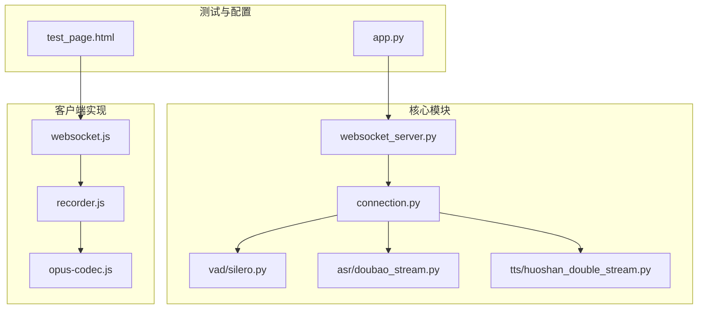
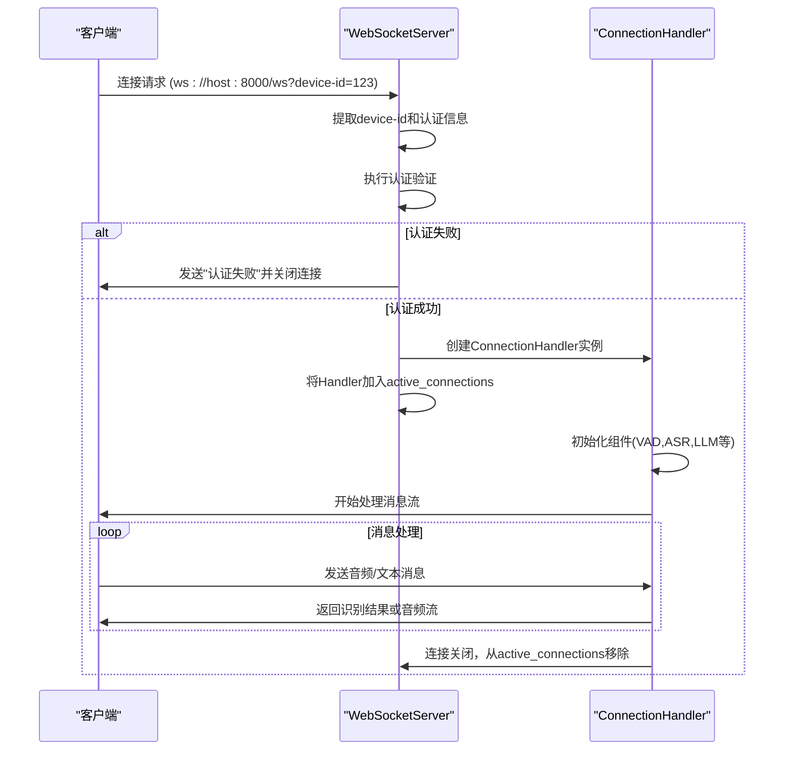
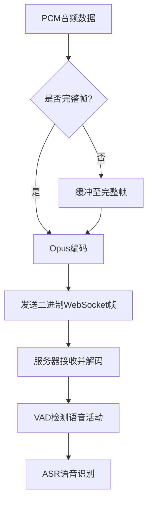
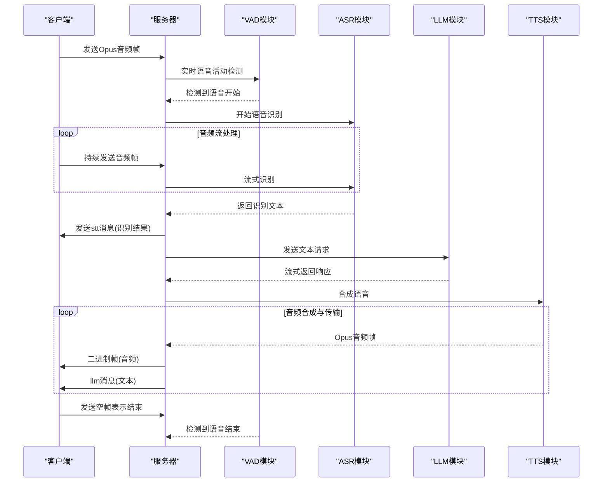
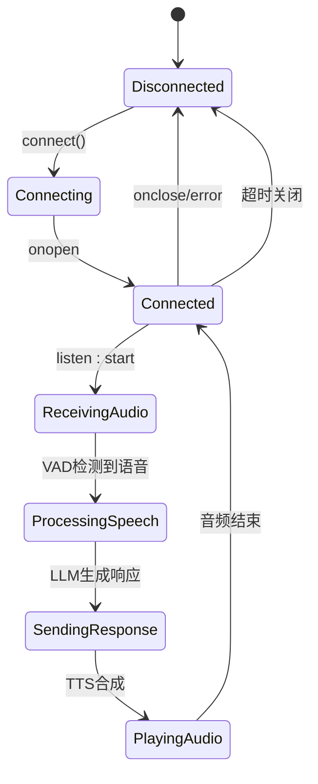
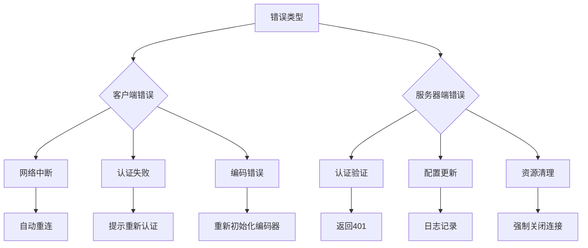

# WebSocket API

<cite>
**本文档引用文件**   
- [websocket_server.py](file://core/websocket_server.py)
- [connection.py](file://core/connection.py)
- [websocket.js](file://test/js/core/network/websocket.js)
- [recorder.js](file://test/js/core/audio/recorder.js)
- [opus-codec.js](file://test/js/core/audio/opus-codec.js)
- [app.py](file://app.py)
- [opus_encoder_utils.py](file://core/utils/opus_encoder_utils.py)
- [silero.py](file://core/providers/vad/silero.py)
- [doubao_stream.py](file://core/providers/asr/doubao_stream.py)
- [huoshan_double_stream.py](file://core/providers/tts/huoshan_double_stream.py)
- [xunfei_stream.py](file://core/providers/tts/xunfei_stream.py)
- [helloMessageHandler.py](file://core/handle/textHandler/helloMessageHandler.py)
- [listenMessageHandler.py](file://core/handle/textHandler/listenMessageHandler.py)
- [abortMessageHandler.py](file://core/handle/textHandler/abortMessageHandler.py)
- [abortHandle.py](file://core/handle/abortHandle.py)
- [test_page.html](file://test/test_page.html)
</cite>

## 目录
1. [引言](#引言)
2. [项目结构](#项目结构)
3. [WebSocket连接建立](#websocket连接建立)
4. [消息格式与通信协议](#消息格式与通信协议)
5. [语音交互流程](#语音交互流程)
6. [客户端实现示例](#客户端实现示例)
7. [连接生命周期与事件处理](#连接生命周期与事件处理)
8. [错误处理与性能优化](#错误处理与性能优化)
9. [结论](#结论)

## 引言

本WebSocket API文档详细描述了实时语音交互协议的实现机制，聚焦于基于WebSocket的全双工通信架构。系统通过`ws://<host>:8000/ws`端点提供实时语音服务，支持客户端与服务器之间的双向流式通信。核心流程包括：客户端发送Opus编码的音频流，服务器通过VAD检测语音活动，使用ASR将语音转为文本，经LLM生成响应后，通过TTS合成音频并以二进制帧形式返回给客户端。该系统广泛应用于智能语音助手场景，支持实时语音识别、自然语言处理和语音合成的完整闭环。

**Section sources**
- [app.py](file://app.py#L98-L108)
- [websocket_server.py](file://core/websocket_server.py#L46-L54)

## 项目结构

项目采用模块化设计，核心WebSocket功能位于`core/`目录下。`websocket_server.py`定义了`WebSocketServer`类，负责管理WebSocket连接的生命周期；`connection.py`中的`ConnectionHandler`类处理单个连接的逻辑，包括音频流处理、消息路由和状态管理。音频处理相关工具位于`test/js/core/audio/`目录，包括Opus编码器和音频录制器。测试页面`test_page.html`提供了完整的客户端实现示例。



**Diagram sources **
- [app.py](file://app.py#L67-L68)
- [websocket_server.py](file://core/websocket_server.py#L15-L119)
- [connection.py](file://core/connection.py#L55-L1151)

## WebSocket连接建立

WebSocket连接的建立过程包含URL规范、客户端握手要求和服务器端连接管理三个关键环节。服务器监听在`ws://<host>:8000/ws`端口，由`app.py`中的`WebSocketServer`实例化并启动。客户端可通过URL查询参数或HTTP头传递`device-id`、`client-id`和`authorization`等认证信息。服务器首先验证设备ID，若未提供则返回提示信息并关闭连接。

服务器端通过`WebSocketServer`类的`_handle_connection`方法处理新连接。该方法首先从请求头或URL查询参数中提取`device-id`，然后调用`_handle_auth`进行JWT认证。认证通过后，创建独立的`ConnectionHandler`实例处理该连接，并将其加入`active_connections`集合进行管理。连接管理机制确保每个连接拥有独立的状态和资源，支持高并发场景。



**Diagram sources **
- [app.py](file://app.py#L67-L68)
- [websocket_server.py](file://core/websocket_server.py#L56-L123)
- [connection.py](file://core/connection.py#L165-L230)

**Section sources**
- [websocket_server.py](file://core/websocket_server.py#L56-L123)
- [connection.py](file://core/connection.py#L165-L230)

## 消息格式与通信协议

系统采用混合消息格式进行双向通信：音频流使用Opus编码并通过二进制帧传输，控制消息和文本数据使用JSON格式。所有JSON消息包含`type`字段标识消息类型，如`hello`、`text`、`audio`、`event`等，以及`content`、`timestamp`和`session_id`等通用字段。

### 消息类型Schema

| 消息类型 | 必需字段 | 可选字段 | 数据类型 | 说明 |
|---------|---------|---------|---------|------|
| hello | type, device_id, token | features, client_id | string | 客户端握手消息 |
| listen | type, mode, state | text | string | 音频监听控制 |
| abort | type, reason | session_id | string | 中断当前会话 |
| tts | type, state | text, session_id | string | TTS状态通知 |
| stt | type, text | | string | 语音识别结果 |
| llm | type, text | | string | LLM回复内容 |
| mcp | type, payload | session_id | object | MCP工具调用 |

### 二进制音频帧格式

音频数据以Opus编码的二进制帧通过WebSocket传输。每个二进制帧包含960个样本（60ms @ 16kHz），编码参数配置为：采样率16kHz、单声道、比特率24kbps、复杂度10（最高质量）。客户端使用`opus_encoder_utils.py`中的`OpusEncoderUtils`类进行实时编码，服务器端使用`opuslib_next`库进行解码。



**Diagram sources **
- [connection.py](file://core/connection.py#L269-L280)
- [opus_encoder_utils.py](file://core/utils/opus_encoder_utils.py#L16-L132)
- [recorder.js](file://test/js/core/audio/recorder.js#L195-L236)

**Section sources**
- [connection.py](file://core/connection.py#L266-L280)
- [websocket.js](file://test/js/core/network/websocket.js#L294-L296)
- [recorder.js](file://test/js/core/audio/recorder.js#L195-L236)

## 语音交互流程

实时语音交互遵循严格的处理流程：客户端发送音频数据 → 服务端VAD检测语音开始/结束 → ASR识别为文本 → LLM生成响应 → TTS合成音频 → 服务端通过WebSocket返回文本和音频流。该流程在`ConnectionHandler`类中实现，通过异步事件驱动模型确保低延迟。

当客户端开始说话时，音频数据通过WebSocket二进制帧持续发送。服务器端的`_route_message`方法将二进制数据放入`asr_audio_queue`队列。VAD模块（基于Silero模型）实时分析音频流，当检测到语音活动时，触发ASR模块开始识别。ASR结果通过`stt`类型的消息返回给客户端，同时触发LLM生成响应。LLM的流式响应被送入TTS模块，合成的Opus音频通过二进制帧返回，同时`llm`类型的消息返回文本内容。



**Diagram sources **
- [connection.py](file://core/connection.py#L266-L280)
- [silero.py](file://core/providers/vad/silero.py#L39-L42)
- [doubao_stream.py](file://core/providers/asr/doubao_stream.py#L56-L69)
- [huoshan_double_stream.py](file://core/providers/tts/huoshan_double_stream.py#L379-L402)

**Section sources**
- [connection.py](file://core/connection.py#L266-L280)
- [silero.py](file://core/providers/vad/silero.py#L39-L42)

## 客户端实现示例

JavaScript客户端实现基于`test/js/core/network/websocket.js`和`recorder.js`，展示了浏览器中全双工通信的完整实现。`WebSocketHandler`类管理WebSocket连接，处理文本和二进制消息；`AudioRecorder`类使用Web Audio API录制音频，并通过Opus编码器实时编码。

客户端首先建立WebSocket连接，设置`binaryType`为`arraybuffer`以正确处理二进制音频数据。连接成功后发送`hello`握手消息，包含`device_id`、`token`和`features`等信息。收到服务器的`hello`响应后，客户端进入就绪状态。录音时，`AudioRecorder`使用`AudioWorkletNode`或`ScriptProcessorNode`捕获音频，每960个样本（60ms）编码为一个Opus帧并通过WebSocket发送。

```javascript
// 示例代码路径: test/js/core/audio/recorder.js
async start() {
    // 初始化Opus编码器
    this.initEncoder();
    
    // 获取麦克风音频流
    const stream = await navigator.mediaDevices.getUserMedia({
        audio: { sampleRate: 16000, channelCount: 1 }
    });
    
    // 创建音频处理器
    const processorResult = await this.createAudioProcessor();
    this.audioSource.connect(this.audioProcessor);
    
    // 开始录音并发送监听开始消息
    this.websocket.send(JSON.stringify({
        type: 'listen',
        mode: 'manual',
        state: 'start'
    }));
}
```

**Section sources**
- [websocket.js](file://test/js/core/network/websocket.js#L218-L372)
- [recorder.js](file://test/js/core/audio/recorder.js#L239-L400)
- [opus-codec.js](file://test/js/core/audio/opus-codec.js#L48-L186)

## 连接生命周期与事件处理

WebSocket连接的生命周期包含`open`、`message`、`close`和`error`四个主要事件。`WebSocketHandler`类通过`setupEventHandlers`方法注册这些事件的回调函数。`onopen`事件触发后，客户端自动发送`hello`握手消息；`onmessage`事件根据消息类型分发处理；`onclose`和`onerror`事件清理资源并更新UI状态。

服务器端实现连接超时机制，通过`_check_timeout`任务监控`last_activity_time`。若在`timeout_seconds`（默认180秒）内无活动，自动关闭连接。连接关闭时，服务器执行资源清理，包括保存记忆、关闭WebSocket和清理任务队列。`ConnectionHandler`的`_save_and_close`方法确保即使保存记忆失败，也能强制关闭连接。



**Diagram sources **
- [websocket.js](file://test/js/core/network/websocket.js#L255-L306)
- [connection.py](file://core/connection.py#L194-L230)
- [connection.py](file://core/connection.py#L1003-L1150)

**Section sources**
- [websocket.js](file://test/js/core/network/websocket.js#L255-L306)
- [connection.py](file://core/connection.py#L194-L230)

## 错误处理与性能优化

系统实现了全面的错误处理机制。客户端通过`try-catch`捕获WebSocket操作异常，并在`onerror`回调中处理连接错误。服务器端对认证失败、配置更新失败等异常进行日志记录，并返回适当的错误消息。连接中断（如1006错误码）由客户端自动重连机制处理。

性能优化方面，系统采用多项关键技术：Opus编码器配置为24kbps比特率和最高复杂度，平衡音质与带宽；音频流采用60ms帧大小，确保低延迟；服务器端使用线程池处理阻塞操作，避免阻塞事件循环。客户端实现音频流控制，前5个包直接发送（预缓冲），后续包按时间戳精确发送，确保音频播放流畅。



**Diagram sources **
- [websocket.js](file://test/js/core/network/websocket.js#L284-L290)
- [websocket_server.py](file://core/websocket_server.py#L85-L90)
- [connection.py](file://core/connection.py#L1024-L1037)
- [opus-codec.js](file://test/js/core/audio/opus-codec.js#L110-L113)

**Section sources**
- [websocket.js](file://test/js/core/network/websocket.js#L284-L290)
- [abortHandle.py](file://core/handle/abortHandle.py#L6-L17)

## 结论

本文档详细阐述了基于WebSocket的实时语音交互协议的实现细节。系统通过`ws://<host>:8000/ws`提供全双工通信，支持Opus音频流和JSON控制消息的混合传输。语音交互流程从客户端音频采集开始，经过VAD、ASR、LLM、TTS等模块处理，最终返回文本和音频响应。客户端JavaScript实现展示了浏览器中完整的全双工通信模式，包括Opus编码、WebSocket管理和音频可视化。系统具备完善的错误处理和性能优化机制，适用于高并发的实时语音交互场景。