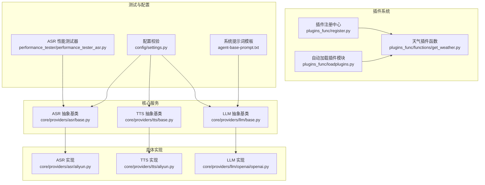
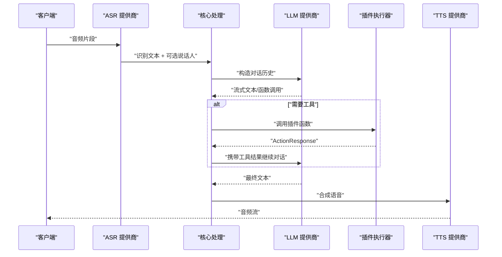
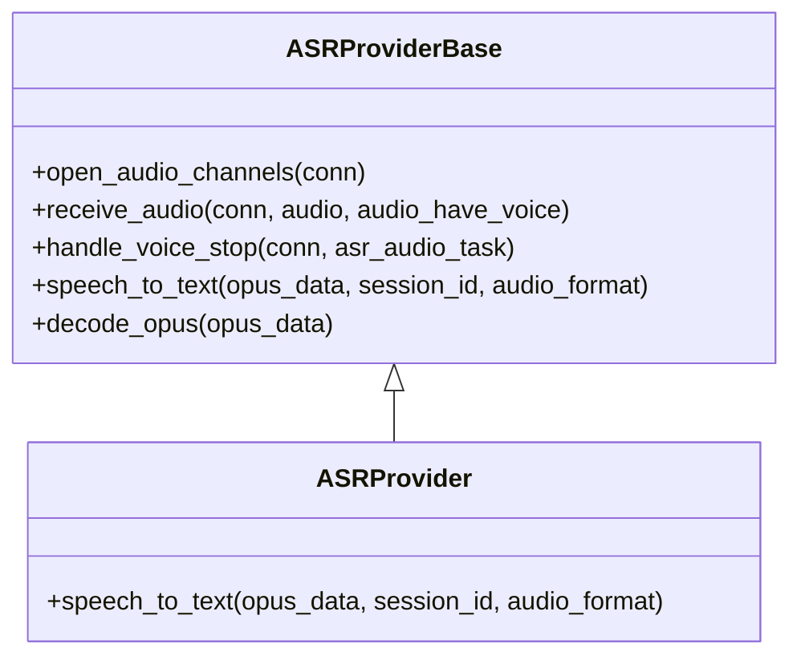
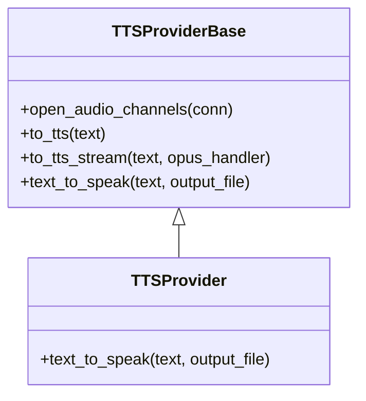
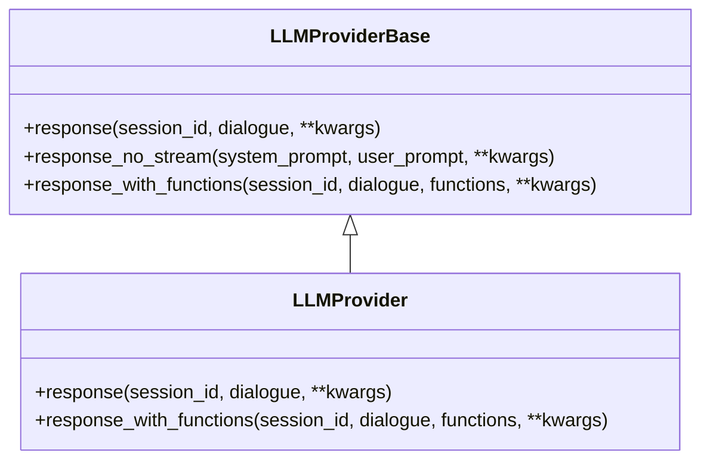
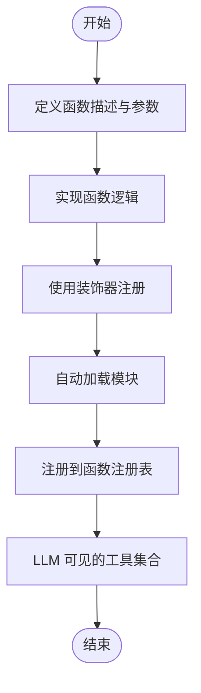
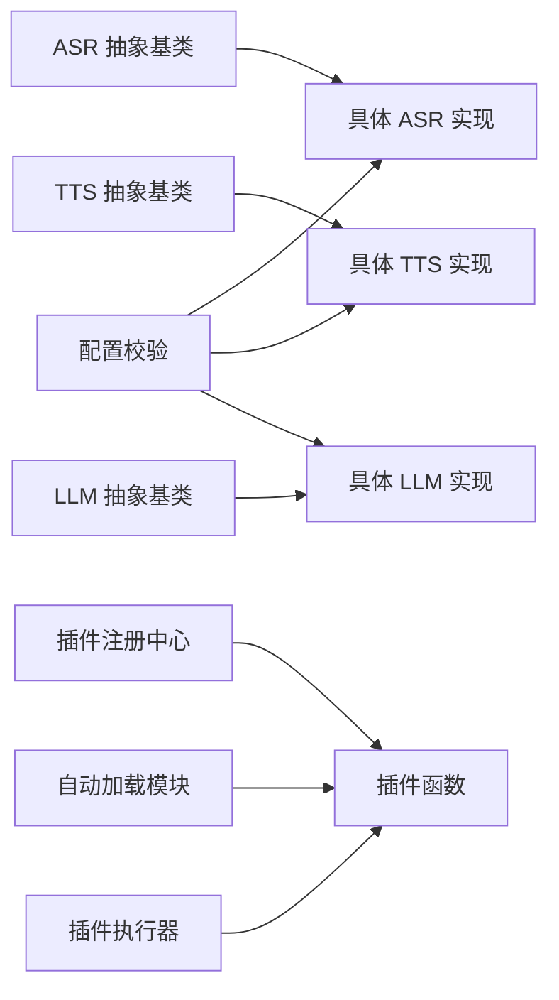

# 开发者指南

<cite>
**本文引用的文件**
- [core/providers/asr/base.py](file://core/providers/asr/base.py)
- [core/providers/asr/aliyun.py](file://core/providers/asr/aliyun.py)
- [core/providers/tts/base.py](file://core/providers/tts/base.py)
- [core/providers/tts/aliyun.py](file://core/providers/tts/aliyun.py)
- [core/providers/llm/base.py](file://core/providers/llm/base.py)
- [core/providers/llm/openai/openai.py](file://core/providers/llm/openai/openai.py)
- [plugins_func/register.py](file://plugins_func/register.py)
- [plugins_func/loadplugins.py](file://plugins_func/loadplugins.py)
- [plugins_func/functions/get_weather.py](file://plugins_func/functions/get_weather.py)
- [agent-base-prompt.txt](file://agent-base-prompt.txt)
- [performance_tester/performance_tester_asr.py](file://performance_tester/performance_tester_asr.py)
- [config/settings.py](file://config/settings.py)
</cite>

## 目录
1. [简介](#简介)
2. [项目结构](#项目结构)
3. [核心组件](#核心组件)
4. [架构总览](#架构总览)
5. [详细组件分析](#详细组件分析)
6. [依赖关系分析](#依赖关系分析)
7. [性能与优化建议](#性能与优化建议)
8. [故障排查指南](#故障排查指南)
9. [结论](#结论)
10. [附录](#附录)

## 简介
本指南面向希望深度定制与扩展 xiaozhi-server 的开发者，围绕以下目标展开：
- 如何新增 ASR/TTS/LLM 提供商，遵循统一基类接口并完成注册；
- 如何开发自定义插件函数，使用装饰器注册并定义函数描述与参数；
- 如何通过 agent-base-prompt.txt 调整系统提示词以改变 LLM 的行为、知识与工具调用偏好；
- 如何进行调试与性能测试，确保扩展功能稳定可靠。

## 项目结构
项目采用“功能域+层次化”的组织方式：
- core/providers：提供 ASR/TTS/LLM/Intent/Memory/VAD 等各类服务的抽象基类与具体实现；
- plugins_func：插件函数注册与加载机制，支持装饰器注册与自动扫描；
- performance_tester：内置性能测试工具，便于对比不同提供商表现；
- config：配置加载与校验逻辑；
- agent-base-prompt.txt：系统提示词模板，用于约束 LLM 的行为与偏好。

图表来源
- [core/providers/asr/base.py](file://core/providers/asr/base.py#L1-L268)
- [core/providers/asr/aliyun.py](file://core/providers/asr/aliyun.py#L1-L249)
- [core/providers/tts/base.py](file://core/providers/tts/base.py#L1-L462)
- [core/providers/tts/aliyun.py](file://core/providers/tts/aliyun.py#L1-L206)
- [core/providers/llm/base.py](file://core/providers/llm/base.py#L1-L40)
- [core/providers/llm/openai/openai.py](file://core/providers/llm/openai/openai.py#L1-L143)
- [plugins_func/register.py](file://plugins_func/register.py#L1-L141)
- [plugins_func/loadplugins.py](file://plugins_func/loadplugins.py#L1-L25)
- [plugins_func/functions/get_weather.py](file://plugins_func/functions/get_weather.py#L1-L228)
- [performance_tester/performance_tester_asr.py](file://performance_tester/performance_tester_asr.py#L1-L354)
- [config/settings.py](file://config/settings.py#L1-L34)
- [agent-base-prompt.txt](file://agent-base-prompt.txt#L1-L79)

章节来源
- [core/providers/asr/base.py](file://core/providers/asr/base.py#L1-L268)
- [core/providers/tts/base.py](file://core/providers/tts/base.py#L1-L462)
- [core/providers/llm/base.py](file://core/providers/llm/base.py#L1-L40)
- [plugins_func/register.py](file://plugins_func/register.py#L1-L141)
- [plugins_func/loadplugins.py](file://plugins_func/loadplugins.py#L1-L25)
- [performance_tester/performance_tester_asr.py](file://performance_tester/performance_tester_asr.py#L1-L354)
- [config/settings.py](file://config/settings.py#L1-L34)
- [agent-base-prompt.txt](file://agent-base-prompt.txt#L1-L79)

## 核心组件
- ASR 抽象基类：定义音频接收、解码、并行识别与声纹联动、结果上报等通用流程，并暴露抽象方法 speech_to_text 供具体提供商实现。
- TTS 抽象基类：定义文本到语音的生成、队列化处理、音频流式输出、播放上报与输出计数等通用流程，并暴露抽象方法 text_to_speak。
- LLM 抽象基类：定义对话生成接口 response 与函数调用接口 response_with_functions，提供默认的非流式响应与函数调用回退策略。
- 插件注册中心：提供装饰器 register_function 与函数注册表，支持插件函数的声明式注册与动态发现。
- 系统提示词模板：通过 agent-base-prompt.txt 定义角色、沟通风格、长度约束、说话人识别、工具调用规则与上下文信息，作为 LLM 的系统提示词基础。

章节来源
- [core/providers/asr/base.py](file://core/providers/asr/base.py#L1-L268)
- [core/providers/tts/base.py](file://core/providers/tts/base.py#L1-L462)
- [core/providers/llm/base.py](file://core/providers/llm/base.py#L1-L40)
- [plugins_func/register.py](file://plugins_func/register.py#L1-L141)
- [agent-base-prompt.txt](file://agent-base-prompt.txt#L1-L79)

## 架构总览
下图展示了从音频输入到 LLM 决策再到 TTS 输出的整体链路，以及插件函数在工具调用阶段的介入点。

图表来源
- [core/providers/asr/base.py](file://core/providers/asr/base.py#L1-L268)
- [core/providers/llm/base.py](file://core/providers/llm/base.py#L1-L40)
- [plugins_func/register.py](file://plugins_func/register.py#L1-L141)
- [core/providers/tts/base.py](file://core/providers/tts/base.py#L1-L462)

## 详细组件分析

### 新增 ASR 提供商
- 继承与实现
  - 继承 ASRProviderBase 并实现抽象方法 speech_to_text，负责将 opus/pcm 音频数据转换为文本，并返回文本与可选的音频文件路径。
  - 可参考现有实现：core/providers/asr/aliyun.py 展示了如何处理鉴权、构造请求、发送 HTTP 请求并解析响应。
- 关键流程
  - 音频接收与解码：基类提供 decode_opus 与 PCM/WAV 转换辅助方法，便于统一处理。
  - 并行识别与声纹联动：基类 handle_voice_stop 支持并行执行 ASR 与声纹识别，提升整体吞吐。
  - 结果上报：识别完成后通过 startToChat 与上报队列进行后续处理。
- 注册与使用
  - 通过配置文件选择提供商类型，系统将按约定实例化对应实现。新增提供商只需保证类名与配置一致即可被加载。

图表来源
- [core/providers/asr/base.py](file://core/providers/asr/base.py#L1-L268)
- [core/providers/asr/aliyun.py](file://core/providers/asr/aliyun.py#L1-L249)

章节来源
- [core/providers/asr/base.py](file://core/providers/asr/base.py#L1-L268)
- [core/providers/asr/aliyun.py](file://core/providers/asr/aliyun.py#L1-L249)

### 新增 TTS 提供商
- 继承与实现
  - 继承 TTSProviderBase 并实现抽象方法 text_to_speak，负责将文本转换为音频（文件或二进制），并在 delete_audio_file 控制下决定是否保留中间文件。
  - 可参考现有实现：core/providers/tts/aliyun.py 展示了鉴权、参数构造、HTTP 请求与音频保存/返回的完整流程。
- 关键流程
  - 文本分段与队列化：基类提供 tts_text_queue 与 tts_audio_queue，支持按标点分段与流式播放。
  - 播放上报与输出计数：基类在音频播放线程中进行上报与计数，确保与业务统计一致。
- 注册与使用
  - 通过配置文件选择提供商类型，系统将按约定实例化对应实现。新增提供商只需保证类名与配置一致即可被加载。

图表来源
- [core/providers/tts/base.py](file://core/providers/tts/base.py#L1-L462)
- [core/providers/tts/aliyun.py](file://core/providers/tts/aliyun.py#L1-L206)

章节来源
- [core/providers/tts/base.py](file://core/providers/tts/base.py#L1-L462)
- [core/providers/tts/aliyun.py](file://core/providers/tts/aliyun.py#L1-L206)

### 新增 LLM 提供商
- 继承与实现
  - 继承 LLMProviderBase 并实现抽象方法 response，负责流式返回文本；如需函数调用，可覆盖 response_with_functions。
  - 可参考现有实现：core/providers/llm/openai/openai.py 展示了如何构造 OpenAI 风格的流式对话与函数调用。
- 关键流程
  - 对话规范化：normalize_dialogue 保证消息结构完整。
  - 参数兼容：支持 temperature、max_tokens、top_p、frequency_penalty 等参数注入。
  - 函数调用：response_with_functions 返回文本与工具调用元组，便于上层决策。
- 注册与使用
  - 通过配置文件选择提供商类型，系统将按约定实例化对应实现。新增提供商只需保证类名与配置一致即可被加载。

图表来源
- [core/providers/llm/base.py](file://core/providers/llm/base.py#L1-L40)
- [core/providers/llm/openai/openai.py](file://core/providers/llm/openai/openai.py#L1-L143)

章节来源
- [core/providers/llm/base.py](file://core/providers/llm/base.py#L1-L40)
- [core/providers/llm/openai/openai.py](file://core/providers/llm/openai/openai.py#L1-L143)

### 开发自定义插件函数
- 插件函数开发步骤
  - 在 plugins_func/functions 下新建 Python 文件，编写函数逻辑；
  - 使用装饰器 register_function("函数名", 函数描述, 工具类型) 进行注册；
  - 函数描述需遵循 OpenAI Function Calling 规范（name/description/parameters），以便 LLM 正确理解与调用；
  - 可通过 ToolType 指定函数类型，如 WAIT、SYSTEM_CTL、IOT_CTL、CHANGE_SYS_PROMPT 等。
- 自动加载机制
  - plugins_func/loadplugins.py 会自动扫描 functions 包内模块并导入，从而触发装饰器注册。
- 示例参考
  - plugins_func/functions/get_weather.py 展示了如何定义函数描述、参数、缓存与 ActionResponse 返回，以及如何根据 ToolType 决定是否需要 conn 参数。

图表来源
- [plugins_func/register.py](file://plugins_func/register.py#L1-L141)
- [plugins_func/loadplugins.py](file://plugins_func/loadplugins.py#L1-L25)
- [plugins_func/functions/get_weather.py](file://plugins_func/functions/get_weather.py#L1-L228)

章节来源
- [plugins_func/register.py](file://plugins_func/register.py#L1-L141)
- [plugins_func/loadplugins.py](file://plugins_func/loadplugins.py#L1-L25)
- [plugins_func/functions/get_weather.py](file://plugins_func/functions/get_weather.py#L1-L228)

### 修改系统提示词（System Prompt）
- agent-base-prompt.txt 是系统提示词模板，包含角色设定、沟通风格、长度约束、说话人识别、工具调用规则与上下文信息。
- 修改建议
  - 仅在模板占位符范围内调整，避免破坏结构；
  - 通过配置注入变量（如 base_prompt、emojiList、current_time、weather_info 等），确保 LLM 能获得实时上下文；
  - 如需切换角色或职责，可使用 ToolType.CHANGE_SYS_PROMPT 与相应插件配合，动态变更系统提示词。
- 影响范围
  - 直接影响 LLM 的行为偏好、知识边界与工具调用倾向，建议在灰度环境中验证效果。

章节来源
- [agent-base-prompt.txt](file://agent-base-prompt.txt#L1-L79)

## 依赖关系分析
- 抽象基类与具体实现
  - ASRProviderBase 与 TTSProviderBase、LLMProviderBase 分别定义了统一接口，具体提供商只需实现抽象方法；
  - 具体实现（如 aliyun、openai）均继承对应基类，遵循统一的生命周期与错误处理策略。
- 插件系统
  - register.py 提供装饰器与注册表，loadplugins.py 负责自动导入模块；
  - server_plugins/plugin_executor.py 通过 all_function_registry 查找并执行插件函数，依据 ToolType 决定调用方式。
- 配置与校验
  - config/settings.py 提供配置文件存在性与来源校验，确保从 API 或本地配置正确加载。

图表来源
- [core/providers/asr/base.py](file://core/providers/asr/base.py#L1-L268)
- [core/providers/asr/aliyun.py](file://core/providers/asr/aliyun.py#L1-L249)
- [core/providers/tts/base.py](file://core/providers/tts/base.py#L1-L462)
- [core/providers/tts/aliyun.py](file://core/providers/tts/aliyun.py#L1-L206)
- [core/providers/llm/base.py](file://core/providers/llm/base.py#L1-L40)
- [core/providers/llm/openai/openai.py](file://core/providers/llm/openai/openai.py#L1-L143)
- [plugins_func/register.py](file://plugins_func/register.py#L1-L141)
- [plugins_func/loadplugins.py](file://plugins_func/loadplugins.py#L1-L25)
- [config/settings.py](file://config/settings.py#L1-L34)

章节来源
- [core/providers/asr/base.py](file://core/providers/asr/base.py#L1-L268)
- [core/providers/tts/base.py](file://core/providers/tts/base.py#L1-L462)
- [core/providers/llm/base.py](file://core/providers/llm/base.py#L1-L40)
- [plugins_func/register.py](file://plugins_func/register.py#L1-L141)
- [plugins_func/loadplugins.py](file://plugins_func/loadplugins.py#L1-L25)
- [config/settings.py](file://config/settings.py#L1-L34)

## 性能与优化建议
- 性能测试
  - 使用 performance_tester/performance_tester_asr.py 对 ASR 提供商进行批量测试，支持超时控制、错误过滤与结果排序；
  - 建议在本地准备多段 WAV 音频样本，确保测试覆盖不同长度与噪声环境。
- 日志与可观测性
  - 基类与具体实现普遍使用 setup_logging，建议在新增提供商时保持一致的日志级别与字段，便于问题定位；
  - 对关键路径（解码、网络请求、音频保存/返回）增加耗时统计，有助于性能瓶颈识别。
- 并发与资源
  - ASR/TTS 基类已内置线程与队列机制，新增提供商应尽量复用这些机制，避免阻塞主线程；
  - 注意外部 API 的限流与鉴权有效期，必要时实现自动刷新与重试策略。

章节来源
- [performance_tester/performance_tester_asr.py](file://performance_tester/performance_tester_asr.py#L1-L354)
- [core/providers/asr/base.py](file://core/providers/asr/base.py#L1-L268)
- [core/providers/tts/base.py](file://core/providers/tts/base.py#L1-L462)

## 故障排查指南
- 配置问题
  - 使用 config/settings.py 的校验逻辑，确认 data/.config.yaml 存在且来源正确；
  - 若启用从 API 读取配置，注意避免本地与远程配置冲突。
- 插件未生效
  - 确认插件文件位于 plugins_func/functions 下，且已通过装饰器注册；
  - 检查 plugins_func/loadplugins.py 是否被调用，确保模块被自动导入。
- ASR/TTS/LLM 无法连接
  - 检查鉴权参数（如 access_key、token、api_key）是否正确；
  - 使用性能测试器进行连通性测试，观察超时与 502 错误；
  - 在日志中查看异常堆栈，定位网络或参数问题。
- 工具调用失败
  - 确认函数描述符合 OpenAI Function Calling 规范；
  - 检查 ToolType 与调用方式（是否需要 conn 参数）；
  - 使用 ActionResponse 返回标准结果，便于上层处理。

章节来源
- [config/settings.py](file://config/settings.py#L1-L34)
- [plugins_func/register.py](file://plugins_func/register.py#L1-L141)
- [plugins_func/loadplugins.py](file://plugins_func/loadplugins.py#L1-L25)
- [performance_tester/performance_tester_asr.py](file://performance_tester/performance_tester_asr.py#L1-L354)

## 结论
通过遵循统一的抽象基类接口、使用装饰器与自动加载机制、以及基于 agent-base-prompt.txt 的系统提示词定制，开发者可以快速、安全地扩展 ASR/TTS/LLM 与插件体系。配合内置性能测试与日志体系，可在上线前充分验证稳定性与性能表现。

## 附录
- 新增提供商的最小步骤清单
  - 继承对应抽象基类并实现抽象方法；
  - 在配置中选择新提供商类型；
  - 如涉及外部 API，实现鉴权与重试逻辑；
  - 补充必要的日志与错误处理；
  - 使用性能测试器进行回归测试。
- 新增插件函数的最小步骤清单
  - 在 plugins_func/functions 下新建文件；
  - 使用 register_function 装饰器注册；
  - 定义规范的函数描述与参数；
  - 在插件执行器中验证调用链路。