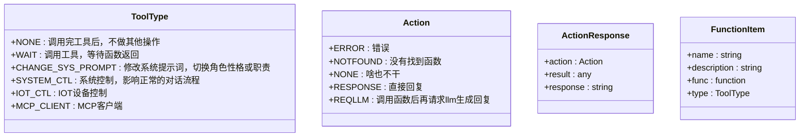
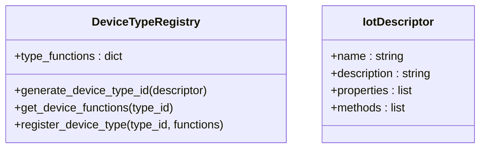
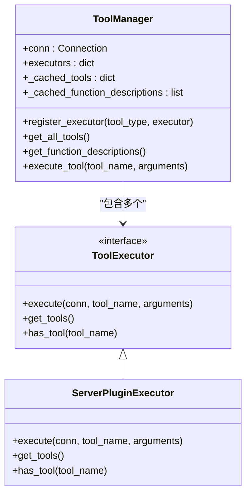
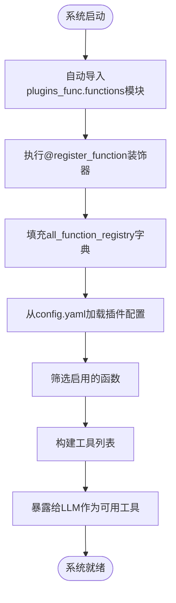
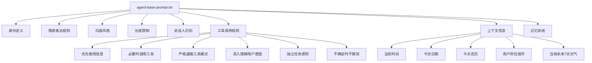
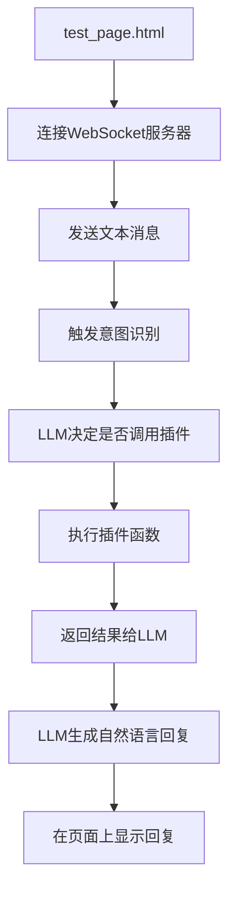

# 开发自定义插件

<cite>
**本文档中引用的文件**  
- [register.py](file://plugins_func/register.py)
- [loadplugins.py](file://plugins_func/loadplugins.py)
- [get_weather.py](file://plugins_func/functions/get_weather.py)
- [get_time.py](file://plugins_func/functions/get_time.py)
- [change_role.py](file://plugins_func/functions/change_role.py)
- [play_music.py](file://plugins_func/functions/play_music.py)
- [unified_tool_manager.py](file://core/providers/tools/unified_tool_manager.py)
- [plugin_executor.py](file://core/providers/tools/server_plugins/plugin_executor.py)
- [tool_types.py](file://core/providers/tools/base/tool_types.py)
- [iot_descriptor.py](file://core/providers/tools/device_iot/iot_descriptor.py)
- [agent-base-prompt.txt](file://agent-base-prompt.txt)
- [app.py](file://app.py)
- [config.yaml](file://config.yaml)
- [test_page.html](file://test/test_page.html)
</cite>

## 目录
1. [简介](#简介)
2. [插件注册机制](#插件注册机制)
3. [开发示例：查询股票价格插件](#开发示例查询股票价格插件)
4. [IoT设备级别函数注册](#iot设备级别函数注册)
5. [插件与LLM集成](#插件与llm集成)
6. [系统提示词配置](#系统提示词配置)
7. [调试与验证](#调试与验证)
8. [结论](#结论)

## 简介
本文档旨在为开发者提供一份全面的自定义插件开发指南。我们将详细介绍如何在系统中创建和注册自定义插件，包括使用装饰器注册函数、理解不同工具类型的行为影响、开发实际插件示例、注册IoT设备级别函数、与LLM集成以及调试验证流程。

**本文档中引用的文件**  
- [register.py](file://plugins_func/register.py)
- [loadplugins.py](file://plugins_func/loadplugins.py)

## 插件注册机制

### 插件目录结构
开发者需要在 `plugins_func/functions` 目录下创建新的Python文件来实现自定义插件功能。该目录下的所有模块会在系统启动时被自动加载。

### register_function装饰器
系统提供了 `register.py` 文件中的 `@register_function` 装饰器来注册函数。该装饰器接受三个参数：

- **name**: 函数的唯一标识名称
- **desc**: 函数的描述信息，用于LLM理解函数用途
- **type**: 工具类型，决定函数调用后的行为



**Diagram sources**
- [register.py](file://plugins_func/register.py#L9-L19)
- [register.py](file://plugins_func/register.py#L25-L31)
- [register.py](file://plugins_func/register.py#L37-L42)
- [register.py](file://plugins_func/register.py#L44-L49)

### 工具类型详解
不同的 `ToolType` 枚举值对调用行为有重要影响：

- **ToolType.NONE**: 调用完工具后不做其他操作
- **ToolType.WAIT**: 调用工具并等待函数返回结果
- **ToolType.CHANGE_SYS_PROMPT**: 修改系统提示词，用于切换角色或性格
- **ToolType.SYSTEM_CTL**: 系统控制类，影响正常对话流程（如退出、播放音乐等），需要传递conn参数
- **ToolType.IOT_CTL**: IoT设备控制类，需要传递conn参数
- **ToolType.MCP_CLIENT**: MCP客户端类型

**Section sources**
- [register.py](file://plugins_func/register.py#L9-L19)

## 开发示例：查询股票价格插件

### 创建插件文件
首先，在 `plugins_func/functions` 目录下创建名为 `get_stock_price.py` 的新文件。

### 定义函数描述
```python
GET_STOCK_PRICE_FUNCTION_DESC = {
    "type": "function",
    "function": {
        "name": "get_stock_price",
        "description": (
            "获取指定股票代码的实时价格信息。"
            "用户应提供股票代码，例如'AAPL'表示苹果公司。"
            "支持美股、港股和A股市场。"
        ),
        "parameters": {
            "type": "object",
            "properties": {
                "stock_code": {
                    "type": "string",
                    "description": "股票代码，例如AAPL、0700.HK、600519.SH"
                },
                "market": {
                    "type": "string",
                    "description": "股票市场，可选值：us（美股）、hk（港股）、sh/sz（A股）"
                }
            },
            "required": ["stock_code"]
        }
    }
}
```

### 实现函数逻辑
```python
@register_function("get_stock_price", GET_STOCK_PRICE_FUNCTION_DESC, ToolType.SYSTEM_CTL)
def get_stock_price(conn, stock_code: str, market: str = "us"):
    """
    获取指定股票的实时价格
    """
    # 从配置中获取API密钥
    api_key = conn.config["plugins"]["get_stock_price"].get("api_key", "your_default_key")
    
    # 构建API请求
    url = f"https://api.stockdata.com/v1/quote/{stock_code}?market={market}&token={api_key}"
    
    try:
        response = requests.get(url)
        if response.status_code == 200:
            data = response.json()
            price = data.get("price", "未知")
            change = data.get("change", "0")
            change_percent = data.get("change_percent", "0%")
            
            result = f"股票 {stock_code} 的当前价格为 {price}，涨跌 {change} ({change_percent})"
            return ActionResponse(Action.REQLLM, result, None)
        else:
            return ActionResponse(Action.REQLLM, f"获取股票价格失败: {response.status_code}", None)
    except Exception as e:
        return ActionResponse(Action.ERROR, str(e), "查询股票价格时发生错误")
```

### 返回ActionResponse对象
插件函数必须返回 `ActionResponse` 对象，该对象包含三个属性：

- **action**: 动作类型（Action枚举）
- **result**: 动作产生的结果
- **response**: 直接回复的内容

**Section sources**
- [register.py](file://plugins_func/register.py#L37-L42)
- [get_weather.py](file://plugins_func/functions/get_weather.py#L157-L228)

## IoT设备级别函数注册

### DeviceTypeRegistry类
系统提供了 `DeviceTypeRegistry` 类来管理IoT设备级别的函数注册。该类允许根据设备能力描述生成唯一的设备类型ID，并注册相应的函数。



**Diagram sources**
- [register.py](file://plugins_func/register.py#L52-L76)
- [iot_descriptor.py](file://core/providers/tools/device_iot/iot_descriptor.py#L9-L47)

### 设备类型ID生成
`generate_device_type_id` 方法通过设备的名称、属性和方法组合生成唯一的类型标识：

```python
def generate_device_type_id(self, descriptor):
    """通过设备能力描述生成类型ID"""
    properties = sorted(descriptor["properties"].keys())
    methods = sorted(descriptor["methods"].keys())
    # 使用属性和方法的组合作为设备类型的唯一标识
    type_signature = f"{descriptor['name']}:{','.join(properties)}:{','.join(methods)}"
    return type_signature
```

### 注册设备级别函数
虽然系统提供了 `register_device_function` 装饰器，但目前主要使用 `register_function` 装饰器配合 `ToolType.IOT_CTL` 类型来注册IoT设备控制函数。

**Section sources**
- [register.py](file://plugins_func/register.py#L58-L66)
- [iot_descriptor.py](file://core/providers/tools/device_iot/iot_descriptor.py#L12-L47)

## 插件与LLM集成

### 工具管理器架构
系统使用 `ToolManager` 统一管理所有类型的工具，包括服务端插件、MCP工具和IoT设备工具。



**Diagram sources**
- [unified_tool_manager.py](file://core/providers/tools/unified_tool_manager.py#L9-L125)
- [plugin_executor.py](file://core/providers/tools/server_plugins/plugin_executor.py#L8-L98)

### 工具发现与注册流程
1. 系统启动时，`unified_tool_handler.py` 中的 `_initialize` 方法会自动导入 `plugins_func.functions` 模块
2. 所有使用 `@register_function` 装饰的函数会被注册到 `all_function_registry` 全局字典中
3. `ServerPluginExecutor` 从配置中读取需要启用的函数列表
4. `ToolManager` 收集所有工具的描述信息，供LLM使用



**Diagram sources**
- [unified_tool_handler.py](file://core/providers/tools/unified_tool_handler.py#L56-L78)
- [plugin_executor.py](file://core/providers/tools/server_plugins/plugin_executor.py#L49-L92)
- [connection.py](file://core/connection.py#L582-L590)

**Section sources**
- [unified_tool_handler.py](file://core/providers/tools/unified_tool_handler.py#L56-L78)
- [plugin_executor.py](file://core/providers/tools/server_plugins/plugin_executor.py#L49-L92)

## 系统提示词配置

### agent-base-prompt.txt的作用
`agent-base-prompt.txt` 文件定义了LLM的系统提示词模板，指导LLM如何与用户交互以及何时调用工具。



**Diagram sources**
- [agent-base-prompt.txt](file://agent-base-prompt.txt#L1-L79)

### 修改系统提示词引导插件使用
开发者可以通过修改 `agent-base-prompt.txt` 中的 `<tool_calling>` 部分来引导LLM优先使用新开发的插件：

```text
<tool_calling>
【核心原则】优先利用`<context>`信息，**仅在必要时调用工具**，调用后需用自然语言解释结果（绝口不提工具名）。
- **调用规则：**
  1. **严格模式：** 调用时**必须**严格遵循工具要求的模式，提供**所有必要参数**。
  2. **可用性：** **绝不调用**未明确提供的工具。
  3. **洞察需求：** 结合上下文**深入理解用户真实意图**后再决定调用。
  4. **独立任务：** 除`<context>`已涵盖信息外，用户每个要求都视为**独立任务**。
  5. **不确定时：** **切勿猜测或编造答案**。
- **需要调用的情况（示例）：**
  - 查询**非今天**的农历
  - 查询**详细农历信息**（宜忌、八字、节气等）
  - 除上述例外外的**任何其他信息或操作请求**
  - 当用户询问股票价格时，必须调用get_stock_price工具
</tool_calling>
```

**Section sources**
- [agent-base-prompt.txt](file://agent-base-prompt.txt#L51-L67)

## 调试与验证

### 日志调试
在 `register.py` 中添加日志可以帮助确认插件是否成功加载：

```python
def register_function(name, desc, type=None):
    """注册函数到函数注册字典的装饰器"""
    def decorator(func):
        all_function_registry[name] = FunctionItem(name, desc, func, type)
        logger.bind(tag=TAG).debug(f"函数 '{name}' 已加载，可以注册使用")
        return func
    return decorator
```

### 测试页面验证
系统提供了 `test/test_page.html` 测试页面用于端到端验证：



**Diagram sources**
- [test_page.html](file://test/test_page.html#L1-L228)

### 配置文件设置
确保在 `config.yaml` 中正确配置插件：

```yaml
plugins:
  get_stock_price:
    api_key: "your_stock_api_key"
    default_market: "us"
    
Intent:
  Intent_function_call:
    type: "function_call"
    functions:
      - "get_weather"
      - "get_lunar"
      - "get_stock_price"
```

**Section sources**
- [config.yaml](file://config.yaml#L117-L140)
- [test_page.html](file://test/test_page.html#L1-L228)

## 结论
通过本指南，开发者可以全面了解如何在系统中开发自定义插件。关键要点包括：

1. 在 `plugins_func/functions` 目录下创建插件文件
2. 使用 `@register_function` 装饰器注册函数，正确设置name、desc和type参数
3. 理解不同 `ToolType` 对调用行为的影响
4. 返回正确的 `ActionResponse` 对象
5. 通过 `agent-base-prompt.txt` 引导LLM使用新插件
6. 使用测试页面进行端到端验证

遵循这些步骤，开发者可以成功创建功能丰富且与LLM良好集成的自定义插件。