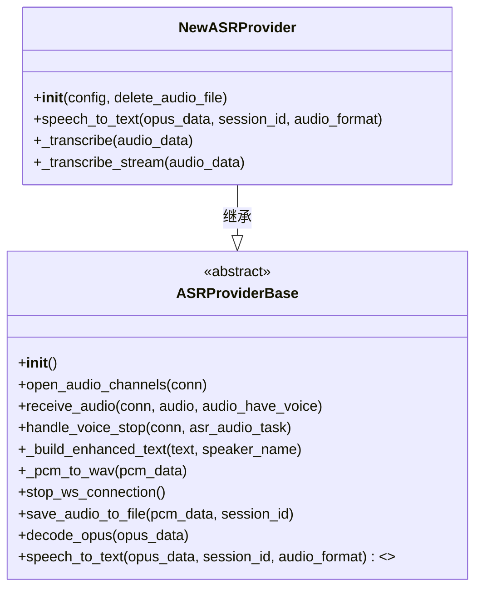
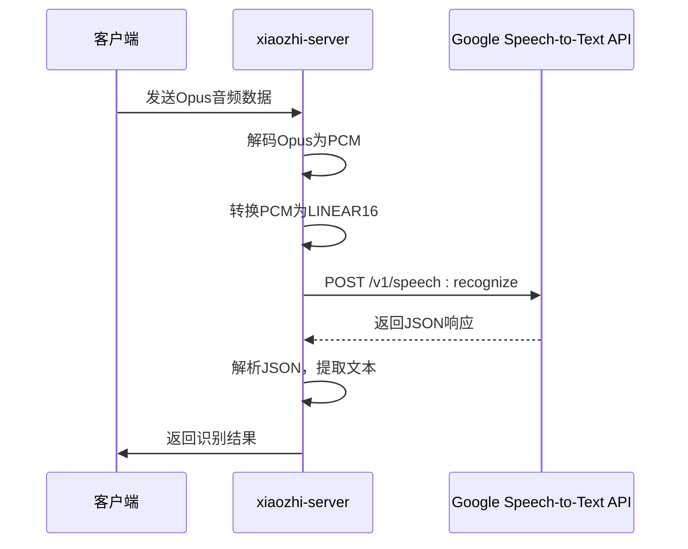
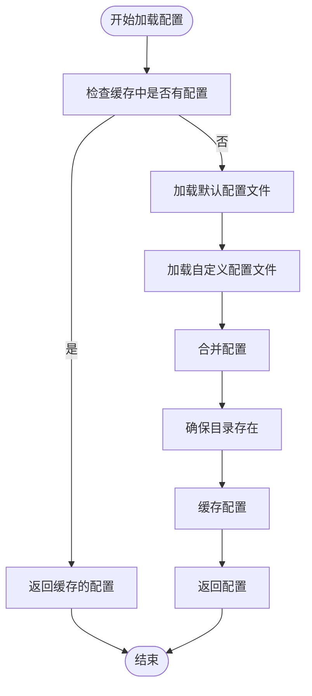
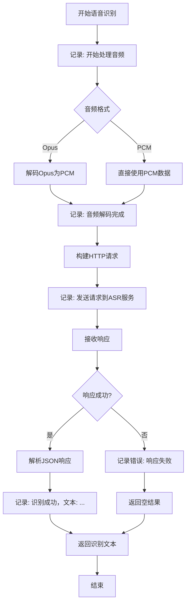
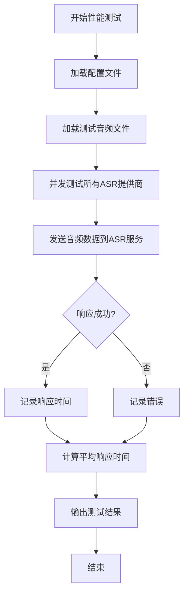

# 扩展ASR提供商

<cite>
**本文档引用的文件**
- [base.py](file://core/providers/asr/base.py)
- [config_loader.py](file://config/config_loader.py)
- [logger.py](file://config/logger.py)
- [performance_tester_asr.py](file://performance_tester/performance_tester_asr.py)
- [config.yaml](file://config.yaml)
- [baidu.py](file://core/providers/asr/baidu.py)
- [aliyun.py](file://core/providers/asr/aliyun.py)
- [openai.py](file://core/providers/asr/openai.py)
- [doubao_stream.py](file://core/providers/asr/doubao_stream.py)
- [xunfei_stream.py](file://core/providers/asr/xunfei_stream.py)
</cite>

## 目录
1. [引言](#引言)
2. [继承基础类并实现核心方法](#继承基础类并实现核心方法)
3. [对接Google Speech-to-Text API示例](#对接google-speech-to-text-api示例)
4. [配置管理](#配置管理)
5. [日志记录](#日志记录)
6. [性能基准测试](#性能基准测试)
7. [常见问题排查](#常见问题排查)
8. [结论](#结论)

## 引言
本文档旨在为开发者提供一份详尽的技术指南，指导如何为xiaozhi-server项目扩展新的语音识别（ASR）服务提供商。通过本指南，开发者将学习到如何继承核心基类、实现必要的方法、配置新服务、记录日志以及进行性能测试。文档将涵盖从代码实现到系统集成的全过程，确保新提供商能够无缝集成到现有系统中。

## 继承基础类并实现核心方法
要扩展新的ASR提供商，开发者必须继承位于`core/providers/asr/base.py`中的`ASRProviderBase`抽象基类，并实现其核心方法。该基类定义了所有ASR提供商必须遵循的接口和行为。

### 核心方法实现
`ASRProviderBase`类中定义了两个关键的抽象方法：`_transcribe`用于非流式识别，`_transcribe_stream`用于流式识别。开发者需要根据所对接的ASR服务API特性来实现这两个方法。



**Diagram sources**
- [base.py](file://core/providers/asr/base.py#L25-L239)

**Section sources**
- [base.py](file://core/providers/asr/base.py#L25-L239)

## 对接Google Speech-to-Text API示例
本节将提供一个完整的代码示例，展示如何对接Google Speech-to-Text API。示例将涵盖认证机制、HTTP请求构建、音频格式处理以及JSON响应解析。

### 认证机制
Google Speech-to-Text API使用API密钥进行认证。开发者需要在配置文件中提供API密钥，并在请求头中包含该密钥。

### HTTP请求构建
使用`aiohttp`库构建HTTP请求，发送音频数据到Google Speech-to-Text API端点。请求体包含音频数据和配置参数。

### 音频格式处理
服务器接收的音频数据为Opus格式，需要先解码为PCM格式，再转换为Google API要求的格式（如LINEAR16）。

### JSON响应解析
解析API返回的JSON响应，提取识别出的文本内容。处理可能的错误状态码，如400（无效请求）或401（未授权）。



**Diagram sources**
- [openai.py](file://core/providers/asr/openai.py#L24-L83)
- [baidu.py](file://core/providers/asr/baidu.py#L32-L86)

**Section sources**
- [openai.py](file://core/providers/asr/openai.py#L24-L83)
- [baidu.py](file://core/providers/asr/baidu.py#L32-L86)

## 配置管理
新ASR提供商的配置项需要在`config.yaml`文件中定义，并通过`config_loader.py`加载。配置项通常包括API密钥、端点URL、模型名称等。

### 配置项定义
在`config.yaml`中为新提供商添加配置节，例如：

```yaml
ASR:
  GoogleASR:
    type: google
    api_key: your_google_api_key
    endpoint: https://speech.googleapis.com/v1/speech:recognize
    model: default
    output_dir: tmp/
```

### 配置加载
`config_loader.py`中的`load_config`函数负责加载和合并配置文件。它首先检查缓存，然后加载默认配置和自定义配置，最后合并两者。



**Diagram sources**
- [config_loader.py](file://config/config_loader.py#L18-L44)

**Section sources**
- [config_loader.py](file://config/config_loader.py#L18-L44)
- [config.yaml](file://config.yaml#L277-L448)

## 日志记录
日志记录对于追踪请求与响应、调试问题至关重要。开发者应在`logger.py`中添加调试信息，记录关键操作和错误。

### 添加调试信息
在关键方法中添加日志记录，例如在发送请求前和接收响应后。使用`logger.debug`记录详细信息，`logger.info`记录重要事件，`logger.error`记录错误。



**Diagram sources**
- [logger.py](file://config/logger.py#L48-L109)

**Section sources**
- [logger.py](file://config/logger.py#L48-L109)

## 性能基准测试
使用`performance_tester/performance_tester_asr.py`对新提供商进行性能基准测试，比较识别准确率和延迟。

### 测试流程
1. 加载配置文件中的ASR提供商配置。
2. 加载测试用的音频文件。
3. 对每个提供商并发执行测试。
4. 记录每个请求的响应时间。
5. 计算平均响应时间和成功率。
6. 输出测试结果表格。



**Diagram sources**
- [performance_tester_asr.py](file://performance_tester/performance_tester_asr.py#L17-L354)

**Section sources**
- [performance_tester_asr.py](file://performance_tester/performance_tester_asr.py#L17-L354)

## 常见问题排查
本节将列出并解决在扩展ASR提供商时可能遇到的常见问题。

### 音频编码不兼容
确保音频数据被正确解码和编码。使用`opuslib_next`库解码Opus数据，并根据目标API要求转换为适当格式。

### 认证失败
检查API密钥是否正确配置，请求头是否包含正确的认证信息。对于OAuth，确保令牌未过期。

### 超时和重试逻辑
实现超时控制和重试机制。在请求失败时，根据错误类型决定是否重试，避免无限重试。

## 结论
通过遵循本指南，开发者可以成功扩展新的ASR提供商到xiaozhi-server项目中。关键步骤包括继承`ASRProviderBase`类、实现核心方法、正确配置服务、记录日志以及进行性能测试。遵循这些步骤将确保新提供商的稳定性和性能。