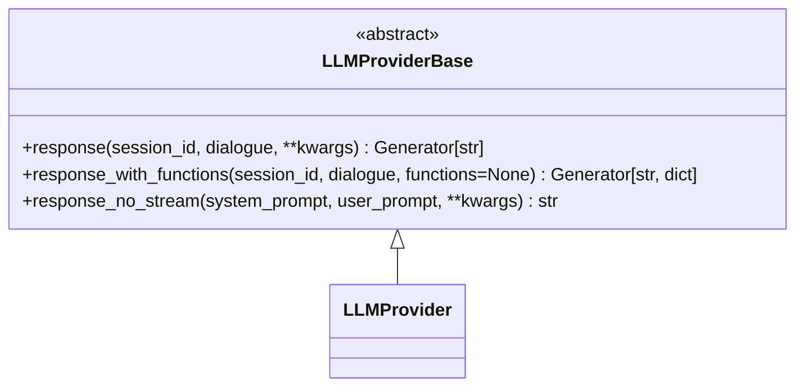
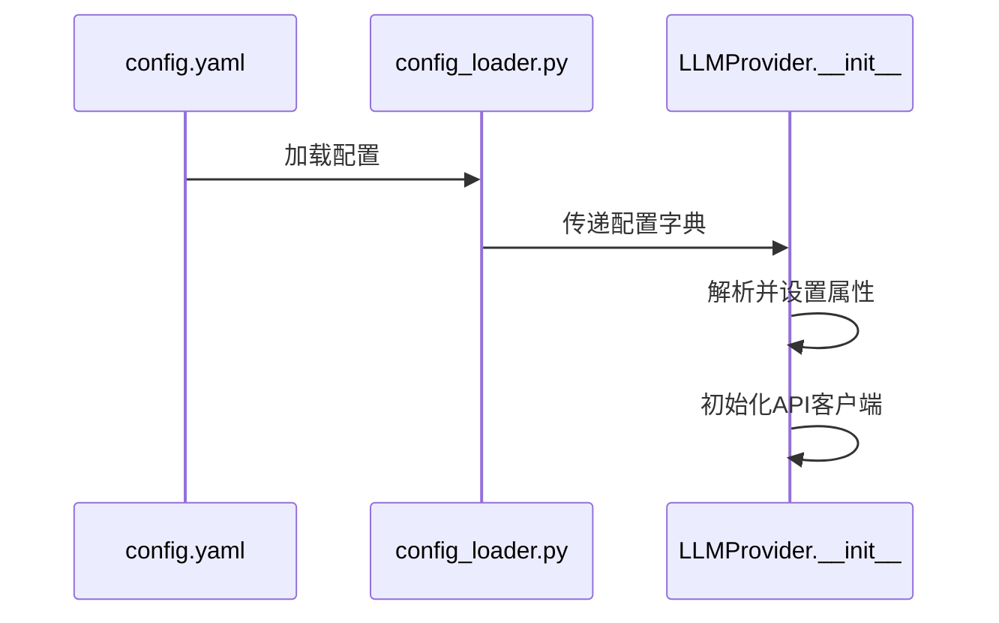
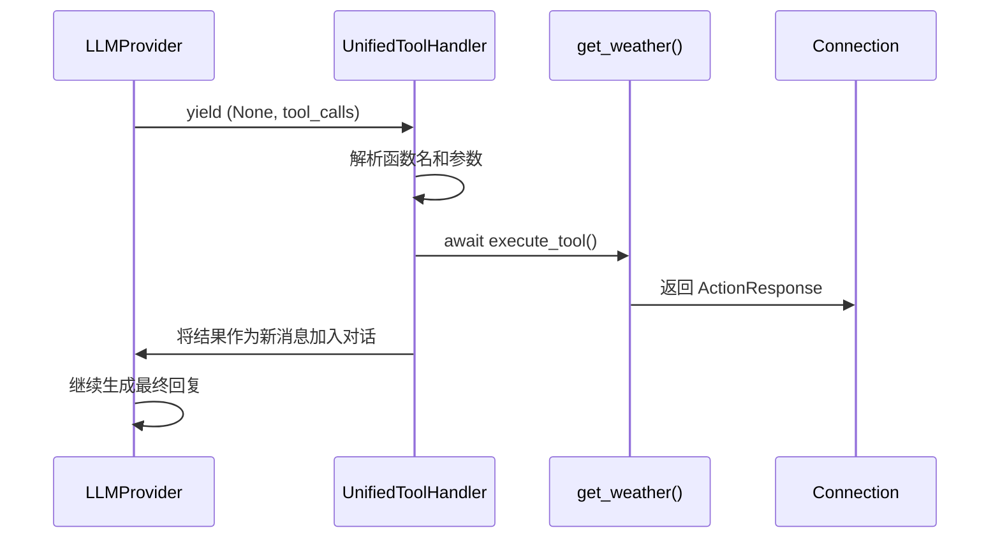
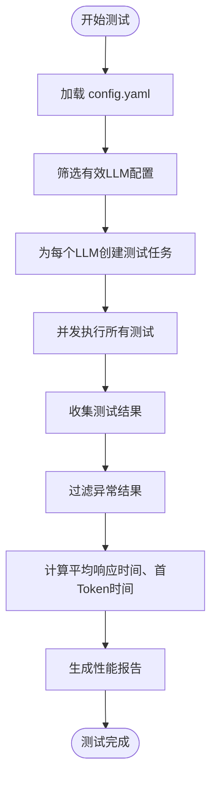

# 扩展LLM提供商

<cite>
**本文档引用的文件**
- [base.py](file://core/providers/llm/base.py)
- [openai.py](file://core/providers/llm/openai/openai.py)
- [gemini.py](file://core/providers/llm/gemini/gemini.py)
- [ollama.py](file://core/providers/llm/ollama/ollama.py)
- [function_call.py](file://core/providers/intent/function_call/function_call.py)
- [config_loader.py](file://config/config_loader.py)
- [settings.py](file://config/settings.py)
- [textMessageProcessor.py](file://core/handle/textMessageProcessor.py)
- [textHandle.py](file://core/handle/textHandle.py)
- [performance_tester_llm.py](file://performance_tester/performance_tester_llm.py)
- [register.py](file://plugins_func/register.py)
- [loadplugins.py](file://plugins_func/loadplugins.py)
- [config.yaml](file://config.yaml)
- [get_weather.py](file://plugins_func/functions/get_weather.py)
- [play_music.py](file://plugins_func/functions/play_music.py)
</cite>

## 目录
1. [引言](#引言)
2. [核心基类与抽象方法](#核心基类与抽象方法)
3. [实现新的LLM提供商](#实现新的llm提供商)
4. [函数调用（Function Calling）实现模式](#函数调用function-calling实现模式)
5. [配置与集成](#配置与集成)
6. [错误处理与流式中断](#错误处理与流式中断)
7. [性能测试与评估](#性能测试与评估)
8. [日志记录与调试](#日志记录与调试)
9. [总结](#总结)

## 引言

本文档旨在为开发者提供一份详尽的指南，指导如何为系统添加新的大语言模型（LLM）服务提供商。系统采用模块化设计，通过继承核心基类并实现特定方法，可以轻松集成不同的LLM服务。本文将深入探讨从代码实现、配置管理到性能评估的完整流程，确保开发者能够高效、准确地扩展系统功能。

**Section sources**
- [base.py](file://core/providers/llm/base.py#L1-L40)
- [config.yaml](file://config.yaml#L1-L100)

## 核心基类与抽象方法

所有LLM提供商都必须继承位于 `core/providers/llm/base.py` 的 `LLMProviderBase` 抽象基类。该基类定义了所有LLM提供商必须实现的核心接口，确保了系统的一致性和可扩展性。

`LLMProviderBase` 类中最重要的两个抽象方法是：
- `_complete`：用于同步生成文本响应。
- `_complete_stream`：用于流式生成文本响应，逐块处理并返回结果。

在本系统中，这些方法的具体实现被命名为 `response` 和 `response_with_functions`。`response` 方法是生成流式文本响应的核心，而 `response_with_functions` 则是支持函数调用（Function Calling）的关键方法，它允许LLM在生成响应时请求执行外部工具。



**Diagram sources**
- [base.py](file://core/providers/llm/base.py#L7-L39)

**Section sources**
- [base.py](file://core/providers/llm/base.py#L1-L40)

## 实现新的LLM提供商

要添加一个新的LLM提供商，开发者需要在 `core/providers/llm/` 目录下创建一个新的子目录（例如 `anthropic/`），并在其中创建一个 `anthropic.py` 文件。该文件必须定义一个继承自 `LLMProviderBase` 的类，并实现其抽象方法。

### 初始化与配置

每个LLM提供商的 `__init__` 方法负责接收配置参数并初始化客户端。配置参数通常包括 `api_key`、`base_url`、`model_name` 以及各种生成参数（如 `temperature`、`max_tokens` 等）。这些参数直接从 `config.yaml` 文件中读取。



**Diagram sources**
- [config.yaml](file://config.yaml#L477-L610)
- [config_loader.py](file://config/config_loader.py#L1-L152)
- [openai.py](file://core/providers/llm/openai/openai.py#L12-L48)

### 同步与流式响应生成

`response` 方法是生成流式响应的核心。它接收一个对话历史（`dialogue`）列表，并返回一个生成器（generator），该生成器会逐块（chunk）产生响应文本。实现时，需要使用LLM提供商的API客户端，设置 `stream=True`，然后迭代响应流。

```python
def response(self, session_id, dialogue, **kwargs):
    # 构建请求参数
    request_params = {
        "model": self.model_name,
        "messages": dialogue,
        "stream": True,
        # ... 其他可选参数
    }
    
    # 发起流式请求
    responses = self.client.chat.completions.create(**request_params)
    
    # 逐块处理响应
    for chunk in responses:
        content = extract_content_from_chunk(chunk)
        if content:
            yield content  # 产出文本块
```

**Section sources**
- [openai.py](file://core/providers/llm/openai/openai.py#L58-L101)
- [gemini.py](file://core/providers/llm/gemini/gemini.py#L122-L214)
- [ollama.py](file://core/providers/llm/ollama/ollama.py#L27-L94)

### 函数调用（Function Calling）实现

`response_with_functions` 方法用于支持函数调用。它与 `response` 方法类似，但额外接收一个 `functions` 参数，该参数是一个描述可用工具的列表。当LLM决定调用一个工具时，它会返回一个包含工具调用信息的特殊响应。

```python
def response_with_functions(self, session_id, dialogue, functions=None):
    # 构建包含工具信息的请求
    request_params = {
        "model": self.model_name,
        "messages": dialogue,
        "stream": True,
        "tools": functions,  # 传递工具定义
    }
    
    stream = self.client.chat.completions.create(**request_params)
    
    for chunk in stream:
        if chunk contains tool call:
            tool_calls = extract_tool_calls_from_chunk(chunk)
            yield None, tool_calls  # 产出工具调用，文本为None
        else:
            content = extract_content_from_chunk(chunk)
            yield content, None  # 产出文本，工具调用为None
```

**Section sources**
- [openai.py](file://core/providers/llm/openai/openai.py#L102-L143)
- [gemini.py](file://core/providers/llm/gemini/gemini.py#L125-L214)

## 函数调用（Function Calling）实现模式

函数调用能力是系统实现智能交互的核心。其工作流程涉及LLM、工具注册、工具执行和结果聚合。

### 工具注册

系统中的所有可调用函数都位于 `plugins_func/functions/` 目录下。每个函数都使用 `@register_function` 装饰器进行注册。该装饰器将函数的名称、描述和类型（`ToolType`）注册到全局的 `all_function_registry` 中。

```python
@register_function("get_weather", GET_WEATHER_FUNCTION_DESC, ToolType.SYSTEM_CTL)
def get_weather(conn, location: str = None, lang: str = "zh_CN"):
    # 函数实现
    ...
```

`GET_WEATHER_FUNCTION_DESC` 是一个符合OpenAI函数调用规范的字典，它描述了函数的名称、功能和参数。

**Section sources**
- [register.py](file://plugins_func/register.py#L82-L90)
- [get_weather.py](file://plugins_func/functions/get_weather.py#L10-L34)
- [get_weather.py](file://plugins_func/functions/get_weather.py#L157-L228)

### 工具调用流程

当LLM返回一个工具调用请求时，系统会通过 `UnifiedToolHandler` 来处理。该处理器会查找已注册的函数，执行它，并将结果返回给LLM以生成最终回复。



**Diagram sources**
- [unified_tool_handler.py](file://core/providers/tools/unified_tool_handler.py#L140-L171)
- [register.py](file://plugins_func/register.py#L37-L42)
- [connection.py](file://core/connection.py#L910-L942)

## 配置与集成

新的LLM提供商需要在 `config.yaml` 文件中进行配置，并在 `selected_module` 中被选中。

### 配置文件

在 `config.yaml` 的 `LLM` 部分添加一个新的条目，例如 `AnthropicLLM`：

```yaml
LLM:
  AnthropicLLM:
    type: anthropic  # 必须与文件夹名一致
    api_key: your_anthropic_api_key
    base_url: https://api.anthropic.com/v1
    model_name: claude-3-opus-20240229
    temperature: 0.7
    max_tokens: 1024
```

### 集成到系统

在 `selected_module` 部分，将 `LLM` 的值设置为新提供商的配置名称：

```yaml
selected_module:
  LLM: AnthropicLLM
```

系统启动时，`config_loader.py` 会加载配置，`llm.py` 中的 `create_instance` 函数会根据 `type` 字段动态导入并实例化 `core/providers/llm/anthropic/anthropic.py` 中的 `LLMProvider` 类。

```mermaid
graph TD
A[config.yaml] --> B[config_loader.py]
B --> C[load_config]
C --> D[create_instance]
D --> E[import core.providers.llm.anthropic.anthropic]
E --> F[LLMProvider(config)]
```

**Diagram sources**
- [config.yaml](file://config.yaml#L207-L208)
- [config_loader.py](file://config/config_loader.py#L18-L44)
- [llm.py](file://core/utils/llm.py#L15-L23)

**Section sources**
- [config.yaml](file://config.yaml#L477-L610)
- [config_loader.py](file://config/config_loader.py#L1-L152)
- [llm.py](file://core/utils/llm.py#L1-L24)
- [textHandle.py](file://core/handle/textHandle.py#L1-L15)
- [textMessageProcessor.py](file://core/handle/textMessageProcessor.py#L1-L42)

## 错误处理与流式中断

健壮的错误处理是保证系统稳定性的关键。

### 错误处理

在 `response` 和 `response_with_functions` 方法中，必须使用 `try...except` 块来捕获所有异常。对于网络错误、超时或格式错误，应记录详细的错误日志，并向用户返回友好的错误消息。

```python
def response(self, session_id, dialogue, **kwargs):
    try:
        # ... 正常的请求逻辑
    except httpx.TimeoutException:
        logger.error("LLM请求超时")
        yield "【LLM服务响应超时】"
    except Exception as e:
        logger.error(f"LLM服务异常: {e}")
        yield "【LLM服务响应异常】"
```

### 流式中断

流式响应可能会因为网络问题或用户中断而提前结束。实现时应确保生成器能够优雅地处理这种情况，避免资源泄漏。例如，在 `finally` 块中关闭流或释放连接。

**Section sources**
- [openai.py](file://core/providers/llm/openai/openai.py#L99-L101)
- [ollama.py](file://core/providers/llm/ollama/ollama.py#L92-L94)
- [gemini.py](file://core/providers/llm/gemini/gemini.py#L200-L214)

## 性能测试与评估

系统提供了 `performance_tester/performance_tester_llm.py` 脚本来评估新提供商的性能。

### 测试指标

该脚本会测量以下关键指标：
- **首Token时间 (First Token Time)**：从请求发出到收到第一个文本块的时间，反映响应延迟。
- **平均响应时间 (Average Response Time)**：完成整个响应所需的平均时间。
- **成功率 (Success Rate)**：成功完成的测试用例占总测试用例的比例。

### 运行测试

开发者可以通过运行 `python performance_tester/performance_tester_llm.py` 来启动测试。脚本会自动加载 `config.yaml` 中配置的所有LLM提供商，并对它们进行并发测试。测试结果会以表格形式输出，便于比较。



**Diagram sources**
- [performance_tester_llm.py](file://performance_tester/performance_tester_llm.py#L20-L545)

**Section sources**
- [performance_tester_llm.py](file://performance_tester/performance_tester_llm.py#L1-L545)

## 日志记录与调试

系统使用 `config.logger.setup_logging()` 来统一管理日志。开发者应在关键步骤（如初始化、请求、响应、错误）中添加日志记录，以便于调试。

```python
logger.bind(tag=TAG).debug(f"初始化 {self.model_name}")
logger.bind(tag=TAG).info(f"收到响应块: {content[:50]}...")
logger.bind(tag=TAG).error(f"请求失败: {e}")
```

通过查看 `tmp/server.log` 文件，可以追踪整个请求的生命周期，快速定位问题。

**Section sources**
- [base.py](file://core/providers/llm/base.py#L4-L5)
- [openai.py](file://core/providers/llm/openai/openai.py#L8-L9)
- [settings.py](file://config/settings.py#L1-L34)

## 总结

通过遵循本文档的指导，开发者可以成功地为系统添加新的LLM提供商。关键步骤包括：继承 `LLMProviderBase` 基类，实现 `response` 和 `response_with_functions` 方法，正确配置 `config.yaml`，并利用提供的工具进行测试和调试。系统的模块化设计使得集成过程清晰、高效，为构建功能丰富的智能对话系统奠定了坚实的基础。