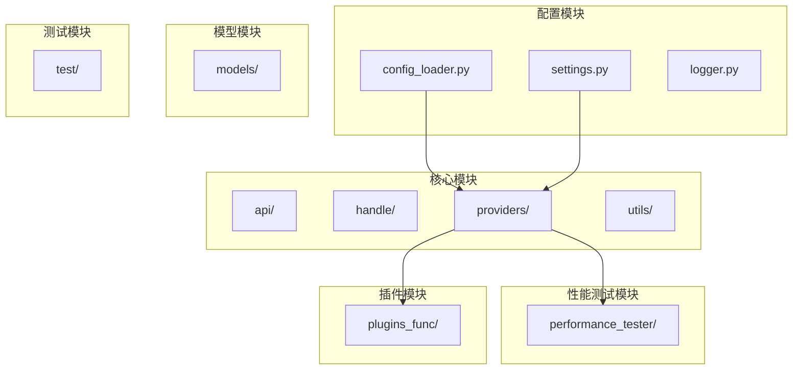
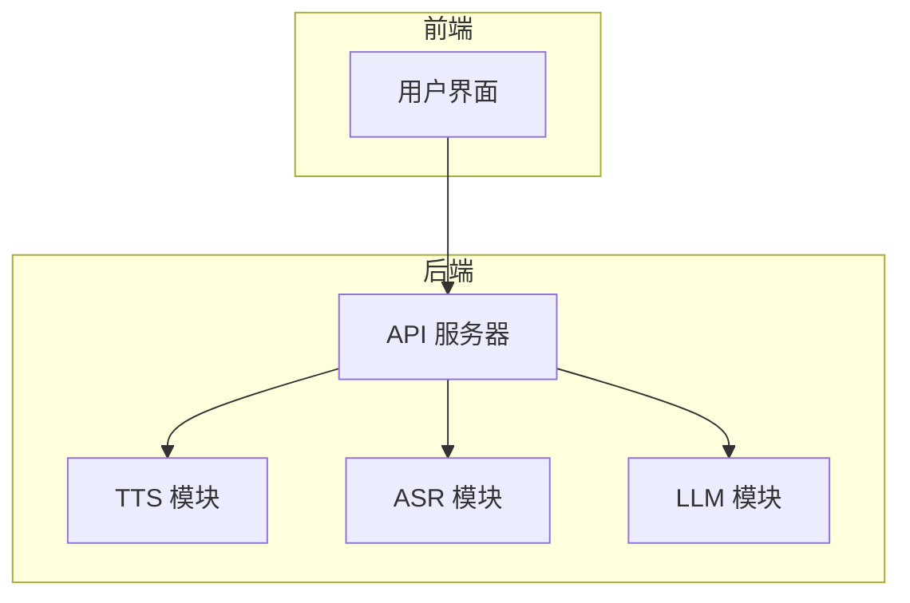
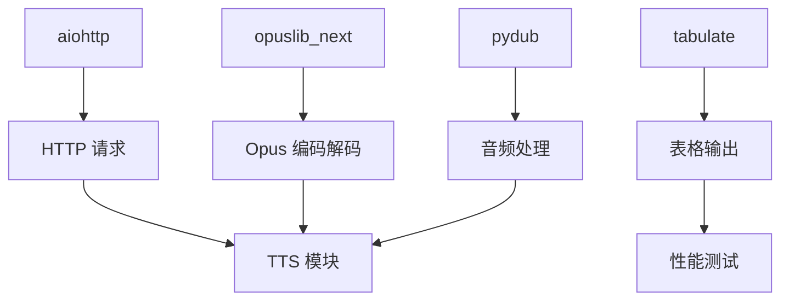

# 扩展TTS提供商

<cite>
**本文档引用的文件**   
- [base.py](file://core/providers/tts/base.py)
- [default.py](file://core/providers/tts/default.py)
- [config.yaml](file://config.yaml)
- [settings.py](file://config/settings.py)
- [config_loader.py](file://config/config_loader.py)
- [tts.py](file://core/utils/tts.py)
- [dto.py](file://core/providers/tts/dto/dto.py)
- [performance_tester_tts.py](file://performance_tester/performance_tester_tts.py)
- [util.py](file://core/utils/util.py)
- [reportHandle.py](file://core/handle/reportHandle.py)
- [sendAudioHandle.py](file://core/handle/sendAudioHandle.py)
</cite>

## 目录
1. [引言](#引言)
2. [项目结构](#项目结构)
3. [核心组件](#核心组件)
4. [架构概述](#架构概述)
5. [详细组件分析](#详细组件分析)
6. [依赖分析](#依赖分析)
7. [性能考虑](#性能考虑)
8. [故障排除指南](#故障排除指南)
9. [结论](#结论)

## 引言
本文档旨在为开发者提供一份详尽的开发指南，指导如何为系统集成新的语音合成（TTS）服务提供商。文档将详细说明必须继承 `core/providers/tts/base.py` 中的 `BaseTTSProvider` 基类，并实现 `_get_tts_audio` 方法以支持非流式 TTS，以及 `_get_tts_audio_stream` 方法以支持流式音频输出。通过对接 ElevenLabs TTS API 的完整实现示例，涵盖 API 认证、请求参数构建、流式音频数据分块处理、音频格式转换与封装等内容。同时，文档还将描述如何在 `config.yaml` 中添加新提供商的配置参数，并确保通过 `settings.py` 正确注入。此外，强调错误处理机制，如网络中断、配额超限的优雅降级，并指导开发者利用 `performance_tester/performance_tester_tts.py` 进行延迟和音质测试，并通过日志模块监控请求生命周期。

## 项目结构
本项目采用模块化设计，主要分为以下几个部分：
- `config/`：包含配置加载、日志设置等基础配置文件。
- `core/`：核心功能模块，包括 API 处理、语音识别、语音合成、意图识别等。
- `models/`：存放模型文件，如语音识别模型、声纹识别模型等。
- `performance_tester/`：性能测试工具，用于测试 ASR、LLM、TTS 等模块的性能。
- `plugins_func/`：插件功能模块，支持扩展各种功能。
- `test/`：测试相关文件，包括前端测试页面和脚本。



**图源**
- [config_loader.py](file://config/config_loader.py)
- [settings.py](file://config/settings.py)
- [logger.py](file://config/logger.py)

**节源**
- [config_loader.py](file://config/config_loader.py)
- [settings.py](file://config/settings.py)
- [logger.py](file://config/logger.py)

## 核心组件
系统的核心组件主要包括语音合成（TTS）、语音识别（ASR）、大语言模型（LLM）等。其中，TTS 模块负责将文本转换为语音，ASR 模块负责将语音转换为文本，LLM 模块负责生成回复内容。这些模块通过 `core/providers/tts/base.py` 中定义的基类进行统一管理，确保各模块之间的接口一致性。

**节源**
- [base.py](file://core/providers/tts/base.py)
- [default.py](file://core/providers/tts/default.py)

## 架构概述
系统的整体架构基于微服务设计，各模块独立运行并通过配置文件进行集成。TTS 模块作为其中一个关键组件，通过继承 `BaseTTSProvider` 基类来实现具体的语音合成服务。系统通过 `config.yaml` 文件中的配置项来选择和配置不同的 TTS 提供商，并通过 `settings.py` 文件中的逻辑来加载和初始化这些配置。



**图源**
- [base.py](file://core/providers/tts/base.py)
- [config.yaml](file://config.yaml)
- [settings.py](file://config/settings.py)

## 详细组件分析
### TTS 提供商实现
为了集成新的 TTS 服务提供商，开发者需要继承 `core/providers/tts/base.py` 中的 `BaseTTSProvider` 基类，并实现以下方法：

#### 非流式 TTS 实现
`_get_tts_audio` 方法用于实现非流式 TTS 功能。该方法接收文本输入，调用外部 TTS 服务 API，获取音频数据并返回。

#### 流式 TTS 实现
`_get_tts_audio_stream` 方法用于实现流式 TTS 功能。该方法使用异步生成器（async generator）逐块处理音频数据，支持实时音频流输出。

#### ElevenLabs TTS API 示例
以下是一个对接 ElevenLabs TTS API 的完整实现示例：

```python
class ElevenLabsTTSProvider(BaseTTSProvider):
    def __init__(self, config, delete_audio_file):
        super().__init__(config, delete_audio_file)
        self.api_key = config.get("api_key")
        self.voice_id = config.get("voice_id")
        self.model_id = config.get("model_id")
        self.api_url = config.get("api_url", "https://api.elevenlabs.io/v1/text-to-speech")

    async def _get_tts_audio(self, text, output_file=None):
        headers = {
            "Accept": "audio/mpeg",
            "Content-Type": "application/json",
            "xi-api-key": self.api_key
        }
        data = {
            "text": text,
            "voice_settings": {
                "stability": 0.5,
                "similarity_boost": 0.8
            }
        }
        async with aiohttp.ClientSession() as session:
            async with session.post(f"{self.api_url}/{self.voice_id}", json=data, headers=headers) as response:
                if response.status == 200:
                    audio_data = await response.read()
                    if output_file:
                        with open(output_file, "wb") as f:
                            f.write(audio_data)
                    else:
                        return audio_data
                else:
                    raise Exception(f"ElevenLabs TTS 请求失败: {response.status} - {await response.text()}")

    async def _get_tts_audio_stream(self, text):
        headers = {
            "Accept": "application/json",
            "Content-Type": "application/json",
            "xi-api-key": self.api_key
        }
        data = {
            "text": text,
            "model_id": self.model_id,
            "voice_settings": {
                "stability": 0.5,
                "similarity_boost": 0.8
            }
        }
        async with aiohttp.ClientSession() as session:
            async with session.post(f"{self.api_url}/{self.voice_id}/stream", json=data, headers=headers) as response:
                if response.status == 200:
                    async for chunk in response.content.iter_chunked(1024):
                        yield chunk
                else:
                    raise Exception(f"ElevenLabs TTS 流式请求失败: {response.status} - {await response.text()}")
```

**图源**
- [base.py](file://core/providers/tts/base.py)
- [dto.py](file://core/providers/tts/dto/dto.py)

**节源**
- [base.py](file://core/providers/tts/base.py)
- [dto.py](file://core/providers/tts/dto/dto.py)

### 配置管理
在 `config.yaml` 文件中添加新提供商的配置参数，例如：

```yaml
TTS:
  ElevenLabs:
    type: elevenlabs
    api_url: https://api.elevenlabs.io/v1/text-to-speech
    api_key: your_api_key
    voice_id: your_voice_id
    model_id: your_model_id
    voice_settings:
      stability: 0.5
      similarity_boost: 0.8
    output_dir: tmp/
```

通过 `settings.py` 文件中的逻辑确保配置正确注入：

```python
def load_config():
    config = read_config("config.yaml")
    # 合并自定义配置
    custom_config = read_config("data/.config.yaml")
    config = merge_configs(config, custom_config)
    return config
```

**节源**
- [config.yaml](file://config.yaml)
- [settings.py](file://config/settings.py)
- [config_loader.py](file://config/config_loader.py)

### 错误处理机制
系统通过异常捕获和重试机制来处理网络中断、配额超限等问题。例如，在 `base.py` 中定义了重试逻辑：

```python
def to_tts_stream(self, text, opus_handler: Callable[[bytes], None] = None) -> None:
    max_repeat_time = 5
    while max_repeat_time > 0:
        try:
            audio_bytes = asyncio.run(self.text_to_speak(text, None))
            if audio_bytes:
                break
            else:
                max_repeat_time -= 1
        except Exception as e:
            logger.bind(tag=TAG).warning(f"语音生成失败{5 - max_repeat_time + 1}次: {text}，错误: {e}")
            max_repeat_time -= 1
    if max_repeat_time > 0:
        logger.bind(tag=TAG).info(f"语音生成成功: {text}，重试{5 - max_repeat_time}次")
    else:
        logger.bind(tag=TAG).error(f"语音生成失败: {text}，请检查网络或服务是否正常")
```

**节源**
- [base.py](file://core/providers/tts/base.py)

### 性能测试
利用 `performance_tester/performance_tester_tts.py` 进行延迟和音质测试。该工具通过并发执行多个 TTS 请求，测量平均耗时并生成测试报告：

```python
async def _test_tts(self, tts_name: str, config: Dict) -> Dict:
    try:
        tts = create_tts_instance(config.get("type"), config, delete_audio_file=True)
        total_time = 0
        test_count = len(self.test_sentences[:3])
        for i, sentence in enumerate(self.test_sentences[:2], 1):
            start = time.time()
            tmp_file = tts.generate_filename()
            await tts.text_to_speak(sentence, tmp_file)
            duration = time.time() - start
            total_time += duration
        return {
            "name": tts_name,
            "avg_time": total_time / test_count,
            "errors": 0,
        }
    except Exception as e:
        return {"name": tts_name, "errors": 1}
```

**节源**
- [performance_tester_tts.py](file://performance_tester/performance_tester_tts.py)

### 日志监控
通过日志模块监控请求生命周期，记录关键事件和错误信息。例如，在 `sendAudioHandle.py` 中记录音频发送状态：

```python
async def sendAudioMessage(conn, sentenceType, audios, text):
    if sentenceType == SentenceType.FIRST:
        await send_tts_message(conn, "sentence_start", text)
    await sendAudio(conn, audios)
    if sentenceType == SentenceType.LAST:
        await send_tts_message(conn, "stop", None)
```

**节源**
- [sendAudioHandle.py](file://core/handle/sendAudioHandle.py)

## 依赖分析
系统依赖于多个外部库和服务，包括 `aiohttp` 用于 HTTP 请求，`opuslib_next` 用于 Opus 编码解码，`pydub` 用于音频处理等。这些依赖通过 `requirements.txt` 文件进行管理，并在 `config_loader.py` 中动态加载配置。



**图源**
- [requirements.txt](file://requirements.txt)
- [config_loader.py](file://config/config_loader.py)

**节源**
- [requirements.txt](file://requirements.txt)
- [config_loader.py](file://config/config_loader.py)

## 性能考虑
在实现 TTS 服务时，需考虑以下性能因素：
- **延迟**：尽量减少网络请求和数据处理时间，提高响应速度。
- **资源消耗**：优化内存和 CPU 使用，避免长时间占用系统资源。
- **并发处理**：支持多用户同时请求，确保系统稳定性和可扩展性。

## 故障排除指南
### 音频播放卡顿
- 检查网络连接是否稳定。
- 确认 TTS 服务提供商的 API 是否正常工作。
- 调整 `tts_audio_send_delay` 配置项，优化音频发送延迟。

### 语音不自然
- 调整 `voice_settings` 中的 `stability` 和 `similarity_boost` 参数。
- 尝试使用不同的 `voice_id` 或 `model_id`。
- 检查输入文本是否有特殊字符或格式问题。

**节源**
- [base.py](file://core/providers/tts/base.py)
- [config.yaml](file://config.yaml)

## 结论
本文档详细介绍了如何为系统集成新的 TTS 服务提供商，涵盖了从基类继承、方法实现、配置管理到性能测试和故障排除的全过程。通过遵循本文档的指导，开发者可以轻松扩展系统的语音合成功能，提升用户体验。