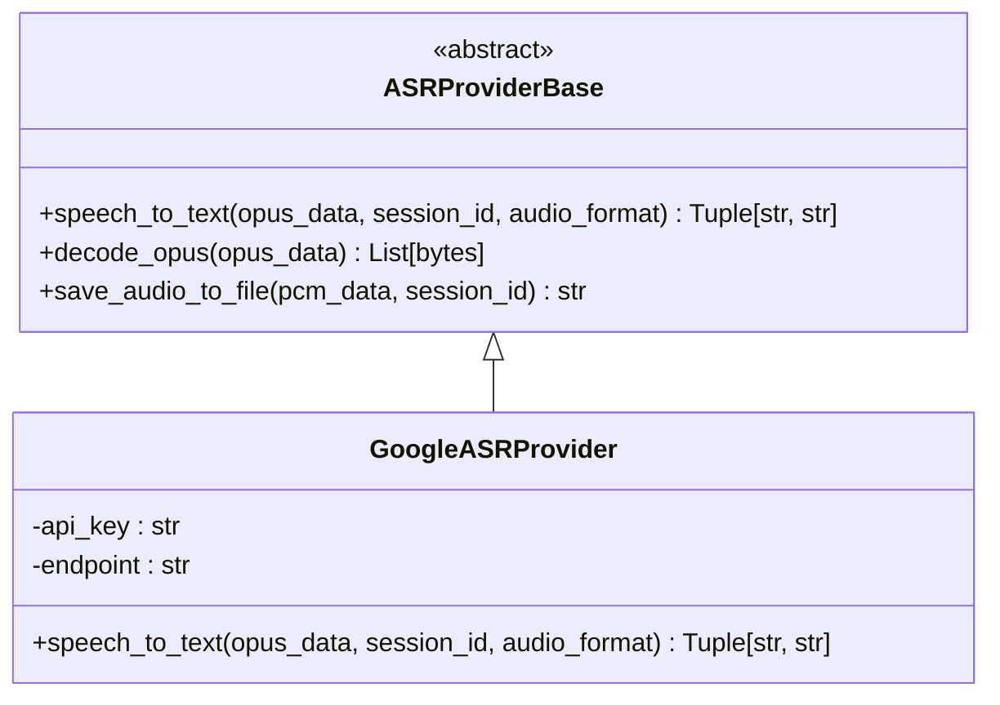
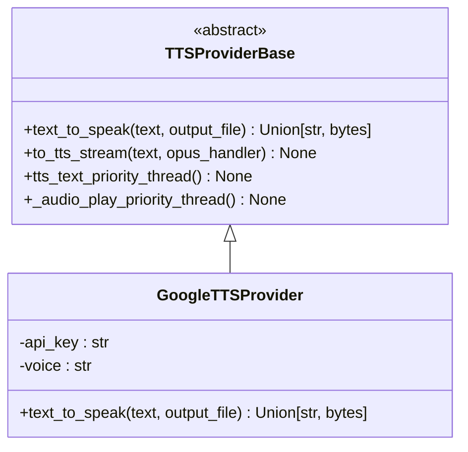
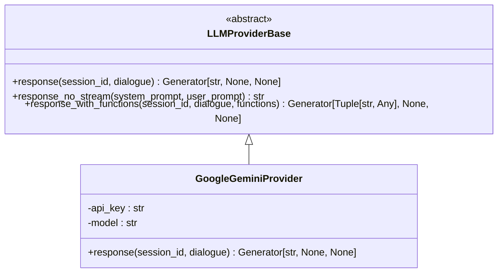
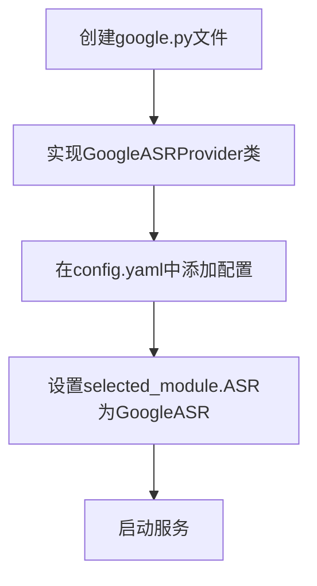
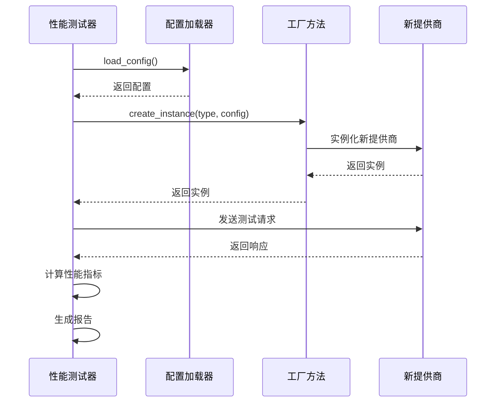

# 扩展服务提供商

<cite>
**本文档引用的文件**   
- [base.py](file://core/providers/asr/base.py)
- [base.py](file://core/providers/tts/base.py)
- [base.py](file://core/providers/llm/base.py)
- [aliyun.py](file://core/providers/asr/aliyun.py)
- [aliyun.py](file://core/providers/tts/aliyun.py)
- [openai.py](file://core/providers/llm/openai/openai.py)
- [config.yaml](file://config.yaml)
- [config_loader.py](file://config/config_loader.py)
- [performance_tester_asr.py](file://performance_tester/performance_tester_asr.py)
- [performance_tester_tts.py](file://performance_tester/performance_tester_tts.py)
- [performance_tester_llm.py](file://performance_tester/performance_tester_llm.py)
- [asr.py](file://core/utils/asr.py)
- [tts.py](file://core/utils/tts.py)
- [llm.py](file://core/utils/llm.py)
</cite>

## 目录
1. [引言](#引言)
2. [语音识别（ASR）模块扩展](#语音识别asr模块扩展)
3. [语音合成（TTS）模块扩展](#语音合成tts模块扩展)
4. [大语言模型（LLM）模块扩展](#大语言模型llm模块扩展)
5. [配置与集成](#配置与集成)
6. [调试与性能测试](#调试与性能测试)
7. [结论](#结论)

## 引言
本文档旨在为开发者提供一份详细的指南，指导如何为xiaozhi-server项目扩展新的服务提供商。文档将深入分析语音识别（ASR）、语音合成（TTS）和大语言模型（LLM）三大核心模块的扩展方法。每个模块都基于一个抽象基类，新提供商必须继承并实现其定义的接口规范，以确保与核心系统的松耦合。文档将通过分析现有提供商的实现模式，提供具体的代码示例和配置说明，帮助开发者快速集成新的云服务。

**本文档引用的文件**
- [base.py](file://core/providers/asr/base.py#L1-L268)
- [base.py](file://core/providers/tts/base.py#L1-L462)
- [base.py](file://core/providers/llm/base.py#L1-L40)

## 语音识别（ASR）模块扩展

### 基类分析与接口规范
语音识别模块的核心是`ASRProviderBase`抽象基类，位于`core/providers/asr/base.py`。该基类定义了所有ASR提供商必须遵循的接口。核心的抽象方法是`speech_to_text`，它接收一个包含Opus编码音频数据的列表、会话ID和音频格式，返回一个包含识别文本和音频文件路径的元组。此方法是所有非流式ASR提供商的实现核心。

基类还提供了许多辅助功能，如`decode_opus`用于将Opus音频解码为PCM格式，`save_audio_to_file`用于将音频数据保存为WAV文件以供调试或声纹识别。对于流式ASR提供商，基类通过`receive_audio`和`handle_voice_stop`方法处理实时音频流的接收和最终识别。`handle_voice_stop`方法特别重要，它实现了ASR与声纹识别的并行处理，以优化性能。

### 实现新ASR提供商
要实现一个新的ASR提供商，例如对接Google Speech-to-Text服务，开发者需要创建一个继承自`ASRProviderBase`的新类。该类必须实现`speech_to_text`抽象方法。实现过程通常包括：1) 在`__init__`方法中初始化提供商的配置，如API密钥、端点URL等；2) 构建HTTP请求，将音频数据和认证信息打包；3) 发送请求到云服务；4) 解析响应，提取识别出的文本。

以`core/providers/asr/aliyun.py`中的`ASRProvider`为例，其`_send_request`方法展示了如何构造一个HTTPS请求，设置必要的HTTP头（如`X-NLS-Token`），并处理响应。开发者在实现新提供商时，应遵循类似的模式，确保错误处理和日志记录的完整性。

**图源**
- [base.py](file://core/providers/asr/base.py#L234-L239)
- [aliyun.py](file://core/providers/asr/aliyun.py#L215-L249)

**本文档引用的文件**
- [base.py](file://core/providers/asr/base.py#L234-L239)
- [aliyun.py](file://core/providers/asr/aliyun.py#L90-L249)

## 语音合成（TTS）模块扩展

### 基类分析与接口规范
语音合成模块的基类是`TTSProviderBase`，位于`core/providers/tts/base.py`。其核心抽象方法是`text_to_speak`，该方法接收待合成的文本和一个可选的输出文件路径。如果提供了文件路径，方法应将生成的音频保存到该文件；如果未提供，则应返回音频数据的字节流。此设计支持了文件存储和内存流两种模式。

基类还定义了复杂的音频处理和流式传输逻辑。`to_tts_stream`方法负责将长文本分割成句子，并通过`_get_segment_text`方法进行标点符号分割，然后逐句调用`text_to_speak`。`tts_text_priority_thread`和`_audio_play_priority_thread`两个线程分别负责文本处理和音频播放，实现了生产者-消费者模式，确保了音频的流畅播放。

### 实现新TTS提供商
实现一个新的TTS提供商，如Google Cloud Text-to-Speech，需要继承`TTSProviderBase`并实现`text_to_speak`方法。该方法需要处理认证、构建API请求、发送请求并处理响应。响应通常是音频数据（如WAV或MP3格式），需要根据`output_file`参数决定是保存到文件还是返回字节流。

`core/providers/tts/aliyun.py`中的`TTSProvider`提供了一个清晰的实现范例。其`text_to_speak`方法构造了一个包含文本、音色、语速等参数的JSON请求体，并通过POST请求发送到阿里云的TTS API。开发者在实现新提供商时，应特别注意处理网络异常和API错误，并利用基类提供的日志功能进行调试。

**图源**
- [base.py](file://core/providers/tts/base.py#L216-L218)
- [aliyun.py](file://core/providers/tts/aliyun.py#L166-L206)

**本文档引用的文件**
- [base.py](file://core/providers/tts/base.py#L216-L218)
- [aliyun.py](file://core/providers/tts/aliyun.py#L86-L206)

## 大语言模型（LLM）模块扩展

### 基类分析与接口规范
大语言模型模块的基类是`LLMProviderBase`，位于`core/providers/llm/base.py`。其核心抽象方法是`response`，该方法返回一个生成器，用于支持流式文本生成。这使得系统可以实时地将LLM的输出流式传输给客户端，提供更佳的用户体验。

基类还提供了`response_no_stream`方法，它通过消费`response`生成器来提供同步的文本生成能力。更重要的是，`response_with_functions`方法为函数调用（function calling）能力提供了默认实现，允许LLM在生成文本的同时调用预定义的函数，这是实现智能代理的关键。

### 实现新LLM提供商
实现一个新的LLM提供商，如Google Gemini，需要继承`LLMProviderBase`并实现`response`方法。该方法必须返回一个生成器，能够逐个yield出LLM生成的文本片段。实现时，需要处理与LLM API的流式连接，例如使用SSE（Server-Sent Events）或WebSocket。

`core/providers/llm/openai/openai.py`中的`LLMProvider`是一个优秀的实现示例。其`response`方法使用了OpenAI SDK的流式API，通过一个循环迭代响应流，并从每个响应块中提取文本内容，然后yield出去。对于`response_with_functions`，它同样使用流式API，但会同时yield文本内容和工具调用信息。开发者在实现新提供商时，应确保正确处理API的流式响应，并在发生错误时妥善处理异常。

**图源**
- [base.py](file://core/providers/llm/base.py#L8-L11)
- [openai.py](file://core/providers/llm/openai/openai.py#L58-L102)

**本文档引用的文件**
- [base.py](file://core/providers/llm/base.py#L8-L11)
- [openai.py](file://core/providers/llm/openai/openai.py#L12-L143)

## 配置与集成

### 配置文件结构
新提供商的配置主要在`config.yaml`文件中完成。该文件采用YAML格式，定义了服务器、日志、ASR、TTS、LLM等模块的配置。每个模块下可以定义多个提供商，通过一个唯一的名称（如`GoogleASR`）来标识。

每个提供商的配置包含一个`type`字段，该字段的值对应于`core/providers`目录下具体实现文件的名称（不包含`.py`后缀）。例如，`type: aliyun`会指向`core/providers/asr/aliyun.py`。其余字段则根据具体提供商的需求进行定义，如`api_key`、`appkey`、`output_dir`等。

### 集成流程
1.  **创建实现文件**：在`core/providers/asr`、`core/providers/tts`或`core/providers/llm`目录下创建新的Python文件，如`google.py`。
2.  **实现提供商类**：在文件中定义一个继承自相应基类的类，并实现所有抽象方法。
3.  **配置提供商**：在`config.yaml`文件中，找到对应的模块（ASR、TTS或LLM），添加一个新的配置项，使用唯一的名称，并设置`type`为新文件的名称。
4.  **选择提供商**：在`selected_module`部分，将相应模块（如`ASR`）的值设置为新提供商的名称，以使其生效。

**图源**
- [config.yaml](file://config.yaml#L277-L728)

**本文档引用的文件**
- [config.yaml](file://config.yaml#L201-L211)
- [config_loader.py](file://config/config_loader.py#L18-L44)

## 调试与性能测试

### 调试技巧
有效的调试是成功集成新提供商的关键。系统提供了强大的日志记录功能，位于`config/logger.py`。开发者应在实现中充分利用`logger`对象，记录关键的请求和响应信息。例如，在发送请求前，可以记录请求的URL和参数；在收到响应后，可以记录响应的状态码和内容。这有助于快速定位认证失败、参数错误或网络问题。

### 性能测试
项目提供了专门的性能测试工具，位于`performance_tester`目录下。`performance_tester_asr.py`、`performance_tester_tts.py`和`performance_tester_llm.py`分别用于测试ASR、TTS和LLM提供商的性能。这些脚本会自动加载`config.yaml`中的配置，对所有已配置的提供商进行并发测试，并生成详细的性能报告，包括平均响应时间、成功率和错误类型。

这些测试器利用了`core/utils`目录下的工厂方法（如`create_instance`）来动态创建提供商实例，确保了测试的通用性和可扩展性。开发者在完成新提供商的实现后，应运行相应的性能测试脚本，以验证其稳定性和性能表现。

**图源**
- [performance_tester_asr.py](file://performance_tester/performance_tester_asr.py#L16-L354)
- [asr.py](file://core/utils/asr.py#L16-L24)

**本文档引用的文件**
- [performance_tester_asr.py](file://performance_tester/performance_tester_asr.py#L16-L354)
- [performance_tester_tts.py](file://performance_tester/performance_tester_tts.py#L1-L184)
- [performance_tester_llm.py](file://performance_tester/performance_tester_llm.py#L1-L545)
- [asr.py](file://core/utils/asr.py#L16-L24)
- [tts.py](file://core/utils/tts.py#L31-L39)
- [llm.py](file://core/utils/llm.py#L16-L24)

## 结论
通过遵循本文档的指导，开发者可以系统地为xiaozhi-server扩展新的服务提供商。核心在于理解并严格遵守各模块基类定义的接口规范。通过分析现有提供商的实现模式，开发者可以快速掌握实现要点。利用`config.yaml`进行配置和`performance_tester`进行验证，可以确保新提供商的稳定集成。这种基于抽象基类和配置驱动的设计，保证了系统的高度可扩展性和松耦合性，为未来的功能扩展奠定了坚实的基础。