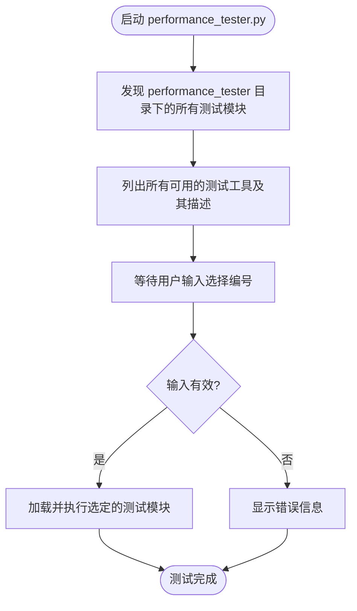
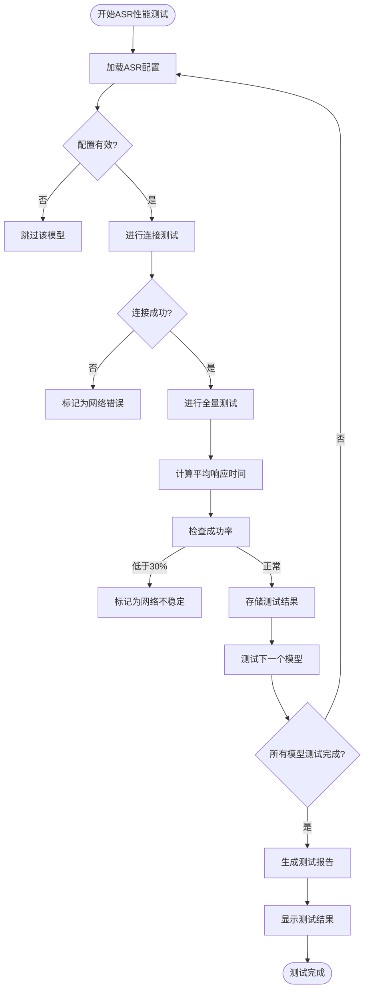
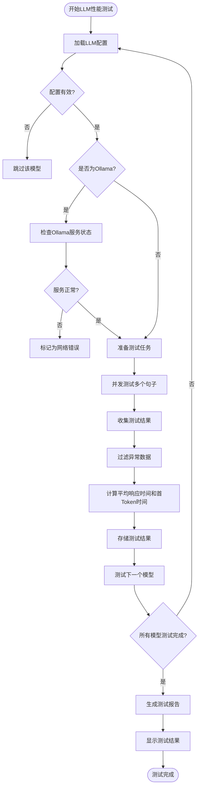
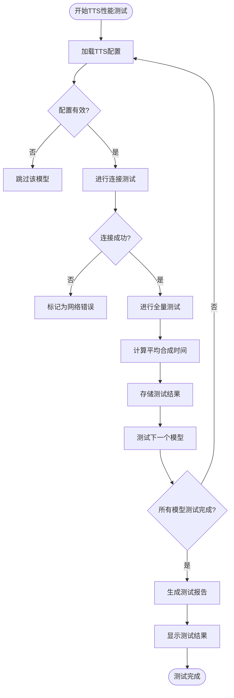
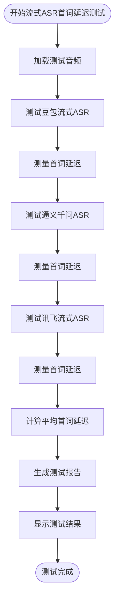
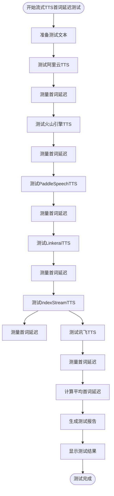
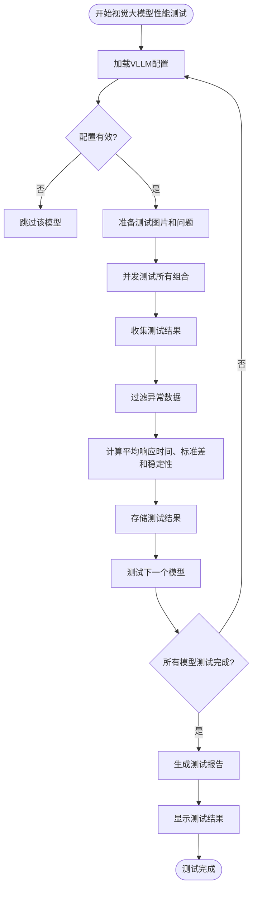

# 性能测试

<cite>
**本文档引用的文件**
- [performance_tester.py](file://performance_tester.py)
- [performance_tester\performance_tester_asr.py](file://performance_tester\performance_tester_asr.py)
- [performance_tester\performance_tester_llm.py](file://performance_tester\performance_tester_llm.py)
- [performance_tester\performance_tester_tts.py](file://performance_tester\performance_tester_tts.py)
- [performance_tester\performance_tester_stream_asr.py](file://performance_tester\performance_tester_stream_asr.py)
- [performance_tester\performance_tester_stream_tts.py](file://performance_tester\performance_tester_stream_tts.py)
- [performance_tester\performance_tester_vllm.py](file://performance_tester\performance_tester_vllm.py)
- [config\settings.py](file://config\settings.py)
- [core\utils\asr.py](file://core\utils\asr.py)
- [core\utils\llm.py](file://core\utils\llm.py)
- [core\utils\tts.py](file://core\utils\tts.py)
- [config.yaml](file://config.yaml)
</cite>

## 目录
1. [简介](#简介)
2. [性能测试工具集概述](#性能测试工具集概述)
3. [主入口: performance_tester.py](#主入口-performance_testerpy)
4. [ASR性能测试](#asr性能测试)
5. [LLM性能测试](#llm性能测试)
6. [TTS性能测试](#tts性能测试)
7. [流式ASR首词延迟测试](#流式asr首词延迟测试)
8. [流式TTS首词延迟测试](#流式tts首词延迟测试)
9. [视觉大模型性能测试](#视觉大模型性能测试)
10. [测试流程与结果分析](#测试流程与结果分析)
11. [性能影响因素与优化建议](#性能影响因素与优化建议)
12. [结论](#结论)

## 简介

性能测试是确保系统在生产环境中稳定运行的关键环节。本系统提供了一套完整的性能测试工具集，用于评估语音识别（ASR）、大语言模型（LLM）、语音合成（TTS）等关键组件的性能表现。通过这些工具，开发者可以量化系统的响应延迟、吞吐量、准确率和稳定性，从而为系统优化和生产部署提供数据支持。

**本文档来源**
- [performance_tester.py](file://performance_tester.py#L1-L69)
- [config.yaml](file://config.yaml#L1-L200)

## 性能测试工具集概述

本系统提供了一个专门的`performance_tester`目录，其中包含了多个针对不同组件的性能测试脚本。这些脚本共同构成了一个完整的性能评估体系，能够全面测试系统的核心功能。测试工具集的设计遵循模块化原则，每个测试脚本专注于一个特定的功能模块，同时共享统一的配置加载和结果展示机制。

测试工具集的主要特点包括：
- **模块化设计**：每个测试脚本独立运行，可单独调用
- **并发测试**：支持多个模型或服务的并发测试，提高测试效率
- **智能错误处理**：自动跳过配置错误或网络异常的模型，确保测试流程的连续性
- **结果可视化**：使用表格形式清晰展示测试结果，便于比较和分析
- **超时控制**：为每个测试任务设置超时保护，防止因单个任务失败而阻塞整个测试流程

**本文档来源**
- [performance_tester.py](file://performance_tester.py#L1-L69)
- [performance_tester\performance_tester_asr.py](file://performance_tester\performance_tester_asr.py#L1-L354)

## 主入口: performance_tester.py

`performance_tester.py`是整个性能测试工具集的主入口和调度器。它负责发现、加载和执行所有可用的性能测试模块，为用户提供一个统一的交互界面。

### 功能与作用

`performance_tester.py`的主要功能包括：
1. **模块发现**：扫描`performance_tester`目录，自动发现所有以`.py`结尾的测试脚本
2. **模块描述**：读取每个测试模块中的`description`变量，获取其功能描述
3. **用户交互**：向用户展示所有可用的测试工具及其描述，等待用户选择
4. **模块加载与执行**：根据用户选择，动态加载并执行相应的测试模块

### 使用方法

运行`performance_tester.py`后，系统会自动列出所有可用的性能测试工具，用户只需输入对应的编号即可启动相应的测试。

**代码结构来源**
- [performance_tester.py](file://performance_tester.py#L1-L69)

**本文档来源**
- [performance_tester.py](file://performance_tester.py#L1-L69)

## ASR性能测试

`performance_tester_asr.py`脚本用于测试语音识别（ASR）服务的准确率和延迟，支持本地和云端多种模型。

### 功能与用途

该脚本的主要功能是评估不同ASR模型的性能表现，包括：
- **响应延迟**：测量从发送音频到获得识别结果的平均耗时
- **成功率**：计算成功识别的音频数量占总测试音频数量的比例
- **网络稳定性**：检测模型在测试过程中的网络连接稳定性

### 测试流程

1. **配置加载**：从`data`目录下的`.config.yaml`文件中加载所有ASR配置
2. **音频准备**：从`config/assets`目录加载测试用的音频文件（大于300KB）
3. **连接测试**：对每个ASR模型进行连通性检查，跳过未配置有效API密钥的模型
4. **全量测试**：对通过连接测试的模型进行全量测试，测量每个音频的识别耗时
5. **结果分析**：计算平均响应时间、成功率，并生成测试报告

### 使用方法

直接运行`performance_tester.py`并选择`performance_tester_asr`模块即可启动测试。测试结果将以表格形式展示，按平均响应时间从快到慢排序，失败的模型排在最后。

**代码结构来源**
- [performance_tester\performance_tester_asr.py](file://performance_tester\performance_tester_asr.py#L16-L354)

**本文档来源**
- [performance_tester\performance_tester_asr.py](file://performance_tester\performance_tester_asr.py#L1-L354)
- [core\utils\asr.py](file://core\utils\asr.py#L1-L24)

## LLM性能测试

`performance_tester_llm.py`脚本用于测试大语言模型（LLM）的响应延迟和吞吐量。

### 功能与用途

该脚本的主要功能是评估不同LLM模型的性能表现，包括：
- **首Token时间**：测量从发送请求到接收到第一个Token的延迟
- **总响应时间**：测量从发送请求到获得完整响应的总耗时
- **成功率**：计算成功响应的句子数量占总测试句子数量的比例

### 测试流程

1. **配置加载**：使用`config/settings.py`中的`load_config()`函数加载全局配置
2. **场景构建**：使用包含完整系统提示词的智能体对话场景进行测试
3. **Ollama特殊处理**：对于Ollama模型，先检查服务状态和模型是否存在
4. **并发测试**：对每个LLM模型并发测试多个句子，测量首Token时间和总响应时间
5. **结果分析**：计算平均响应时间、首Token时间，并生成测试报告

### 使用方法

直接运行`performance_tester.py`并选择`performance_tester_llm`模块即可启动测试。测试结果将以表格形式展示，按首Token时间从快到慢排序。

**代码结构来源**
- [performance_tester\performance_tester_llm.py](file://performance_tester\performance_tester_llm.py#L20-L545)

**本文档来源**
- [performance_tester\performance_tester_llm.py](file://performance_tester\performance_tester_llm.py#L1-L545)
- [core\utils\llm.py](file://core\utils\llm.py#L1-L24)

## TTS性能测试

`performance_tester_tts.py`脚本用于测试非流式语音合成（TTS）服务的合成速度和音频质量。

### 功能与用途

该脚本的主要功能是评估不同TTS模型的性能表现，包括：
- **合成速度**：测量从发送文本到完成音频合成的平均耗时
- **连接稳定性**：检测模型的连接成功率

### 测试流程

1. **配置加载**：使用`config/settings.py`中的`load_config()`函数加载全局配置
2. **文本准备**：从配置文件中获取测试用的文本句子
3. **连接测试**：对每个TTS模型进行连接测试，验证其基本功能
4. **全量测试**：对通过连接测试的模型进行全量测试，测量每个句子的合成耗时
5. **结果分析**：计算平均合成时间，并生成测试报告

### 使用方法

直接运行`performance_tester.py`并选择`performance_tester_tts`模块即可启动测试。测试结果将以表格形式展示，按平均合成时间从快到慢排序。

**代码结构来源**
- [performance_tester\performance_tester_tts.py](file://performance_tester\performance_tester_tts.py#L19-L184)

**本文档来源**
- [performance_tester\performance_tester_tts.py](file://performance_tester\performance_tester_tts.py#L1-L184)
- [core\utils\tts.py](file://core\utils\tts.py#L1-L138)

## 流式ASR首词延迟测试

`performance_tester_stream_asr.py`脚本专门用于测试流式ASR服务的首词响应时间。

### 功能与用途

该脚本的主要功能是评估不同流式ASR模型的首词延迟，即从发送音频流到接收到第一个识别文本的时间。这对于实时语音交互场景至关重要。

### 支持的模型

目前支持以下流式ASR模型的测试：
- **豆包流式ASR**：基于WebSocket协议的流式语音识别
- **通义千问ASR**：基于DashScope API的流式语音识别
- **讯飞流式ASR**：基于WebSocket协议的流式语音识别

### 测试流程

1. **音频准备**：从`config/assets`目录加载测试用的音频文件
2. **并发测试**：对每个支持的流式ASR模型进行多次测试（默认5次）
3. **延迟测量**：精确测量从发送请求到接收到第一个有效识别文本的时间
4. **结果分析**：计算平均首词延迟，并生成测试报告

### 使用方法

该脚本支持命令行参数，可以通过`--count`参数指定测试次数。直接运行`performance_tester.py`并选择`performance_tester_stream_asr`模块即可启动测试。

**代码结构来源**
- [performance_tester\performance_tester_stream_asr.py](file://performance_tester\performance_tester_stream_asr.py#L63-L473)

**本文档来源**
- [performance_tester\performance_tester_stream_asr.py](file://performance_tester\performance_tester_stream_asr.py#L1-L473)

## 流式TTS首词延迟测试

`performance_tester_stream_tts.py`脚本用于测试流式TTS服务的首词延迟，即从发送文本到接收到第一个音频数据块的时间。

### 功能与用途

该脚本的主要功能是评估不同流式TTS模型的首词延迟，这对于实现低延迟的语音交互至关重要。

### 支持的模型

目前支持以下流式TTS模型的测试：
- **阿里云TTS**：基于WebSocket协议的流式语音合成
- **火山引擎TTS**：基于WebSocket协议的流式语音合成
- **PaddleSpeechTTS**：基于WebSocket协议的流式语音合成
- **LinkeraiTTS**：基于HTTP流式协议的流式语音合成
- **IndexStreamTTS**：基于HTTP流式协议的流式语音合成
- **讯飞TTS**：基于WebSocket协议的流式语音合成

### 测试流程

1. **文本准备**：使用预设的测试文本或用户指定的文本
2. **并发测试**：对每个支持的流式TTS模型进行多次测试（默认5次）
3. **延迟测量**：精确测量从发送请求到接收到第一个音频数据块的时间
4. **结果分析**：计算平均首词延迟，并生成测试报告

### 使用方法

该脚本支持命令行参数，可以通过`--text`参数指定测试文本，通过`--count`参数指定测试次数。直接运行`performance_tester.py`并选择`performance_tester_stream_tts`模块即可启动测试。

**代码结构来源**
- [performance_tester\performance_tester_stream_tts.py](file://performance_tester\performance_tester_stream_tts.py#L16-L536)

**本文档来源**
- [performance_tester\performance_tester_stream_tts.py](file://performance_tester\performance_tester_stream_tts.py#L1-L536)

## 视觉大模型性能测试

`performance_tester_vllm.py`脚本用于测试视觉大模型（VLLM）的响应延迟和稳定性。

### 功能与用途

该脚本的主要功能是评估不同视觉大模型的性能表现，包括：
- **响应延迟**：测量从发送图片和问题到获得完整响应的平均耗时
- **稳定性**：通过标准差与平均响应时间的比值来衡量模型响应的稳定性

### 测试流程

1. **配置加载**：使用`config/settings.py`中的`load_config()`函数加载全局配置
2. **数据准备**：准备测试用的图片和问题
3. **并发测试**：对每个视觉大模型并发测试所有图片和问题的组合
4. **结果分析**：计算平均响应时间、标准差和稳定性指标，并生成测试报告

### 使用方法

直接运行`performance_tester.py`并选择`performance_tester_vllm`模块即可启动测试。测试结果将以表格形式展示，包含响应耗时和稳定性指标。

**代码结构来源**
- [performance_tester\performance_tester_vllm.py](file://performance_tester\performance_tester_vllm.py#L17-L193)

**本文档来源**
- [performance_tester\performance_tester_vllm.py](file://performance_tester\performance_tester_vllm.py#L1-L193)

## 测试流程与结果分析

### 测试准备

在进行性能测试之前，需要完成以下准备工作：
1. **配置文件**：在`data`目录下创建`.config.yaml`文件，并配置好各个组件的API密钥和参数
2. **测试数据**：
   - ASR测试：在`config/assets`目录下放置大于300KB的测试音频文件
   - LLM/TTS测试：在`config.yaml`中配置`module_test.test_sentences`作为测试文本
   - VLLM测试：在`docs/images`目录下放置测试图片
3. **依赖安装**：确保已安装所有必要的Python依赖包

### 运行测试

1. 运行`performance_tester.py`
2. 系统会列出所有可用的性能测试工具
3. 输入对应的编号选择要测试的模块
4. 等待测试完成，查看生成的测试报告

### 结果解读

测试结果通常以表格形式展示，包含以下关键指标：
- **平均耗时**：反映模型的响应速度，值越小越好
- **成功率**：反映模型的稳定性和可靠性，值越高越好
- **首Token时间**：对于LLM和流式服务，反映初始响应速度，值越小越好
- **状态**：标识模型测试是否成功，以及失败原因

### 性能报告

测试完成后，系统会生成详细的性能报告，包括：
- 各模型的性能排名
- 测试说明和注意事项
- 错误处理机制的说明

**本文档来源**
- [performance_tester.py](file://performance_tester.py#L1-L69)
- [performance_tester\performance_tester_asr.py](file://performance_tester\performance_tester_asr.py#L241-L307)
- [performance_tester\performance_tester_llm.py](file://performance_tester\performance_tester_llm.py#L367-L451)
- [performance_tester\performance_tester_tts.py](file://performance_tester\performance_tester_tts.py#L83-L149)

## 性能影响因素与优化建议

### 影响性能的关键因素

1. **网络延迟**：对于云端模型，网络延迟是影响性能的主要因素
2. **模型大小**：模型参数量越大，推理时间通常越长
3. **服务器硬件配置**：CPU、GPU、内存等硬件资源直接影响本地模型的性能
4. **并发量**：高并发场景下，服务的响应时间可能会增加

### 性能优化建议

1. **高延迟场景优先选择本地模型**：对于实时性要求高的场景，建议使用本地部署的模型，如`sherpa_onnx_local`（ASR）和`ollama`（LLM）
2. **合理选择模型大小**：根据实际需求选择合适大小的模型，在性能和效果之间取得平衡
3. **优化网络环境**：对于必须使用云端模型的场景，确保网络连接稳定，尽量选择地理位置较近的服务节点
4. **硬件升级**：对于本地模型，可以通过升级服务器硬件（如使用GPU）来提升性能
5. **缓存机制**：对于重复性高的请求，可以考虑引入缓存机制，减少重复计算

### 生产环境部署建议

性能测试对于生产环境部署至关重要。建议在部署前进行全面的性能测试，根据测试结果调整系统配置：
- 根据ASR测试结果选择响应最快的语音识别服务
- 根据LLM测试结果选择首Token时间最短的大语言模型
- 根据TTS测试结果选择合成速度最快的语音合成服务
- 对于关键业务场景，建议部署多个备选模型，实现故障转移

**本文档来源**
- [performance_tester\performance_tester_asr.py](file://performance_tester\performance_tester_asr.py#L1-L354)
- [performance_tester\performance_tester_llm.py](file://performance_tester\performance_tester_llm.py#L1-L545)
- [performance_tester\performance_tester_tts.py](file://performance_tester\performance_tester_tts.py#L1-L184)

## 结论

本系统的性能测试工具集为评估和优化系统关键组件的性能提供了强大的支持。通过`performance_tester.py`主入口，用户可以方便地调用针对ASR、LLM、TTS等不同组件的专用测试脚本。这些工具不仅能够量化系统的响应延迟、吞吐量和稳定性，还能帮助开发者识别性能瓶颈，为系统优化和生产部署提供数据支持。

建议在系统开发和部署的各个阶段都进行定期的性能测试，确保系统始终处于最佳状态。通过持续的性能监控和优化，可以为用户提供更加流畅和可靠的智能交互体验。