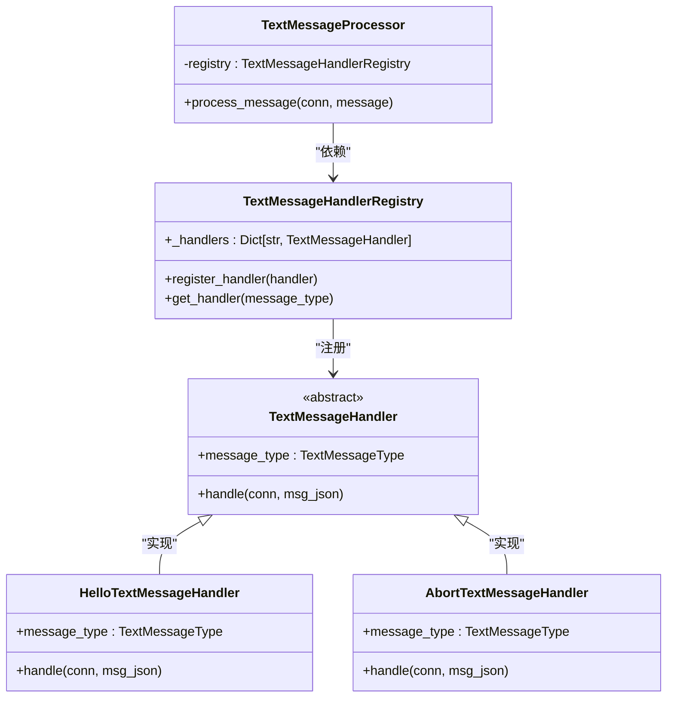
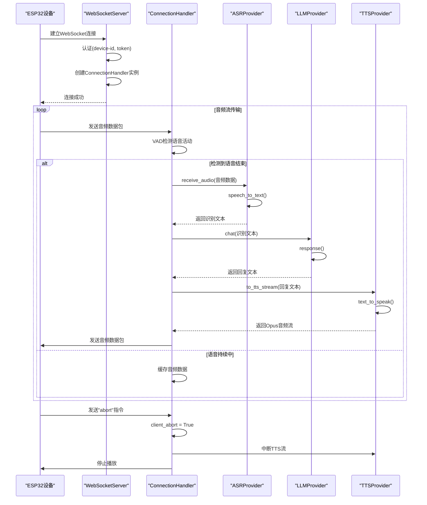

# 架构设计

<cite>
**本文档引用的文件**   
- [app.py](file://app.py)
- [websocket_server.py](file://core/websocket_server.py)
- [http_server.py](file://core/http_server.py)
- [connection.py](file://core/connection.py)
- [config_loader.py](file://config/config_loader.py)
- [modules_initialize.py](file://core/utils/modules_initialize.py)
- [base.py](file://core/providers/asr/base.py)
- [base.py](file://core/providers/tts/base.py)
- [base.py](file://core/providers/llm/base.py)
- [util.py](file://core/utils/util.py)
- [textMessageHandlerRegistry.py](file://core/handle/textMessageHandlerRegistry.py)
- [receiveAudioHandle.py](file://core/handle/receiveAudioHandle.py)
- [sendAudioHandle.py](file://core/handle/sendAudioHandle.py)
</cite>

## 目录
1. [引言](#引言)
2. [模块化分层架构](#模块化分层架构)
3. [核心组件与协作关系](#核心组件与协作关系)
4. [关键架构模式](#关键架构模式)
5. [组件交互序列图](#组件交互序列图)
6. [可扩展性设计](#可扩展性设计)
7. [异步编程与高并发处理](#异步编程与高并发处理)
8. [系统启动初始化流程](#系统启动初始化流程)
9. [结论](#结论)

## 引言

xiaozhi-server 是一个为 ESP32 设备提供智能语音交互服务的后端系统。该系统采用模块化分层架构，通过 WebSocket 和 HTTP 协议与设备进行通信，实现了从语音输入到文本生成，再到语音合成的完整对话流程。本架构设计文档旨在深入剖析系统的整体设计，详细阐述其分层结构、核心组件的协作方式、采用的关键架构模式以及系统的可扩展性和并发处理能力。

**Section sources**
- [app.py](file://app.py#L1-L145)

## 模块化分层架构

xiaozhi-server 采用了清晰的模块化分层架构，将系统划分为四个主要层次：配置层、核心服务层、工具提供者层和实用工具层。这种分层设计有效地解耦了不同功能模块，提高了代码的可维护性和可测试性。

**配置层** 位于架构的最底层，由 `config` 目录下的模块组成，如 `config_loader.py` 和 `settings.py`。该层负责加载和管理系统的全局配置，支持从本地文件（`config.yaml`）或远程 API 接口获取配置信息。`load_config()` 函数是该层的核心，它实现了配置的缓存机制，确保配置加载的高效性。

**核心服务层** 是系统的中枢，由 `core` 目录下的 `app.py`、`websocket_server.py` 和 `http_server.py` 等模块构成。`app.py` 作为主入口，负责协调整个系统的启动和运行。`websocket_server.py` 和 `http_server.py` 则分别提供了 WebSocket 和 HTTP 服务，是系统与外部设备通信的桥梁。

**工具提供者层** 位于 `core/providers` 目录下，是系统功能的核心实现。该层根据功能划分为多个子模块，如 ASR（自动语音识别）、LLM（大语言模型）、TTS（文本转语音）、VAD（语音活动检测）等。每个子模块都实现了特定的抽象接口，为上层提供统一的服务。

**实用工具层** 由 `core/utils` 目录下的模块组成，如 `asr.py`、`llm.py`、`tts.py` 等。该层不直接实现业务逻辑，而是提供工厂方法和工具函数，用于创建和管理工具提供者层的实例，是连接核心服务层与工具提供者层的粘合剂。

这种分层架构使得系统具有高度的灵活性和可替换性。例如，可以轻松地将 ASR 服务从 `aliyun` 切换到 `xunfei_stream`，而无需修改核心服务层的代码。

**Section sources**
- [config_loader.py](file://config/config_loader.py#L1-L152)
- [app.py](file://app.py#L1-L145)
- [websocket_server.py](file://core/websocket_server.py#L1-L206)
- [http_server.py](file://core/http_server.py#L1-L71)

## 核心组件与协作关系

系统的运行依赖于多个核心组件的紧密协作。`app.py` 作为主入口，首先加载配置并初始化日志系统。随后，它创建 `WebSocketServer` 和 `SimpleHttpServer` 的实例，并通过 `asyncio` 并发地启动这两个服务器。`WebSocketServer` 负责处理来自 ESP32 设备的实时语音流，而 `SimpleHttpServer` 则提供 OTA（空中下载）和视觉分析等辅助功能的 HTTP 接口。

当一个 ESP32 设备通过 WebSocket 发起连接时，`WebSocketServer` 会执行认证流程。认证通过后，服务器会为该设备创建一个独立的 `ConnectionHandler` 实例。`ConnectionHandler` 在系统中扮演着“指挥官”的角色，它协调 ASR、LLM、TTS 等 providers 模块完成一次完整的语音对话。

具体流程如下：`ConnectionHandler` 首先通过 `VAD` 模块检测音频流中的语音活动。当检测到用户开始说话时，它将音频数据传递给 `ASR` 模块进行语音识别，将语音转换为文本。识别出的文本随后被送入 `LLM` 模块，由大语言模型生成回复。最后，`TTS` 模块将生成的文本回复转换为语音数据，并通过 WebSocket 流式地发送回设备。

**Section sources**
- [app.py](file://app.py#L45-L145)
- [websocket_server.py](file://core/websocket_server.py#L56-L119)
- [connection.py](file://core/connection.py#L56-L800)

## 关键架构模式

xiaozhi-server 在设计中巧妙地运用了多种经典架构模式，以提升系统的灵活性、可扩展性和可维护性。

**抽象工厂模式** 通过 `core/utils` 目录下的 `asr.py`、`llm.py`、`tts.py` 等模块实现。这些模块中的 `create_instance()` 函数充当了抽象工厂的角色。它们根据配置文件中指定的类型（如 `openai`、`doubao`），动态地从 `core/providers` 目录下加载对应的实现类（如 `openai.py`、`doubao.py`）并创建实例。这使得系统能够以统一的方式创建不同提供商的服务实例，而无需在代码中硬编码具体的类名。

**策略模式** 允许系统在不同的 ASR、LLM 或 TTS 提供商之间进行无缝切换。每个提供商（如 `aliyun.py`、`baidu.py`）都实现了其对应 `base.py` 文件中定义的抽象接口（如 `ASRProviderBase`）。`ConnectionHandler` 在运行时根据配置选择具体的策略（即具体的提供商），并通过统一的接口调用其方法。这种设计使得添加新的服务提供商变得非常简单，只需实现相应的接口即可，完全符合开闭原则。

**观察者模式** 体现在系统的事件驱动消息处理机制中。`TextMessageHandlerRegistry` 类充当了“主题（Subject）”的角色，它维护了一个消息处理器的注册表。各种具体的处理器（如 `HelloTextMessageHandler`、`AbortTextMessageHandler`）则作为“观察者（Observer）”，在初始化时向注册表注册自己。当 `TextMessageProcessor` 收到一条文本消息时，它会根据消息类型从注册表中查找对应的处理器，并通知（调用）该处理器的 `handle()` 方法。这种模式实现了消息发送者与接收者之间的解耦，新的消息类型和处理器可以独立地添加，而无需修改消息分发的核心逻辑。

**Diagram sources**
- [textMessageHandlerRegistry.py](file://core/handle/textMessageHandlerRegistry.py#L1-L45)
- [textMessageHandler.py](file://core/handle/textMessageHandler.py#L1-L20)

## 组件交互序列图

以下序列图详细展示了从设备建立 WebSocket 连接到完成一次“语音提问-语音回答”交互的完整时序。

**Diagram sources**
- [websocket_server.py](file://core/websocket_server.py#L56-L119)
- [connection.py](file://core/connection.py#L56-L800)
- [base.py](file://core/providers/asr/base.py#L1-L268)
- [base.py](file://core/providers/llm/base.py#L1-L40)
- [base.py](file://core/providers/tts/base.py#L1-L462)

## 可扩展性设计

系统的可扩展性设计是其核心优势之一。通过抽象工厂和策略模式的结合，系统能够轻松地集成新的服务提供商。

要添加一个新的 ASR 提供商，开发者需要在 `core/providers/asr/` 目录下创建一个新的 Python 文件（如 `my_asr.py`），并在其中定义一个继承自 `ASRProviderBase` 的类（如 `ASRProvider`），实现 `speech_to_text()` 等抽象方法。然后，在配置文件中将 `selected_module.ASR` 设置为 `my_asr`，系统在启动时就会通过 `core/utils/asr.py` 中的工厂方法自动加载并使用这个新的实现。

同理，对于 LLM、TTS 等其他模块，也遵循相同的扩展流程。这种设计极大地降低了系统对特定服务提供商的耦合度，使得系统可以根据需求、成本或性能等因素灵活地更换后端服务。

**Section sources**
- [asr.py](file://core/utils/asr.py#L1-L24)
- [llm.py](file://core/utils/llm.py#L1-L23)
- [tts.py](file://core/utils/tts.py#L1-L23)

## 异步编程与高并发处理

xiaozhi-server 充分利用了 Python 的 `asyncio` 库来实现异步编程，以应对高并发的 WebSocket 连接。系统中的 `app.py`、`websocket_server.py` 和 `connection.py` 等核心模块都大量使用了 `async` 和 `await` 关键字。

每个 `ConnectionHandler` 实例都拥有自己的 `asyncio` 事件循环和线程池（`ThreadPoolExecutor`）。对于 I/O 密集型任务，如网络请求和文件读写，系统使用 `asyncio` 的异步协程，避免了阻塞主线程。而对于 CPU 密集型任务，如音频解码和模型推理，系统则将其提交到线程池中执行，防止阻塞事件循环。

此外，`ConnectionHandler` 内部还使用了多个队列（如 `asr_audio_queue` 和 `tts_text_queue`）来实现生产者-消费者模式。WebSocket 接收线程将音频数据放入 ASR 队列，而 ASR 处理线程则从队列中取出数据进行处理。这种设计确保了数据处理的流畅性，即使在高负载下也能保持系统的响应能力。

**Section sources**
- [app.py](file://app.py#L45-L145)
- [connection.py](file://core/connection.py#L56-L800)

## 系统启动初始化流程

系统的启动初始化流程始于 `app.py` 文件中的 `main()` 函数。该流程可以概括为以下几个步骤：

1.  **环境检查与配置加载**：程序首先检查 `ffmpeg` 是否已安装，然后调用 `load_config()` 从配置文件或 API 接口加载系统配置。
2.  **认证密钥生成**：根据配置文件和 `manager-api` 的密钥，生成用于 JWT 认证的 `auth_key`。
3.  **服务器实例化与启动**：
    *   创建 `WebSocketServer` 实例，并传入配置。在 `__init__` 方法中，服务器会调用 `initialize_modules()` 函数，根据配置初始化 VAD、ASR、LLM 等核心模块的共享实例。
    *   创建 `SimpleHttpServer` 实例，并传入配置。
    *   使用 `asyncio.create_task()` 并发地启动 WebSocket 和 HTTP 服务器。
4.  **进入主循环**：`main()` 函数调用 `wait_for_exit()`，阻塞等待退出信号（如 Ctrl+C）。在此期间，两个服务器持续运行，处理客户端请求。
5.  **资源清理**：当收到退出信号时，`main()` 函数的 `finally` 块会取消所有任务（包括服务器任务和标准输入监控任务），并等待它们安全终止，确保资源被正确释放。

**Section sources**
- [app.py](file://app.py#L45-L145)
- [websocket_server.py](file://core/websocket_server.py#L16-L45)
- [modules_initialize.py](file://core/utils/modules_initialize.py#L1-L152)

## 结论

综上所述，xiaozhi-server 通过其模块化分层架构、清晰的组件协作关系以及对抽象工厂、策略和观察者等关键架构模式的应用，构建了一个功能强大、灵活且可扩展的智能语音交互后端系统。其基于 `asyncio` 的异步编程模型有效支撑了高并发场景下的稳定运行。该系统的设计不仅满足了当前的功能需求，也为未来的功能扩展和性能优化奠定了坚实的基础。