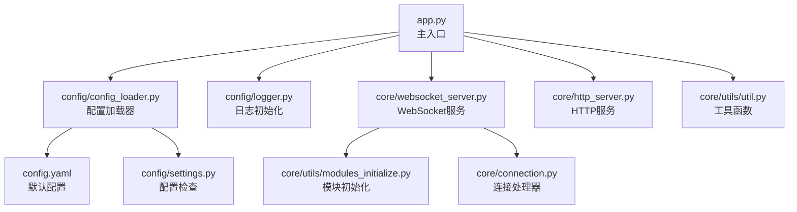
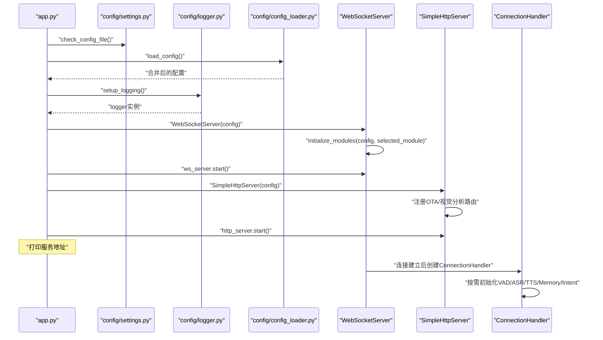
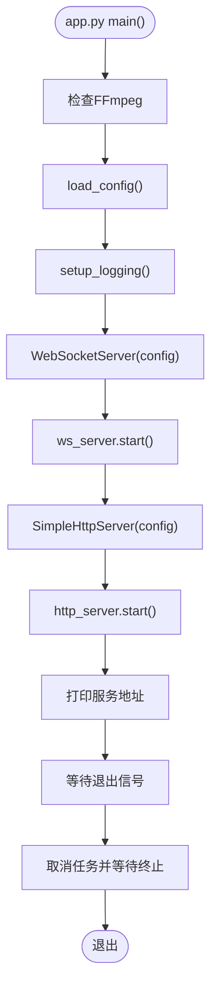
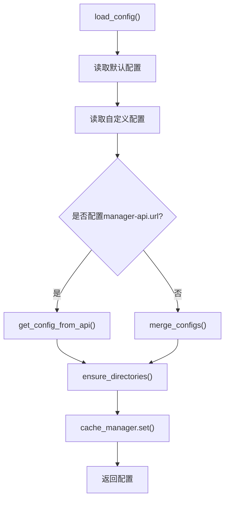
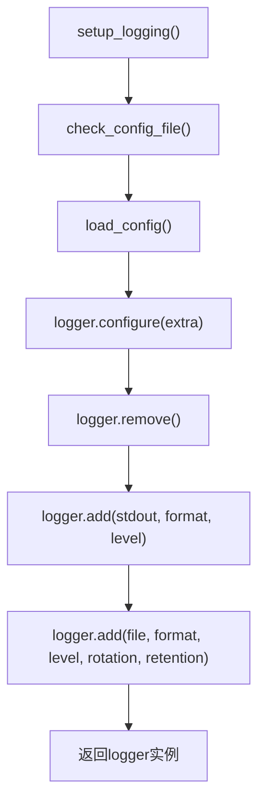
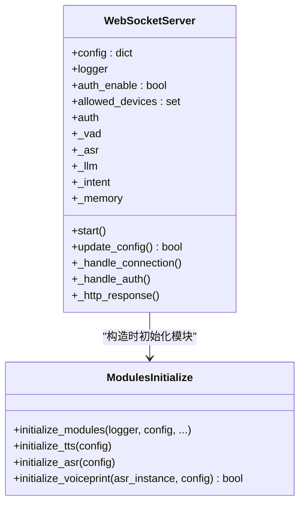
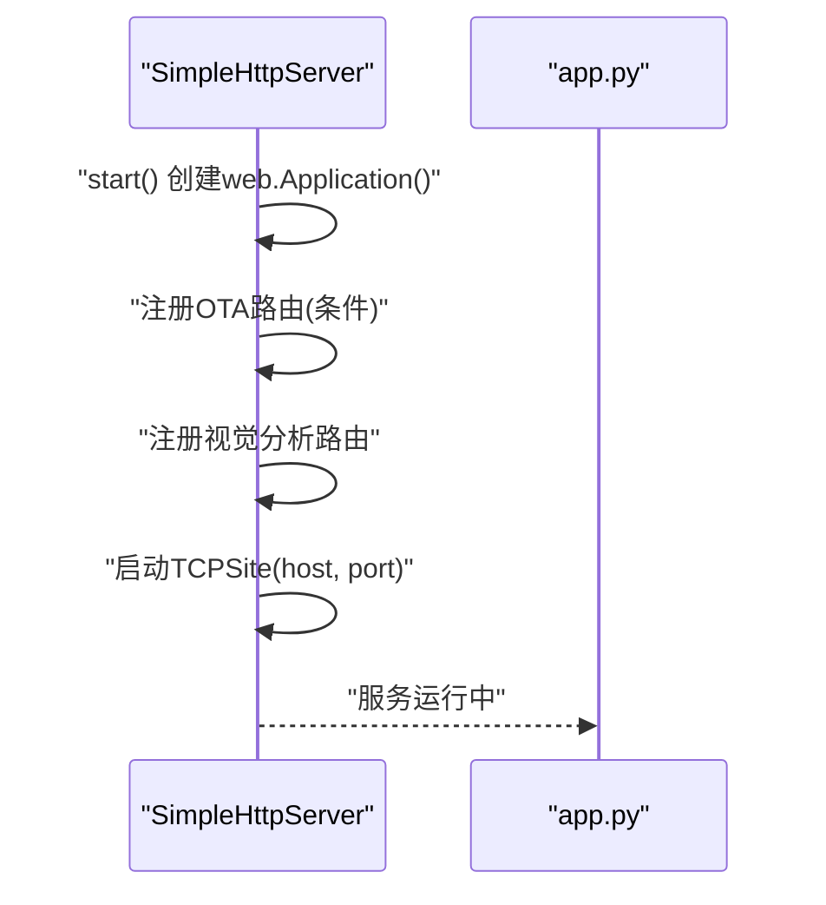
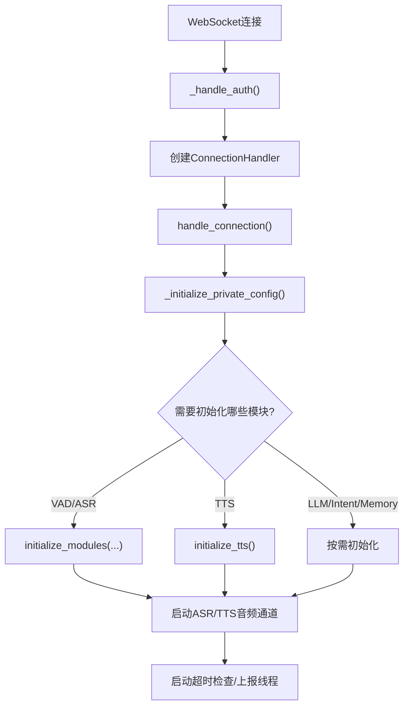
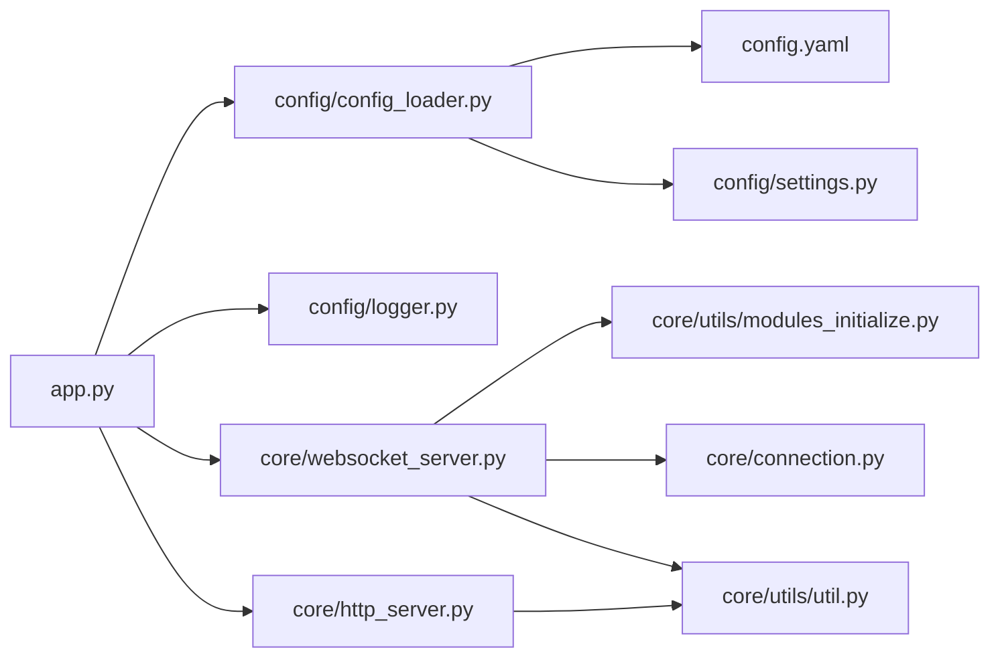

# 系统启动流程

<cite>
**本文引用的文件**
- [app.py](file://app.py)
- [config_loader.py](file://config/config_loader.py)
- [logger.py](file://config/logger.py)
- [settings.py](file://config/settings.py)
- [websocket_server.py](file://core/websocket_server.py)
- [http_server.py](file://core/http_server.py)
- [modules_initialize.py](file://core/utils/modules_initialize.py)
- [connection.py](file://core/connection.py)
- [util.py](file://core/utils/util.py)
- [config.yaml](file://config.yaml)
</cite>

## 目录
1. [简介](#简介)
2. [项目结构](#项目结构)
3. [核心组件](#核心组件)
4. [架构总览](#架构总览)
5. [详细组件分析](#详细组件分析)
6. [依赖关系分析](#依赖关系分析)
7. [性能考量](#性能考量)
8. [故障排查指南](#故障排查指南)
9. [结论](#结论)

## 简介
本文件面向xiaozhi-server系统启动流程，围绕app.py作为主入口，系统如何加载配置文件、初始化日志系统、启动核心服务（WebSocket与HTTP），以及WebSocketServer如何通过modules_initialize.py按配置动态加载VAD、ASR、LLM、Intent、Memory等模块实例。同时阐述配置加载器（config_loader.py）如何解析配置并支持从API动态更新配置的机制，说明系统启动时各组件的依赖注入顺序与初始化顺序保障，最后给出启动时序图与常见问题排查指南。

## 项目结构
系统采用“入口脚本 + 配置层 + 服务层 + 工具层”的分层组织方式：
- 入口脚本：app.py负责启动流程编排，创建WebSocket与HTTP服务，打印服务地址，等待退出信号。
- 配置层：config_loader.py负责读取与合并配置，支持从API拉取配置；logger.py负责日志初始化；settings.py负责配置文件存在性检查。
- 服务层：core/websocket_server.py负责WebSocket服务与连接处理；core/http_server.py负责HTTP服务（OTA与视觉分析接口）。
- 工具层：core/utils/modules_initialize.py负责按selected_module动态实例化各模块；core/utils/util.py提供通用工具（如FFmpeg检查、IP获取等）。

图表来源
- [app.py](file://app.py#L45-L118)
- [config/config_loader.py](file://config/config_loader.py#L18-L45)
- [config/logger.py](file://config/logger.py#L48-L110)
- [core/websocket_server.py](file://core/websocket_server.py#L15-L35)
- [core/http_server.py](file://core/http_server.py#L10-L20)
- [core/utils/modules_initialize.py](file://core/utils/modules_initialize.py#L9-L27)
- [core/connection.py](file://core/connection.py#L55-L90)
- [config.yaml](file://config.yaml#L1-L40)
- [config/settings.py](file://config/settings.py#L9-L34)
- [core/utils/util.py](file://core/utils/util.py#L179-L200)

章节来源
- [app.py](file://app.py#L45-L118)
- [config/config_loader.py](file://config/config_loader.py#L18-L45)
- [config/logger.py](file://config/logger.py#L48-L110)
- [core/websocket_server.py](file://core/websocket_server.py#L15-L35)
- [core/http_server.py](file://core/http_server.py#L10-L20)
- [core/utils/modules_initialize.py](file://core/utils/modules_initialize.py#L9-L27)
- [core/connection.py](file://core/connection.py#L55-L90)
- [config.yaml](file://config.yaml#L1-L40)
- [config/settings.py](file://config/settings.py#L9-L34)
- [core/utils/util.py](file://core/utils/util.py#L179-L200)

## 核心组件
- app.py：启动入口，负责检查FFmpeg、加载配置、初始化日志、启动WebSocket与HTTP服务、打印服务地址、等待退出信号并清理资源。
- config_loader.py：加载默认与自定义配置，支持从API拉取配置，合并配置，确保目录存在，缓存配置。
- logger.py：从配置读取日志参数，初始化控制台与文件日志处理器，支持模块字符串绑定。
- websocket_server.py：WebSocket服务类，构造时按selected_module初始化VAD/ASR/LLM/Intent/Memory，启动时监听端口，处理连接与鉴权，支持在线更新配置。
- http_server.py：HTTP服务类，注册OTA与视觉分析接口路由，按配置决定是否暴露OTA接口。
- modules_initialize.py：按selected_module动态创建VAD/ASR/LLM/Intent/Memory实例，支持按需初始化与声纹功能动态启用。
- connection.py：连接处理器，负责每个WebSocket连接的生命周期管理、组件初始化、消息路由、意图识别、记忆与工具调用。
- util.py：提供本地IP获取、FFmpeg检查、音频处理等工具函数。

章节来源
- [app.py](file://app.py#L45-L118)
- [config/config_loader.py](file://config/config_loader.py#L18-L45)
- [config/logger.py](file://config/logger.py#L48-L110)
- [core/websocket_server.py](file://core/websocket_server.py#L15-L35)
- [core/http_server.py](file://core/http_server.py#L10-L20)
- [core/utils/modules_initialize.py](file://core/utils/modules_initialize.py#L9-L27)
- [core/connection.py](file://core/connection.py#L55-L90)
- [core/utils/util.py](file://core/utils/util.py#L179-L200)

## 架构总览
系统启动时序从app.py开始，贯穿配置加载、日志初始化、服务启动与模块初始化，最终进入事件循环等待信号。

图表来源
- [app.py](file://app.py#L45-L118)
- [config/settings.py](file://config/settings.py#L9-L34)
- [config/logger.py](file://config/logger.py#L48-L110)
- [config/config_loader.py](file://config/config_loader.py#L18-L45)
- [core/websocket_server.py](file://core/websocket_server.py#L15-L35)
- [core/http_server.py](file://core/http_server.py#L35-L71)
- [core/connection.py](file://core/connection.py#L165-L210)

章节来源
- [app.py](file://app.py#L45-L118)
- [config/config_loader.py](file://config/config_loader.py#L18-L45)
- [config/logger.py](file://config/logger.py#L48-L110)
- [core/websocket_server.py](file://core/websocket_server.py#L15-L35)
- [core/http_server.py](file://core/http_server.py#L35-L71)
- [core/connection.py](file://core/connection.py#L165-L210)

## 详细组件分析

### app.py 启动流程
- 启动前检查：调用工具函数检查FFmpeg是否可用。
- 配置加载：调用配置加载器加载默认与自定义配置，支持从API拉取配置；生成或回填auth_key；根据配置打印服务地址。
- 服务启动：创建WebSocketServer与SimpleHttpServer实例，分别启动其start协程；创建stdin监控任务；等待退出信号并清理任务。

图表来源
- [app.py](file://app.py#L45-L118)
- [config/config_loader.py](file://config/config_loader.py#L18-L45)
- [config/logger.py](file://config/logger.py#L48-L110)
- [core/websocket_server.py](file://core/websocket_server.py#L46-L55)
- [core/http_server.py](file://core/http_server.py#L35-L71)

章节来源
- [app.py](file://app.py#L45-L118)

### 配置加载器（config_loader.py）
- 读取默认与自定义配置文件，支持从API拉取服务器配置；合并配置时自定义配置优先；确保日志与模型输出目录存在；缓存配置以提升后续启动性能。
- 支持从API获取服务器配置与私有配置（按设备/客户端维度），并在必要时回填server配置字段。

图表来源
- [config/config_loader.py](file://config/config_loader.py#L18-L45)
- [config/config_loader.py](file://config/config_loader.py#L47-L75)
- [config/config_loader.py](file://config/config_loader.py#L123-L152)

章节来源
- [config/config_loader.py](file://config/config_loader.py#L18-L45)
- [config/config_loader.py](file://config/config_loader.py#L47-L75)
- [config/config_loader.py](file://config/config_loader.py#L123-L152)

### 日志系统初始化（logger.py）
- 从配置读取日志格式、级别、目录与文件名，首次初始化时配置控制台与文件处理器；支持动态模块字符串绑定，便于区分不同模块组合。

图表来源
- [config/logger.py](file://config/logger.py#L48-L110)
- [config/settings.py](file://config/settings.py#L9-L34)

章节来源
- [config/logger.py](file://config/logger.py#L48-L110)
- [config/settings.py](file://config/settings.py#L9-L34)

### WebSocketServer 初始化与模块加载
- 构造函数中按selected_module决定是否初始化VAD/ASR/LLM/Intent/Memory，并创建鉴权管理器。
- start()方法监听配置中的IP与端口，处理HTTP升级与普通HTTP响应。
- update_config()支持从API拉取新配置，检查VAD/ASR变更并重新初始化对应模块实例。

图表来源
- [core/websocket_server.py](file://core/websocket_server.py#L15-L35)
- [core/websocket_server.py](file://core/websocket_server.py#L46-L55)
- [core/websocket_server.py](file://core/websocket_server.py#L133-L183)
- [core/utils/modules_initialize.py](file://core/utils/modules_initialize.py#L9-L27)
- [core/utils/modules_initialize.py](file://core/utils/modules_initialize.py#L101-L130)
- [core/utils/modules_initialize.py](file://core/utils/modules_initialize.py#L132-L152)

章节来源
- [core/websocket_server.py](file://core/websocket_server.py#L15-L35)
- [core/websocket_server.py](file://core/websocket_server.py#L46-L55)
- [core/websocket_server.py](file://core/websocket_server.py#L133-L183)
- [core/utils/modules_initialize.py](file://core/utils/modules_initialize.py#L9-L27)
- [core/utils/modules_initialize.py](file://core/utils/modules_initialize.py#L101-L130)
- [core/utils/modules_initialize.py](file://core/utils/modules_initialize.py#L132-L152)

### HTTP服务（SimpleHttpServer）
- 注册OTA与视觉分析接口路由；根据配置决定是否暴露OTA接口；持续运行并定期检查。

图表来源
- [core/http_server.py](file://core/http_server.py#L35-L71)
- [app.py](file://app.py#L66-L71)

章节来源
- [core/http_server.py](file://core/http_server.py#L35-L71)
- [app.py](file://app.py#L66-L71)

### 连接处理器（ConnectionHandler）与模块初始化
- 每个WebSocket连接创建独立的ConnectionHandler实例；构造时保存server引用与公共模块引用。
- handle_connection()中先验证headers与设备ID，再异步初始化组件（VAD/ASR/TTS/Memory/Intent），并启动超时检查与上报线程。
- 支持从API获取差异化配置（按设备/客户端），按需重新初始化VAD/ASR/LLM/TTS/Memory/Intent等模块。

图表来源
- [core/websocket_server.py](file://core/websocket_server.py#L56-L123)
- [core/connection.py](file://core/connection.py#L165-L210)
- [core/connection.py](file://core/connection.py#L394-L442)
- [core/connection.py](file://core/connection.py#L506-L630)
- [core/utils/modules_initialize.py](file://core/utils/modules_initialize.py#L9-L27)

章节来源
- [core/websocket_server.py](file://core/websocket_server.py#L56-L123)
- [core/connection.py](file://core/connection.py#L165-L210)
- [core/connection.py](file://core/connection.py#L394-L442)
- [core/connection.py](file://core/connection.py#L506-L630)
- [core/utils/modules_initialize.py](file://core/utils/modules_initialize.py#L9-L27)

## 依赖关系分析
- app.py依赖配置加载器与日志初始化，再创建WebSocket与HTTP服务。
- WebSocketServer依赖模块初始化器与鉴权管理器；在构造时完成公共模块的初始化。
- ConnectionHandler依赖模块初始化器与工具函数，按需为每个连接实例化模块。
- 配置加载器依赖管理API客户端与缓存管理器，确保目录与配置一致性。

图表来源
- [app.py](file://app.py#L45-L118)
- [config/config_loader.py](file://config/config_loader.py#L18-L45)
- [config/logger.py](file://config/logger.py#L48-L110)
- [core/websocket_server.py](file://core/websocket_server.py#L15-L35)
- [core/http_server.py](file://core/http_server.py#L10-L20)
- [core/utils/modules_initialize.py](file://core/utils/modules_initialize.py#L9-L27)
- [core/connection.py](file://core/connection.py#L55-L90)
- [config.yaml](file://config.yaml#L1-L40)
- [config/settings.py](file://config/settings.py#L9-L34)
- [core/utils/util.py](file://core/utils/util.py#L179-L200)

章节来源
- [app.py](file://app.py#L45-L118)
- [config/config_loader.py](file://config/config_loader.py#L18-L45)
- [config/logger.py](file://config/logger.py#L48-L110)
- [core/websocket_server.py](file://core/websocket_server.py#L15-L35)
- [core/http_server.py](file://core/http_server.py#L10-L20)
- [core/utils/modules_initialize.py](file://core/utils/modules_initialize.py#L9-L27)
- [core/connection.py](file://core/connection.py#L55-L90)
- [config.yaml](file://config.yaml#L1-L40)
- [config/settings.py](file://config/settings.py#L9-L34)
- [core/utils/util.py](file://core/utils/util.py#L179-L200)

## 性能考量
- 配置缓存：配置加载器使用缓存管理器缓存主配置，减少重复读取与解析成本。
- 日志异步：文件日志使用异步安全队列，避免阻塞主事件循环。
- 模块按需初始化：WebSocketServer构造时仅初始化selected_module中声明的模块，降低启动开销；ConnectionHandler按连接需求动态初始化模块。
- FFmpeg检查：启动前检查FFmpeg可用性，避免运行期因依赖缺失导致失败。

章节来源
- [config/config_loader.py](file://config/config_loader.py#L22-L45)
- [config/logger.py](file://config/logger.py#L83-L106)
- [core/websocket_server.py](file://core/websocket_server.py#L15-L35)
- [core/connection.py](file://core/connection.py#L394-L442)
- [core/utils/util.py](file://core/utils/util.py#L179-L200)

## 故障排查指南
- 配置文件格式错误
  - 症状：启动时报找不到配置文件或配置合并异常。
  - 排查：检查data/.config.yaml是否存在；确认配置项命名与层级正确；若启用从API读取配置，确保manager-api.url与secret配置正确。
  - 参考
    - [config/settings.py](file://config/settings.py#L9-L34)
    - [config/config_loader.py](file://config/config_loader.py#L18-L45)

- 依赖服务不可达
  - 症状：WebSocket或HTTP服务启动失败，或连接后鉴权失败。
  - 排查：检查server.ip/port与http_port配置；确认鉴权开关与白名单设置；检查manager-api.url与secret；确认网络可达性。
  - 参考
    - [config.yaml](file://config.yaml#L9-L28)
    - [core/websocket_server.py](file://core/websocket_server.py#L38-L45)
    - [core/websocket_server.py](file://core/websocket_server.py#L184-L206)

- 模型文件缺失
  - 症状：ASR/TTS初始化失败或运行期报错。
  - 排查：确认ASR/TTS配置中的模型目录存在且可读；检查output_dir路径；确认FFmpeg可用。
  - 参考
    - [config/config_loader.py](file://config/config_loader.py#L82-L121)
    - [core/utils/util.py](file://core/utils/util.py#L179-L200)

- 启动后无法访问服务
  - 症状：浏览器无法访问视觉分析接口或OTA接口。
  - 排查：确认http_port与server.websocket配置；检查是否启用read_config_from_api；查看启动日志中打印的服务地址。
  - 参考
    - [app.py](file://app.py#L73-L85)
    - [core/http_server.py](file://core/http_server.py#L35-L71)

- 在线配置更新失败
  - 症状：update_config()返回失败或模块未更新。
  - 排查：检查get_config_from_api返回值；确认VAD/ASR类型变更逻辑；查看日志错误信息。
  - 参考
    - [core/websocket_server.py](file://core/websocket_server.py#L133-L183)

## 结论
xiaozhi-server的启动流程清晰、层次分明：app.py作为编排入口，配合配置加载器与日志初始化，分别启动WebSocket与HTTP服务；WebSocketServer在构造阶段按selected_module初始化核心模块，并在连接建立后由ConnectionHandler按需实例化模块，支持从API动态拉取差异化配置。通过缓存、异步日志与按需初始化等手段，系统在保证灵活性的同时兼顾性能与稳定性。遇到问题时，可依据配置文件、依赖服务与模型路径等关键点进行定位与修复。