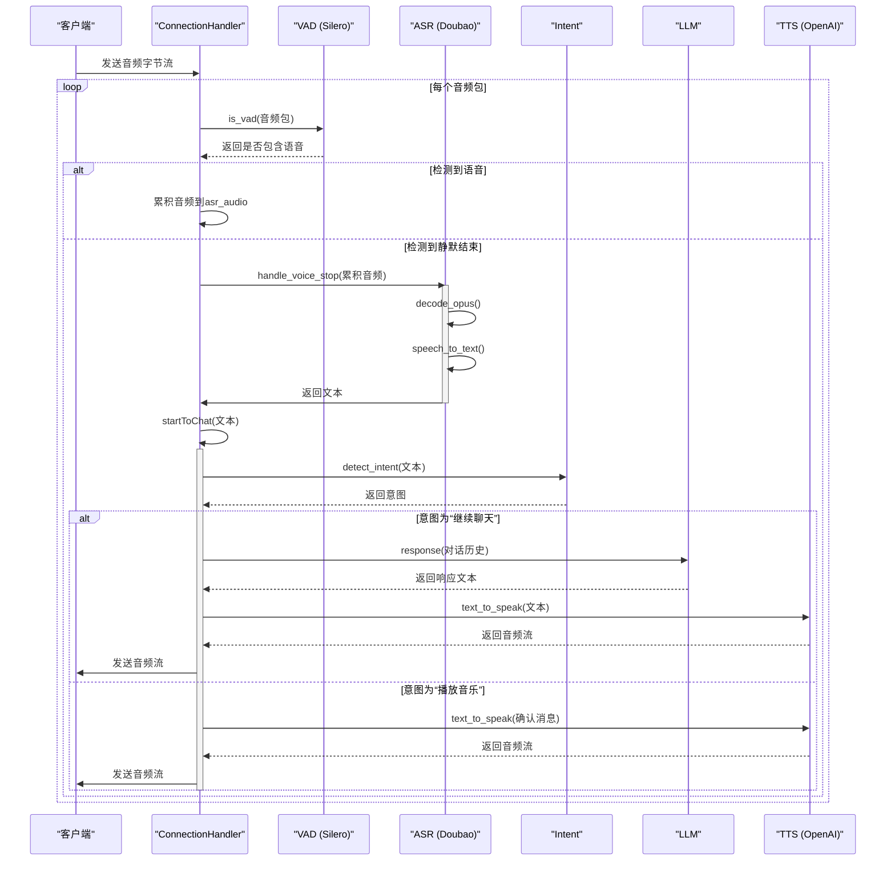
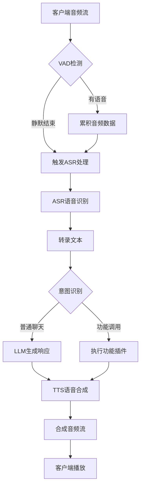

# 组件协作模式

<cite>
**本文档引用的文件**
- [app.py](file://app.py)
- [connection.py](file://core/connection.py)
- [websocket_server.py](file://core/websocket_server.py)
- [receiveAudioHandle.py](file://core/handle/receiveAudioHandle.py)
- [sendAudioHandle.py](file://core/handle/sendAudioHandle.py)
- [base.py](file://core/providers/vad/base.py)
- [silero.py](file://core/providers/vad/silero.py)
- [base.py](file://core/providers/asr/base.py)
- [doubao.py](file://core/providers/asr/doubao.py)
- [base.py](file://core/providers/intent/base.py)
- [base.py](file://core/providers/tts/base.py)
- [openai.py](file://core/providers/tts/openai.py)
- [modules_initialize.py](file://core/utils/modules_initialize.py)
</cite>

## 目录
1. [引言](#引言)
2. [核心组件协作流程](#核心组件协作流程)
3. [数据流与事件驱动机制](#数据流与事件驱动机制)
4. [抽象工厂与策略模式实现](#抽象工厂与策略模式实现)
5. [异步协调与线程池使用](#异步协调与线程池使用)
6. [组件协作序列图](#组件协作序列图)
7. [数据流图](#数据流图)
8. [解耦设计优势与性能瓶颈](#解耦设计优势与性能瓶颈)

## 引言
xiaozhi-server 是一个基于 WebSocket 的语音交互服务系统，支持从音频输入到语音输出的完整对话流程。该系统通过模块化设计，将语音活动检测（VAD）、语音识别（ASR）、意图识别（Intent）、大语言模型（LLM）和语音合成（TTS）等核心组件进行解耦，实现了灵活的组件替换和动态配置。本文档详细解析这些核心组件之间的协作模式，以一次完整的语音交互为例，描述数据在各组件间的流转过程，并分析其架构设计的关键特性。

**Section sources**
- [app.py](file://app.py#L1-L145)
- [websocket_server.py](file://core/websocket_server.py#L1-L206)

## 核心组件协作流程
一次完整的语音交互流程始于客户端通过 WebSocket 连接发送音频字节流，最终返回合成的音频流。整个过程涉及多个核心组件的协同工作，遵循严格的事件驱动和异步处理机制。

当 `WebSocketServer` 接收到新的连接请求时，会创建一个独立的 `ConnectionHandler` 实例来管理该连接的生命周期。`ConnectionHandler` 在初始化时会根据配置动态加载 VAD、ASR、LLM、Intent 和 TTS 等组件实例。随后，它通过 `handle_connection` 方法监听来自客户端的消息。

当客户端开始说话并发送音频数据时，`ConnectionHandler` 的 `_route_message` 方法会识别出这是一个字节流消息，并将其传递给 ASR 模块的音频队列。VAD 组件（如 Silero）会在后台持续监听音频流，通过 `is_vad` 方法实时检测语音活动。一旦检测到语音开始，音频数据就会被持续收集；当检测到一段足够长的静默期（由 `silence_threshold_ms` 配置）时，VAD 会触发 `client_voice_stop` 事件，标志着用户已说完一句话。

此时，ASR 模块的 `handle_voice_stop` 方法被调用，它会将累积的音频数据进行处理。该方法使用线程池并行执行两个任务：一是调用 `speech_to_text` 方法将音频转录为文本，二是（如果启用了声纹识别）调用 `voiceprint_provider.identify_speaker` 识别说话人身份。这两个任务的结果（文本和说话人信息）会被合并成一个包含 JSON 结构的字符串，然后传递给 `startToChat` 函数。

`startToChat` 函数是文本消息处理的入口。它首先检查设备绑定状态和输出限制，然后调用 `handle_user_intent` 函数进行意图识别。`Intent` 模块根据对话历史和当前文本，调用其 `detect_intent` 方法来判断用户意图（如“继续聊天”、“播放音乐”等）。如果意图需要调用特定功能（function call），则会通过 `UnifiedToolHandler` 执行相应操作。如果意图是普通聊天，则流程继续。

接下来，系统会调用 `chat` 方法，该方法会将用户消息添加到对话历史中，并触发 LLM 模块的 `response` 或 `response_with_functions` 方法。LLM 模块生成响应文本后，会通过一个流式迭代器逐段返回。`ConnectionHandler` 将这些文本片段放入 TTS 模块的文本队列 `tts_text_queue` 中。

TTS 模块的 `tts_text_priority_thread` 线程会消费这个队列。它将长文本按标点符号分割成句子，然后调用 `text_to_speak` 方法将每个句子合成为音频。生成的音频数据（Opus 编码）被放入 `tts_audio_queue` 队列。最后，`_audio_play_priority_thread` 线程从该队列中取出音频数据包，并通过 `sendAudioMessage` 函数将其通过 WebSocket 发送回客户端。

**Section sources**
- [connection.py](file://core/connection.py#L55-L800)
- [receiveAudioHandle.py](file://core/handle/receiveAudioHandle.py#L13-L167)
- [sendAudioHandle.py](file://core/handle/sendAudioHandle.py#L11-L260)

## 数据流与事件驱动机制
系统的数据流严格遵循事件驱动模型，确保了高并发下的响应性和稳定性。整个流程可以分为三个主要的数据流阶段：音频输入流、文本处理流和音频输出流。

**音频输入流**：客户端的 Opus 编码音频数据通过 WebSocket 到达 `ConnectionHandler`。这些数据首先被 `receive_audio` 方法接收并存入 `asr_audio_queue` 队列。VAD 组件（如 Silero）通过 `is_vad` 方法对每个音频包进行实时分析，其结果（`have_voice` 布尔值）决定了音频是否被保留。当 VAD 检测到语音结束时，会触发一个事件，导致 `handle_voice_stop` 方法被调用，从而启动 ASR 处理流程。

**文本处理流**：ASR 模块从 `asr_audio_queue` 中获取完整的音频片段，通过 `speech_to_text` 方法将其转换为文本。生成的文本经过 `startToChat` 函数进入文本消息处理器。文本消息处理器根据消息类型（如“text”）调用相应的 `TextMessageHandler`（如 `TextHandle`）。该处理器负责调用 `Intent` 模块进行意图分析，然后根据意图决定是调用功能插件还是直接与 LLM 交互。LLM 生成的响应文本被送入 TTS 模块的 `tts_text_queue`。

**音频输出流**：TTS 模块的 `tts_text_priority_thread` 从 `tts_text_queue` 中取出文本，调用 `text_to_speak` 方法生成音频。对于流式 TTS，音频数据会以小包的形式通过 `handle_opus` 回调函数直接送入 `tts_audio_queue`。对于非流式 TTS，整个音频文件会先生成，然后被分块送入队列。`_audio_play_priority_thread` 线程从 `tts_audio_queue` 中取出音频包，通过 `sendAudio` 函数发送给客户端。该线程还实现了音频流控，通过 `calculate_timestamp_and_sequence` 函数为每个数据包添加时间戳和序列号，确保客户端能正确播放。

**Section sources**
- [base.py](file://core/providers/asr/base.py#L54-L268)
- [base.py](file://core/providers/tts/base.py#L31-L462)
- [receiveAudioHandle.py](file://core/handle/receiveAudioHandle.py#L13-L167)
- [sendAudioHandle.py](file://core/handle/sendAudioHandle.py#L11-L260)

## 抽象工厂与策略模式实现
系统通过 `base.py` 文件中定义的抽象基类实现了统一的抽象工厂和策略模式，允许在运行时动态切换不同服务提供商的实现。

每个核心组件（VAD、ASR、Intent、LLM、TTS）都定义了一个抽象基类，位于 `core/providers/{component}/base.py`。这些基类继承自 Python 的 `ABC`（抽象基类），并使用 `@abstractmethod` 装饰器声明了必须由子类实现的核心方法。例如，`VADProviderBase` 定义了 `is_vad` 方法，`ASRProviderBase` 定义了 `speech_to_text` 方法，`TTSProviderBase` 定义了 `text_to_speak` 方法。

具体的实现类（如 `silero.py` 中的 `VADProvider`、`doubao.py` 中的 `ASRProvider`、`openai.py` 中的 `TTSProvider`）继承自相应的抽象基类，并提供具体实现。这种设计使得上层代码（如 `ConnectionHandler`）可以仅依赖于抽象接口，而无需关心具体的实现细节。

运行时的组件实例化由 `core/utils/modules_initialize.py` 文件中的 `initialize_modules` 和 `initialize_asr`、`initialize_tts` 等函数完成。这些函数读取配置文件中的 `selected_module` 字段，确定要使用的具体模块（如 `"ASR_doubao"`），然后通过 `create_instance` 工厂函数动态导入并实例化对应的类。这实现了策略模式，系统可以根据配置选择不同的策略（服务提供商）来执行相同的功能。

**Section sources**
- [base.py](file://core/providers/vad/base.py#L1-L10)
- [base.py](file://core/providers/asr/base.py#L1-L268)
- [base.py](file://core/providers/intent/base.py#L1-L34)
- [base.py](file://core/providers/tts/base.py#L1-L462)
- [modules_initialize.py](file://core/utils/modules_initialize.py#L1-L152)

## 异步协调与线程池使用
系统采用了异步 I/O 与多线程相结合的协调机制，以平衡性能和复杂性。

主事件循环基于 `asyncio`，负责处理 WebSocket 的连接、消息接收和发送等 I/O 密集型任务。为了不阻塞事件循环，CPU 密集型或阻塞型操作（如语音识别、语音合成、网络请求）被移交给线程池执行。

`ConnectionHandler` 在初始化时会创建一个 `ThreadPoolExecutor`，并启动多个后台线程。ASR 模块的 `asr_text_priority_thread` 线程负责从 `asr_audio_queue` 中取出音频数据并进行处理。当需要执行耗时的 ASR 和声纹识别任务时，`handle_voice_stop` 方法会创建一个新的 `ThreadPoolExecutor`，并使用 `submit` 方法并行提交这两个任务，从而显著减少总处理时间。

同样，TTS 模块也使用了两个独立的线程：`tts_text_priority_thread` 负责文本处理和调用 `text_to_speak`，而 `_audio_play_priority_thread` 负责将生成的音频数据发送给客户端。这种分离确保了音频播放的实时性，即使文本处理遇到延迟，也不会中断已开始的音频流。

此外，系统还使用了 `asyncio.run_coroutine_threadsafe` 方法，允许在后台线程中安全地调度协程（如 `self.tts.open_audio_channels(self)`），实现了异步和多线程编程模型的无缝集成。

**Section sources**
- [connection.py](file://core/connection.py#L92-L94)
- [base.py](file://core/providers/asr/base.py#L37-L147)
- [base.py](file://core/providers/tts/base.py#L276-L317)

## 组件协作序列图
以下序列图展示了从音频输入到音频输出的完整流程，重点突出了关键方法调用和数据转换。

**Diagram sources**
- [connection.py](file://core/connection.py#L265-L280)
- [silero.py](file://core/providers/vad/silero.py#L39-L86)
- [base.py](file://core/providers/asr/base.py#L75-L147)
- [doubao.py](file://core/providers/asr/doubao.py#L234-L272)
- [base.py](file://core/providers/intent/base.py#L21-L34)
- [base.py](file://core/providers/tts/base.py#L217-L218)
- [openai.py](file://core/providers/tts/openai.py#L32-L55)

## 数据流图
以下数据流图展示了系统中主要的数据流动和转换过程。

**Diagram sources**
- [connection.py](file://core/connection.py#L117-L129)
- [base.py](file://core/providers/asr/base.py#L54-L74)
- [base.py](file://core/providers/intent/base.py#L21-L34)
- [base.py](file://core/providers/tts/base.py#L217-L218)

## 解耦设计优势与性能瓶颈
系统的解耦设计带来了显著的优势，但也存在潜在的性能瓶颈。

**优势**：
1.  **高可扩展性**：通过抽象基类和工厂模式，可以轻松添加新的服务提供商（如新的ASR或TTS引擎），只需实现相应的接口，无需修改核心业务逻辑。
2.  **运行时灵活性**：系统支持通过配置文件或API动态切换组件，允许为不同设备或用户提供定制化的服务组合。
3.  **易于维护**：各组件职责单一，代码耦合度低，便于独立测试、调试和升级。
4.  **资源优化**：共享的本地组件（如本地ASR）可以在多个连接间复用，节省了计算资源。

**潜在性能瓶颈**：
1.  **线程切换开销**：频繁的线程池任务提交和结果获取会带来一定的上下文切换开销，尤其是在高并发场景下。
2.  **内存占用**：为每个连接维护独立的 `ConnectionHandler` 实例和音频缓冲区，可能导致内存占用随连接数线性增长。
3.  **I/O 瓶颈**：TTS 模块的 `text_to_speak` 方法通常是阻塞的网络请求，如果服务提供商响应慢，会阻塞整个 `tts_text_priority_thread`，影响音频输出的实时性。
4.  **音频解码延迟**：ASR 模块在处理前需要将 Opus 音频解码为 PCM，这个过程消耗 CPU 资源，可能成为处理大量并发音频流时的瓶颈。

**Section sources**
- [connection.py](file://core/connection.py#L55-L800)
- [base.py](file://core/providers/vad/base.py#L1-L10)
- [base.py](file://core/providers/asr/base.py#L1-L268)
- [base.py](file://core/providers/tts/base.py#L1-L462)