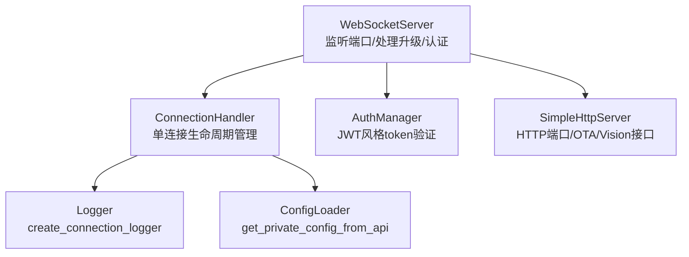
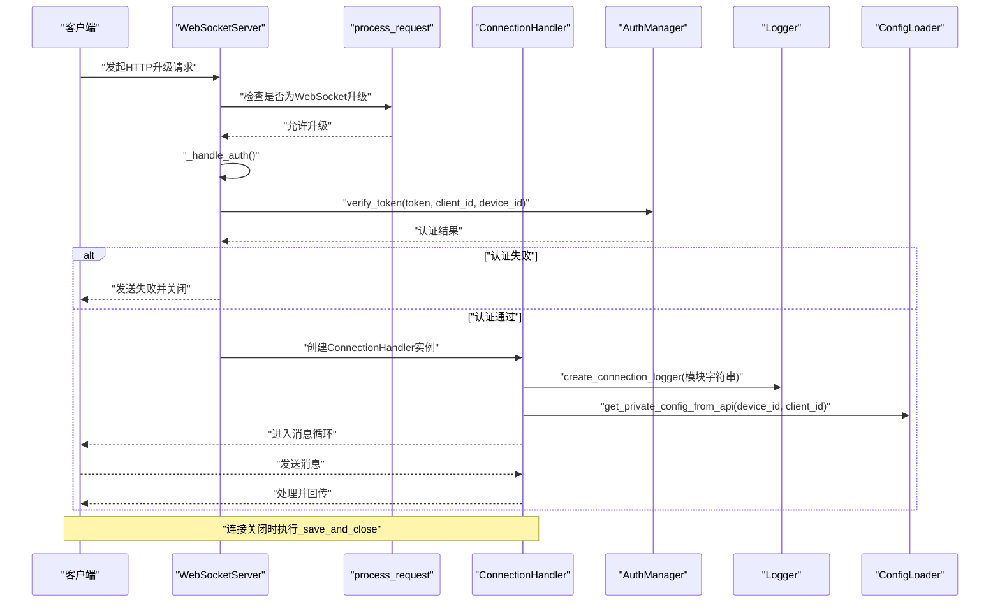
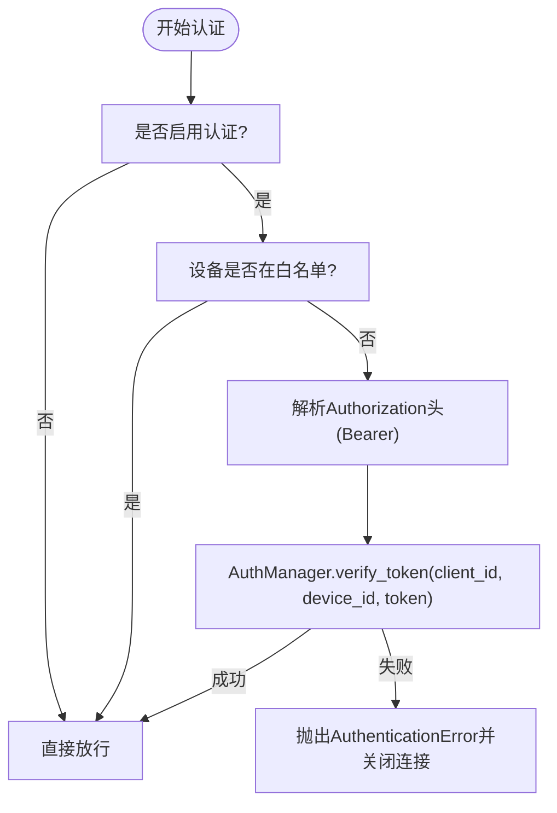
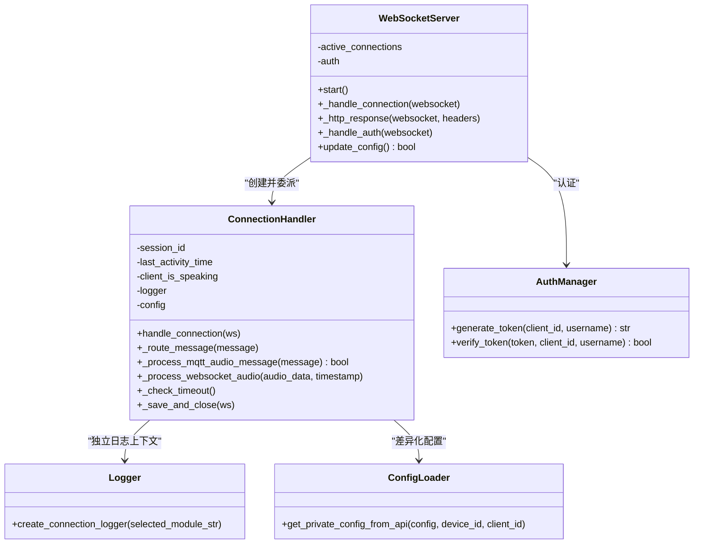
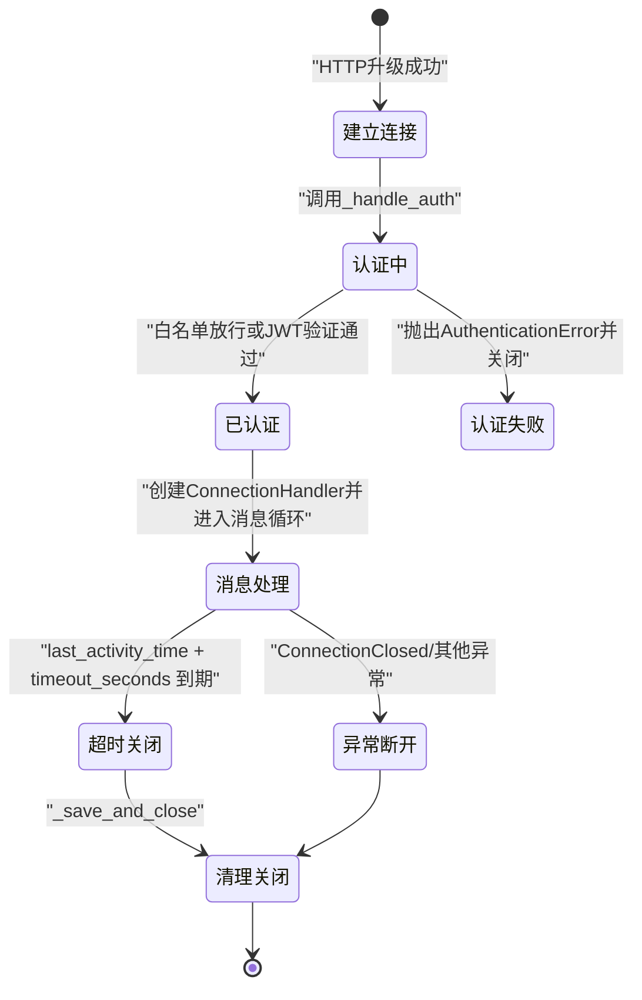
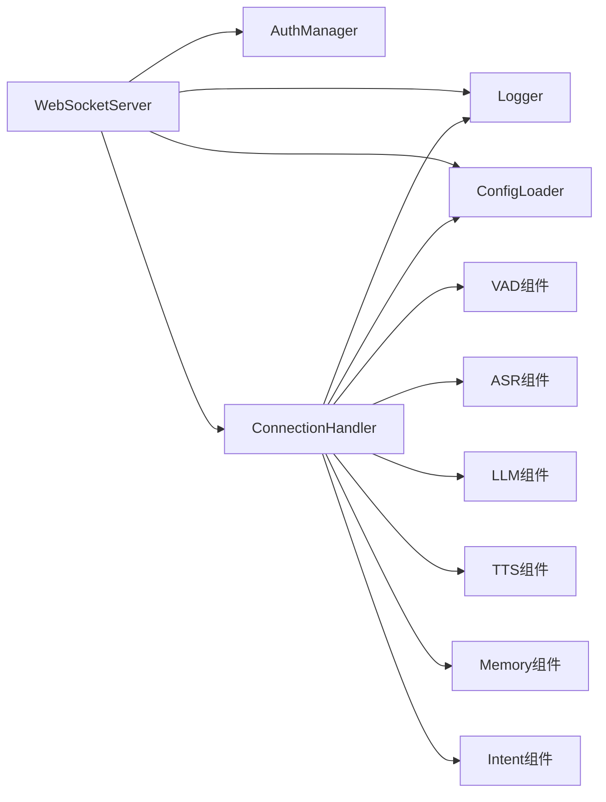

# 连接管理机制

<cite>
**本文引用的文件**
- [websocket_server.py](file://core/websocket_server.py)
- [connection.py](file://core/connection.py)
- [auth.py](file://core/auth.py)
- [logger.py](file://config/logger.py)
- [config_loader.py](file://config/config_loader.py)
- [http_server.py](file://core/http_server.py)
- [util.py](file://core/utils/util.py)
</cite>

## 目录
1. [引言](#引言)
2. [项目结构](#项目结构)
3. [核心组件](#核心组件)
4. [架构总览](#架构总览)
5. [详细组件分析](#详细组件分析)
6. [依赖关系分析](#依赖关系分析)
7. [性能与并发特性](#性能与并发特性)
8. [故障排查指南](#故障排查指南)
9. [结论](#结论)

## 引言
本文件围绕 xiaozhi-server 的连接管理机制展开，重点阐述 WebSocketServer 如何监听端口并处理新的 WebSocket 连接请求，如何从 HTTP 升级请求中提取 device-id、client-id 和 authorization token；深入分析 _authenticate 方法的认证逻辑（基于 JWT 的 token 验证与设备白名单放行）；描述 ConnectionHandler 的创建过程及其在管理单个设备会话中的核心作用（会话 ID 生成、连接超时检测、客户端状态管理、资源清理），以及每个连接如何拥有独立的日志上下文与私有配置副本。最后给出连接生命周期状态图，并讨论高并发场景下的连接池管理、线程安全与异常断开恢复策略。

## 项目结构
该模块采用“服务层 + 会话层 + 认证层 + 日志与配置”的分层设计：
- 服务层：WebSocketServer 负责监听端口、处理 HTTP 升级请求、认证与连接委派。
- 会话层：ConnectionHandler 负责单连接生命周期管理、消息路由、状态维护与资源清理。
- 认证层：AuthManager 提供基于 HMAC-SHA256 的 token 生成与验证。
- 日志与配置：logger.py 提供统一日志与连接级日志上下文；config_loader.py 提供配置加载与差异化配置拉取。

图表来源
- [websocket_server.py](file://core/websocket_server.py#L46-L123)
- [connection.py](file://core/connection.py#L55-L120)
- [auth.py](file://core/auth.py#L13-L73)
- [logger.py](file://config/logger.py#L112-L115)
- [config_loader.py](file://config/config_loader.py#L77-L80)
- [http_server.py](file://core/http_server.py#L10-L71)

章节来源
- [websocket_server.py](file://core/websocket_server.py#L1-L123)
- [connection.py](file://core/connection.py#L55-L120)
- [logger.py](file://config/logger.py#L112-L115)
- [config_loader.py](file://config/config_loader.py#L77-L80)
- [http_server.py](file://core/http_server.py#L10-L71)

## 核心组件
- WebSocketServer：负责启动监听、处理 HTTP 升级、认证与连接委派，维护活跃连接集合。
- ConnectionHandler：负责单连接生命周期、消息路由、状态管理、超时检测、资源清理与日志上下文。
- AuthManager：提供基于时间戳与 HMAC-SHA256 的 token 生成与验证，支持白名单放行。
- Logger：提供统一日志与连接级日志上下文（绑定模块字符串）。
- ConfigLoader：提供差异化配置拉取与目录初始化。

章节来源
- [websocket_server.py](file://core/websocket_server.py#L15-L123)
- [connection.py](file://core/connection.py#L55-L120)
- [auth.py](file://core/auth.py#L13-L73)
- [logger.py](file://config/logger.py#L112-L115)
- [config_loader.py](file://config/config_loader.py#L77-L80)

## 架构总览
WebSocketServer 通过 websockets.serve 监听指定主机与端口，process_request 用于区分 WebSocket 升级请求与普通 HTTP 请求。新连接到达时先进行认证（白名单放行或 JWT 验证），随后创建 ConnectionHandler 并交由其接管生命周期管理。ConnectionHandler 内部维护独立日志上下文与私有配置副本，负责消息路由、状态维护与资源清理。

图表来源
- [websocket_server.py](file://core/websocket_server.py#L46-L123)
- [websocket_server.py](file://core/websocket_server.py#L184-L206)
- [connection.py](file://core/connection.py#L165-L210)
- [auth.py](file://core/auth.py#L52-L73)
- [logger.py](file://config/logger.py#L112-L115)
- [config_loader.py](file://config/config_loader.py#L77-L80)

## 详细组件分析

### WebSocketServer：监听与连接处理
- 监听与升级：通过 websockets.serve(host, port, process_request=self._http_response) 启动监听；process_request 返回 None 允许 WebSocket 升级，否则返回“Server is running”。
- 新连接入口：_handle_connection 在认证通过后创建 ConnectionHandler 实例，并将其加入 active_connections 集合；异常时确保从集合移除并安全关闭连接。
- 认证前置：_handle_auth 支持白名单放行与 JWT 验证；若未启用认证或设备在白名单内则直接放行；否则要求 Authorization 头（Bearer token），并调用 AuthManager.verify_token 校验。
- 配置更新：update_config 支持热更新配置并重新初始化组件，使用 config_lock 保证并发安全。

章节来源
- [websocket_server.py](file://core/websocket_server.py#L46-L123)
- [websocket_server.py](file://core/websocket_server.py#L184-L206)
- [websocket_server.py](file://core/websocket_server.py#L133-L183)

### 认证逻辑：_authenticate 与 AuthManager
- 白名单放行：若启用了 allowed_devices 且 device-id 在其中，则无需 token 直接放行。
- JWT 验证：从 Authorization 头提取 token（去除 Bearer 前缀），调用 AuthManager.verify_token(client_id, device_id, token) 校验；校验内容包含时间戳与签名，过期则失败。
- 异常处理：认证失败抛出 AuthenticationError，上层捕获并关闭连接。

图表来源
- [websocket_server.py](file://core/websocket_server.py#L184-L206)
- [auth.py](file://core/auth.py#L52-L73)

章节来源
- [websocket_server.py](file://core/websocket_server.py#L184-L206)
- [auth.py](file://core/auth.py#L13-L73)

### ConnectionHandler：单连接生命周期与状态管理
- 创建与初始化
  - 会话 ID：使用 UUID 生成 session_id。
  - 日志上下文：在 _initialize_components 中调用 create_connection_logger，绑定模块字符串，形成独立日志上下文。
  - 私有配置：在 handle_connection 中调用 _initialize_private_config，从 API 拉取差异化配置并按需初始化组件。
- 生命周期
  - 进入消息循环：async for message in self.websocket: 路由到 _route_message。
  - 资源清理：finally 中调用 _save_and_close，异步保存记忆并关闭连接。
- 消息路由
  - 文本消息：交由文本处理模块处理。
  - 音频消息：若来自 MQTT 网关，解析 16 字节头部并按时间戳排序；否则直接入队。
- 客户端状态管理
  - client_is_speaking：用于指示客户端说话状态（在音频处理链路中使用）。
  - last_activity_time：记录最近活动时间戳，用于超时检测。
- 超时检测：_check_timeout 以 10 秒为间隔检查，超过 timeout_seconds 后关闭连接。
- 关闭流程：close 与 _save_and_close 保证异常断开也能安全回收资源。

图表来源
- [websocket_server.py](file://core/websocket_server.py#L46-L123)
- [connection.py](file://core/connection.py#L55-L120)
- [connection.py](file://core/connection.py#L165-L210)
- [connection.py](file://core/connection.py#L265-L314)
- [connection.py](file://core/connection.py#L1122-L1151)
- [auth.py](file://core/auth.py#L13-L73)
- [logger.py](file://config/logger.py#L112-L115)
- [config_loader.py](file://config/config_loader.py#L77-L80)

章节来源
- [connection.py](file://core/connection.py#L55-L120)
- [connection.py](file://core/connection.py#L165-L210)
- [connection.py](file://core/connection.py#L265-L314)
- [connection.py](file://core/connection.py#L1122-L1151)
- [logger.py](file://config/logger.py#L112-L115)
- [config_loader.py](file://config/config_loader.py#L77-L80)

### 连接生命周期状态图

图表来源
- [websocket_server.py](file://core/websocket_server.py#L184-L206)
- [connection.py](file://core/connection.py#L165-L210)
- [connection.py](file://core/connection.py#L231-L264)
- [connection.py](file://core/connection.py#L1122-L1151)

## 依赖关系分析
- WebSocketServer 依赖：
  - AuthManager：用于 JWT 验证与白名单放行。
  - ConnectionHandler：用于会话管理。
  - ConfigLoader：用于配置热更新与差异化配置。
  - Logger：用于统一日志输出。
- ConnectionHandler 依赖：
  - Logger：独立日志上下文。
  - ConfigLoader：差异化配置拉取。
  - 各类组件（VAD/ASR/LLM/TTS/Memory/Intent）：通过 initialize_modules 动态初始化。
- 线程与并发：
  - ConnectionHandler 使用 ThreadPoolExecutor 管理组件初始化与异步任务。
  - _check_timeout 使用 asyncio 任务定期检查超时。
  - WebSocketServer 使用 asyncio.Lock 保护配置更新。

图表来源
- [websocket_server.py](file://core/websocket_server.py#L15-L123)
- [connection.py](file://core/connection.py#L394-L442)
- [config_loader.py](file://config/config_loader.py#L77-L80)
- [logger.py](file://config/logger.py#L112-L115)

章节来源
- [websocket_server.py](file://core/websocket_server.py#L15-L123)
- [connection.py](file://core/connection.py#L394-L442)

## 性能与并发特性
- 连接池与并发
  - active_connections 使用集合存储，便于快速查找与去重。
  - WebSocketServer 使用 asyncio.Lock 保护配置更新，避免竞态。
  - ConnectionHandler 使用 ThreadPoolExecutor 控制组件初始化与异步任务，避免阻塞事件循环。
- 超时与资源回收
  - _check_timeout 以固定周期检查 last_activity_time，超时后关闭连接，防止僵尸连接占用资源。
  - _save_and_close 异步保存记忆并在完成后关闭连接，避免阻塞主消息循环。
- 线程安全
  - 日志使用 enqueue 异步安全输出。
  - 配置更新通过锁保护。
  - 音频队列与状态字段在会话内使用，避免跨连接共享导致竞争。
- 高并发建议
  - 合理设置 timeout_seconds，平衡资源占用与用户体验。
  - 对外部组件（如 ASR/TTS）进行限流与背压处理，避免队列无限增长。
  - 在 MQTT 网关场景下，利用时间戳排序减少乱序带来的处理复杂度。

章节来源
- [websocket_server.py](file://core/websocket_server.py#L133-L183)
- [connection.py](file://core/connection.py#L1122-L1151)
- [logger.py](file://config/logger.py#L83-L106)

## 故障排查指南
- 认证失败
  - 检查 Authorization 头是否为 Bearer token，且未过期。
  - 若设备在白名单内仍被拒绝，确认 allowed_devices 配置与 device-id 是否一致。
- 连接无法建立
  - 确认端口与主机配置正确，HTTP 升级请求是否被 process_request 正确放行。
  - 检查服务器日志，定位 _handle_auth 或 _handle_connection 抛错位置。
- 超时断开
  - 检查 last_activity_time 是否被正确刷新（音频/文本消息应更新该时间戳）。
  - 调整 timeout_seconds 以适应业务场景。
- 资源清理异常
  - 查看 _save_and_close 中的记忆保存与关闭流程日志，确认异常点。
- 日志上下文
  - 确认 create_connection_logger 已绑定模块字符串，以便区分不同连接的输出。

章节来源
- [websocket_server.py](file://core/websocket_server.py#L184-L206)
- [connection.py](file://core/connection.py#L231-L264)
- [logger.py](file://config/logger.py#L112-L115)

## 结论
xiaozhi-server 的连接管理机制以 WebSocketServer 为核心入口，结合 AuthManager 的 JWT 验证与白名单放行策略，确保连接安全；ConnectionHandler 负责单连接的生命周期管理，提供独立日志上下文与私有配置副本，保障会话隔离与可扩展性。通过超时检测、异常断开恢复与线程池管理，系统在高并发场景下具备良好的稳定性与可维护性。建议在生产环境中配合合理的超时阈值、队列背压与监控告警，持续优化连接质量与资源利用率。