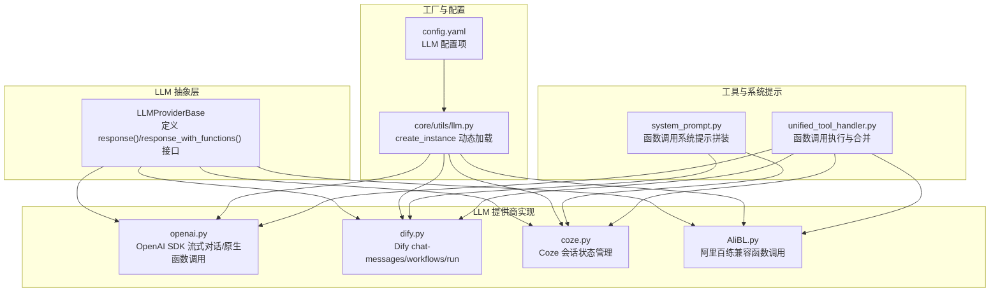
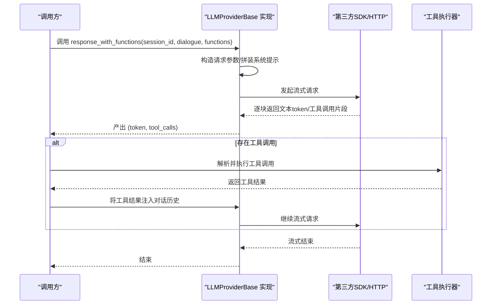
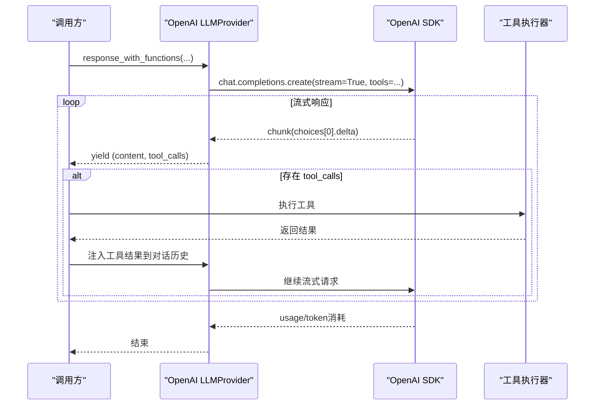
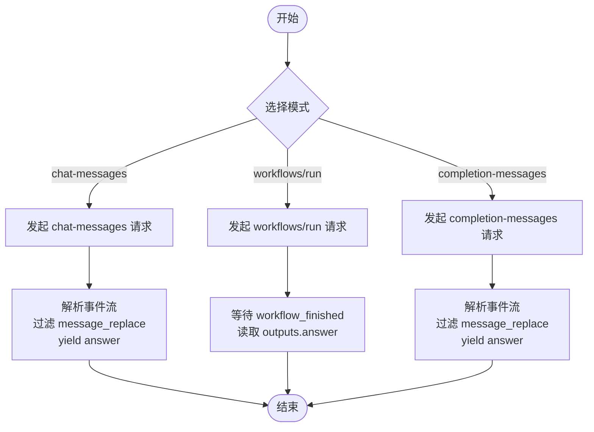
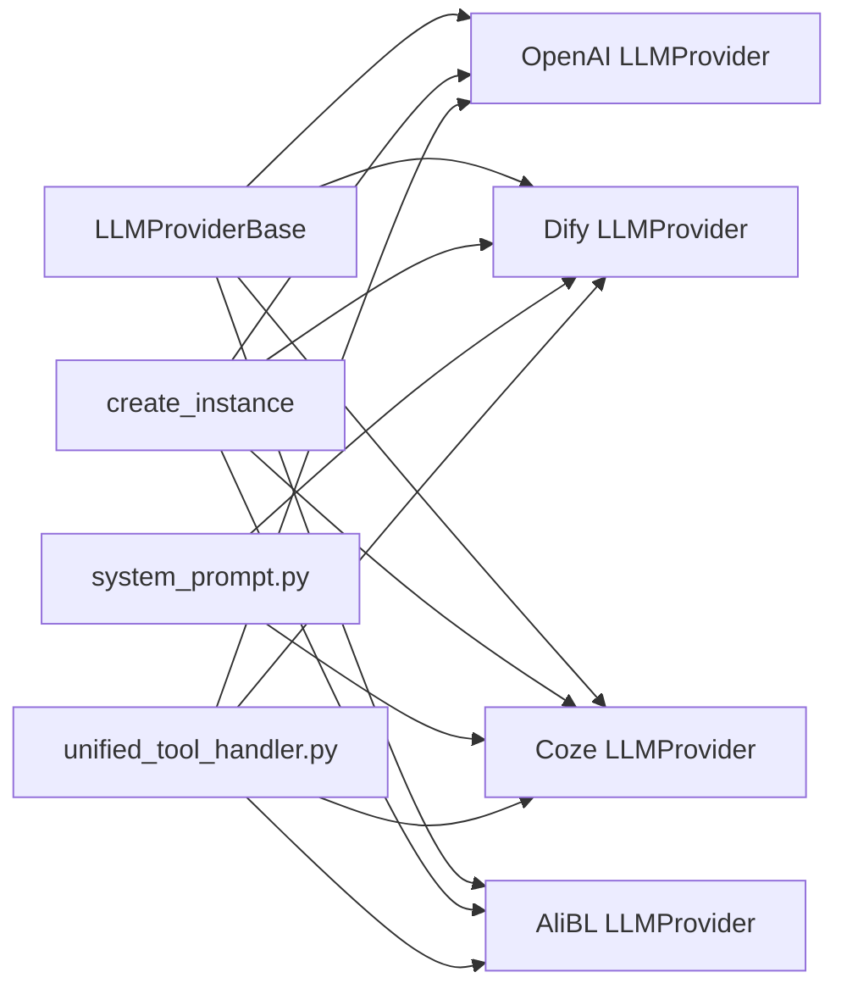
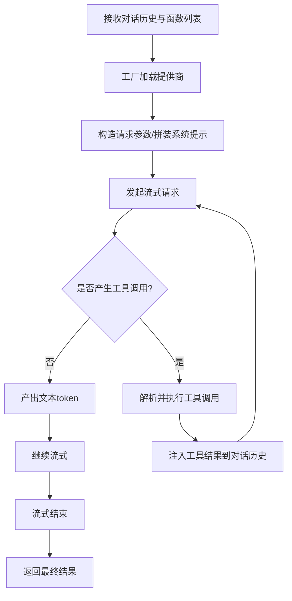

# 大语言模型(LLM)

<cite>
**本文引用的文件**
- [core/providers/llm/base.py](file://core/providers/llm/base.py)
- [core/providers/llm/openai/openai.py](file://core/providers/llm/openai/openai.py)
- [core/providers/llm/dify/dify.py](file://core/providers/llm/dify/dify.py)
- [core/providers/llm/coze/coze.py](file://core/providers/llm/coze/coze.py)
- [core/providers/llm/AliBL/AliBL.py](file://core/providers/llm/AliBL/AliBL.py)
- [core/utils/llm.py](file://core/utils/llm.py)
- [core/providers/llm/system_prompt.py](file://core/providers/llm/system_prompt.py)
- [core/providers/tools/unified_tool_handler.py](file://core/providers/tools/unified_tool_handler.py)
- [config.yaml](file://config.yaml)
- [config/settings.py](file://config/settings.py)
- [performance_tester/performance_tester_llm.py](file://performance_tester/performance_tester_llm.py)
</cite>

## 目录
1. [简介](#简介)
2. [项目结构](#项目结构)
3. [核心组件](#核心组件)
4. [架构总览](#架构总览)
5. [详细组件分析](#详细组件分析)
6. [依赖关系分析](#依赖关系分析)
7. [性能考量](#性能考量)
8. [故障排查指南](#故障排查指南)
9. [结论](#结论)
10. [附录](#附录)

## 简介
本章节面向系统的核心推理引擎——大语言模型（LLM）模块，重点阐述：
- 抽象基类 LLMProviderBase 的职责与接口设计，包括流式响应 response() 与函数调用 response_with_functions() 的约定。
- 多家提供商的实现机制与差异：以 openai.py 为例说明 OpenAI SDK 的流式对话与原生函数调用；以 dify.py 展示与 Dify 平台 chat-messages/workflows/run 模式的集成；以 coze.py 解析与 Coze 平台的会话状态管理；以 AliBL.py 说明平台限制导致的函数调用兼容策略。
- 工厂函数 create_instance 如何动态加载 LLM 提供商。
- 从接收对话历史、构造请求、处理流式响应到解析工具调用结果的完整调用示例。
- 不同提供商的配置参数、性能优化与错误处理策略。

## 项目结构
LLM 模块位于 core/providers/llm 下，采用“按提供商分目录”的组织方式，每个提供商以独立文件实现统一的抽象接口。工厂函数位于 core/utils/llm.py，负责按配置动态实例化具体提供商。

图表来源
- [core/providers/llm/base.py](file://core/providers/llm/base.py#L1-L40)
- [core/providers/llm/openai/openai.py](file://core/providers/llm/openai/openai.py#L1-L143)
- [core/providers/llm/dify/dify.py](file://core/providers/llm/dify/dify.py#L1-L113)
- [core/providers/llm/coze/coze.py](file://core/providers/llm/coze/coze.py#L1-L76)
- [core/providers/llm/AliBL/AliBL.py](file://core/providers/llm/AliBL/AliBL.py#L1-L110)
- [core/utils/llm.py](file://core/utils/llm.py#L1-L24)
- [core/providers/llm/system_prompt.py](file://core/providers/llm/system_prompt.py#L1-L103)
- [core/providers/tools/unified_tool_handler.py](file://core/providers/tools/unified_tool_handler.py#L140-L236)
- [config.yaml](file://config.yaml#L477-L610)

章节来源
- [core/providers/llm/base.py](file://core/providers/llm/base.py#L1-L40)
- [core/utils/llm.py](file://core/utils/llm.py#L1-L24)
- [config.yaml](file://config.yaml#L477-L610)

## 核心组件
- 抽象基类 LLMProviderBase
  - 定义流式响应接口 response(session_id, dialogue)。
  - 提供默认实现 response_with_functions(session_id, dialogue, functions=None)，对不支持原生函数调用的提供商进行兼容：直接透传文本流并返回空工具调用标记。
  - 提供便捷的非流式 response_no_stream(system_prompt, user_prompt, **kwargs)。
- OpenAI 提供商
  - 使用 OpenAI SDK 进行流式对话与原生函数调用，支持温度、最大生成 token、top_p、频率惩罚等参数。
  - 函数调用模式下，逐块产出文本 token 与工具调用片段，同时记录 token 消耗。
- Dify 提供商
  - 支持三种模式：chat-messages、workflows/run、completion-messages。
  - 通过会话映射维护 session_id 与 conversation_id 的关系，按事件流解析答案。
  - 通过系统提示拼装函数调用上下文，兼容不支持原生函数调用的场景。
- Coze 提供商
  - 使用官方 Python SDK，按会话维度维护 conversation_id。
  - 通过系统提示拼装函数调用上下文，兼容不支持原生函数调用的场景。
- 阿里百练（AliBL）提供商
  - 平台当前未实现原生函数调用，通过默认实现回退为纯文本流式输出，上层以 (token, None) 形式消费。
- 工厂函数 create_instance
  - 根据配置中的 type 与提供商目录名动态导入并实例化对应 LLMProvider。

章节来源
- [core/providers/llm/base.py](file://core/providers/llm/base.py#L1-L40)
- [core/providers/llm/openai/openai.py](file://core/providers/llm/openai/openai.py#L1-L143)
- [core/providers/llm/dify/dify.py](file://core/providers/llm/dify/dify.py#L1-L113)
- [core/providers/llm/coze/coze.py](file://core/providers/llm/coze/coze.py#L1-L76)
- [core/providers/llm/AliBL/AliBL.py](file://core/providers/llm/AliBL/AliBL.py#L1-L110)
- [core/utils/llm.py](file://core/utils/llm.py#L1-L24)

## 架构总览
LLM 模块遵循“抽象基类 + 多实现 + 工厂加载”的分层设计。上层业务通过统一接口发起对话与工具调用，底层由各提供商对接第三方平台或本地服务。工具调用链路由统一处理器解析并执行，再将结果注入对话历史，形成闭环。

图表来源
- [core/providers/llm/base.py](file://core/providers/llm/base.py#L1-L40)
- [core/providers/llm/openai/openai.py](file://core/providers/llm/openai/openai.py#L58-L143)
- [core/providers/llm/dify/dify.py](file://core/providers/llm/dify/dify.py#L22-L113)
- [core/providers/llm/coze/coze.py](file://core/providers/llm/coze/coze.py#L30-L76)
- [core/providers/llm/AliBL/AliBL.py](file://core/providers/llm/AliBL/AliBL.py#L23-L110)
- [core/providers/tools/unified_tool_handler.py](file://core/providers/tools/unified_tool_handler.py#L140-L236)

## 详细组件分析

### 抽象基类 LLMProviderBase
- 职责
  - 定义流式响应接口 response(session_id, dialogue)。
  - 提供默认的函数调用接口 response_with_functions(session_id, dialogue, functions=None)，对不支持原生函数调用的提供商进行兼容。
  - 提供便捷的非流式 response_no_stream(system_prompt, user_prompt, **kwargs)。
- 设计要点
  - 统一接口约定，保证上层调用一致性。
  - 默认实现确保“无函数调用能力”的提供商也能参与统一流程。

章节来源
- [core/providers/llm/base.py](file://core/providers/llm/base.py#L1-L40)

### OpenAI 提供商（openai.py）
- 流式对话
  - 使用 OpenAI SDK chat.completions.create，开启流式返回，逐块提取 delta.content 并过滤特殊标记。
  - 支持可选参数：max_tokens、temperature、top_p、frequency_penalty。
- 原生函数调用
  - 通过 tools 字段传递函数描述，逐块产出 (content, tool_calls)。
  - 记录 token 消耗信息，便于性能监控。
- 错误处理
  - 捕获异常并返回错误提示，避免中断流式过程。

图表来源
- [core/providers/llm/openai/openai.py](file://core/providers/llm/openai/openai.py#L58-L143)
- [core/providers/tools/unified_tool_handler.py](file://core/providers/tools/unified_tool_handler.py#L140-L236)

章节来源
- [core/providers/llm/openai/openai.py](file://core/providers/llm/openai/openai.py#L1-L143)

### Dify 提供商（dify.py）
- 模式支持
  - chat-messages：标准对话模式，按事件流解析 answer。
  - workflows/run：工作流模式，等待 workflow_finished 事件并读取 outputs.answer。
  - completion-messages：文本生成模式，按事件流解析 answer。
- 会话管理
  - 维护 session_id 与 conversation_id 的映射，首次请求时获取并缓存。
- 函数调用兼容
  - 通过系统提示拼装函数描述，将工具调用转化为文本提示，使不支持原生函数调用的场景也能工作。
  - 当最后一条消息为 role="tool" 时，将其结果拼接到用户消息中，形成连续对话。

图表来源
- [core/providers/llm/dify/dify.py](file://core/providers/llm/dify/dify.py#L22-L113)
- [core/providers/llm/system_prompt.py](file://core/providers/llm/system_prompt.py#L1-L103)

章节来源
- [core/providers/llm/dify/dify.py](file://core/providers/llm/dify/dify.py#L1-L113)
- [core/providers/llm/system_prompt.py](file://core/providers/llm/system_prompt.py#L1-L103)

### Coze 提供商（coze.py）
- 会话状态管理
  - 首次对话创建 conversation，后续复用 conversation_id。
  - 通过 SDK 事件流逐块产出内容。
- 函数调用兼容
  - 通过系统提示拼装函数描述，将工具调用转化为文本提示。
  - 当最后一条消息为 role="tool" 时，将其结果拼接到用户消息中，形成连续对话。

章节来源
- [core/providers/llm/coze/coze.py](file://core/providers/llm/coze/coze.py#L1-L76)
- [core/providers/llm/system_prompt.py](file://core/providers/llm/system_prompt.py#L1-L103)

### 阿里百练（AliBL）提供商（AliBL.py）
- 流式处理
  - 使用 DashScope Application.call，支持 SDK 原生流式与回退的非流式模式。
  - SDK 流式为增量覆盖，通过 last_text 计算差量输出；非流式按配置分片输出。
- 函数调用兼容
  - 平台未实现原生函数调用，回退为纯文本流式输出，上层以 (token, None) 形式消费。

章节来源
- [core/providers/llm/AliBL/AliBL.py](file://core/providers/llm/AliBL/AliBL.py#L1-L110)

### 工具调用执行与合并（unified_tool_handler.py）
- 单/多函数调用
  - 支持多函数调用聚合，按顺序执行并合并结果。
  - 对参数字符串尝试 JSON 解析，失败则返回错误响应。
- 结果合并
  - 合并多个工具调用的结果，确定最终动作类型（如需要再次请求 LLM）。

章节来源
- [core/providers/tools/unified_tool_handler.py](file://core/providers/tools/unified_tool_handler.py#L140-L236)

### 工厂函数 create_instance（core/utils/llm.py）
- 动态加载
  - 根据配置中的 type 与提供商目录名，动态导入模块并实例化 LLMProvider。
  - 若目录不存在则抛出错误，提示配置 type 设置不正确。

章节来源
- [core/utils/llm.py](file://core/utils/llm.py#L1-L24)

## 依赖关系分析
- 抽象层与实现层
  - LLMProviderBase 为所有提供商的共同契约，OpenAI/Dify/Coze/AliBL 均继承该基类。
- 工具链路
  - 工具处理器依赖工具管理器执行函数调用，并将结果注入对话历史，驱动后续流式请求。
- 配置与工厂
  - config.yaml 定义各提供商的配置项；工厂函数依据配置动态加载对应提供商。

图表来源
- [core/providers/llm/base.py](file://core/providers/llm/base.py#L1-L40)
- [core/providers/llm/openai/openai.py](file://core/providers/llm/openai/openai.py#L1-L143)
- [core/providers/llm/dify/dify.py](file://core/providers/llm/dify/dify.py#L1-L113)
- [core/providers/llm/coze/coze.py](file://core/providers/llm/coze/coze.py#L1-L76)
- [core/providers/llm/AliBL/AliBL.py](file://core/providers/llm/AliBL/AliBL.py#L1-L110)
- [core/utils/llm.py](file://core/utils/llm.py#L1-L24)
- [core/providers/llm/system_prompt.py](file://core/providers/llm/system_prompt.py#L1-L103)
- [core/providers/tools/unified_tool_handler.py](file://core/providers/tools/unified_tool_handler.py#L140-L236)

章节来源
- [core/providers/llm/base.py](file://core/providers/llm/base.py#L1-L40)
- [core/utils/llm.py](file://core/utils/llm.py#L1-L24)
- [core/providers/llm/system_prompt.py](file://core/providers/llm/system_prompt.py#L1-L103)
- [core/providers/tools/unified_tool_handler.py](file://core/providers/tools/unified_tool_handler.py#L140-L236)

## 性能考量
- 流式传输
  - 优先使用流式接口，降低首字节延迟，提升用户体验。
  - 对于不支持流式的提供商（如阿里百练），可通过分片输出模拟流式体验。
- 参数调优
  - temperature/top_p/max_tokens/frequency_penalty 等参数影响生成稳定性与成本，应结合业务目标调整。
- 日志与监控
  - OpenAI 提供 token 消耗统计，可用于成本控制与性能评估。
- 并发与测试
  - 性能测试脚本对不同提供商进行并发测试，提前发现配置与网络问题。

章节来源
- [core/providers/llm/openai/openai.py](file://core/providers/llm/openai/openai.py#L112-L143)
- [performance_tester/performance_tester_llm.py](file://performance_tester/performance_tester_llm.py#L237-L492)

## 故障排查指南
- 配置检查
  - 确认 config.yaml 中 LLM 配置项完整且有效，特别是 api_key、base_url、model_name 等。
  - 使用配置检查逻辑，避免本地与远端配置冲突。
- 异常处理
  - OpenAI/Dify/Coze/AliBL 均在异常时记录日志并返回错误提示，避免中断流式过程。
  - 工具调用解析失败时，统一返回错误响应，便于定位问题。
- 会话状态
  - Dify/Coze 需要维护会话映射，若首次请求失败，检查 conversation_id 获取逻辑。
- 工具调用
  - 若工具调用未触发，检查系统提示拼装与对话历史注入是否正确。

章节来源
- [config/settings.py](file://config/settings.py#L1-L34)
- [core/providers/llm/openai/openai.py](file://core/providers/llm/openai/openai.py#L99-L143)
- [core/providers/llm/dify/dify.py](file://core/providers/llm/dify/dify.py#L22-L113)
- [core/providers/llm/coze/coze.py](file://core/providers/llm/coze/coze.py#L30-L76)
- [core/providers/llm/AliBL/AliBL.py](file://core/providers/llm/AliBL/AliBL.py#L23-L110)
- [core/providers/tools/unified_tool_handler.py](file://core/providers/tools/unified_tool_handler.py#L140-L236)

## 结论
本模块通过统一抽象与工厂加载，实现了多家 LLM 提供商的无缝接入。OpenAI 提供原生函数调用能力，Dify/Coze 通过系统提示与会话管理实现函数调用兼容，阿里百练通过默认实现保障一致性。配合工具链路与性能测试，系统在复杂场景下仍能保持稳定与高效。

## 附录

### 完整 LLM 调用示例（流程说明）
- 输入
  - 会话标识 session_id
  - 对话历史 dialogue（包含 system/user/assistant/tool 等角色）
  - 可选函数列表 functions（用于函数调用）
- 步骤
  1) 工厂加载：根据配置 type 动态实例化提供商。
  2) 构造请求：将 dialogue 格式化为提供商期望的消息数组；必要时拼装系统提示（函数调用场景）。
  3) 流式请求：调用 response_with_functions，逐块产出 (content, tool_calls)。
  4) 工具调用：若存在 tool_calls，解析并执行工具；将工具结果注入对话历史。
  5) 继续流式：重复步骤 3-4，直至流式结束。
  6) 结束：返回最终文本或触发后续动作（如再次请求 LLM）。
- 输出
  - 文本流 token
  - 工具调用片段（可为空）
  - 工具执行结果（注入对话历史）

图表来源
- [core/utils/llm.py](file://core/utils/llm.py#L1-L24)
- [core/providers/llm/base.py](file://core/providers/llm/base.py#L1-L40)
- [core/providers/llm/openai/openai.py](file://core/providers/llm/openai/openai.py#L58-L143)
- [core/providers/llm/dify/dify.py](file://core/providers/llm/dify/dify.py#L22-L113)
- [core/providers/llm/coze/coze.py](file://core/providers/llm/coze/coze.py#L30-L76)
- [core/providers/llm/AliBL/AliBL.py](file://core/providers/llm/AliBL/AliBL.py#L23-L110)
- [core/providers/tools/unified_tool_handler.py](file://core/providers/tools/unified_tool_handler.py#L140-L236)

### 配置参数与最佳实践
- OpenAI
  - 关键参数：model_name、api_key、base_url、timeout、max_tokens、temperature、top_p、frequency_penalty。
  - 建议：根据业务稳定性需求调整 temperature/top_p；合理设置 max_tokens 控制成本。
- Dify
  - 关键参数：api_key、base_url、mode（chat-messages/workflows/run/completion-messages）、session_conversation_map。
  - 建议：首次请求失败时检查 conversation_id 获取逻辑；工作流模式注意 outputs 名称。
- Coze
  - 关键参数：personal_access_token、bot_id、user_id、session_conversation_map。
  - 建议：首次对话创建 conversation 并缓存；工具调用通过系统提示拼装。
- 阿里百练（AliBL）
  - 关键参数：api_key、app_id、base_url、is_no_prompt、memory_id、streaming_chunk_size。
  - 建议：SDK 流式与非流式双通道；分片大小根据网络状况调整。

章节来源
- [config.yaml](file://config.yaml#L477-L610)
- [core/providers/llm/openai/openai.py](file://core/providers/llm/openai/openai.py#L12-L57)
- [core/providers/llm/dify/dify.py](file://core/providers/llm/dify/dify.py#L12-L21)
- [core/providers/llm/coze/coze.py](file://core/providers/llm/coze/coze.py#L20-L30)
- [core/providers/llm/AliBL/AliBL.py](file://core/providers/llm/AliBL/AliBL.py#L13-L22)