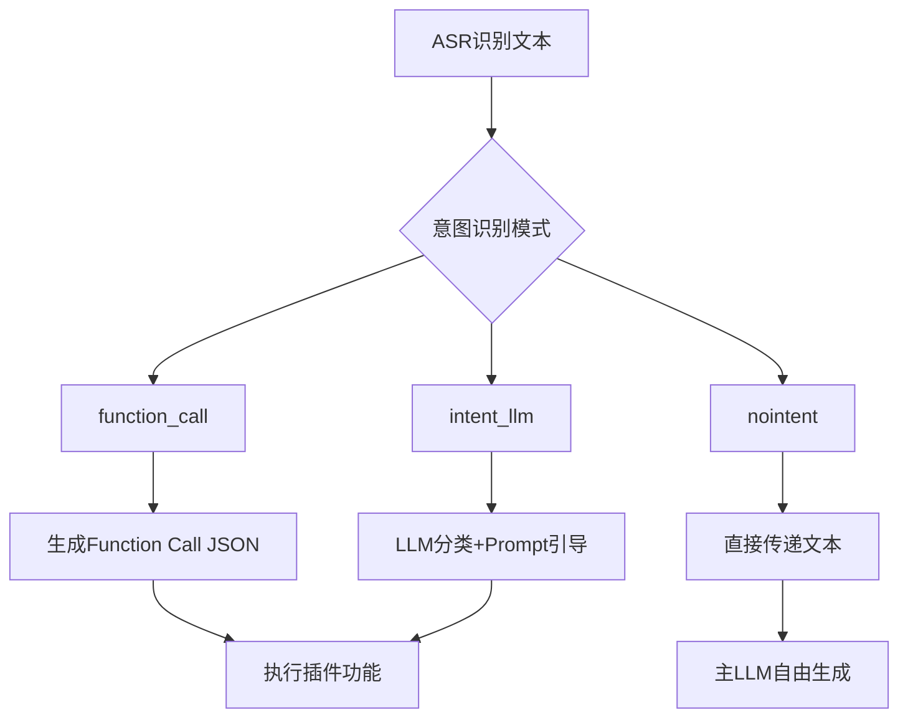
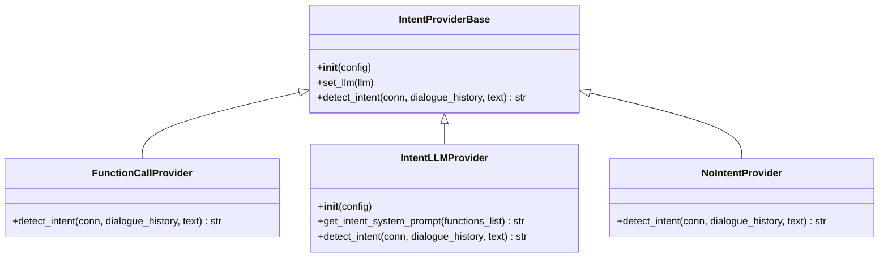

# 意图识别

<cite>
**本文档中引用的文件**  
- [base.py](file://core/providers/intent/base.py)
- [intent.py](file://core/utils/intent.py)
- [function_call.py](file://core/providers/intent/function_call/function_call.py)
- [intent_llm.py](file://core/providers/intent/intent_llm/intent_llm.py)
- [nointent.py](file://core/providers/intent/nointent/nointent.py)
- [handle_exit_intent.py](file://plugins_func/functions/handle_exit_intent.py)
- [get_weather.py](file://plugins_func/functions/get_weather.py)
- [play_music.py](file://plugins_func/functions/play_music.py)
- [intentHandler.py](file://core/handle/intentHandler.py)
</cite>

## 目录
1. [简介](#简介)
2. [核心作用与系统定位](#核心作用与系统定位)
3. [多模式设计架构](#多模式设计架构)
4. [function_call 模式详解](#function_call-模式详解)
5. [intent_llm 模式详解](#intent_llm-模式详解)
6. [nointent 模式说明](#nointent-模式说明)
7. [工厂模式与动态加载机制](#工厂模式与动态加载机制)
8. [完整处理流程示例](#完整处理流程示例)
9. [各模式适用场景与配置方法](#各模式适用场景与配置方法)
10. [性能特点分析](#性能特点分析)

## 简介

意图识别模块是智能对话系统中的关键组件，负责将自动语音识别（ASR）输出的原始文本转换为可执行的语义指令。该模块采用多模式设计架构，支持多种意图解析策略，以适应不同应用场景下的性能、准确性和灵活性需求。通过灵活的配置机制，系统能够在运行时动态选择最合适的意图识别方式。

**本节不涉及具体源码分析，因此无引用文件**

## 核心作用与系统定位

意图识别模块位于ASR模块与LLM主引擎之间，承担着语义理解与指令路由的核心职责。其主要功能包括：

- 将自然语言文本映射为结构化函数调用
- 识别用户对话中的控制意图（如退出、播放音乐等）
- 判断是否需要调用外部插件或服务
- 决定是否将文本直接传递给主LLM进行自由对话

该模块通过标准化的JSON格式输出意图结果，确保下游组件能够统一处理各类指令。

**本节不涉及具体源码分析，因此无引用文件**

## 多模式设计架构

系统提供了三种主要的意图识别模式，分别适用于不同的技术路线和业务需求：

1. **function_call 模式**：基于结构化函数调用机制，适用于支持原生function calling能力的LLM
2. **intent_llm 模式**：利用专用LLM进行意图分类，通过prompt engineering引导输出标准化指令
3. **nointent 模式**：旁路模式，直接将文本传递给主LLM，适用于完全自由对话场景

这种多模式设计使得系统具有高度的可配置性和扩展性。



**图示来源**  
- [base.py](file://core/providers/intent/base.py)
- [intent.py](file://core/utils/intent.py)

## function_call 模式详解

该模式依赖于LLM自身的function calling能力，不对输入文本进行额外的意图分析。当配置为`function_call`模式时，系统会跳过独立的意图识别步骤，直接将对话历史和当前文本提交给LLM，并期望其返回符合规范的function call结构。

此模式的优势在于减少了额外的LLM调用开销，但要求底层LLM必须具备良好的函数调用理解能力。输出格式严格遵循JSON标准，例如：
```json
{"function_call": {"name": "get_weather", "arguments": {"location": "北京"}}}
```

**本节分析基于以下源码实现：**
- [function_call.py](file://core/providers/intent/function_call/function_call.py)

## intent_llm 模式详解

该模式采用独立的LLM进行意图分类，通过精心设计的系统提示词（system prompt）引导模型输出标准化的JSON指令。其核心机制包括：

- **动态提示词生成**：根据可用插件函数列表动态构建系统提示
- **上下文感知**：结合最近的对话历史进行意图判断
- **缓存优化**：对相同设备ID和文本的请求进行结果缓存
- **多指令支持**：当用户输入包含多个指令时，返回function_calls数组

系统提示词中明确规定了输出格式要求，禁止返回任何自然语言解释，仅允许输出纯JSON。例如，对于“现在几点了？”这样的查询，会返回：
```json
{"function_call": {"name": "result_for_context"}}
```

该模式还集成了音乐文件名和智能家居设备列表等上下文信息，以提高意图识别的准确性。

**本节分析基于以下源码实现：**
- [intent_llm.py](file://core/providers/intent/intent_llm/intent_llm.py)

## nointent 模式说明

nointent模式是一种简化模式，不进行任何意图识别，始终返回“继续聊天”的指令。该模式适用于以下场景：

- 系统仅用于开放域对话
- 用户希望完全由主LLM决定响应内容
- 测试或调试阶段需要绕过意图识别逻辑

在这种模式下，所有输入文本都会被直接传递给主LLM进行处理，相当于关闭了结构化指令调用功能。

**本节分析基于以下源码实现：**
- [nointent.py](file://core/providers/intent/nointent/nointent.py)

## 工厂模式与动态加载机制

系统通过`core/utils/intent.py`中的`create_instance`工厂函数实现意图识别器的动态加载。该机制根据配置文件中的类型名称，动态导入对应的模块并创建实例。

其工作原理如下：
1. 检查指定类型的模块文件是否存在
2. 使用importlib动态导入模块
3. 创建并返回IntentProvider实例

这种设计实现了高度的模块化和可扩展性，新增意图识别模式只需在`core/providers/intent/`目录下创建对应的子模块即可，无需修改核心代码。



**图示来源**  
- [base.py](file://core/providers/intent/base.py)
- [function_call.py](file://core/providers/intent/function_call/function_call.py)
- [intent_llm.py](file://core/providers/intent/intent_llm/intent_llm.py)
- [nointent.py](file://core/providers/intent/nointent/nointent.py)

## 完整处理流程示例

以用户说“打开客厅的灯”为例，展示从语音输入到插件执行的完整流程：

1. ASR模块将语音转换为文本：“打开客厅的灯”
2. 意图识别模块（intent_llm模式）分析文本
3. LLM根据提示词判断应调用智能家居控制功能
4. 生成function call指令：
```json
{"function_call": {"name": "hass_set_state", "arguments": {"entity_id": "light.living_room", "state": "on"}}}
```
5. 系统调用homeassistant插件执行指令
6. 设备状态更新，返回执行结果

若用户说“我想结束对话”，则会触发`handle_exit_intent.py`插件：
```json
{"function_call": {"name": "handle_exit_intent", "arguments": {"say_goodbye": "再见，祝您生活愉快！"}}}
```

该插件会设置`close_after_chat = True`，并在回复后关闭连接。

**本节分析基于以下源码实现：**
- [intentHandler.py](file://core/handle/intentHandler.py)
- [handle_exit_intent.py](file://plugins_func/functions/handle_exit_intent.py)

## 各模式适用场景与配置方法

| 模式 | 适用场景 | 配置方法 | 性能特点 |
|------|---------|---------|---------|
| function_call | 使用支持function calling的LLM（如GPT系列） | 在配置文件中设置`intent_type: function_call` | 延迟低，无需额外LLM调用 |
| intent_llm | 需要高精度意图识别，支持复杂逻辑 | 设置`intent_type: intent_llm`，配置专用LLM | 准确率高，但增加一次LLM调用延迟 |
| nointent | 开放域对话，无需结构化指令 | 设置`intent_type: nointent` | 最简单，但无法调用插件功能 |

配置通常在`config.yaml`文件中完成，通过`intent_type`字段指定当前使用的模式。

**本节分析基于以下源码实现：**
- [intent.py](file://core/utils/intent.py)
- [intentHandler.py](file://core/handle/intentHandler.py)

## 性能特点分析

- **function_call 模式**：性能最优，因为复用主LLM的function calling能力，避免了额外的推理开销
- **intent_llm 模式**：准确性最高，可通过优化prompt和选择高性能LLM来提升识别质量，但会增加端到端延迟
- **nointent 模式**：资源消耗最小，适合资源受限环境，但功能最为有限

系统还实现了意图识别结果的缓存机制（基于设备ID+文本的MD5哈希），可显著降低重复查询的处理时间，特别是在移动设备频繁唤醒的场景下效果明显。

**本节分析基于以下源码实现：**
- [intent_llm.py](file://core/providers/intent/intent_llm/intent_llm.py)
- [intentHandler.py](file://core/handle/intentHandler.py)