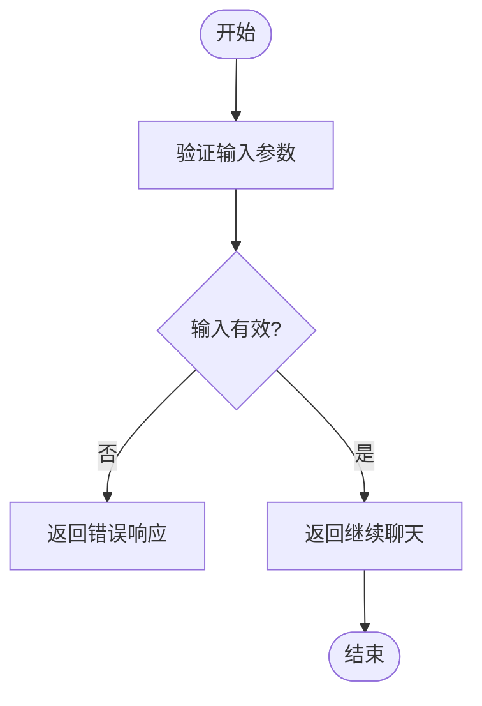
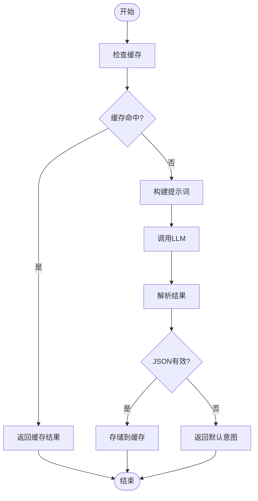
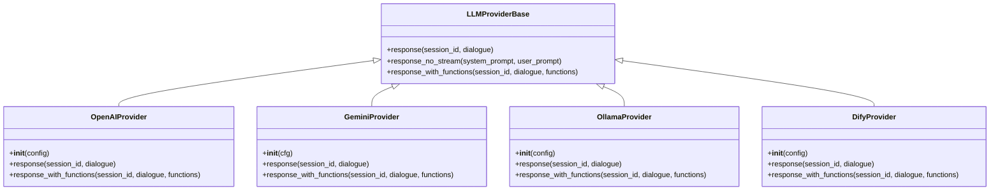
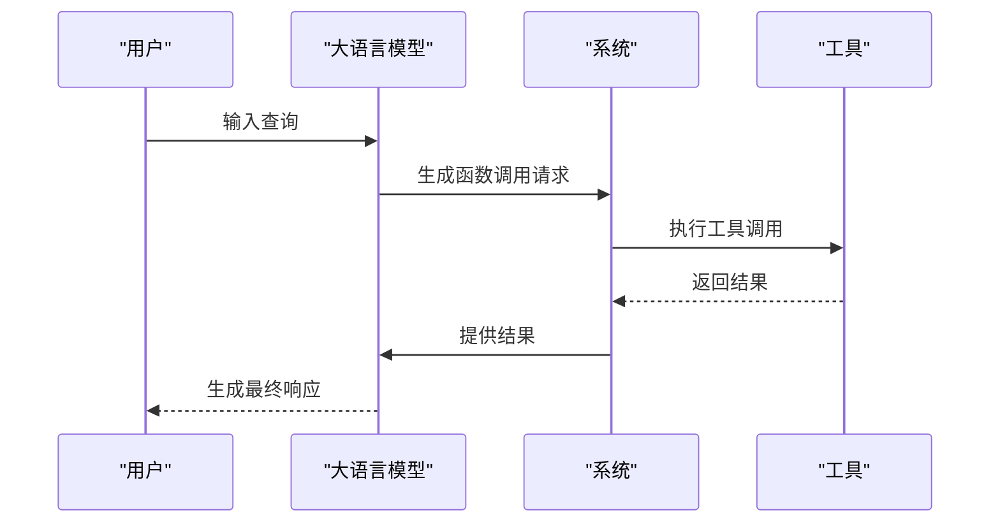
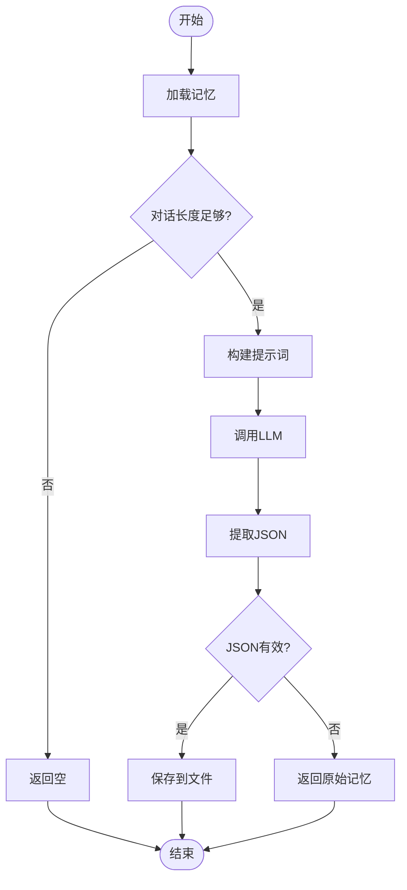
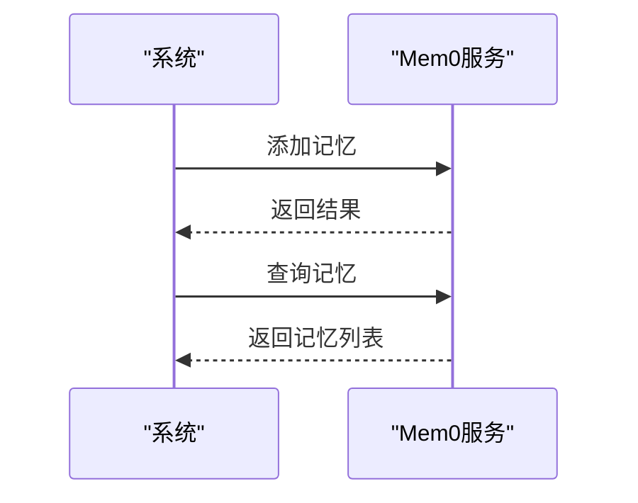
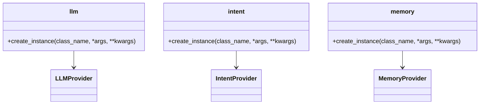
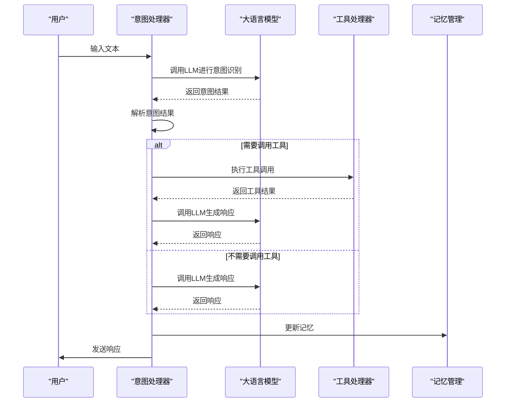

# 自然语言处理

<cite>
**本文档引用的文件**
- [function_call.py](file://core/providers/intent/function_call/function_call.py)
- [intent_llm.py](file://core/providers/intent/intent_llm/intent_llm.py)
- [base.py](file://core/providers/llm/base.py)
- [openai.py](file://core/providers/llm/openai/openai.py)
- [gemini.py](file://core/providers/llm/gemini/gemini.py)
- [ollama.py](file://core/providers/llm/ollama/ollama.py)
- [dify.py](file://core/providers/llm/dify/dify.py)
- [mem_local_short.py](file://core/providers/memory/mem_local_short/mem_local_short.py)
- [mem0ai.py](file://core/providers/memory/mem0ai/mem0ai.py)
- [llm.py](file://core/utils/llm.py)
- [intent.py](file://core/utils/intent.py)
- [memory.py](file://core/utils/memory.py)
- [unified_tool_handler.py](file://core/providers/tools/unified_tool_handler.py)
- [unified_tool_manager.py](file://core/providers/tools/unified_tool_manager.py)
- [intentHandler.py](file://core/handle/intentHandler.py)
</cite>

## 目录
1. [引言](#引言)
2. [核心功能概述](#核心功能概述)
3. [意图识别机制](#意图识别机制)
4. [大语言模型（LLM）交互](#大语言模型llm交互)
5. [记忆管理](#记忆管理)
6. [工具函数与辅助模块](#工具函数与辅助模块)
7. [用户查询处理流程示例](#用户查询处理流程示例)
8. [结论](#结论)

## 引言
自然语言处理模块是系统中的核心组件，位于自动语音识别（ASR）之后，负责理解用户输入的文本意图并生成智能响应。该模块通过集成多种先进技术，实现了从意图识别、大语言模型交互到记忆管理的完整闭环。本文档将详细阐述该模块的三大核心功能：意图识别、大语言模型（LLM）交互和记忆管理，并说明其在系统中的位置和作用。

## 核心功能概述
自然语言处理模块主要由三个核心功能组成：意图识别、大语言模型（LLM）交互和记忆管理。这些功能协同工作，确保系统能够准确理解用户意图并生成智能响应。意图识别负责分析用户输入，确定用户的具体需求；大语言模型作为核心推理引擎，生成高质量的响应；记忆管理则在对话中保持上下文，提供个性化的服务。

**本文档引用的文件**
- [function_call.py](file://core/providers/intent/function_call/function_call.py)
- [intent_llm.py](file://core/providers/intent/intent_llm/intent_llm.py)
- [base.py](file://core/providers/llm/base.py)
- [mem_local_short.py](file://core/providers/memory/mem_local_short/mem_local_short.py)
- [mem0ai.py](file://core/providers/memory/mem0ai/mem0ai.py)

## 意图识别机制
意图识别是自然语言处理模块的第一步，负责分析用户输入的文本，确定用户的意图。系统提供了两种意图识别模式：基于`function_call.py`的结构化函数调用模式和基于`intent_llm.py`的LLM驱动的意图分类模式。系统根据配置选择合适的模式进行意图识别。

### 结构化函数调用模式
结构化函数调用模式通过`function_call.py`实现，该模式始终返回“继续聊天”的意图。这种模式适用于不需要复杂意图分析的场景，简化了处理流程。

**图示来源**
- [function_call.py](file://core/providers/intent/function_call/function_call.py#L1-L23)

### LLM驱动的意图分类模式
LLM驱动的意图分类模式通过`intent_llm.py`实现，利用大语言模型进行意图识别。该模式根据配置的意图选项和可用函数动态生成系统提示词，指导LLM进行意图分析。系统会检查用户查询是否为基础信息查询（如时间、日期等），如果是，则直接返回`result_for_context`，无需调用函数。

**图示来源**
- [intent_llm.py](file://core/providers/intent/intent_llm/intent_llm.py#L1-L271)

**本节来源**
- [intent_llm.py](file://core/providers/intent/intent_llm/intent_llm.py#L1-L271)
- [function_call.py](file://core/providers/intent/function_call/function_call.py#L1-L23)

## 大语言模型（LLM）交互
大语言模型（LLM）是自然语言处理模块的核心推理引擎，负责生成高质量的响应。`llm/base.py`定义了统一的接口，支持集成多种提供商，如`openai.py`、`gemini.py`、`ollama.py`和`dify.py`。系统通过函数调用能力，将插件功能暴露给LLM，并处理工具调用请求。

### 统一接口设计
`llm/base.py`定义了`LLMProviderBase`抽象基类，规定了所有LLM提供商必须实现的接口。该接口包括`response`方法用于生成响应，`response_no_stream`方法用于非流式响应，以及`response_with_functions`方法用于支持函数调用。

**图示来源**
- [base.py](file://core/providers/llm/base.py#L1-L40)

### 函数调用能力
系统通过`response_with_functions`方法支持函数调用能力，允许LLM调用外部工具。当LLM识别到需要调用函数时，会生成相应的函数调用请求，系统处理该请求并返回结果。这一机制使得LLM能够与外部系统交互，扩展了其功能。

**图示来源**
- [openai.py](file://core/providers/llm/openai/openai.py#L1-L143)
- [gemini.py](file://core/providers/llm/gemini/gemini.py#L1-L214)
- [ollama.py](file://core/providers/llm/ollama/ollama.py#L1-L176)
- [dify.py](file://core/providers/llm/dify/dify.py#L1-L113)

**本节来源**
- [base.py](file://core/providers/llm/base.py#L1-L40)
- [openai.py](file://core/providers/llm/openai/openai.py#L1-L143)
- [gemini.py](file://core/providers/llm/gemini/gemini.py#L1-L214)
- [ollama.py](file://core/providers/llm/ollama/ollama.py#L1-L176)
- [dify.py](file://core/providers/llm/dify/dify.py#L1-L113)

## 记忆管理
记忆管理模块负责在对话中保持上下文，提供个性化的服务。系统支持两种记忆管理方式：本地短期记忆（`mem_local_short.py`）和外部记忆服务（`mem0ai.py`）。本地短期记忆将记忆存储在本地文件中，而外部记忆服务则通过API与远程服务交互。

### 本地短期记忆
本地短期记忆通过`mem_local_short.py`实现，使用YAML文件存储记忆数据。该模块根据对话记录总结用户的重要信息，并在未来的对话中提供个性化的服务。记忆数据包括用户的身份图谱、记忆立方、关系网络等。

**图示来源**
- [mem_local_short.py](file://core/providers/memory/mem_local_short/mem_local_short.py#L1-L203)

### 外部记忆服务
外部记忆服务通过`mem0ai.py`实现，利用`mem0`库与远程服务交互。该模块将对话记录发送到远程服务，由服务进行记忆处理，并在查询时返回相关记忆。这种方式适用于需要跨设备同步记忆的场景。

**图示来源**
- [mem0ai.py](file://core/providers/memory/mem0ai/mem0ai.py#L1-L91)

**本节来源**
- [mem_local_short.py](file://core/providers/memory/mem_local_short/mem_local_short.py#L1-L203)
- [mem0ai.py](file://core/providers/memory/mem0ai/mem0ai.py#L1-L91)

## 工具函数与辅助模块
`core/utils`中的工具函数简化了LLM调用、意图解析和记忆操作。这些工具函数包括`llm.py`、`intent.py`和`memory.py`，分别用于创建LLM实例、意图实例和记忆实例。这些工具函数通过动态导入机制，支持多种提供商。

**图示来源**
- [llm.py](file://core/utils/llm.py#L1-L24)
- [intent.py](file://core/utils/intent.py#L1-L17)
- [memory.py](file://core/utils/memory.py#L1-L19)

**本节来源**
- [llm.py](file://core/utils/llm.py#L1-L24)
- [intent.py](file://core/utils/intent.py#L1-L17)
- [memory.py](file://core/utils/memory.py#L1-L19)

## 用户查询处理流程示例
以下是一个完整的用户查询处理流程示例，从文本输入到意图识别、LLM调用、工具执行（如果需要）再到最终响应生成。

1. 用户输入文本。
2. 系统通过`intentHandler.py`处理用户意图。
3. 根据配置选择意图识别模式。
4. 如果是LLM驱动的意图分类模式，调用LLM进行意图识别。
5. 根据意图结果，决定是否需要调用工具。
6. 如果需要调用工具，通过`unified_tool_handler.py`执行工具调用。
7. 工具执行结果返回后，生成最终响应。
8. 将响应发送给用户，并更新记忆。

**图示来源**
- [intentHandler.py](file://core/handle/intentHandler.py#L1-L208)
- [unified_tool_handler.py](file://core/providers/tools/unified_tool_handler.py#L1-L236)

**本节来源**
- [intentHandler.py](file://core/handle/intentHandler.py#L1-L208)
- [unified_tool_handler.py](file://core/providers/tools/unified_tool_handler.py#L1-L236)

## 结论
自然语言处理模块通过集成意图识别、大语言模型交互和记忆管理三大功能，实现了从用户输入到智能响应的完整闭环。该模块的设计灵活，支持多种意图识别模式和LLM提供商，能够适应不同的应用场景。通过工具函数和辅助模块，简化了开发和维护工作，提高了系统的可扩展性和可维护性。