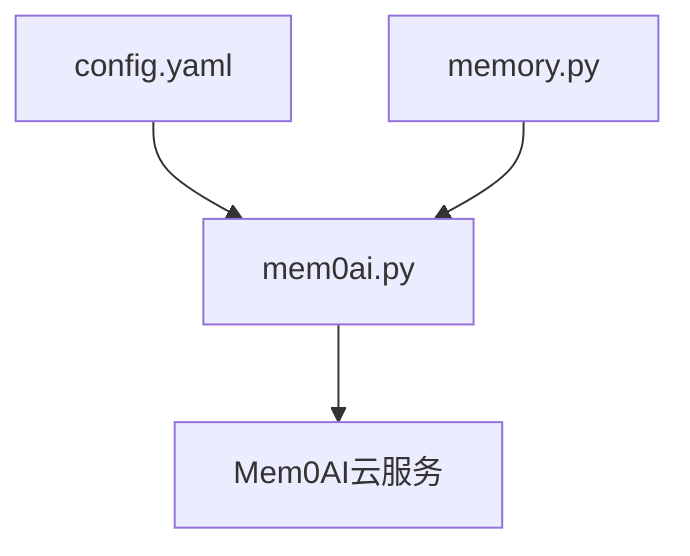
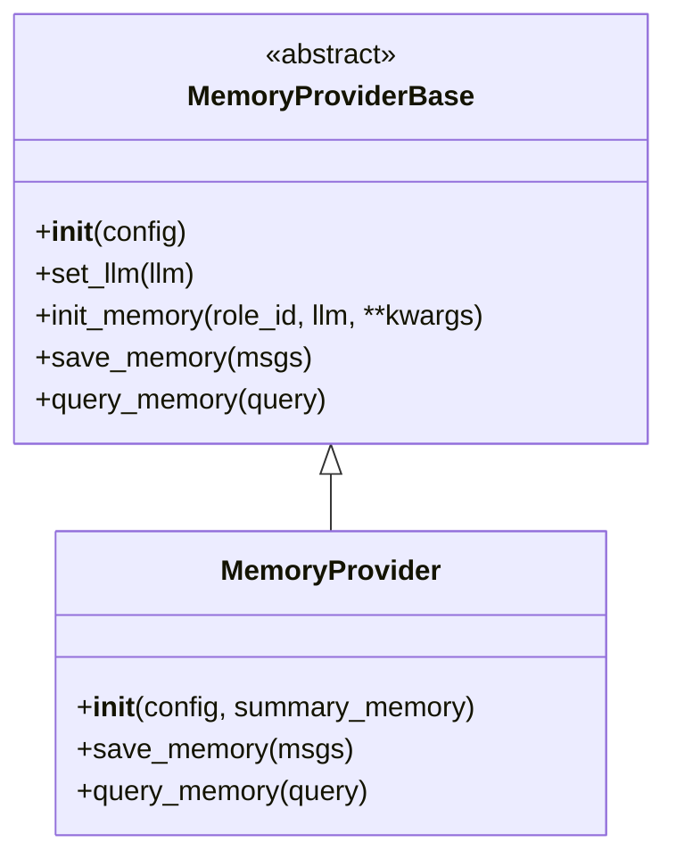
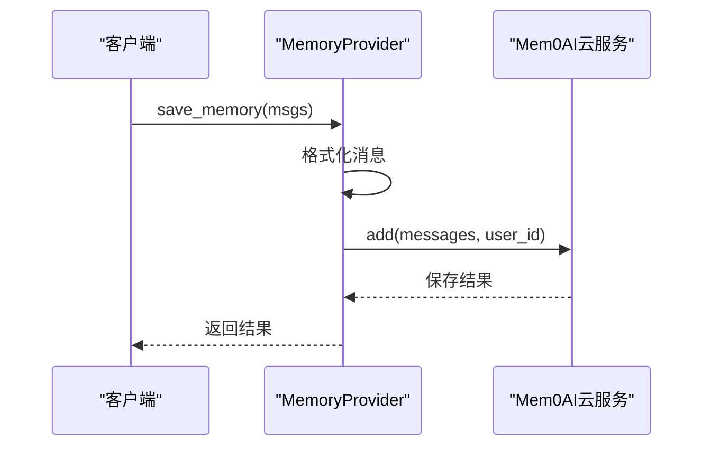
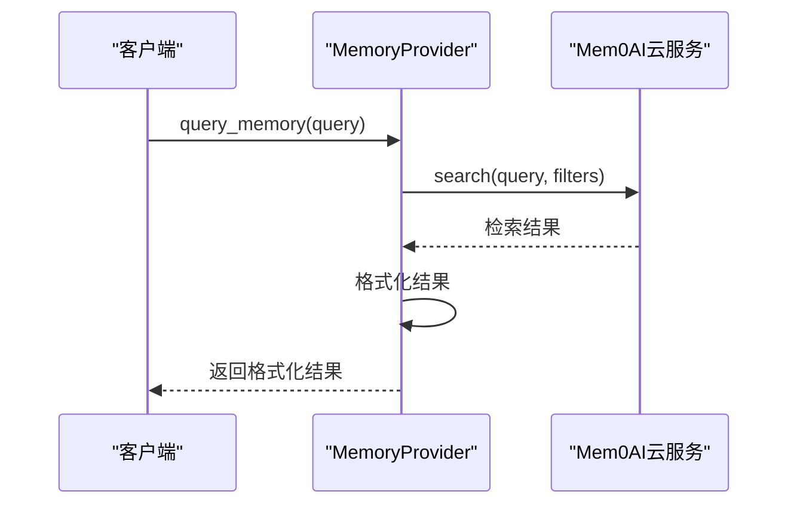
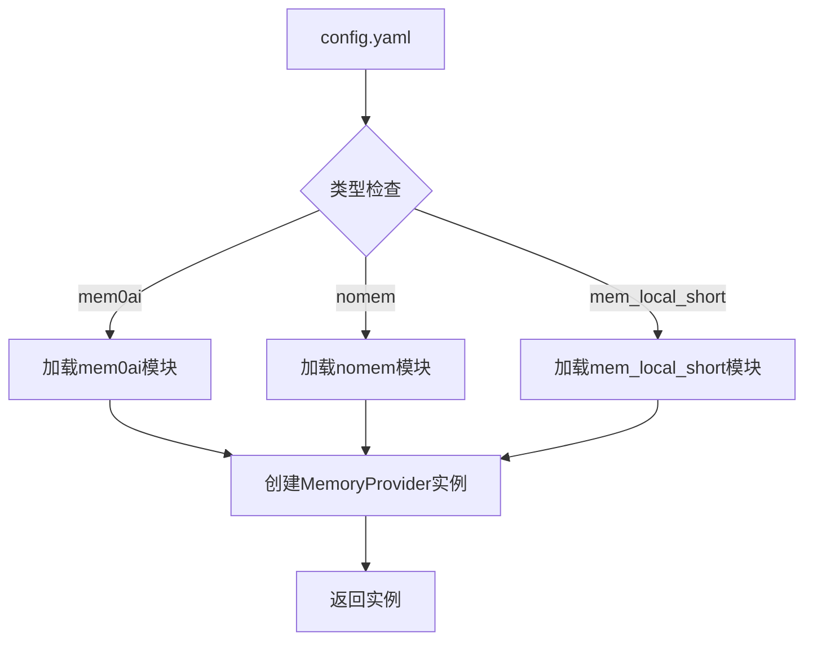
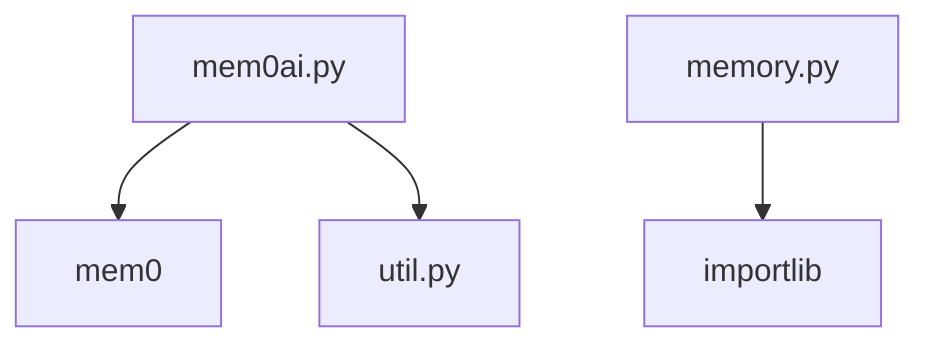

# Mem0AI集成

<cite>
**本文档引用的文件**
- [mem0ai.py](file://core/providers/memory/mem0ai/mem0ai.py)
- [memory.py](file://core/utils/memory.py)
- [base.py](file://core/providers/memory/base.py)
- [config.yaml](file://config.yaml)
- [util.py](file://core/utils/util.py)
</cite>

## 目录
1. [简介](#简介)
2. [项目结构](#项目结构)
3. [核心组件](#核心组件)
4. [架构概述](#架构概述)
5. [详细组件分析](#详细组件分析)
6. [依赖分析](#依赖分析)
7. [性能考虑](#性能考虑)
8. [故障排除指南](#故障排除指南)
9. [结论](#结论)

## 简介
本文档详细介绍了Mem0AI在项目中的集成方式，重点说明如何通过mem0ai.py实现跨会话、跨设备的长期记忆存储与智能检索。该模块作为MemoryProviderBase的具体实现，调用Mem0AI云服务的API进行记忆的保存与查询。文档将解释其基于语义相似度的检索机制，配置项的设置方法，以及在实际部署中的考量因素。

## 项目结构
项目结构中，Mem0AI相关的代码位于`core/providers/memory/mem0ai/`目录下，主要文件为`mem0ai.py`。该模块依赖于`core/utils/memory.py`中的工厂模式进行初始化，并通过`config.yaml`进行配置。

**图示来源**
- [mem0ai.py](file://core/providers/memory/mem0ai/mem0ai.py)
- [memory.py](file://core/utils/memory.py)
- [config.yaml](file://config.yaml)

**章节来源**
- [mem0ai.py](file://core/providers/memory/mem0ai/mem0ai.py)
- [memory.py](file://core/utils/memory.py)
- [config.yaml](file://config.yaml)

## 核心组件
Mem0AI集成的核心组件包括`mem0ai.py`中的`MemoryProvider`类，该类继承自`MemoryProviderBase`，实现了`save_memory`和`query_memory`方法。通过`memory.py`中的`create_instance`函数，根据配置动态创建实例。

**章节来源**
- [mem0ai.py](file://core/providers/memory/mem0ai/mem0ai.py#L10-L91)
- [memory.py](file://core/utils/memory.py#L9-L18)

## 架构概述
Mem0AI模块的架构基于工厂模式和抽象基类设计。`MemoryProviderBase`定义了记忆提供者的接口，`mem0ai.py`中的`MemoryProvider`类实现了具体的云服务调用逻辑。配置通过`config.yaml`文件进行管理，确保了模块的灵活性和可扩展性。

**图示来源**
- [base.py](file://core/providers/memory/base.py#L7-L27)
- [mem0ai.py](file://core/providers/memory/mem0ai/mem0ai.py#L9-L89)

## 详细组件分析

### Mem0AI记忆提供者分析
`MemoryProvider`类在初始化时检查API密钥的有效性，并尝试连接到Mem0AI服务。如果连接成功，`use_mem0`标志被设置为True，允许后续的记忆操作。

#### 保存记忆
`save_memory`方法将消息列表格式化为适合Mem0AI的格式，并通过`MemoryClient`的`add`方法保存到云端。消息中不包含系统角色的内容，以避免不必要的信息存储。

**图示来源**
- [mem0ai.py](file://core/providers/memory/mem0ai/mem0ai.py#L31-L49)

#### 查询记忆
`query_memory`方法使用用户的查询作为搜索条件，通过`MemoryClient`的`search`方法从云端检索相关记忆。检索结果按更新时间排序，最新的记忆优先返回。

**图示来源**
- [mem0ai.py](file://core/providers/memory/mem0ai/mem0ai.py#L52-L89)

### 配置与初始化
Mem0AI的配置在`config.yaml`文件中定义，包括`api_key`和`api_version`等参数。`memory.py`中的`create_instance`函数根据配置文件中的类型名称动态加载相应的模块并创建实例。

**图示来源**
- [config.yaml](file://config.yaml#L260-L265)
- [memory.py](file://core/utils/memory.py#L9-L18)

**章节来源**
- [config.yaml](file://config.yaml#L260-L265)
- [memory.py](file://core/utils/memory.py#L9-L18)

## 依赖分析
Mem0AI模块依赖于`mem0`库进行云服务调用，以及`core.utils.util`中的`check_model_key`函数进行API密钥验证。此外，`memory.py`中的工厂模式依赖于Python的`importlib`模块动态加载模块。

**图示来源**
- [mem0ai.py](file://core/providers/memory/mem0ai/mem0ai.py#L4-L5)
- [memory.py](file://core/utils/memory.py#L3)

## 性能考虑
Mem0AI的性能受网络延迟和API调用频率的影响。建议在高并发场景下使用缓存机制减少对云服务的直接调用。此外，合理设置`api_version`可以优化API的响应时间和功能支持。

## 故障排除指南
- **连接失败**：检查`api_key`是否正确配置，确保网络连接正常。
- **记忆保存失败**：确认消息列表长度大于1，且不包含系统角色的消息。
- **检索结果为空**：检查`role_id`是否正确设置，确保用户ID在Mem0AI服务中有对应的记忆记录。

**章节来源**
- [mem0ai.py](file://core/providers/memory/mem0ai/mem0ai.py#L26-L29)
- [mem0ai.py](file://core/providers/memory/mem0ai/mem0ai.py#L48-L49)
- [mem0ai.py](file://core/providers/memory/mem0ai/mem0ai.py#L62-L63)

## 结论
Mem0AI集成通过云服务提供了强大的长期记忆存储与检索能力，支持跨会话、跨设备的记忆管理。通过合理的配置和初始化流程，可以有效提升系统的智能化水平。在实际部署中，需注意数据隐私、网络依赖性和成本控制等问题。