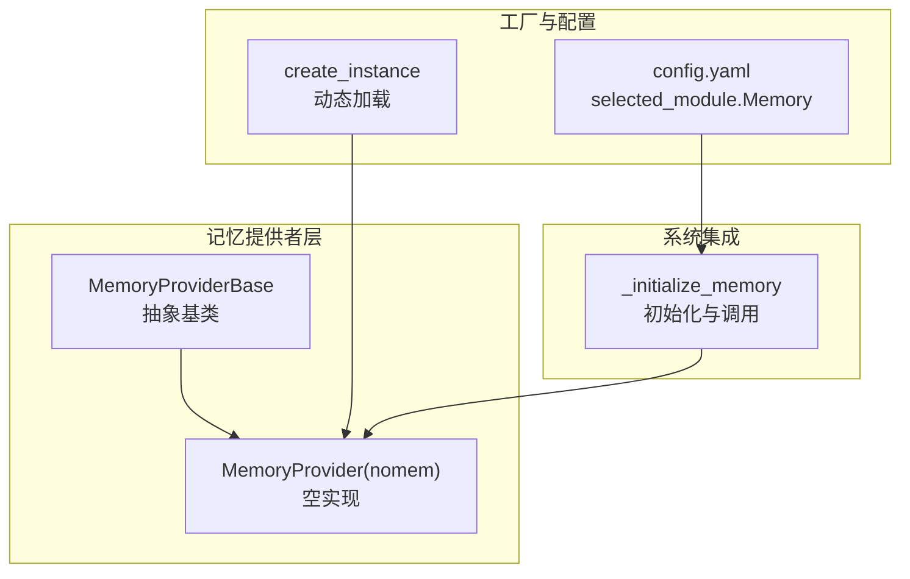
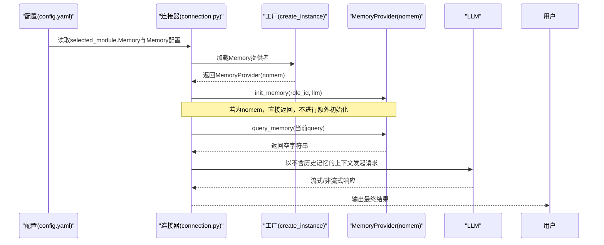
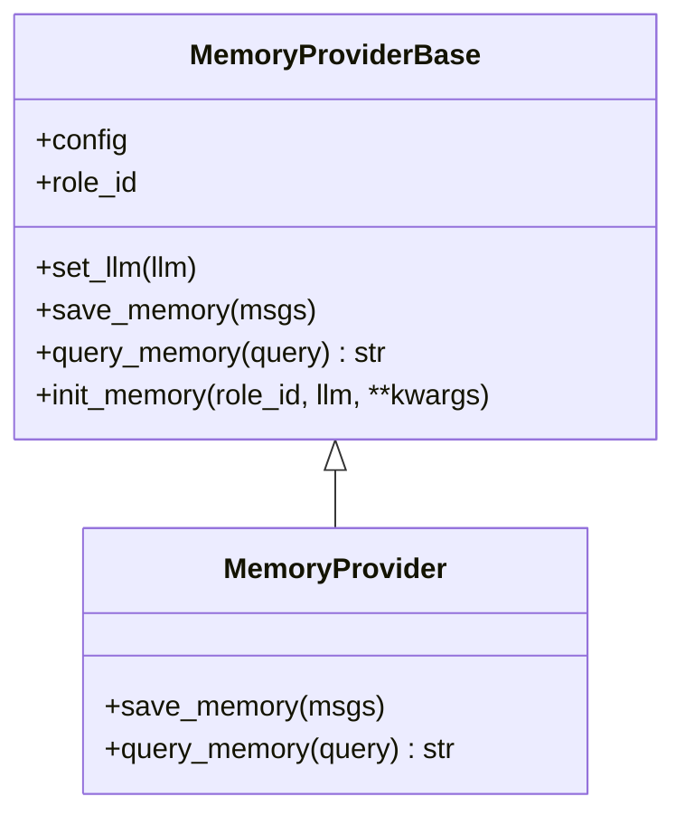
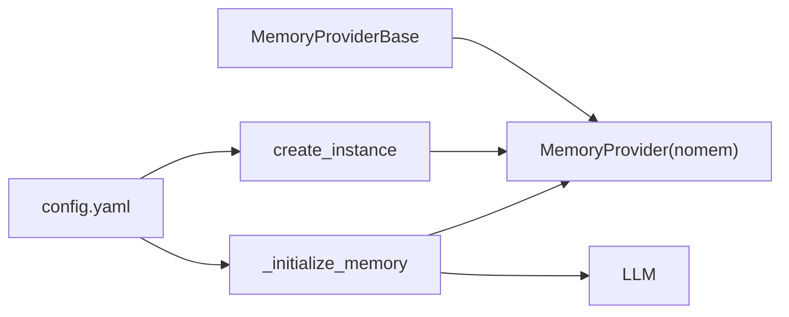

# 无记忆模式

<cite>
**本文引用的文件**
- [nomem.py](file://core/providers/memory/nomem/nomem.py)
- [base.py](file://core/providers/memory/base.py)
- [memory.py](file://core/utils/memory.py)
- [config.yaml](file://config.yaml)
- [connection.py](file://core/connection.py)
</cite>

## 目录
1. [简介](#简介)
2. [项目结构](#项目结构)
3. [核心组件](#核心组件)
4. [架构总览](#架构总览)
5. [组件详解](#组件详解)
6. [依赖关系分析](#依赖关系分析)
7. [性能影响与优化建议](#性能影响与优化建议)
8. [故障排查指南](#故障排查指南)
9. [结论](#结论)
10. [附录：配置示例与边界说明](#附录配置示例与边界说明)

## 简介
无记忆模式（nomem）是一种极简的记忆提供者实现，旨在满足对数据隐私有极高要求或追求极致响应速度的场景。该模式通过不保存历史信息、不检索历史上下文的方式，避免额外的LLM调用与外部存储开销，从而显著降低延迟并消除隐私风险。本文将系统阐述nomem如何实现MemoryProviderBase基类、如何通过配置加载、以及在系统中的调用链路与性能影响。

## 项目结构
围绕无记忆模式的关键文件与职责如下：
- 核心实现：core/providers/memory/nomem/nomem.py
- 抽象基类：core/providers/memory/base.py
- 工厂加载：core/utils/memory.py
- 配置入口：config.yaml
- 初始化与调用链：core/connection.py

图表来源
- [nomem.py](file://core/providers/memory/nomem/nomem.py#L1-L21)
- [base.py](file://core/providers/memory/base.py#L1-L29)
- [memory.py](file://core/utils/memory.py#L1-L19)
- [config.yaml](file://config.yaml#L200-L220)
- [connection.py](file://core/connection.py#L631-L672)

章节来源
- [nomem.py](file://core/providers/memory/nomem/nomem.py#L1-L21)
- [base.py](file://core/providers/memory/base.py#L1-L29)
- [memory.py](file://core/utils/memory.py#L1-L19)
- [config.yaml](file://config.yaml#L200-L220)
- [connection.py](file://core/connection.py#L631-L672)

## 核心组件
- MemoryProviderBase：定义save_memory与query_memory两个抽象方法，提供init_memory、set_llm等通用能力。
- MemoryProvider(nomem)：继承自MemoryProviderBase，将save_memory与query_memory实现为空操作，确保不产生任何持久化或检索行为。
- create_instance：根据配置动态导入并实例化对应记忆提供者类。
- config.yaml：通过selected_module.Memory与Memory.nomore配置项选择nomem。
- connection.py：在初始化阶段读取配置并决定是否加载nomem；在对话流程中调用query_memory以注入上下文。

章节来源
- [base.py](file://core/providers/memory/base.py#L1-L29)
- [nomem.py](file://core/providers/memory/nomem/nomem.py#L1-L21)
- [memory.py](file://core/utils/memory.py#L1-L19)
- [config.yaml](file://config.yaml#L200-L220)
- [connection.py](file://core/connection.py#L631-L672)

## 架构总览
无记忆模式的调用序列如下：
- 系统启动时，connection.py读取selected_module.Memory与Memory配置，决定使用nomem。
- 若为nomem，_initialize_memory直接返回，不进行额外初始化。
- 对话流程中，chat方法在调用LLM前尝试异步查询记忆（query_memory），nomem返回空字符串，不改变对话上下文。
- nomem.save_memory不执行任何持久化，避免额外LLM调用与存储。

图表来源
- [config.yaml](file://config.yaml#L200-L220)
- [connection.py](file://core/connection.py#L631-L672)
- [memory.py](file://core/utils/memory.py#L1-L19)
- [nomem.py](file://core/providers/memory/nomem/nomem.py#L1-L21)

## 组件详解

### MemoryProviderBase 抽象基类
- 提供抽象方法save_memory与query_memory，约束实现类必须具备“保存”和“查询”能力。
- 提供init_memory与set_llm，便于子类在初始化时绑定角色ID与LLM实例。
- 为各记忆提供者提供统一接口契约。

章节来源
- [base.py](file://core/providers/memory/base.py#L1-L29)

### MemoryProvider(nomem) 实现
- save_memory：记录调试日志并返回空值，不进行任何持久化。
- query_memory：记录调试日志并返回空字符串，不进行任何检索。
- 通过继承MemoryProviderBase，保持与系统的接口兼容。

图表来源
- [base.py](file://core/providers/memory/base.py#L1-L29)
- [nomem.py](file://core/providers/memory/nomem/nomem.py#L1-L21)

章节来源
- [nomem.py](file://core/providers/memory/nomem/nomem.py#L1-L21)
- [base.py](file://core/providers/memory/base.py#L1-L29)

### 工厂加载 create_instance
- 根据class_name拼接模块路径，动态导入core.providers.memory.<class_name>.<class_name>。
- 若存在对应文件，则返回MemoryProvider实例；否则抛出不支持的类型异常。
- 该机制保证配置驱动的可插拔性。

章节来源
- [memory.py](file://core/utils/memory.py#L1-L19)

### 配置入口 config.yaml
- selected_module.Memory：选择记忆模块类型（默认nomem）。
- Memory.nomore：提供nomem的类型声明，配合工厂加载。
- 该配置与工厂共同决定系统加载的提供者。

章节来源
- [config.yaml](file://config.yaml#L200-L220)
- [config.yaml](file://config.yaml#L260-L276)

### 初始化与调用链 connection.py
- _initialize_memory：读取Memory配置，若为nomem则直接返回；否则为其他模式准备专用LLM。
- chat：在调用LLM前异步调用query_memory，nomem返回空字符串，不影响对话上下文。
- 该流程确保nomem不会引入额外的LLM调用或存储。

章节来源
- [connection.py](file://core/connection.py#L631-L672)
- [connection.py](file://core/connection.py#L727-L830)

## 依赖关系分析
- 继承关系：MemoryProvider(nomem)继承MemoryProviderBase，复用抽象接口。
- 工厂依赖：create_instance依赖配置中的class_name与文件系统路径，动态导入模块。
- 配置依赖：config.yaml中的selected_module.Memory与Memory.nomore共同决定加载的提供者。
- 运行时依赖：connection.py在初始化与对话流程中分别调用init_memory与query_memory，nomem在此处不产生副作用。

图表来源
- [base.py](file://core/providers/memory/base.py#L1-L29)
- [nomem.py](file://core/providers/memory/nomem/nomem.py#L1-L21)
- [memory.py](file://core/utils/memory.py#L1-L19)
- [config.yaml](file://config.yaml#L200-L220)
- [connection.py](file://core/connection.py#L631-L672)

章节来源
- [base.py](file://core/providers/memory/base.py#L1-L29)
- [nomem.py](file://core/providers/memory/nomem/nomem.py#L1-L21)
- [memory.py](file://core/utils/memory.py#L1-L19)
- [config.yaml](file://config.yaml#L200-L220)
- [connection.py](file://core/connection.py#L631-L672)

## 性能影响与优化建议
- 减少LLM调用次数：nomem不保存也不检索历史，避免额外的上下文扩展与检索调用，有助于降低整体调用次数。
- 降低延迟：不涉及外部存储与检索逻辑，对话路径更短，响应更快。
- 降低资源占用：无持久化与检索逻辑，减少IO与网络开销。
- 适用场景：适合问答、指令执行、一次性任务等不需要上下文延续的场景。
- 不适用场景：需要跨轮次上下文理解、个性化记忆、长链路推理等复杂对话。

[本节为通用性能讨论，不直接分析具体文件，故无章节来源]

## 故障排查指南
- 日志定位：nomem在save_memory与query_memory中会输出调试日志，可通过日志确认是否被调用。
- 配置核对：确认config.yaml中selected_module.Memory与Memory.nomore配置正确。
- 工厂异常：若出现“不支持的记忆服务类型”，检查core/providers/memory/nomem目录下是否存在同名文件。
- 初始化分支：若使用nomem，_initialize_memory会直接返回，无需额外LLM实例。

章节来源
- [nomem.py](file://core/providers/memory/nomem/nomem.py#L1-L21)
- [memory.py](file://core/utils/memory.py#L1-L19)
- [config.yaml](file://config.yaml#L200-L220)
- [connection.py](file://core/connection.py#L631-L672)

## 结论
无记忆模式通过“空实现”的设计，彻底规避了历史信息的保存与检索，从而在隐私与延迟方面获得显著收益。结合配置驱动的工厂加载与初始化流程，nomem能够在不改变系统接口的前提下无缝接入。对于不需要上下文延续的场景，nomem是兼顾隐私与性能的理想选择；对于需要复杂上下文理解的场景，应考虑其他记忆提供者。

[本节为总结性内容，不直接分析具体文件，故无章节来源]

## 附录：配置示例与边界说明

### 使用示例（配置片段）
- 在config.yaml中，将selected_module.Memory设置为nomem，并在Memory.nomore中声明type为nomem，即可启用该模式。

章节来源
- [config.yaml](file://config.yaml#L200-L220)
- [config.yaml](file://config.yaml#L260-L276)

### 适用边界
- 适合场景：一次性问答、简单指令、隐私敏感且不允许历史留存的环境。
- 不适合场景：需要跨轮次上下文理解、个性化记忆、长链路推理与复杂对话的场景。

[本节为概念性说明，不直接分析具体文件，故无章节来源]