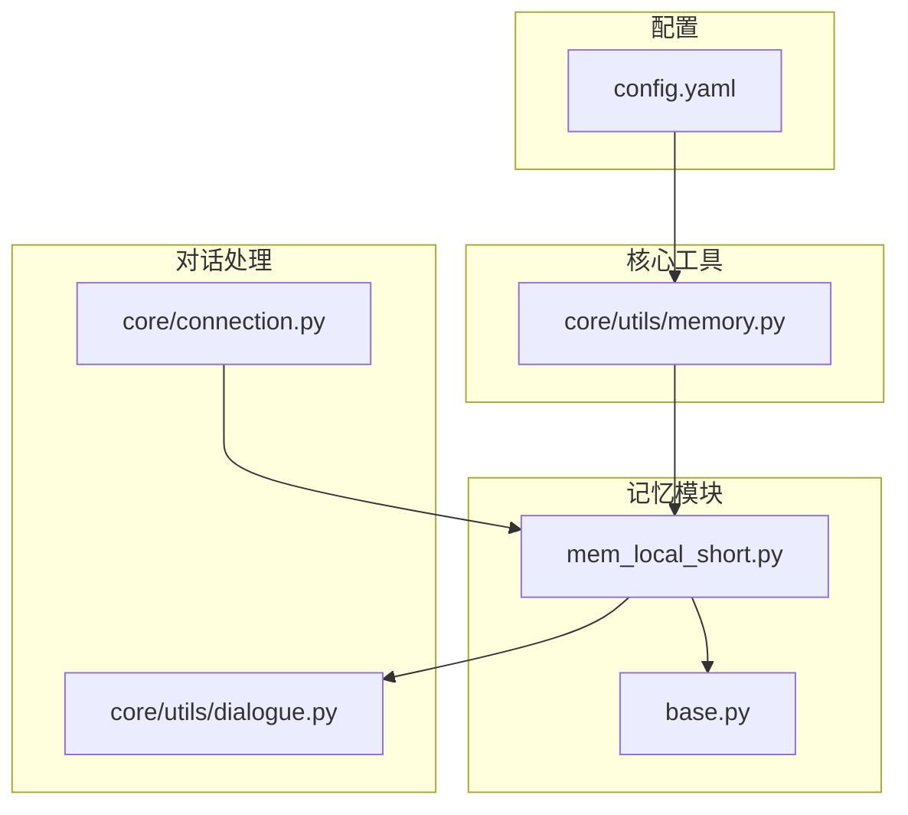
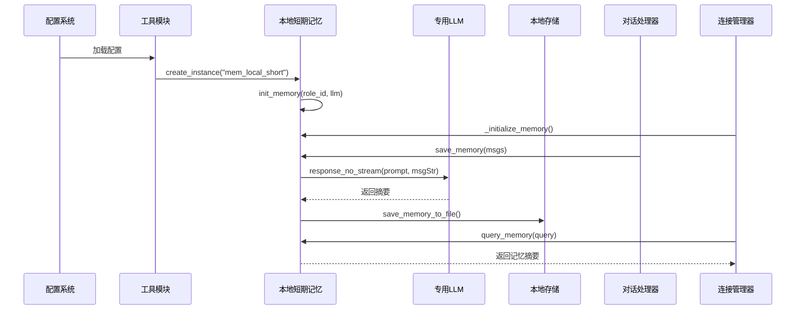
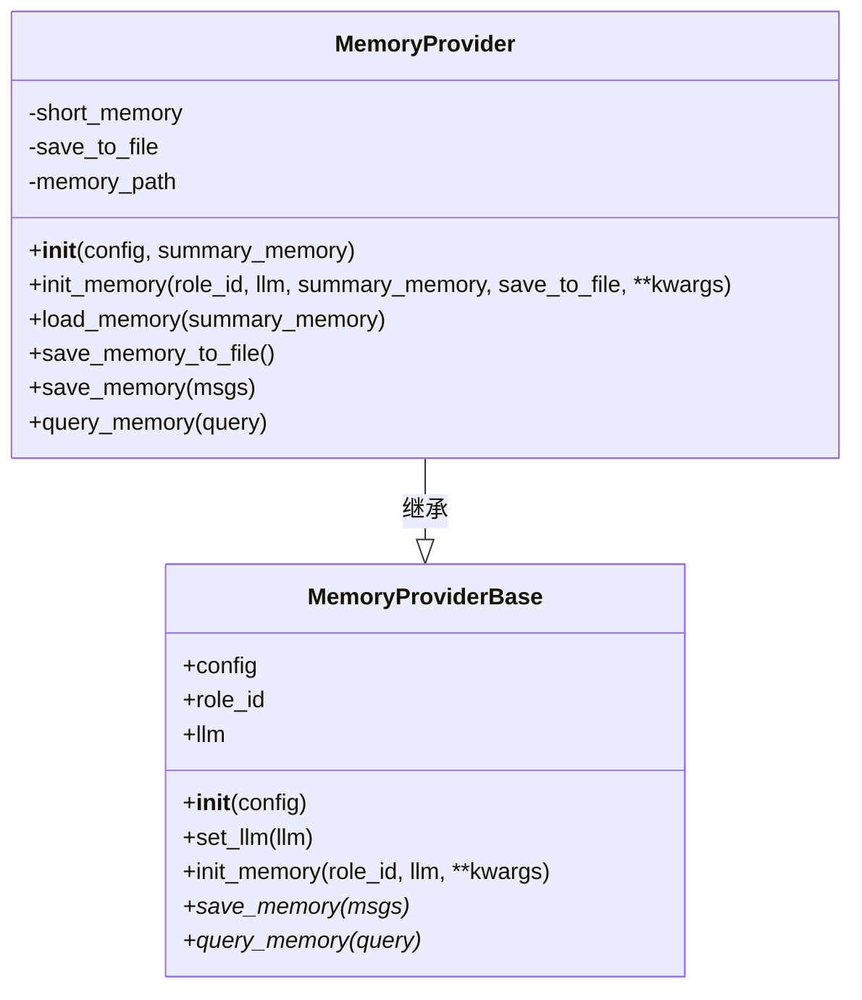
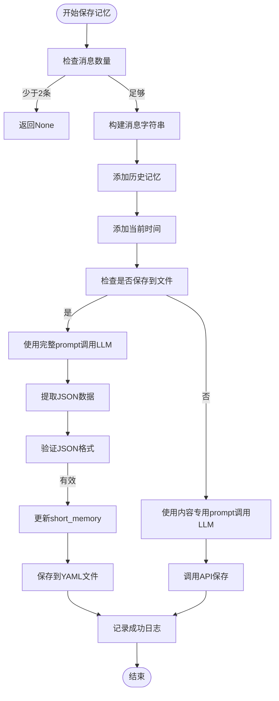
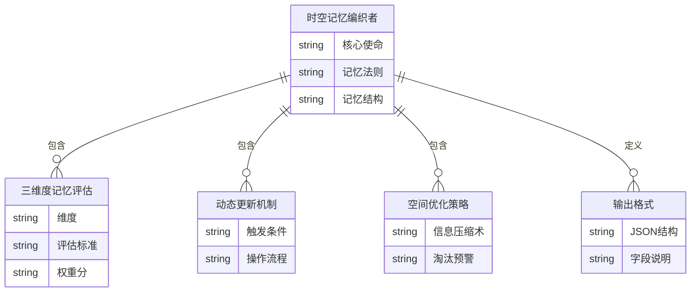

# 本地短期记忆

<cite>
**本文档引用的文件**  
- [mem_local_short.py](file://core/providers/memory/mem_local_short/mem_local_short.py)
- [base.py](file://core/providers/memory/base.py)
- [memory.py](file://core/utils/memory.py)
- [config.yaml](file://config.yaml)
- [dialogue.py](file://core/utils/dialogue.py)
- [connection.py](file://core/connection.py)
</cite>

## 目录
1. [简介](#简介)
2. [项目结构](#项目结构)
3. [核心组件](#核心组件)
4. [架构概述](#架构概述)
5. [详细组件分析](#详细组件分析)
6. [依赖分析](#依赖分析)
7. [性能考虑](#性能考虑)
8. [故障排除指南](#故障排除指南)
9. [结论](#结论)

## 简介
本文档详细阐述了“本地短期记忆”（mem_local_short）模块的设计与实现，重点描述其在单次会话或短期交互中维护上下文的能力。该模块通过继承`MemoryProviderBase`基类，实现了对话历史的摘要生成与持久化存储机制。系统利用专用LLM对对话内容进行智能总结，并将结构化记忆以YAML格式保存于本地文件系统中。文档还深入解析了“时空记忆编织者”prompt的设计原理及其在提取用户偏好、角色设定等关键信息中的作用。结合`create_instance`函数，说明了系统如何根据配置动态初始化该记忆提供者。此外，提供了多轮对话中记忆构建与检索的实际示例，并讨论了该策略的性能优势与局限性。

## 项目结构
本地短期记忆功能位于`core/providers/memory/mem_local_short/`目录下，是整个记忆系统的一个可选实现。该模块遵循插件化设计，通过统一接口与其他组件集成。



**图示来源**  
- [mem_local_short.py](file://core/providers/memory/mem_local_short/mem_local_short.py)
- [base.py](file://core/providers/memory/base.py)
- [memory.py](file://core/utils/memory.py)
- [config.yaml](file://config.yaml)
- [dialogue.py](file://core/utils/dialogue.py)
- [connection.py](file://core/connection.py)

## 核心组件
`mem_local_short`模块的核心在于其继承自`MemoryProviderBase`并实现的`save_memory`和`query_memory`方法。它利用专用LLM对对话历史进行摘要，通过“时空记忆编织者”prompt提取关键信息，并将结果以JSON结构嵌入YAML文件中持久化存储。该模块在会话期间动态维护用户上下文，支持个性化响应生成。

**组件来源**  
- [mem_local_short.py](file://core/providers/memory/mem_local_short/mem_local_short.py#L109-L202)
- [base.py](file://core/providers/memory/base.py#L8-L28)

## 架构概述
本地短期记忆模块作为系统记忆层的一部分，与LLM、对话管理、配置系统紧密协作。其架构设计体现了分层与解耦原则，确保功能的独立性与可替换性。



**图示来源**  
- [mem_local_short.py](file://core/providers/memory/mem_local_short/mem_local_short.py)
- [memory.py](file://core/utils/memory.py)
- [connection.py](file://core/connection.py#L619-L774)
- [dialogue.py](file://core/utils/dialogue.py#L62-L118)

## 详细组件分析

### 本地短期记忆提供者分析
`MemoryProvider`类继承自`MemoryProviderBase`，实现了短期记忆的完整生命周期管理。

#### 类结构与继承关系


**图示来源**  
- [mem_local_short.py](file://core/providers/memory/mem_local_short/mem_local_short.py#L109-L202)
- [base.py](file://core/providers/memory/base.py#L8-L28)

#### 记忆保存流程


**图示来源**  
- [mem_local_short.py](file://core/providers/memory/mem_local_short/mem_local_short.py#L146-L197)

### “时空记忆编织者”Prompt设计分析
该Prompt是记忆摘要生成的核心，其设计确保了信息提取的准确性与结构化。

#### Prompt结构与规则


**图示来源**  
- [mem_local_short.py](file://core/providers/memory/mem_local_short/mem_local_short.py#L11-L75)

## 依赖分析
本地短期记忆模块依赖于多个核心组件，形成了一个紧密协作的生态系统。

```mermaid
graph TD
mem_local_short --> base : 继承
mem_local_short --> yaml : 存储
mem_local_short --> json : 解析
mem_local_short --> config_loader : 获取项目路径
mem_local_short --> manage_api_client : API调用
mem_local_short --> util : 模型密钥检查
memory_utils --> mem_local_short : 动态创建实例
connection --> mem_local_short : 初始化与调用
dialogue --> mem_local_short : 提供记忆字符串
```

**图示来源**  
- [mem_local_short.py](file://core/providers/memory/mem_local_short/mem_local_short.py)
- [memory.py](file://core/utils/memory.py)
- [connection.py](file://core/connection.py)
- [dialogue.py](file://core/utils/dialogue.py)

## 性能考虑
本地短期记忆策略在性能与功能之间取得了良好平衡。其优势在于：
- **低延迟**：摘要生成与存储均在本地完成，避免了网络往返。
- **高隐私性**：所有用户数据均保留在本地，不上传至外部服务器。
- **资源可控**：通过YAML文件存储，易于监控与管理。

然而，该策略也存在局限性：
- **不支持跨设备**：记忆仅绑定于单个设备和会话。
- **非长期持久化**：适用于短期交互，不适合需要长期记忆的场景。
- **LLM依赖**：摘要质量高度依赖所配置的专用LLM的性能。

## 故障排除指南
当遇到记忆功能异常时，可参考以下步骤进行排查：

**组件来源**  
- [mem_local_short.py](file://core/providers/memory/mem_local_short/mem_local_short.py#L147-L153)
- [connection.py](file://core/connection.py#L631-L654)

1. **检查配置**：确认`config.yaml`中`selected_module.Memory`设置为`mem_local_short`。
2. **验证LLM配置**：确保`Memory.mem_local_short.llm`指向一个有效的、可访问的LLM服务。
3. **检查密钥**：通过日志确认专用LLM的API密钥是否正确且有效。
4. **查看存储路径**：确认`data/.memory.yaml`文件可读写，且路径正确。
5. **分析日志**：检查日志中是否有`使用记忆保存模型`或`Save memory successful`等关键信息，以定位执行流程。

## 结论
本地短期记忆（mem_local_short）模块为系统提供了一种高效、安全的上下文维护机制。通过继承基类、实现核心方法、利用专用LLM和结构化Prompt，该模块成功实现了对话历史的智能摘要与本地持久化。其设计充分考虑了隐私性与性能，是单次会话场景下的理想选择。尽管存在跨设备和长期记忆的局限性，但其在特定应用场景下的价值不可替代。系统通过`create_instance`工厂方法和配置驱动的方式，实现了该模块的灵活集成与管理。