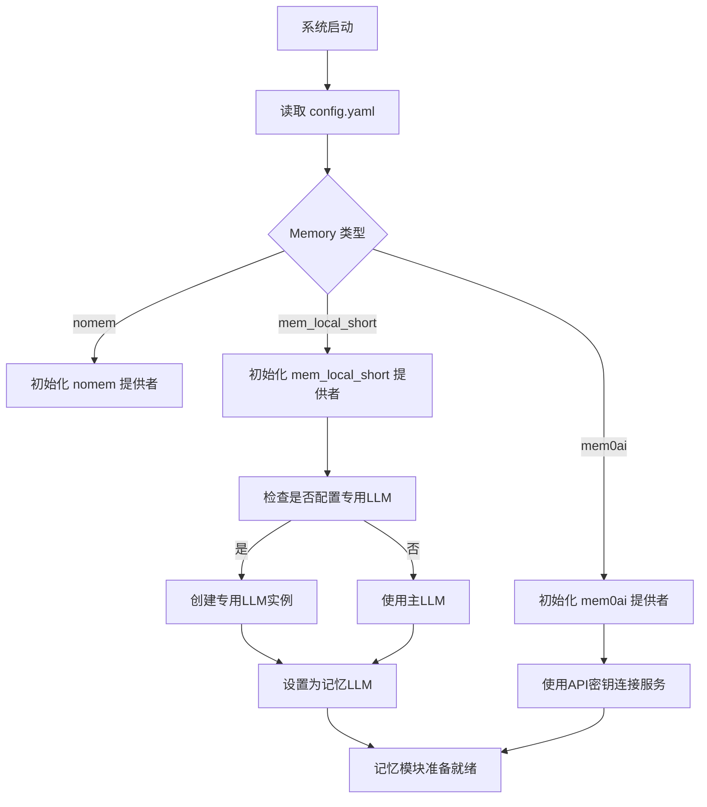

# 记忆管理

<cite>
**本文档引用的文件**
- [mem_local_short.py](file://core/providers/memory/mem_local_short/mem_local_short.py)
- [mem0ai.py](file://core/providers/memory/mem0ai/mem0ai.py)
- [nomem.py](file://core/providers/memory/nomem/nomem.py)
- [base.py](file://core/providers/memory/base.py)
- [memory.py](file://core/utils/memory.py)
- [config.yaml](file://config.yaml)
- [connection.py](file://core/connection.py)
</cite>

## 目录
1. [引言](#引言)
2. [记忆策略详解](#记忆策略详解)
   1. [本地短期记忆 (mem_local_short)](#本地短期记忆-mem_local_short)
   2. [Mem0AI 云服务集成 (mem0ai)](#mem0ai-云服务集成-mem0ai)
   3. [无记忆模式 (nomem)](#无记忆模式-nomem)
3. [核心基础设施](#核心基础设施)
   1. [MemoryProviderBase 基类](#memoryproviderbase-基类)
   2. [工厂函数 create_instance](#工厂函数-create_instance)
4. [系统集成与工作流程](#系统集成与工作流程)
5. [交互示例](#交互示例)
6. [结论](#结论)

## 引言

记忆管理模块是本系统实现个性化、上下文感知对话体验的核心组件。它通过三种不同的策略——本地短期记忆、云服务长期记忆和无记忆模式，为用户提供灵活的个性化服务。该模块不仅负责从对话中提取和总结关键信息，还负责在后续交互中检索和利用这些记忆，从而让系统能够“记住”用户偏好、身份信息和重要事件，提供更加连贯和贴心的响应。本文档将深入剖析这三种记忆策略的实现机制、核心基类的设计以及它们在整个系统中的集成方式。

## 记忆策略详解

### 本地短期记忆 (mem_local_short)

`mem_local_short` 策略实现了基于本地LLM的动态记忆网络，旨在在有限的存储空间内保留最关键的信息。其核心机制是利用一个专用的LLM（大语言模型）来总结和更新对话历史。

该策略的核心是 `short_term_memory_prompt`，一个被称为“时空记忆编织者”的复杂提示词。这个提示词定义了一套完整的记忆法则，包括三维度记忆评估（时效性、情感强度、关联密度）、动态更新机制（如处理名字变更）和空间优化策略（信息压缩和淘汰预警）。当需要保存记忆时，系统会将当前的对话历史、已有的短期记忆以及当前时间拼接成一个长文本，并将此文本和“时空记忆编织者”提示词一同发送给指定的LLM。

LLM的响应被期望是一个符合特定JSON结构的字符串，该结构包含“时空档案”、“关系网络”、“待响应”和“高光语录”等部分。系统通过 `extract_json_data` 函数从LLM的响应中提取出这个JSON字符串，并将其作为新的短期记忆进行持久化。持久化通过YAML文件实现，所有角色的记忆被存储在 `data/.memory.yaml` 文件中，以角色ID为键进行区分。这种设计确保了记忆数据的本地化和隐私性，适用于对数据安全有较高要求的场景。

**Section sources**
- [mem_local_short.py](file://core/providers/memory/mem_local_short/mem_local_short.py#L1-L203)

### Mem0AI 云服务集成 (mem0ai)

`mem0ai` 策略通过集成Mem0AI云服务，实现了跨会话的长期记忆存储和基于语义相似度的高效检索。与本地策略不同，此策略将记忆的存储和查询完全委托给外部云服务。

其实现非常简洁。在初始化时，`MemoryProvider` 会使用配置中的API密钥创建一个 `MemoryClient` 实例。当调用 `save_memory` 方法时，系统会将对话消息（过滤掉系统消息）格式化为一个消息列表，并通过 `client.add()` 方法发送到Mem0AI服务。服务端会自动处理记忆的提取、向量化和存储。

`query_memory` 方法是其强大功能的体现。当系统需要根据当前对话内容检索相关记忆时，会调用此方法。它使用 `client.search()` 接口，传入用户的查询和用户ID作为过滤条件。Mem0AI服务会基于语义相似度在向量数据库中搜索最相关的记忆条目，并返回一个结果列表。系统会将这些结果按时间倒序排列，并格式化为一个带有时间戳的字符串列表，供后续的对话生成使用。这种方式极大地简化了开发者的工作，同时提供了强大的长期记忆能力。

**Section sources**
- [mem0ai.py](file://core/providers/memory/mem0ai/mem0ai.py#L1-L91)

### 无记忆模式 (nomem)

`nomem` 策略提供了一种最简单、最轻量级的选项，适用于对隐私或性能有特殊要求的场景，或者用户明确不希望系统保留任何对话历史。

该策略的实现极其直接。`save_memory` 和 `query_memory` 两个方法都只包含日志记录和返回空值的操作。`save_memory` 会记录一条调试日志，表明没有执行任何保存操作，并返回 `None`。`query_memory` 则会记录一条调试日志，并返回一个空字符串。这意味着系统在处理对话时，既不会尝试总结和存储任何信息，也不会从任何地方检索历史记忆。整个对话过程完全基于当前的输入和系统提示词，不依赖于任何过往的上下文。

**Section sources**
- [nomem.py](file://core/providers/memory/nomem/nomem.py#L1-L21)

## 核心基础设施

### MemoryProviderBase 基类

`MemoryProviderBase` 是所有具体记忆提供者（如 `mem_local_short`, `mem0ai`, `nomem`）的抽象基类，它定义了记忆模块的统一接口和共享功能。

该基类继承自Python的 `ABC` (Abstract Base Class)，并定义了两个必须由子类实现的抽象方法：`save_memory` 和 `query_memory`。`save_memory` 方法用于保存新的记忆，其参数 `msgs` 是一个包含对话消息的列表。`query_memory` 方法用于根据查询字符串检索相关记忆，并返回一个字符串形式的结果。

除了抽象方法，基类还提供了通用的初始化逻辑（`__init__`）、设置LLM实例的方法（`set_llm`）以及一个用于初始化记忆上下文的 `init_memory` 方法。`init_memory` 方法会设置角色ID（`role_id`）和LLM实例，为具体的记忆操作做准备。通过这个基类，系统可以以统一的方式与任何实现了该接口的记忆提供者进行交互，实现了良好的解耦和可扩展性。

**Section sources**
- [base.py](file://core/providers/memory/base.py#L1-L29)

### 工厂函数 create_instance

`create_instance` 工厂函数位于 `core.utils.memory` 模块中，是系统动态加载和初始化不同记忆提供者的关键。

该函数接收一个 `class_name` 参数（如 "mem_local_short"、"mem0ai"），并根据此名称动态导入对应的模块。它首先检查 `core/providers/memory/{class_name}/{class_name}.py` 文件是否存在。如果存在，则构建模块的完整路径（如 `core.providers.memory.mem_local_short.mem_local_short`），使用 `importlib.import_module` 动态导入，并从导入的模块中获取 `MemoryProvider` 类。最后，它使用传入的 `*args` 和 `**kwargs` 参数来实例化这个类并返回实例。

如果指定的模块不存在，函数会抛出一个 `ValueError` 异常。这个工厂模式使得系统能够根据配置文件中的设置，灵活地选择和创建不同的记忆提供者实例，而无需在代码中硬编码具体的类名，极大地增强了系统的配置灵活性。

**Section sources**
- [memory.py](file://core/utils/memory.py#L1-L18)

## 系统集成与工作流程

记忆管理模块通过 `connection.py` 中的 `_initialize_memory` 方法与系统其他部分集成。当系统启动并加载配置时，会根据 `config.yaml` 文件中 `selected_module.Memory` 的设置来决定使用哪种记忆策略。

**Diagram sources**
- [connection.py](file://core/connection.py#L631-L672)
- [config.yaml](file://config.yaml#L213)

在每次用户发起对话时，系统会通过 `chat` 方法处理请求。在此过程中，如果 `memory` 实例存在，系统会异步调用其 `query_memory` 方法，将用户的查询作为参数传入，以检索相关的记忆。检索到的记忆字符串（`memory_str`）会被注入到发送给主LLM的对话上下文中，通常被包裹在 `<memory>` 标签内。这样，主LLM在生成回复时，就能参考这些历史信息，从而产生更加个性化和上下文相关的响应。

随后，在对话结束后，系统会调用 `save_memory` 方法，将完整的对话历史（包括用户输入和助手回复）传递给记忆提供者，由其负责更新和持久化记忆。

**Section sources**
- [connection.py](file://core/connection.py#L751-L757)

## 交互示例

以下是一个用户与系统进行多次交互的示例，展示了记忆管理模块如何工作：

1.  **第一轮交互**：
    *   **用户**：“你好，我叫小明，我喜欢喝咖啡。”
    *   **系统**：“你好小明！很高兴认识你，咖啡爱好者。今天想聊点什么吗？”
    *   **记忆管理**：`mem_local_short` 提供者被调用。LLM根据“时空记忆编织者”提示词，从对话中提取关键信息，总结为包含“现用名: 小明”和“高频话题: 咖啡”的JSON结构，并将其保存到本地YAML文件。

2.  **第二轮交互**（几天后）：
    *   **用户**：“我今天心情不太好。”
    *   **系统**：“哎呀，小明，怎么了？要不要来杯你最爱的咖啡提提神？我陪你聊聊。”
    *   **记忆管理**：系统调用 `query_memory("我今天心情不太好")`。`mem_local_short` 提供者从YAML文件中加载小明的记忆，并返回包含其姓名和爱好的JSON字符串。该字符串被注入到主LLM的上下文中，使LLM能够生成一个既回应了当前情绪又提到了用户偏好的个性化回复。

3.  **第三轮交互**（名字变更）：
    *   **用户**：“我改名字了，以后叫我小华吧。”
    *   **系统**：“好的，小华！名字变更已记录。从‘小明’到‘小华’的身份蜕变，我会记住的！”
    *   **记忆管理**：`save_memory` 再次被调用。LLM的提示词中包含“名字变更处理示例”，它会识别出命名信号，将“小明”移入“曾用名”列表，将“小华”设为“现用名”，并追加一条关于身份蜕变的事件记录，然后更新本地存储。

## 结论

本系统的记忆管理模块通过精心设计的分层架构，为个性化对话体验提供了坚实的基础。`MemoryProviderBase` 基类和 `create_instance` 工厂函数共同构成了一个灵活、可扩展的基础设施，使得系统能够无缝切换三种截然不同的记忆策略。`mem_local_short` 策略通过本地LLM和YAML持久化，在保证隐私的同时实现了智能的短期记忆管理；`mem0ai` 策略则利用云服务的强大能力，实现了跨会话的长期记忆和语义检索；而 `nomem` 策略则为有特殊需求的场景提供了最轻量级的解决方案。这三种策略的有机结合，使得系统能够适应不同的部署环境和用户需求，最终实现从简单问答到深度个性化交互的跨越。