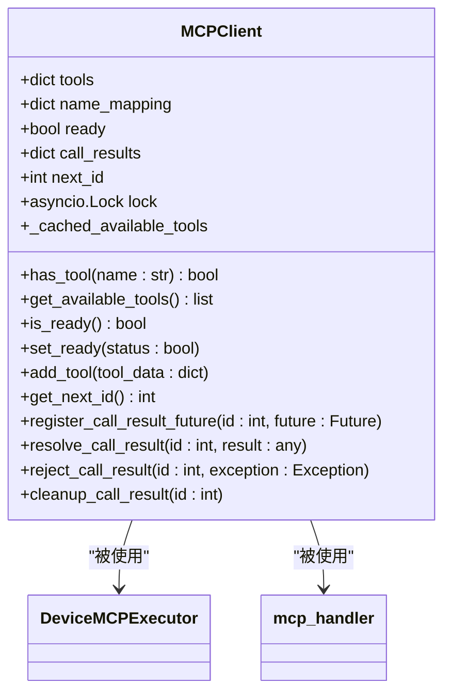
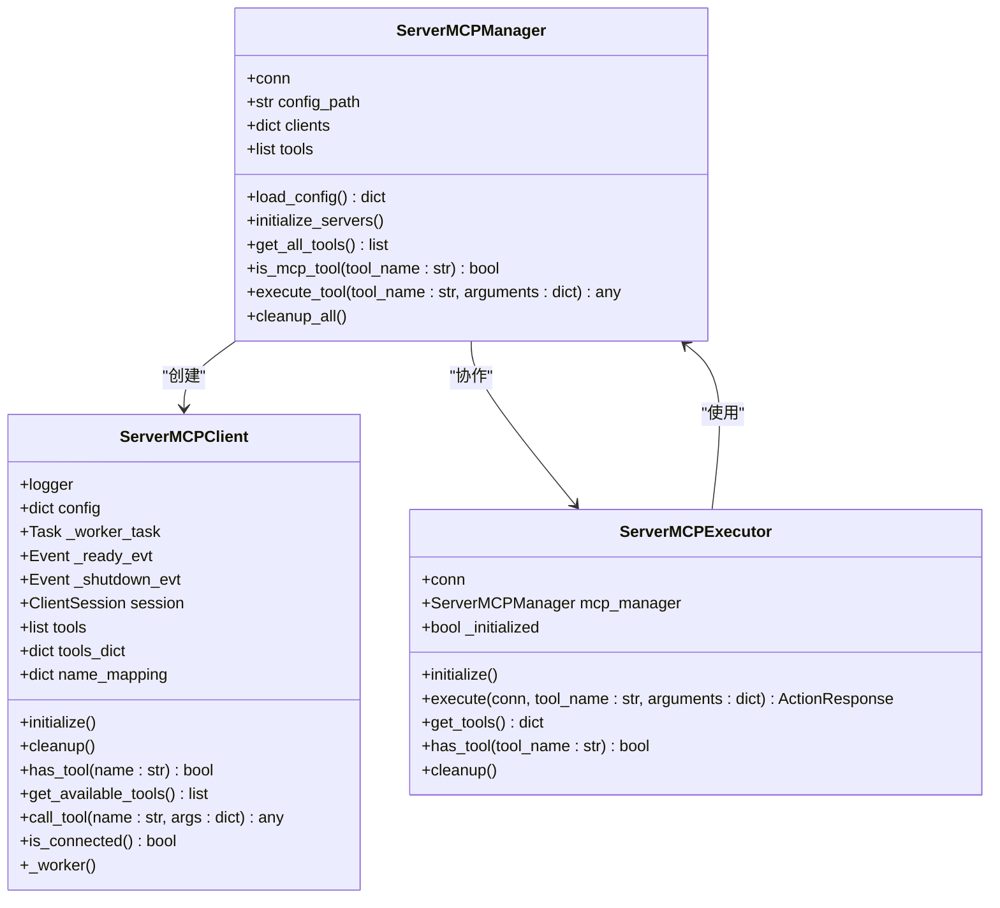
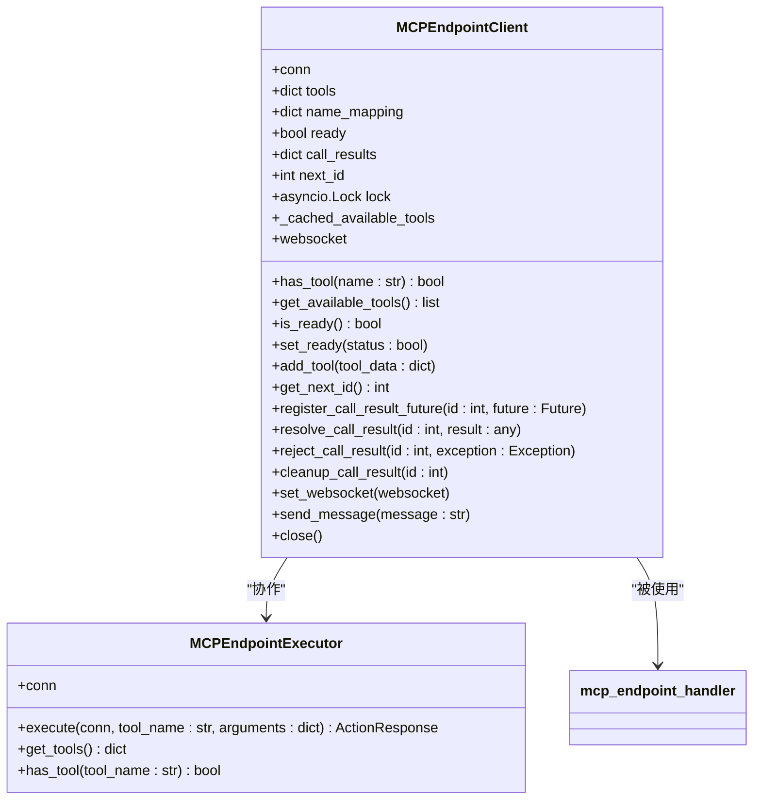
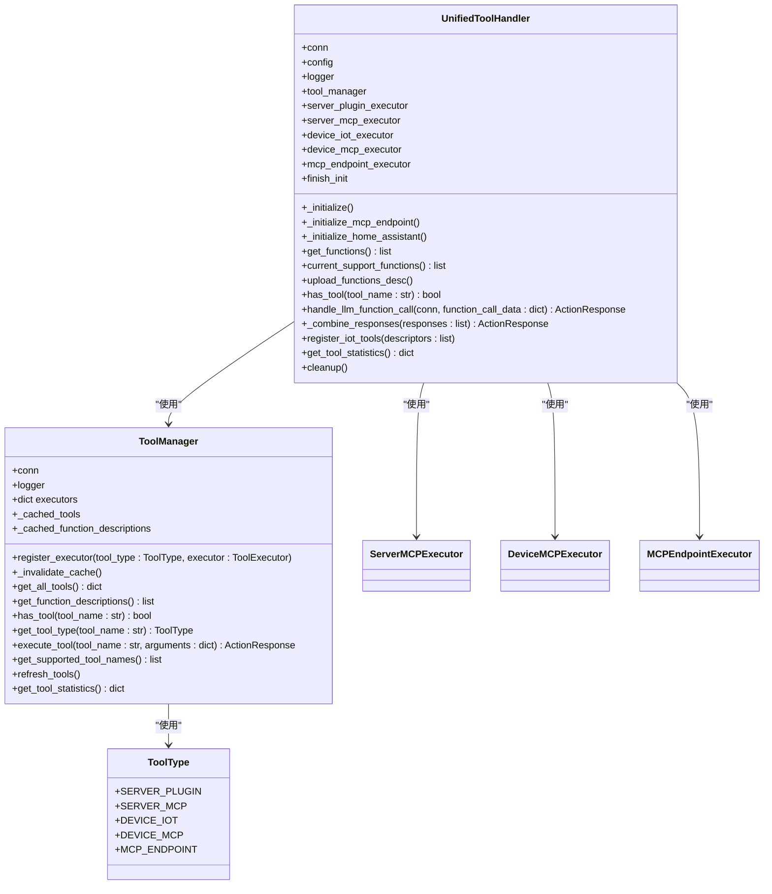
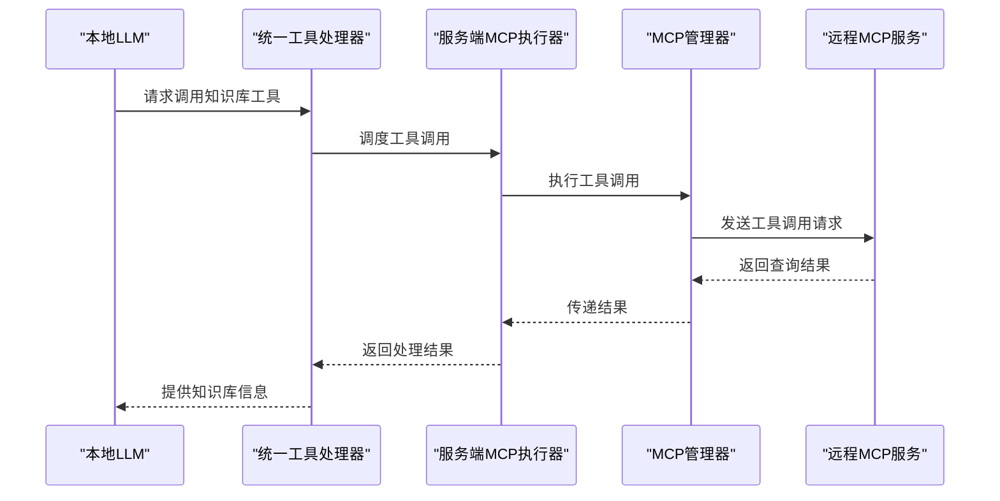

# MCP协议集成

<cite>
**本文档引用的文件**   
- [mcp_client.py](file://core/providers/tools/device_mcp/mcp_client.py)
- [mcp_executor.py](file://core/providers/tools/device_mcp/mcp_executor.py)
- [mcp_handler.py](file://core/providers/tools/device_mcp/mcp_handler.py)
- [mcp_manager.py](file://core/providers/tools/server_mcp/mcp_manager.py)
- [mcp_client.py](file://core/providers/tools/server_mcp/mcp_client.py)
- [mcp_executor.py](file://core/providers/tools/server_mcp/mcp_executor.py)
- [mcp_endpoint_client.py](file://core/providers/tools/mcp_endpoint/mcp_endpoint_client.py)
- [mcp_endpoint_executor.py](file://core/providers/tools/mcp_endpoint/mcp_endpoint_executor.py)
- [mcp_endpoint_handler.py](file://core/providers/tools/mcp_endpoint/mcp_endpoint_handler.py)
- [unified_tool_manager.py](file://core/providers/tools/unified_tool_manager.py)
- [unified_tool_handler.py](file://core/providers/tools/unified_tool_handler.py)
- [tool_types.py](file://core/providers/tools/base/tool_types.py)
- [config.yaml](file://config.yaml)
- [mcp_server_settings.json](file://mcp_server_settings.json)
</cite>

## 目录
1. [简介](#简介)
2. [MCP客户端实现](#mcp客户端实现)
3. [MCP服务器实现](#mcp服务器实现)
4. [MCP接入点实现](#mcp接入点实现)
5. [统一工具管理](#统一工具管理)
6. [配置与使用指南](#配置与使用指南)
7. [跨系统调用示例](#跨系统调用示例)

## 简介
MCP（Model Context Protocol）协议是一种用于模型与外部服务之间通信的协议，支持双向通信功能。本系统实现了MCP协议的客户端和服务器双重角色，能够作为MCP客户端连接到外部MCP服务器，同时也可作为MCP服务器暴露工具给外部客户端。通过device_mcp、server_mcp和mcp_endpoint三个核心模块，系统实现了完整的MCP协议集成，支持工具发现、调用和结果返回等功能。UnifiedToolManager统一管理这些不同来源的MCP工具，并通过ToolType枚举进行类型区分。

## MCP客户端实现
系统通过device_mcp包实现MCP客户端功能，使设备能够与外部MCP服务器进行通信。MCPClient类负责管理MCP状态和工具，维护工具列表、调用结果和连接状态。该类提供了工具发现、调用和结果处理的核心功能。



**图示来源**
- [mcp_client.py](file://core/providers/tools/device_mcp/mcp_client.py#L15-L94)
- [mcp_handler.py](file://core/providers/tools/device_mcp/mcp_handler.py#L15-L97)

**MCP客户端核心功能：**
- **工具管理**：通过`tools`字典存储工具数据，`name_mapping`映射原始名称与规范化名称
- **状态管理**：`ready`标志表示客户端是否准备就绪，`lock`确保线程安全
- **调用管理**：`call_results`存储调用结果的Future对象，支持异步结果处理
- **缓存机制**：`_cached_available_tools`缓存工具列表，提高性能

**通信流程：**
1. 发送初始化消息（initialize）
2. 获取工具列表（tools/list）
3. 调用工具（tools/call）
4. 处理响应结果

**Section sources**
- [mcp_client.py](file://core/providers/tools/device_mcp/mcp_client.py#L1-L94)
- [mcp_handler.py](file://core/providers/tools/device_mcp/mcp_handler.py#L99-L389)

## MCP服务器实现
系统通过server_mcp包实现MCP服务器功能，使本系统能够暴露工具给外部客户端。MCPManager和MCPExecutor负责初始化、管理和执行MCP服务，支持多种传输模式。



**图示来源**
- [mcp_manager.py](file://core/providers/tools/server_mcp/mcp_manager.py#L15-L162)
- [mcp_client.py](file://core/providers/tools/server_mcp/mcp_client.py#L23-L232)
- [mcp_executor.py](file://core/providers/tools/server_mcp/mcp_executor.py#L9-L90)

**MCP服务器核心组件：**
- **ServerMCPManager**：集中管理多个MCP服务，加载配置、初始化客户端、管理工具列表
- **ServerMCPClient**：具体实现与MCP服务的连接，支持stdio、SSE和streamable-http三种传输模式
- **ServerMCPExecutor**：执行器，处理工具调用请求，与MCPManager协作

**初始化流程：**
1. 从配置文件加载MCP服务配置
2. 为每个服务创建ServerMCPClient实例
3. 初始化客户端连接
4. 获取并注册可用工具
5. 更新工具缓存

**重试机制：**
当工具调用失败时，系统会尝试重新连接：
- 最大重试次数：3次
- 重试间隔：2秒
- 自动清理旧连接并重新初始化

**Section sources**
- [mcp_manager.py](file://core/providers/tools/server_mcp/mcp_manager.py#L1-L162)
- [mcp_client.py](file://core/providers/tools/server_mcp/mcp_client.py#L1-L232)
- [mcp_executor.py](file://core/providers/tools/server_mcp/mcp_executor.py#L1-L90)

## MCP接入点实现
mcp_endpoint包实现了MCP接入点功能，连接到远程MCP服务。该模块通过WebSocket连接到MCP接入点服务器，实现双向通信。



**图示来源**
- [mcp_endpoint_client.py](file://core/providers/tools/mcp_endpoint/mcp_endpoint_client.py#L12-L113)
- [mcp_endpoint_executor.py](file://core/providers/tools/mcp_endpoint/mcp_endpoint_executor.py#L9-L98)
- [mcp_endpoint_handler.py](file://core/providers/tools/mcp_endpoint/mcp_endpoint_handler.py#L14-L393)

**MCP接入点核心功能：**
- **连接管理**：通过WebSocket连接到远程MCP服务
- **消息处理**：监听和处理来自接入点的消息
- **工具调用**：支持远程工具的发现和调用
- **错误处理**：完善的错误处理和重连机制

**通信流程：**
1. 建立WebSocket连接
2. 发送初始化消息
3. 发送初始化完成通知
4. 获取工具列表
5. 处理工具调用响应

**Section sources**
- [mcp_endpoint_client.py](file://core/providers/tools/mcp_endpoint/mcp_endpoint_client.py#L1-L113)
- [mcp_endpoint_executor.py](file://core/providers/tools/mcp_endpoint/mcp_endpoint_executor.py#L1-L98)
- [mcp_endpoint_handler.py](file://core/providers/tools/mcp_endpoint/mcp_endpoint_handler.py#L1-L393)

## 统一工具管理
UnifiedToolManager统一管理来自不同来源的MCP工具，并通过ToolType枚举进行类型区分。该系统实现了工具的集中注册、发现和执行。



**图示来源**
- [unified_tool_manager.py](file://core/providers/tools/unified_tool_manager.py#L9-L125)
- [tool_types.py](file://core/providers/tools/base/tool_types.py#L10-L28)
- [unified_tool_handler.py](file://core/providers/tools/unified_tool_handler.py#L18-L236)

**统一工具管理核心功能：**
- **工具注册**：支持多种工具类型的注册
- **类型区分**：通过ToolType枚举区分不同来源的工具
- **缓存机制**：缓存工具列表和函数描述，提高性能
- **执行调度**：根据工具类型选择相应的执行器

**工具类型枚举：**
- SERVER_PLUGIN：服务端插件
- SERVER_MCP：服务端MCP
- DEVICE_IOT：设备端IoT
- DEVICE_MCP：设备端MCP
- MCP_ENDPOINT：MCP接入点

**Section sources**
- [unified_tool_manager.py](file://core/providers/tools/unified_tool_manager.py#L1-L125)
- [tool_types.py](file://core/providers/tools/base/tool_types.py#L1-L28)
- [unified_tool_handler.py](file://core/providers/tools/unified_tool_handler.py#L1-L236)

## 配置与使用指南
### MCP服务器配置
在`mcp_server_settings.json`文件中配置MCP服务器：

```json
{
  "mcpServers": {
    "Home Assistant": {
      "command": "mcp-proxy",
      "args": [
        "http://YOUR_HA_HOST/mcp_server/sse"
      ],
      "env": {
        "API_ACCESS_TOKEN": "YOUR_API_ACCESS_TOKEN"
      }
    },
    "filesystem": {
      "command": "npx",
      "args": [
        "-y",
        "@modelcontextprotocol/server-filesystem",
        "/Users/username/Desktop",
        "/path/to/other/allowed/dir"
      ]
    },
    "sse-mcp-server": {
      "url": "http://localhost:8080/sse",
      "headers": {
        "Authorization": "Bearer YOUR TOKEN"
      }
    },
    "streamable-http-mcp-server": {
      "url": "http://localhost:8000/mcp",
      "transport": "streamable-http",
      "headers": {
        "Authorization": "Bearer YOUR TOKEN"
      }
    }
  }
}
```

支持三种传输模式：
- stdio：标准输入输出
- sse：Server-Sent Events
- streamable-http：流式HTTP

### MCP接入点配置
在`config.yaml`文件中配置MCP接入点：

```yaml
# MCP接入点地址，地址格式为：ws://你的mcp接入点ip或者域名:端口号/mcp/?token=你的token
mcp_endpoint: 你的接入点 websocket地址
```

### 认证配置
系统支持多种认证方式：
- API_ACCESS_TOKEN：通过环境变量或配置文件传递
- Bearer Token：在HTTP头中传递
- 设备ID白名单：特定设备ID无需认证

### 调试MCP通信
启用调试日志查看MCP通信详情：

```yaml
log:
  log_level: DEBUG
```

关键日志信息：
- MCP初始化响应
- 工具列表获取
- 工具调用请求和响应
- 错误信息和重试情况

**Section sources**
- [config.yaml](file://config.yaml#L113-L115)
- [mcp_server_settings.json](file://mcp_server_settings.json#L1-L57)

## 跨系统调用示例
以下示例展示本地LLM如何通过MCP协议调用远程知识库服务：



**图示来源**
- [unified_tool_handler.py](file://core/providers/tools/unified_tool_handler.py#L138-L177)
- [mcp_executor.py](file://core/providers/tools/server_mcp/mcp_executor.py#L24-L53)
- [mcp_manager.py](file://core/providers/tools/server_mcp/mcp_manager.py#L90-L151)

**调用流程：**
1. 本地LLM识别需要调用知识库工具
2. 统一工具处理器根据工具类型选择服务端MCP执行器
3. MCP管理器找到对应的MCP客户端并发送调用请求
4. 远程MCP服务处理请求并返回结果
5. 结果通过调用链返回给本地LLM

**配置示例：**
```yaml
plugins:
  search_from_ragflow:
    description: "当用户问xxx时，调用本方法，使用知识库中的信息回答问题"
    base_url: "http://192.168.0.8"
    api_key: "ragflow-xxx"
    dataset_ids: ["123456789"]
```

**Section sources**
- [unified_tool_handler.py](file://core/providers/tools/unified_tool_handler.py#L138-L177)
- [mcp_executor.py](file://core/providers/tools/server_mcp/mcp_executor.py#L24-L53)
- [mcp_manager.py](file://core/providers/tools/server_mcp/mcp_manager.py#L90-L151)
- [config.yaml](file://config.yaml#L150-L158)