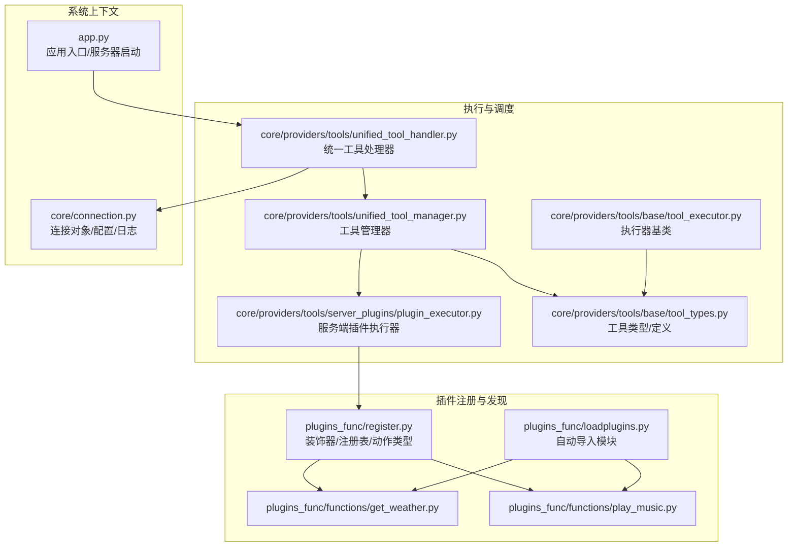
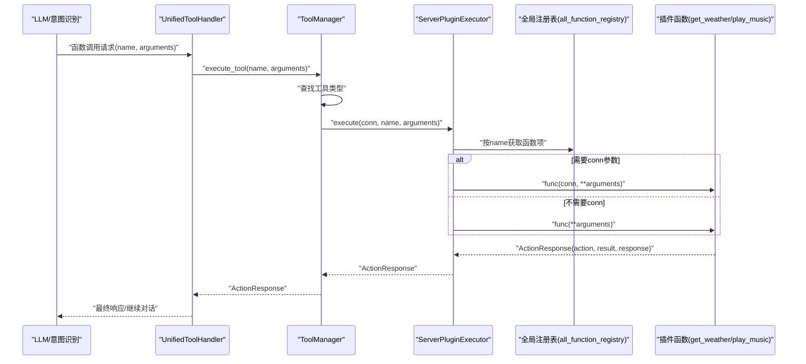
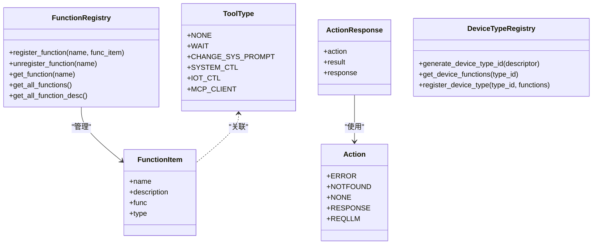
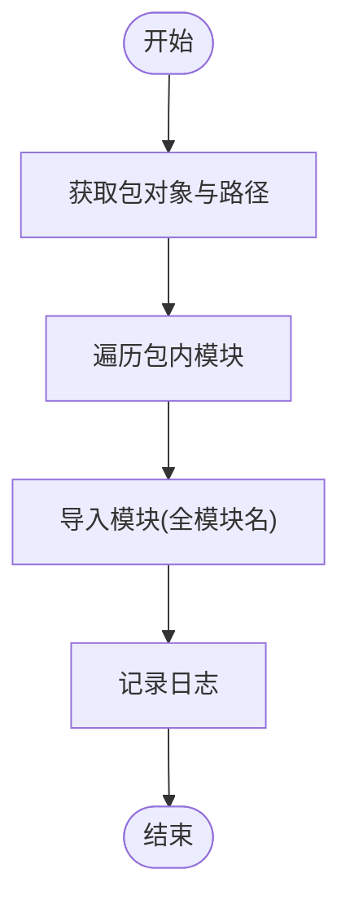
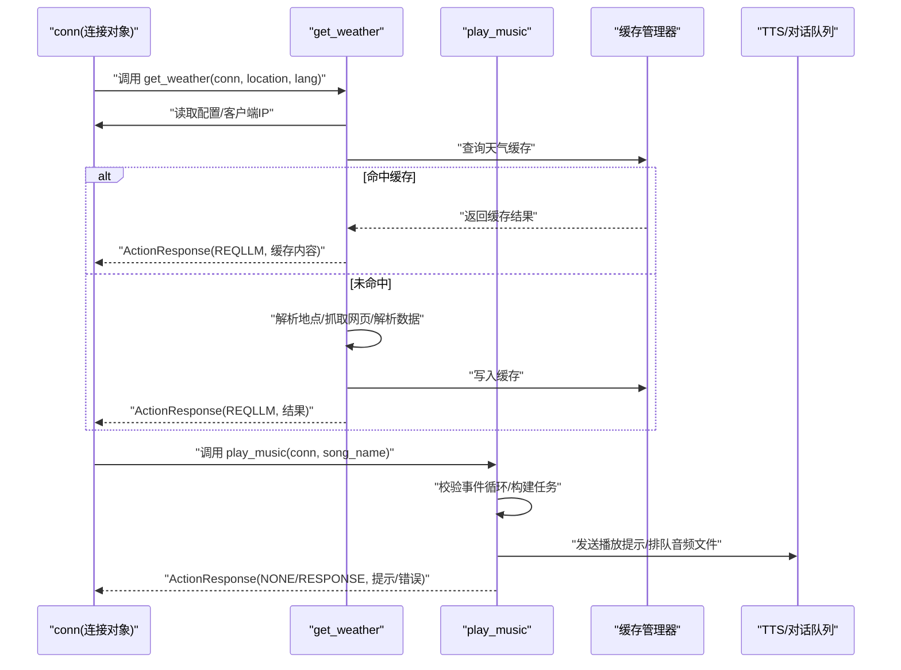
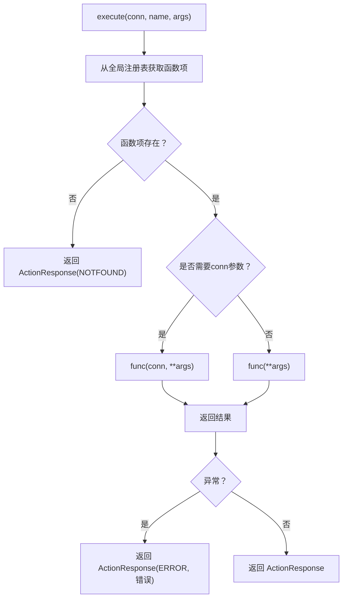
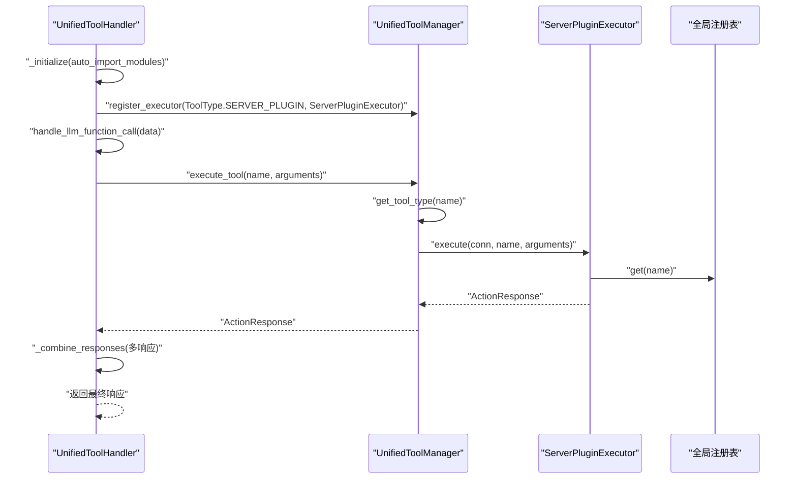
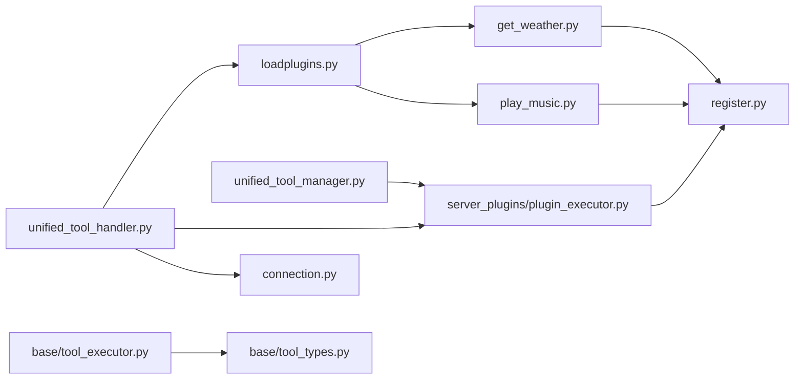

# 插件系统

<cite>
**本文引用的文件**
- [plugins_func/register.py](file://plugins_func/register.py)
- [plugins_func/loadplugins.py](file://plugins_func/loadplugins.py)
- [plugins_func/functions/get_weather.py](file://plugins_func/functions/get_weather.py)
- [plugins_func/functions/play_music.py](file://plugins_func/functions/play_music.py)
- [core/providers/tools/server_plugins/plugin_executor.py](file://core/providers/tools/server_plugins/plugin_executor.py)
- [core/providers/tools/unified_tool_handler.py](file://core/providers/tools/unified_tool_handler.py)
- [core/providers/tools/unified_tool_manager.py](file://core/providers/tools/unified_tool_manager.py)
- [core/providers/tools/base/tool_executor.py](file://core/providers/tools/base/tool_executor.py)
- [core/providers/tools/base/tool_types.py](file://core/providers/tools/base/tool_types.py)
- [core/connection.py](file://core/connection.py)
- [config/settings.py](file://config/settings.py)
- [app.py](file://app.py)
</cite>

## 目录
1. [简介](#简介)
2. [项目结构](#项目结构)
3. [核心组件](#核心组件)
4. [架构总览](#架构总览)
5. [详细组件分析](#详细组件分析)
6. [依赖关系分析](#依赖关系分析)
7. [性能考量](#性能考量)
8. [故障排查指南](#故障排查指南)
9. [结论](#结论)
10. [附录：自定义插件开发指南](#附录自定义插件开发指南)

## 简介
本文件系统化梳理了插件系统的架构设计与工作流程，重点围绕 plugins_func 目录展开，解释 register.py 如何通过装饰器与全局注册表管理函数注册；说明 loadplugins.py 如何自动导入并加载插件模块；阐述 ServerPluginExecutor 如何执行插件函数并通过 ActionResponse 返回结果；并提供开发自定义插件的完整指南，覆盖函数签名、参数结构、错误处理与 conn 上下文访问方式。最后以一次典型调用链路为例，展示从 LLM 生成函数调用请求，到 UnifiedToolHandler 分发，再到 PluginExecutor 执行并返回结果的全过程。

## 项目结构
插件系统位于 plugins_func 目录，采用“装饰器注册 + 自动导入”的模式：
- plugins_func/register.py 定义装饰器与注册表，提供 FunctionItem、FunctionRegistry、ActionResponse、ToolType 等核心类型。
- plugins_func/loadplugins.py 提供自动导入函数，扫描并动态导入 plugins_func/functions 下的模块。
- plugins_func/functions/ 下的各插件模块通过 @register_function 装饰器注册自身，形成全局函数注册表。
- 核心执行层由 core/providers/tools/server_plugins/plugin_executor.py 实现，负责根据工具类型调用插件函数并返回 ActionResponse。
- 统一调度层由 core/providers/tools/unified_tool_handler.py 和 unified_tool_manager.py 提供，负责初始化、工具注册、分发与合并响应。

图表来源
- [plugins_func/register.py](file://plugins_func/register.py#L1-L141)
- [plugins_func/loadplugins.py](file://plugins_func/loadplugins.py#L1-L25)
- [plugins_func/functions/get_weather.py](file://plugins_func/functions/get_weather.py#L1-L228)
- [plugins_func/functions/play_music.py](file://plugins_func/functions/play_music.py#L1-L254)
- [core/providers/tools/server_plugins/plugin_executor.py](file://core/providers/tools/server_plugins/plugin_executor.py#L1-L98)
- [core/providers/tools/unified_tool_handler.py](file://core/providers/tools/unified_tool_handler.py#L1-L236)
- [core/providers/tools/unified_tool_manager.py](file://core/providers/tools/unified_tool_manager.py#L1-L125)
- [core/providers/tools/base/tool_executor.py](file://core/providers/tools/base/tool_executor.py#L1-L28)
- [core/providers/tools/base/tool_types.py](file://core/providers/tools/base/tool_types.py#L1-L28)
- [core/connection.py](file://core/connection.py#L157-L194)
- [app.py](file://app.py#L1-L145)

章节来源
- [plugins_func/register.py](file://plugins_func/register.py#L1-L141)
- [plugins_func/loadplugins.py](file://plugins_func/loadplugins.py#L1-L25)
- [plugins_func/functions/get_weather.py](file://plugins_func/functions/get_weather.py#L1-L228)
- [plugins_func/functions/play_music.py](file://plugins_func/functions/play_music.py#L1-L254)
- [core/providers/tools/server_plugins/plugin_executor.py](file://core/providers/tools/server_plugins/plugin_executor.py#L1-L98)
- [core/providers/tools/unified_tool_handler.py](file://core/providers/tools/unified_tool_handler.py#L1-L236)
- [core/providers/tools/unified_tool_manager.py](file://core/providers/tools/unified_tool_manager.py#L1-L125)
- [core/providers/tools/base/tool_executor.py](file://core/providers/tools/base/tool_executor.py#L1-L28)
- [core/providers/tools/base/tool_types.py](file://core/providers/tools/base/tool_types.py#L1-L28)
- [core/connection.py](file://core/connection.py#L157-L194)
- [app.py](file://app.py#L1-L145)

## 核心组件
- 装饰器与注册表
  - register_function 装饰器将函数注册到全局注册表，记录函数名、描述、实现与工具类型。
  - FunctionRegistry 提供注册、注销、查询与批量获取描述的能力。
  - ActionResponse 作为统一返回载体，封装动作类型、结果与直接回复文本。
  - ToolType 定义工具类型枚举，区分不同调用场景（如 SYSTEM_CTL/IOT_CTL 等）。
- 自动导入
  - auto_import_modules 遍历 plugins_func.functions 包内模块并动态导入，触发各插件模块的装饰器注册。
- 执行器
  - ServerPluginExecutor 根据函数类型决定是否传入 conn 上下文，执行插件函数并返回 ActionResponse。
  - ToolExecutor 抽象基类定义统一接口，ToolManager 负责分发与缓存。
- 统一调度
  - UnifiedToolHandler 在初始化阶段自动导入插件模块，注册执行器，对外提供 handle_llm_function_call 接口。
  - UnifiedToolManager 聚合各执行器的工具定义，按名称分发执行并合并响应。

章节来源
- [plugins_func/register.py](file://plugins_func/register.py#L1-L141)
- [plugins_func/loadplugins.py](file://plugins_func/loadplugins.py#L1-L25)
- [core/providers/tools/server_plugins/plugin_executor.py](file://core/providers/tools/server_plugins/plugin_executor.py#L1-L98)
- [core/providers/tools/unified_tool_handler.py](file://core/providers/tools/unified_tool_handler.py#L1-L236)
- [core/providers/tools/unified_tool_manager.py](file://core/providers/tools/unified_tool_manager.py#L1-L125)
- [core/providers/tools/base/tool_executor.py](file://core/providers/tools/base/tool_executor.py#L1-L28)
- [core/providers/tools/base/tool_types.py](file://core/providers/tools/base/tool_types.py#L1-L28)

## 架构总览
插件系统采用“装饰器注册 + 自动导入 + 统一分发 + 执行器执行”的分层架构。系统启动时，UnifiedToolHandler 初始化并自动导入插件模块；随后通过 ToolManager 聚合工具定义，当收到 LLM 的函数调用请求时，统一调度至对应执行器，执行器依据函数类型决定是否传入 conn 上下文，最终以 ActionResponse 形式返回结果。

图表来源
- [core/providers/tools/unified_tool_handler.py](file://core/providers/tools/unified_tool_handler.py#L138-L177)
- [core/providers/tools/unified_tool_manager.py](file://core/providers/tools/unified_tool_manager.py#L73-L102)
- [core/providers/tools/server_plugins/plugin_executor.py](file://core/providers/tools/server_plugins/plugin_executor.py#L15-L48)
- [plugins_func/register.py](file://plugins_func/register.py#L37-L42)

## 详细组件分析

### 装饰器与注册表：register_function 与 FunctionRegistry
- register_function 装饰器
  - 将函数注册到全局注册表，记录函数名、描述、实现与工具类型，并输出调试日志。
  - 插件模块通过 @register_function("函数名", 函数描述, 工具类型) 的形式声明自身。
- FunctionRegistry
  - 支持直接注册 FunctionItem 或从全局注册表中迁移注册。
  - 提供查询、注销、获取全部描述等能力，便于统一管理与导出。
- ActionResponse
  - 统一返回结构，包含动作类型（NOTFOUND/ERROR/NONE/RESPONSE/REQLLM）、结果与直接回复文本。
- ToolType
  - 定义工具类型枚举，区分不同调用场景，如 SYSTEM_CTL/IOT_CTL 等，影响执行器是否传入 conn。

图表来源
- [plugins_func/register.py](file://plugins_func/register.py#L9-L141)

章节来源
- [plugins_func/register.py](file://plugins_func/register.py#L1-L141)

### 自动导入：loadplugins.auto_import_modules
- 作用
  - 遍历 plugins_func.functions 包内模块，动态导入，从而触发各插件模块的装饰器注册。
- 流程
  - 获取包路径与模块名，拼接全模块名并 importlib.import_module。
  - 日志记录模块加载状态，便于排障。

图表来源
- [plugins_func/loadplugins.py](file://plugins_func/loadplugins.py#L9-L25)

章节来源
- [plugins_func/loadplugins.py](file://plugins_func/loadplugins.py#L1-L25)

### 插件示例：get_weather 与 play_music
- get_weather
  - 使用 @register_function("get_weather", 描述, ToolType.SYSTEM_CTL) 注册。
  - 函数签名包含 conn 与可选参数 location/lang。
  - 通过 conn.config["plugins"]["get_weather"] 获取配置，使用 conn.client_ip 解析默认地点，结合缓存与 ActionResponse 返回结果。
- play_music
  - 使用 @register_function("play_music", 描述, ToolType.SYSTEM_CTL) 注册。
  - 函数签名包含 conn 与 song_name，内部通过 conn.loop 异步调度播放任务，使用 ActionResponse 返回即时响应或错误信息。
  - 通过 conn.logger、conn.tts、conn.dialogue 等上下文进行系统交互。

图表来源
- [plugins_func/functions/get_weather.py](file://plugins_func/functions/get_weather.py#L157-L228)
- [plugins_func/functions/play_music.py](file://plugins_func/functions/play_music.py#L36-L73)
- [core/connection.py](file://core/connection.py#L157-L194)

章节来源
- [plugins_func/functions/get_weather.py](file://plugins_func/functions/get_weather.py#L1-L228)
- [plugins_func/functions/play_music.py](file://plugins_func/functions/play_music.py#L1-L254)
- [core/connection.py](file://core/connection.py#L157-L194)

### 执行器：ServerPluginExecutor
- 作用
  - 根据函数类型决定是否传入 conn 上下文，执行插件函数并返回 ActionResponse。
- 关键逻辑
  - 从全局注册表 all_function_registry 中按名称获取函数项。
  - 根据 func_item.type.code 判断是否需要 conn 参数（SYSTEM_CTL/IOT_CTL 等）。
  - 捕获异常并返回 ActionResponse(ERROR, 错误信息)。

图表来源
- [core/providers/tools/server_plugins/plugin_executor.py](file://core/providers/tools/server_plugins/plugin_executor.py#L15-L48)
- [plugins_func/register.py](file://plugins_func/register.py#L37-L42)

章节来源
- [core/providers/tools/server_plugins/plugin_executor.py](file://core/providers/tools/server_plugins/plugin_executor.py#L1-L98)
- [plugins_func/register.py](file://plugins_func/register.py#L1-L141)

### 统一调度：UnifiedToolHandler 与 UnifiedToolManager
- UnifiedToolHandler
  - 初始化阶段自动导入插件模块，注册各类执行器，输出当前支持的函数列表。
  - handle_llm_function_call 接收 LLM 的函数调用请求，支持单次与多次调用，解析参数字符串为 JSON，分发给 ToolManager 执行。
  - _combine_responses 合并多个响应，若任一响应为 ERROR，则整体返回 ERROR；否则根据是否包含 REQLLM 决定最终动作。
- UnifiedToolManager
  - 维护执行器映射，聚合各执行器的工具定义，按名称分发执行。
  - 缓存工具定义与描述，避免重复计算。

图表来源
- [core/providers/tools/unified_tool_handler.py](file://core/providers/tools/unified_tool_handler.py#L56-L107)
- [core/providers/tools/unified_tool_handler.py](file://core/providers/tools/unified_tool_handler.py#L138-L177)
- [core/providers/tools/unified_tool_handler.py](file://core/providers/tools/unified_tool_handler.py#L178-L210)
- [core/providers/tools/unified_tool_manager.py](file://core/providers/tools/unified_tool_manager.py#L73-L102)

章节来源
- [core/providers/tools/unified_tool_handler.py](file://core/providers/tools/unified_tool_handler.py#L1-L236)
- [core/providers/tools/unified_tool_manager.py](file://core/providers/tools/unified_tool_manager.py#L1-L125)
- [core/providers/tools/base/tool_executor.py](file://core/providers/tools/base/tool_executor.py#L1-L28)
- [core/providers/tools/base/tool_types.py](file://core/providers/tools/base/tool_types.py#L1-L28)

## 依赖关系分析
- 组件耦合
  - 插件模块依赖 register.py 的装饰器与类型定义，形成与执行层的弱耦合。
  - ServerPluginExecutor 依赖全局注册表与 ActionResponse，执行逻辑清晰。
  - UnifiedToolHandler 依赖 loadplugins 与各执行器，统一调度，职责单一。
- 外部依赖
  - 插件模块可能依赖 conn 对象访问系统上下文（如配置、TTS、对话队列、缓存等），这些能力由 core/connection.py 与相关模块提供。
- 循环依赖
  - 当前结构未见明显循环依赖；装饰器与执行器通过全局注册表解耦。

图表来源
- [plugins_func/functions/get_weather.py](file://plugins_func/functions/get_weather.py#L1-L228)
- [plugins_func/functions/play_music.py](file://plugins_func/functions/play_music.py#L1-L254)
- [plugins_func/register.py](file://plugins_func/register.py#L1-L141)
- [plugins_func/loadplugins.py](file://plugins_func/loadplugins.py#L1-L25)
- [core/providers/tools/unified_tool_handler.py](file://core/providers/tools/unified_tool_handler.py#L1-L236)
- [core/providers/tools/server_plugins/plugin_executor.py](file://core/providers/tools/server_plugins/plugin_executor.py#L1-L98)
- [core/providers/tools/unified_tool_manager.py](file://core/providers/tools/unified_tool_manager.py#L1-L125)
- [core/providers/tools/base/tool_executor.py](file://core/providers/tools/base/tool_executor.py#L1-L28)
- [core/providers/tools/base/tool_types.py](file://core/providers/tools/base/tool_types.py#L1-L28)
- [core/connection.py](file://core/connection.py#L157-L194)

章节来源
- [plugins_func/functions/get_weather.py](file://plugins_func/functions/get_weather.py#L1-L228)
- [plugins_func/functions/play_music.py](file://plugins_func/functions/play_music.py#L1-L254)
- [plugins_func/register.py](file://plugins_func/register.py#L1-L141)
- [plugins_func/loadplugins.py](file://plugins_func/loadplugins.py#L1-L25)
- [core/providers/tools/unified_tool_handler.py](file://core/providers/tools/unified_tool_handler.py#L1-L236)
- [core/providers/tools/server_plugins/plugin_executor.py](file://core/providers/tools/server_plugins/plugin_executor.py#L1-L98)
- [core/providers/tools/unified_tool_manager.py](file://core/providers/tools/unified_tool_manager.py#L1-L125)
- [core/providers/tools/base/tool_executor.py](file://core/providers/tools/base/tool_executor.py#L1-L28)
- [core/providers/tools/base/tool_types.py](file://core/providers/tools/base/tool_types.py#L1-L28)
- [core/connection.py](file://core/connection.py#L157-L194)

## 性能考量
- 缓存策略
  - get_weather 使用缓存管理器缓存 IP 与天气结果，减少重复网络请求与解析开销。
- 异步执行
  - play_music 通过 conn.loop 异步调度，避免阻塞主线程，提升响应速度。
- 工具描述缓存
  - UnifiedToolManager 对工具定义与描述进行缓存，降低重复聚合成本。
- 自动导入
  - 仅在初始化阶段导入插件模块，避免运行期频繁扫描与导入。

章节来源
- [plugins_func/functions/get_weather.py](file://plugins_func/functions/get_weather.py#L157-L228)
- [plugins_func/functions/play_music.py](file://plugins_func/functions/play_music.py#L36-L73)
- [core/providers/tools/unified_tool_manager.py](file://core/providers/tools/unified_tool_manager.py#L1-L125)

## 故障排查指南
- 插件未生效
  - 检查是否在 plugins_func/functions 下新增模块并被自动导入（查看初始化日志）。
  - 确认 @register_function 调用正确，函数名与描述一致。
- 函数不存在
  - UnifiedToolHandler/UnifiedToolManager 会在工具不存在时返回 NOTFOUND，检查工具名称与拼写。
- 执行异常
  - ServerPluginExecutor 捕获异常并返回 ERROR，查看日志定位具体异常。
- 需要 conn 参数但未传
  - 确认插件函数签名包含 conn 参数，且工具类型为 SYSTEM_CTL/IOT_CTL 等需要 conn 的类型。
- 配置缺失
  - get_weather 依赖 conn.config["plugins"]["get_weather"]，确保配置文件中存在相应键值。

章节来源
- [core/providers/tools/unified_tool_handler.py](file://core/providers/tools/unified_tool_handler.py#L138-L177)
- [core/providers/tools/unified_tool_manager.py](file://core/providers/tools/unified_tool_manager.py#L73-L102)
- [core/providers/tools/server_plugins/plugin_executor.py](file://core/providers/tools/server_plugins/plugin_executor.py#L15-L48)
- [plugins_func/functions/get_weather.py](file://plugins_func/functions/get_weather.py#L157-L228)

## 结论
插件系统通过装饰器注册与自动导入机制，实现了插件的即插即用；通过统一调度与执行器分发，保证了不同工具类型的差异化调用；通过 ActionResponse 统一返回结构，简化了上层处理。系统在缓存与异步执行方面具备良好性能表现，同时通过日志与错误处理保障了可观测性与稳定性。

## 附录：自定义插件开发指南
- 函数签名与参数
  - 若插件需要访问系统上下文（如配置、TTS、对话队列、缓存等），函数签名应包含 conn 参数。
  - 若仅执行纯函数逻辑，可不包含 conn。
  - 参数结构建议遵循 OpenAI 函数调用格式，使用 JSON Schema 描述参数类型与必填字段。
- 装饰器与注册
  - 使用 @register_function("函数名", 函数描述, 工具类型) 进行注册。
  - 工具类型选择：
    - ToolType.SYSTEM_CTL：需要 conn 参数，常用于系统控制（如播放音乐、退出等）。
    - ToolType.IOT_CTL：需要 conn 参数，常用于物联网设备控制。
    - 其他类型：根据实际需求选择。
- 错误处理
  - 使用 ActionResponse 返回：
    - Action.NOTFOUND：函数不存在。
    - Action.ERROR：执行异常。
    - Action.NONE：无需后续处理。
    - Action.RESPONSE：直接返回文本回复。
    - Action.REQLLM：需要再次请求 LLM 生成回复。
- 访问系统上下文
  - 通过 conn 对象访问：
    - conn.config：插件配置。
    - conn.client_ip：客户端 IP。
    - conn.logger：日志。
    - conn.tts/tts_text_queue：TTS 文本队列。
    - conn.dialogue.put：对话消息队列。
    - conn.loop：事件循环（异步任务）。
- 开发步骤
  - 新建模块：在 plugins_func/functions 下新建模块文件。
  - 定义函数描述：按 OpenAI 函数调用格式编写 JSON 描述。
  - 编写函数：按需包含 conn 参数，实现业务逻辑。
  - 装饰注册：使用 @register_function 注册。
  - 配置插件：在配置文件中添加插件所需参数。
  - 测试：通过 UnifiedToolHandler 发起函数调用，观察返回结果与日志。

章节来源
- [plugins_func/register.py](file://plugins_func/register.py#L1-L141)
- [plugins_func/functions/get_weather.py](file://plugins_func/functions/get_weather.py#L1-L228)
- [plugins_func/functions/play_music.py](file://plugins_func/functions/play_music.py#L1-L254)
- [core/providers/tools/server_plugins/plugin_executor.py](file://core/providers/tools/server_plugins/plugin_executor.py#L1-L98)
- [core/providers/tools/unified_tool_handler.py](file://core/providers/tools/unified_tool_handler.py#L138-L177)
- [core/connection.py](file://core/connection.py#L157-L194)
- [config/settings.py](file://config/settings.py#L1-L34)
- [app.py](file://app.py#L1-L145)