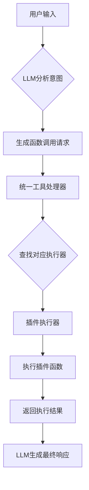
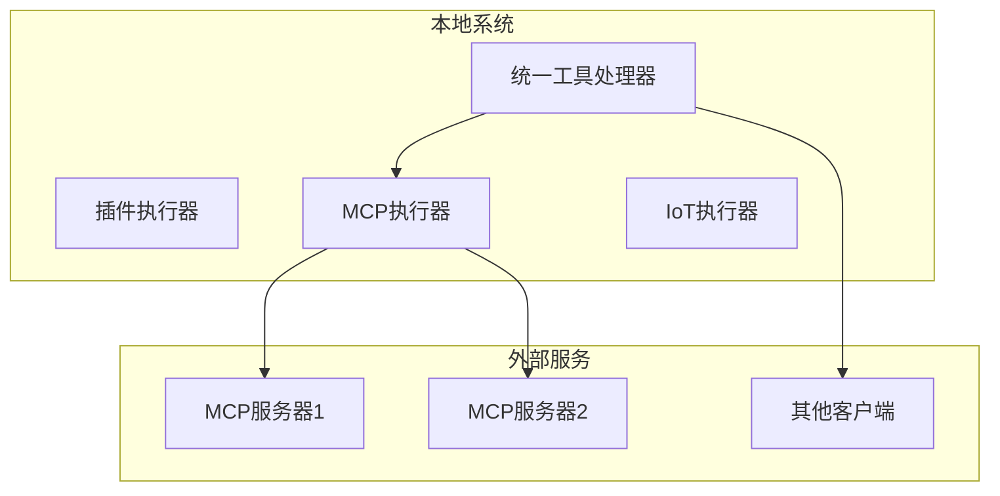
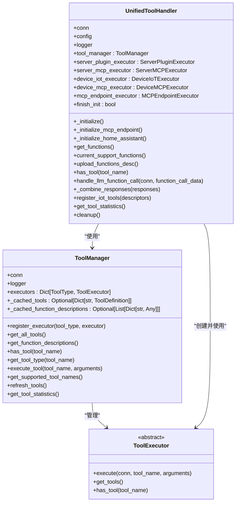
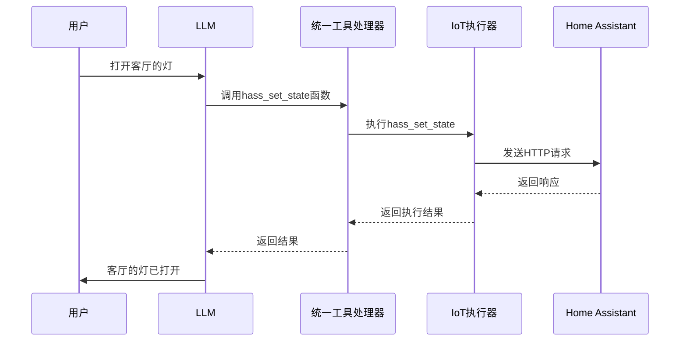
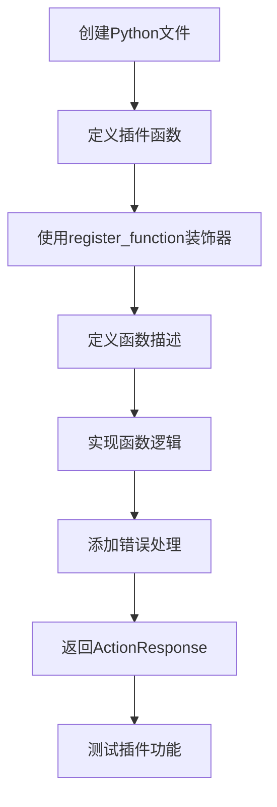
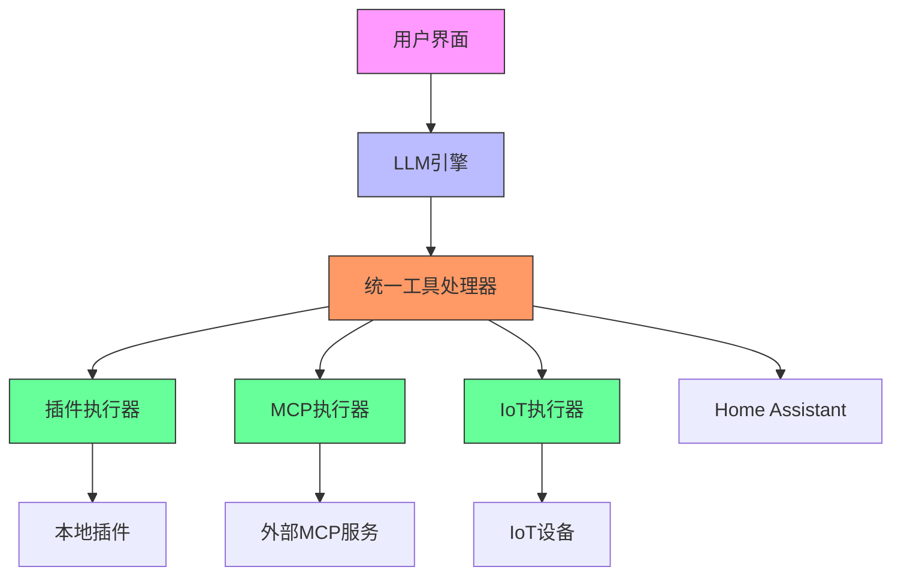

# 设备交互与扩展

<cite>
**本文档引用的文件**  
- [register.py](file://plugins_func/register.py)
- [loadplugins.py](file://plugins_func/loadplugins.py)
- [get_weather.py](file://plugins_func/functions/get_weather.py)
- [play_music.py](file://plugins_func/functions/play_music.py)
- [unified_tool_manager.py](file://core/providers/tools/unified_tool_manager.py)
- [unified_tool_handler.py](file://core/providers/tools/unified_tool_handler.py)
- [tool_executor.py](file://core/providers/tools/base/tool_executor.py)
- [tool_types.py](file://core/providers/tools/base/tool_types.py)
- [device_mcp/mcp_client.py](file://core/providers/tools/device_mcp/mcp_client.py)
- [server_mcp/mcp_manager.py](file://core/providers/tools/server_mcp/mcp_manager.py)
- [hass_init.py](file://plugins_func/functions/hass_init.py)
- [hass_set_state.py](file://plugins_func/functions/hass_set_state.py)
- [iot_executor.py](file://core/providers/tools/device_iot/iot_executor.py)
- [plugin_executor.py](file://core/providers/tools/server_plugins/plugin_executor.py)
- [app.py](file://app.py)
</cite>

## 目录
1. [引言](#引言)
2. [插件系统工作原理](#插件系统工作原理)
3. [MCP协议集成](#mcp协议集成)
4. [统一工具管理机制](#统一工具管理机制)
5. [设备控制与IoT集成](#设备控制与iot集成)
6. [自定义插件开发指南](#自定义插件开发指南)
7. [典型设备控制场景分析](#典型设备控制场景分析)
8. [系统架构概览](#系统架构概览)
9. [总结](#总结)

## 引言

本系统通过插件系统和MCP（Model Context Protocol）协议实现了强大的设备交互与功能扩展能力，使智能助手能够超越基础的问答功能，实现对物理设备的控制和复杂功能的集成。系统采用模块化设计，通过统一的工具管理框架，将本地插件、IoT设备控制和远程MCP服务无缝集成，为用户提供全面的智能交互体验。

**本文档引用的文件**  
- [app.py](file://app.py#L1-L145)

## 插件系统工作原理

插件系统是本系统实现功能扩展的核心机制。系统通过`plugins_func/functions`目录下的Python文件定义具体功能，如`get_weather.py`、`play_music.py`等。每个插件函数通过`register.py`中的装饰器进行注册，从而暴露给系统使用。

插件函数的注册通过`register_function`装饰器实现，该装饰器接收函数名称、描述和类型参数，将函数注册到全局的函数注册表中。系统在启动时会自动加载`plugins_func/functions`目录下的所有模块，确保所有插件函数都能被正确注册和使用。

LLM通过函数调用机制触发这些插件。当用户输入触发特定意图时，LLM会生成符合OpenAI函数调用格式的请求，系统接收到请求后，通过统一工具处理器调用相应的插件函数，并将执行结果返回给LLM进行后续处理。



**Diagram sources**  
- [register.py](file://plugins_func/register.py#L82-L90)
- [loadplugins.py](file://plugins_func/loadplugins.py#L9-L25)
- [unified_tool_handler.py](file://core/providers/tools/unified_tool_handler.py#L56-L75)

**Section sources**
- [register.py](file://plugins_func/register.py#L1-L141)
- [loadplugins.py](file://plugins_func/loadplugins.py#L1-L25)
- [get_weather.py](file://plugins_func/functions/get_weather.py#L1-L228)
- [play_music.py](file://plugins_func/functions/play_music.py#L1-L254)

## MCP协议集成

MCP（Model Context Protocol）协议的集成是本系统实现远程服务调用和设备控制的关键。系统通过`device_mcp`和`server_mcp`包分别实现了作为MCP客户端和服务器的能力。

`device_mcp`包中的`MCPClient`类负责管理设备端的MCP状态和工具，能够与外部MCP服务器通信。`server_mcp`包中的`ServerMCPManager`类则负责管理多个服务端MCP服务，作为MCP服务器为其他客户端提供工具。

系统可以作为MCP客户端与外部MCP服务器通信，获取远程服务提供的功能；也可以作为MCP服务器，通过`mcp_endpoint`为其他客户端提供本地工具。这种双向通信能力使得系统能够灵活地集成各种外部服务和设备。



**Diagram sources**  
- [device_mcp/mcp_client.py](file://core/providers/tools/device_mcp/mcp_client.py#L12-L94)
- [server_mcp/mcp_manager.py](file://core/providers/tools/server_mcp/mcp_manager.py#L15-L162)

**Section sources**
- [device_mcp/mcp_client.py](file://core/providers/tools/device_mcp/mcp_client.py#L1-L94)
- [server_mcp/mcp_manager.py](file://core/providers/tools/server_mcp/mcp_manager.py#L1-L162)

## 统一工具管理机制

系统通过`unified_tool_manager.py`和`unified_tool_handler.py`实现了统一的工具管理机制。`ToolManager`类作为统一工具管理器，管理所有类型的工具，包括插件、MCP服务和IoT设备。

`UnifiedToolHandler`类作为统一工具处理器，集成了各种执行器，包括`ServerPluginExecutor`、`ServerMCPExecutor`、`DeviceIoTExecutor`和`DeviceMCPExecutor`。这些执行器分别负责处理不同类型的工具调用。

工具管理器通过注册机制将各种执行器统一管理，当收到工具调用请求时，能够根据工具类型找到对应的执行器进行处理。这种设计实现了工具调用的解耦，使得系统能够灵活地扩展新的工具类型。



**Diagram sources**  
- [unified_tool_manager.py](file://core/providers/tools/unified_tool_manager.py#L9-L125)
- [unified_tool_handler.py](file://core/providers/tools/unified_tool_handler.py#L18-L236)
- [tool_executor.py](file://core/providers/tools/base/tool_executor.py#L9-L28)

**Section sources**
- [unified_tool_manager.py](file://core/providers/tools/unified_tool_manager.py#L1-L125)
- [unified_tool_handler.py](file://core/providers/tools/unified_tool_handler.py#L1-L236)
- [tool_executor.py](file://core/providers/tools/base/tool_executor.py#L1-L28)
- [tool_types.py](file://core/providers/tools/base/tool_types.py#L1-L28)

## 设备控制与IoT集成

系统通过`device_iot`包实现了对IoT设备的控制。`DeviceIoTExecutor`类作为IoT工具执行器，负责处理与IoT设备相关的工具调用。

系统通过`hass_init.py`和`hass_set_state.py`等文件与Home Assistant集成，实现对智能家居设备的控制。`hass_init.py`中的`append_devices_to_prompt`函数将设备列表添加到提示词中，使LLM能够了解可用的设备。

`hass_set_state.py`中的`hass_set_state`函数实现了对Home Assistant设备状态的设置，包括开关设备、调整灯光亮度和颜色、调整音量等操作。该函数通过HTTP API与Home Assistant通信，发送相应的服务调用请求。



**Diagram sources**  
- [hass_init.py](file://plugins_func/functions/hass_init.py#L8-L53)
- [hass_set_state.py](file://plugins_func/functions/hass_set_state.py#L52-L176)
- [iot_executor.py](file://core/providers/tools/device_iot/iot_executor.py#L10-L239)

**Section sources**
- [hass_init.py](file://plugins_func/functions/hass_init.py#L1-L53)
- [hass_set_state.py](file://plugins_func/functions/hass_set_state.py#L1-L176)
- [iot_executor.py](file://core/providers/tools/device_iot/iot_executor.py#L1-L239)

## 自定义插件开发指南

开发自定义插件需要遵循以下规范：

1. **函数编写规范**：在`plugins_func/functions`目录下创建Python文件，定义插件函数。
2. **参数定义**：使用标准的OpenAI函数调用格式定义函数参数，包括类型、属性和必填项。
3. **错误处理**：在函数中实现适当的错误处理机制，返回清晰的错误信息。
4. **注册方法**：使用`register_function`装饰器注册函数，指定函数名称、描述和类型。

插件函数需要返回`ActionResponse`对象，该对象包含动作类型、结果和响应内容。动作类型包括`REQLLM`（调用函数后再请求LLM生成回复）、`RESPONSE`（直接回复）等。



**Section sources**
- [register.py](file://plugins_func/register.py#L82-L90)
- [get_weather.py](file://plugins_func/functions/get_weather.py#L157-L228)
- [play_music.py](file://plugins_func/functions/play_music.py#L36-L72)

## 典型设备控制场景分析

以用户说"打开客厅的灯"为例，系统的工作流程如下：

1. 用户语音输入被系统接收并转换为文本。
2. LLM分析用户意图，识别出需要控制设备。
3. LLM生成调用`hass_set_state`函数的请求，参数包括设备ID和操作类型。
4. 统一工具处理器接收到函数调用请求，通过`ServerPluginExecutor`执行`hass_set_state`函数。
5. `hass_set_state`函数通过HTTP API向Home Assistant发送请求，控制指定设备。
6. Home Assistant返回执行结果，系统将结果反馈给用户。

这个流程展示了系统如何将自然语言指令转换为具体的设备控制操作，实现了从用户输入到设备响应的完整闭环。

```mermaid
flowchart LR
A[用户说"打开客厅的灯"] --> B[语音转文本]
B --> C[LLM分析意图]
C --> D[生成函数调用]
D --> E[执行hass_set_state]
E --> F[调用Home Assistant API]
F --> G[设备状态改变]
G --> H[返回执行结果]
H --> I[LLM生成响应]
I --> J[语音输出"客厅的灯已打开"]
```

**Section sources**
- [hass_set_state.py](file://plugins_func/functions/hass_set_state.py#L52-L176)
- [unified_tool_handler.py](file://core/providers/tools/unified_tool_handler.py#L138-L176)

## 系统架构概览

系统采用分层架构设计，各组件协同工作实现设备交互与扩展功能。



**Diagram sources**  
- [unified_tool_handler.py](file://core/providers/tools/unified_tool_handler.py#L18-L236)
- [plugin_executor.py](file://core/providers/tools/server_plugins/plugin_executor.py#L8-L98)
- [iot_executor.py](file://core/providers/tools/device_iot/iot_executor.py#L10-L239)

## 总结

本系统通过插件系统和MCP协议的深度集成，实现了强大的设备交互与功能扩展能力。插件系统提供了灵活的本地功能扩展机制，MCP协议则实现了与外部服务的无缝集成。统一的工具管理框架将各种工具类型统一管理，使得系统能够以一致的方式处理不同类型的工具调用。

通过与Home Assistant等智能家居平台的集成，系统能够实现对物理设备的控制，为用户提供真正的智能助手体验。自定义插件开发指南为开发者提供了清晰的开发路径，使得系统功能能够持续扩展和优化。

这种架构设计不仅满足了当前的需求，还为未来的功能扩展提供了良好的基础，确保了系统的长期可维护性和可扩展性。