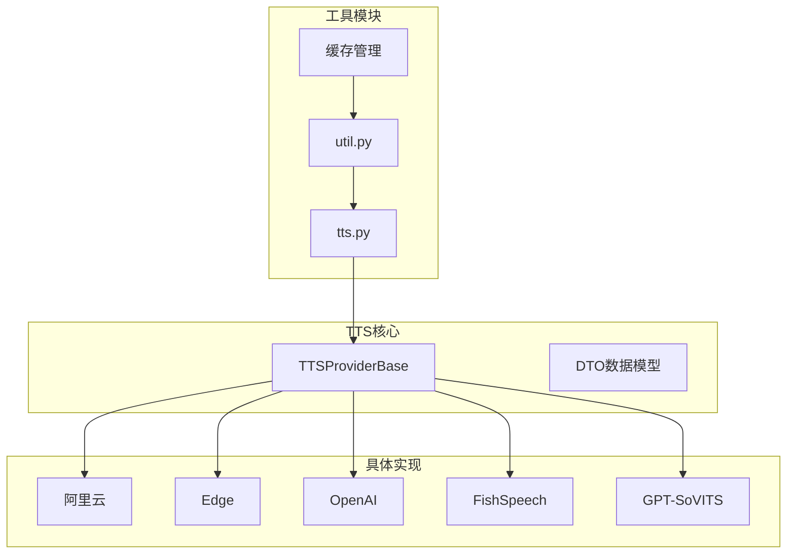
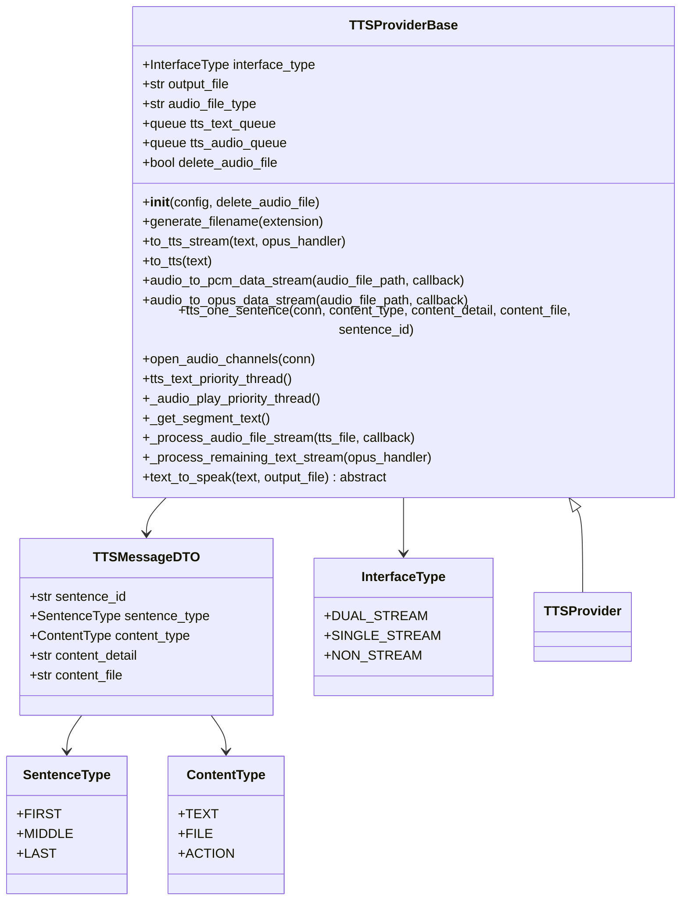
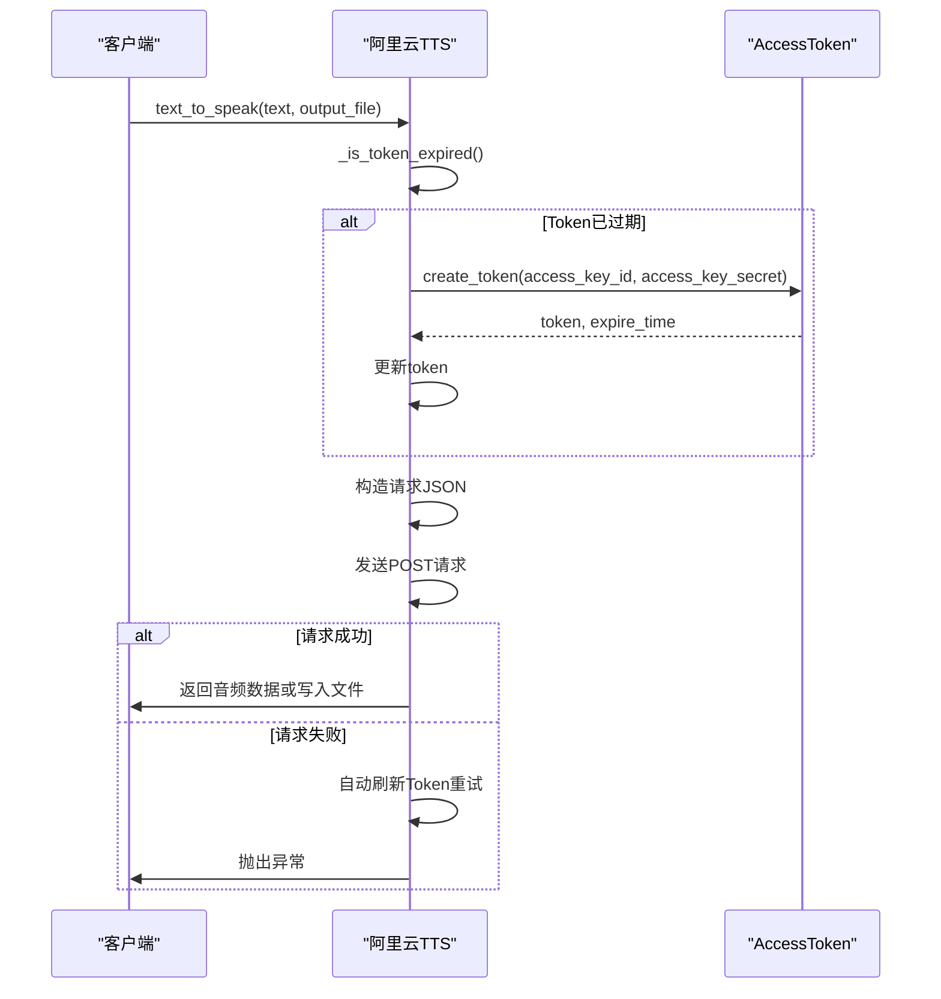
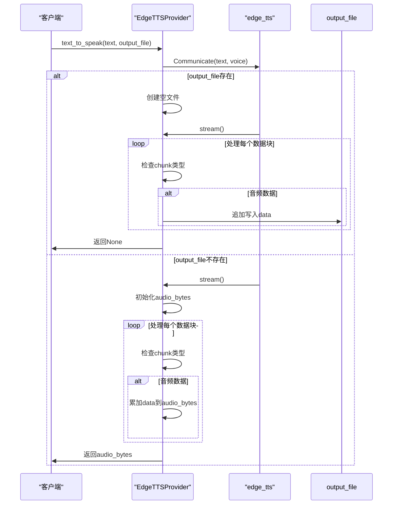
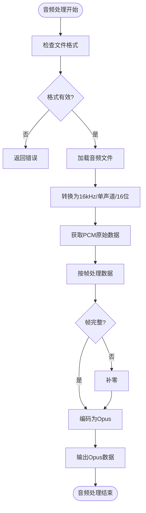
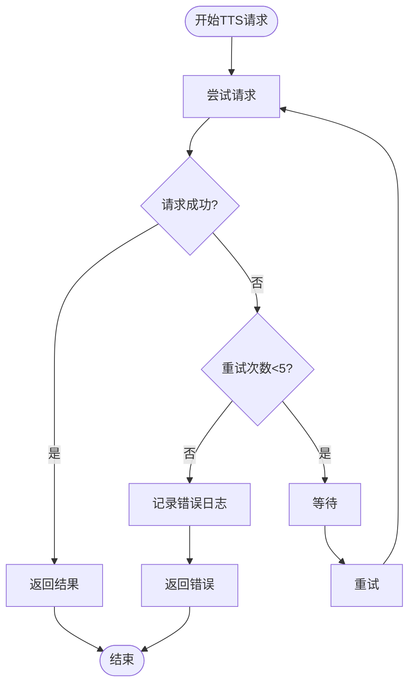
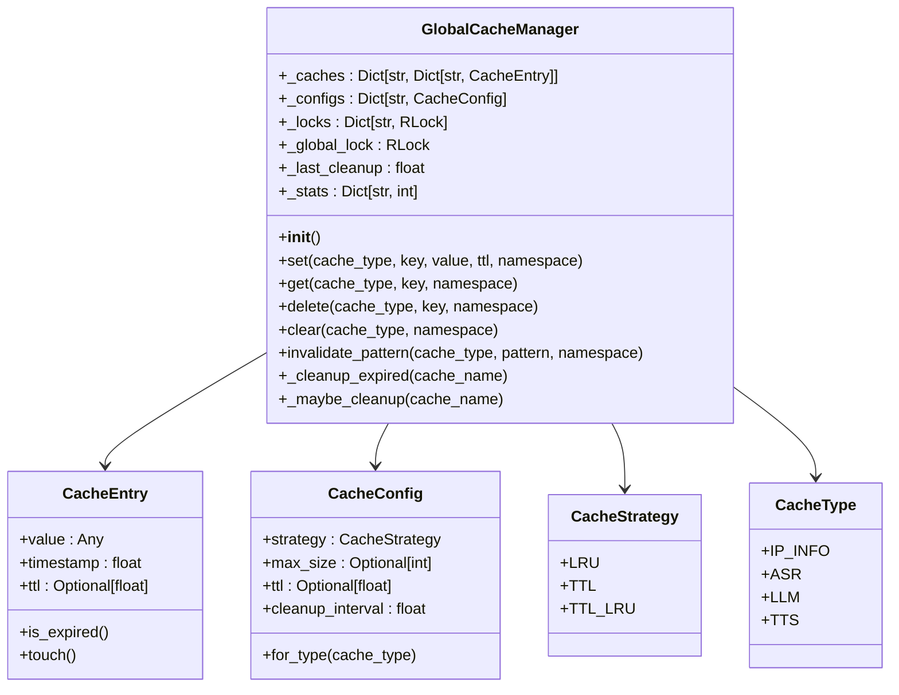

# TTS引擎集成

<cite>
**本文档引用的文件**  
- [base.py](file://core/providers/tts/base.py)
- [edge.py](file://core/providers/tts/edge.py)
- [aliyun.py](file://core/providers/tts/aliyun.py)
- [openai.py](file://core/providers/tts/openai.py)
- [fishspeech.py](file://core/providers/tts/fishspeech.py)
- [gpt_sovits_v2.py](file://core/providers/tts/gpt_sovits_v2.py)
- [tts.py](file://core/utils/tts.py)
- [util.py](file://core/utils/util.py)
- [dto.py](file://core/providers/tts/dto/dto.py)
- [manager.py](file://core/utils/cache/manager.py)
</cite>

## 目录
1. [简介](#简介)
2. [项目结构](#项目结构)
3. [核心组件](#核心组件)
4. [TTSProviderBase抽象基类设计](#ttsproviderbase抽象基类设计)
5. [具体TTS引擎实现分析](#具体tts引擎实现分析)
6. [音频处理与工具模块](#音频处理与工具模块)
7. [引擎对比与选型建议](#引擎对比与选型建议)
8. [错误处理与重试机制](#错误处理与重试机制)
9. [缓存管理机制](#缓存管理机制)
10. [总结](#总结)

## 简介
本文档详细解析了TTS（文本转语音）引擎集成系统的设计与实现，重点聚焦于非流式语音合成服务。系统通过抽象基类`TTSProviderBase`定义了统一接口规范，并实现了阿里云、Edge、OpenAI、FishSpeech、GPT-SoVITS等多种语音合成引擎的集成。文档深入分析了各引擎的认证方式、音频参数配置、输出格式支持及错误处理策略，为开发者提供全面的技术参考和选型依据。

## 项目结构
TTS引擎集成位于`core/providers/tts`目录下，采用模块化设计，每个语音提供商都有独立的实现文件。系统通过`base.py`定义抽象基类，`dto/dto.py`定义数据传输对象，`utils/tts.py`提供工具函数，形成了清晰的分层架构。

**图源**  
- [base.py](file://core/providers/tts/base.py)
- [dto.py](file://core/providers/tts/dto/dto.py)
- [utils/tts.py](file://core/utils/tts.py)

**本节来源**  
- [core/providers/tts](file://core/providers/tts)

## 核心组件
TTS系统的核心组件包括抽象基类`TTSProviderBase`、具体引擎实现类、音频处理工具和缓存管理器。`TTSProviderBase`作为所有TTS引擎的基类，定义了统一的接口和基础功能。各具体引擎通过继承该基类并实现`text_to_speak`方法来提供特定的语音合成服务。音频处理工具负责格式转换和编码，缓存管理器则优化了系统性能。

**本节来源**  
- [base.py](file://core/providers/tts/base.py)
- [util.py](file://core/utils/util.py)
- [manager.py](file://core/utils/cache/manager.py)

## TTSProviderBase抽象基类设计
`TTSProviderBase`是所有TTS引擎的抽象基类，采用ABC（Abstract Base Class）模式定义了统一的接口规范。该基类不仅定义了必须实现的抽象方法，还提供了通用的功能实现，如文件生成、音频流处理、错误重试等。

**图源**  
- [base.py](file://core/providers/tts/base.py#L31-L462)
- [dto.py](file://core/providers/tts/dto/dto.py#L5-L44)

**本节来源**  
- [base.py](file://core/providers/tts/base.py#L31-L462)
- [dto.py](file://core/providers/tts/dto/dto.py#L5-L44)

## 具体TTS引擎实现分析
### 阿里云TTS实现
阿里云TTS引擎通过`aliyun.py`实现，支持两种认证方式：使用Access Key ID/Secret生成临时Token，或直接使用预生成的长期Token。引擎支持丰富的音频参数配置，包括语速、音调、音量等。

**图源**  
- [aliyun.py](file://core/providers/tts/aliyun.py#L86-L206)

**本节来源**  
- [aliyun.py](file://core/providers/tts/aliyun.py#L86-L206)

### Edge TTS实现
Edge TTS引擎通过`edge.py`实现，使用`edge_tts`库与微软Edge浏览器的TTS服务进行交互。该实现支持直接返回音频二进制数据或写入文件。

**图源**  
- [edge.py](file://core/providers/tts/edge.py#L8-L46)

**本节来源**  
- [edge.py](file://core/providers/tts/edge.py#L8-L46)

### OpenAI TTS实现
OpenAI TTS引擎通过`openai.py`实现，使用标准的REST API与OpenAI服务进行交互。该实现支持多种语音模型和语速调节。

**本节来源**  
- [openai.py](file://core/providers/tts/openai.py#L10-L55)

### FishSpeech实现
FishSpeech引擎通过`fishspeech.py`实现，支持自定义参考音频和文本，可实现个性化的语音合成。该引擎使用MessagePack进行高效的数据序列化。

**本节来源**  
- [fishspeech.py](file://core/providers/tts/fishspeech.py#L80-L189)

### GPT-SoVITS实现
GPT-SoVITS引擎通过`gpt_sovits_v2.py`实现，支持参考音频路径、提示文本等高级配置，可生成高质量的个性化语音。

**本节来源**  
- [gpt_sovits_v2.py](file://core/providers/tts/gpt_sovits_v2.py#L10-L104)

## 音频处理与工具模块
### 音频格式转换
系统通过`util.py`中的工具函数实现音频格式转换，支持WAV、MP3、PCM等多种格式。

**图源**  
- [util.py](file://core/utils/util.py#L257-L320)

**本节来源**  
- [util.py](file://core/utils/util.py#L257-L320)

### Markdown清理
`MarkdownCleaner`类负责清理文本中的Markdown格式，确保TTS引擎接收到纯净的文本内容。

**本节来源**  
- [tts.py](file://core/utils/tts.py#L42-L138)

## 引擎对比与选型建议
| 引擎 | 音质 | 延迟 | 成本 | 自定义语音 | 认证方式 |
|------|------|------|------|------------|----------|
| 阿里云 | 高 | 低 | 按量计费 | 支持 | Access Key或Token |
| Edge | 中 | 低 | 免费 | 有限支持 | 无 |
| OpenAI | 高 | 中 | 按量计费 | 支持 | API Key |
| FishSpeech | 高 | 中 | 开源 | 强支持 | API Key |
| GPT-SoVITS | 高 | 高 | 开源 | 强支持 | 本地部署 |

**本节来源**  
- [aliyun.py](file://core/providers/tts/aliyun.py)
- [edge.py](file://core/providers/tts/edge.py)
- [openai.py](file://core/providers/tts/openai.py)
- [fishspeech.py](file://core/providers/tts/fishspeech.py)
- [gpt_sovits_v2.py](file://core/providers/tts/gpt_sovits_v2.py)

## 错误处理与重试机制
系统实现了完善的错误处理与重试机制，确保TTS服务的稳定性。

**图源**  
- [base.py](file://core/providers/tts/base.py#L85-L214)

**本节来源**  
- [base.py](file://core/providers/tts/base.py#L85-L214)

## 缓存管理机制
系统使用`GlobalCacheManager`实现全局缓存管理，支持多种缓存策略和命名空间。

**图源**  
- [manager.py](file://core/utils/cache/manager.py#L13-L217)

**本节来源**  
- [manager.py](file://core/utils/cache/manager.py#L13-L217)

## 总结
本文档全面解析了TTS引擎集成系统的设计与实现。通过`TTSProviderBase`抽象基类，系统实现了统一的接口规范，使得多种TTS引擎可以无缝集成。各具体引擎在继承基类的基础上，实现了各自的认证方式、参数配置和错误处理策略。音频处理工具和缓存管理器进一步提升了系统的性能和可靠性。开发者可根据音质、延迟、成本和自定义需求选择合适的TTS引擎。