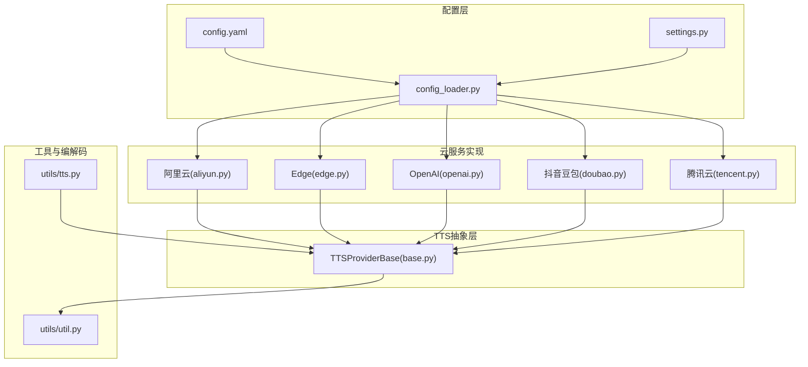
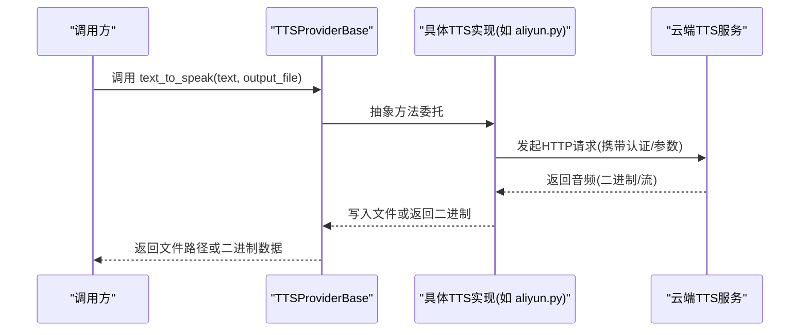
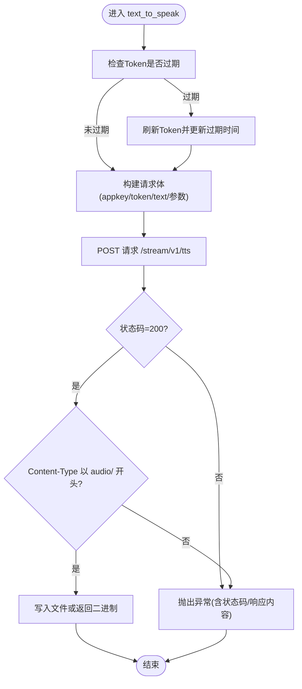
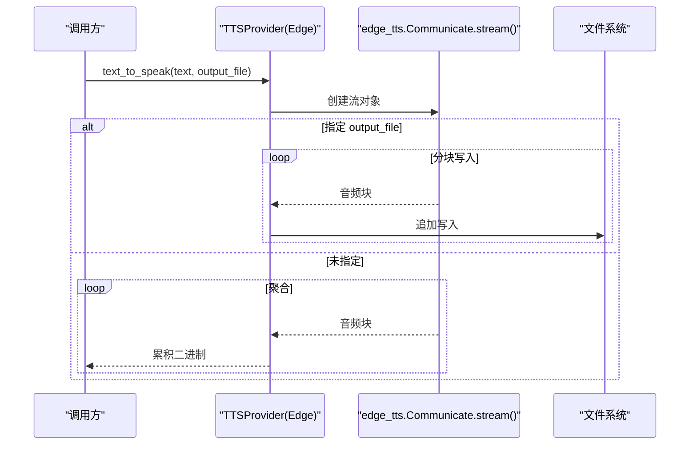
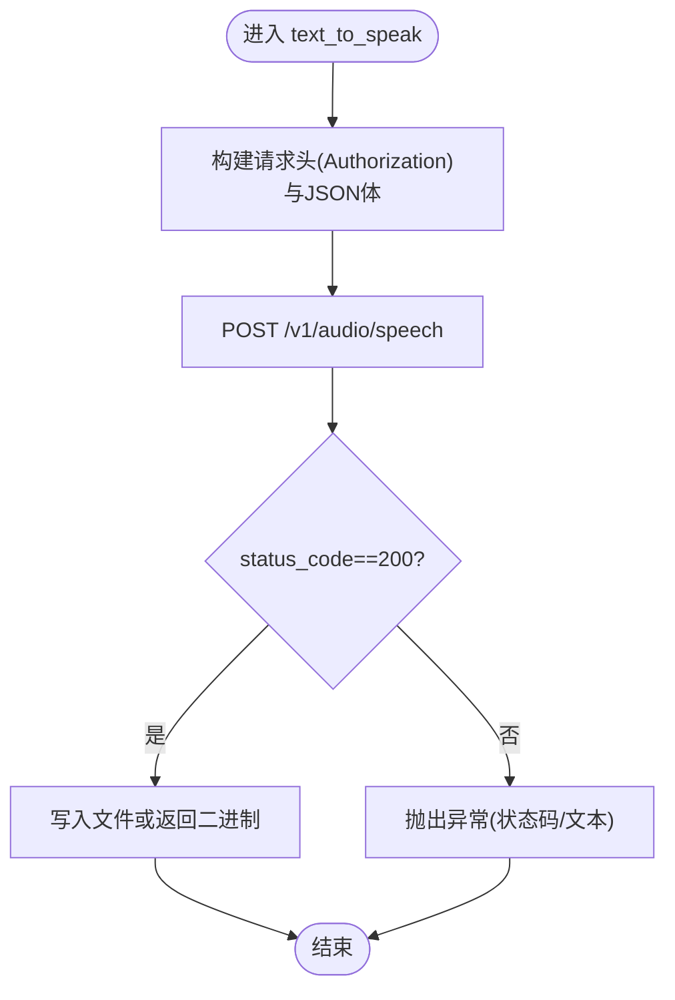
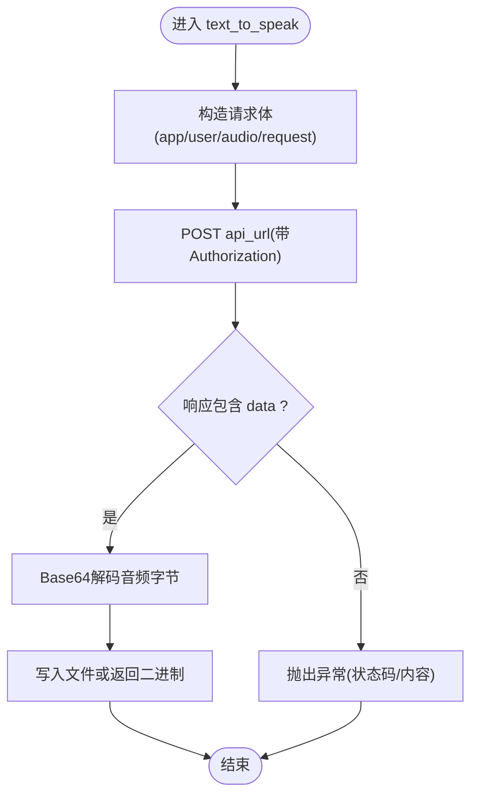
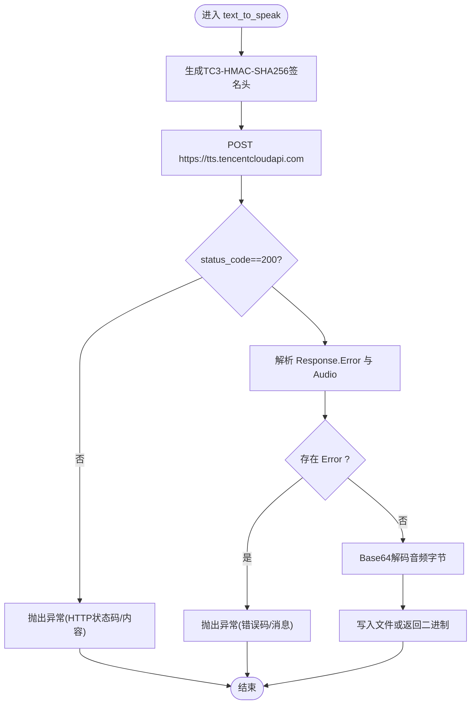
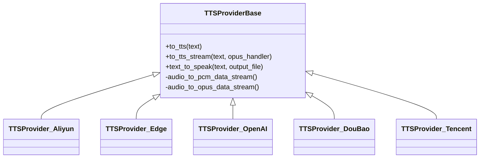
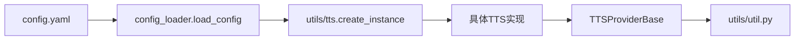

# 主流云服务集成

<cite>
**本文引用的文件**
- [aliyun.py](file://core/providers/tts/aliyun.py)
- [edge.py](file://core/providers/tts/edge.py)
- [openai.py](file://core/providers/tts/openai.py)
- [doubao.py](file://core/providers/tts/doubao.py)
- [tencent.py](file://core/providers/tts/tencent.py)
- [base.py](file://core/providers/tts/base.py)
- [config_loader.py](file://config/config_loader.py)
- [settings.py](file://config/settings.py)
- [config.yaml](file://config.yaml)
- [tts.py](file://core/utils/tts.py)
- [util.py](file://core/utils/util.py)
</cite>

## 目录
1. [简介](#简介)
2. [项目结构](#项目结构)
3. [核心组件](#核心组件)
4. [架构总览](#架构总览)
5. [详细组件分析](#详细组件分析)
6. [依赖关系分析](#依赖关系分析)
7. [性能考量](#性能考量)
8. [故障排查指南](#故障排查指南)
9. [结论](#结论)
10. [附录](#附录)

## 简介
本文件面向需要在系统中集成主流云服务TTS（文本转语音）能力的开发者，重点围绕阿里云、Microsoft Edge、OpenAI、抖音豆包、腾讯云等云端语音合成服务的实现机制展开。文档将深入解析各服务商的认证方式（如API Key、Secret Key）、请求参数配置（语速、音调、音量、发音人选择）以及返回音频格式（MP3/WAV/PCM）的处理流程。结合 aliyun.py 和 edge.py 中的代码示例，说明 text_to_speak 方法如何通过HTTP请求调用远程API并将响应音频数据写入文件或直接返回二进制流。同时，文档对比这些服务在延迟、音质、多语言支持和成本方面的差异，并提供实际应用场景下的选型建议。最后解释 config.yaml 中相关配置项的作用及如何切换不同服务商，涵盖错误处理策略，如网络超时重试、配额限制应对和状态码解析。

## 项目结构
本项目采用“模块化+配置驱动”的设计，TTS能力通过统一的抽象基类 TTSProviderBase 提供一致的接口，各云厂商的具体实现位于 core/providers/tts 下的独立模块。配置由 config.yaml 与 config_loader.py 组合加载，支持本地与远端配置融合，便于在不同环境切换。

图表来源
- [config.yaml](file://config.yaml#L636-L720)
- [config_loader.py](file://config/config_loader.py#L1-L152)
- [settings.py](file://config/settings.py#L1-L34)
- [base.py](file://core/providers/tts/base.py#L1-L120)
- [aliyun.py](file://core/providers/tts/aliyun.py#L1-L206)
- [edge.py](file://core/providers/tts/edge.py#L1-L46)
- [openai.py](file://core/providers/tts/openai.py#L1-L55)
- [doubao.py](file://core/providers/tts/doubao.py#L1-L87)
- [tencent.py](file://core/providers/tts/tencent.py#L1-L168)
- [tts.py](file://core/utils/tts.py#L1-L40)
- [util.py](file://core/utils/util.py#L289-L360)

章节来源
- [config.yaml](file://config.yaml#L636-L720)
- [config_loader.py](file://config/config_loader.py#L1-L152)
- [settings.py](file://config/settings.py#L1-L34)
- [base.py](file://core/providers/tts/base.py#L1-L120)

## 核心组件
- TTSProviderBase：定义统一的抽象接口与通用流程，包括文本清洗、分句、重试机制、文件/内存音频流处理、OPUS/PCM编码等。
- 各云服务实现：分别实现各自的认证方式、请求参数、响应处理与错误处理策略。
- 配置加载：config_loader.py 负责读取 config.yaml 并合并用户自定义配置，确保目录存在与缓存命中。
- 工具链：tts.py 提供动态实例化与Markdown清理；util.py 提供音频二进制到OPUS/PCM的数据流转换。

章节来源
- [base.py](file://core/providers/tts/base.py#L1-L210)
- [tts.py](file://core/utils/tts.py#L1-L40)
- [util.py](file://core/utils/util.py#L289-L360)
- [config_loader.py](file://config/config_loader.py#L1-L152)

## 架构总览
统一的 TTSProviderBase 为上层业务提供一致的调用入口，具体实现按服务商差异封装HTTP请求与参数映射。配置层通过 config.yaml 的 selected_module.TTS 字段决定当前使用的TTS提供商，并在运行时由 utils/tts.py 动态实例化对应模块。

图表来源
- [base.py](file://core/providers/tts/base.py#L120-L210)
- [aliyun.py](file://core/providers/tts/aliyun.py#L166-L206)
- [edge.py](file://core/providers/tts/edge.py#L23-L46)
- [openai.py](file://core/providers/tts/openai.py#L32-L55)
- [doubao.py](file://core/providers/tts/doubao.py#L44-L87)
- [tencent.py](file://core/providers/tts/tencent.py#L124-L168)

## 详细组件分析

### 阿里云TTS（aliyun.py）
- 认证方式
  - 支持两种模式：
    - 使用 access_key_id/access_key_secret 通过 AccessToken 生成短期Token；
    - 直接使用配置中的 token（长期Token）。
  - Token有效期检查与自动刷新，避免401错误。
- 请求参数
  - 关键字段：appkey、token、text、format、sample_rate、voice、volume、speech_rate、pitch_rate。
  - 默认host为 nls-gateway-cn-shanghai.aliyuncs.com，API端点为 /stream/v1/tts。
- 响应处理
  - 检查 Content-Type 是否为 audio/*，若是则写入文件或返回二进制；否则抛出异常。
  - 对401状态码进行特殊处理：自动刷新Token后重试一次。
- 错误处理
  - 无效Token或过期时间格式异常时抛出异常；
  - 其他HTTP错误统一抛出异常，便于上层捕获与重试。

图表来源
- [aliyun.py](file://core/providers/tts/aliyun.py#L127-L206)

章节来源
- [aliyun.py](file://core/providers/tts/aliyun.py#L1-L206)

### Microsoft Edge TTS（edge.py）
- 认证方式
  - 通过 voice 参数选择发音人，无显式API Key配置项。
- 请求参数
  - voice：发音人；
  - format：默认 mp3。
- 响应处理
  - 使用 edge_tts.Communicate 的流式接口，按音频块写入文件或聚合为二进制返回。
  - 支持异步流式写入，避免一次性加载大文件。
- 错误处理
  - 捕获异常并抛出明确错误信息，便于上层重试或降级。

图表来源
- [edge.py](file://core/providers/tts/edge.py#L23-L46)

章节来源
- [edge.py](file://core/providers/tts/edge.py#L1-L46)

### OpenAI TTS（openai.py）
- 认证方式
  - 使用 Authorization: Bearer {api_key}。
- 请求参数
  - model：默认 tts-1；
  - input：待合成文本；
  - voice：默认 alloy；
  - response_format：默认 wav；
  - speed：默认 1.0。
- 响应处理
  - 200 时写入文件或返回二进制；
  - 其他状态码抛出异常，包含状态码与响应文本。
- 错误处理
  - 明确的状态码解析与异常抛出，便于上层统一处理。

图表来源
- [openai.py](file://core/providers/tts/openai.py#L32-L55)

章节来源
- [openai.py](file://core/providers/tts/openai.py#L1-L55)

### 抖音豆包TTS（doubao.py）
- 认证方式
  - 使用 Authorization: {authorization}{access_token}，其中 authorization 通常为 "Bearer;"。
- 请求参数
  - appid、access_token、cluster；
  - audio.voice_type、audio.encoding、audio.speed_ratio、audio.volume_ratio、audio.pitch_ratio；
  - request.reqid、request.text、request.text_type、request.operation、request.with_frontend、request.frontend_type。
- 响应处理
  - 从响应JSON中提取 data 字段并进行Base64解码得到音频字节；
  - 写入文件或返回二进制。
- 错误处理
  - 未包含 data 时抛出异常，包含状态码与响应内容。

图表来源
- [doubao.py](file://core/providers/tts/doubao.py#L44-L87)

章节来源
- [doubao.py](file://core/providers/tts/doubao.py#L1-L87)

### 腾讯云TTS（tencent.py）
- 认证方式
  - 使用 TC3-HMAC-SHA256 签名算法，生成 Authorization、X-TC-* 请求头，包含 Credential、SignedHeaders、Signature 等。
- 请求参数
  - Text、SessionId、VoiceType（音色）。
- 响应处理
  - 200 时解析 Response.Audio 并进行Base64解码；
  - 若返回 Error 字段则抛出异常；
  - 写入文件或返回二进制。
- 错误处理
  - 对HTTP错误与服务端错误进行区分并抛出异常。

图表来源
- [tencent.py](file://core/providers/tts/tencent.py#L27-L168)

章节来源
- [tencent.py](file://core/providers/tts/tencent.py#L1-L168)

### 统一抽象与工具链（base.py、tts.py、util.py）
- TTSProviderBase
  - 提供 to_tts 与 to_tts_stream 两类入口，支持直接返回二进制或落地文件；
  - 内置重试机制（最多5次），失败时记录日志；
  - 文本清洗与分句策略，支持OPUS/PCM编码输出；
  - 文件生命周期管理：delete_audio_file 为真时删除临时文件。
- utils/tts.py
  - 动态实例化指定类型的TTS Provider；
  - MarkdownCleaner 清理Markdown标记，提升TTS自然度。
- utils/util.py
  - audio_bytes_to_data_stream：将WAV/MP3/P3等音频二进制转换为OPUS/PCM数据流；
  - pcm_to_data_stream：按帧编码OPUS，支持回调逐帧推送。

图表来源
- [base.py](file://core/providers/tts/base.py#L1-L210)
- [aliyun.py](file://core/providers/tts/aliyun.py#L86-L206)
- [edge.py](file://core/providers/tts/edge.py#L8-L46)
- [openai.py](file://core/providers/tts/openai.py#L10-L55)
- [doubao.py](file://core/providers/tts/doubao.py#L13-L87)
- [tencent.py](file://core/providers/tts/tencent.py#L12-L168)

章节来源
- [base.py](file://core/providers/tts/base.py#L1-L210)
- [tts.py](file://core/utils/tts.py#L1-L40)
- [util.py](file://core/utils/util.py#L289-L360)

## 依赖关系分析
- 配置加载
  - config_loader.load_config 会读取默认 config.yaml 与用户自定义 data/.config.yaml，并进行合并与目录初始化。
  - settings.check_config_file 会在首次使用前检查配置文件存在性与冲突。
- 服务选择
  - config.yaml 的 selected_module.TTS 指定当前TTS类型（如 EdgeTTS），运行时由 utils/tts.py 动态导入并实例化对应 Provider。
- 依赖耦合
  - 各 Provider 仅依赖 base 抽象与标准库/第三方HTTP库；
  - base 依赖工具链（音频编解码、文本清洗、消息队列等），保持良好内聚。

图表来源
- [config.yaml](file://config.yaml#L200-L220)
- [config_loader.py](file://config/config_loader.py#L1-L152)
- [tts.py](file://core/utils/tts.py#L1-L40)
- [base.py](file://core/providers/tts/base.py#L1-L120)

章节来源
- [config.yaml](file://config.yaml#L200-L220)
- [config_loader.py](file://config/config_loader.py#L1-L152)
- [tts.py](file://core/utils/tts.py#L1-L40)

## 性能考量
- 延迟
  - EdgeTTS 采用流式传输，适合实时场景，延迟较低；
  - 阿里云/腾讯云/OpenAI/抖音豆包均为HTTP请求，EdgeTTS在本地生成音频块时可边生成边写入，整体延迟更可控。
- 音质
  - 各服务商音质差异较大，EdgeTTS在中文场景表现稳定；阿里云/腾讯云/OpenAI/抖音豆包各有特色，需结合实际评测确定。
- 多语言支持
  - EdgeTTS 支持多语言发音人选择；
  - 阿里云/腾讯云/OpenAI/抖音豆包均支持多语言，具体可用音色与语种以各平台文档为准。
- 成本
  - 阿里云/腾讯云/OpenAI/抖音豆包均为按次/按时计费，EdgeTTS为本地库，成本主要为本地资源消耗；
  - 建议根据并发与预算选择：低延迟实时场景优先EdgeTTS，高音质/多语言需求可考虑云服务。

[本节为通用指导，不直接分析具体文件]

## 故障排查指南
- 通用重试与日志
  - TTSProviderBase 内置最多5次重试，失败时记录日志并上报错误，便于定位网络或服务异常。
- 常见错误与处理
  - 阿里云：401 Token过期会自动刷新并重试；若仍失败，检查 access_key_id/access_key_secret 与 appkey。
  - EdgeTTS：网络异常或服务不可达时抛出异常，建议检查网络与voice配置。
  - OpenAI：401/403常见于API Key错误或配额限制，检查 Authorization 与配额。
  - 抖音豆包：Authorization格式需为 "Bearer;{token}"，且appid/access_token/cluster正确。
  - 腾讯云：TC3-HMAC-SHA256签名失败多因时间戳或Region不正确，检查 region 与时间同步。
- 状态码解析
  - OpenAI/EdgeTTS：200成功，其他状态码抛出异常；
  - 阿里云：200成功，401特殊处理；非200抛出异常；
  - 抖音豆包/腾讯云：200成功，服务端Error字段存在时抛出异常。

章节来源
- [base.py](file://core/providers/tts/base.py#L112-L143)
- [aliyun.py](file://core/providers/tts/aliyun.py#L182-L206)
- [edge.py](file://core/providers/tts/edge.py#L23-L46)
- [openai.py](file://core/providers/tts/openai.py#L32-L55)
- [doubao.py](file://core/providers/tts/doubao.py#L44-L87)
- [tencent.py](file://core/providers/tts/tencent.py#L124-L168)

## 结论
- 本项目通过统一抽象与配置驱动，实现了对多家云服务TTS的无缝集成；
- EdgeTTS适合低延迟实时场景，阿里云/腾讯云/OpenAI/抖音豆包适合高质量与多语言需求；
- 建议在生产环境中结合重试、日志与监控，针对不同场景选择最优服务商组合。

[本节为总结性内容，不直接分析具体文件]

## 附录

### 配置项说明与切换方式
- 切换TTS提供商
  - 在 config.yaml 的 selected_module.TTS 中设置目标类型（如 EdgeTTS），系统会动态实例化对应 Provider。
- 常用配置项
  - TTS.*.type：指定具体实现类型；
  - TTS.*.voice：发音人或音色；
  - TTS.*.output_dir：输出目录；
  - TTS.*.format：输出音频格式（wav/mp3/pcm等）；
  - 各服务商特有参数：
    - 阿里云：access_key_id、access_key_secret、appkey、token、host、sample_rate、voice、volume、speech_rate、pitch_rate；
    - Edge：voice；
    - OpenAI：api_key、api_url、model、voice、response_format、speed；
    - 抖音豆包：appid、access_token、cluster、authorization、voice、speed_ratio、volume_ratio、pitch_ratio；
    - 腾讯云：appid、secret_id、secret_key、region、voice。
- 配置加载与校验
  - config_loader.load_config 会合并默认与自定义配置并确保目录存在；
  - settings.check_config_file 会在首次使用前检查配置文件存在性与冲突。

章节来源
- [config.yaml](file://config.yaml#L200-L220)
- [config.yaml](file://config.yaml#L636-L720)
- [config_loader.py](file://config/config_loader.py#L1-L152)
- [settings.py](file://config/settings.py#L1-L34)