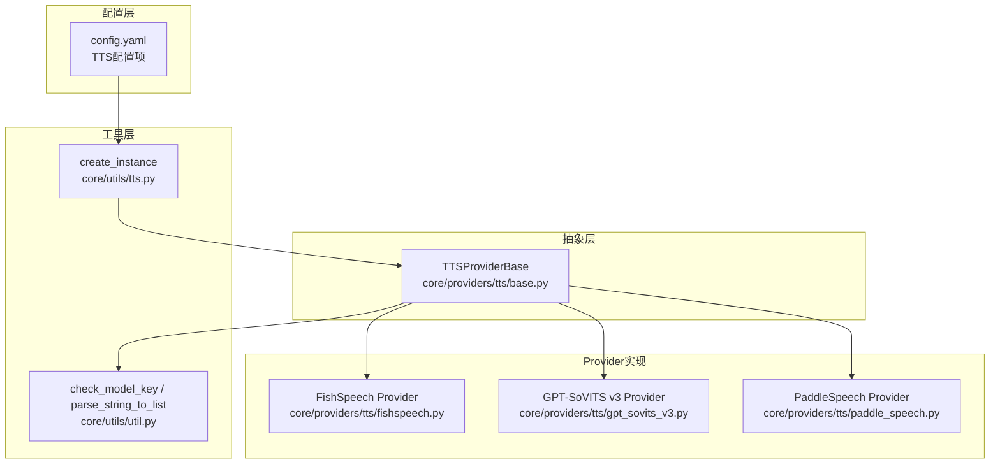
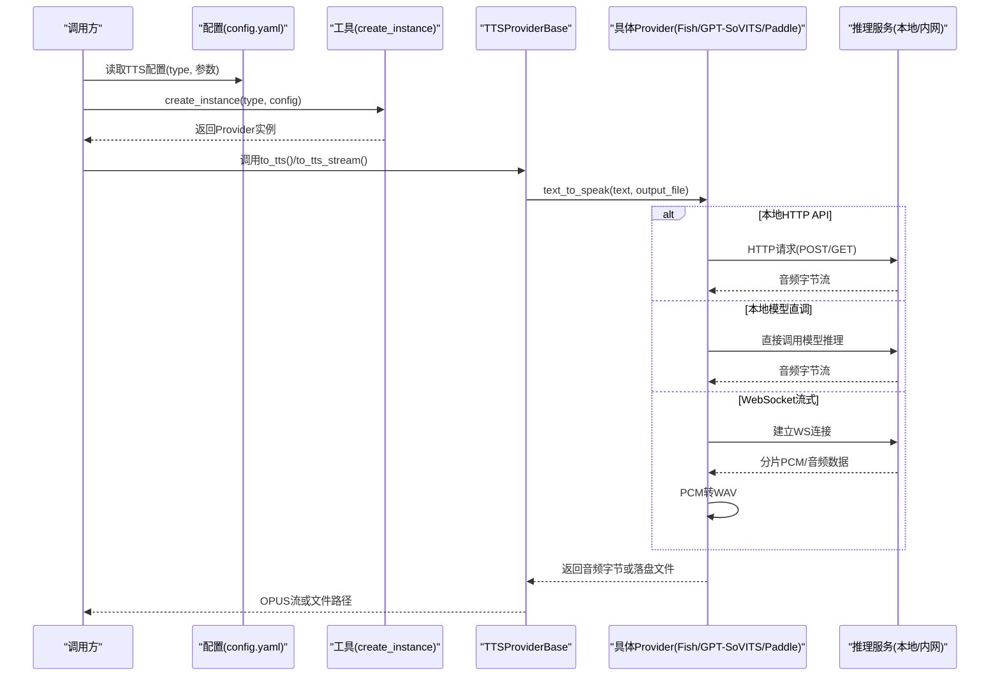
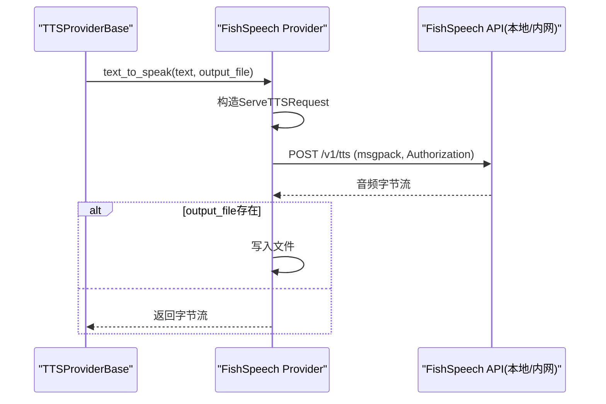
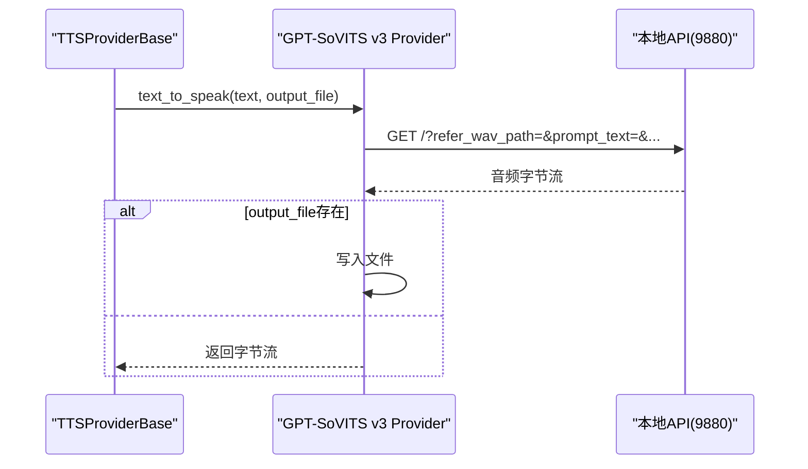
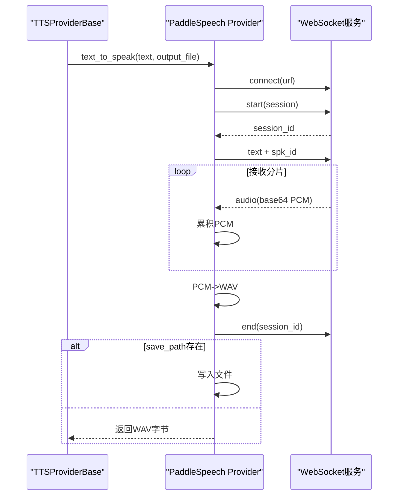
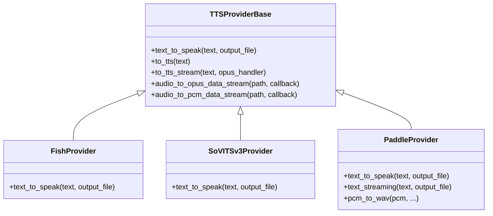
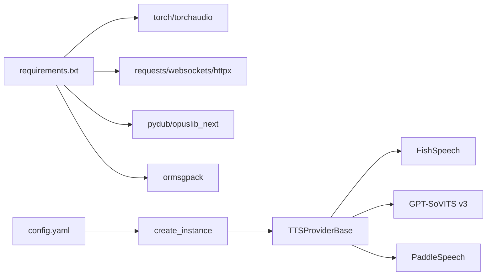

# 本地/开源模型集成

<cite>
**本文引用的文件**
- [config.yaml](file://config.yaml)
- [requirements.txt](file://requirements.txt)
- [core/providers/tts/base.py](file://core/providers/tts/base.py)
- [core/providers/tts/fishspeech.py](file://core/providers/tts/fishspeech.py)
- [core/providers/tts/gpt_sovits_v3.py](file://core/providers/tts/gpt_sovits_v3.py)
- [core/providers/tts/paddle_speech.py](file://core/providers/tts/paddle_speech.py)
- [core/utils/tts.py](file://core/utils/tts.py)
- [core/utils/util.py](file://core/utils/util.py)
- [performance_tester/performance_tester_tts.py](file://performance_tester/performance_tester_tts.py)
</cite>

## 目录
1. [简介](#简介)
2. [项目结构](#项目结构)
3. [核心组件](#核心组件)
4. [架构总览](#架构总览)
5. [详细组件分析](#详细组件分析)
6. [依赖关系分析](#依赖关系分析)
7. [性能考量](#性能考量)
8. [故障排查指南](#故障排查指南)
9. [结论](#结论)
10. [附录](#附录)

## 简介
本文件面向希望在本地或内网部署并集成开源/本地TTS引擎的开发者与运维人员，围绕 Fish Speech、GPT-SoVITS、PaddleSpeech 等本地化语音合成方案，系统梳理其在本项目中的配置方式、推理服务启动与调用路径、音频输出处理、性能与资源消耗对比、以及隐私与离线可用性的优势。文档同时给出配置文件启用本地TTS服务的方法，并说明如何与云端服务无缝切换。

## 项目结构
本项目的TTS能力通过统一的抽象基类与多个具体Provider实现解耦，便于在配置中按需切换。关键目录与文件：
- 配置层：config.yaml 提供TTS模块的类型与参数，支持本地与云端两种模式
- 抽象层：core/providers/tts/base.py 定义统一接口与通用调度逻辑
- Provider层：fishspeech.py、gpt_sovits_v3.py、paddle_speech.py 分别对接本地/内网API或本地模型
- 工具层：core/utils/tts.py 动态实例化Provider；core/utils/util.py 提供通用工具（如模型密钥校验、列表解析等）
- 性能测试：performance_tester/performance_tester_tts.py 提供非流式性能测试脚本

图表来源
- [config.yaml](file://config.yaml#L636-L807)
- [core/providers/tts/base.py](file://core/providers/tts/base.py#L1-L120)
- [core/providers/tts/fishspeech.py](file://core/providers/tts/fishspeech.py#L80-L189)
- [core/providers/tts/gpt_sovits_v3.py](file://core/providers/tts/gpt_sovits_v3.py#L1-L65)
- [core/providers/tts/paddle_speech.py](file://core/providers/tts/paddle_speech.py#L1-L151)
- [core/utils/tts.py](file://core/utils/tts.py#L1-L40)
- [core/utils/util.py](file://core/utils/util.py#L155-L177)

章节来源
- [config.yaml](file://config.yaml#L636-L807)
- [core/providers/tts/base.py](file://core/providers/tts/base.py#L1-L120)
- [core/utils/tts.py](file://core/utils/tts.py#L1-L40)

## 核心组件
- 抽象基类 TTSProviderBase
  - 统一接口：text_to_speak(text, output_file)
  - 通用调度：to_tts()/to_tts_stream() 将文本切分为句子并生成音频，支持OPUS编码与文件落盘
  - 队列与线程：tts_text_priority_thread/_audio_play_priority_thread 实现文本与音频的异步处理
  - 音频处理：audio_to_opus_data_stream/audio_to_pcm_data_stream
- Provider实现
  - FishSpeech：通过HTTP API调用本地/内网TTS服务，支持参考音频与文本、参数化推理
  - GPT-SoVITS v3：通过HTTP GET请求调用本地API，支持参考音频、文本语言、采样步数等参数
  - PaddleSpeech：通过WebSocket流式接收音频，支持PCM转WAV、会话管理与超时控制

章节来源
- [core/providers/tts/base.py](file://core/providers/tts/base.py#L1-L215)
- [core/providers/tts/fishspeech.py](file://core/providers/tts/fishspeech.py#L80-L189)
- [core/providers/tts/gpt_sovits_v3.py](file://core/providers/tts/gpt_sovits_v3.py#L1-L65)
- [core/providers/tts/paddle_speech.py](file://core/providers/tts/paddle_speech.py#L1-L151)

## 架构总览
下图展示了从配置到具体Provider再到推理服务的整体调用链路与数据流。

图表来源
- [config.yaml](file://config.yaml#L636-L807)
- [core/utils/tts.py](file://core/utils/tts.py#L1-L40)
- [core/providers/tts/base.py](file://core/providers/tts/base.py#L120-L215)
- [core/providers/tts/fishspeech.py](file://core/providers/tts/fishspeech.py#L138-L189)
- [core/providers/tts/gpt_sovits_v3.py](file://core/providers/tts/gpt_sovits_v3.py#L37-L65)
- [core/providers/tts/paddle_speech.py](file://core/providers/tts/paddle_speech.py#L75-L151)

## 详细组件分析

### Fish Speech Provider
- 配置要点
  - type: fishspeech
  - 关键参数：reference_id、reference_audio、reference_text、normalize、max_new_tokens、chunk_length、top_p、repetition_penalty、temperature、streaming、use_memory_cache、seed、channels、rate、api_key、api_url
- 加载与推理
  - 通过 ServeReferenceAudio/ServeTTSRequest 校验与序列化请求参数
  - 使用 msgpack 序列化并通过 Authorization Bearer 发送请求
  - 支持参考音频与文本、格式化输出（wav/pcm/mp3）
- 音频输出
  - 成功时写入文件或返回字节流
- 适用场景
  - 需要参考音频/文本进行风格迁移与个性化
  - 本地/内网部署，适合隐私敏感场景

图表来源
- [core/providers/tts/fishspeech.py](file://core/providers/tts/fishspeech.py#L37-L189)

章节来源
- [core/providers/tts/fishspeech.py](file://core/providers/tts/fishspeech.py#L80-L189)
- [config.yaml](file://config.yaml#L707-L728)

### GPT-SoVITS v3 Provider
- 配置要点
  - type: gpt_sovits_v3
  - 关键参数：url、refer_wav_path、prompt_text、prompt_language、text_language、top_k、top_p、temperature、cut_punc、speed、inp_refs、sample_steps、if_sr、format
- 加载与推理
  - 通过 GET 请求携带参考音频与文本语言等参数
  - 返回音频字节流或写入文件
- 适用场景
  - 本地部署，支持参考音频风格迁移
  - 适合中文口语风格定制

图表来源
- [core/providers/tts/gpt_sovits_v3.py](file://core/providers/tts/gpt_sovits_v3.py#L1-L65)

章节来源
- [core/providers/tts/gpt_sovits_v3.py](file://core/providers/tts/gpt_sovits_v3.py#L1-L65)
- [config.yaml](file://config.yaml#L754-L772)

### PaddleSpeech Provider
- 配置要点
  - type: paddle_speech
  - 关键参数：url、protocol、spk_id/private_voice、sample_rate、speed、volume、delete_audio、save_path
- 加载与推理
  - 通过 WebSocket 与本地/内网服务建立连接，发送开始、文本、结束信号
  - 拼接分片PCM，转换为WAV后返回或保存
- 适用场景
  - 需要流式输出与低延迟的场景
  - 本地部署，适合对实时性要求较高

图表来源
- [core/providers/tts/paddle_speech.py](file://core/providers/tts/paddle_speech.py#L75-L151)

章节来源
- [core/providers/tts/paddle_speech.py](file://core/providers/tts/paddle_speech.py#L1-L151)
- [config.yaml](file://config.yaml#L636-L707)

### 抽象基类与工具
- TTSProviderBase
  - to_tts()/to_tts_stream()：统一文本到音频的处理流程，包含重试、队列与线程、OPUS编码
  - 音频文件处理：audio_to_opus_data_stream/audio_to_pcm_data_stream
- 工具
  - create_instance：动态导入并实例化Provider
  - check_model_key/parse_string_to_list：模型密钥校验与参数解析

图表来源
- [core/providers/tts/base.py](file://core/providers/tts/base.py#L1-L215)
- [core/providers/tts/fishspeech.py](file://core/providers/tts/fishspeech.py#L80-L189)
- [core/providers/tts/gpt_sovits_v3.py](file://core/providers/tts/gpt_sovits_v3.py#L1-L65)
- [core/providers/tts/paddle_speech.py](file://core/providers/tts/paddle_speech.py#L1-L151)

章节来源
- [core/providers/tts/base.py](file://core/providers/tts/base.py#L1-L215)
- [core/utils/tts.py](file://core/utils/tts.py#L1-L40)
- [core/utils/util.py](file://core/utils/util.py#L155-L177)

## 依赖关系分析
- 运行时依赖
  - Python版本与关键库：torch、torchaudio、numpy、websockets、requests、ormsgpack、opuslib_next、pydub、aiohttp、aiohttp_cors、httpx、loguru、ruamel.yaml、silero_vad、sherpa_onnx、vosk、dashscope、baidu-aip、PyJWT、psutil、Jinja2、PySocks、mcp、cnlunar、bs4、mem0ai、modelscope、edge_tts、aioconsole、markitdown、mcp-proxy、aiofilesiles 等
- Provider与外部服务
  - FishSpeech：HTTP API（msgpack），支持Authorization
  - GPT-SoVITS v3：HTTP GET API
  - PaddleSpeech：WebSocket流式API
- 配置与实例化
  - config.yaml 中 TTS 段落定义 type 与参数，core/utils/tts.py 动态创建 Provider 实例

图表来源
- [requirements.txt](file://requirements.txt#L1-L42)
- [config.yaml](file://config.yaml#L636-L807)
- [core/utils/tts.py](file://core/utils/tts.py#L1-L40)

章节来源
- [requirements.txt](file://requirements.txt#L1-L42)
- [config.yaml](file://config.yaml#L636-L807)
- [core/utils/tts.py](file://core/utils/tts.py#L1-L40)

## 性能考量
- 非流式性能测试
  - performance_tester/performance_tester_tts.py 提供统一的非流式测试框架，遍历 config.yaml 中 TTS 配置，依次发起连接与若干条文本的合成，统计平均耗时并排序
  - 测试说明：超时控制、错误类型默认为网络错误、按平均耗时升序排序
- 影响因素
  - 网络延迟与带宽（HTTP/WS）
  - 模型推理复杂度与硬件（CPU/GPU）
  - 参考音频长度与风格一致性（Fish/GPT-SoVITS）
  - 采样步数、温度、top-k/top-p等采样参数
  - 输出格式与编码（WAV/PCM/OPUS）

章节来源
- [performance_tester/performance_tester_tts.py](file://performance_tester/performance_tester_tts.py#L1-L184)
- [config.yaml](file://config.yaml#L636-L807)

## 故障排查指南
- 常见问题定位
  - 模型密钥未配置：check_model_key 会在密钥包含特定占位符时记录错误
  - 参数解析：parse_string_to_list 支持分号分隔的字符串转列表
  - HTTP/WS请求失败：Provider侧会记录状态码与响应文本
  - WebSocket超时：PaddleSpeech在接收音频时设置了超时时间
- 建议排查步骤
  - 确认 config.yaml 中 TTS.type 与参数正确
  - 确认本地/内网服务可达且端口开放
  - 检查网络与代理设置
  - 查看日志输出，定位错误类型（网络/超时/服务端错误）

章节来源
- [core/utils/util.py](file://core/utils/util.py#L155-L177)
- [core/providers/tts/fishspeech.py](file://core/providers/tts/fishspeech.py#L138-L189)
- [core/providers/tts/gpt_sovits_v3.py](file://core/providers/tts/gpt_sovits_v3.py#L37-L65)
- [core/providers/tts/paddle_speech.py](file://core/providers/tts/paddle_speech.py#L100-L151)

## 结论
- 本地/开源TTS在本项目中通过统一抽象与动态实例化实现灵活切换，既可对接本地API（FishSpeech、GPT-SoVITS v3），也可通过WebSocket流式对接本地服务（PaddleSpeech）
- 配置层集中管理，便于快速启用/禁用与参数调整
- 性能测试工具提供非流式基准评估，便于对比不同Provider的吞吐与延迟
- 隐私与离线：本地部署显著降低数据外泄风险，适合对隐私敏感与离线可用性要求高的场景

## 附录

### 配置文件启用本地TTS服务
- 在 config.yaml 中 TTS 段落设置 type 与参数
  - FishSpeech：type: fishspeech，配置 api_key、api_url、reference_*、normalize、max_new_tokens、chunk_length、top_p、repetition_penalty、temperature、streaming、use_memory_cache、seed、channels、rate 等
  - GPT-SoVITS v3：type: gpt_sovits_v3，配置 url、refer_wav_path、prompt_text、prompt_language、text_language、top_k、top_p、temperature、cut_punc、speed、inp_refs、sample_steps、if_sr、format 等
  - PaddleSpeech：type: paddle_speech，配置 url、protocol、spk_id/private_voice、sample_rate、speed、volume、delete_audio、save_path 等
- 启动流程
  - 通过 core/utils/tts.py 的 create_instance 动态实例化 Provider
  - 调用 TTSProviderBase.to_tts()/to_tts_stream() 完成文本到音频的生成与传输

章节来源
- [config.yaml](file://config.yaml#L636-L807)
- [core/utils/tts.py](file://core/utils/tts.py#L1-L40)
- [core/providers/tts/base.py](file://core/providers/tts/base.py#L120-L215)

### 与云端服务无缝切换
- 通过修改 config.yaml 中 TTS.type 与参数即可切换至云端Provider（如 DoubaoTTS、EdgeTTS 等），无需更改上层调用逻辑
- 云端Provider同样继承 TTSProviderBase，保持一致的 text_to_speak 接口

章节来源
- [config.yaml](file://config.yaml#L636-L707)

### 模型下载、环境依赖与性能调优
- 环境依赖
  - 依据 requirements.txt 安装依赖，注意 torch/torchaudio 版本与 websockets 版本兼容
- 模型与服务
  - FishSpeech：准备本地/内网API服务，配置 api_key 与 api_url
  - GPT-SoVITS v3：准备本地API服务（端口9880），配置 refer_wav_path、prompt_*、text_language 等
  - PaddleSpeech：准备本地/内网WebSocket服务，配置 url、protocol、spk_id/private_voice 等
- 性能调优建议
  - 降低采样步数、top_k/top_p、temperature 等参数可提升速度但可能影响自然度
  - 合理设置 chunk_length（Fish）、batch_*（SoVITS v2）、streaming（Fish）以平衡延迟与稳定性
  - 使用OPUS编码传输可降低带宽占用
  - 本地部署时确保硬件资源充足（CPU/GPU/内存/磁盘I/O）

章节来源
- [requirements.txt](file://requirements.txt#L1-L42)
- [config.yaml](file://config.yaml#L707-L772)
- [core/providers/tts/fishspeech.py](file://core/providers/tts/fishspeech.py#L80-L189)
- [core/providers/tts/gpt_sovits_v3.py](file://core/providers/tts/gpt_sovits_v3.py#L1-L65)
- [core/providers/tts/paddle_speech.py](file://core/providers/tts/paddle_speech.py#L1-L151)

### 隐私保护与离线可用性
- 本地部署显著降低数据外泄风险，适合对隐私敏感的应用
- 离线可用：本地模型与API无需持续联网，适合无网络或弱网络环境
- 与云端切换：通过配置文件即可快速切换，兼顾灵活性与安全性

[本节为概念性总结，无需列出章节来源]