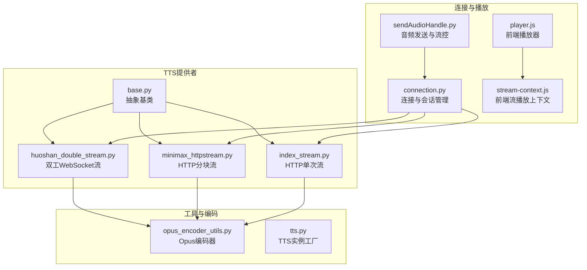
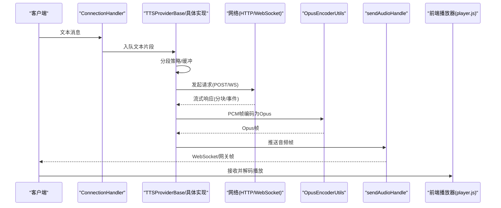
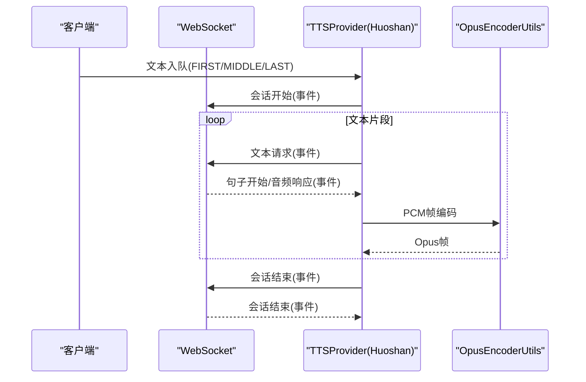
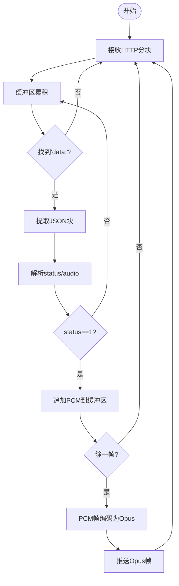
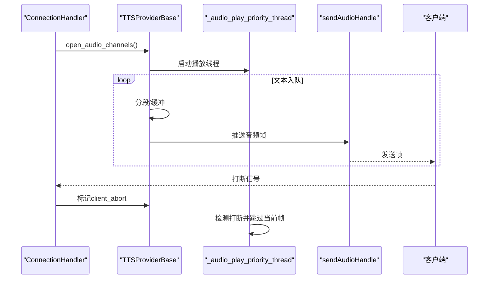
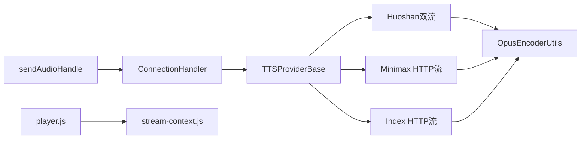

# HTTP流式语音合成

<cite>
**本文引用的文件**
- [huoshan_double_stream.py](file://core/providers/tts/huoshan_double_stream.py)
- [minimax_httpstream.py](file://core/providers/tts/minimax_httpstream.py)
- [index_stream.py](file://core/providers/tts/index_stream.py)
- [opus_encoder_utils.py](file://core/utils/opus_encoder_utils.py)
- [connection.py](file://core/connection.py)
- [base.py](file://core/providers/tts/base.py)
- [tts.py](file://core/utils/tts.py)
- [sendAudioHandle.py](file://core/handle/sendAudioHandle.py)
- [player.js](file://test/js/core/audio/player.js)
- [stream-context.js](file://test/js/core/audio/stream-context.js)
</cite>

## 目录
1. [简介](#简介)
2. [项目结构](#项目结构)
3. [核心组件](#核心组件)
4. [架构总览](#架构总览)
5. [详细组件分析](#详细组件分析)
6. [依赖关系分析](#依赖关系分析)
7. [性能考量](#性能考量)
8. [故障排查指南](#故障排查指南)
9. [结论](#结论)
10. [附录](#附录)

## 简介
本文件面向HTTP流式语音合成（TTS）系统，围绕三种主流实现路径展开：
- 基于WebSocket的双工流（火山引擎双流）
- 基于HTTP分块传输编码（chunked transfer encoding）的流式TTS（Minimax HTTP流）
- 基于HTTP单次请求的流式TTS（Index HTTP流）

文档重点覆盖：
- 请求参数构造（语音角色、语速、音调等）
- 响应解析与事件驱动的流式处理
- 分块传输编码下的实时音频拼接与Opus压缩
- 流式缓冲策略与延迟优化
- 客户端渐进式播放与语音打断
- HTTP流控、超时与错误恢复最佳实践

## 项目结构
本项目采用“按领域/能力分层”的组织方式，TTS相关代码集中在core/providers/tts目录，音频编码与播放控制位于core/utils与test/js中。

图表来源
- [huoshan_double_stream.py](file://core/providers/tts/huoshan_double_stream.py#L1-L120)
- [minimax_httpstream.py](file://core/providers/tts/minimax_httpstream.py#L1-L120)
- [index_stream.py](file://core/providers/tts/index_stream.py#L1-L120)
- [opus_encoder_utils.py](file://core/utils/opus_encoder_utils.py#L1-L80)
- [connection.py](file://core/connection.py#L1-L120)
- [base.py](file://core/providers/tts/base.py#L1-L120)
- [tts.py](file://core/utils/tts.py#L1-L60)
- [sendAudioHandle.py](file://core/handle/sendAudioHandle.py#L140-L174)
- [player.js](file://test/js/core/audio/player.js#L1-L120)
- [stream-context.js](file://test/js/core/audio/stream-context.js#L1-L80)

章节来源
- [huoshan_double_stream.py](file://core/providers/tts/huoshan_double_stream.py#L1-L120)
- [minimax_httpstream.py](file://core/providers/tts/minimax_httpstream.py#L1-L120)
- [index_stream.py](file://core/providers/tts/index_stream.py#L1-L120)
- [opus_encoder_utils.py](file://core/utils/opus_encoder_utils.py#L1-L80)
- [connection.py](file://core/connection.py#L1-L120)
- [base.py](file://core/providers/tts/base.py#L1-L120)
- [tts.py](file://core/utils/tts.py#L1-L60)
- [sendAudioHandle.py](file://core/handle/sendAudioHandle.py#L140-L174)
- [player.js](file://test/js/core/audio/player.js#L1-L120)
- [stream-context.js](file://test/js/core/audio/stream-context.js#L1-L80)

## 核心组件
- TTSProviderBase：抽象基类，定义文本入队、音频出队、分段策略、播放线程、打断处理等通用流程。
- OpusEncoderUtils：将PCM帧实时编码为Opus帧，支持流式拼接与尾帧补齐。
- ConnectionHandler：连接生命周期管理、会话ID、文本消息路由、音频播放线程与上报。
- 具体TTS提供者：
  - 火山引擎双流：WebSocket双工协议，事件驱动，支持会话开始/结束与句子级事件。
  - Minimax HTTP流：HTTP POST + 分块传输编码，逐块解析SSE风格数据块，实时拼接PCM并编码。
  - Index HTTP流：HTTP POST + 流式响应，按固定帧大小切分PCM并编码。

章节来源
- [base.py](file://core/providers/tts/base.py#L1-L120)
- [opus_encoder_utils.py](file://core/utils/opus_encoder_utils.py#L1-L120)
- [connection.py](file://core/connection.py#L1-L120)
- [huoshan_double_stream.py](file://core/providers/tts/huoshan_double_stream.py#L1-L120)
- [minimax_httpstream.py](file://core/providers/tts/minimax_httpstream.py#L1-L120)
- [index_stream.py](file://core/providers/tts/index_stream.py#L1-L120)

## 架构总览
整体架构由“连接层—TTS提供者—编码器—播放层”构成，支持多路并发与渐进式播放。

图表来源
- [connection.py](file://core/connection.py#L720-L820)
- [base.py](file://core/providers/tts/base.py#L260-L360)
- [minimax_httpstream.py](file://core/providers/tts/minimax_httpstream.py#L150-L240)
- [index_stream.py](file://core/providers/tts/index_stream.py#L117-L175)
- [opus_encoder_utils.py](file://core/utils/opus_encoder_utils.py#L57-L110)
- [sendAudioHandle.py](file://core/handle/sendAudioHandle.py#L141-L174)
- [player.js](file://test/js/core/audio/player.js#L150-L225)

## 详细组件分析

### 火山引擎双工HTTP流（WebSocket）
- 双工协议与事件驱动
  - 通过WebSocket建立长连接，发送“会话开始/文本请求/会话结束”等事件，下行事件包括“句子开始/句子结束/音频响应”等。
  - 会话ID贯穿整个对话，确保跨事件的有序性与资源释放。
- 请求参数构造
  - 语音角色、语速、音量、音调等参数封装在payload中，随事件发送。
- 响应解析
  - 自定义二进制头+可选字段+负载的组合，解析消息头、事件类型、可选字段（如sessionId、connectionId）与负载。
- 实时音频处理
  - 下行音频为PCM原始数据，经OpusEncoderUtils按帧编码为Opus帧，再推送到播放队列。
- 语音打断
  - 当检测到客户端打断信号时，主动发送“取消会话”事件，清理会话状态并停止后续处理。

图表来源
- [huoshan_double_stream.py](file://core/providers/tts/huoshan_double_stream.py#L322-L382)
- [huoshan_double_stream.py](file://core/providers/tts/huoshan_double_stream.py#L484-L515)
- [huoshan_double_stream.py](file://core/providers/tts/huoshan_double_stream.py#L532-L583)
- [opus_encoder_utils.py](file://core/utils/opus_encoder_utils.py#L57-L110)

章节来源
- [huoshan_double_stream.py](file://core/providers/tts/huoshan_double_stream.py#L1-L120)
- [huoshan_double_stream.py](file://core/providers/tts/huoshan_double_stream.py#L322-L382)
- [huoshan_double_stream.py](file://core/providers/tts/huoshan_double_stream.py#L484-L515)
- [huoshan_double_stream.py](file://core/providers/tts/huoshan_double_stream.py#L532-L583)

### Minimax HTTP流（分块传输编码）
- 分块传输编码与SSE风格解析
  - 服务端以“data: JSON块\n\n”的形式推送音频分块，客户端维护缓冲区，定位“data: ”与“\n\n”边界，提取JSON并解析status与audio字段。
- 实时音频拼接与编码
  - 将hex音频数据还原为PCM，累积到PCM缓冲区，按帧大小切分并编码为Opus帧，边解码边播放。
- 请求参数与流控
  - 通过payload携带语音角色、语速、音量、音调、情感等参数；设置合理超时与重试策略。

图表来源
- [minimax_httpstream.py](file://core/providers/tts/minimax_httpstream.py#L192-L241)
- [minimax_httpstream.py](file://core/providers/tts/minimax_httpstream.py#L241-L251)
- [opus_encoder_utils.py](file://core/utils/opus_encoder_utils.py#L57-L110)

章节来源
- [minimax_httpstream.py](file://core/providers/tts/minimax_httpstream.py#L1-L120)
- [minimax_httpstream.py](file://core/providers/tts/minimax_httpstream.py#L151-L241)
- [minimax_httpstream.py](file://core/providers/tts/minimax_httpstream.py#L241-L251)

### Index HTTP流（单次请求流式）
- 单次HTTP POST，服务端以流式响应返回PCM数据
- 客户端按固定帧大小切分PCM并编码为Opus帧，边解码边播放
- 适用于简单场景或特定第三方接口

章节来源
- [index_stream.py](file://core/providers/tts/index_stream.py#L1-L120)
- [index_stream.py](file://core/providers/tts/index_stream.py#L117-L175)

### OpusEncoderUtils（服务端响应前的实时压缩）
- 帧大小计算：采样率×通道数×帧大小(ms)/1000×2字节（16位PCM）
- 流式编码：将新PCM样本追加到缓冲区，按完整帧编码，剩余样本保留至下一帧
- 尾帧处理：结束时用零填充最后一帧并编码
- 参数配置：比特率、复杂度、信号类型（语音优化）

章节来源
- [opus_encoder_utils.py](file://core/utils/opus_encoder_utils.py#L1-L132)

### 连接与播放（客户端侧）
- 连接生命周期
  - 初始化组件、打开ASR/TTS通道、异步启动播放线程
  - 路由文本消息，构建会话ID，触发TTS文本入队
- 播放线程
  - 从音频队列取出帧，按句首/中间/句尾发送，支持上报与输出计数
- 流控与预缓冲
  - 发送时维护包计数、序列号与最后发送时间；对文件型音频进行预缓冲
- 语音打断
  - 播放线程检测打断信号，丢弃当前音频数据并清空上报队列

图表来源
- [connection.py](file://core/connection.py#L420-L430)
- [base.py](file://core/providers/tts/base.py#L318-L365)
- [base.py](file://core/providers/tts/base.py#L366-L462)
- [sendAudioHandle.py](file://core/handle/sendAudioHandle.py#L141-L174)

章节来源
- [connection.py](file://core/connection.py#L1-L120)
- [connection.py](file://core/connection.py#L420-L430)
- [base.py](file://core/providers/tts/base.py#L318-L365)
- [base.py](file://core/providers/tts/base.py#L366-L462)
- [sendAudioHandle.py](file://core/handle/sendAudioHandle.py#L141-L174)

## 依赖关系分析
- TTSProviderBase为所有具体实现提供统一接口与通用逻辑（文本分段、播放线程、打断处理）
- 具体TTS提供者依赖OpusEncoderUtils进行实时压缩
- ConnectionHandler负责连接生命周期与播放线程调度
- sendAudioHandle负责发送与流控，player.js与stream-context.js负责前端播放

图表来源
- [base.py](file://core/providers/tts/base.py#L1-L120)
- [opus_encoder_utils.py](file://core/utils/opus_encoder_utils.py#L1-L80)
- [connection.py](file://core/connection.py#L1-L120)
- [sendAudioHandle.py](file://core/handle/sendAudioHandle.py#L141-L174)
- [player.js](file://test/js/core/audio/player.js#L1-L120)
- [stream-context.js](file://test/js/core/audio/stream-context.js#L1-L80)

章节来源
- [base.py](file://core/providers/tts/base.py#L1-L120)
- [opus_encoder_utils.py](file://core/utils/opus_encoder_utils.py#L1-L80)
- [connection.py](file://core/connection.py#L1-L120)
- [sendAudioHandle.py](file://core/handle/sendAudioHandle.py#L141-L174)
- [player.js](file://test/js/core/audio/player.js#L1-L120)
- [stream-context.js](file://test/js/core/audio/stream-context.js#L1-L80)

## 性能考量
- 帧大小与缓冲
  - 依据采样率、通道数与帧大小(ms)计算每帧字节数，避免频繁分配与拷贝
  - 使用缓冲区累积PCM，减少编码次数
- 编码器参数
  - 合理设置比特率与复杂度，平衡质量与CPU占用
- 流控与预缓冲
  - 发送端维护包计数与序列号，避免拥塞；对文件型音频进行预缓冲提升首包体验
- 超时与重试
  - HTTP请求设置合理超时；对可重试错误进行有限重试
- 前端播放
  - 前端采用阻塞队列与最小播放时长，保证连续播放与低延迟

章节来源
- [minimax_httpstream.py](file://core/providers/tts/minimax_httpstream.py#L166-L173)
- [index_stream.py](file://core/providers/tts/index_stream.py#L117-L175)
- [opus_encoder_utils.py](file://core/utils/opus_encoder_utils.py#L16-L40)
- [sendAudioHandle.py](file://core/handle/sendAudioHandle.py#L141-L174)
- [player.js](file://test/js/core/audio/player.js#L150-L225)

## 故障排查指南
- WebSocket连接异常
  - 检查连接头与鉴权信息；关注连接/会话事件的元数据与错误码
  - 出现连接关闭时，清理监听任务与连接引用
- HTTP分块解析失败
  - 确认服务端分块格式为“data: JSON\n\n”，客户端缓冲区边界查找逻辑
  - 对status!=1的汇总块进行过滤，仅处理有效音频块
- 编码异常
  - 校验PCM样本范围与字节对齐；尾帧用零填充
- 播放卡顿
  - 检查预缓冲数量与发送速率；前端队列长度与最小播放时长配置
- 打断无效
  - 确认播放线程检测到打断信号并清空上报队列

章节来源
- [huoshan_double_stream.py](file://core/providers/tts/huoshan_double_stream.py#L464-L483)
- [minimax_httpstream.py](file://core/providers/tts/minimax_httpstream.py#L192-L241)
- [opus_encoder_utils.py](file://core/utils/opus_encoder_utils.py#L120-L132)
- [base.py](file://core/providers/tts/base.py#L334-L365)
- [player.js](file://test/js/core/audio/player.js#L150-L225)

## 结论
本系统通过统一的TTSProviderBase抽象，结合OpusEncoderUtils的实时压缩能力，分别实现了WebSocket双工流与HTTP分块流两种主流的流式TTS方案。配合ConnectionHandler的播放线程与sendAudioHandle的流控策略，以及前端player.js与stream-context.js的渐进式播放，形成了低延迟、可打断、可恢复的完整链路。建议在生产环境中根据服务端能力选择合适方案，并针对帧大小、超时与流控参数进行调优。

## 附录
- 关键实现路径参考
  - 火山引擎双流事件解析与音频处理：[huoshan_double_stream.py](file://core/providers/tts/huoshan_double_stream.py#L532-L583)
  - Minimax分块解析与PCM拼接：[minimax_httpstream.py](file://core/providers/tts/minimax_httpstream.py#L192-L241)
  - Index单次流式响应处理：[index_stream.py](file://core/providers/tts/index_stream.py#L117-L175)
  - Opus实时编码与尾帧处理：[opus_encoder_utils.py](file://core/utils/opus_encoder_utils.py#L57-L110)
  - 连接与播放线程、打断处理：[connection.py](file://core/connection.py#L420-L430), [base.py](file://core/providers/tts/base.py#L318-L365)
  - 发送与流控：[sendAudioHandle.py](file://core/handle/sendAudioHandle.py#L141-L174)
  - 前端播放器与流上下文：[player.js](file://test/js/core/audio/player.js#L150-L225), [stream-context.js](file://test/js/core/audio/stream-context.js#L121-L157)