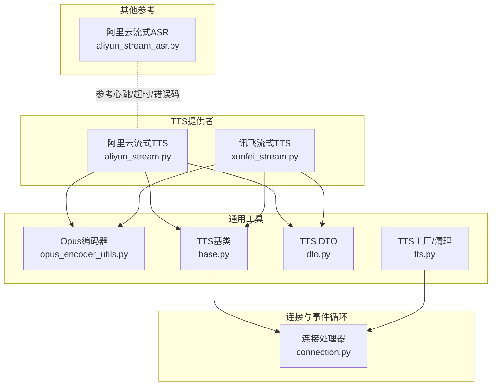
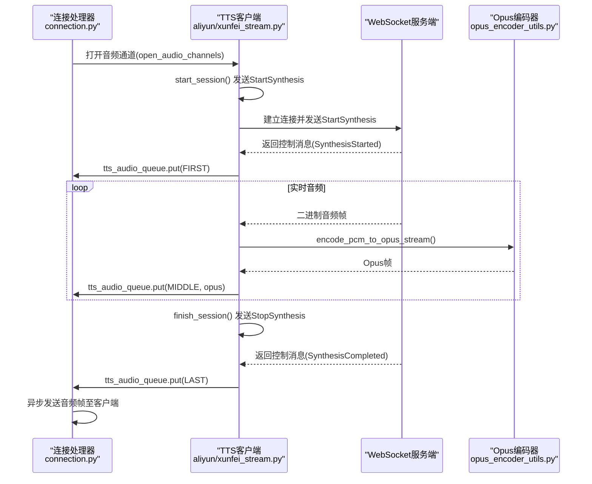
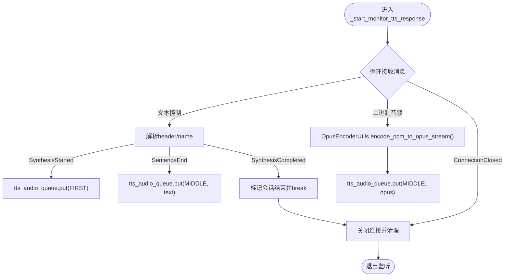
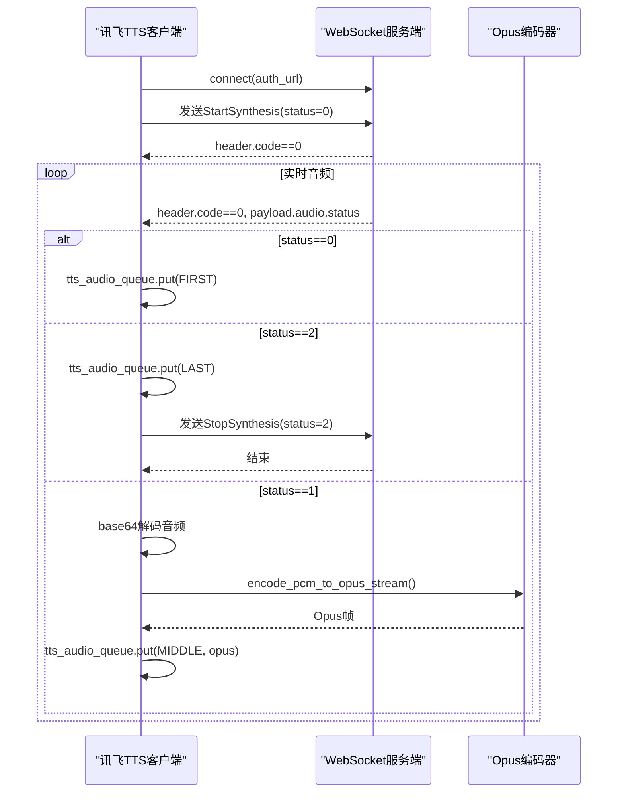
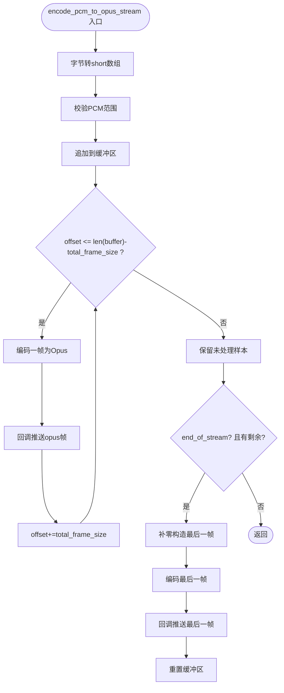
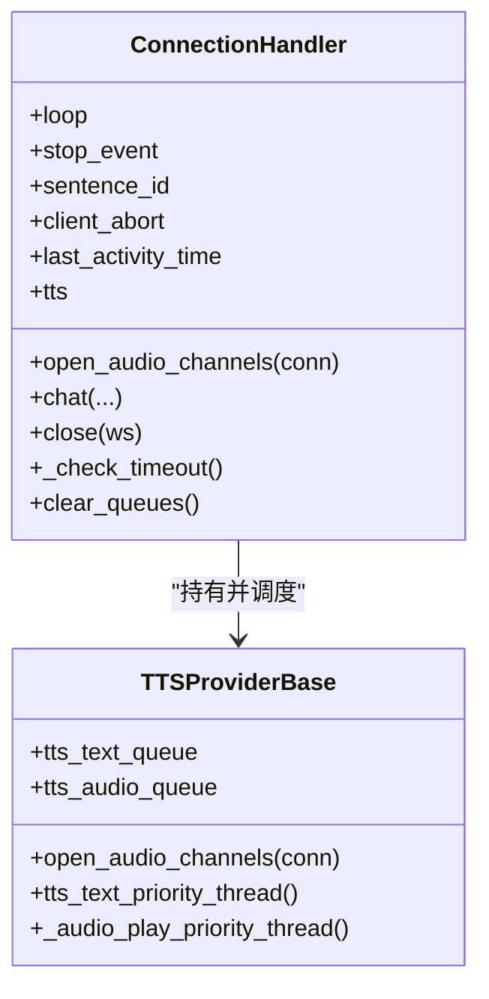
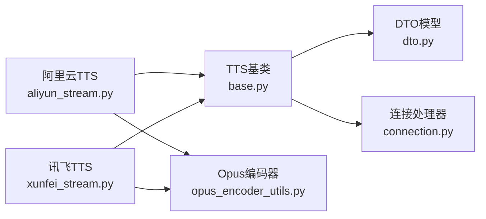

# WebSocket流式语音合成

<cite>
**本文引用的文件**
- [aliyun_stream.py](file://core/providers/tts/aliyun_stream.py)
- [xunfei_stream.py](file://core/providers/tts/xunfei_stream.py)
- [opus_encoder_utils.py](file://core/utils/opus_encoder_utils.py)
- [connection.py](file://core/connection.py)
- [base.py](file://core/providers/tts/base.py)
- [dto.py](file://core/providers/tts/dto/dto.py)
- [tts.py](file://core/utils/tts.py)
- [aliyun_stream_asr.py](file://core/providers/asr/aliyun_stream.py)
</cite>

## 目录
1. [简介](#简介)
2. [项目结构](#项目结构)
3. [核心组件](#核心组件)
4. [架构总览](#架构总览)
5. [详细组件分析](#详细组件分析)
6. [依赖关系分析](#依赖关系分析)
7. [性能考量](#性能考量)
8. [故障排查指南](#故障排查指南)
9. [结论](#结论)
10. [附录](#附录)

## 简介
本文件面向WebSocket流式语音合成场景，聚焦于基于长连接的实时TTS实现机制。文档围绕阿里云与讯飞两家供应商的WebSocket客户端实现，系统性解析以下主题：
- 异步连接管理（_ensure_connection）
- 会话状态维护（start_session/finish_session）
- 心跳保活机制
- 音频流分帧编码（OpusEncoderUtils将PCM分块编码为Opus并实时推送至tts_audio_queue）
- 事件循环与异步任务调度（connection.py中的_event_loop与异步任务）
- 连接异常处理策略（自动重连、错误码映射、超时控制）
- 高并发场景下的连接池优化建议

## 项目结构
本项目采用“按领域/能力分层”的组织方式，TTS相关实现集中在core/providers/tts目录，音频编码工具位于core/utils，连接与事件循环在core/connection.py中。

图表来源
- [aliyun_stream.py](file://core/providers/tts/aliyun_stream.py#L1-L607)
- [xunfei_stream.py](file://core/providers/tts/xunfei_stream.py#L1-L528)
- [opus_encoder_utils.py](file://core/utils/opus_encoder_utils.py#L1-L132)
- [base.py](file://core/providers/tts/base.py#L1-L462)
- [dto.py](file://core/providers/tts/dto/dto.py#L1-L44)
- [tts.py](file://core/utils/tts.py#L1-L138)
- [aliyun_stream_asr.py](file://core/providers/asr/aliyun_stream.py#L1-L351)

章节来源
- [aliyun_stream.py](file://core/providers/tts/aliyun_stream.py#L1-L607)
- [xunfei_stream.py](file://core/providers/tts/xunfei_stream.py#L1-L528)
- [opus_encoder_utils.py](file://core/utils/opus_encoder_utils.py#L1-L132)
- [connection.py](file://core/connection.py#L1-L1151)
- [base.py](file://core/providers/tts/base.py#L1-L462)
- [dto.py](file://core/providers/tts/dto/dto.py#L1-L44)
- [tts.py](file://core/utils/tts.py#L1-L138)
- [aliyun_stream_asr.py](file://core/providers/asr/aliyun_stream.py#L1-L351)

## 核心组件
- 阿里云流式TTS客户端：负责Token刷新、WebSocket连接、会话生命周期管理、监听响应并编码推送音频。
- 讯飞流式TTS客户端：负责生成鉴权URL、WebSocket连接、会话生命周期管理、监听响应并编码推送音频。
- Opus编码器：将PCM分帧编码为Opus，按帧回调推送至TTS音频队列。
- 连接处理器：管理事件循环、会话ID、超时、打断、队列清理与资源回收。
- TTS基类与DTO：抽象TTS行为、消息模型与接口类型，支撑多供应商实现。

章节来源
- [aliyun_stream.py](file://core/providers/tts/aliyun_stream.py#L1-L607)
- [xunfei_stream.py](file://core/providers/tts/xunfei_stream.py#L1-L528)
- [opus_encoder_utils.py](file://core/utils/opus_encoder_utils.py#L1-L132)
- [connection.py](file://core/connection.py#L1-L1151)
- [base.py](file://core/providers/tts/base.py#L1-L462)
- [dto.py](file://core/providers/tts/dto/dto.py#L1-L44)

## 架构总览
WebSocket流式TTS的关键流程如下：
- 连接建立：TTS客户端通过_token刷新或鉴权URL建立wss/ws连接，并设置ping_interval/ping_timeout/close_timeout。
- 会话管理：start_session发送StartSynthesis请求，finish_session发送StopSynthesis请求；监听任务持续接收服务端消息。
- 响应处理：文本控制消息触发首句/中间句/结束事件；二进制音频数据经OpusEncoderUtils分帧编码后推送到tts_audio_queue。
- 事件循环：连接处理器在_event_loop中消费音频队列，异步发送至客户端。
- 异常处理：连接关闭、错误码映射、超时关闭、打断标记等。

图表来源
- [aliyun_stream.py](file://core/providers/tts/aliyun_stream.py#L315-L391)
- [xunfei_stream.py](file://core/providers/tts/xunfei_stream.py#L256-L306)
- [opus_encoder_utils.py](file://core/utils/opus_encoder_utils.py#L57-L101)
- [connection.py](file://core/connection.py#L352-L360)

## 详细组件分析

### 阿里云流式TTS客户端（aliyun_stream.py）
- 异步连接管理（_ensure_connection）
  - Token过期检测与刷新
  - 连接复用策略（10秒内复用）
  - 建立wss连接并设置心跳参数
- 会话状态维护（start_session/finish_session）
  - start_session：发送StartSynthesis，启动监听任务
  - finish_session：发送StopSynthesis，等待监听任务完成
- 响应监听（_start_monitor_tts_response）
  - 文本控制消息：SynthesisStarted/SentenceEnd/SynthesisCompleted
  - 二进制音频：分帧编码并推送
- 文本合成（text_to_speak）
  - 发送RunSynthesis请求
- 资源清理（close）

图表来源
- [aliyun_stream.py](file://core/providers/tts/aliyun_stream.py#L413-L473)
- [opus_encoder_utils.py](file://core/utils/opus_encoder_utils.py#L57-L101)

章节来源
- [aliyun_stream.py](file://core/providers/tts/aliyun_stream.py#L180-L209)
- [aliyun_stream.py](file://core/providers/tts/aliyun_stream.py#L315-L391)
- [aliyun_stream.py](file://core/providers/tts/aliyun_stream.py#L413-L473)
- [aliyun_stream.py](file://core/providers/tts/aliyun_stream.py#L285-L314)

### 讯飞流式TTS客户端（xunfei_stream.py）
- 异步连接管理（_ensure_connection）
  - 生成Authorization鉴权URL并建立wss连接
- 会话状态维护（start_session/finish_session）
  - start_session：发送会话启动请求，启动监听任务
  - finish_session：发送会话结束请求，等待监听任务完成
- 响应监听（_start_monitor_tts_response）
  - 解析header.code，status=0表示成功
  - status=2表示结束，收到音频数据后解码并编码推送
- 请求构建（_build_base_request）
  - 组装header/parameter/payload，含语音参数与文本序列号

图表来源
- [xunfei_stream.py](file://core/providers/tts/xunfei_stream.py#L125-L146)
- [xunfei_stream.py](file://core/providers/tts/xunfei_stream.py#L256-L306)
- [xunfei_stream.py](file://core/providers/tts/xunfei_stream.py#L327-L405)
- [opus_encoder_utils.py](file://core/utils/opus_encoder_utils.py#L57-L101)

章节来源
- [xunfei_stream.py](file://core/providers/tts/xunfei_stream.py#L125-L146)
- [xunfei_stream.py](file://core/providers/tts/xunfei_stream.py#L256-L306)
- [xunfei_stream.py](file://core/providers/tts/xunfei_stream.py#L327-L405)

### Opus编码器（opus_encoder_utils.py）
- 分帧策略
  - 帧大小由采样率、通道数与帧时长(ms)决定
  - 以完整帧为单位编码，剩余样本在流结束时补齐
- 编码流程
  - 将字节PCM转换为16位短整型数组
  - 校验PCM范围并编码为Opus帧
  - 通过回调将Opus帧推送至TTS音频队列
- 错误处理
  - 编码异常记录日志并返回None

图表来源
- [opus_encoder_utils.py](file://core/utils/opus_encoder_utils.py#L57-L101)

章节来源
- [opus_encoder_utils.py](file://core/utils/opus_encoder_utils.py#L1-L132)

### 连接处理器与事件循环（connection.py）
- 事件循环与任务
  - 保存_event_loop并创建异步任务（如超时检查）
  - 通过run_coroutine_threadsafe在主线程与事件循环之间调度
- 会话与打断
  - 维护sentence_id、client_abort、last_activity_time
  - 超时关闭连接并清理资源
- 队列与播放
  - tts_text_queue与tts_audio_queue分别承载文本与音频
  - _audio_play_priority_thread消费音频队列并异步发送

图表来源
- [connection.py](file://core/connection.py#L55-L165)
- [connection.py](file://core/connection.py#L800-L903)
- [connection.py](file://core/connection.py#L991-L1151)
- [base.py](file://core/providers/tts/base.py#L260-L370)

章节来源
- [connection.py](file://core/connection.py#L55-L165)
- [connection.py](file://core/connection.py#L800-L903)
- [connection.py](file://core/connection.py#L991-L1151)
- [base.py](file://core/providers/tts/base.py#L260-L370)

### TTS基类与DTO（base.py, dto.py）
- 接口类型（InterfaceType）
  - DUAL_STREAM：双流式（文本与音频同时）
- DTO模型
  - SentenceType：FIRST/MIDDLE/LAST
  - ContentType：TEXT/FILE/ACTION
  - TTSMessageDTO：封装会话ID、类型、内容与文件路径
- 基类职责
  - 文本队列与音频队列管理
  - 文本分段与音频播放线程
  - 抽象text_to_speak与start_session/finish_session

章节来源
- [dto.py](file://core/providers/tts/dto/dto.py#L1-L44)
- [base.py](file://core/providers/tts/base.py#L1-L462)

### 阿里云流式ASR（参考实现）
- 心跳与超时
  - ping_interval=None, ping_timeout=None（显式禁用心跳）
  - close_timeout=5（连接关闭超时）
- 错误码映射
  - 状态码40000004/40010004：连接超时或客户端断开
  - 状态码40270002/40270003：音频问题
- 会话清理
  - 发送StopTranscription并关闭连接

章节来源
- [aliyun_stream_asr.py](file://core/providers/asr/aliyun_stream.py#L160-L173)
- [aliyun_stream_asr.py](file://core/providers/asr/aliyun_stream.py#L210-L230)
- [aliyun_stream_asr.py](file://core/providers/asr/aliyun_stream.py#L282-L341)

## 依赖关系分析
- TTS客户端依赖
  - OpusEncoderUtils：音频分帧编码
  - TTSProviderBase：队列、线程与会话抽象
  - DTO：消息模型
- 连接处理器依赖
  - TTSProviderBase：音频通道打开与播放线程
  - WebSockets：事件循环与连接管理
- 错误处理与超时
  - 连接关闭、错误码映射、超时任务、打断标记

图表来源
- [aliyun_stream.py](file://core/providers/tts/aliyun_stream.py#L1-L607)
- [xunfei_stream.py](file://core/providers/tts/xunfei_stream.py#L1-L528)
- [base.py](file://core/providers/tts/base.py#L1-L462)
- [dto.py](file://core/providers/tts/dto/dto.py#L1-L44)
- [opus_encoder_utils.py](file://core/utils/opus_encoder_utils.py#L1-L132)
- [connection.py](file://core/connection.py#L1-L1151)

章节来源
- [aliyun_stream.py](file://core/providers/tts/aliyun_stream.py#L1-L607)
- [xunfei_stream.py](file://core/providers/tts/xunfei_stream.py#L1-L528)
- [base.py](file://core/providers/tts/base.py#L1-L462)
- [dto.py](file://core/providers/tts/dto/dto.py#L1-L44)
- [opus_encoder_utils.py](file://core/utils/opus_encoder_utils.py#L1-L132)
- [connection.py](file://core/connection.py#L1-L1151)

## 性能考量
- 分帧编码
  - 帧时长与采样率决定每帧样本数，影响CPU与延迟
  - 保持缓冲区仅包含未处理样本，减少拷贝
- 队列与线程
  - 文本优先线程与音频播放线程分离，避免阻塞
  - 队列容量与回调频率需平衡内存与吞吐
- 连接复用
  - 阿里云客户端在10秒内复用连接，降低握手开销
- 心跳与超时
  - 显式设置ping_interval/ping_timeout/close_timeout，避免资源泄漏
  - 超时任务定期检查并关闭长时间无活动的连接

章节来源
- [aliyun_stream.py](file://core/providers/tts/aliyun_stream.py#L180-L209)
- [opus_encoder_utils.py](file://core/utils/opus_encoder_utils.py#L16-L31)
- [connection.py](file://core/connection.py#L1122-L1151)

## 故障排查指南
- 连接失败
  - 检查Token/鉴权URL是否有效
  - 查看连接建立日志与异常堆栈
- 会话未结束
  - 确认start_session/finish_session配对调用
  - 监听任务是否被取消或异常退出
- 音频无声
  - 检查Opus编码回调是否被调用
  - 确认tts_audio_queue是否有数据
- 超时关闭
  - 检查last_activity_time更新逻辑与超时阈值
  - 确认_stop_event设置时机
- 错误码映射
  - 讯飞：header.code==0为成功，非0为错误
  - 阿里云：SynthesisCompleted/SynthesisStarted等控制消息
- 自动重连
  - 在连接关闭或异常时重建连接
  - 重试间隔与最大重试次数需配置

章节来源
- [xunfei_stream.py](file://core/providers/tts/xunfei_stream.py#L327-L405)
- [aliyun_stream.py](file://core/providers/tts/aliyun_stream.py#L413-L473)
- [connection.py](file://core/connection.py#L1122-L1151)

## 结论
本项目通过清晰的分层设计与事件驱动架构，实现了基于WebSocket的低延迟流式TTS。阿里云与讯飞客户端均遵循统一的会话生命周期与编码推送机制，配合连接处理器的事件循环与队列调度，满足实时性与可靠性需求。针对高并发场景，建议结合连接复用、心跳保活与超时控制策略进一步优化。

## 附录
- 高并发连接池优化建议
  - 连接池大小与会话并发上限
  - 连接复用窗口（如阿里云的10秒复用）
  - 心跳参数与超时阈值调优
  - 队列背压与批量推送策略
  - 错误码映射与自动重试退避