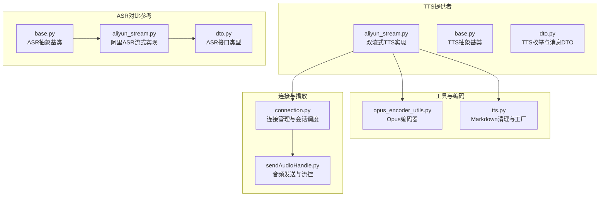
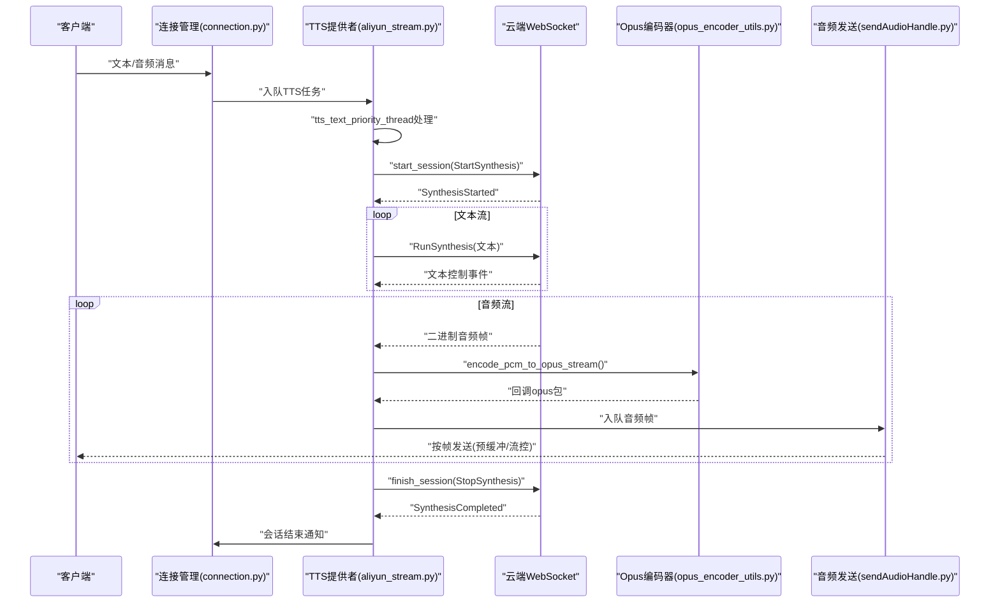
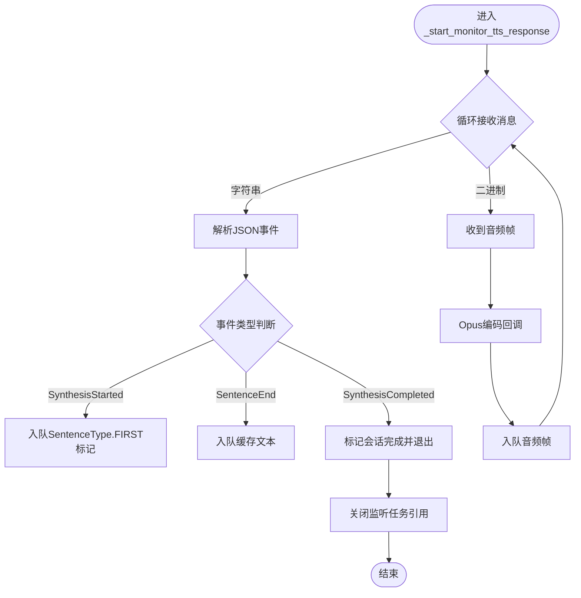
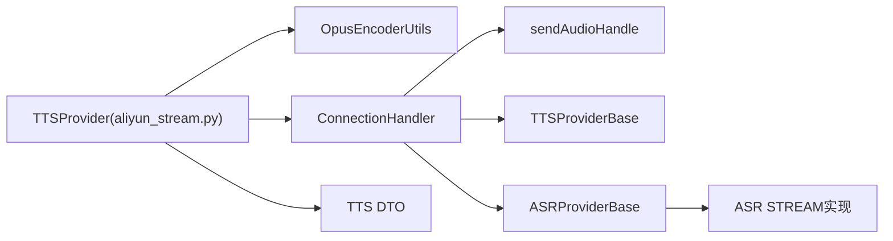

# 流式语音合成

<cite>
**本文引用的文件**
- [aliyun_stream.py](file://core/providers/tts/aliyun_stream.py)
- [base.py](file://core/providers/tts/base.py)
- [dto.py](file://core/providers/tts/dto/dto.py)
- [opus_encoder_utils.py](file://core/utils/opus_encoder_utils.py)
- [connection.py](file://core/connection.py)
- [sendAudioHandle.py](file://core/handle/sendAudioHandle.py)
- [tts.py](file://core/utils/tts.py)
- [base.py](file://core/providers/asr/base.py)
- [aliyun_stream.py](file://core/providers/asr/aliyun_stream.py)
- [dto.py](file://core/providers/asr/dto/dto.py)
</cite>

## 目录
1. [简介](#简介)
2. [项目结构](#项目结构)
3. [核心组件](#核心组件)
4. [架构总览](#架构总览)
5. [详细组件分析](#详细组件分析)
6. [依赖关系分析](#依赖关系分析)
7. [性能考量](#性能考量)
8. [故障排查指南](#故障排查指南)
9. [结论](#结论)
10. [附录](#附录)

## 简介
本文件面向流式语音合成（TTS）场景，聚焦于双流式（DUAL_STREAM）接口与传统非流式TTS的根本差异，以及在实时语音交互中的关键价值。文档围绕以下目标展开：
- 深入解析 aliyn_stream.py 的实现细节，包括 WebSocket 长连接的建立与维护（_ensure_connection）、会话生命周期管理（start_session/finish_session）、基于消息队列的文本优先处理机制（tts_text_priority_thread）、以及实时音频流的接收与处理（_start_monitor_tts_response）。
- 解释 Opus 编码器（opus_encoder_utils）如何在发送前对音频数据进行高效压缩，以适配嵌入式设备传输。
- 说明 connection.py 如何协调流式 TTS 与客户端的实时交互，支持语音打断（client_abort）等高级功能。
- 提供性能优化建议，如连接复用策略和错误重连机制。

## 项目结构
本项目采用“按领域/能力分层”的组织方式，流式 TTS 相关的核心代码主要分布在 providers/tts、utils、handle 和 connection 模块中。整体结构如下图所示：

图表来源
- [aliyun_stream.py](file://core/providers/tts/aliyun_stream.py#L1-L607)
- [base.py](file://core/providers/tts/base.py#L1-L462)
- [dto.py](file://core/providers/tts/dto/dto.py#L1-L44)
- [opus_encoder_utils.py](file://core/utils/opus_encoder_utils.py#L1-L132)
- [tts.py](file://core/utils/tts.py#L1-L138)
- [connection.py](file://core/connection.py#L1-L1151)
- [sendAudioHandle.py](file://core/handle/sendAudioHandle.py#L1-L260)
- [base.py](file://core/providers/asr/base.py#L1-L268)
- [aliyun_stream.py](file://core/providers/asr/aliyun_stream.py#L1-L351)
- [dto.py](file://core/providers/asr/dto/dto.py#L1-L10)

章节来源
- [aliyun_stream.py](file://core/providers/tts/aliyun_stream.py#L1-L607)
- [connection.py](file://core/connection.py#L1-L1151)

## 核心组件
- 双流式TTS提供者（aliyun_stream.py）
  - 实现 DUAL_STREAM 接口类型，负责与云端建立 WebSocket 连接，管理会话生命周期，处理文本与音频的双向流式传输。
- TTS抽象基类（base.py）
  - 定义通用的文本/音频队列、会话管理接口、以及非流式处理流程，子类可覆盖以实现流式行为。
- DTO与枚举（dto.py）
  - 定义 SentenceType、ContentType、InterfaceType 等，统一消息与接口类型的语义。
- Opus编码器（opus_encoder_utils.py）
  - 将 PCM 音频按帧编码为 Opus，支持流式回调，满足低带宽、低延迟的实时传输需求。
- 连接管理（connection.py）
  - 维护每个客户端连接的生命周期、组件初始化、音频队列与播放线程、以及打断控制（client_abort）。
- 音频发送与流控（sendAudioHandle.py）
  - 实现按帧发送、预缓冲、时间戳与序列号控制、MQTT网关头部封装等，保障播放时序与稳定性。

章节来源
- [base.py](file://core/providers/tts/base.py#L1-L462)
- [dto.py](file://core/providers/tts/dto/dto.py#L1-L44)
- [opus_encoder_utils.py](file://core/utils/opus_encoder_utils.py#L1-L132)
- [connection.py](file://core/connection.py#L1-L1151)
- [sendAudioHandle.py](file://core/handle/sendAudioHandle.py#L1-L260)

## 架构总览
双流式 TTS 的端到端工作流如下：

图表来源
- [aliyun_stream.py](file://core/providers/tts/aliyun_stream.py#L180-L473)
- [opus_encoder_utils.py](file://core/utils/opus_encoder_utils.py#L57-L114)
- [sendAudioHandle.py](file://core/handle/sendAudioHandle.py#L81-L206)
- [connection.py](file://core/connection.py#L727-L806)

## 详细组件分析

### 双流式TTS提供者（aliyun_stream.py）
- 接口类型与配置
  - 明确设置 interface_type 为 DUAL_STREAM，表明支持文本与音频的双向流式传输。
  - 通过 host 与 token 管理，支持 wss/ws 协议切换与自动刷新。
- 连接复用与心跳
  - _ensure_connection 在短时间内复用已有连接，降低握手开销；同时设置 ping_interval/ping_timeout/close_timeout，提升长连接稳定性。
- 会话生命周期
  - start_session 发送 StartSynthesis 请求并启动监听任务；finish_session 发送 StopSynthesis 并等待监听任务完成。
- 文本优先处理线程
  - tts_text_priority_thread 依据 TTSMessageDTO 的 sentence_type/content_type 顺序处理 FIRST/LAST 与中间文本，确保首句与末句的特殊处理。
- 音频监听与编码
  - _start_monitor_tts_response 监听云端事件与二进制音频帧，遇到音频帧时交由 OpusEncoderUtils.encode_pcm_to_opus_stream 进行编码，并通过回调推送到音频队列。
- 错误处理与清理
  - 对连接异常、JSON 解析失败等情况进行日志记录与资源清理，保证会话结束时的幂等关闭。

图表来源
- [aliyun_stream.py](file://core/providers/tts/aliyun_stream.py#L413-L473)

章节来源
- [aliyun_stream.py](file://core/providers/tts/aliyun_stream.py#L180-L473)

### TTS抽象基类（base.py）
- 文本/音频队列与播放线程
  - tts_text_queue 与 tts_audio_queue 分别承载文本与音频的生产消费；_audio_play_priority_thread 负责将音频帧发送给客户端。
- 非流式处理流程
  - to_tts_stream/to_tts 提供非流式生成与分段处理，便于兼容不同接口类型。
- 会话接口
  - start_session/finish_session 为抽象方法，子类可覆盖以实现流式会话管理。

章节来源
- [base.py](file://core/providers/tts/base.py#L1-L462)

### DTO与枚举（dto.py）
- SentenceType：FIRST/MIDDLE/LAST，用于区分首句、中间句与末句，指导播放与上报时机。
- ContentType：TEXT/FILE/ACTION，用于区分内容类型。
- InterfaceType：DUAL_STREAM/SINGLE_STREAM/NON_STREAM，用于标识接口类型。

章节来源
- [dto.py](file://core/providers/tts/dto/dto.py#L1-L44)

### Opus编码器（opus_encoder_utils.py）
- 帧大小与缓冲
  - 以 60ms 帧为单位，按采样率与通道数计算每帧样本数，使用环形缓冲累积样本，直到凑齐完整帧再编码。
- 编码回调
  - encode_pcm_to_opus_stream 支持 end_of_stream 场景下的最后一帧补零编码，回调输出的 opus 包可直接用于网络传输。
- 状态重置与关闭
  - reset_state 与 close 提供状态清理与资源释放。

章节来源
- [opus_encoder_utils.py](file://core/utils/opus_encoder_utils.py#L1-L132)

### 连接管理（connection.py）
- 客户端状态与打断
  - client_abort 标志用于中断 TTS 文本处理与音频播放，确保实时交互的可控性。
- 组件初始化与会话调度
  - _initialize_tts/_initialize_asr 根据 ASR 接口类型决定是否为每个连接实例化独立的远程服务；open_audio_channels 启动音频通道与播放线程。
- 音频队列与乱序处理
  - asr_audio_queue 与时间戳缓冲区用于 MQTT 网关场景下的乱序包排序，保障 ASR 输入的时序正确性。

章节来源
- [connection.py](file://core/connection.py#L1-L1151)

### 音频发送与流控（sendAudioHandle.py）
- 预缓冲策略
  - 前 5 个包直接发送，减少首包延迟；随后根据配置的固定延迟或基于期望时间的动态延迟进行发送。
- 时间戳与序列号
  - 为 MQTT 网关场景添加 16 字节头部（类型、负载长度、序列号、时间戳、opus长度），确保远端按序重组。
- 结束与清理
  - 会话结束时发送 stop 消息并可播放提示音，随后清理服务端状态。

章节来源
- [sendAudioHandle.py](file://core/handle/sendAudioHandle.py#L1-L260)

### 与传统非流式TTS的区别
- 传统非流式（NON_STREAM）
  - 一次性提交文本，等待云端返回完整音频后再下载或播放；适合批量处理，不适合实时交互。
- 双流式（DUAL_STREAM）
  - 文本与音频双向流式传输：文本边生成边发送，音频边合成边下发；显著降低端到端延迟，支持打断与实时反馈。
- 本项目中的体现
  - aliyn_stream.py 的 RunSynthesis 与 StartSynthesis/StopSynthesis 组合，配合 Opus 编码与预缓冲策略，实现真正的“边说边播”。

章节来源
- [aliyun_stream.py](file://core/providers/tts/aliyun_stream.py#L285-L377)
- [base.py](file://core/providers/tts/base.py#L366-L375)

## 依赖关系分析
- TTS提供者依赖
  - 依赖 Opus 编码器进行音频压缩；依赖连接管理进行会话调度与播放控制；依赖 DTO 与工具类进行消息与文本处理。
- 连接管理依赖
  - 依赖 TTS/ASR 抽象与具体实现，负责组件初始化与线程调度；依赖发送处理模块进行音频帧的发送与流控。
- ASR对比
  - ASR 的 STREAM 接口类型与 TTS 的 DUAL_STREAM 在“流式”理念上一致，均强调低延迟与实时性；但 ASR 更关注“音频→文本”，TTS 关注“文本→音频”。

图表来源
- [aliyun_stream.py](file://core/providers/tts/aliyun_stream.py#L1-L607)
- [opus_encoder_utils.py](file://core/utils/opus_encoder_utils.py#L1-L132)
- [connection.py](file://core/connection.py#L1-L1151)
- [sendAudioHandle.py](file://core/handle/sendAudioHandle.py#L1-L260)
- [base.py](file://core/providers/tts/base.py#L1-L462)
- [base.py](file://core/providers/asr/base.py#L1-L268)

章节来源
- [aliyun_stream.py](file://core/providers/tts/aliyun_stream.py#L1-L607)
- [connection.py](file://core/connection.py#L1-L1151)

## 性能考量
- 连接复用策略
  - _ensure_connection 在 10 秒内复用已有连接，减少握手与鉴权开销；建议结合业务并发与云端限制合理设置复用窗口。
- 错误重连机制
  - _ensure_connection 捕获连接失败并清空 ws 引用，上层在下次发送时重新建立；建议增加指数退避与最大重试次数，避免雪崩。
- 音频编码与传输
  - Opus 编码器按 60ms 帧处理，CPU 开销可控；建议在嵌入式设备上保持固定比特率与复杂度，避免动态调整带来的抖动。
- 播放时序控制
  - 预缓冲 5 帧可显著降低首包延迟；动态延迟模式需与设备端播放缓冲策略协同，避免卡顿。
- 资源清理
  - 会话结束时取消监听任务并关闭 WebSocket，防止资源泄漏；异常分支同样需要清理，确保幂等。

章节来源
- [aliyun_stream.py](file://core/providers/tts/aliyun_stream.py#L180-L209)
- [sendAudioHandle.py](file://core/handle/sendAudioHandle.py#L81-L206)
- [opus_encoder_utils.py](file://core/utils/opus_encoder_utils.py#L57-L114)

## 故障排查指南
- 连接失败
  - 现象：_ensure_connection 抛出异常并清空 ws。
  - 排查：检查 token 是否过期、网络连通性、host 是否正确、ping/timeout 配置是否合理。
- 会话未结束
  - 现象：监听任务未退出或连接异常关闭。
  - 排查：确认 SynthesisCompleted 事件是否到达；检查 client_abort 是否被置位；必要时主动调用 finish_session。
- 音频乱序/卡顿
  - 现象：MQTT 网关场景下音频乱序或播放卡顿。
  - 排查：检查时间戳与序列号计算逻辑；确认预缓冲与动态延迟参数；核对帧时长（60ms）与采样率（16kHz）一致性。
- 打断无效
  - 现象：client_abort 置位后仍继续播放。
  - 排查：确认 _start_monitor_tts_response 与 _audio_play_priority_thread 中对 client_abort 的检查逻辑；确保消息队列及时消费。

章节来源
- [aliyun_stream.py](file://core/providers/tts/aliyun_stream.py#L393-L473)
- [connection.py](file://core/connection.py#L727-L806)
- [sendAudioHandle.py](file://core/handle/sendAudioHandle.py#L81-L206)

## 结论
双流式 TTS 通过“文本与音频双向流式传输”显著降低了实时语音交互的端到端延迟，并提供了打断、预缓冲、流控等能力保障用户体验。本项目在 aliyn_stream.py 中实现了完善的连接管理、会话生命周期与音频编码链路，并通过 connection.py 与 sendAudioHandle.py 协调客户端交互与播放控制。结合 Opus 编码器的高效压缩，可在嵌入式设备上实现稳定、低延迟的语音播报。

## 附录
- 关键流程路径参考
  - 连接建立与复用：[aliyun_stream.py](file://core/providers/tts/aliyun_stream.py#L180-L209)
  - 会话启动与结束：[aliyun_stream.py](file://core/providers/tts/aliyun_stream.py#L315-L391)
  - 文本优先处理线程：[aliyun_stream.py](file://core/providers/tts/aliyun_stream.py#L211-L284)
  - 音频监听与编码：[aliyun_stream.py](file://core/providers/tts/aliyun_stream.py#L413-L473)
  - Opus编码器使用：[opus_encoder_utils.py](file://core/utils/opus_encoder_utils.py#L57-L114)
  - 音频发送与流控：[sendAudioHandle.py](file://core/handle/sendAudioHandle.py#L81-L206)
  - 连接管理与打断：[connection.py](file://core/connection.py#L727-L806)