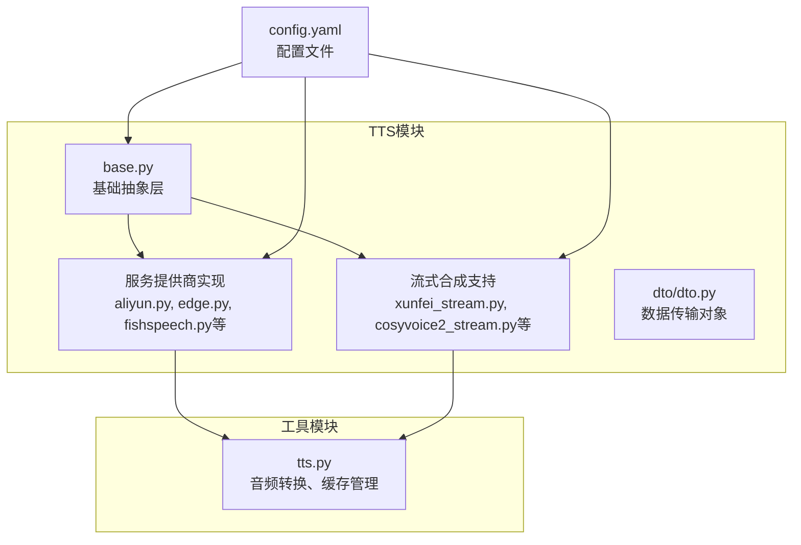
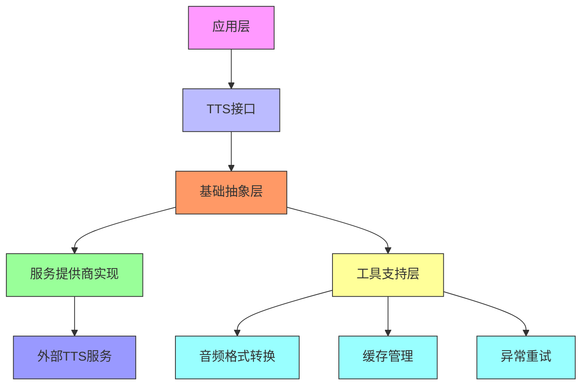
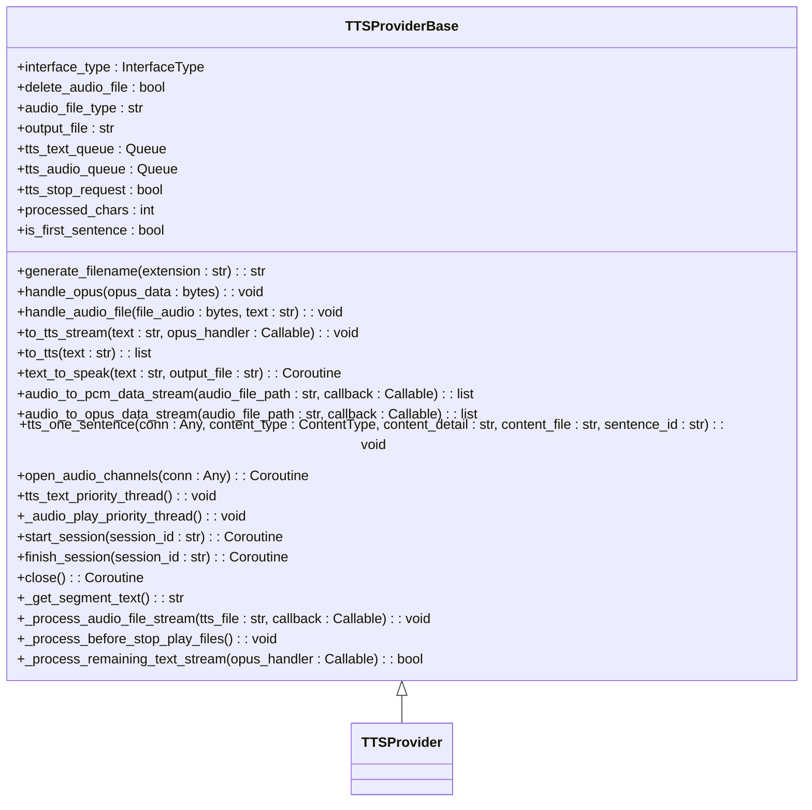
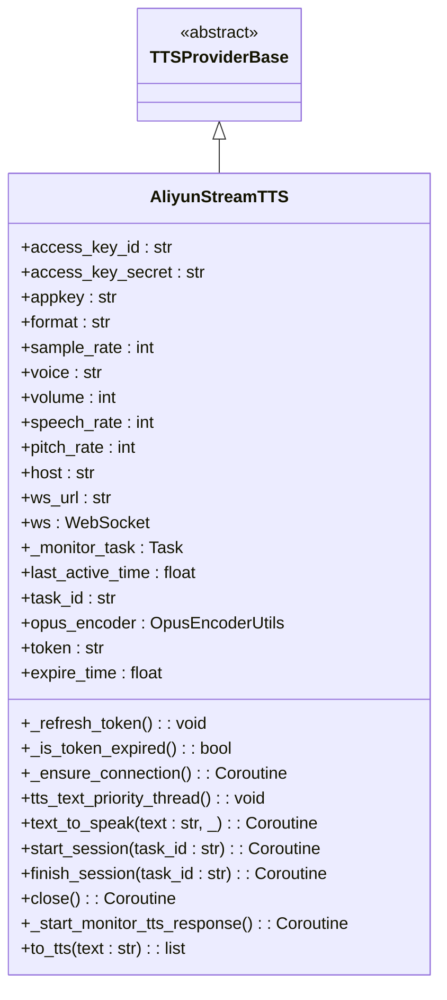
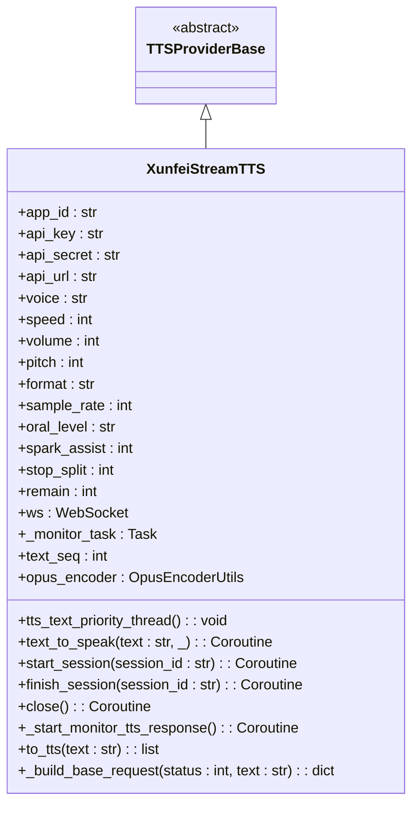
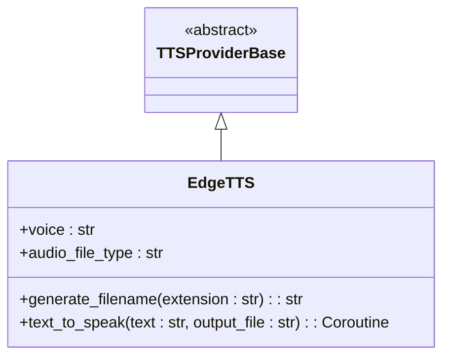
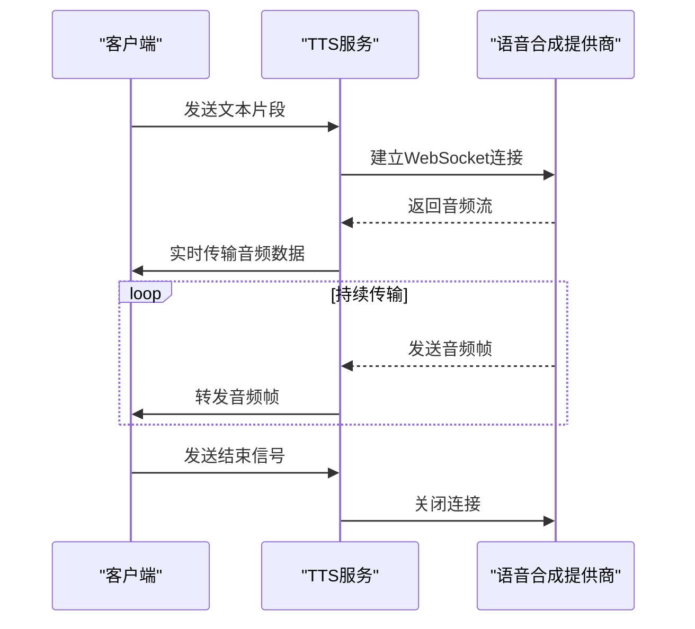
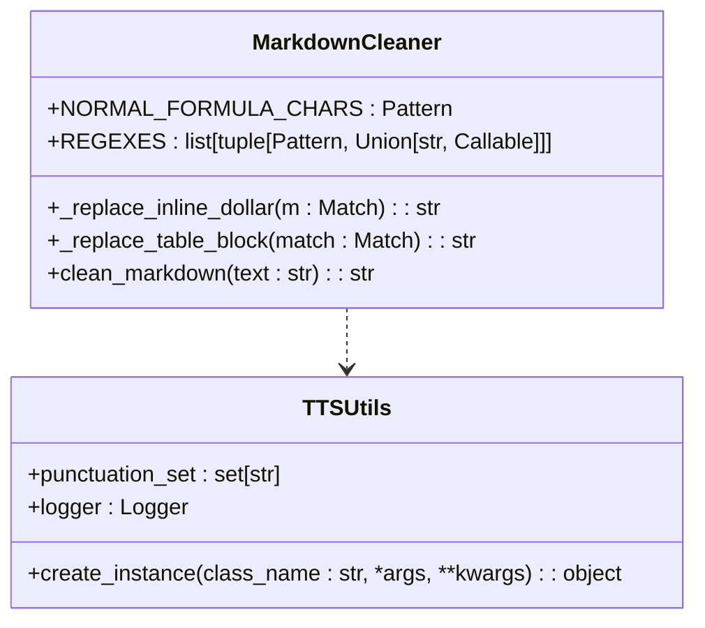
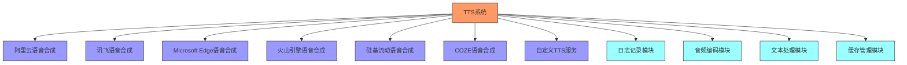

# 语音合成(TTS)

<cite>
**本文档引用的文件**
- [base.py](file://core/providers/tts/base.py)
- [tts.py](file://core/utils/tts.py)
- [default.py](file://core/providers/tts/default.py)
- [custom.py](file://core/providers/tts/custom.py)
- [xunfei_stream.py](file://core/providers/tts/xunfei_stream.py)
- [cosyvoice2_stream.py](file://core/providers/tts/cosyvoice2_stream.py)
- [aliyun_stream.py](file://core/providers/tts/aliyun_stream.py)
- [dto.py](file://core/providers/tts/dto/dto.py)
- [config.yaml](file://config.yaml)
- [edge.py](file://core/providers/tts/edge.py)
- [doubao.py](file://core/providers/tts/doubao.py)
- [fishspeech.py](file://core/providers/tts/fishspeech.py)
- [gpt_sovits_v2.py](file://core/providers/tts/gpt_sovits_v2.py)
- [cozecn.py](file://core/providers/tts/cozecn.py)
</cite>

## 目录
1. [简介](#简介)
2. [项目结构](#项目结构)
3. [核心组件](#核心组件)
4. [架构概述](#架构概述)
5. [详细组件分析](#详细组件分析)
6. [依赖分析](#依赖分析)
7. [性能考虑](#性能考虑)
8. [故障排除指南](#故障排除指南)
9. [结论](#结论)

## 简介
语音合成（TTS）模块是本系统的核心功能之一，负责将文本转换为自然流畅的语音输出。该模块采用分层架构设计，支持多种TTS服务提供商，并提供流式合成能力以实现低延迟的语音交互。TTS系统通过抽象基类定义统一接口，允许灵活集成不同的语音合成引擎，如阿里云、Edge、FishSpeech、GPT-SoVITS等。模块还包含音频格式转换、缓存管理和异常重试机制，确保服务的稳定性和可靠性。通过配置文件可以轻松选择TTS服务并调整语速、语调等参数，满足不同应用场景的需求。

## 项目结构
TTS模块位于`core/providers/tts/`目录下，采用清晰的分层结构。该模块包含基础抽象层、多种服务提供商实现以及流式合成支持。工具模块`tts.py`位于`core/utils/`目录中，提供音频格式转换、缓存管理和异常重试等通用功能。

**图源**
- [base.py](file://core/providers/tts/base.py)
- [tts.py](file://core/utils/tts.py)
- [config.yaml](file://config.yaml)

**本节源码**
- [base.py](file://core/providers/tts/base.py)
- [tts.py](file://core/utils/tts.py)
- [config.yaml](file://config.yaml)

## 核心组件
TTS系统的核心组件包括基础抽象层`base.py`、多种服务提供商实现以及流式合成支持。基础抽象层定义了TTS服务的通用接口和行为，所有具体实现都继承自`TTSProviderBase`类。服务提供商实现包括阿里云、Edge、FishSpeech、GPT-SoVITS等多种引擎，每种引擎都有其独特的音质特性和配置参数。流式合成支持通过`xunfei_stream.py`和`cosyvoice2_stream.py`等文件实现，能够在低延迟场景下提供实时语音输出。工具模块`tts.py`封装了音频格式转换、缓存管理和异常重试机制，为整个TTS系统提供支持。

**本节源码**
- [base.py](file://core/providers/tts/base.py)
- [tts.py](file://core/utils/tts.py)
- [default.py](file://core/providers/tts/default.py)
- [custom.py](file://core/providers/tts/custom.py)

## 架构概述
TTS系统采用分层架构设计，包含基础抽象层、服务提供商实现层和工具支持层。基础抽象层定义了TTS服务的通用接口和行为规范，确保不同服务提供商的实现具有一致性。服务提供商实现层包含多种语音合成引擎的具体实现，每种引擎都根据其API特性进行适配。工具支持层提供音频格式转换、缓存管理和异常重试等通用功能，增强系统的稳定性和可靠性。

**图源**
- [base.py](file://core/providers/tts/base.py)
- [tts.py](file://core/utils/tts.py)

**本节源码**
- [base.py](file://core/providers/tts/base.py)
- [tts.py](file://core/utils/tts.py)

## 详细组件分析

### 基础抽象层分析
基础抽象层`base.py`定义了TTS服务的通用接口和行为规范。`TTSProviderBase`类作为所有TTS服务实现的基类，提供了统一的接口和通用功能，如音频文件生成、文本处理和队列管理。

**图源**
- [base.py](file://core/providers/tts/base.py#L31-L462)

**本节源码**
- [base.py](file://core/providers/tts/base.py#L31-L462)

### 服务提供商实现分析
TTS系统支持多种服务提供商实现，每种实现都继承自`TTSProviderBase`类，并根据具体服务的API特性进行适配。这些实现包括阿里云、Edge、FishSpeech、GPT-SoVITS等多种引擎，每种引擎都有其独特的音质特性和配置参数。

#### 阿里云流式TTS实现
阿里云流式TTS实现通过WebSocket协议提供实时语音合成服务。该实现支持Token认证和连接复用，能够在10秒内复用现有连接进行连续对话，提高效率。

**图源**
- [aliyun_stream.py](file://core/providers/tts/aliyun_stream.py#L88-L607)

**本节源码**
- [aliyun_stream.py](file://core/providers/tts/aliyun_stream.py#L88-L607)

#### 讯飞流式TTS实现
讯飞流式TTS实现通过WebSocket协议提供高质量的语音合成服务。该实现支持多种音色和语音参数配置，如语速、音量和音调，能够生成自然流畅的语音输出。

**图源**
- [xunfei_stream.py](file://core/providers/tts/xunfei_stream.py#L61-L528)

**本节源码**
- [xunfei_stream.py](file://core/providers/tts/xunfei_stream.py#L61-L528)

#### Edge TTS实现
Edge TTS实现利用Microsoft Edge的语音合成服务，提供高质量的语音输出。该实现支持多种语音模型，如zh-CN-XiaoxiaoNeural，能够生成自然流畅的中文语音。

**图源**
- [edge.py](file://core/providers/tts/edge.py#L8-L46)

**本节源码**
- [edge.py](file://core/providers/tts/edge.py#L8-L46)

### 流式TTS实现原理
流式TTS实现通过WebSocket或HTTP流式传输技术，能够在接收到文本后立即开始生成语音，而无需等待整个文本处理完成。这种实现方式显著降低了语音交互的延迟，特别适合实时对话场景。

**图源**
- [xunfei_stream.py](file://core/providers/tts/xunfei_stream.py#L61-L528)
- [cosyvoice2_stream.py](file://core/providers/tts/cosyvoice2_stream.py#L18-L235)
- [aliyun_stream.py](file://core/providers/tts/aliyun_stream.py#L88-L607)

**本节源码**
- [xunfei_stream.py](file://core/providers/tts/xunfei_stream.py#L61-L528)
- [cosyvoice2_stream.py](file://core/providers/tts/cosyvoice2_stream.py#L18-L235)
- [aliyun_stream.py](file://core/providers/tts/aliyun_stream.py#L88-L607)

### 工具模块分析
工具模块`tts.py`封装了音频格式转换、缓存管理和异常重试等通用功能，为整个TTS系统提供支持。该模块还包含Markdown清理功能，能够处理复杂的文本格式。

**图源**
- [tts.py](file://core/utils/tts.py#L1-L138)

**本节源码**
- [tts.py](file://core/utils/tts.py#L1-L138)

## 依赖分析
TTS系统依赖于多个外部服务和内部模块。外部依赖包括阿里云、讯飞、Microsoft Edge等语音合成服务，这些服务通过API密钥进行认证。内部依赖包括日志记录、音频编码、文本处理等模块，这些模块为TTS系统提供基础支持。

**图源**
- [base.py](file://core/providers/tts/base.py)
- [tts.py](file://core/utils/tts.py)
- [config.yaml](file://config.yaml)

**本节源码**
- [base.py](file://core/providers/tts/base.py)
- [tts.py](file://core/utils/tts.py)
- [config.yaml](file://config.yaml)

## 性能考虑
TTS系统的性能主要受网络延迟、音频编码效率和服务器处理能力的影响。流式TTS实现通过WebSocket协议减少了连接建立时间，提高了实时性。音频编码采用Opus格式，在保证音质的同时减小了文件大小，降低了传输延迟。系统还实现了连接复用机制，在10秒内可以复用现有连接进行连续对话，进一步提高了效率。

在配置方面，可以通过调整`config.yaml`中的参数来优化性能。例如，设置`delete_audio: true`可以在使用完声音文件后立即删除，节省存储空间；调整`tts_timeout`参数可以控制TTS请求的超时时间，避免长时间等待。

## 故障排除指南
当TTS系统出现问题时，可以按照以下步骤进行排查：

1. **检查配置文件**：确保`config.yaml`中的TTS服务配置正确，特别是API密钥、AppID等认证信息。
2. **检查网络连接**：确认服务器能够正常访问外部TTS服务的API端点。
3. **查看日志信息**：检查日志文件中的错误信息，定位问题原因。
4. **测试单个服务**：尝试使用单个TTS服务进行测试，排除特定服务的问题。
5. **检查音频编码**：确认音频编码设置正确，特别是采样率和声道数。

常见问题及解决方案：
- **语音生成失败**：检查API密钥是否正确，确认服务是否正常运行。
- **音频质量差**：调整语音参数，如语速、音量和音调。
- **延迟过高**：使用流式TTS实现，优化网络连接。

**本节源码**
- [base.py](file://core/providers/tts/base.py#L110-L121)
- [doubao.py](file://core/providers/tts/doubao.py#L81-L86)
- [fishspeech.py](file://core/providers/tts/fishspeech.py#L184-L188)

## 结论
语音合成（TTS）模块采用分层架构设计，支持多种服务提供商实现和流式合成能力。基础抽象层定义了统一的接口和行为规范，确保不同服务提供商的实现具有一致性。多种服务提供商实现提供了丰富的音质选择，满足不同应用场景的需求。流式TTS实现通过WebSocket或HTTP流式传输技术，显著降低了语音交互的延迟，特别适合实时对话场景。工具模块封装了音频格式转换、缓存管理和异常重试等通用功能，增强了系统的稳定性和可靠性。通过配置文件可以轻松选择TTS服务并调整参数，实现灵活的语音合成解决方案。