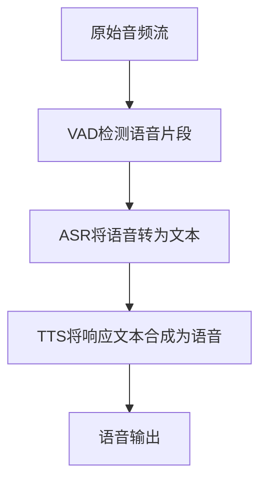
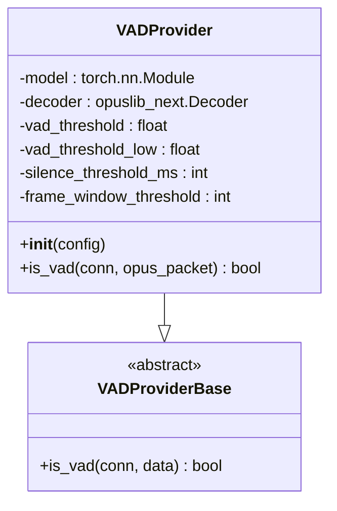
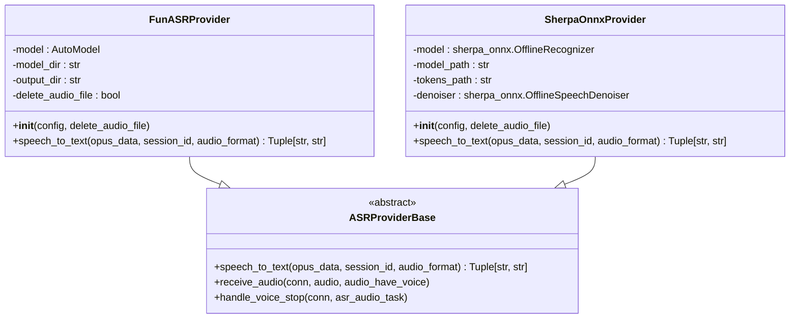
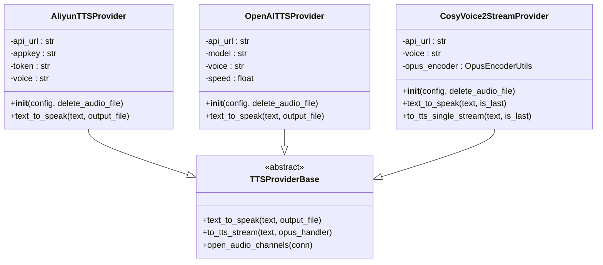
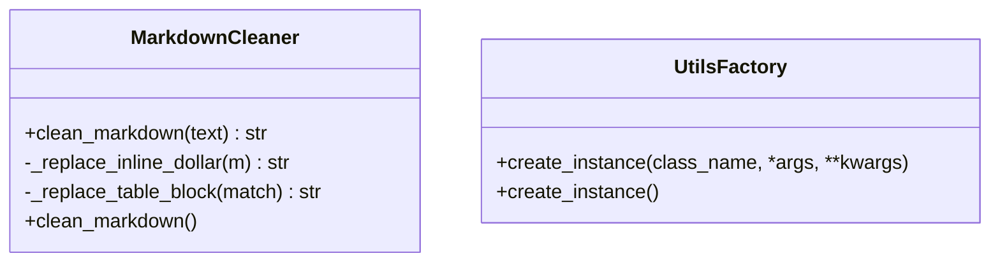

# 语音处理

<cite>
**本文档引用的文件**
- [silero.py](file://core/providers/vad/silero.py)
- [vad.py](file://core/utils/vad.py)
- [fun_local.py](file://core/providers/asr/fun_local.py)
- [sherpa_onnx_local.py](file://core/providers/asr/sherpa_onnx_local.py)
- [aliyun.py](file://core/providers/asr/aliyun.py)
- [baidu.py](file://core/providers/asr/baidu.py)
- [openai.py](file://core/providers/asr/openai.py)
- [xunfei_stream.py](file://core/providers/asr/xunfei_stream.py)
- [aliyun.py](file://core/providers/tts/aliyun.py)
- [openai.py](file://core/providers/tts/openai.py)
- [cosyvoice2_stream.py](file://core/providers/tts/cosyvoice2_stream.py)
- [asr.py](file://core/utils/asr.py)
- [tts.py](file://core/utils/tts.py)
- [base.py](file://core/providers/asr/base.py)
- [base.py](file://core/providers/tts/base.py)
</cite>

## 目录
1. [引言](#引言)
2. [语音处理流水线](#语音处理流水线)
3. [语音活动检测（VAD）](#语音活动检测vad)
4. [语音识别（ASR）](#语音识别asr)
5. [语音合成（TTS）](#语音合成tts)
6. [核心工具函数](#核心工具函数)
7. [配置与调用示例](#配置与调用示例)
8. [总结](#总结)

## 引言
本项目实现了一个完整的语音处理系统，涵盖语音活动检测（VAD）、语音识别（ASR）和语音合成（TTS）三大核心功能。系统采用模块化设计，支持多种本地和云端服务提供商，能够灵活配置以适应不同的应用场景。整个语音处理流程从原始音频流开始，经过VAD检测语音片段，ASR将语音转换为文本，最后通过TTS将响应文本合成为语音输出。

## 语音处理流水线
语音处理系统遵循一个清晰的数据流：原始音频流 → VAD检测语音片段 → ASR将语音转为文本 → TTS将响应文本合成为语音。这个流程确保了从用户输入到系统响应的完整闭环。系统首先通过VAD模块检测音频流中的有效语音片段，避免对静音或噪声进行不必要的处理。一旦检测到语音结束，系统会将完整的语音片段传递给ASR模块进行语音识别。识别出的文本随后被送入语言模型进行处理，生成响应文本。最后，TTS模块将响应文本转换为语音，通过音频流返回给用户。

**图示来源**
- [silero.py](file://core/providers/vad/silero.py)
- [fun_local.py](file://core/providers/asr/fun_local.py)
- [aliyun.py](file://core/providers/tts/aliyun.py)

## 语音活动检测（VAD）
语音活动检测（VAD）是语音处理流程的第一步，负责从连续的音频流中识别出包含语音的有效片段。本系统采用基于silero_vad的实现，通过深度学习模型精确检测语音活动。

### Silero VAD实现
VAD模块的核心实现位于`core/providers/vad/silero.py`文件中。`VADProvider`类继承自`VADProviderBase`抽象基类，并实现了`is_vad`方法用于检测语音活动。该模块使用PyTorch加载预训练的silero_vad模型，对输入的Opus编码音频数据进行实时分析。

**图示来源**
- [silero.py](file://core/providers/vad/silero.py#L12-L91)
- [base.py](file://core/providers/vad/base.py#L5-L10)

### 模型加载与推理
在初始化过程中，`VADProvider`通过`torch.hub.load`从本地目录加载silero_vad模型。系统使用Opus解码器将接收到的Opus编码音频包解码为PCM格式，然后将PCM数据转换为浮点数张量供模型推理使用。模型输出的语音概率通过双阈值判断机制来确定是否为有效语音：当概率高于`vad_threshold`时判定为有语音，低于`vad_threshold_low`时判定为无语音，介于两者之间则延续前一个状态。

### 灵敏度配置
VAD模块的灵敏度可以通过配置文件进行调整。主要配置参数包括：
- `threshold`: 主要检测阈值，默认值为0.5
- `threshold_low`: 低阈值，用于防止频繁状态切换，默认值为0.2
- `min_silence_duration_ms`: 静音持续时间阈值，用于判断一句话是否结束，默认值为1000毫秒

这些参数允许系统在不同环境下的语音检测灵敏度进行微调，平衡误报和漏报的风险。

**本节来源**
- [silero.py](file://core/providers/vad/silero.py#L12-L91)
- [vad.py](file://core/utils/vad.py#L11-L20)

## 语音识别（ASR）
语音识别（ASR）模块负责将检测到的语音片段转换为文本。系统架构设计灵活，支持本地模型和云端服务两种实现方式，并区分流式和非流式处理模式。

### 架构设计
ASR模块采用抽象工厂模式，所有具体实现都继承自`ASRProviderBase`抽象基类。这种设计模式使得系统可以轻松集成新的ASR服务提供商，同时为上层应用提供统一的调用接口。`ASRProviderBase`定义了`speech_to_text`抽象方法，所有子类必须实现该方法以提供具体的语音识别功能。

### 本地模型实现
本地ASR模型主要通过`fun_local.py`和`sherpa_onnx_local.py`两个文件实现。`fun_local.py`使用FunASR框架，通过`funasr`库的`AutoModel`加载本地模型进行语音识别。该实现要求系统内存大于2GB，并在初始化时进行内存检测。

**图示来源**
- [fun_local.py](file://core/providers/asr/fun_local.py#L38-L135)
- [sherpa_onnx_local.py](file://core/providers/asr/sherpa_onnx_local.py#L39-L239)
- [base.py](file://core/providers/asr/base.py#L25-L239)

### 云端服务实现
云端ASR服务通过多个独立的Python文件实现，如`aliyun.py`、`baidu.py`、`openai.py`等。每个文件对应一个特定的云服务提供商，封装了与该服务的API交互逻辑。例如，`aliyun.py`实现了与阿里云智能语音交互服务的集成，通过HTTP请求发送音频数据并接收识别结果。

### 流式与非流式处理
系统区分流式ASR和非流式ASR处理模式。流式ASR（如`xunfei_stream.py`）能够在用户说话的同时实时返回部分识别结果，提供更低的响应延迟。非流式ASR则在完整接收语音片段后才开始识别，通常能提供更高的识别准确率。

流式ASR的典型应用场景包括实时字幕生成和语音助手的即时反馈，而非流式ASR更适合对准确率要求较高的场景，如语音转写和文档录入。

**本节来源**
- [fun_local.py](file://core/providers/asr/fun_local.py#L38-L135)
- [sherpa_onnx_local.py](file://core/providers/asr/sherpa_onnx_local.py#L39-L239)
- [aliyun.py](file://core/providers/asr/aliyun.py#L90-L249)
- [baidu.py](file://core/providers/asr/baidu.py#L13-L86)
- [openai.py](file://core/providers/asr/openai.py#L13-L83)
- [xunfei_stream.py](file://core/providers/asr/xunfei_stream.py#L26-L524)
- [base.py](file://core/providers/asr/base.py#L25-L268)

## 语音合成（TTS）
语音合成（TTS）模块负责将文本响应转换为语音输出。与ASR模块类似，TTS也支持本地和云端多种服务，并区分流式和非流式处理模式。

### 本地与云端服务
TTS模块支持多种语音服务，包括阿里云、OpenAI、CosyVoice2等。`aliyun.py`和`openai.py`文件分别实现了与阿里云和OpenAI TTS服务的集成。`cosyvoice2_stream.py`则实现了与CosyVoice2流式TTS服务的连接，支持实时语音合成。

### 流式与非流式处理
流式TTS（如`cosyvoice2_stream.py`和`xunfei_stream.py`）能够边生成边传输音频数据，实现低延迟的语音输出。非流式TTS则先生成完整的音频文件，然后一次性发送给客户端。

**图示来源**
- [aliyun.py](file://core/providers/tts/aliyun.py#L86-L206)
- [openai.py](file://core/providers/tts/openai.py#L10-L55)
- [cosyvoice2_stream.py](file://core/providers/tts/cosyvoice2_stream.py#L18-L235)
- [base.py](file://core/providers/tts/base.py#L31-L462)

### 支持的语音服务
系统支持多种语音服务，包括：
- 阿里云TTS：支持多种中文和英文语音
- OpenAI TTS：提供高质量的自然语音
- CosyVoice2：支持流式语音合成
- 讯飞语音：提供多种特色语音
- GPT-SoVITS：支持语音克隆和个性化语音

**本节来源**
- [aliyun.py](file://core/providers/tts/aliyun.py#L86-L206)
- [openai.py](file://core/providers/tts/openai.py#L10-L55)
- [cosyvoice2_stream.py](file://core/providers/tts/cosyvoice2_stream.py#L18-L235)
- [xunfei_stream.py](file://core/providers/tts/xunfei_stream.py)
- [gpt_sovits_v3.py](file://core/providers/tts/gpt_sovits_v3.py)

## 核心工具函数
`core/utils`目录中的工具函数封装了底层细节，为上层应用提供统一的调用接口。这些工具函数通过工厂模式创建相应的服务实例，简化了服务的集成和使用。

### VAD工具函数
`vad.py`文件中的`create_instance`函数是VAD服务的工厂方法，根据配置的类型动态加载相应的VAD提供者。该函数检查指定的VAD类型文件是否存在，然后使用`importlib`动态导入并实例化相应的类。

### ASR工具函数
`asr.py`文件提供了ASR服务的工厂方法`create_instance`，其工作原理与VAD工具函数类似。该函数根据配置的ASR类型（如`fun_local`、`sherpa_onnx_local`、`aliyun`等）动态创建相应的ASR提供者实例。

### TTS工具函数
`tts.py`文件中的`create_instance`函数负责创建TTS服务实例。此外，该文件还包含`MarkdownCleaner`类，用于清理Markdown格式的文本，移除代码块、表格、链接等不适合语音合成的元素，确保输入TTS的文本是纯净的可读内容。

**图示来源**
- [vad.py](file://core/utils/vad.py#L11-L20)
- [asr.py](file://core/utils/asr.py#L16-L24)
- [tts.py](file://core/utils/tts.py#L31-L138)

**本节来源**
- [vad.py](file://core/utils/vad.py#L11-L20)
- [asr.py](file://core/utils/asr.py#L16-L24)
- [tts.py](file://core/utils/tts.py#L31-L138)

## 配置与调用示例
在系统中配置和调用不同的ASR/TTS服务主要通过修改配置文件和使用工厂方法实现。以下是一个典型的配置和调用流程：

1. 在配置文件中指定ASR/TTS服务的类型和相关参数
2. 使用`create_instance`工厂方法创建服务实例
3. 调用实例的`speech_to_text`或`text_to_speak`方法进行处理

例如，要使用阿里云ASR服务，需要在配置中设置`type: aliyun`，并提供`access_key_id`、`access_key_secret`等必要参数。系统会自动加载`aliyun.py`文件并创建相应的ASR提供者实例。

**本节来源**
- [asr.py](file://core/utils/asr.py#L16-L24)
- [tts.py](file://core/utils/tts.py#L31-L138)
- [aliyun.py](file://core/providers/asr/aliyun.py#L90-L249)
- [aliyun.py](file://core/providers/tts/aliyun.py#L86-L206)

## 总结
本语音处理系统通过模块化设计实现了完整的语音交互功能。VAD模块基于silero_vad模型精确检测语音活动，ASR模块支持本地和云端多种语音识别服务，TTS模块则提供高质量的语音合成能力。系统通过抽象基类和工厂模式实现了良好的扩展性，可以轻松集成新的服务提供商。工具函数封装了复杂的底层细节，为上层应用提供了简洁统一的接口。整个系统设计考虑了实时性、准确性和可扩展性，适用于各种语音交互场景。