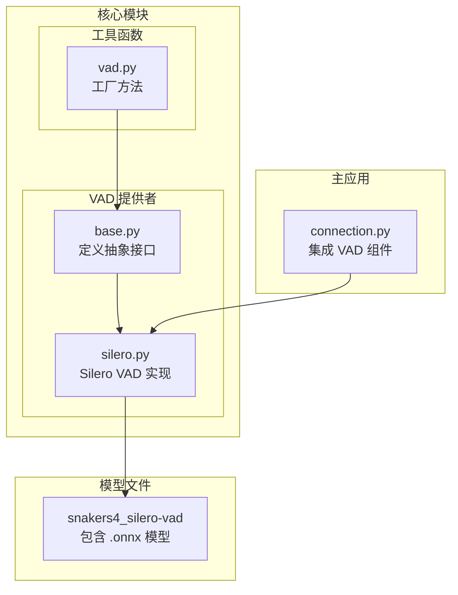
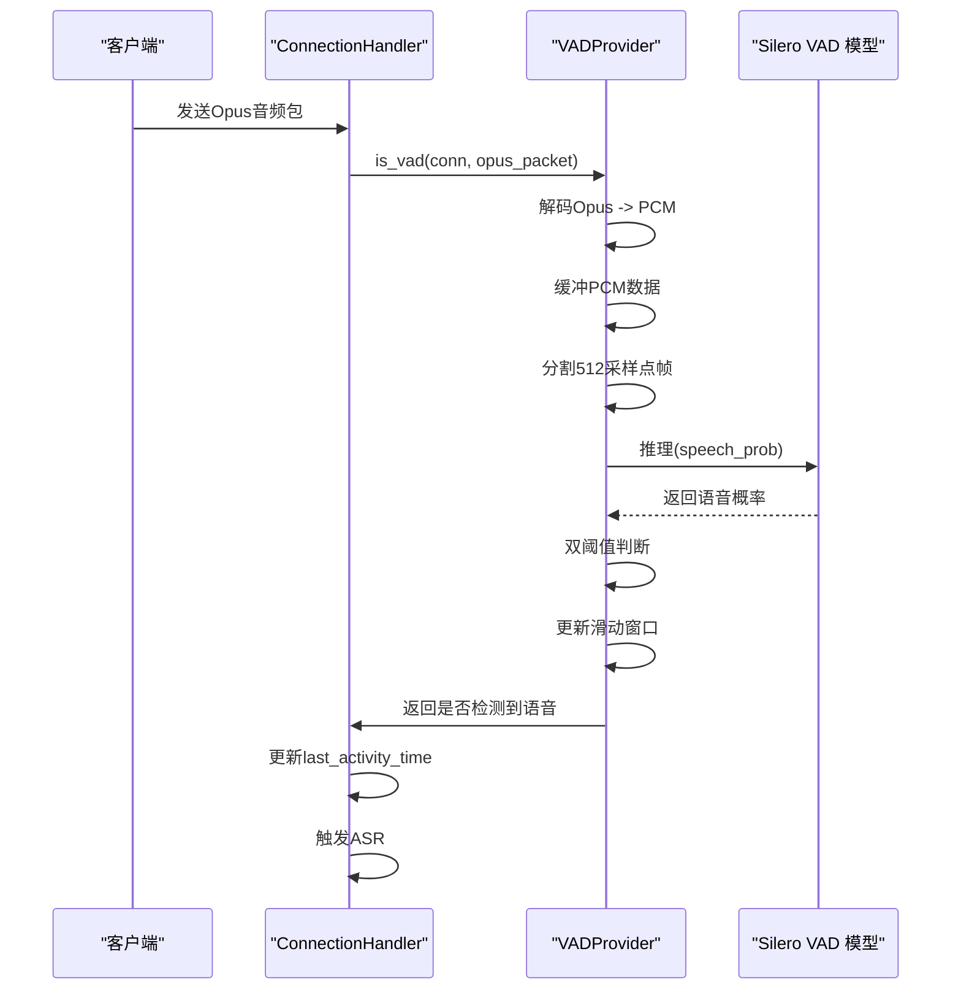
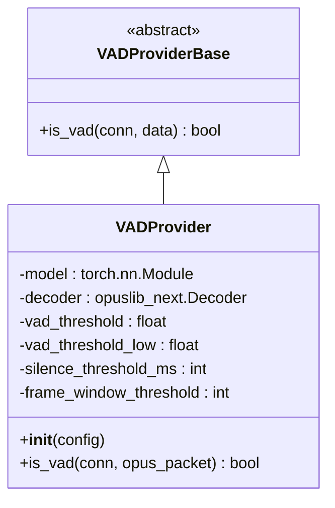
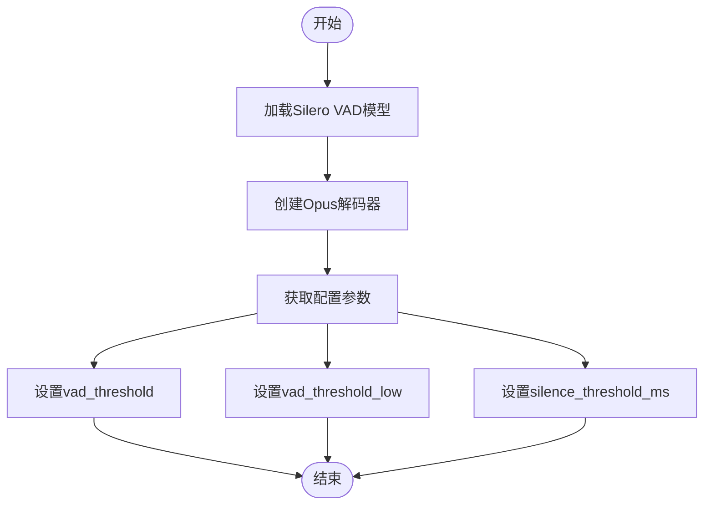
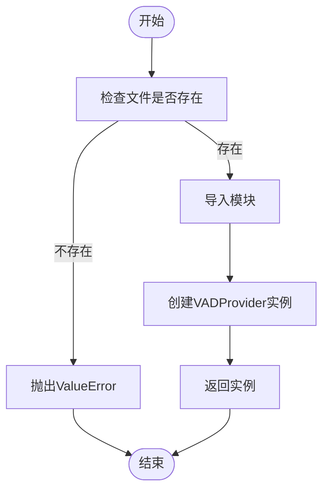
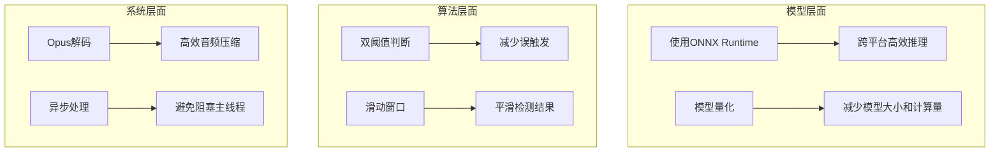
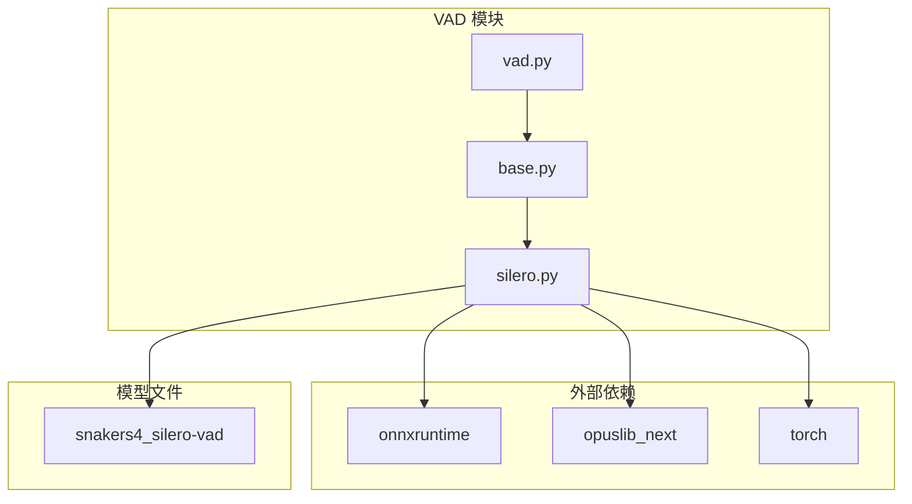

# 语音活动检测(VAD)

<cite>
**本文档引用的文件**
- [silero.py](file://core\providers\vad\silero.py)
- [base.py](file://core\providers\vad\base.py)
- [vad.py](file://core\utils\vad.py)
- [connection.py](file://core\connection.py)
- [config.yaml](file://config.yaml)
- [model.py](file://models\snakers4_silero-vad\src\silero_vad\model.py)
- [utils_vad.py](file://models\snakers4_silero-vad\src\silero_vad\utils_vad.py)
- [modules_initialize.py](file://core\utils\modules_initialize.py)
</cite>

## 目录
1. [简介](#简介)
2. [项目结构](#项目结构)
3. [核心组件](#核心组件)
4. [架构概述](#架构概述)
5. [详细组件分析](#详细组件分析)
6. [依赖分析](#依赖分析)
7. [性能考虑](#性能考虑)
8. [故障排除指南](#故障排除指南)
9. [结论](#结论)

## 简介
本文档详细阐述了语音活动检测（VAD）模块的技术实现，重点介绍基于Silero VAD的实现机制。文档涵盖了模型加载、推理流程、实时音频流处理策略，以及在ESP32设备低延迟需求下的性能优化策略。通过分析代码结构，解释了`silero.py`如何继承`base.py`的抽象接口，并通过ONNX Runtime执行模型推理。同时，说明了`vad.py`工具函数如何封装音频预处理、帧分割和结果后处理逻辑。

## 项目结构
语音活动检测（VAD）模块是`xiaozhi-esp32-server`项目中的一个关键组件，其代码结构清晰地分离了接口定义、具体实现和工具函数。

**图源**
- [base.py](file://core\providers\vad\base.py)
- [silero.py](file://core\providers\vad\silero.py)
- [vad.py](file://core\utils\vad.py)
- [connection.py](file://core\connection.py)

**本节源码**
- [base.py](file://core\providers\vad\base.py)
- [silero.py](file://core\providers\vad\silero.py)
- [vad.py](file://core\utils\vad.py)

## 核心组件
VAD模块的核心组件包括定义抽象接口的`base.py`、实现Silero VAD模型的`silero.py`以及提供工厂方法的`vad.py`。这些组件共同协作，实现了高效、灵活的语音活动检测功能。

**本节源码**
- [base.py](file://core\providers\vad\base.py)
- [silero.py](file://core\providers\vad\silero.py)
- [vad.py](file://core\utils\vad.py)

## 架构概述
VAD模块的架构设计遵循了清晰的分层原则，从接口定义到具体实现，再到应用集成，形成了一个完整的语音检测流水线。

**图源**
- [connection.py](file://core\connection.py#L117-L123)
- [silero.py](file://core\providers\vad\silero.py#L39-L86)

## 详细组件分析

### Silero VAD 实现分析
`silero.py`文件实现了基于Silero VAD模型的具体语音检测逻辑。该实现继承自`VADProviderBase`抽象基类，并利用ONNX Runtime执行模型推理。

#### 类图

**图源**
- [base.py](file://core\providers\vad\base.py)
- [silero.py](file://core\providers\vad\silero.py)

#### 初始化流程
`VADProvider`的初始化过程加载了Silero VAD模型并配置了相关参数。

**图源**
- [silero.py](file://core\providers\vad\silero.py#L13-L38)

**本节源码**
- [silero.py](file://core\providers\vad\silero.py)

### VAD 工具函数分析
`vad.py`文件提供了一个工厂方法`create_instance`，用于根据配置动态创建VAD提供者实例。

#### 工厂方法流程

**图源**
- [vad.py](file://core\utils\vad.py#L11-L19)

**本节源码**
- [vad.py](file://core\utils\vad.py)

### 配置参数分析
VAD的行为由多个配置参数控制，这些参数在`config.yaml`文件中定义，并在`silero.py`中被读取和应用。

#### 配置参数表
| 参数 | 默认值 | 描述 |
| :--- | :--- | :--- |
| `threshold` | 0.5 | 语音检测的主阈值，高于此值认为是语音 |
| `threshold_low` | 0.2 | 语音检测的低阈值，低于此值认为是静音 |
| `min_silence_duration_ms` | 1000 | 静音超时时间，超过此时间认为语音结束 |
| `frame_window_threshold` | 3 | 滑动窗口中至少需要多少帧为语音才认为有语音 |

**本节源码**
- [silero.py](file://core\providers\vad\silero.py#L25-L37)
- [config.yaml](file://config.yaml)

### 性能优化策略分析
为了满足ESP32设备的低延迟需求，VAD模块在多个层面进行了性能优化。

#### 性能优化策略

**本节源码**
- [silero.py](file://core\providers\vad\silero.py)
- [connection.py](file://core\connection.py)

## 依赖分析
VAD模块的依赖关系清晰，主要依赖于ONNX Runtime进行模型推理，以及opuslib_next进行音频解码。

**图源**
- [silero.py](file://core\providers\vad\silero.py#L3-L6)
- [model.py](file://models\snakers4_silero-vad\src\silero_vad\model.py)

**本节源码**
- [silero.py](file://core\providers\vad\silero.py)
- [model.py](file://models\snakers4_silero-vad\src\silero_vad\model.py)

## 性能考虑
VAD模块在设计时充分考虑了性能因素，特别是在实时音频流处理场景下。

1. **低延迟**: 通过使用高效的Opus编解码器和轻量级的Silero VAD模型，确保了从音频输入到语音检测结果输出的低延迟。
2. **资源占用**: 模型经过优化，内存占用小，适合在资源受限的设备上运行。
3. **计算效率**: ONNX Runtime提供了跨平台的高性能推理能力，确保了模型推理的高效性。

**本节源码**
- [silero.py](file://core\providers\vad\silero.py)
- [utils_vad.py](file://models\snakers4_silero-vad\src\silero_vad\utils_vad.py)

## 故障排除指南
在使用VAD模块时，可能会遇到一些常见问题，以下是一些排查建议。

1. **无法检测到语音**: 检查`threshold`和`threshold_low`参数是否设置合理，可以尝试降低`threshold`值。
2. **误触发**: 如果静音时也触发了语音检测，可以尝试提高`threshold`值或降低`threshold_low`值。
3. **模型加载失败**: 确保`models/snakers4_silero-vad`目录存在且包含正确的模型文件。
4. **音频解码错误**: 检查输入的音频数据是否为有效的Opus编码格式。

**本节源码**
- [silero.py](file://core\providers\vad\silero.py#L87-L90)
- [connection.py](file://core\connection.py)

## 结论
本文档详细分析了基于Silero VAD的语音活动检测模块的实现机制。该模块通过继承抽象接口、使用ONNX Runtime执行推理、封装工具函数和优化性能，实现了高效、灵活的语音检测功能。通过合理配置参数，可以在不同场景下平衡检测的灵敏度和准确性，满足ESP32设备的低延迟需求。