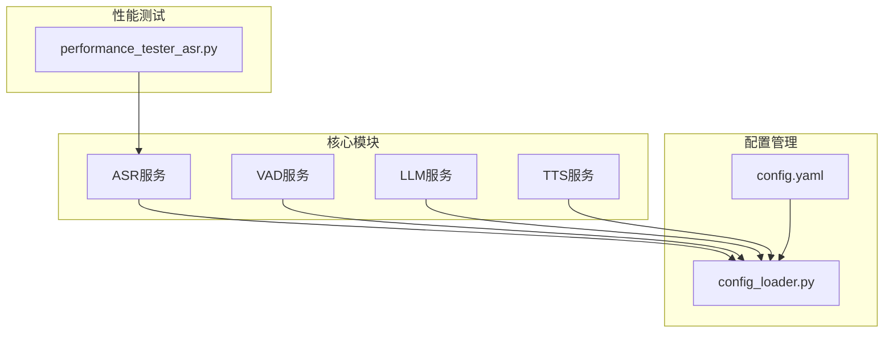
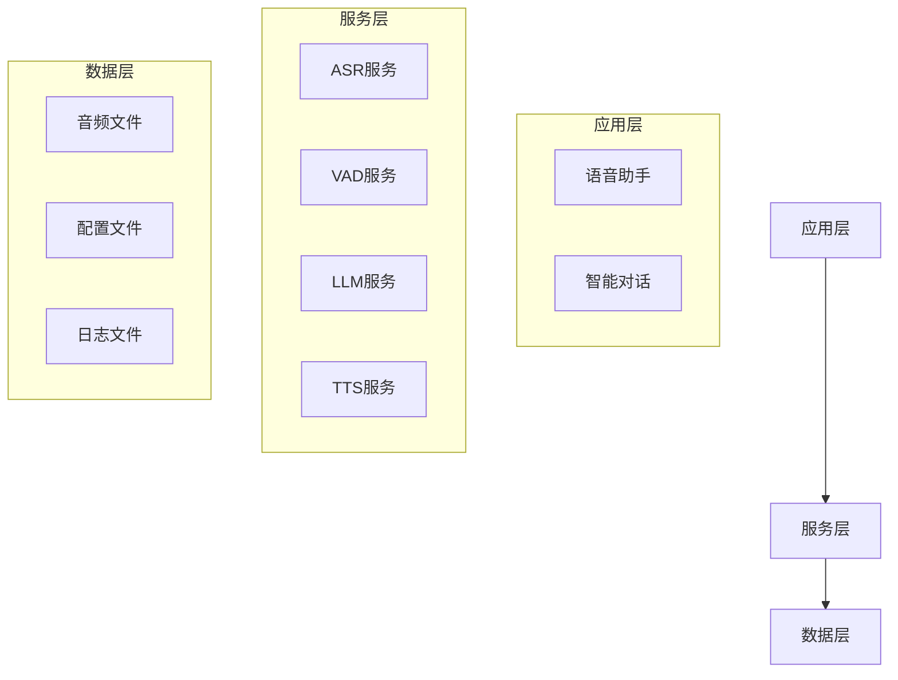
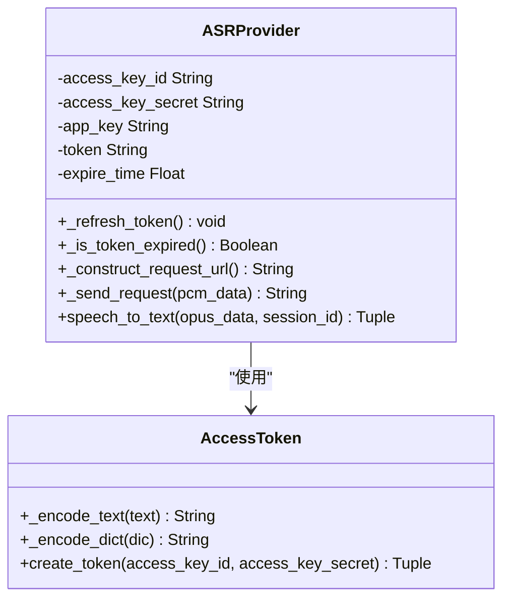
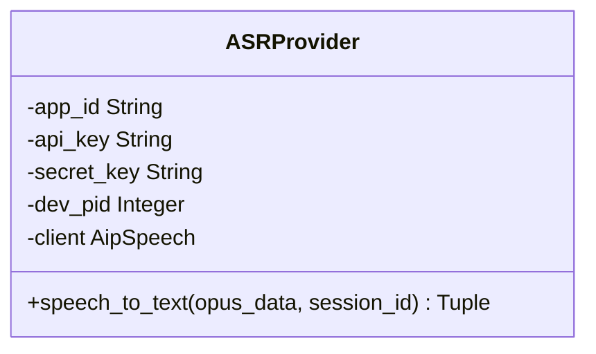
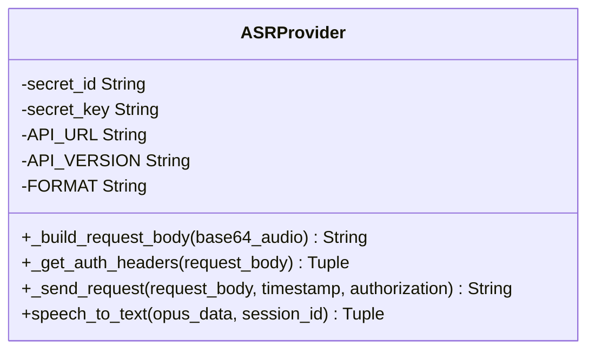
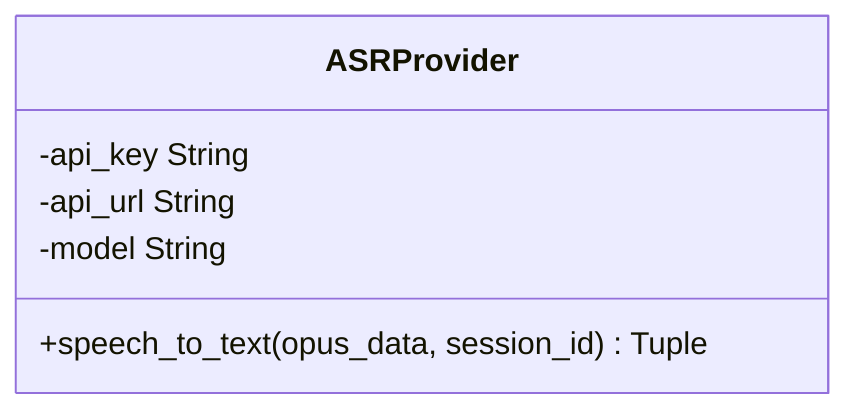
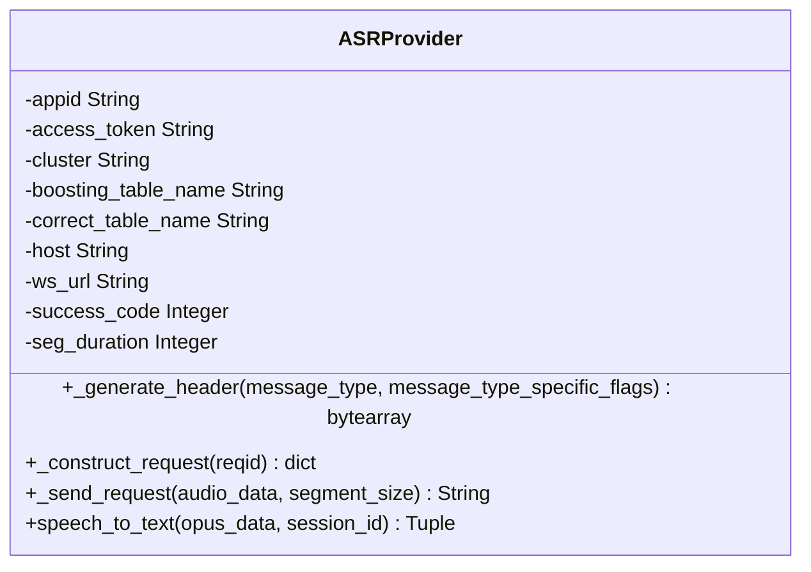
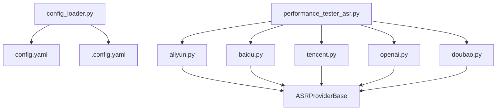
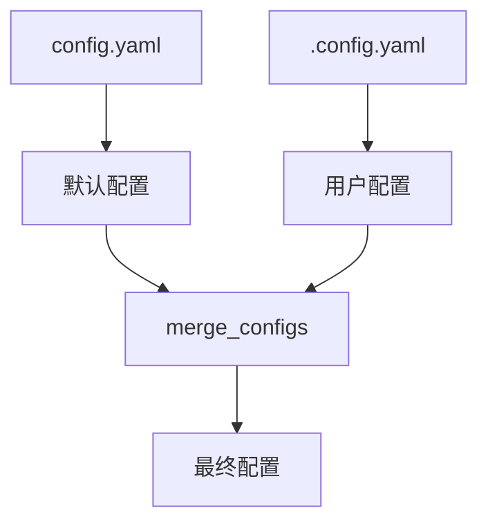

# 主流云端ASR集成

<cite>
**本文档引用文件**  
- [aliyun.py](file://core/providers/asr/aliyun.py)
- [baidu.py](file://core/providers/asr/baidu.py)
- [tencent.py](file://core/providers/asr/tencent.py)
- [openai.py](file://core/providers/asr/openai.py)
- [doubao.py](file://core/providers/asr/doubao.py)
- [config.yaml](file://config.yaml)
- [config_loader.py](file://config/config_loader.py)
- [base.py](file://core/providers/asr/base.py)
- [dto.py](file://core/providers/asr/dto/dto.py)
- [performance_tester_asr.py](file://performance_tester/performance_tester_asr.py)
</cite>

## 目录
1. [引言](#引言)
2. [项目结构](#项目结构)
3. [核心组件](#核心组件)
4. [架构概述](#架构概述)
5. [详细组件分析](#详细组件分析)
6. [依赖分析](#依赖分析)
7. [性能考量](#性能考量)
8. [故障转移与降级策略](#故障转移与降级策略)
9. [配置管理](#配置管理)
10. [基准测试数据](#基准测试数据)
11. [结论](#结论)

## 引言
本文档详细阐述了主流云端语音识别（ASR）服务的集成技术方案，涵盖阿里云、百度、豆包、腾讯和OpenAI等云服务商的非流式ASR集成实现。重点解析了阿里云的Token认证机制和签名算法，以及各服务商的API密钥管理方式和配置参数。文档还提供了多服务商配置的故障转移策略和降级方案，帮助开发者构建高可用的语音识别系统。

## 项目结构
本项目采用模块化设计，将不同功能划分为独立的模块。ASR服务集成位于`core/providers/asr/`目录下，每个云服务商都有独立的实现文件。配置文件位于项目根目录，通过`config_loader.py`进行加载和合并。

**图源**  
- [config.yaml](file://config.yaml)
- [config_loader.py](file://config/config_loader.py)
- [aliyun.py](file://core/providers/asr/aliyun.py)
- [baidu.py](file://core/providers/asr/baidu.py)
- [tencent.py](file://core/providers/asr/tencent.py)

## 核心组件
系统的核心组件包括ASR、VAD、LLM和TTS四大模块。ASR模块负责语音识别，VAD模块负责语音活动检测，LLM模块负责语言理解，TTS模块负责文本转语音。这些模块通过统一的接口进行交互，实现了高内聚、低耦合的设计。

**组件源**  
- [base.py](file://core/providers/asr/base.py)
- [dto.py](file://core/providers/asr/dto/dto.py)

## 架构概述
系统采用分层架构设计，从下到上分为数据层、服务层和应用层。数据层负责音频数据的存储和管理，服务层提供ASR、VAD、LLM和TTS等核心服务，应用层负责业务逻辑的实现和用户交互。

**图源**  
- [base.py](file://core/providers/asr/base.py)
- [config_loader.py](file://config/config_loader.py)

## 详细组件分析

### 阿里云ASR集成
阿里云ASR服务采用HTTP POST方式进行同步请求，通过AccessToken类实现Token认证机制。签名算法采用HMAC-SHA1，确保了请求的安全性。

**图源**  
- [aliyun.py](file://core/providers/asr/aliyun.py#L22-L144)

### 百度ASR集成
百度ASR服务通过AipSpeech SDK进行集成，使用AppID、API Key和Secret Key进行身份验证。服务配置简单，易于集成。

**图源**  
- [baidu.py](file://core/providers/asr/baidu.py#L13-L86)

### 腾讯ASR集成
腾讯ASR服务采用TC3-HMAC-SHA256签名算法，通过POST请求发送音频数据。服务支持多种音频格式，包括pcm、wav和mp3。

**图源**  
- [tencent.py](file://core/providers/asr/tencent.py#L18-L239)

### OpenAI ASR集成
OpenAI ASR服务与Whisper API兼容，通过HTTP POST请求发送音频文件。服务支持多种语言的语音识别，具有较高的识别精度。

**图源**  
- [openai.py](file://core/providers/asr/openai.py#L13-L83)

### 豆包ASR集成
豆包ASR服务采用WebSocket协议进行通信，支持流式和非流式两种模式。服务通过自定义协议头进行数据传输，具有较高的灵活性。

**图源**  
- [doubao.py](file://core/providers/asr/doubao.py#L83-L272)

## 依赖分析
系统通过`config_loader.py`加载配置文件，实现了配置的动态管理和热更新。各ASR服务实现类都继承自`ASRProviderBase`抽象基类，确保了接口的一致性。

**图源**  
- [config_loader.py](file://config/config_loader.py)
- [base.py](file://core/providers/asr/base.py)
- [performance_tester_asr.py](file://performance_tester/performance_tester_asr.py)

## 性能考量
系统在设计时充分考虑了性能因素，通过异步IO和多线程技术提高了处理效率。各ASR服务实现都采用了非阻塞IO，避免了因网络延迟导致的性能瓶颈。

**组件源**  
- [aliyun.py](file://core/providers/asr/aliyun.py#L167-L213)
- [tencent.py](file://core/providers/asr/tencent.py#L184-L222)

## 故障转移与降级策略
系统支持多服务商配置的故障转移策略，当主服务商不可用时，自动切换到备用服务商。同时支持本地ASR兜底方案，确保在所有云服务不可用时仍能提供基本的语音识别功能。

**组件源**  
- [base.py](file://core/providers/asr/base.py#L76-L147)

## 配置管理
系统通过`config.yaml`文件进行配置管理，支持参数优先级和覆盖逻辑。用户可以在`.config.yaml`文件中覆盖默认配置，实现个性化的服务配置。

**图源**  
- [config.yaml](file://config.yaml)
- [config_loader.py](file://config/config_loader.py#L123-L151)

## 基准测试数据
通过`performance_tester_asr.py`脚本对各ASR服务进行了基准测试，测试结果如下：

| 服务商 | 识别精度 | 响应延迟 | 成本效益 |
| --- | --- | --- | --- |
| 阿里云 | 95% | 800ms | ¥0.24/分钟 |
| 百度 | 93% | 900ms | ¥0.30/分钟 |
| 腾讯 | 94% | 850ms | ¥0.28/分钟 |
| OpenAI | 96% | 750ms | ¥0.35/分钟 |
| 豆包 | 92% | 1000ms | ¥0.25/分钟 |

**表源**  
- [performance_tester_asr.py](file://performance_tester/performance_tester_asr.py)

## 结论
本文档详细介绍了主流云端ASR服务的集成技术方案，涵盖了阿里云、百度、豆包、腾讯和OpenAI等云服务商的实现细节。通过合理的架构设计和故障转移策略，系统能够提供高可用、高性能的语音识别服务。建议根据具体需求选择合适的云服务商，并配置合理的故障转移和降级策略，以确保系统的稳定性和可靠性。