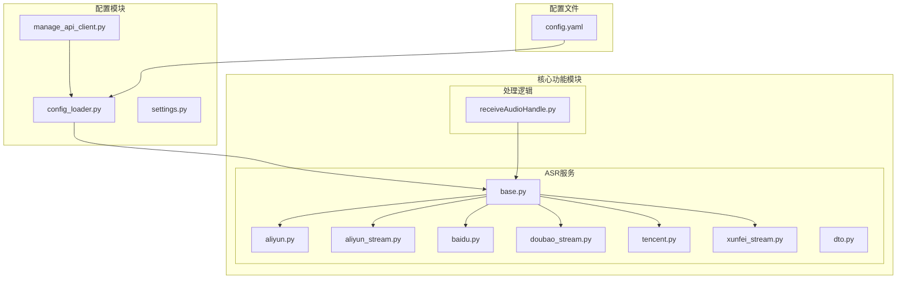
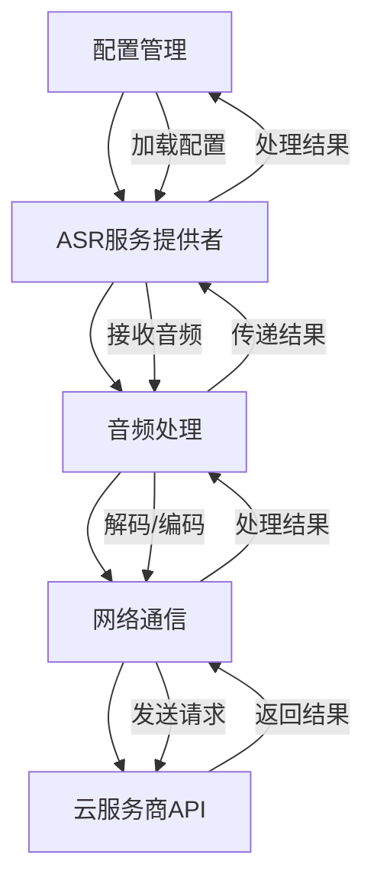
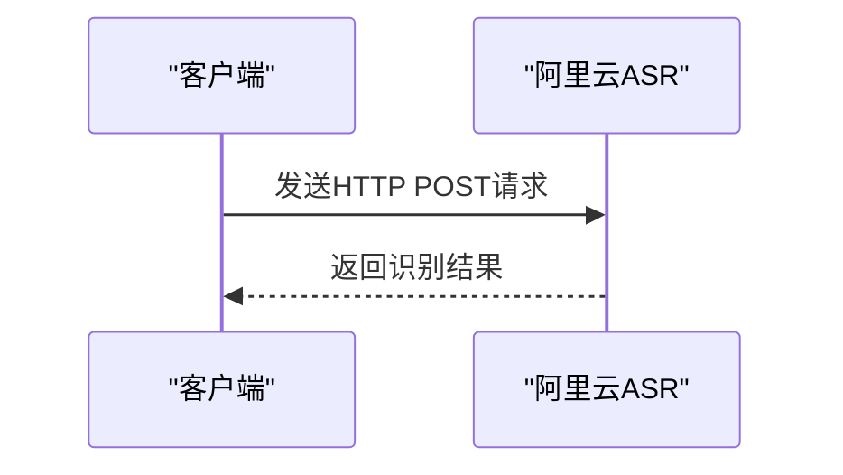
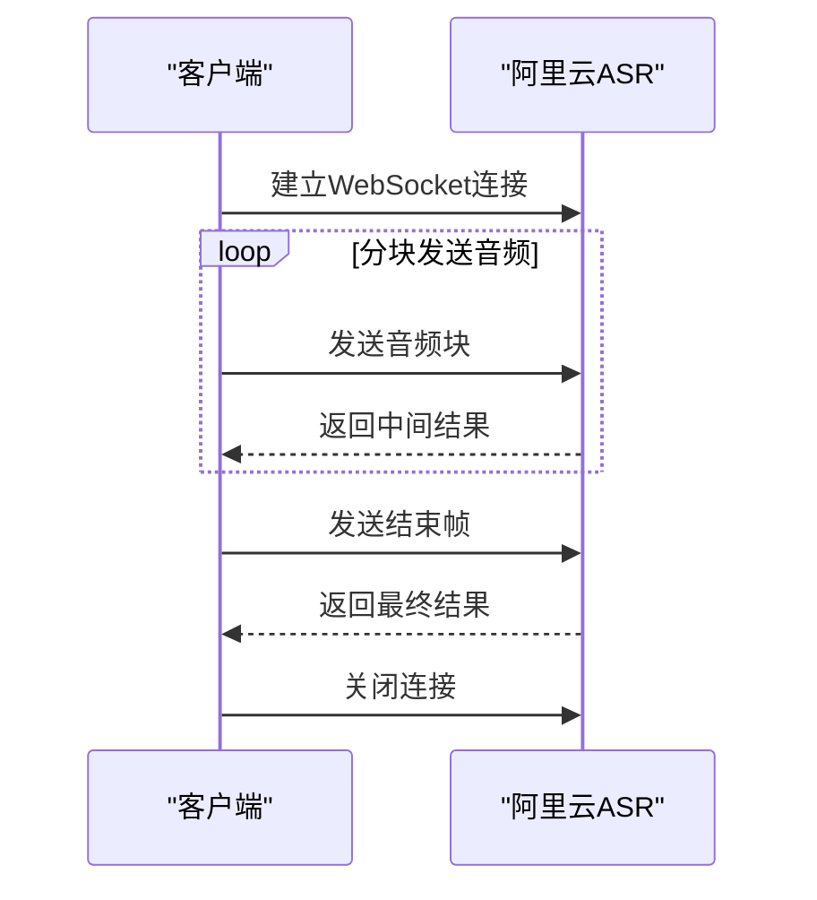
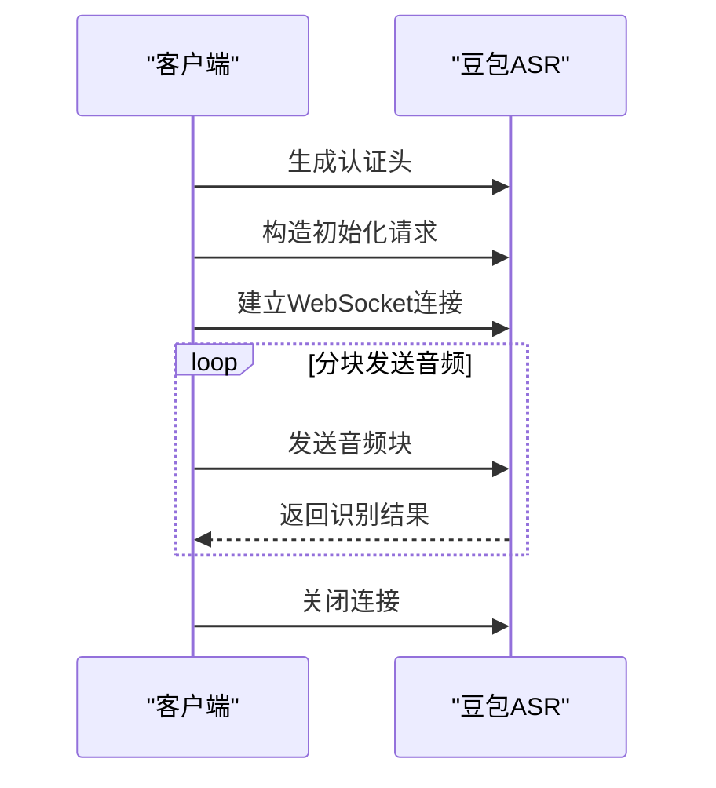
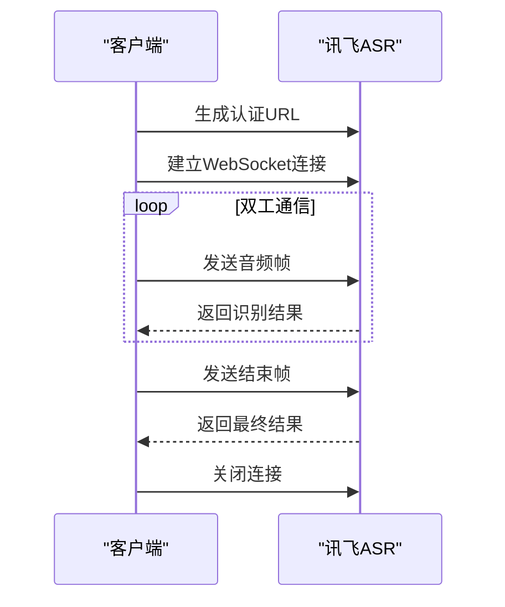
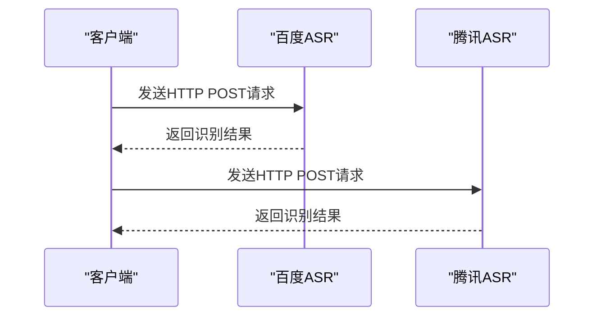
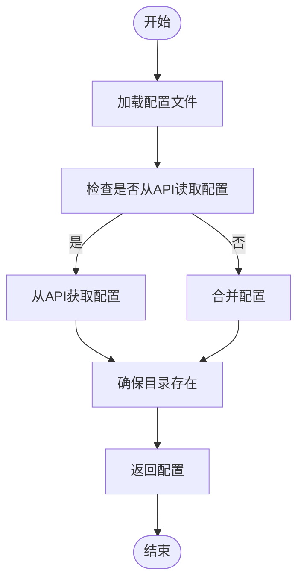
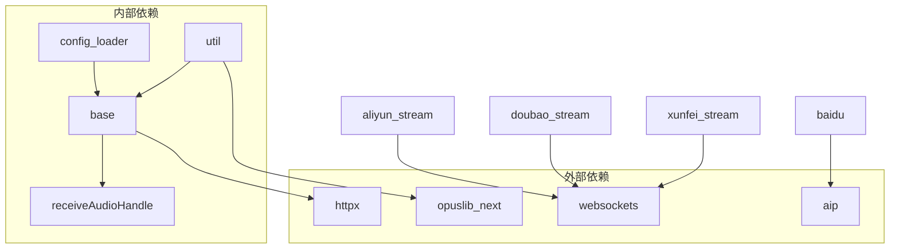

# 云端ASR服务

<cite>
**本文档引用的文件**   
- [aliyun.py](file://core/providers/asr/aliyun.py)
- [aliyun_stream.py](file://core/providers/asr/aliyun_stream.py)
- [baidu.py](file://core/providers/asr/baidu.py)
- [doubao_stream.py](file://core/providers/asr/doubao_stream.py)
- [tencent.py](file://core/providers/asr/tencent.py)
- [xunfei_stream.py](file://core/providers/asr/xunfei_stream.py)
- [base.py](file://core/providers/asr/base.py)
- [dto.py](file://core/providers/asr/dto/dto.py)
- [config.yaml](file://config.yaml)
- [config_loader.py](file://config/config_loader.py)
- [manage_api_client.py](file://config/manage_api_client.py)
- [receiveAudioHandle.py](file://core/handle/receiveAudioHandle.py)
- [util.py](file://core/utils/util.py)
</cite>

## 目录
1. [引言](#引言)
2. [项目结构](#项目结构)
3. [核心组件](#核心组件)
4. [架构概述](#架构概述)
5. [详细组件分析](#详细组件分析)
6. [依赖分析](#依赖分析)
7. [性能考量](#性能考量)
8. [故障排除指南](#故障排除指南)
9. [结论](#结论)

## 引言
本文档深入探讨了云端语音识别（ASR）服务的技术实现，重点介绍与阿里云、百度、豆包、讯飞、腾讯和OpenAI等主流云服务商的集成方案。文档详细解析了同步与流式两种模式的实现差异，特别是`aliyun.py`（非流式）与`aliyun_stream.py`（流式）在连接管理、认证机制和数据分块上的不同。同时，说明了`doubao_stream.py`如何通过WebSocket实现实时语音转写，以及`xunfei_stream.py`的双工通信协议实现。此外，文档还指导如何在`config.yaml`中配置各服务商的API密钥、AppID和区域参数，并对比分析各云端ASR服务的识别精度、网络延迟、成本和功能特性，提供故障转移和降级策略。

## 项目结构
项目采用模块化设计，主要分为配置、核心功能、模型、性能测试和插件等功能模块。核心功能模块`core`下包含`providers`子模块，专门用于管理不同云服务商的ASR、TTS和LLM服务。ASR服务的实现位于`core/providers/asr`目录下，每个服务商都有独立的Python文件，如`aliyun.py`、`baidu.py`等。

**图表来源**
- [aliyun.py](file://core/providers/asr/aliyun.py)
- [aliyun_stream.py](file://core/providers/asr/aliyun_stream.py)
- [baidu.py](file://core/providers/asr/baidu.py)
- [doubao_stream.py](file://core/providers/asr/doubao_stream.py)
- [tencent.py](file://core/providers/asr/tencent.py)
- [xunfei_stream.py](file://core/providers/asr/xunfei_stream.py)
- [base.py](file://core/providers/asr/base.py)
- [dto.py](file://core/providers/asr/dto/dto.py)
- [config_loader.py](file://config/config_loader.py)
- [config.yaml](file://config.yaml)
- [receiveAudioHandle.py](file://core/handle/receiveAudioHandle.py)

**章节来源**
- [core/providers/asr](file://core/providers/asr)
- [config](file://config)
- [config.yaml](file://config.yaml)

## 核心组件
云端ASR服务的核心组件包括ASR服务提供者基类`ASRProviderBase`、各云服务商的具体实现类以及配置管理模块。`ASRProviderBase`定义了所有ASR服务提供者的公共接口和基础功能，如音频接收、语音停止处理和声纹识别并行处理等。各云服务商的实现类继承自`ASRProviderBase`，并根据各自API的特点实现具体的语音识别逻辑。

**章节来源**
- [base.py](file://core/providers/asr/base.py)
- [aliyun.py](file://core/providers/asr/aliyun.py)
- [aliyun_stream.py](file://core/providers/asr/aliyun_stream.py)
- [baidu.py](file://core/providers/asr/baidu.py)
- [doubao_stream.py](file://core/providers/asr/doubao_stream.py)
- [tencent.py](file://core/providers/asr/tencent.py)
- [xunfei_stream.py](file://core/providers/asr/xunfei_stream.py)

## 架构概述
系统架构采用分层设计，上层为配置管理模块，负责加载和合并配置文件；中层为ASR服务提供者层，实现与各云服务商的集成；底层为音频处理和网络通信层，负责音频数据的解码、编码和传输。系统通过`config_loader.py`加载`config.yaml`中的配置，初始化相应的ASR服务提供者，并通过`receiveAudioHandle.py`处理音频流。

**图表来源**
- [config_loader.py](file://config/config_loader.py)
- [base.py](file://core/providers/asr/base.py)
- [receiveAudioHandle.py](file://core/handle/receiveAudioHandle.py)
- [util.py](file://core/utils/util.py)

**章节来源**
- [config_loader.py](file://config/config_loader.py)
- [base.py](file://core/providers/asr/base.py)
- [receiveAudioHandle.py](file://core/handle/receiveAudioHandle.py)
- [util.py](file://core/utils/util.py)

## 详细组件分析

### 阿里云ASR服务分析
阿里云ASR服务分为非流式和流式两种模式。非流式模式通过`aliyun.py`实现，使用HTTP POST请求一次性发送音频数据；流式模式通过`aliyun_stream.py`实现，使用WebSocket协议分块发送音频数据。

#### 非流式模式

**图表来源**
- [aliyun.py](file://core/providers/asr/aliyun.py)

#### 流式模式

**图表来源**
- [aliyun_stream.py](file://core/providers/asr/aliyun_stream.py)

### 豆包ASR服务分析
豆包ASR服务通过`doubao_stream.py`实现，使用WebSocket协议进行实时语音转写。服务端通过`token_auth`方法生成认证头，客户端通过`construct_request`方法构造初始化请求。

**图表来源**
- [doubao_stream.py](file://core/providers/asr/doubao_stream.py)

### 讯飞ASR服务分析
讯飞ASR服务通过`xunfei_stream.py`实现，使用双工通信协议。客户端通过`create_url`方法生成认证URL，服务端通过`_send_audio_frame`方法发送音频帧。

**图表来源**
- [xunfei_stream.py](file://core/providers/asr/xunfei_stream.py)

### 百度和腾讯ASR服务分析
百度和腾讯ASR服务均采用非流式模式，通过HTTP POST请求发送音频数据。百度使用`aip`库进行API调用，腾讯使用自定义的认证机制。

**图表来源**
- [baidu.py](file://core/providers/asr/baidu.py)
- [tencent.py](file://core/providers/asr/tencent.py)

**章节来源**
- [aliyun.py](file://core/providers/asr/aliyun.py)
- [aliyun_stream.py](file://core/providers/asr/aliyun_stream.py)
- [baidu.py](file://core/providers/asr/baidu.py)
- [doubao_stream.py](file://core/providers/asr/doubao_stream.py)
- [tencent.py](file://core/providers/asr/tencent.py)
- [xunfei_stream.py](file://core/providers/asr/xunfei_stream.py)

### 配置管理分析
配置管理模块负责加载和合并配置文件，初始化ASR服务提供者。`config_loader.py`通过`load_config`方法加载`config.yaml`中的配置，`manage_api_client.py`通过`init_service`方法初始化API客户端。

**图表来源**
- [config_loader.py](file://config/config_loader.py)
- [manage_api_client.py](file://config/manage_api_client.py)

**章节来源**
- [config_loader.py](file://config/config_loader.py)
- [manage_api_client.py](file://config/manage_api_client.py)

## 依赖分析
系统依赖主要分为内部依赖和外部依赖。内部依赖包括`config`、`core`、`models`等模块；外部依赖包括`httpx`、`websockets`、`opuslib_next`等库。

**图表来源**
- [config_loader.py](file://config/config_loader.py)
- [base.py](file://core/providers/asr/base.py)
- [receiveAudioHandle.py](file://core/handle/receiveAudioHandle.py)
- [util.py](file://core/utils/util.py)
- [aliyun.py](file://core/providers/asr/aliyun.py)
- [aliyun_stream.py](file://core/providers/asr/aliyun_stream.py)
- [baidu.py](file://core/providers/asr/baidu.py)
- [doubao_stream.py](file://core/providers/asr/doubao_stream.py)
- [tencent.py](file://core/providers/asr/tencent.py)
- [xunfei_stream.py](file://core/providers/asr/xunfei_stream.py)

**章节来源**
- [config_loader.py](file://config/config_loader.py)
- [base.py](file://core/providers/asr/base.py)
- [receiveAudioHandle.py](file://core/handle/receiveAudioHandle.py)
- [util.py](file://core/utils/util.py)
- [aliyun.py](file://core/providers/asr/aliyun.py)
- [aliyun_stream.py](file://core/providers/asr/aliyun_stream.py)
- [baidu.py](file://core/providers/asr/baidu.py)
- [doubao_stream.py](file://core/providers/asr/doubao_stream.py)
- [tencent.py](file://core/providers/asr/tencent.py)
- [xunfei_stream.py](file://core/providers/asr/xunfei_stream.py)

## 性能考量
系统在性能方面进行了多项优化，包括使用线程池并行处理ASR和声纹识别、使用缓存减少重复配置加载、使用WebSocket协议减少网络延迟等。此外，系统还提供了性能测试工具，可以对ASR、LLM、TTS等服务进行性能测试。

## 故障排除指南
常见问题包括配置错误、网络连接问题、API调用失败等。解决方法包括检查配置文件、检查网络连接、检查API密钥等。系统还提供了详细的日志记录，可以帮助定位问题。

**章节来源**
- [config_loader.py](file://config/config_loader.py)
- [manage_api_client.py](file://config/manage_api_client.py)
- [base.py](file://core/providers/asr/base.py)
- [util.py](file://core/utils/util.py)

## 结论
本文档详细介绍了云端ASR服务的技术实现，包括与各云服务商的集成方案、同步与流式模式的实现差异、配置管理、性能优化和故障排除等。通过本文档，开发者可以更好地理解和使用云端ASR服务，提高开发效率和系统性能。