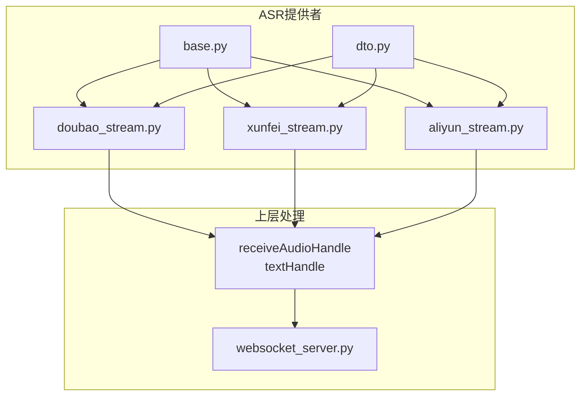
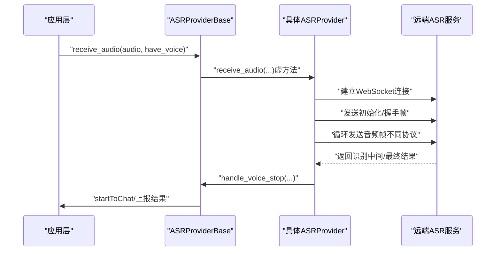
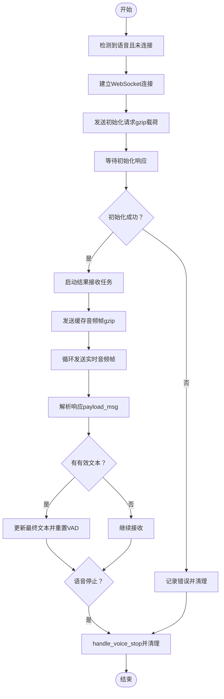
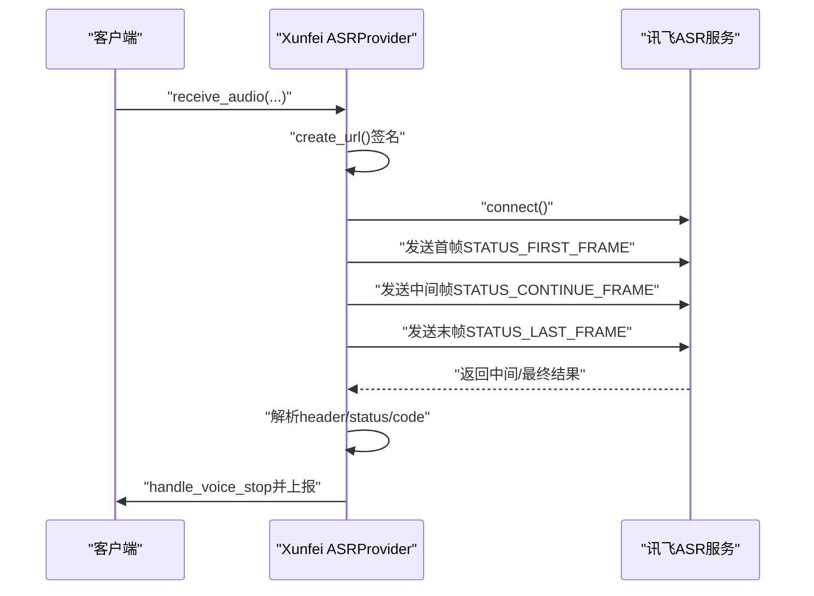
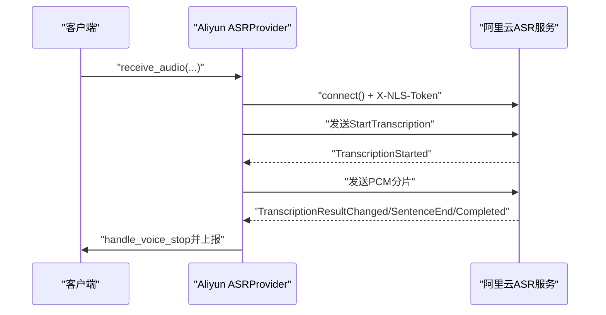
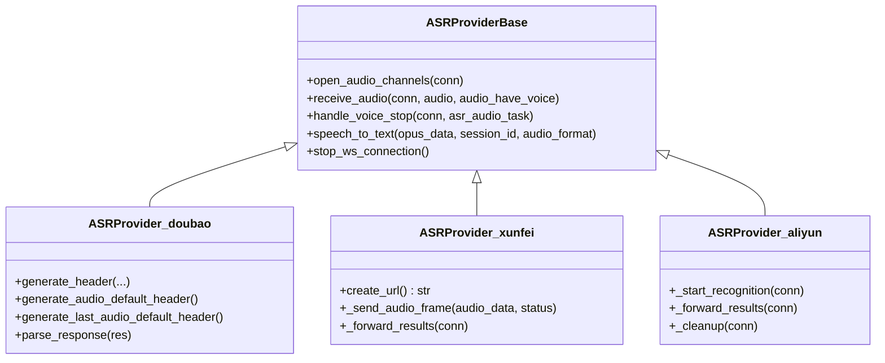

# 流式ASR协议实现

<cite>
**本文引用的文件列表**
- [doubao_stream.py](file://core/providers/asr/doubao_stream.py)
- [xunfei_stream.py](file://core/providers/asr/xunfei_stream.py)
- [aliyun_stream.py](file://core/providers/asr/aliyun_stream.py)
- [base.py](file://core/providers/asr/base.py)
- [dto.py](file://core/providers/asr/dto/dto.py)
- [performance_tester_stream_asr.py](file://performance_tester/performance_tester_stream_asr.py)
</cite>

## 目录
1. [引言](#引言)
2. [项目结构](#项目结构)
3. [核心组件](#核心组件)
4. [架构总览](#架构总览)
5. [详细组件分析](#详细组件分析)
6. [依赖关系分析](#依赖关系分析)
7. [性能考量](#性能考量)
8. [故障排查指南](#故障排查指南)
9. [结论](#结论)
10. [附录](#附录)

## 引言
本文件系统性解析三种主流云厂商的流式语音识别（ASR）协议实现，重点覆盖：
- 豆包（DouBao）基于WebSocket的自定义二进制帧头协议、GZIP压缩载荷与双工控制流程
- 讯飞（Xunfei）三阶段状态机（首帧/继续帧/末帧）与base64音频帧传输
- 阿里云（Aliyun）基于消息命名空间的握手与分片PCM流式传输
同时给出cluster/workflow/dwa等高级参数配置建议、异常处理最佳实践（重连、超时、资源清理）以及性能优化要点。

## 项目结构
围绕流式ASR的核心代码位于core/providers/asr目录，采用“按供应商分模块”的组织方式，并通过统一的抽象基类对接上层处理链路。

图表来源
- [doubao_stream.py](file://core/providers/asr/doubao_stream.py#L1-L60)
- [xunfei_stream.py](file://core/providers/asr/xunfei_stream.py#L1-L60)
- [aliyun_stream.py](file://core/providers/asr/aliyun_stream.py#L1-L60)
- [base.py](file://core/providers/asr/base.py#L1-L60)
- [dto.py](file://core/providers/asr/dto/dto.py#L1-L10)

章节来源
- [doubao_stream.py](file://core/providers/asr/doubao_stream.py#L1-L60)
- [xunfei_stream.py](file://core/providers/asr/xunfei_stream.py#L1-L60)
- [aliyun_stream.py](file://core/providers/asr/aliyun_stream.py#L1-L60)
- [base.py](file://core/providers/asr/base.py#L1-L60)
- [dto.py](file://core/providers/asr/dto/dto.py#L1-L10)

## 核心组件
- 抽象基类：统一接收音频、语音停止处理、并行执行ASR与声纹识别、通用OPUS解码与WAV导出
- 供应商实现：
  - Doubao：自定义二进制帧头、GZIP压缩、初始化请求、音频帧发送、结果解析与状态机
  - Xunfei：三阶段状态机（首帧/继续帧/末帧）、base64音频帧、动态超时与最终帧策略
  - Aliyun：消息命名空间握手、PCM分片直传、SentenceEnd/TranscriptionCompleted语义化结果

章节来源
- [base.py](file://core/providers/asr/base.py#L1-L120)
- [doubao_stream.py](file://core/providers/asr/doubao_stream.py#L1-L120)
- [xunfei_stream.py](file://core/providers/asr/xunfei_stream.py#L1-L120)
- [aliyun_stream.py](file://core/providers/asr/aliyun_stream.py#L1-L120)

## 架构总览
下图展示从音频采集到识别结果回传的关键交互路径，强调各供应商的差异化协议与控制流。

图表来源
- [base.py](file://core/providers/asr/base.py#L54-L120)
- [doubao_stream.py](file://core/providers/asr/doubao_stream.py#L70-L140)
- [xunfei_stream.py](file://core/providers/asr/xunfei_stream.py#L120-L210)
- [aliyun_stream.py](file://core/providers/asr/aliyun_stream.py#L150-L220)

## 详细组件分析

### 豆包（DouBao）流式ASR协议
- 自定义二进制帧头构造
  - 通过generate_header/generate_audio_default_header/generate_last_audio_default_header生成四字节消息头，包含版本、消息类型、序列化与压缩方式等字段
  - 音频帧头通过message_type=0x02区分，末帧通过message_type_specific_flags=0x02标记
- GZIP压缩载荷
  - 初始化请求体与音频帧均使用gzip压缩，载荷长度以4字节大端整型附加在帧头之后
- 双工控制流程
  - 首次检测到语音时建立连接，发送初始化请求并等待确认
  - 启动结果接收任务，解析payload_msg中的utterances，按definite=true的片段更新最终文本
  - 静默/无有效语音场景下，根据duration与文本长度做特殊处理并触发handle_voice_stop
  - 资源清理：close方法关闭WebSocket、取消任务、清空缓冲区

图表来源
- [doubao_stream.py](file://core/providers/asr/doubao_stream.py#L70-L232)
- [doubao_stream.py](file://core/providers/asr/doubao_stream.py#L280-L316)
- [doubao_stream.py](file://core/providers/asr/doubao_stream.py#L317-L354)

章节来源
- [doubao_stream.py](file://core/providers/asr/doubao_stream.py#L70-L232)
- [doubao_stream.py](file://core/providers/asr/doubao_stream.py#L280-L354)

### 讯飞（Xunfei）流式ASR协议
- URL签名认证
  - create_url通过HMAC-SHA256生成authorization，拼接为查询参数接入WebSocket
- 三阶段状态机
  - STATUS_FIRST_FRAME：发送首帧音频，标记server_ready
  - STATUS_CONTINUE_FRAME：持续发送中间音频帧
  - STATUS_LAST_FRAME：发送最后一帧，标记last_frame_sent
- base64音频帧传输
  - 每帧封装header/parameter/payload，payload.audio为base64编码的原始PCM
- 结果处理与超时策略
  - 根据header.status与header.code判断错误与完成状态
  - 未发送最终帧时延长recv超时，最终帧后缩短超时并优先使用best_text

图表来源
- [xunfei_stream.py](file://core/providers/asr/xunfei_stream.py#L61-L99)
- [xunfei_stream.py](file://core/providers/asr/xunfei_stream.py#L130-L210)
- [xunfei_stream.py](file://core/providers/asr/xunfei_stream.py#L181-L202)
- [xunfei_stream.py](file://core/providers/asr/xunfei_stream.py#L203-L361)

章节来源
- [xunfei_stream.py](file://core/providers/asr/xunfei_stream.py#L61-L99)
- [xunfei_stream.py](file://core/providers/asr/xunfei_stream.py#L130-L210)
- [xunfei_stream.py](file://core/providers/asr/xunfei_stream.py#L181-L202)
- [xunfei_stream.py](file://core/providers/asr/xunfei_stream.py#L203-L361)

### 阿里云（Aliyun）流式ASR协议
- 连接与认证
  - 通过HTTP接口获取Token，建立WebSocket连接时携带X-NLS-Token头
- 握手与分片传输
  - 先发送StartTranscription消息，等待TranscriptionStarted表示服务器就绪
  - 在server_ready后发送PCM分片，无需额外帧头
- 结果语义化
  - TranscriptionResultChanged为中间结果，SentenceEnd为最终句结束，TranscriptionCompleted为会话完成

图表来源
- [aliyun_stream.py](file://core/providers/asr/aliyun_stream.py#L160-L205)
- [aliyun_stream.py](file://core/providers/asr/aliyun_stream.py#L207-L268)

章节来源
- [aliyun_stream.py](file://core/providers/asr/aliyun_stream.py#L160-L205)
- [aliyun_stream.py](file://core/providers/asr/aliyun_stream.py#L207-L268)

### 三供应商协议对比与差异
- 连接管理
  - DouBao：首次有声即连接，连接后立即发送初始化请求
  - Xunfei：首次有声即连接，先发首帧再标记server_ready
  - Aliyun：先发Start消息，收到TranscriptionStarted后再发音频
- 数据分块策略
  - DouBao：自定义二进制帧头+gzip压缩，音频帧为原始PCM
  - Xunfei：base64 PCM，三阶段状态机
  - Aliyun：原始PCM分片直传
- 控制流程
  - DouBao：解析payload_msg中的utterances，按definite更新文本
  - Xunfei：依据header.status与header.code，最终帧后缩短超时并择优best_text
  - Aliyun：依据消息名语义推进（中间/最终/完成）

章节来源
- [doubao_stream.py](file://core/providers/asr/doubao_stream.py#L70-L140)
- [xunfei_stream.py](file://core/providers/asr/xunfei_stream.py#L130-L210)
- [aliyun_stream.py](file://core/providers/asr/aliyun_stream.py#L160-L205)

## 依赖关系分析
- 统一抽象
  - ASRProviderBase定义receive_audio与handle_voice_stop的通用流程，子类仅实现协议细节
- DTO约束
  - InterfaceType.STREAM限定流式接口类型
- 上层集成
  - base.py在handle_voice_stop中并行执行ASR与声纹识别，完成后上报

图表来源
- [base.py](file://core/providers/asr/base.py#L1-L120)
- [doubao_stream.py](file://core/providers/asr/doubao_stream.py#L280-L354)
- [xunfei_stream.py](file://core/providers/asr/xunfei_stream.py#L61-L202)
- [aliyun_stream.py](file://core/providers/asr/aliyun_stream.py#L160-L268)

章节来源
- [base.py](file://core/providers/asr/base.py#L1-L120)
- [dto.py](file://core/providers/asr/dto/dto.py#L1-L10)

## 性能考量
- 帧大小与时延
  - DouBao与Xunfei均以960样本（60ms）为一帧，减少往返延迟
- 压缩策略
  - DouBao与Xunfei对载荷进行gzip压缩，降低带宽占用
- 超时与重试
  - Doubao：WebSocket连接超时默认10秒；可结合max_retries与retry_delay进行重试
  - Xunfei：未发送最终帧时延长超时，最终帧后缩短超时并择优best_text
- 高级参数优化
  - cluster：指定集群，影响路由与可用性
  - workflow：流水线节点组合，如“audio_in,resample,partition,vad,fe,decode,itn,nlu_punctuate”
  - dwa：离线语法增强（讯飞），提升特定领域识别精度

章节来源
- [doubao_stream.py](file://core/providers/asr/doubao_stream.py#L29-L52)
- [doubao_stream.py](file://core/providers/asr/doubao_stream.py#L239-L270)
- [xunfei_stream.py](file://core/providers/asr/xunfei_stream.py#L50-L57)
- [performance_tester_stream_asr.py](file://performance_tester/performance_tester_stream_asr.py#L130-L179)
- [performance_tester_stream_asr.py](file://performance_tester/performance_tester_stream_asr.py#L330-L340)

## 故障排查指南
- 网络中断与重连
  - Doubao：捕获ConnectionClosed，设置is_processing=false并清理资源
  - Xunfei：捕获ConnectionClosed，清理forward_task与连接，必要时重试
  - Aliyun：捕获ConnectionClosed，发送StopTranscription并清理
- 超时控制
  - Doubao：recv默认阻塞，初始化阶段设置close_timeout；结果接收阶段按业务逻辑决定是否等待
  - Xunfei：未发送最终帧时recv超时延长至3.0s，最终帧后缩短至30.0s；超时后择优best_text
  - Aliyun：recv超时1.0s，按消息名推进状态
- 资源清理
  - 三供应商均提供close/_cleanup方法：关闭WebSocket、取消任务、清空缓冲区、重置状态
  - Doubao：stop_ws_connection异步关闭，避免阻塞主线程
  - Xunfei：显式发送STATUS_LAST_FRAME并sleep等待最终结果
  - Aliyun：发送StopTranscription后清理

章节来源
- [doubao_stream.py](file://core/providers/asr/doubao_stream.py#L158-L232)
- [xunfei_stream.py](file://core/providers/asr/xunfei_stream.py#L203-L391)
- [aliyun_stream.py](file://core/providers/asr/aliyun_stream.py#L207-L341)

## 结论
- DouBao提供最接近“自定义二进制帧头+gzip压缩”的协议，适合对延迟与带宽敏感的场景
- Xunfei采用标准三阶段状态机与base64音频帧，生态完善，支持dwa等增强参数
- Aliyun以消息命名空间驱动，协议清晰，适合需要严格语义化控制的场景
- 建议在生产环境结合cluster/workflow/dwa等参数进行A/B测试，配合完善的异常处理与资源清理策略，确保稳定性与低延迟

## 附录
- 配置参数参考
  - cluster：集群标识
  - workflow：流水线节点组合
  - dwa：离线语法增强（讯飞）
- 测试工具
  - performance_tester_stream_asr.py提供了DouBao与Xunfei的首词响应时间测试示例，便于对比不同供应商的延迟表现

章节来源
- [doubao_stream.py](file://core/providers/asr/doubao_stream.py#L29-L52)
- [doubao_stream.py](file://core/providers/asr/doubao_stream.py#L239-L270)
- [xunfei_stream.py](file://core/providers/asr/xunfei_stream.py#L50-L57)
- [performance_tester_stream_asr.py](file://performance_tester/performance_tester_stream_asr.py#L130-L179)
- [performance_tester_stream_asr.py](file://performance_tester/performance_tester_stream_asr.py#L330-L340)