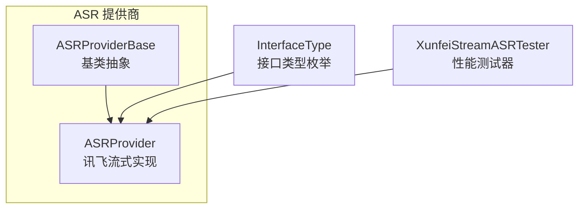
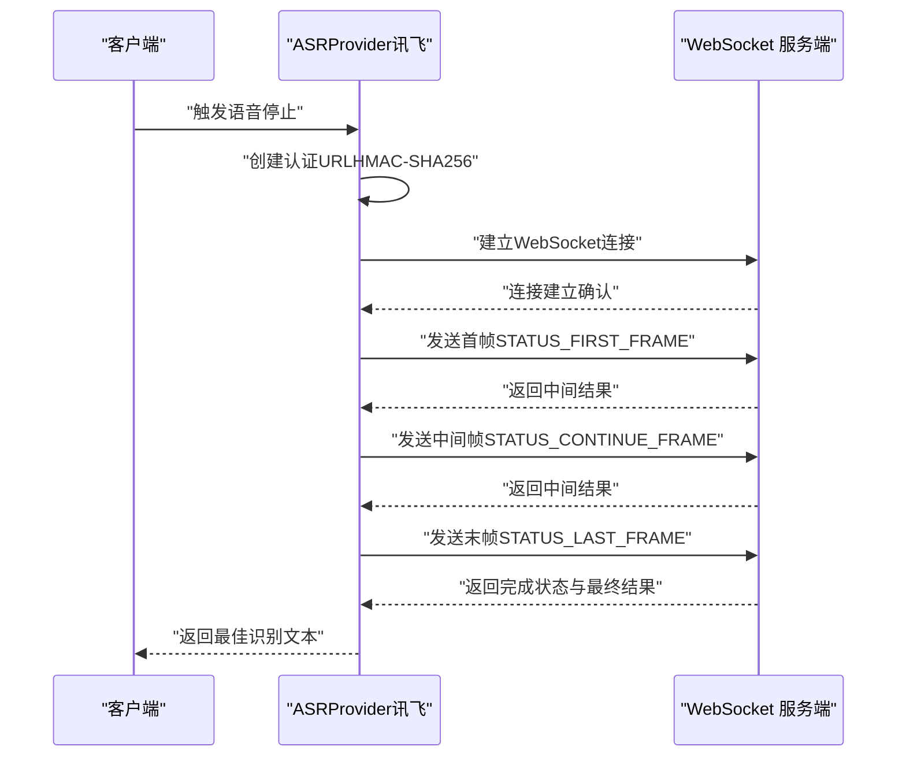
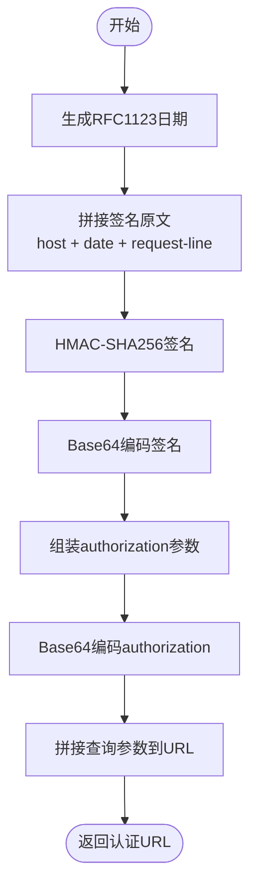
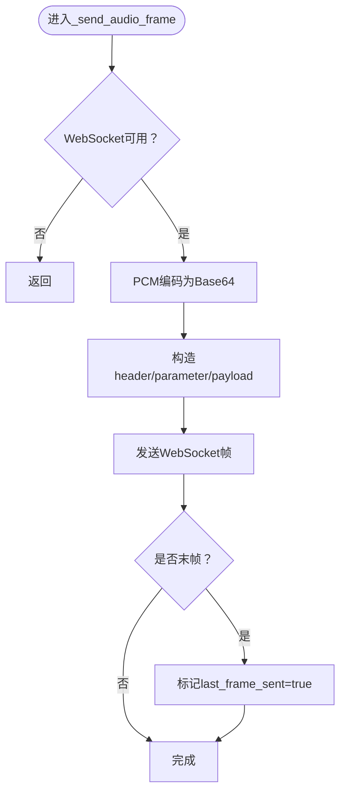
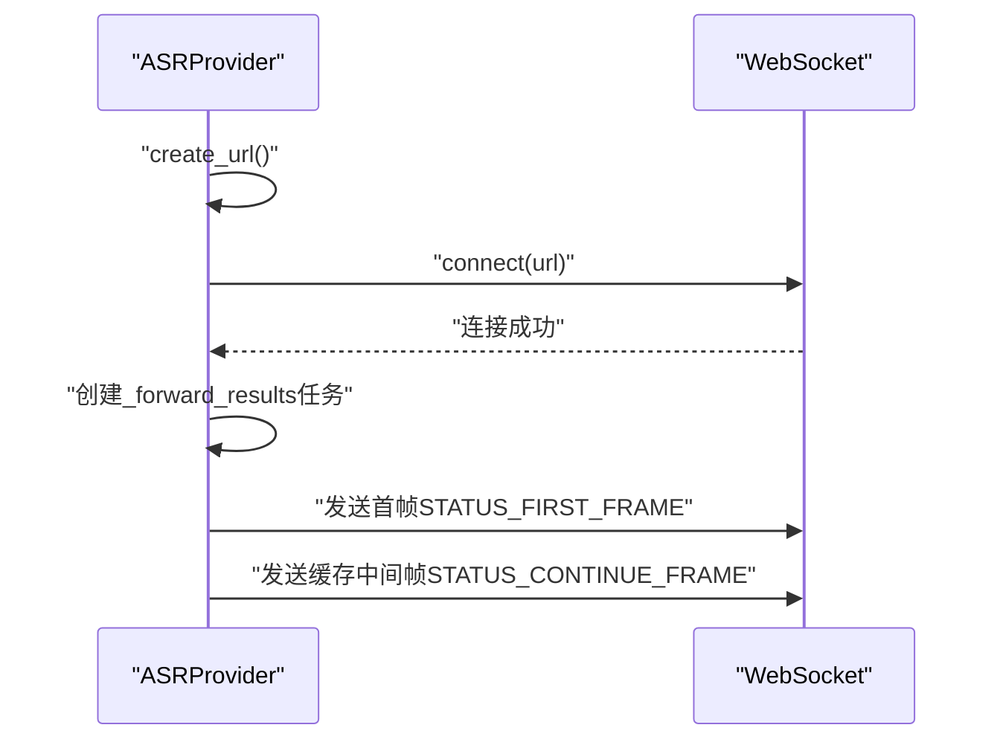
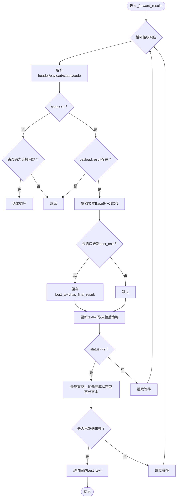
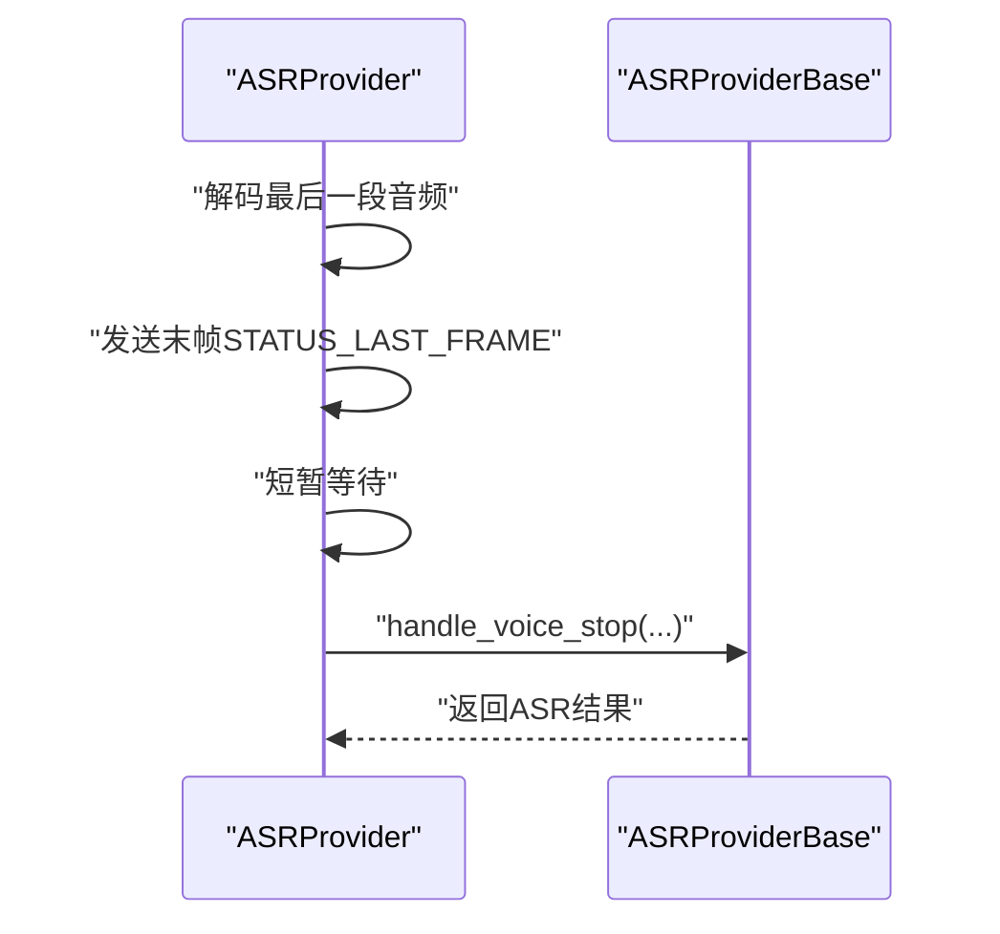
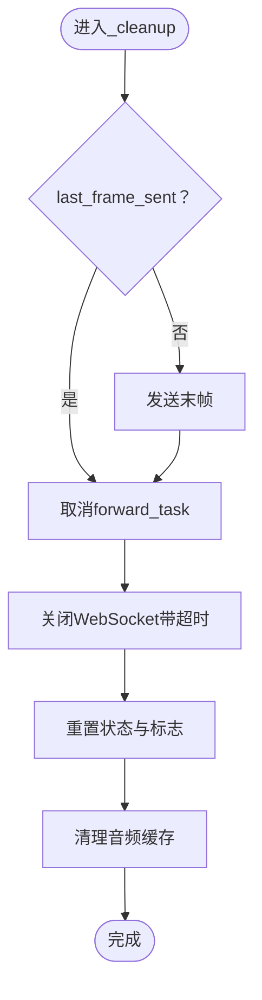
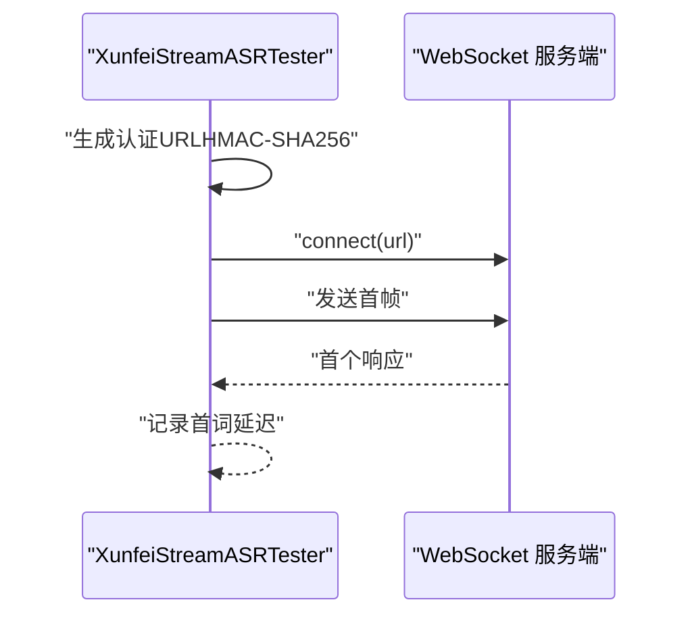
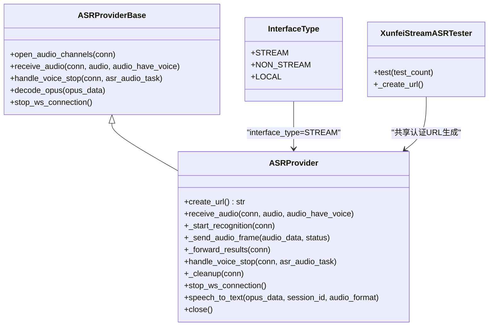

# 讯飞流式协议

<cite>
**本文引用的文件列表**
- [xunfei_stream.py](file://core/providers/asr/xunfei_stream.py)
- [base.py](file://core/providers/asr/base.py)
- [dto.py](file://core/providers/asr/dto/dto.py)
- [performance_tester_stream_asr.py](file://performance_tester/performance_tester_stream_asr.py)
</cite>

## 目录
1. [简介](#简介)
2. [项目结构](#项目结构)
3. [核心组件](#核心组件)
4. [架构总览](#架构总览)
5. [详细组件分析](#详细组件分析)
6. [依赖关系分析](#依赖关系分析)
7. [性能考量](#性能考量)
8. [故障排查指南](#故障排查指南)
9. [结论](#结论)
10. [附录](#附录)

## 简介
本文件系统性解析讯飞（Xunfei）流式语音识别服务的协议实现，围绕三阶段通信协议展开：
- 首先，通过 create_url 方法实现基于 HMAC-SHA256 的 WebSocket URL 签名认证，详细说明 host、date 和 request-line 等头部信息的拼接与加密过程；
- 其次，分析 _send_audio_frame 方法如何根据 STATUS_FIRST_FRAME、STATUS_CONTINUE_FRAME 和 STATUS_LAST_FRAME 状态机控制音频帧的传输，涵盖首帧携带识别参数、中间帧持续发送音频、末帧标记结束的完整流程；
- 再次，解析 _forward_results 方法中对服务端响应的处理策略，包括对 wpgs（流式标点）功能的支持，如何通过 best_text 和 has_final_result 机制在流式识别过程中选择最佳文本，并在超时或连接关闭时进行优雅降级；
- 结合 performance_tester_stream_asr.py 中的 XunfeiStreamASRTester 类，说明性能测试的实现方式；
- 最后，指导开发者如何配置 domain、dwa、language 等参数以适应不同场景，并提供网络中断重连和资源清理的实践指南。

## 项目结构
本项目采用分层与功能模块化组织，讯飞流式 ASR 的核心实现位于 core/providers/asr/xunfei_stream.py，基类抽象位于 core/providers/asr/base.py，接口类型枚举位于 core/providers/asr/dto/dto.py，性能测试位于 performance_tester/performance_tester_stream_asr.py。

图表来源
- [xunfei_stream.py](file://core/providers/asr/xunfei_stream.py#L1-L120)
- [base.py](file://core/providers/asr/base.py#L1-L120)
- [dto.py](file://core/providers/asr/dto/dto.py#L1-L10)
- [performance_tester_stream_asr.py](file://performance_tester/performance_tester_stream_asr.py#L268-L398)

章节来源
- [xunfei_stream.py](file://core/providers/asr/xunfei_stream.py#L1-L120)
- [base.py](file://core/providers/asr/base.py#L1-L120)
- [dto.py](file://core/providers/asr/dto/dto.py#L1-L10)
- [performance_tester_stream_asr.py](file://performance_tester/performance_tester_stream_asr.py#L268-L398)

## 核心组件
- ASRProvider（讯飞流式实现）
  - 负责 WebSocket URL 签名认证、音频帧发送、结果接收与处理、状态机控制、最佳文本选择与降级策略、资源清理与连接关闭。
- ASRProviderBase（基类）
  - 提供通用的音频队列处理、语音停止处理、并行执行 ASR 与声纹识别、WAV 转换、解码 OPUS、停止连接等能力。
- InterfaceType（接口类型枚举）
  - STREAM 表示流式接口，用于区分流式与非流式实现。
- XunfeiStreamASRTester（性能测试器）
  - 生成认证 URL、构造首帧、测量首词延迟，支持多轮测试与统计。

章节来源
- [xunfei_stream.py](file://core/providers/asr/xunfei_stream.py#L1-L120)
- [base.py](file://core/providers/asr/base.py#L1-L120)
- [dto.py](file://core/providers/asr/dto/dto.py#L1-L10)
- [performance_tester_stream_asr.py](file://performance_tester/performance_tester_stream_asr.py#L268-L398)

## 架构总览
下图展示讯飞流式 ASR 的端到端交互：客户端发起 WebSocket 连接，服务端返回识别结果，客户端根据状态机发送音频帧并处理流式文本。

图表来源
- [xunfei_stream.py](file://core/providers/asr/xunfei_stream.py#L130-L202)
- [xunfei_stream.py](file://core/providers/asr/xunfei_stream.py#L181-L202)
- [xunfei_stream.py](file://core/providers/asr/xunfei_stream.py#L203-L391)

## 详细组件分析

### 1. WebSocket URL 签名认证（create_url）
- 目标：生成符合讯飞要求的 WebSocket 认证 URL，使用 HMAC-SHA256 对“host/date/request-line”进行签名。
- 关键步骤：
  - 生成 RFC1123 格式的日期字符串；
  - 按固定顺序拼接签名原文（host、date、request-line）；
  - 使用 api_secret 对签名原文做 HMAC-SHA256，再进行 Base64 编码；
  - 组装 authorization 参数（包含 api_key、algorithm、headers、signature）并进行 Base64 编码；
  - 将 authorization、date、host 作为查询参数拼接到 ws://iat.cn-huabei-1.xf-yun.com/v1 上。
- 作用：确保 WebSocket 握手阶段的身份认证与完整性校验。

图表来源
- [xunfei_stream.py](file://core/providers/asr/xunfei_stream.py#L61-L99)

章节来源
- [xunfei_stream.py](file://core/providers/asr/xunfei_stream.py#L61-L99)

### 2. 音频帧发送与状态机（_send_audio_frame）
- 目标：根据状态机发送首帧、中间帧与末帧，控制识别生命周期。
- 状态常量：
  - STATUS_FIRST_FRAME：首帧，携带 iat 参数与首段音频；
  - STATUS_CONTINUE_FRAME：中间帧，持续发送音频；
  - STATUS_LAST_FRAME：末帧，标记识别结束。
- 发送流程：
  - 将 PCM 音频按 960 采样点（60ms）切片并 Base64 编码；
  - 构造 header（包含 status 与 app_id）、parameter（iat 参数）、payload（audio 字段）；
  - 发送 JSON 数据帧；
  - 若发送的是末帧，设置 last_frame_sent 标志。

图表来源
- [xunfei_stream.py](file://core/providers/asr/xunfei_stream.py#L181-L202)

章节来源
- [xunfei_stream.py](file://core/providers/asr/xunfei_stream.py#L181-L202)

### 3. 识别会话启动与首帧发送（_start_recognition）
- 目标：建立 WebSocket 连接，启动结果转发任务，并发送首帧音频。
- 关键行为：
  - 调用 create_url 生成认证 URL；
  - 建立 WebSocket 连接（设置最大包大小、禁用 ping、关闭超时）；
  - 创建 _forward_results 任务；
  - 解码首段音频并发送 STATUS_FIRST_FRAME；
  - 标记 server_ready，随后发送缓存的中间帧。

图表来源
- [xunfei_stream.py](file://core/providers/asr/xunfei_stream.py#L130-L170)
- [xunfei_stream.py](file://core/providers/asr/xunfei_stream.py#L130-L170)

章节来源
- [xunfei_stream.py](file://core/providers/asr/xunfei_stream.py#L130-L170)

### 4. 结果接收与处理（_forward_results）
- 目标：接收服务端响应，解析文本，维护 best_text 与 has_final_result，实现流式标点与最佳文本选择。
- 关键策略：
  - 超时控制：未发送末帧时使用较长超时，发送末帧后缩短超时；
  - 错误码处理：遇到特定错误码（如连接问题）提前退出；
  - 文本提取：从 payload.result.text 的 Base64 JSON 中提取 ws/cw/w；
  - 实时更新：在中间状态尽可能快地更新文本；
  - 最佳文本选择：
    - 若已发送末帧或收到完成状态，优先使用当前文本；
    - 否则在未收到最终结果前，选择更长的有效文本；
  - 末帧后的标点优化：对仅包含标点符号的文本进行追加而非替换，提升可读性；
  - 超时与连接关闭降级：若超时且存在 best_text，则回退到最佳文本；连接关闭时安全退出。
- 重要字段：
  - best_text：保存中间或最终阶段的最佳文本；
  - has_final_result：标记是否已收到最终结果；
  - last_frame_sent：标记是否已发送末帧。

图表来源
- [xunfei_stream.py](file://core/providers/asr/xunfei_stream.py#L203-L391)

章节来源
- [xunfei_stream.py](file://core/providers/asr/xunfei_stream.py#L203-L391)

### 5. 语音停止与末帧发送（handle_voice_stop）
- 目标：在语音停止时发送末帧，触发识别完成，并调用基类处理最终结果。
- 关键行为：
  - 解码最后一段音频并发送 STATUS_LAST_FRAME；
  - 短暂等待以便 _forward_results 处理最终结果；
  - 调用父类 handle_voice_stop，完成并行 ASR 与声纹识别、文本增强与上报。

图表来源
- [xunfei_stream.py](file://core/providers/asr/xunfei_stream.py#L404-L432)
- [base.py](file://core/providers/asr/base.py#L75-L179)

章节来源
- [xunfei_stream.py](file://core/providers/asr/xunfei_stream.py#L404-L432)
- [base.py](file://core/providers/asr/base.py#L75-L179)

### 6. 资源清理与连接关闭（_cleanup / stop_ws_connection / close）
- 目标：在异常或正常结束时，确保 WebSocket 关闭、任务取消、状态重置与内存清理。
- 关键行为：
  - 发送末帧（若尚未发送）；
  - 取消 forward_task 并等待；
  - 关闭 WebSocket 并捕获异常；
  - 清理连接的音频缓存与状态标志；
  - close 方法统一释放资源。

图表来源
- [xunfei_stream.py](file://core/providers/asr/xunfei_stream.py#L439-L495)

章节来源
- [xunfei_stream.py](file://core/providers/asr/xunfei_stream.py#L439-L495)

### 7. 性能测试（XunfeiStreamASRTester）
- 目标：测量讯飞流式 ASR 的首词延迟，评估网络与服务端响应性能。
- 关键行为：
  - 生成认证 URL（与服务端一致的签名算法）；
  - 加载测试音频（跳过 WAV 文件头），构造首帧；
  - 建立 WebSocket 连接并发送首帧；
  - 等待首个响应即刻记录延迟，支持多次测试与统计。

图表来源
- [performance_tester_stream_asr.py](file://performance_tester/performance_tester_stream_asr.py#L268-L398)

章节来源
- [performance_tester_stream_asr.py](file://performance_tester/performance_tester_stream_asr.py#L268-L398)

## 依赖关系分析
- ASRProvider 继承自 ASRProviderBase，复用音频队列、OPUS 解码、WAV 转换、并行处理与停止连接等通用能力；
- InterfaceType 为 STREAM，表明该实现面向流式接口；
- XunfeiStreamASRTester 与 ASRProvider 共享相同的认证 URL 生成逻辑，便于一致性测试。

图表来源
- [xunfei_stream.py](file://core/providers/asr/xunfei_stream.py#L1-L120)
- [base.py](file://core/providers/asr/base.py#L1-L120)
- [dto.py](file://core/providers/asr/dto/dto.py#L1-L10)
- [performance_tester_stream_asr.py](file://performance_tester/performance_tester_stream_asr.py#L268-L398)

章节来源
- [xunfei_stream.py](file://core/providers/asr/xunfei_stream.py#L1-L120)
- [base.py](file://core/providers/asr/base.py#L1-L120)
- [dto.py](file://core/providers/asr/dto/dto.py#L1-L10)
- [performance_tester_stream_asr.py](file://performance_tester/performance_tester_stream_asr.py#L268-L398)

## 性能考量
- 首词延迟测试：XunfeiStreamASRTester 通过发送首帧并等待首个响应来测量延迟，适合对比不同服务端的握手与首包处理性能。
- 超时策略：在未发送末帧时使用较长超时，发送末帧后缩短超时，有助于快速收敛结果并减少等待时间。
- 文本更新策略：中间状态尽可能快地更新文本，末帧后对仅含标点的文本进行追加，提升用户体验。
- 资源管理：及时取消任务、关闭连接、清理缓存，避免内存泄漏与资源占用。

[本节为通用建议，无需列出具体文件来源]

## 故障排查指南
- 认证失败
  - 检查 app_id、api_key、api_secret 是否齐全；
  - 确认 create_url 生成的 authorization 与 host/date/request-line 拼接正确；
  - 核对时间同步，确保 date 为有效 RFC1123 格式。
- 连接问题
  - 观察错误码，若为连接相关错误码，提前退出并清理；
  - 捕获 ConnectionClosed 异常，记录日志并安全退出；
  - 在 _cleanup 中确保发送末帧、关闭连接、取消任务与清理缓存。
- 结果为空或标点缺失
  - 检查 dwa 参数是否启用 wpgs；
  - 确认 _forward_results 对仅标点文本的追加策略；
  - 使用 best_text 与 has_final_result 作为回退依据。
- 超时与网络中断
  - 末帧发送后超时，回退到 best_text；
  - 网络中断时，确保 stop_ws_connection 与 close 正常执行。

章节来源
- [xunfei_stream.py](file://core/providers/asr/xunfei_stream.py#L203-L391)
- [xunfei_stream.py](file://core/providers/asr/xunfei_stream.py#L439-L495)

## 结论
本文系统解析了讯飞流式 ASR 的三阶段协议实现：认证 URL 生成、状态机驱动的音频帧发送、以及基于 best_text 与 has_final_result 的流式结果处理策略。配合性能测试器，可量化首词延迟并评估整体性能。通过合理的超时控制、标点优化与资源清理，可在复杂网络环境下实现稳定可靠的流式识别体验。

[本节为总结性内容，无需列出具体文件来源]

## 附录

### 参数配置指南（domain、dwa、language 等）
- domain：模型领域，默认 slm，可根据业务场景调整；
- language：语言代码，默认 zh_cn；
- accent：方言/口音，默认 mandarin；
- dwa：动态词典开关，建议启用 wpgs 以获得流式标点；
- result：输出格式配置，建议 utf8、raw、plain 以满足实时显示需求。

章节来源
- [xunfei_stream.py](file://core/providers/asr/xunfei_stream.py#L49-L56)
- [performance_tester_stream_asr.py](file://performance_tester/performance_tester_stream_asr.py#L330-L340)