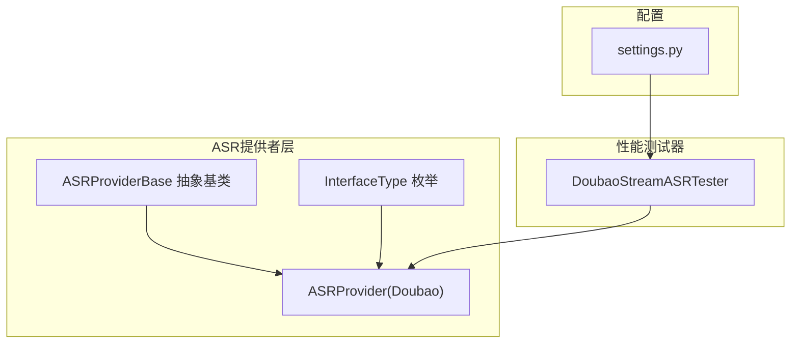
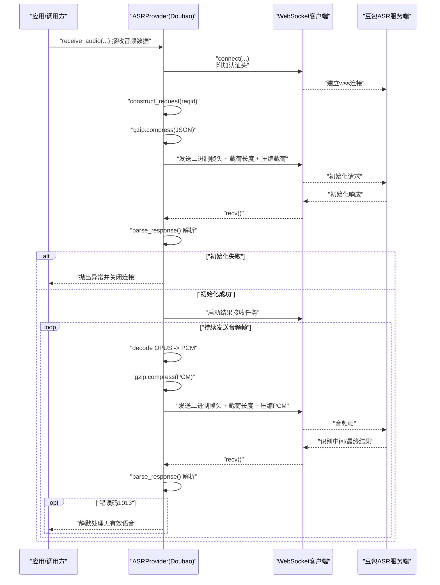
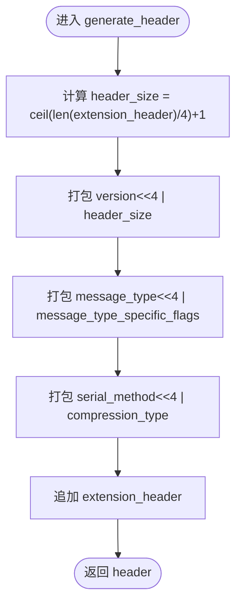
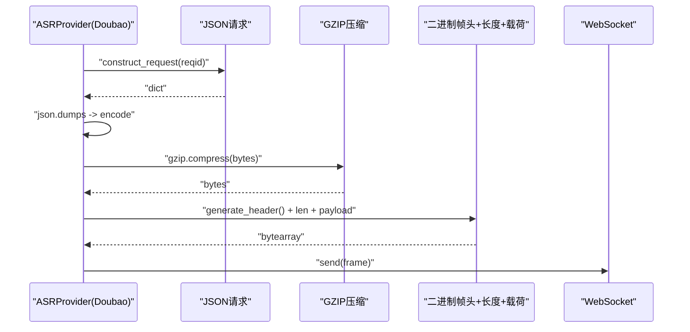
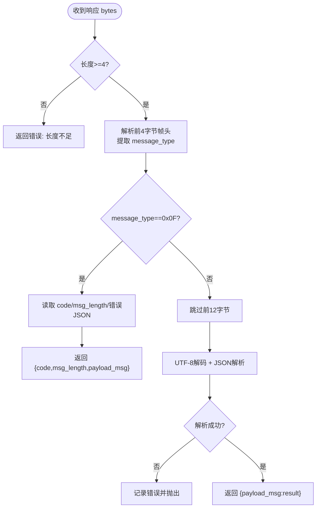
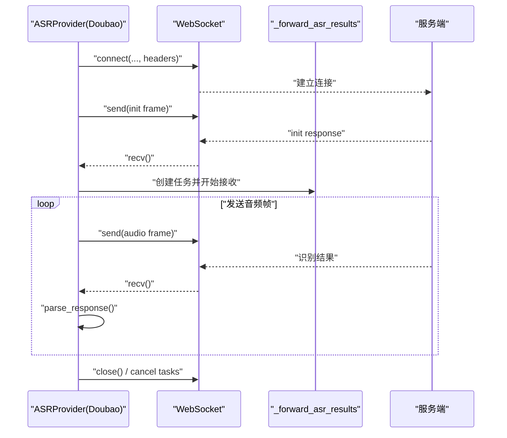
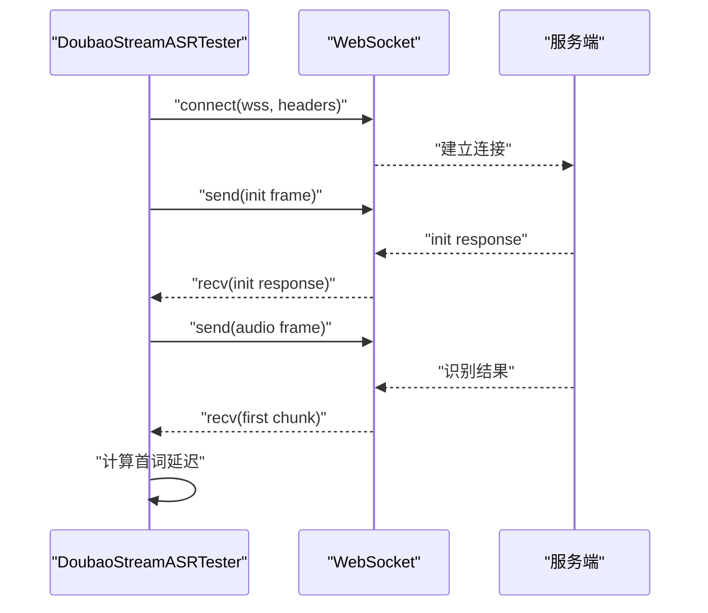
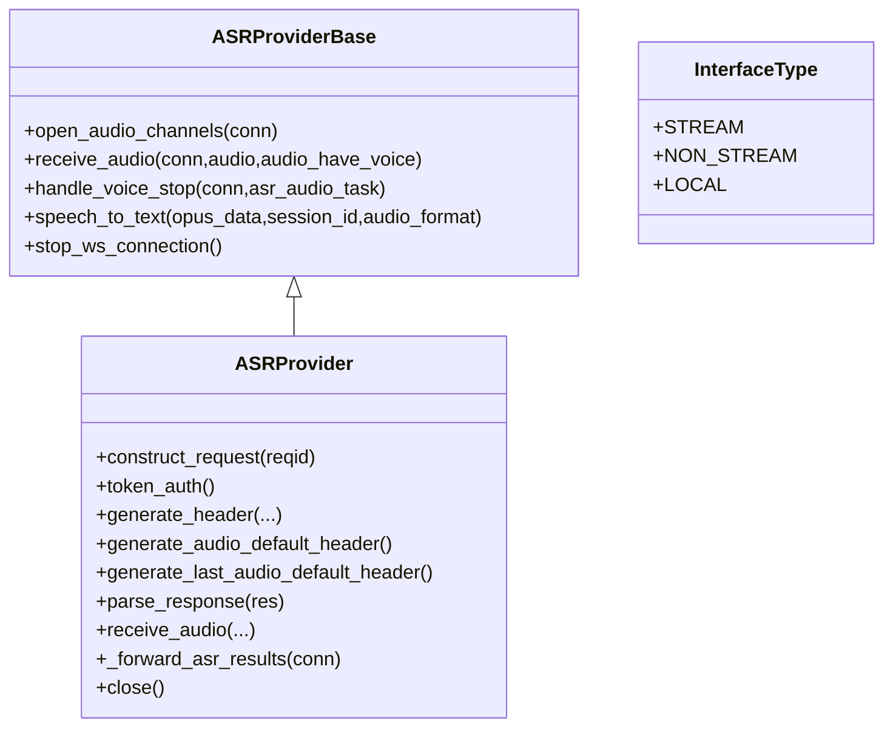

# 豆包流式协议

<cite>
**本文引用的文件列表**
- [doubao_stream.py](file://core/providers/asr/doubao_stream.py)
- [base.py](file://core/providers/asr/base.py)
- [dto.py](file://core/providers/asr/dto/dto.py)
- [performance_tester_stream_asr.py](file://performance_tester/performance_tester_stream_asr.py)
- [settings.py](file://config/settings.py)
</cite>

## 目录
1. [简介](#简介)
2. [项目结构与定位](#项目结构与定位)
3. [核心组件](#核心组件)
4. [架构总览](#架构总览)
5. [详细组件分析](#详细组件分析)
6. [依赖关系分析](#依赖关系分析)
7. [性能与优化建议](#性能与优化建议)
8. [故障排查指南](#故障排查指南)
9. [结论](#结论)
10. [附录](#附录)

## 简介
本文件面向开发者，系统性解析“豆包（Doubao）流式语音识别服务”的协议实现，围绕基于 WebSocket 的实时转写协议展开，重点覆盖：
- 自定义二进制帧头的构造机制与字段含义（版本、消息类型、序列化方法、压缩类型等）
- GZIP 压缩载荷的处理流程（从构造请求 JSON，到 gzip 压缩，再到二进制帧头封装发送）
- 服务端响应解析（parse_response），尤其是错误码处理（如 1000 表示成功，1013 表示无有效语音）
- 初始化连接、发送音频流与接收识别结果的完整交互时序（结合性能测试器中的 DoubaoStreamASRTester）
- 高级参数配置（workflow、cluster、boosting_table_name 等）对识别准确率的影响与最佳实践
- 连接超时、认证失败等异常情况的处理策略

## 项目结构与定位
- 豆包流式 ASR 实现位于核心 ASR 提供商模块中，采用继承抽象基类的方式接入整体语音处理流水线。
- DTO 中定义了接口类型枚举，用于区分流式与非流式接口。
- 性能测试器提供了独立的 DoubaoStreamASRTester，演示完整的握手、初始化、发送音频与首词延迟测量流程，便于开发者对照参考。

图表来源
- [doubao_stream.py](file://core/providers/asr/doubao_stream.py#L1-L120)
- [base.py](file://core/providers/asr/base.py#L1-L120)
- [dto.py](file://core/providers/asr/dto/dto.py#L1-L10)
- [performance_tester_stream_asr.py](file://performance_tester/performance_tester_stream_asr.py#L63-L185)
- [settings.py](file://config/settings.py#L1-L34)

章节来源
- [doubao_stream.py](file://core/providers/asr/doubao_stream.py#L1-L120)
- [base.py](file://core/providers/asr/base.py#L1-L120)
- [dto.py](file://core/providers/asr/dto/dto.py#L1-L10)
- [performance_tester_stream_asr.py](file://performance_tester/performance_tester_stream_asr.py#L63-L185)
- [settings.py](file://config/settings.py#L1-L34)

## 核心组件
- ASRProvider(Doubao)：实现豆包流式 ASR 的具体逻辑，包括 WebSocket 连接、初始化请求、音频帧发送、响应解析与错误处理。
- ASRProviderBase：抽象基类，提供通用的音频通道打开、音频队列处理、OPUS 解码、WAV 转换、并行处理 ASR 与声纹识别等能力。
- InterfaceType：接口类型枚举，标识 STREAM（流式）接口。
- DoubaoStreamASRTester：性能测试器中的独立类，演示完整的握手、初始化、发送音频与首词延迟测量流程，可作为对接参考。

章节来源
- [doubao_stream.py](file://core/providers/asr/doubao_stream.py#L1-L120)
- [base.py](file://core/providers/asr/base.py#L1-L120)
- [dto.py](file://core/providers/asr/dto/dto.py#L1-L10)
- [performance_tester_stream_asr.py](file://performance_tester/performance_tester_stream_asr.py#L63-L185)

## 架构总览
下图展示从应用层到豆包服务端的整体交互时序，涵盖握手、初始化、音频流发送与识别结果接收。

图表来源
- [doubao_stream.py](file://core/providers/asr/doubao_stream.py#L70-L232)
- [doubao_stream.py](file://core/providers/asr/doubao_stream.py#L239-L382)
- [performance_tester_stream_asr.py](file://performance_tester/performance_tester_stream_asr.py#L101-L185)

章节来源
- [doubao_stream.py](file://core/providers/asr/doubao_stream.py#L70-L232)
- [doubao_stream.py](file://core/providers/asr/doubao_stream.py#L239-L382)
- [performance_tester_stream_asr.py](file://performance_tester/performance_tester_stream_asr.py#L101-L185)

## 详细组件分析

### 二进制帧头构造与字段语义
- 版本（version）：占高 4 位，用于标识协议版本；实现中默认为 0x01。
- 头部大小（header_size）：由扩展头长度决定，按每 4 字节为一组计算，最小为 1。
- 消息类型（message_type）：占高 4 位，用于区分控制/初始化帧与音频数据帧；音频帧默认为 0x02。
- 消息类型特定标志（message_type_specific_flags）：用于区分普通音频帧与最后一帧（例如 0x02 表示最后一帧）。
- 序列化方法（serial_method）：占低 4 位，实现中固定为 0x01（JSON）。
- 压缩类型（compression_type）：占低 4 位，实现中固定为 0x01（GZIP）。
- 保留数据（reserved_data）：预留字段，实现中为 0x00。
- 扩展头（extension_header）：可选扩展字段，实现中未使用。

图表来源
- [doubao_stream.py](file://core/providers/asr/doubao_stream.py#L280-L316)

章节来源
- [doubao_stream.py](file://core/providers/asr/doubao_stream.py#L280-L316)

### 初始化请求与GZIP压缩载荷
- 构造请求：construct_request 生成 JSON 请求体，包含 app、user、request、audio 等字段。
- 压缩载荷：将 JSON 字符串编码为字节后，使用 gzip.compress 压缩。
- 封装发送：generate_header 生成二进制帧头，随后追加 4 字节的大端长度字段与压缩后的载荷，最后通过 WebSocket 发送。

图表来源
- [doubao_stream.py](file://core/providers/asr/doubao_stream.py#L239-L316)
- [doubao_stream.py](file://core/providers/asr/doubao_stream.py#L88-L109)

章节来源
- [doubao_stream.py](file://core/providers/asr/doubao_stream.py#L239-L316)
- [doubao_stream.py](file://core/providers/asr/doubao_stream.py#L88-L109)

### 响应解析与错误码处理
- 帧头解析：从响应字节中提取前 4 字节作为帧头，解析消息类型。
- 错误响应：当消息类型为 0x0F（SERVER_ERROR_RESPONSE）时，读取错误码、消息长度与 JSON 错误体。
- 正常响应：跳过前 12 字节（4 字节帧头 + 8 字节保留/长度），对剩余 UTF-8 字节进行 JSON 解析。
- 特殊错误码：1013 表示“无有效语音”，实现中对该错误码进行静默处理，不记录为错误日志；1000 表示成功，用于初始化阶段的校验。

图表来源
- [doubao_stream.py](file://core/providers/asr/doubao_stream.py#L317-L354)

章节来源
- [doubao_stream.py](file://core/providers/asr/doubao_stream.py#L317-L354)

### 音频帧发送与“最后一帧”标记
- generate_audio_default_header：用于普通音频帧，消息类型为 0x02，压缩与序列化方法均为 0x01。
- generate_last_audio_default_header：用于最后一帧，消息类型特定标志设置为 0x02，便于服务端识别结束。

章节来源
- [doubao_stream.py](file://core/providers/asr/doubao_stream.py#L299-L316)

### 初始化连接、发送音频与接收结果的交互时序
- 连接建立：根据配置选择认证方式（token），建立 wss 连接。
- 初始化：发送初始化请求（JSON -> GZIP -> 帧头封装），等待初始化响应并校验错误码。
- 结果接收：启动异步任务循环接收服务端响应，解析识别结果；遇到 1013 静默处理，遇到空文本且时长超过阈值时触发停止逻辑。
- 资源清理：关闭 WebSocket、取消任务、清空缓冲区。

图表来源
- [doubao_stream.py](file://core/providers/asr/doubao_stream.py#L70-L232)

章节来源
- [doubao_stream.py](file://core/providers/asr/doubao_stream.py#L70-L232)

### 性能测试器中的交互时序（参考）
- DoubaoStreamASRTester 展示了与服务端的完整握手、初始化、发送音频与首词延迟测量流程，可作为对接参考。

图表来源
- [performance_tester_stream_asr.py](file://performance_tester/performance_tester_stream_asr.py#L101-L185)

章节来源
- [performance_tester_stream_asr.py](file://performance_tester/performance_tester_stream_asr.py#L101-L185)

## 依赖关系分析
- ASRProvider(Doubao) 继承自 ASRProviderBase，复用音频队列、OPUS 解码、WAV 转换与并行处理能力。
- InterfaceType 枚举用于标识 STREAM 接口类型。
- 性能测试器 DoubaoStreamASRTester 独立于主流程，但遵循相同的帧头与压缩规范，便于对比与验证。

图表来源
- [base.py](file://core/providers/asr/base.py#L1-L268)
- [doubao_stream.py](file://core/providers/asr/doubao_stream.py#L1-L120)
- [dto.py](file://core/providers/asr/dto/dto.py#L1-L10)

章节来源
- [base.py](file://core/providers/asr/base.py#L1-L268)
- [doubao_stream.py](file://core/providers/asr/doubao_stream.py#L1-L120)
- [dto.py](file://core/providers/asr/dto/dto.py#L1-L10)

## 性能与优化建议
- 高级参数配置
  - workflow：控制预处理与后处理链路，如 audio_in,resample,partition,vad,fe,decode,itn,nlu_punctuate。可根据场景调整以平衡速度与准确率。
  - cluster：集群标识，用于路由与资源分配。
  - boosting_table_name/correct_table_name：用于提升特定词汇或纠正规则的识别效果，建议在领域词表丰富或口语化严重场景启用。
- 压缩与帧头
  - 使用 GZIP 压缩 JSON 初始化请求与音频帧，可显著降低带宽占用；确保服务端支持相同压缩方式。
- 时延优化
  - 首包延迟：性能测试器通过测量从发送音频到收到首个识别结果的时间评估首词延迟，建议在网络稳定、服务端负载适中的环境下测试。
- 稳定性
  - 对于长时间无有效语音（错误码 1013），实现中静默处理，避免误判为错误；对于空文本且时长超过阈值的情况，触发停止逻辑并重置 VAD 状态。

章节来源
- [doubao_stream.py](file://core/providers/asr/doubao_stream.py#L239-L316)
- [performance_tester_stream_asr.py](file://performance_tester/performance_tester_stream_asr.py#L101-L185)

## 故障排查指南
- 连接超时
  - WebSocket 连接设置了 close_timeout，若连接建立或初始化阶段超时，需检查网络、wss 地址与代理设置。
- 认证失败
  - token 认证头需正确设置（X-Api-App-Key、X-Api-Access-Key、X-Api-Resource-Id、X-Api-Connect-Id）。若服务端返回错误，检查密钥与资源 ID 是否匹配。
- 初始化失败
  - parse_response 在初始化阶段校验错误码，若非 1000，抛出异常并关闭连接；建议记录 payload_msg 中的错误详情以便定位。
- 无有效语音
  - 错误码 1013 为静默处理，无需报警；可适当调整 VAD 参数或提高说话人能量阈值。
- 响应解析失败
  - 若帧头长度不足或 JSON 解析失败，记录原始数据与十六进制以便诊断。

章节来源
- [doubao_stream.py](file://core/providers/asr/doubao_stream.py#L70-L232)
- [doubao_stream.py](file://core/providers/asr/doubao_stream.py#L317-L354)

## 结论
本文从代码层面系统梳理了豆包流式 ASR 的协议实现，重点覆盖了二进制帧头构造、GZIP 压缩与发送、响应解析与错误码处理，并结合性能测试器展示了完整的交互时序。开发者可据此快速对接，同时通过 workflow、cluster、boosting_table_name 等参数优化识别准确率，并掌握连接超时、认证失败等异常的最佳实践。

## 附录
- 相关文件路径与关键行号（仅列出与本文分析直接相关的部分）
  - [doubao_stream.py](file://core/providers/asr/doubao_stream.py#L239-L316)：初始化请求构造、帧头生成、音频帧发送
  - [doubao_stream.py](file://core/providers/asr/doubao_stream.py#L317-L354)：响应解析与错误码处理
  - [doubao_stream.py](file://core/providers/asr/doubao_stream.py#L70-L232)：连接建立、初始化、结果接收与清理
  - [base.py](file://core/providers/asr/base.py#L1-L268)：抽象基类与通用能力
  - [dto.py](file://core/providers/asr/dto/dto.py#L1-L10)：接口类型枚举
  - [performance_tester_stream_asr.py](file://performance_tester/performance_tester_stream_asr.py#L101-L185)：性能测试器交互时序
  - [settings.py](file://config/settings.py#L1-L34)：配置检查与加载