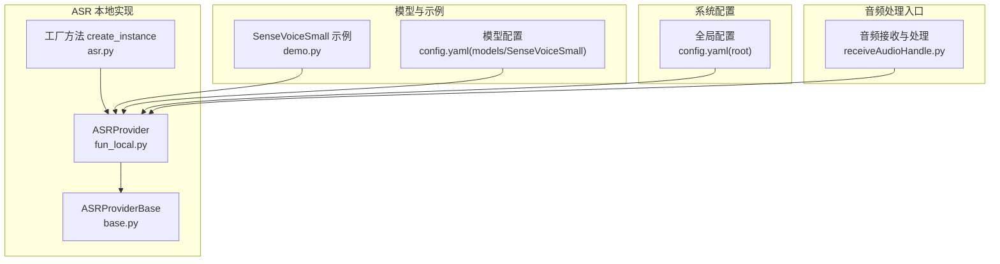
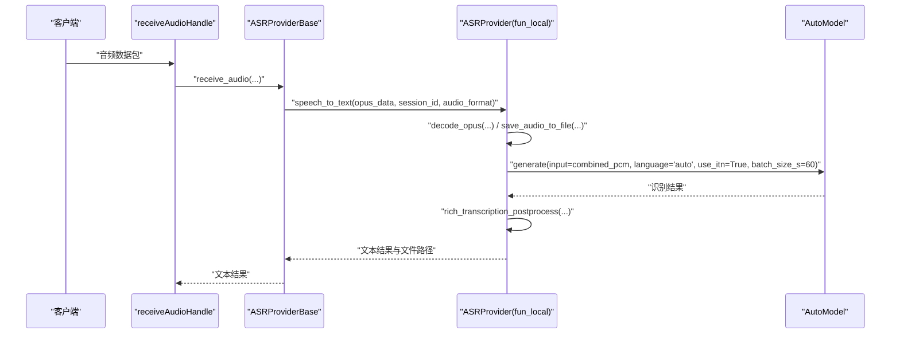
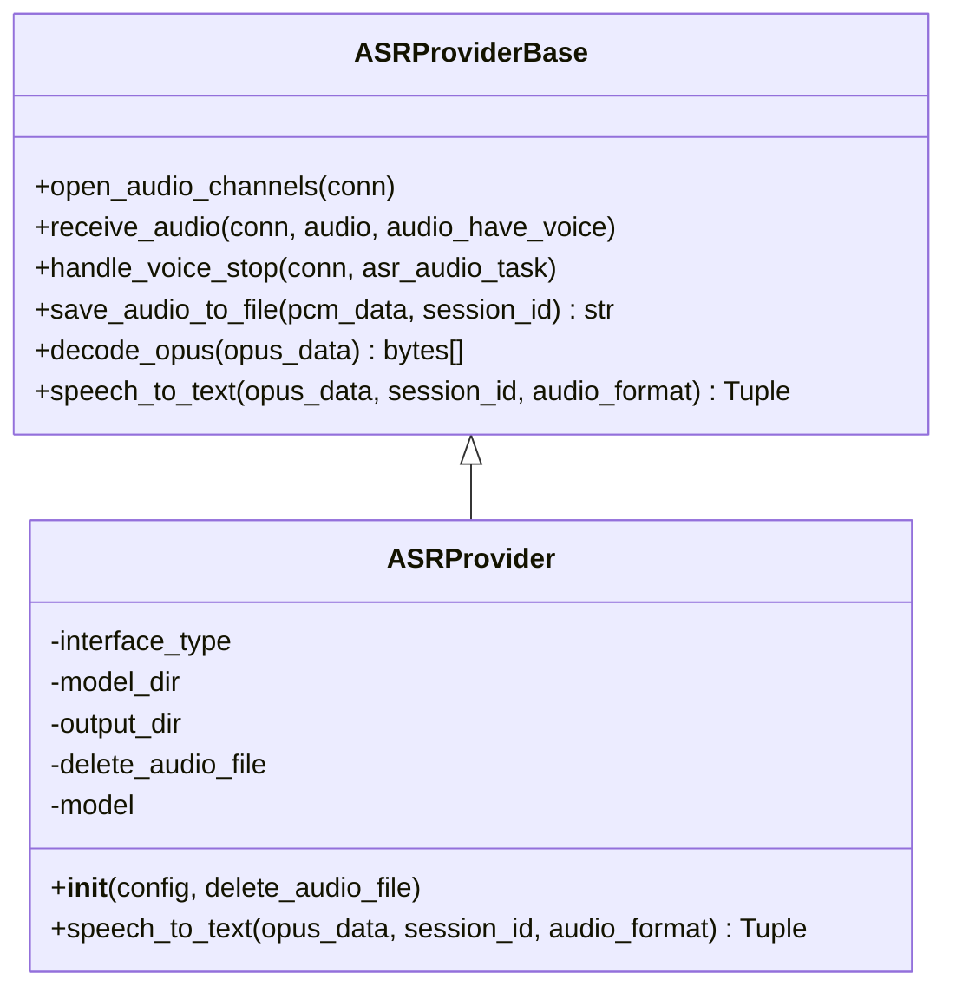
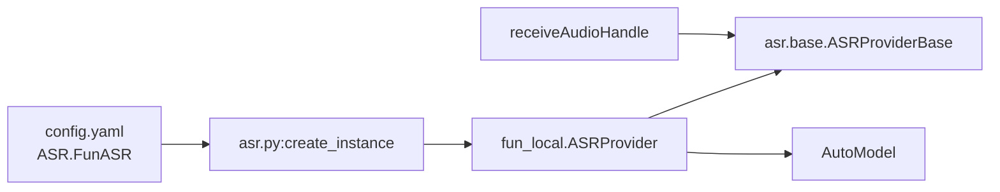

# FunASR 本地模型

<cite>
**本文引用的文件**
- [fun_local.py](file://core/providers/asr/fun_local.py)
- [base.py](file://core/providers/asr/base.py)
- [asr.py](file://core/utils/asr.py)
- [demo.py](file://models/SenseVoiceSmall/demo.py)
- [config.yaml](file://models/SenseVoiceSmall/config.yaml)
- [config.yaml](file://config.yaml)
- [receiveAudioHandle.py](file://core/handle/receiveAudioHandle.py)
</cite>

## 目录
1. [简介](#简介)
2. [项目结构](#项目结构)
3. [核心组件](#核心组件)
4. [架构总览](#架构总览)
5. [详细组件分析](#详细组件分析)
6. [依赖关系分析](#依赖关系分析)
7. [性能考虑](#性能考虑)
8. [故障排查指南](#故障排查指南)
9. [结论](#结论)
10. [附录](#附录)

## 简介
本文件面向开发者，系统性解析 FunASR 本地语音识别在本仓库中的实现与使用方式，重点围绕 ASRProvider 类（位于 fun_local.py）展开，涵盖：
- 基于 AutoModel 的模型加载流程
- 内存检测逻辑（要求≥2GB）
- 批量语音识别处理
- 通过配置文件配置 model_dir 与 output_dir
- delete_audio_file 选项对临时文件管理的影响
- decode_opus 与 save_audio_to_file 工具函数在音频预处理中的作用
- 结合 demo.py 示例，说明 SenseVoiceSmall 模型的推理配置（language='auto'、use_itn=True）
- 性能优化建议（GPU 加速 device='cuda:0'、batch_size_s 调优）
- 异常处理与自定义后处理逻辑

## 项目结构
FunASR 本地模型相关代码主要分布在以下位置：
- 本地 ASR 提供者实现：core/providers/asr/fun_local.py
- ASR 抽象基类与通用工具：core/providers/asr/base.py
- ASR 工厂方法：core/utils/asr.py
- SenseVoiceSmall 模型示例与配置：models/SenseVoiceSmall/demo.py、models/SenseVoiceSmall/config.yaml
- 全局配置：config.yaml
- 音频接收与处理入口：core/handle/receiveAudioHandle.py

图表来源
- [fun_local.py](file://core/providers/asr/fun_local.py#L1-L135)
- [base.py](file://core/providers/asr/base.py#L1-L268)
- [asr.py](file://core/utils/asr.py#L1-L24)
- [demo.py](file://models/SenseVoiceSmall/demo.py#L1-L28)
- [config.yaml](file://models/SenseVoiceSmall/config.yaml#L1-L98)
- [config.yaml](file://config.yaml#L277-L282)
- [receiveAudioHandle.py](file://core/handle/receiveAudioHandle.py#L1-L167)

章节来源
- [fun_local.py](file://core/providers/asr/fun_local.py#L1-L135)
- [base.py](file://core/providers/asr/base.py#L1-L268)
- [asr.py](file://core/utils/asr.py#L1-L24)
- [demo.py](file://models/SenseVoiceSmall/demo.py#L1-L28)
- [config.yaml](file://models/SenseVoiceSmall/config.yaml#L1-L98)
- [config.yaml](file://config.yaml#L277-L282)
- [receiveAudioHandle.py](file://core/handle/receiveAudioHandle.py#L1-L167)

## 核心组件
- ASRProvider（本地）：负责内存检测、模型加载、音频解码、磁盘空间检查、批量识别与后处理、临时文件清理。
- ASRProviderBase：提供抽象接口、通用音频解码与保存工具、并行处理框架。
- 工厂方法 create_instance：动态创建 ASRProvider 实例。
- SenseVoiceSmall 示例与配置：演示 AutoModel 初始化、推理参数与后处理。
- 全局配置：定义 ASR 本地模块的 model_dir、output_dir 等关键参数。

章节来源
- [fun_local.py](file://core/providers/asr/fun_local.py#L38-L135)
- [base.py](file://core/providers/asr/base.py#L234-L268)
- [asr.py](file://core/utils/asr.py#L16-L24)
- [demo.py](file://models/SenseVoiceSmall/demo.py#L1-L28)
- [config.yaml](file://config.yaml#L277-L282)

## 架构总览
本地 ASR 的调用链路如下：
- 音频数据由 receiveAudioHandle 接收并触发 ASRProviderBase 的 receive_audio 流程
- ASRProviderBase 将音频数据交给具体 Provider（ASRProvider）进行处理
- ASRProvider 完成 Opus 解码、磁盘空间检查、模型推理、后处理与临时文件管理

图表来源
- [receiveAudioHandle.py](file://core/handle/receiveAudioHandle.py#L13-L31)
- [base.py](file://core/providers/asr/base.py#L55-L112)
- [fun_local.py](file://core/providers/asr/fun_local.py#L64-L135)

## 详细组件分析

### ASRProvider 类实现机制
- 内存检测：启动时检查系统总内存是否≥2GB，不足则记录告警日志。
- 模型加载：通过 AutoModel 从 model_dir 加载 SenseVoiceSmall 模型，禁用更新，hub 指定为 hf。
- 音频处理：
  - decode_opus：将 Opus 数据包解码为 PCM 帧，支持跳过无效包并记录警告。
  - save_audio_to_file：将 PCM 数据保存为 WAV 文件，便于调试与复现。
- 批量识别：将多个音频片段合并为 PCM，调用 model.generate，设置 language='auto'、use_itn=True、batch_size_s=60。
- 磁盘空间检查：当 delete_audio_file=False 时，预留至少两倍 PCM 数据大小的空间，不足则抛出 OSError。
- 重试与异常：最多重试 MAX_RETRIES 次，捕获 OSError 与通用异常，记录错误并返回空结果。
- 临时文件清理：delete_audio_file=True 时，删除保存的临时 WAV 文件。

图表来源
- [base.py](file://core/providers/asr/base.py#L234-L268)
- [fun_local.py](file://core/providers/asr/fun_local.py#L38-L135)

章节来源
- [fun_local.py](file://core/providers/asr/fun_local.py#L38-L135)
- [base.py](file://core/providers/asr/base.py#L234-L268)

### 基于 AutoModel 的模型加载流程
- AutoModel 初始化：从 model_dir 指定的本地模型目录加载 SenseVoiceSmall，设置 hub='hf'，禁用更新。
- VAD 参数：max_single_segment_time=30000，限制单段最长时长。
- 设备选择：注释中给出 device='cuda:0' 的启用方式，便于 GPU 加速。

章节来源
- [fun_local.py](file://core/providers/asr/fun_local.py#L53-L63)
- [demo.py](file://models/SenseVoiceSmall/demo.py#L7-L13)

### 内存检测逻辑（≥2GB）
- 启动时读取系统总内存，若小于 2GB×1024×1024×1024 字节，记录错误日志，提示可能无法启动模型。

章节来源
- [fun_local.py](file://core/providers/asr/fun_local.py#L42-L47)

### 批量语音识别处理
- 输入：opus_data（Opus 数据包列表），audio_format 支持 pcm/opus。
- 处理：decode_opus 合并为 PCM，必要时保存为 WAV 文件，调用 model.generate，设置 language='auto'、use_itn=True、batch_size_s=60。
- 后处理：使用 rich_transcription_postprocess 对结果进行规范化处理。

章节来源
- [fun_local.py](file://core/providers/asr/fun_local.py#L64-L105)
- [demo.py](file://models/SenseVoiceSmall/demo.py#L15-L26)

### 配置项说明：model_dir 与 output_dir
- model_dir：指向 SenseVoiceSmall 模型目录，用于 AutoModel 加载。
- output_dir：识别结果的临时文件输出目录，需存在且具备写权限。
- delete_audio_file：控制是否删除保存的临时 WAV 文件。

章节来源
- [config.yaml](file://config.yaml#L277-L282)
- [fun_local.py](file://core/providers/asr/fun_local.py#L48-L55)

### delete_audio_file 对临时文件管理的影响
- delete_audio_file=True：识别完成后删除临时 WAV 文件，节省磁盘空间。
- delete_audio_file=False：识别前检查磁盘剩余空间，预留至少两倍 PCM 数据大小，避免因磁盘不足导致失败。

章节来源
- [fun_local.py](file://core/providers/asr/fun_local.py#L81-L91)
- [fun_local.py](file://core/providers/asr/fun_local.py#L125-L135)

### decode_opus 与 save_audio_to_file 工具函数
- decode_opus：
  - 使用 opuslib_next Decoder，采样率 16kHz、单声道，帧大小 960（60ms）。
  - 跳过空包与解码错误，记录警告日志，保证后续处理稳定性。
- save_audio_to_file：
  - 将 PCM 数据写入 WAV 文件，单声道、16kHz、16 位采样，便于调试与回放。

章节来源
- [base.py](file://core/providers/asr/base.py#L241-L268)
- [base.py](file://core/providers/asr/base.py#L220-L233)

### 结合 demo.py 示例：SenseVoiceSmall 推理配置
- 模型初始化：AutoModel(model=model_dir, hub='hf', vad_kwargs={'max_single_segment_time': 30000}，禁用 device 参数。
- 推理参数：language='auto'、use_itn=True、batch_size_s=60、merge_vad=True、merge_length_s=15。
- 后处理：rich_transcription_postprocess 对结果进行规范化。

章节来源
- [demo.py](file://models/SenseVoiceSmall/demo.py#L1-L28)

## 依赖关系分析
- ASRProvider 继承自 ASRProviderBase，复用通用音频处理能力。
- 工厂方法 create_instance 动态导入模块并构造 ASRProvider 实例。
- 全局配置文件 config.yaml 定义 ASR 本地模块的类型与参数（model_dir、output_dir）。
- receiveAudioHandle 将音频数据交由 ASRProviderBase 处理，形成完整的识别链路。

图表来源
- [config.yaml](file://config.yaml#L277-L282)
- [asr.py](file://core/utils/asr.py#L16-L24)
- [fun_local.py](file://core/providers/asr/fun_local.py#L38-L135)
- [base.py](file://core/providers/asr/base.py#L1-L268)
- [receiveAudioHandle.py](file://core/handle/receiveAudioHandle.py#L13-L31)

章节来源
- [config.yaml](file://config.yaml#L277-L282)
- [asr.py](file://core/utils/asr.py#L16-L24)
- [fun_local.py](file://core/providers/asr/fun_local.py#L38-L135)
- [base.py](file://core/providers/asr/base.py#L1-L268)
- [receiveAudioHandle.py](file://core/handle/receiveAudioHandle.py#L13-L31)

## 性能考虑
- GPU 加速：在 AutoModel 初始化处注释了 device='cuda:0'，启用后可显著提升推理速度。建议在具备 CUDA 环境的机器上取消注释。
- 批处理参数：batch_size_s=60 表示按秒级批处理，适合长语音分段识别。可根据音频长度与显存情况调整。
- 磁盘空间：当 delete_audio_file=False 时，需预留至少两倍 PCM 数据大小的空间，避免因磁盘不足导致失败。
- 重试策略：MAX_RETRIES=2，RETRY_DELAY=1 秒，降低瞬时异常对整体吞吐的影响。

章节来源
- [fun_local.py](file://core/providers/asr/fun_local.py#L53-L63)
- [fun_local.py](file://core/providers/asr/fun_local.py#L81-L91)
- [fun_local.py](file://core/providers/asr/fun_local.py#L109-L124)

## 故障排查指南
- 模型加载失败：
  - 检查 model_dir 是否正确指向 SenseVoiceSmall 模型目录。
  - 确认 hub='hf' 与禁用更新配置符合预期。
  - 如需 GPU 加速，取消注释 device='cuda:0' 并确保环境满足 CUDA 需求。
- 磁盘空间不足：
  - 当 delete_audio_file=False 时，若磁盘剩余空间不足，将抛出 OSError。可通过增大磁盘容量或开启 delete_audio_file=True 来缓解。
- 内存不足：
  - 启动时若系统总内存小于 2GB，将记录错误日志。建议升级硬件或减少其他占用内存的进程。
- 临时文件删除失败：
  - 删除临时文件时若出现异常，会记录错误日志。可在 finally 分支外层增加重试或人工清理。
- 自定义后处理：
  - 可在 rich_transcription_postprocess 之后添加自定义逻辑，如标点规范化、敏感词过滤、多语言映射等。

章节来源
- [fun_local.py](file://core/providers/asr/fun_local.py#L42-L47)
- [fun_local.py](file://core/providers/asr/fun_local.py#L81-L91)
- [fun_local.py](file://core/providers/asr/fun_local.py#L110-L124)
- [fun_local.py](file://core/providers/asr/fun_local.py#L125-L135)

## 结论
本实现以 ASRProvider 为核心，结合 AutoModel 完成 SenseVoiceSmall 的本地推理，具备完善的内存与磁盘检测、重试与异常处理、临时文件管理与后处理能力。通过合理配置 model_dir、output_dir 与 delete_audio_file，并结合 GPU 加速与批处理参数调优，可在保证稳定性的同时获得良好的识别性能。

## 附录
- 配置文件位置与键名：
  - ASR 本地模块配置键：ASR.FunASR.type、model_dir、output_dir
  - 全局配置文件：config.yaml
- 示例模型配置：models/SenseVoiceSmall/config.yaml

章节来源
- [config.yaml](file://config.yaml#L277-L282)
- [config.yaml](file://models/SenseVoiceSmall/config.yaml#L1-L98)