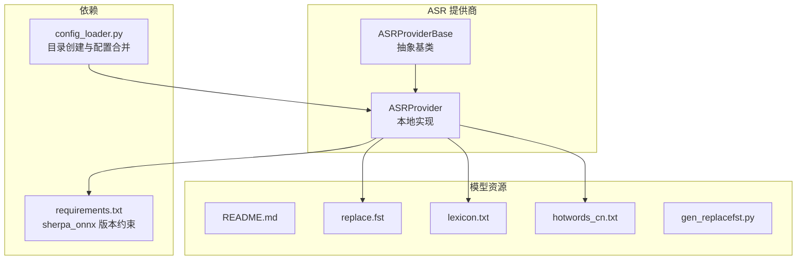
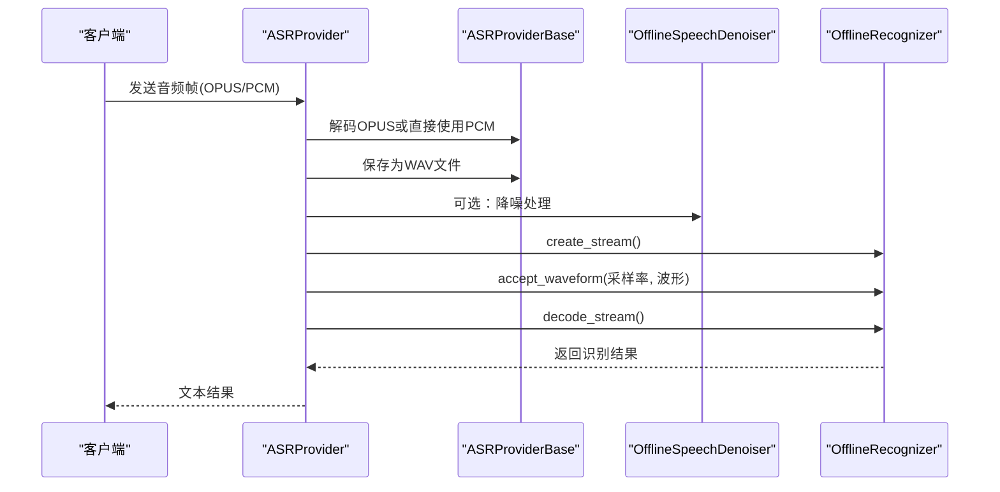
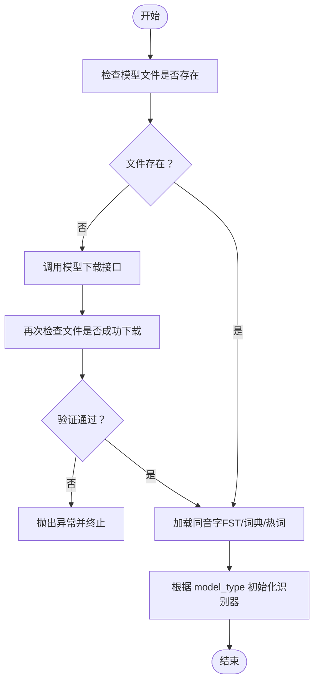
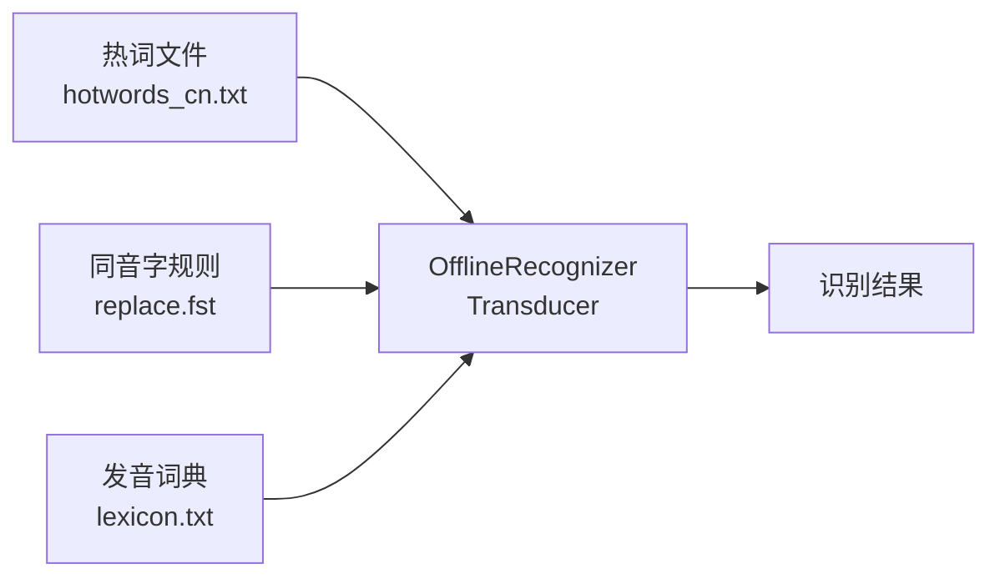
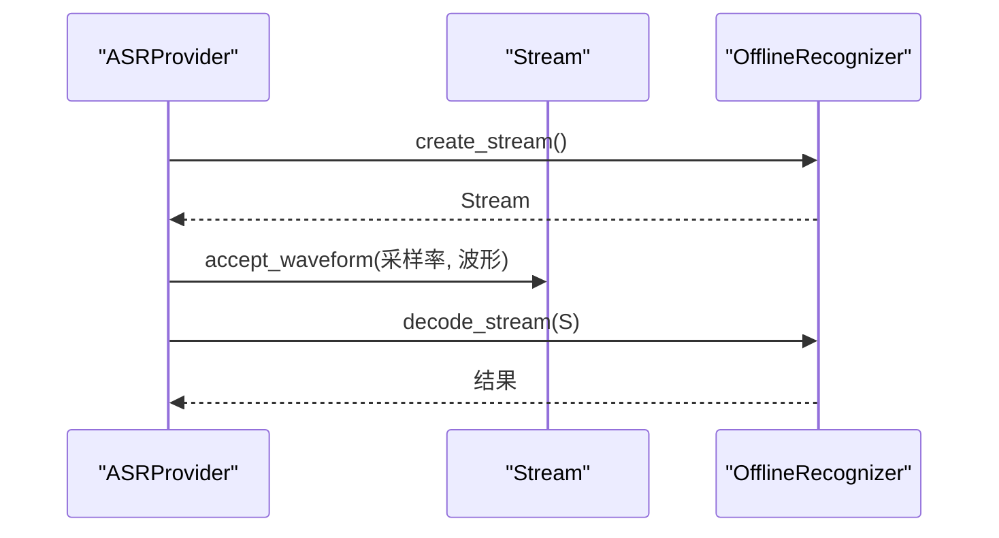
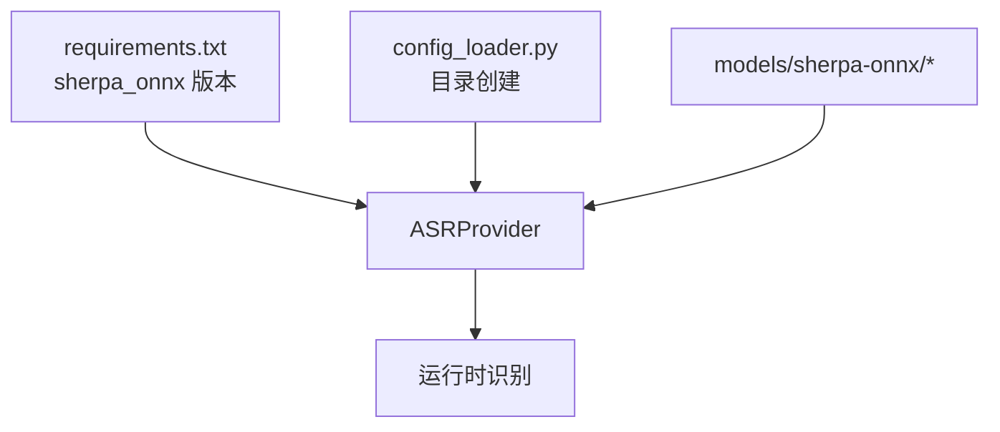

# Sherpa-ONNX 本地模型

<cite>
**本文引用的文件**
- [sherpa_onnx_local.py](file://core/providers/asr/sherpa_onnx_local.py)
- [base.py](file://core/providers/asr/base.py)
- [gen_replacefst.py](file://models/sherpa-onnx/gen_replacefst.py)
- [hotwords_cn.txt](file://models/sherpa-onnx/hotwords_cn.txt)
- [lexicon.txt](file://models/sherpa-onnx/lexicon.txt)
- [README.md](file://models/sherpa-onnx/README.md)
- [requirements.txt](file://requirements.txt)
- [config_loader.py](file://config/config_loader.py)
- [demo.py](file://models/SenseVoiceSmall/demo.py)
</cite>

## 目录
1. [简介](#简介)
2. [项目结构](#项目结构)
3. [核心组件](#核心组件)
4. [架构总览](#架构总览)
5. [组件详解](#组件详解)
6. [依赖关系分析](#依赖关系分析)
7. [性能与基准](#性能与基准)
8. [故障排查指南](#故障排查指南)
9. [结论](#结论)
10. [附录](#附录)

## 简介
本文件面向开发者，系统化梳理 Sherpa-ONNX 本地语音识别引擎在本仓库中的实现与使用方式，重点覆盖：
- 对 SenseVoice、Paraformer、Zipformer-CTC、Transducer 等多模型架构的支持机制
- 模型自动下载与本地路径校验逻辑
- model_type 配置项如何切换不同识别引擎
- 热词识别、同音字替换、发音词典的集成方法
- OfflineRecognizer.create_stream 的流式/非流式识别差异
- 语音降噪器的集成配置与性能建议
- 新模型类型扩展指引与常见问题处理

## 项目结构
围绕 ASR 提供商的本地实现，Sherpa-ONNX 相关代码集中在 ASR 提供商模块中，模型资源位于 models/sherpa-onnx 目录。整体组织采用“按功能域分层”的方式：核心业务逻辑在 providers/asr 下，模型资源与工具脚本在 models 目录。

图表来源
- [sherpa_onnx_local.py](file://core/providers/asr/sherpa_onnx_local.py#L1-L239)
- [base.py](file://core/providers/asr/base.py#L1-L268)
- [gen_replacefst.py](file://models/sherpa-onnx/gen_replacefst.py#L1-L36)
- [hotwords_cn.txt](file://models/sherpa-onnx/hotwords_cn.txt#L1-L3)
- [lexicon.txt](file://models/sherpa-onnx/lexicon.txt#L1-L200)
- [README.md](file://models/sherpa-onnx/README.md#L1-L3)
- [requirements.txt](file://requirements.txt#L1-L42)
- [config_loader.py](file://config/config_loader.py#L109-L151)

章节来源
- [sherpa_onnx_local.py](file://core/providers/asr/sherpa_onnx_local.py#L1-L239)
- [base.py](file://core/providers/asr/base.py#L1-L268)
- [requirements.txt](file://requirements.txt#L1-L42)

## 核心组件
- ASRProviderBase：统一的 ASR 抽象基类，负责音频通道打开、队列处理、OPUS 解码、WAV 保存、并发执行等通用能力。
- ASRProvider（本地实现）：继承自 ASRProviderBase，封装 Sherpa-ONNX 本地识别流程，包括模型下载与校验、模型类型切换、热词/同音字/词典集成、降噪器初始化、离线识别与结果返回。

章节来源
- [base.py](file://core/providers/asr/base.py#L1-L268)
- [sherpa_onnx_local.py](file://core/providers/asr/sherpa_onnx_local.py#L1-L239)

## 架构总览
Sherpa-ONNX 本地识别的整体流程如下：
- 输入音频（默认 OPUS，也可为 PCM）经解码后保存为 WAV
- 可选：调用离线降噪器对波形进行降噪
- 通过 OfflineRecognizer.create_stream() 创建识别流，喂入采样率与波形，执行解码，得到识别结果

图表来源
- [sherpa_onnx_local.py](file://core/providers/asr/sherpa_onnx_local.py#L183-L239)
- [base.py](file://core/providers/asr/base.py#L220-L268)

## 组件详解

### 模型自动下载与本地路径校验
- 自动下载：当模型目录缺少关键文件（如 model.int8.onnx、tokens.txt）时，通过模型中心接口进行下载，并写入指定本地目录。
- 路径校验：下载完成后再次检查文件是否存在，若仍不存在则抛出异常，确保后续初始化不会失败。
- 资源定位：除模型文件外，还加载同音字替换规则 replace.fst、发音词典 lexicon.txt、热词 hotwords_cn.txt。

图表来源
- [sherpa_onnx_local.py](file://core/providers/asr/sherpa_onnx_local.py#L45-L81)
- [sherpa_onnx_local.py](file://core/providers/asr/sherpa_onnx_local.py#L74-L76)

章节来源
- [sherpa_onnx_local.py](file://core/providers/asr/sherpa_onnx_local.py#L45-L81)
- [sherpa_onnx_local.py](file://core/providers/asr/sherpa_onnx_local.py#L74-L76)

### model_type 配置与模型切换机制
- 支持的模型类型：
  - sense_voice：使用 SenseVoice 模型
  - paraformer：使用 Paraformer 模型
  - zipformer_ctc：使用 Zipformer CTC 模型
  - transducer：使用 Transducer 模型（支持热词）
- 切换逻辑：根据配置中的 model_type 字段选择对应的 OfflineRecognizer 构造函数，传入相应参数（如 tokens、采样率、特征维度、解码策略、provider、语言等），并可启用同音字替换与词典。

章节来源
- [sherpa_onnx_local.py](file://core/providers/asr/sherpa_onnx_local.py#L84-L143)

### 热词识别、同音字替换与发音词典集成
- 热词：在 Transducer 模型初始化时通过 hotwords_file 与 hotwords_score 参数启用；热词文件示例见 hotwords_cn.txt。
- 同音字替换：通过 replace.fst 规则文件在解码阶段对候选进行同音替换，提升识别鲁棒性。
- 发音词典：通过 lexicon.txt 提供字符到音素的映射，辅助解码与后处理。
- 规则生成：gen_replacefst.py 展示了如何基于 pynini 构建替换规则并写入 replace.fst。

图表来源
- [sherpa_onnx_local.py](file://core/providers/asr/sherpa_onnx_local.py#L110-L128)
- [hotwords_cn.txt](file://models/sherpa-onnx/hotwords_cn.txt#L1-L3)
- [gen_replacefst.py](file://models/sherpa-onnx/gen_replacefst.py#L1-L36)
- [lexicon.txt](file://models/sherpa-onnx/lexicon.txt#L1-L200)

章节来源
- [sherpa_onnx_local.py](file://core/providers/asr/sherpa_onnx_local.py#L110-L128)
- [hotwords_cn.txt](file://models/sherpa-onnx/hotwords_cn.txt#L1-L3)
- [gen_replacefst.py](file://models/sherpa-onnx/gen_replacefst.py#L1-L36)
- [lexicon.txt](file://models/sherpa-onnx/lexicon.txt#L1-L200)

### OfflineRecognizer.create_stream()：流式与非流式的差异
- 流式识别：通过 create_stream() 获取一个识别流对象，随后调用 accept_waveform() 注入音频，再调用 decode_stream() 进行解码，适合实时/准实时场景。
- 非流式识别：当前实现中，识别流程在单次调用内完成，属于一次性解码模式；如需流式处理，可在应用层拆分为多个小块音频流式注入。
- 与 VAD/分片：本实现未内置 VAD 分段，而是将收到的音频帧拼接后一次性识别；如需分段，可在上游进行 VAD 或分片后再调用识别。

图表来源
- [sherpa_onnx_local.py](file://core/providers/asr/sherpa_onnx_local.py#L214-L224)

章节来源
- [sherpa_onnx_local.py](file://core/providers/asr/sherpa_onnx_local.py#L214-L224)

### 语音降噪器集成配置
- 配置入口：init_denoiser() 中构造 OfflineSpeechDenoiserConfig，指定 GT-CRN 模型路径、线程数、provider 等。
- 模型文件：gtcrn_simple.onnx 位于 models/denoiser 目录。
- 使用方式：当前识别流程中降噪步骤被注释，可按需启用；启用后将对输入波形进行降噪处理并写回文件或直接用于识别。

章节来源
- [sherpa_onnx_local.py](file://core/providers/asr/sherpa_onnx_local.py#L145-L157)
- [requirements.txt](file://requirements.txt#L1-L42)

### SenseVoice 小模型演示
- models/SenseVoiceSmall 目录提供了基于 FunASR 的本地推理示例，展示了如何加载模型、设置 VAD、语言选项与后处理等流程，便于理解多语言与端到端识别的工作方式。

章节来源
- [demo.py](file://models/SenseVoiceSmall/demo.py#L1-L28)

## 依赖关系分析
- 外部依赖：sherpa_onnx 在 requirements.txt 中有明确版本约束，确保 ONNX Runtime 兼容性与功能稳定性。
- 目录创建：config_loader.py 负责统一创建模型与输出目录，避免运行时权限不足导致初始化失败。
- 资源文件：models/sherpa-onnx 下的 replace.fst、lexicon.txt、hotwords_cn.txt 为识别增强的关键资源；gen_replacefst.py 提供了规则生成工具。

图表来源
- [requirements.txt](file://requirements.txt#L1-L42)
- [config_loader.py](file://config/config_loader.py#L109-L151)
- [sherpa_onnx_local.py](file://core/providers/asr/sherpa_onnx_local.py#L1-L239)

章节来源
- [requirements.txt](file://requirements.txt#L1-L42)
- [config_loader.py](file://config/config_loader.py#L109-L151)

## 性能与基准
- 降噪器：OfflineSpeechDenoiserConfig 已配置 provider 与线程数，实际性能受硬件与模型大小影响。建议在边缘设备上评估 CPU/GPU provider 的吞吐与延迟权衡。
- 解码策略：不同模型的解码方法（如 greedy_search、modified_beam_search）会影响速度与准确率，可根据场景调整。
- 并发与队列：ASRProviderBase 已提供并发执行框架，建议结合上游音频分片与并发策略优化端到端延迟。

[本节为通用性能讨论，无需特定文件引用]

## 故障排查指南
- 模型文件缺失
  - 现象：初始化时报错或识别失败
  - 排查：确认 model.int8.onnx、tokens.txt 是否存在于 model_dir；检查网络与权限
  - 参考：模型下载与校验逻辑
- ONNX 运行时兼容性
  - 现象：导入或初始化报错
  - 排查：核对 requirements.txt 中 sherpa_onnx 版本；确保系统满足 ONNX Runtime 要求
- 降噪器不可用
  - 现象：启用降噪后无输出或报错
  - 排查：确认 models/denoiser/gtcrn_simple.onnx 存在；检查 provider 与线程数配置
- 热词/同音字/词典未生效
  - 现象：识别结果未体现预期
  - 排查：确认 hotwords_cn.txt、replace.fst、lexicon.txt 路径正确；Transducer 模型需启用热词参数

章节来源
- [sherpa_onnx_local.py](file://core/providers/asr/sherpa_onnx_local.py#L45-L81)
- [sherpa_onnx_local.py](file://core/providers/asr/sherpa_onnx_local.py#L145-L157)
- [requirements.txt](file://requirements.txt#L1-L42)

## 结论
本实现以 ASRProviderBase 为基础，结合 Sherpa-ONNX 的离线识别能力，提供了对多种模型架构的支持，并通过自动下载、资源集成与可选降噪，形成完整的本地识别链路。开发者可通过 model_type 快速切换模型，利用热词、同音字与词典增强识别效果；同时可按需启用降噪器以改善噪声环境下的识别质量。

[本节为总结性内容，无需特定文件引用]

## 附录

### 模型类型与初始化参数对照
- SenseVoice
  - 关键参数：tokens、num_threads、sample_rate、feature_dim、decoding_method、provider、language、use_itn、hr_rule_fsts、hr_lexicon
- Paraformer
  - 关键参数：tokens、num_threads、sample_rate、feature_dim、decoding_method、hr_rule_fsts、hr_lexicon
- Zipformer-CTC
  - 关键参数：tokens、num_threads、sample_rate、feature_dim、decoding_method、provider、hr_rule_fsts、hr_lexicon
- Transducer
  - 关键参数：encoder、decoder、joiner、tokens、num_threads、sample_rate、feature_dim、decoding_method、provider、modeling_unit、bpe_vocab、hotwords_file、hotwords_score、hr_rule_fsts、hr_lexicon

章节来源
- [sherpa_onnx_local.py](file://core/providers/asr/sherpa_onnx_local.py#L84-L143)

### 自定义同音词规则生成流程
- 使用 pynini 构建跨字规则，优化后写入 replace.fst
- 生成脚本参考：gen_replacefst.py

章节来源
- [gen_replacefst.py](file://models/sherpa-onnx/gen_replacefst.py#L1-L36)

### 目录与资源清单
- 模型资源目录：models/sherpa-onnx
  - replace.fst：同音字替换规则
  - lexicon.txt：发音词典
  - hotwords_cn.txt：热词列表
  - README.md：相关注意事项与依赖安装提示
- 降噪器模型：models/denoiser/gtcrn_simple.onnx

章节来源
- [README.md](file://models/sherpa-onnx/README.md#L1-L3)
- [hotwords_cn.txt](file://models/sherpa-onnx/hotwords_cn.txt#L1-L3)
- [lexicon.txt](file://models/sherpa-onnx/lexicon.txt#L1-L200)