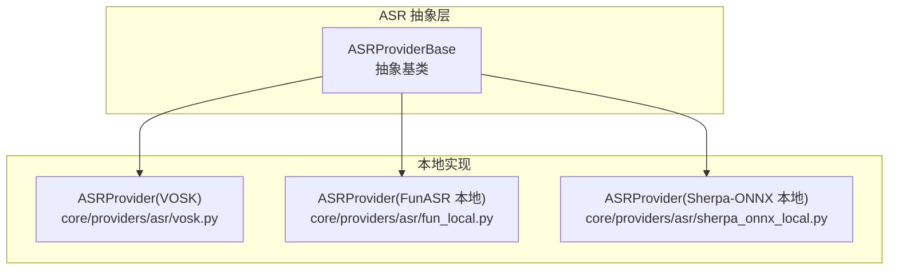
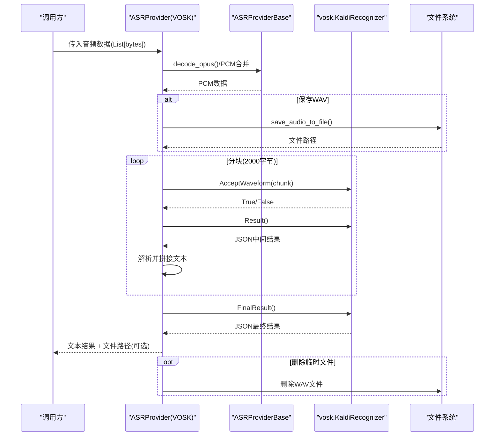
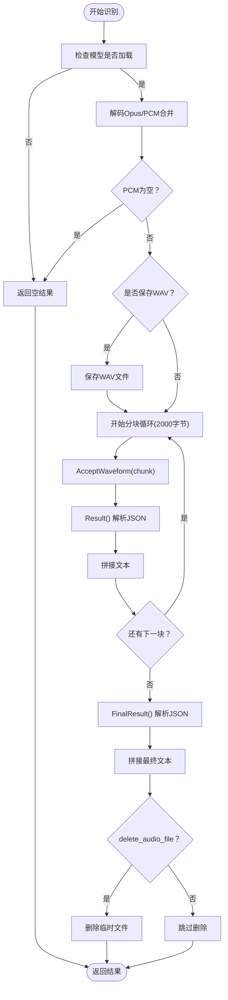
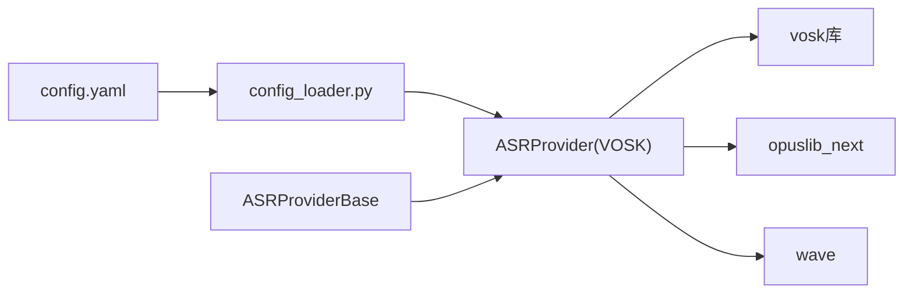

# VOSK 本地模型

<cite>
**本文引用的文件**
- [vosk.py](file://core/providers/asr/vosk.py)
- [base.py](file://core/providers/asr/base.py)
- [config.yaml](file://config.yaml)
- [config_loader.py](file://config/config_loader.py)
- [settings.py](file://config/settings.py)
- [fun_local.py](file://core/providers/asr/fun_local.py)
- [sherpa_onnx_local.py](file://core/providers/asr/sherpa_onnx_local.py)
- [performance_tester_asr.py](file://performance_tester/performance_tester_asr.py)
</cite>

## 目录
1. [简介](#简介)
2. [项目结构](#项目结构)
3. [核心组件](#核心组件)
4. [架构总览](#架构总览)
5. [详细组件分析](#详细组件分析)
6. [依赖关系分析](#依赖关系分析)
7. [性能考量](#性能考量)
8. [故障排查指南](#故障排查指南)
9. [结论](#结论)
10. [附录](#附录)

## 简介
本技术文档围绕本地语音识别模块中的 VOSK 实现展开，重点解析 ASRProvider 的实现原理，涵盖基于 KaldiRecognizer 的流式音频处理机制、2000字节分块识别策略、模型路径配置要求、WAV文件输出与隐私保护、JSON结果解析流程（AcceptWaveform → Result → FinalResult）以及文本拼接逻辑。同时提供模型加载失败、采样率不匹配（必须16kHz）等异常的排查指南，并对 VOSK 与其他本地 ASR 引擎在资源占用、识别精度与延迟方面的差异进行对比，帮助开发者依据硬件条件选择合适引擎。最后给出通过 config.yaml 集成 VOSK 并进行基础功能验证的方法。

## 项目结构
VOSK 本地 ASR 提供者位于 ASR 供应商集合中，遵循统一的抽象基类接口，负责将 PCM/Opus 音频数据转换为文本，并可选择将原始音频保存为 WAV 文件以便后续审计或复现。

图表来源
- [vosk.py](file://core/providers/asr/vosk.py#L1-L115)
- [base.py](file://core/providers/asr/base.py#L1-L268)
- [fun_local.py](file://core/providers/asr/fun_local.py#L1-L135)
- [sherpa_onnx_local.py](file://core/providers/asr/sherpa_onnx_local.py#L1-L200)

章节来源
- [vosk.py](file://core/providers/asr/vosk.py#L1-L115)
- [base.py](file://core/providers/asr/base.py#L1-L268)

## 核心组件
- ASRProvider（VOSK）：负责加载 VOSK 模型、初始化 KaldiRecognizer（采样率16kHz）、执行流式识别、解析 JSON 结果并进行文本拼接，支持将 PCM 数据保存为 WAV 文件。
- ASRProviderBase：提供统一的抽象接口、音频解码（Opus→PCM）、WAV 文件保存、以及与上层处理流程的对接能力。
- 配置系统：通过 config.yaml 与 config_loader.py 提供模块化配置，支持按模块选择 ASR 提供者、输出目录、模型路径等。

章节来源
- [vosk.py](file://core/providers/asr/vosk.py#L1-L115)
- [base.py](file://core/providers/asr/base.py#L1-L268)
- [config.yaml](file://config.yaml#L416-L431)
- [config_loader.py](file://config/config_loader.py#L1-L152)

## 架构总览
VOSK 本地识别的整体流程如下：
- 输入音频（Opus/PCM）经由 ASRProviderBase 解码为 PCM。
- 将 PCM 数据按 2000 字节分块喂入 KaldiRecognizer 的 AcceptWaveform。
- 每次分块返回中间结果（Result），最终汇总为完整文本（FinalResult）。
- 可选保存为 WAV 文件，支持隐私保护（delete_audio_file）。

图表来源
- [vosk.py](file://core/providers/asr/vosk.py#L46-L115)
- [base.py](file://core/providers/asr/base.py#L220-L268)

## 详细组件分析

### ASRProvider（VOSK）实现要点
- 模型加载与初始化
  - 从配置读取 model_path，检查路径存在性，加载 vosk.Model。
  - 初始化 KaldiRecognizer，采样率固定为 16000Hz。
- 流式识别与分块策略
  - 将解码后的 PCM 数据按 2000 字节切片，逐块调用 AcceptWaveform。
  - 每次分块调用 Result() 获取中间文本并拼接。
  - 识别完成后调用 FinalResult() 获取最终文本并追加到结果末尾。
- 输出与隐私保护
  - 可选保存为 WAV 文件（由 save_audio_to_file 完成），文件名包含会话ID与随机UUID。
  - delete_audio_file 为 True 时，识别结束后删除临时文件；为 False 时保留文件便于审计或复现。
- 异常处理
  - 模型加载失败、解码后PCM为空、合并PCM为空、识别失败等均有日志记录与返回空结果的兜底。

图表来源
- [vosk.py](file://core/providers/asr/vosk.py#L46-L115)
- [base.py](file://core/providers/asr/base.py#L220-L268)

章节来源
- [vosk.py](file://core/providers/asr/vosk.py#L1-L115)
- [base.py](file://core/providers/asr/base.py#L220-L268)

### 配置项与模型路径要求
- 关键配置项
  - type: vosk
  - model_path: 指向 VOSK 模型目录的绝对或相对路径（需存在）
  - output_dir: 输出目录（默认 tmp/）
- 模型路径要求
  - 必须指向 VOSK 官方模型解压后的目录，且包含必要的模型文件。
  - 采样率必须为 16kHz，这是 KaldiRecognizer 的硬性要求。
- 配置加载与目录创建
  - config_loader 会在加载配置时确保 ASR/TTS 输出目录存在，避免运行时报错。
  - settings 检查 data/.config.yaml 是否存在，保证配置文件正确加载。

章节来源
- [config.yaml](file://config.yaml#L416-L431)
- [config_loader.py](file://config/config_loader.py#L82-L121)
- [settings.py](file://config/settings.py#L9-L33)
- [vosk.py](file://core/providers/asr/vosk.py#L13-L45)

### JSON 结果解析流程与文本拼接
- 中间结果：每次 AcceptWaveform 后调用 Result()，返回包含 text 字段的 JSON，提取 text 并追加到结果字符串。
- 最终结果：识别结束后调用 FinalResult()，同样返回包含 text 字段的 JSON，提取 text 并追加到结果末尾。
- 文本拼接：中间结果与最终结果的文本以空格分隔，最终形成完整句子。

章节来源
- [vosk.py](file://core/providers/asr/vosk.py#L80-L102)

### 隐私保护与 delete_audio_file 参数
- delete_audio_file 默认 True，识别完成后自动删除临时 WAV 文件，降低隐私泄露风险。
- 若设置为 False，将保存 WAV 文件，便于审计、复现或二次分析，但需注意文件留存与合规管理。

章节来源
- [vosk.py](file://core/providers/asr/vosk.py#L73-L115)
- [base.py](file://core/providers/asr/base.py#L220-L233)

### 与其他本地 ASR 引擎的对比
- FunASR 本地
  - 通过 AutoModel 加载模型，支持自动语言检测与后处理；对内存有一定要求（示例中检查内存≥2GB）。
  - 采用一次性生成接口，整体流程与 VOSK 的分块流式识别不同。
- Sherpa-ONNX 本地
  - 支持多种模型类型（paraformer、zipformer_ctc、transducer、sense_voice），统一采样率为 16kHz。
  - 示例中包含降噪器初始化与多模型加载逻辑，适合多语言与热词场景。
- VOSK
  - 严格的 16kHz 采样率要求；分块识别策略（2000字节）适合流式场景，延迟可控。
  - 完全离线，无需网络连接，适合隐私敏感环境。

章节来源
- [fun_local.py](file://core/providers/asr/fun_local.py#L1-L135)
- [sherpa_onnx_local.py](file://core/providers/asr/sherpa_onnx_local.py#L1-L200)
- [config.yaml](file://config.yaml#L277-L311)

## 依赖关系分析
- 组件耦合
  - ASRProvider(VOSK) 依赖 ASRProviderBase 提供的解码与文件保存能力。
  - 依赖 vosk 库完成模型加载与识别。
  - 依赖配置系统（config.yaml + config_loader）提供模块化配置与目录创建。
- 外部依赖
  - vosk：本地语音识别库。
  - opuslib_next：Opus 解码。
  - wave：WAV 文件写入。

图表来源
- [config.yaml](file://config.yaml#L416-L431)
- [config_loader.py](file://config/config_loader.py#L1-L152)
- [vosk.py](file://core/providers/asr/vosk.py#L1-L115)
- [base.py](file://core/providers/asr/base.py#L1-L268)

章节来源
- [config.yaml](file://config.yaml#L416-L431)
- [config_loader.py](file://config/config_loader.py#L1-L152)
- [vosk.py](file://core/providers/asr/vosk.py#L1-L115)
- [base.py](file://core/providers/asr/base.py#L1-L268)

## 性能考量
- 采样率与延迟
  - VOSK 识别器固定 16kHz，若输入音频采样率不匹配会导致识别异常或性能下降。
  - 分块大小（2000字节）影响延迟与稳定性，较小分块可降低延迟但增加调用次数。
- 资源占用
  - VOSK 为纯本地模型，无网络依赖，资源占用取决于模型大小与硬件性能。
  - 与其他本地引擎（如 FunASR、Sherpa-ONNX）相比，VOSK 的模型体积通常较小，适合低资源设备。
- 识别精度
  - VOSK 在中文模型输出不带标点，词与词之间有空格，需结合后处理或使用其他引擎获得更自然的文本。
  - 多语言场景可考虑 Sherpa-ONNX 的 sense_voice 或 transducer 模型。
- 延迟测试
  - 可使用性能测试工具对各 ASR 引擎进行基准测试，评估平均耗时与成功率，辅助选型。

章节来源
- [config.yaml](file://config.yaml#L416-L431)
- [performance_tester_asr.py](file://performance_tester/performance_tester_asr.py#L1-L354)
- [sherpa_onnx_local.py](file://core/providers/asr/sherpa_onnx_local.py#L1-L200)

## 故障排查指南
- 模型加载失败
  - 症状：日志显示“加载VOSK模型失败”，随后抛出异常。
  - 排查：确认 model_path 指向的模型目录存在且包含必要文件；检查权限与路径拼接。
- 采样率不匹配（必须16kHz）
  - 症状：识别异常或报错。
  - 排查：确保输入音频在进入识别前已被正确解码为 16kHz 单声道 PCM。
- 解码后PCM为空
  - 症状：日志提示“解码后的PCM数据为空”。
  - 排查：检查 Opus 包是否损坏或格式不符；确认解码器初始化与 buffer_size 设置正确。
- 合并PCM为空
  - 症状：日志提示“合并后的PCM数据为空”。
  - 排查：确认解码链路正常，且至少有一帧有效数据。
- 识别失败
  - 症状：识别过程中抛出异常或返回空结果。
  - 排查：查看日志中的异常堆栈；检查模型完整性与分块大小是否合理。
- 文件删除失败
  - 症状：日志提示“文件删除失败”。
  - 排查：检查文件权限、磁盘空间与路径合法性。

章节来源
- [vosk.py](file://core/providers/asr/vosk.py#L29-L45)
- [vosk.py](file://core/providers/asr/vosk.py#L46-L115)
- [base.py](file://core/providers/asr/base.py#L242-L268)

## 结论
VOSK 本地 ASR 提供者通过严格的 16kHz 采样率与 2000 字节分块策略，实现了稳定的流式识别能力。配合 delete_audio_file 参数，可在隐私保护与审计需求之间取得平衡。对于资源有限或完全离线的场景，VOSK 是理想选择；若需更高的识别精度或多语言支持，可考虑 FunASR 或 Sherpa-ONNX。通过配置系统与性能测试工具，开发者可快速集成并验证 VOSK 的功能与性能表现。

## 附录

### 通过 config.yaml 集成 VOSK 并进行基础功能验证
- 步骤
  1) 下载并解压 VOSK 模型至项目目录（如 models/vosk/）。
  2) 在 config.yaml 的 ASR 配置中添加 VoskASR 条目，设置 type 为 vosk，model_path 指向模型目录，output_dir 指向输出目录。
  3) 启动服务，确保 config_loader 创建了 output_dir。
  4) 准备一段 16kHz 单声道 PCM 或 Opus 音频，调用 ASRProvider 的 speech_to_text 方法。
  5) 观察日志输出与返回文本，确认识别结果与文件保存（如启用）正常。
- 注意事项
  - 确保模型目录存在且包含必要文件。
  - 确认 delete_audio_file 设置符合隐私策略。
  - 如需进一步验证延迟与精度，可使用性能测试工具对各引擎进行对比测试。

章节来源
- [config.yaml](file://config.yaml#L416-L431)
- [config_loader.py](file://config/config_loader.py#L82-L121)
- [vosk.py](file://core/providers/asr/vosk.py#L13-L45)
- [base.py](file://core/providers/asr/base.py#L220-L268)