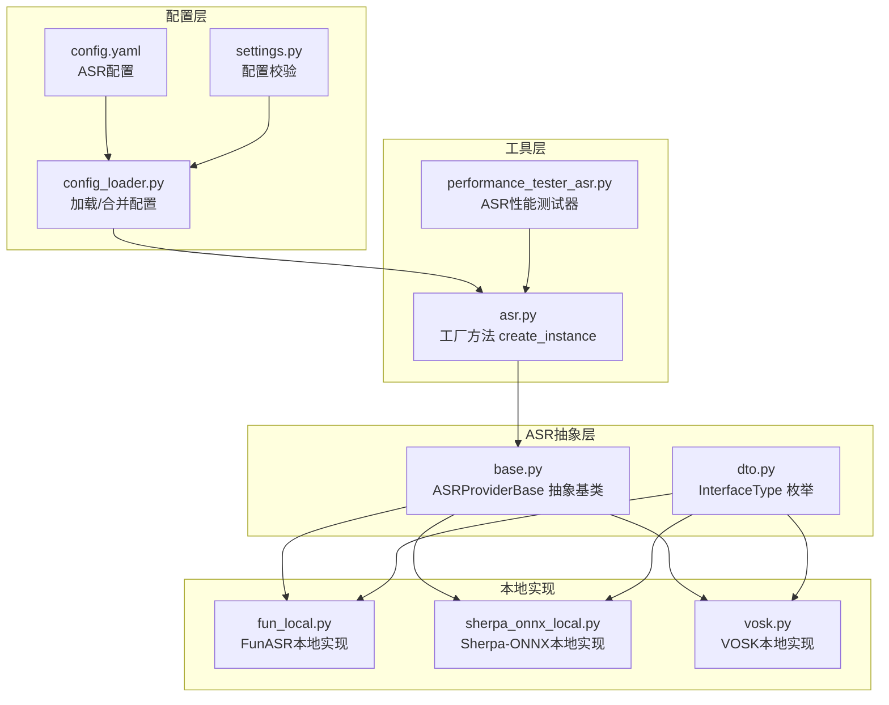
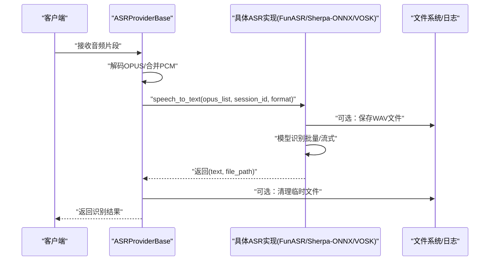
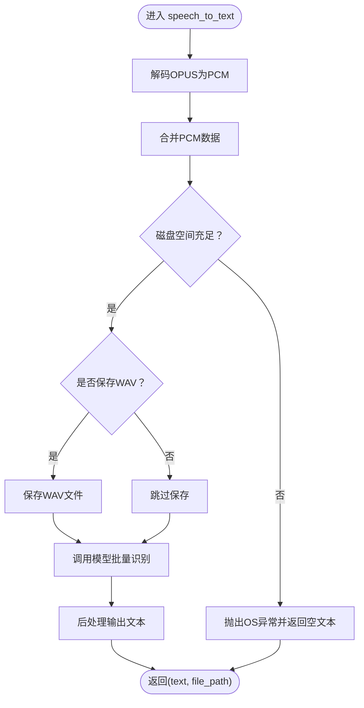
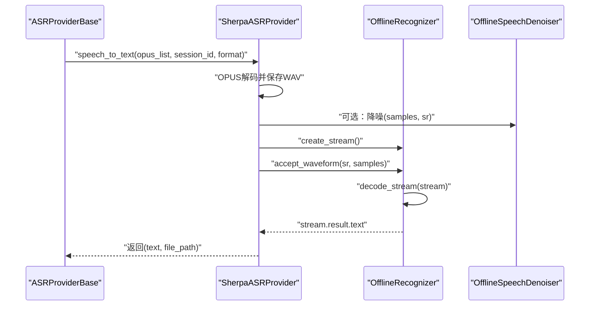
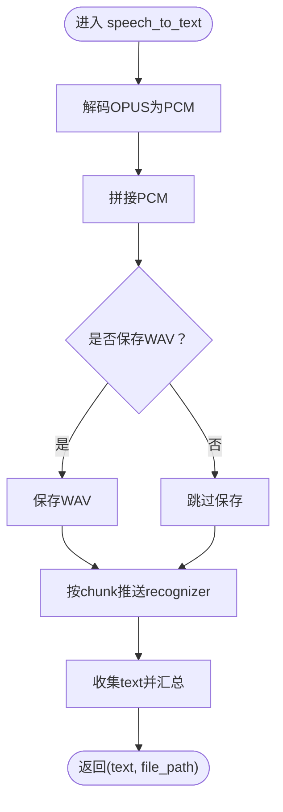
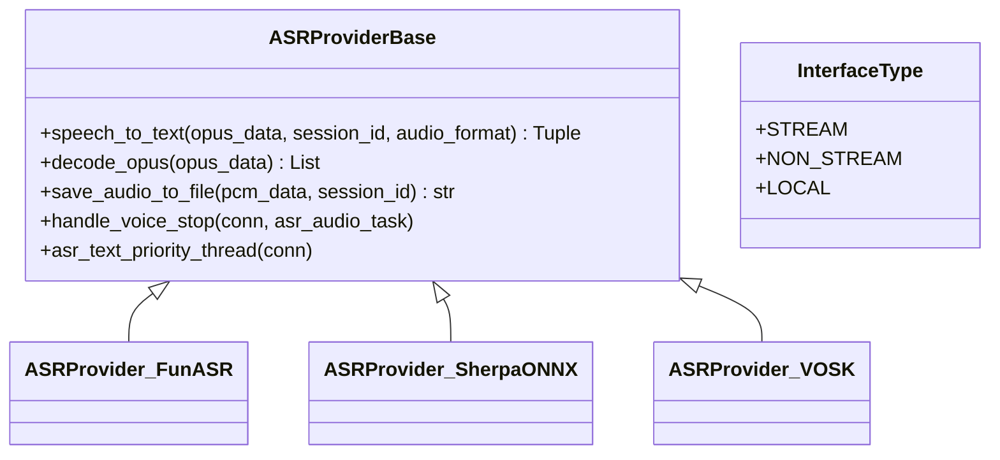
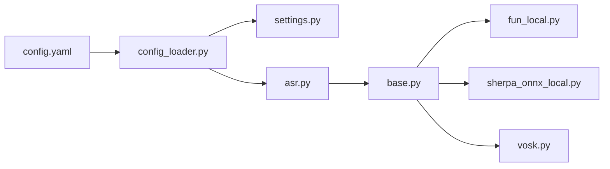

# 本地ASR模型

<cite>
**本文引用的文件**
- [fun_local.py](file://core/providers/asr/fun_local.py)
- [sherpa_onnx_local.py](file://core/providers/asr/sherpa_onnx_local.py)
- [vosk.py](file://core/providers/asr/vosk.py)
- [base.py](file://core/providers/asr/base.py)
- [dto.py](file://core/providers/asr/dto/dto.py)
- [asr.py](file://core/utils/asr.py)
- [config_loader.py](file://config/config_loader.py)
- [settings.py](file://config/settings.py)
- [config.yaml](file://config.yaml)
- [SenseVoiceSmall/config.yaml](file://models/SenseVoiceSmall/config.yaml)
- [hotwords_cn.txt](file://models/sherpa-onnx/hotwords_cn.txt)
- [performance_tester_asr.py](file://performance_tester/performance_tester_asr.py)
</cite>

## 目录
1. [简介](#简介)
2. [项目结构](#项目结构)
3. [核心组件](#核心组件)
4. [架构总览](#架构总览)
5. [详细组件分析](#详细组件分析)
6. [依赖关系分析](#依赖关系分析)
7. [性能考量](#性能考量)
8. [故障排查指南](#故障排查指南)
9. [结论](#结论)
10. [附录](#附录)

## 简介
本文件面向开发者，系统性梳理基于FunASR、Sherpa-ONNX与VOSK的本地语音识别（ASR）实现架构，重点阐述其离线运行、低延迟与隐私保护优势。文档围绕以下目标展开：
- 解析fun_local.py中如何加载FunASR模型进行批量语音识别；
- 解析sherpa_onnx_local.py中如何利用CTC解码实现流式或非流式识别；
- 说明如何通过config.yaml配置本地模型路径、热词与输出目录；
- 提供性能基准测试方法与对比维度（精度、内存占用、推理速度）；
- 指导如何扩展支持新的本地ASR引擎，包括模型集成、接口适配与错误处理。

## 项目结构
本地ASR能力位于core/providers/asr目录，采用“抽象基类 + 多实现”的分层设计，统一对外暴露speech_to_text接口，便于在运行期按配置动态选择具体实现。配置由config.yaml集中管理，支持本地与云端混合部署。

图表来源
- [config.yaml](file://config.yaml#L277-L337)
- [config_loader.py](file://config/config_loader.py#L1-L152)
- [settings.py](file://config/settings.py#L1-L34)
- [base.py](file://core/providers/asr/base.py#L1-L268)
- [dto.py](file://core/providers/asr/dto/dto.py#L1-L10)
- [asr.py](file://core/utils/asr.py#L1-L24)
- [fun_local.py](file://core/providers/asr/fun_local.py#L1-L135)
- [sherpa_onnx_local.py](file://core/providers/asr/sherpa_onnx_local.py#L1-L239)
- [vosk.py](file://core/providers/asr/vosk.py#L1-L115)
- [performance_tester_asr.py](file://performance_tester/performance_tester_asr.py#L1-L354)

章节来源
- [config.yaml](file://config.yaml#L277-L337)
- [config_loader.py](file://config/config_loader.py#L1-L152)
- [settings.py](file://config/settings.py#L1-L34)
- [base.py](file://core/providers/asr/base.py#L1-L268)
- [dto.py](file://core/providers/asr/dto/dto.py#L1-L10)
- [asr.py](file://core/utils/asr.py#L1-L24)
- [fun_local.py](file://core/providers/asr/fun_local.py#L1-L135)
- [sherpa_onnx_local.py](file://core/providers/asr/sherpa_onnx_local.py#L1-L239)
- [vosk.py](file://core/providers/asr/vosk.py#L1-L115)
- [performance_tester_asr.py](file://performance_tester/performance_tester_asr.py#L1-L354)

## 核心组件
- 抽象基类ASRProviderBase：定义统一接口speech_to_text、音频解码、文件保存、并行处理与队列调度等通用能力。
- 本地实现：
  - FunASR本地实现：基于AutoModel进行批量识别，支持VAD分段与后处理。
  - Sherpa-ONNX本地实现：支持SenseVoice/Paraformer/Transducer/Zipformer CTC等模型族，提供流式识别与降噪。
  - VOSK本地实现：基于KaldiRecognizer进行非流式识别，按固定chunk推送音频。
- 工具与配置：
  - 工厂方法create_instance：按配置type动态加载具体实现。
  - 配置加载与合并：config_loader负责默认配置与自定义配置合并，并确保目录存在。
  - 性能测试器：对本地ASR模块进行并发测试，统计平均耗时与成功率。

章节来源
- [base.py](file://core/providers/asr/base.py#L1-L268)
- [dto.py](file://core/providers/asr/dto/dto.py#L1-L10)
- [asr.py](file://core/utils/asr.py#L1-L24)
- [config_loader.py](file://config/config_loader.py#L1-L152)
- [performance_tester_asr.py](file://performance_tester/performance_tester_asr.py#L1-L354)

## 架构总览
本地ASR整体流程如下：客户端音频经解码后，由ASRProviderBase统一调度，再路由到具体实现（FunASR/Sherpa-ONNX/VOSK）。识别结果通过统一接口返回，并可选保存音频文件。

图表来源
- [base.py](file://core/providers/asr/base.py#L80-L179)
- [fun_local.py](file://core/providers/asr/fun_local.py#L64-L135)
- [sherpa_onnx_local.py](file://core/providers/asr/sherpa_onnx_local.py#L183-L239)
- [vosk.py](file://core/providers/asr/vosk.py#L46-L115)

## 详细组件分析

### FunASR本地实现（fun_local.py）
- 关键特性
  - 批量识别：将多个音频片段合并为完整PCM后一次性提交给模型。
  - VAD分段：通过max_single_segment_time限制单段最长时长。
  - 后处理：使用rich_transcription_postprocess优化输出文本。
  - 存储策略：可选保存WAV文件，便于复现与审计。
  - 容错机制：磁盘空间不足、内存不足等异常重试与清理。
- 数据流与处理逻辑
  - 输入：opus数据包列表、会话ID、音频格式。
  - 处理：OPUS解码、PCM拼接、可选保存WAV、调用AutoModel.generate、后处理、计时与记录。
  - 输出：识别文本与可选文件路径。
- 错误处理
  - 磁盘空间不足、模型初始化失败、识别异常均记录日志并返回空文本。
  - 重试机制：最多两次，延迟重试。

图表来源
- [fun_local.py](file://core/providers/asr/fun_local.py#L64-L135)

章节来源
- [fun_local.py](file://core/providers/asr/fun_local.py#L1-L135)

### Sherpa-ONNX本地实现（sherpa_onnx_local.py）
- 关键特性
  - 多模型族支持：SenseVoice、Paraformer、Transducer、Zipformer CTC。
  - 流式识别：使用OfflineRecognizer.create_stream + accept_waveform + decode_stream。
  - 降噪：可选OfflineSpeechDenoiser（当前示例注释掉，便于对比）。
  - 热词：通过hotwords_file与hotwords_score提升特定词汇识别准确率。
  - 模型文件管理：自动下载缺失的ONNX与tokens文件。
- 数据流与处理逻辑
  - 输入：opus数据包列表、会话ID、音频格式。
  - 处理：OPUS解码、保存WAV、读取WAV为samples、创建流、喂入samples、decode_stream、提取结果。
  - 输出：识别文本与可选文件路径。
- 错误处理
  - 模型文件下载失败、识别异常均记录日志并返回空文本。
  - 临时文件清理在finally中执行。

图表来源
- [sherpa_onnx_local.py](file://core/providers/asr/sherpa_onnx_local.py#L183-L239)

章节来源
- [sherpa_onnx_local.py](file://core/providers/asr/sherpa_onnx_local.py#L1-L239)
- [hotwords_cn.txt](file://models/sherpa-onnx/hotwords_cn.txt#L1-L3)

### VOSK本地实现（vosk.py）
- 关键特性
  - 非流式识别：KaldiRecognizer，采样率固定为16kHz。
  - 分块推送：按2000字节chunk推送，累积中间结果，最终汇总。
  - 本地离线：无需网络，完全离线运行。
- 数据流与处理逻辑
  - 输入：opus数据包列表、会话ID、音频格式。
  - 处理：OPUS解码、PCM拼接、按chunk推送recognizer、收集text、最终结果。
  - 输出：识别文本与可选文件路径。
- 错误处理
  - 模型未加载、解码后PCM为空、识别异常均记录日志并返回空文本。

图表来源
- [vosk.py](file://core/providers/asr/vosk.py#L46-L115)

章节来源
- [vosk.py](file://core/providers/asr/vosk.py#L1-L115)

### 抽象基类与工厂方法（base.py、asr.py、dto.py）
- 抽象基类ASRProviderBase
  - 统一接口：speech_to_text、decode_opus、save_audio_to_file。
  - 并行处理：handle_voice_stop中并行执行ASR与声纹识别。
  - 队列与线程：asr_text_priority_thread负责有序处理音频队列。
- 工厂方法create_instance
  - 根据配置type动态导入并实例化具体ASRProvider。
- 枚举InterfaceType
  - STREAM/NON_STREAM/LOCAL用于标识接口类型，便于上层路由与日志区分。

图表来源
- [base.py](file://core/providers/asr/base.py#L1-L268)
- [dto.py](file://core/providers/asr/dto/dto.py#L1-L10)
- [asr.py](file://core/utils/asr.py#L1-L24)

章节来源
- [base.py](file://core/providers/asr/base.py#L1-L268)
- [dto.py](file://core/providers/asr/dto/dto.py#L1-L10)
- [asr.py](file://core/utils/asr.py#L1-L24)

## 依赖关系分析
- 配置依赖
  - config.yaml集中定义ASR实现类型、模型路径、输出目录等。
  - config_loader负责读取默认与自定义配置、合并、创建必要目录。
  - settings对配置文件存在性进行检查，避免运行期缺配置。
- 运行时依赖
  - 工厂方法create_instance按type动态加载实现模块。
  - 抽象基类统一调度与资源管理（解码、保存、清理）。
- 外部库依赖
  - FunASR：AutoModel、VAD、后处理工具。
  - Sherpa-ONNX：OfflineRecognizer、OfflineSpeechDenoiser、模型文件下载。
  - VOSK：vosk.Model/KaldiRecognizer。

图表来源
- [config.yaml](file://config.yaml#L277-L337)
- [config_loader.py](file://config/config_loader.py#L1-L152)
- [settings.py](file://config/settings.py#L1-L34)
- [asr.py](file://core/utils/asr.py#L1-L24)
- [base.py](file://core/providers/asr/base.py#L1-L268)
- [fun_local.py](file://core/providers/asr/fun_local.py#L1-L135)
- [sherpa_onnx_local.py](file://core/providers/asr/sherpa_onnx_local.py#L1-L239)
- [vosk.py](file://core/providers/asr/vosk.py#L1-L115)

章节来源
- [config.yaml](file://config.yaml#L277-L337)
- [config_loader.py](file://config/config_loader.py#L1-L152)
- [settings.py](file://config/settings.py#L1-L34)
- [asr.py](file://core/utils/asr.py#L1-L24)
- [base.py](file://core/providers/asr/base.py#L1-L268)
- [fun_local.py](file://core/providers/asr/fun_local.py#L1-L135)
- [sherpa_onnx_local.py](file://core/providers/asr/sherpa_onnx_local.py#L1-L239)
- [vosk.py](file://core/providers/asr/vosk.py#L1-L115)

## 性能考量
- 评测方法
  - performance_tester_asr.py扫描data目录下所有“.config.yaml”，聚合ASR配置，构造测试音频集合，对每个ASR实现执行并发测试，统计平均耗时与成功率。
  - 超时控制：单音频最大等待10秒；若首音频无法识别或出现502/超时/网络错误则判定不可用。
- 评测维度
  - 平均耗时（秒）、成功率（成功/总数）、错误类型（网络错误/超时/502）。
- 本地模型优化建议
  - FunASR：合理设置batch_size_s与VAD分段，避免单次输入过大导致内存压力。
  - Sherpa-ONNX：根据设备性能调整num_threads、provider（CPU/GPU）与解码方法（greedy_search/modified_beam_search）。
  - VOSK：保持chunk大小稳定，避免频繁小块推送带来的开销。
- 内存与磁盘
  - FunASR在初始化前检查可用内存，低于阈值给出告警。
  - 识别前检查磁盘空间，预留至少两倍于PCM数据的空间，防止写盘失败。

章节来源
- [performance_tester_asr.py](file://performance_tester/performance_tester_asr.py#L1-L354)
- [fun_local.py](file://core/providers/asr/fun_local.py#L1-L135)
- [sherpa_onnx_local.py](file://core/providers/asr/sherpa_onnx_local.py#L1-L239)
- [vosk.py](file://core/providers/asr/vosk.py#L1-L115)

## 故障排查指南
- 配置问题
  - 确认data/.config.yaml存在且包含ASR配置；若从API拉取配置，需遵循约定格式，避免本地与远程配置冲突。
  - 检查selected_module.ASR指向的实现type是否正确，且对应模块文件存在。
- 模型路径与文件
  - FunASR：确保model_dir指向SenseVoiceSmall等模型目录。
  - Sherpa-ONNX：确保模型目录包含所需ONNX文件与tokens.txt；热词文件hotwords_cn.txt需存在。
  - VOSK：确保model_path指向有效模型目录。
- 运行时错误
  - 磁盘空间不足：识别前检查剩余空间，必要时清理或增大分区。
  - 内存不足：FunASR初始化前检查可用内存，建议≥2GB。
  - 识别异常：查看日志中的异常堆栈，定位具体实现模块的错误来源。
- 并发与清理
  - 识别完成后会尝试删除临时WAV文件，若删除失败会记录错误；可在日志中定位文件路径并手动清理。

章节来源
- [settings.py](file://config/settings.py#L1-L34)
- [config_loader.py](file://config/config_loader.py#L1-L152)
- [config.yaml](file://config.yaml#L277-L337)
- [hotwords_cn.txt](file://models/sherpa-onnx/hotwords_cn.txt#L1-L3)
- [SenseVoiceSmall/config.yaml](file://models/SenseVoiceSmall/config.yaml#L1-L98)
- [fun_local.py](file://core/providers/asr/fun_local.py#L1-L135)
- [sherpa_onnx_local.py](file://core/providers/asr/sherpa_onnx_local.py#L1-L239)
- [vosk.py](file://core/providers/asr/vosk.py#L1-L115)

## 结论
本项目通过抽象基类与工厂方法实现了ASR实现的统一入口，结合config.yaml集中配置，使得FunASR、Sherpa-ONNX与VOSK三种本地ASR方案具备一致的使用体验与可观测性。通过性能测试器可快速评估不同模型在稳定性与速度上的差异，为生产部署提供决策依据。建议在资源受限设备上优先考虑Sherpa-ONNX Paraformer与VOSK，以获得更低的内存占用与更快的启动速度；在需要多语言与更强后处理能力时选用FunASR。

## 附录

### 配置项说明（来自config.yaml）
- ASR模块
  - FunASR：type为fun_local，model_dir为模型目录，output_dir为输出目录。
  - SherpaASR：type为sherpa_onnx_local，model_dir为模型目录，output_dir为输出目录，model_type可选sense_voice/paraformer。
  - VoskASR：type为vosk，model_path为模型路径，output_dir为输出目录。
- 其他
  - selected_module.ASR：决定运行期选择的ASR实现。
  - delete_audio：是否在使用后删除音频文件。
  - log：日志级别与输出目录。

章节来源
- [config.yaml](file://config.yaml#L277-L337)
- [config.yaml](file://config.yaml#L201-L220)

### 模型目录与配置参考
- SenseVoiceSmall模型配置（示例）：包含编码器、模型、前端、数据集与训练配置等字段，可用于FunASR本地识别。
- Sherpa-ONNX热词：hotwords_cn.txt提供中文热词与权重示例，便于提升特定词汇识别准确率。

章节来源
- [SenseVoiceSmall/config.yaml](file://models/SenseVoiceSmall/config.yaml#L1-L98)
- [hotwords_cn.txt](file://models/sherpa-onnx/hotwords_cn.txt#L1-L3)