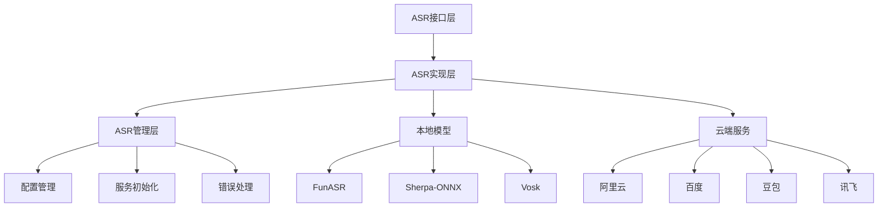
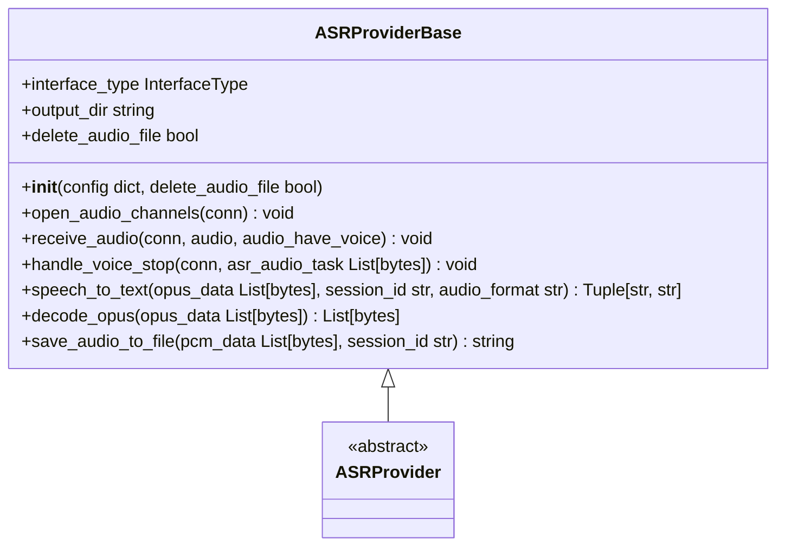
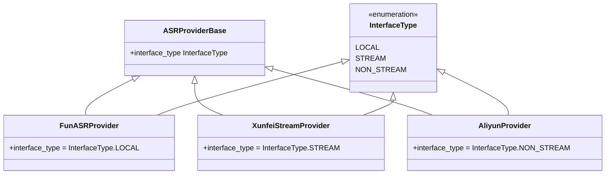
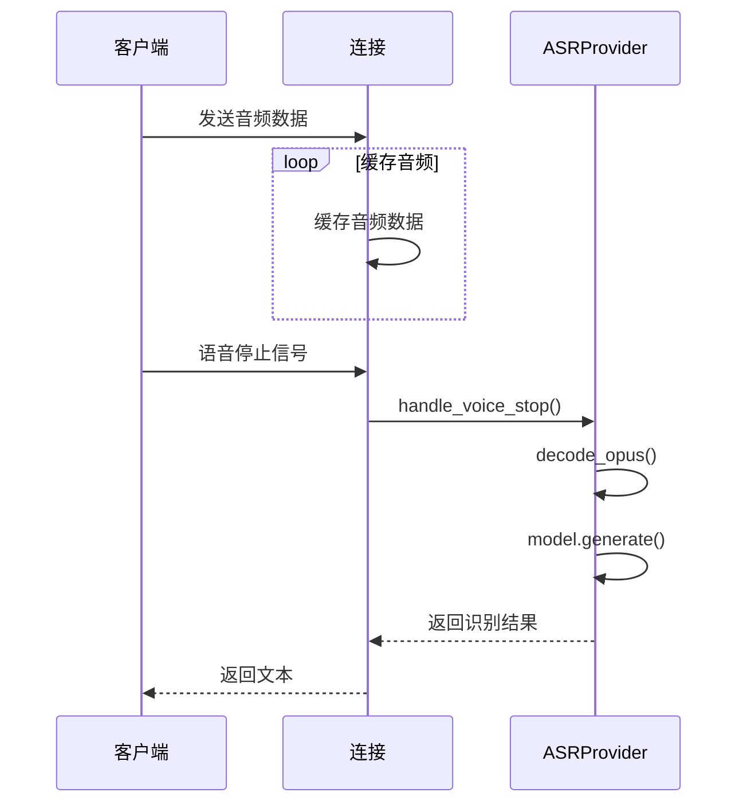
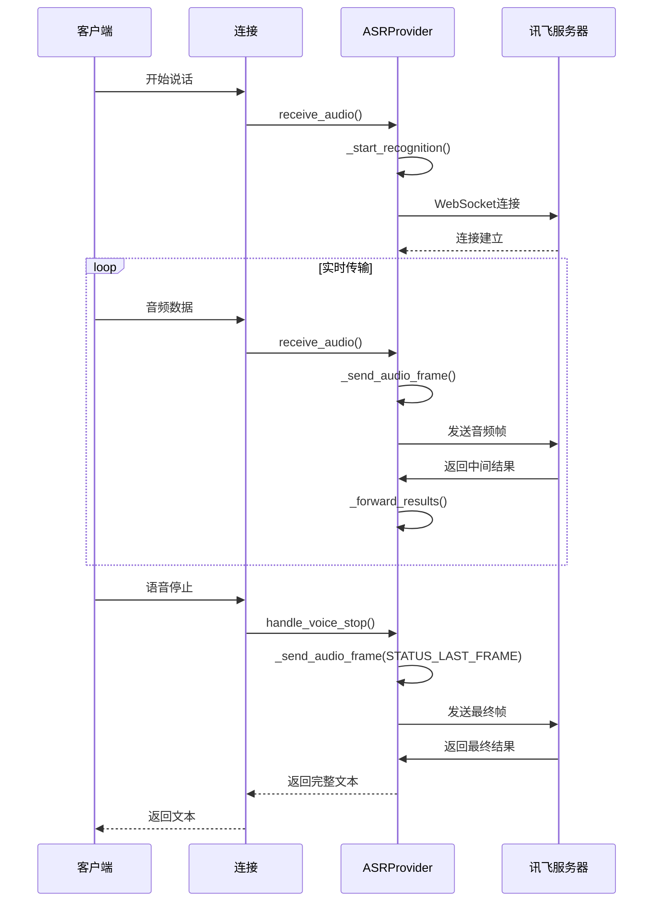
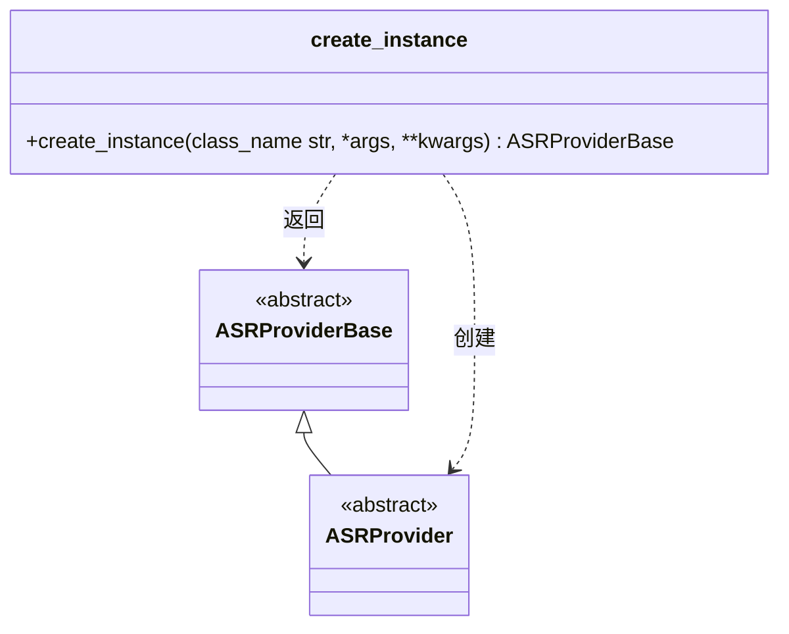

# 语音识别(ASR)

<cite>
**本文档引用文件**   
- [base.py](file://core/providers/asr/base.py)
- [fun_local.py](file://core/providers/asr/fun_local.py)
- [xunfei_stream.py](file://core/providers/asr/xunfei_stream.py)
- [asr.py](file://core/utils/asr.py)
- [config.yaml](file://config.yaml)
- [sherpa_onnx_local.py](file://core/providers/asr/sherpa_onnx_local.py)
- [aliyun.py](file://core/providers/asr/aliyun.py)
- [baidu.py](file://core/providers/asr/baidu.py)
- [doubao.py](file://core/providers/asr/doubao.py)
- [dto.py](file://core/providers/asr/dto/dto.py)
- [config_loader.py](file://config/config_loader.py)
- [modules_initialize.py](file://core/utils/modules_initialize.py)
</cite>

## 目录
1. [引言](#引言)
2. [ASR架构设计](#asr架构设计)
3. [统一接口规范](#统一接口规范)
4. [本地与云端实现模式](#本地与云端实现模式)
5. [批处理与流式识别对比](#批处理与流式识别对比)
6. [ASR服务管理](#asr服务管理)
7. [配置示例](#配置示例)
8. [引擎特性分析](#引擎特性分析)
9. [结论](#结论)

## 引言
本技术文档深入解析语音识别（ASR）子系统的架构与实现。该系统采用双轨实现模式，支持本地模型（如FunASR、Sherpa-ONNX、SenseVoiceSmall）和云端服务（如阿里云、百度、豆包、讯飞等）。文档详细阐述了`base.py`中定义的统一接口规范，分析了`fun_local.py`（本地批处理）与`xunfei_stream.py`（实时流式）的差异与适用场景，并说明了`asr.py`工具类如何统一管理ASR服务的初始化、配置注入和错误处理。

**Section sources**
- [base.py](file://core/providers/asr/base.py#L1-L268)
- [fun_local.py](file://core/providers/asr/fun_local.py#L1-L135)
- [xunfei_stream.py](file://core/providers/asr/xunfei_stream.py#L1-L524)

## ASR架构设计
语音识别子系统采用模块化设计，通过统一的接口规范实现多种ASR引擎的灵活切换。系统架构分为三个核心层次：接口层、实现层和管理层。



**Diagram sources **
- [base.py](file://core/providers/asr/base.py#L25-L239)
- [asr.py](file://core/utils/asr.py#L16-L24)
- [config.yaml](file://config.yaml#L277-L468)

**Section sources**
- [base.py](file://core/providers/asr/base.py#L1-L268)
- [asr.py](file://core/utils/asr.py#L1-L24)

## 统一接口规范
`base.py`文件定义了ASRProviderBase抽象基类，为所有ASR实现提供了统一的接口规范。该规范确保了不同引擎之间的互操作性和可替换性。



**Diagram sources **
- [base.py](file://core/providers/asr/base.py#L25-L239)

**Section sources**
- [base.py](file://core/providers/asr/base.py#L25-L239)

## 本地与云端实现模式
系统支持本地模型和云端服务两种实现模式，通过InterfaceType枚举进行区分。



**Diagram sources **
- [dto.py](file://core/providers/asr/dto/dto.py#L5-L10)
- [fun_local.py](file://core/providers/asr/fun_local.py#L38-L135)
- [xunfei_stream.py](file://core/providers/asr/xunfei_stream.py#L26-L524)
- [aliyun.py](file://core/providers/asr/aliyun.py#L90-L249)

**Section sources**
- [dto.py](file://core/providers/asr/dto/dto.py#L5-L10)
- [fun_local.py](file://core/providers/asr/fun_local.py#L1-L135)
- [xunfei_stream.py](file://core/providers/asr/xunfei_stream.py#L1-L524)
- [aliyun.py](file://core/providers/asr/aliyun.py#L1-L249)

## 批处理与流式识别对比
系统实现了批处理和流式识别两种模式，分别适用于不同的应用场景。

### 批处理识别 (fun_local.py)
批处理模式在接收到完整的音频数据后进行一次性识别，适用于对实时性要求不高的场景。



**Diagram sources **
- [fun_local.py](file://core/providers/asr/fun_local.py#L64-L107)

### 流式识别 (xunfei_stream.py)
流式模式通过WebSocket连接实时传输音频数据，实现低延迟的连续识别，适用于实时交互场景。



**Diagram sources **
- [xunfei_stream.py](file://core/providers/asr/xunfei_stream.py#L100-L425)

**Section sources**
- [fun_local.py](file://core/providers/asr/fun_local.py#L1-L135)
- [xunfei_stream.py](file://core/providers/asr/xunfei_stream.py#L1-L524)

## ASR服务管理
`asr.py`工具类通过工厂模式统一管理ASR服务的初始化、配置注入和错误处理。



**Diagram sources **
- [asr.py](file://core/utils/asr.py#L16-L24)

**Section sources**
- [asr.py](file://core/utils/asr.py#L1-L24)
- [modules_initialize.py](file://core/utils/modules_initialize.py#L116-L129)

## 配置示例
通过`config.yaml`文件可以轻松切换不同的ASR引擎。

```yaml
# 语音识别配置
ASR:
  FunASR:
    type: fun_local
    model_dir: models/SenseVoiceSmall
    output_dir: tmp/
  SherpaASR:
    type: sherpa_onnx_local
    model_dir: models/sherpa-onnx-sense-voice-zh-en-ja-ko-yue-2024-07-17
    output_dir: tmp/
    model_type: sense_voice
  AliyunASR:
    type: aliyun
    appkey: 你的阿里云智能语音交互服务项目Appkey
    token: 你的阿里云智能语音交互服务AccessToken
    access_key_id: 你的阿里云账号access_key_id
    access_key_secret: 你的阿里云账号access_key_secret
    output_dir: tmp/
  XunfeiStreamASR:
    type: xunfei_stream
    app_id: 你的APPID
    api_key: 你的APIKey
    api_secret: 你的APISecret
    domain: slm
    language: zh_cn
    accent: mandarin
    dwa: wpgs
    output_dir: tmp/

# 具体处理时选择的模块
selected_module:
  ASR: FunASR  # 可切换为 SherpaASR, AliyunASR, XunfeiStreamASR
```

**Section sources**
- [config.yaml](file://config.yaml#L277-L468)

## 引擎特性分析
不同ASR引擎在精度、延迟和网络依赖方面各有特点。

| 引擎 | 精度 | 延迟 | 网络依赖 | 适用场景 |
|------|------|------|----------|----------|
| FunASR (本地) | 高 | 中等 | 无 | 隐私敏感、离线环境 |
| Sherpa-ONNX (本地) | 高 | 低 | 无 | 低性能设备、实时性要求高 |
| 阿里云 (云端) | 高 | 低 | 高 | 云服务集成、高并发 |
| 百度 (云端) | 高 | 低 | 高 | 中文语音识别 |
| 豆包 (云端) | 高 | 低 | 高 | 多语言支持 |
| 讯飞 (流式) | 高 | 极低 | 高 | 实时交互、对话系统 |

**Section sources**
- [config.yaml](file://config.yaml#L277-L468)
- [fun_local.py](file://core/providers/asr/fun_local.py#L1-L135)
- [sherpa_onnx_local.py](file://core/providers/asr/sherpa_onnx_local.py#L1-L239)
- [aliyun.py](file://core/providers/asr/aliyun.py#L1-L249)
- [baidu.py](file://core/providers/asr/baidu.py#L1-L86)
- [doubao.py](file://core/providers/asr/doubao.py#L1-L272)
- [xunfei_stream.py](file://core/providers/asr/xunfei_stream.py#L1-L524)

## 结论
语音识别子系统通过精心设计的架构实现了本地模型和云端服务的双轨并行。统一的接口规范确保了系统的可扩展性和维护性，而灵活的配置管理使得在不同引擎之间切换变得简单高效。批处理和流式识别模式的并存满足了从离线处理到实时交互的各种应用场景需求。