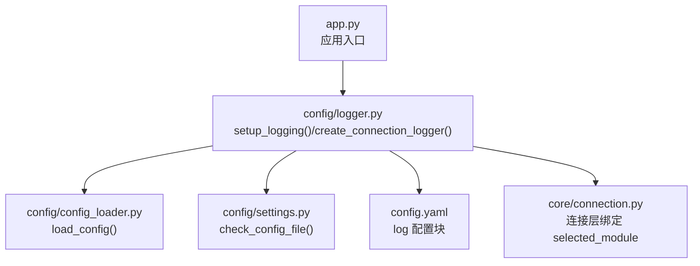
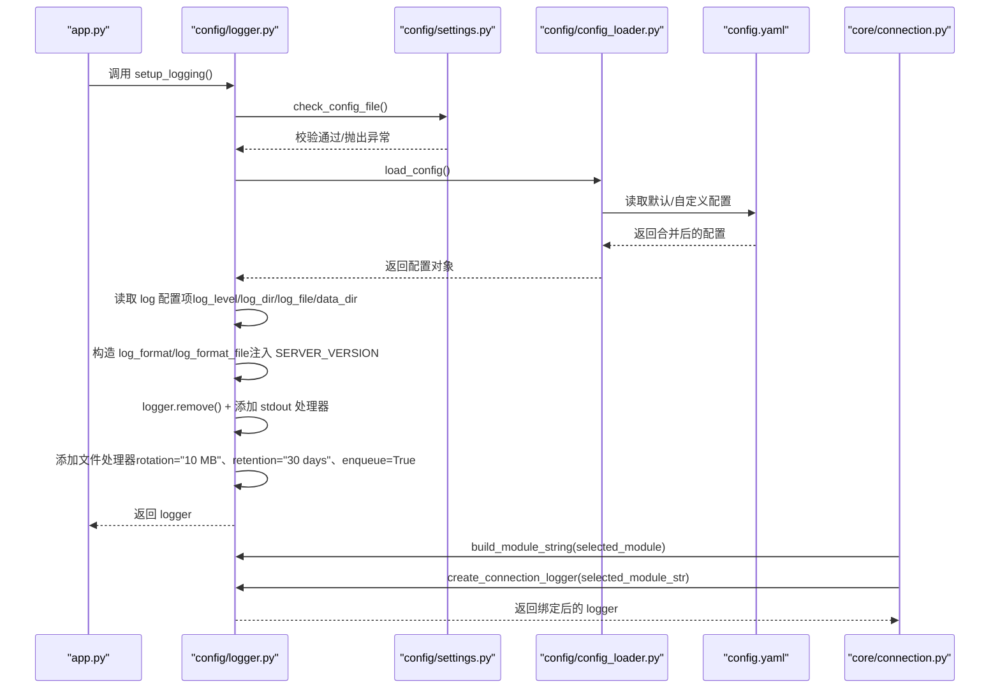
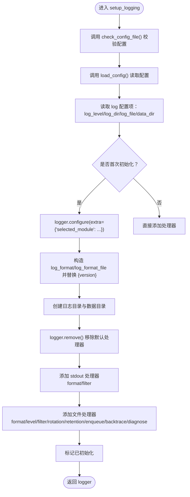
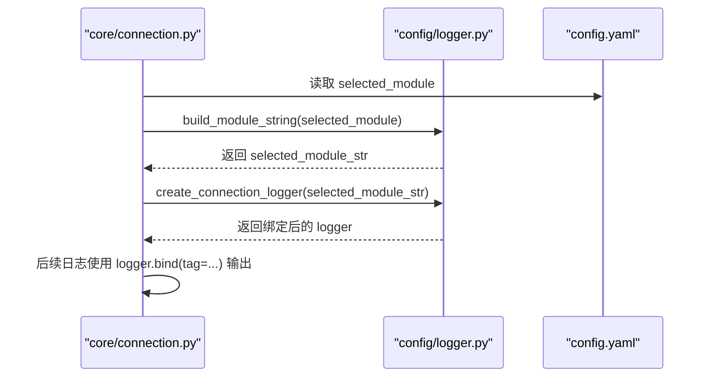
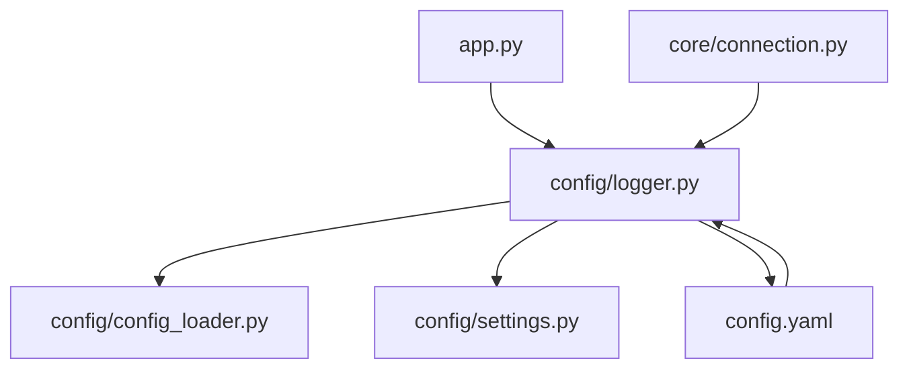

# 日志配置

<cite>
**本文引用的文件**
- [config/logger.py](file://config/logger.py)
- [config/settings.py](file://config/settings.py)
- [config/config_loader.py](file://config/config_loader.py)
- [config.yaml](file://config.yaml)
- [app.py](file://app.py)
- [core/connection.py](file://core/connection.py)
</cite>

## 目录
1. [简介](#简介)
2. [项目结构](#项目结构)
3. [核心组件](#核心组件)
4. [架构总览](#架构总览)
5. [详细组件分析](#详细组件分析)
6. [依赖关系分析](#依赖关系分析)
7. [性能考量](#性能考量)
8. [故障排查指南](#故障排查指南)
9. [结论](#结论)
10. [附录](#附录)

## 简介
本章节围绕日志系统的初始化与使用展开，重点解释 logger.py 如何基于 config.yaml 中的 log 配置块完成日志系统的初始化，包括：
- setup_logging() 的执行流程与关键步骤
- 配置项 log_level、log_dir、log_file、data_dir 的读取与作用
- 日志格式化字符串 log_format 与 log_format_file 的结构与动态变量（含 SERVER_VERSION 与 selected_module）
- create_connection_logger() 如何为每个设备连接创建独立日志记录器并绑定模块字符串
- formatter() 函数如何为日志记录添加默认 tag 与 selected_module 字段
- 如何在 config.yaml 中自定义日志级别、输出路径与格式，并结合 loguru 的异步安全 enqueue 与日志轮转 rotation 等高级特性

## 项目结构
日志相关的核心文件分布如下：
- 配置加载与校验：config/config_loader.py、config/settings.py
- 日志初始化与工具：config/logger.py
- 应用入口：app.py
- 连接层使用：core/connection.py
- 配置文件：config.yaml

图表来源
- [app.py](file://app.py#L1-L20)
- [config/logger.py](file://config/logger.py#L48-L114)
- [config/config_loader.py](file://config/config_loader.py#L18-L44)
- [config/settings.py](file://config/settings.py#L9-L33)
- [config.yaml](file://config.yaml#L44-L57)
- [core/connection.py](file://core/connection.py#L395-L405)

章节来源
- [app.py](file://app.py#L1-L20)
- [config/logger.py](file://config/logger.py#L48-L114)
- [config/config_loader.py](file://config/config_loader.py#L18-L44)
- [config/settings.py](file://config/settings.py#L9-L33)
- [config.yaml](file://config.yaml#L44-L57)
- [core/connection.py](file://core/connection.py#L395-L405)

## 核心组件
- setup_logging(): 从配置文件读取 log 配置，初始化日志格式、级别、输出路径，并添加控制台与文件处理器；首次初始化时配置全局 extra.selected_module。
- create_connection_logger(selected_module_str): 基于全局 logger，为每个连接绑定特定的 selected_module 字符串，便于日志追踪。
- formatter(record): 为日志 record 注入默认 tag 与 selected_module，并将 extra.selected_module 提升到 record 顶层，以支持格式字符串中的占位符。
- build_module_string(selected_module): 将 selected_module 映射为固定长度的模块字符串，供连接级日志绑定使用。
- check_config_file(): 校验 data/.config.yaml 存在性与配置来源合法性。
- load_config(): 合并默认配置与自定义配置，确保目录存在，提供给 setup_logging 使用。

章节来源
- [config/logger.py](file://config/logger.py#L12-L114)
- [config/settings.py](file://config/settings.py#L9-L33)
- [config/config_loader.py](file://config/config_loader.py#L18-L44)
- [config.yaml](file://config.yaml#L44-L57)
- [core/connection.py](file://core/connection.py#L395-L405)

## 架构总览
下图展示了从应用启动到日志系统初始化、再到连接层绑定模块字符串的整体流程。

图表来源
- [app.py](file://app.py#L1-L20)
- [config/logger.py](file://config/logger.py#L48-L114)
- [config/settings.py](file://config/settings.py#L9-L33)
- [config/config_loader.py](file://config/config_loader.py#L18-L44)
- [config.yaml](file://config.yaml#L44-L57)
- [core/connection.py](file://core/connection.py#L395-L405)

## 详细组件分析

### setup_logging() 执行过程
- 步骤一：调用 check_config_file() 确保配置文件存在且来源合法。
- 步骤二：调用 load_config() 获取合并后的配置对象。
- 步骤三：从配置中读取 log 配置块，提取 log_level、log_dir、log_file、data_dir 等参数。
- 步骤四：首次初始化时，通过 logger.configure(extra={"selected_module": ...}) 设置全局默认模块字符串。
- 步骤五：构造日志格式字符串：
  - 控制台格式：log_format
  - 文件格式：log_format_file
  - 将 {version} 替换为 SERVER_VERSION，形成最终格式字符串。
- 步骤六：创建日志目录（log_dir、data_dir），移除默认处理器，添加 stdout 处理器与文件处理器。
- 步骤七：文件处理器采用 loguru 的高级特性：
  - rotation="10 MB"：按大小轮转
  - retention="30 days"：保留30天
  - enqueue=True：异步安全
  - backtrace=True、diagnose=True：增强调试信息
- 步骤八：标记已初始化，返回 logger。

图表来源
- [config/logger.py](file://config/logger.py#L48-L114)
- [config/settings.py](file://config/settings.py#L9-L33)
- [config/config_loader.py](file://config/config_loader.py#L18-L44)

章节来源
- [config/logger.py](file://config/logger.py#L48-L114)
- [config/settings.py](file://config/settings.py#L9-L33)
- [config/config_loader.py](file://config/config_loader.py#L18-L44)

### 日志格式化字符串结构与动态变量
- 控制台格式（log_format）与文件格式（log_format_file）均可通过 config.yaml 的 log 配置块自定义。
- 动态变量：
  - {version}：在初始化时被 SERVER_VERSION 替换，SERVER_VERSION 来源于配置文件顶部常量。
  - {extra[selected_module]}：来自全局 extra 或连接绑定的 selected_module。
  - {name}：记录器名称。
  - {level}：日志级别。
  - {message}：日志消息。
  - {time:...}：时间格式，可在格式字符串中自定义。
- formatter(record) 的作用：
  - 为无 tag 的日志注入默认 tag（默认使用记录器名称）
  - 为无 selected_module 的日志注入默认值（若未绑定）
  - 将 selected_module 从 extra 提取到 record 顶层，使格式字符串可直接使用 {selected_module}

章节来源
- [config/logger.py](file://config/logger.py#L38-L46)
- [config/logger.py](file://config/logger.py#L64-L73)
- [config.yaml](file://config.yaml#L44-L57)

### create_connection_logger() 与模块字符串绑定
- build_module_string(selected_module) 将 selected_module 映射为固定长度的模块字符串，包含 VAD/ASR/LLM/TTS/Memory/Intent/VLLM 的缩写。
- create_connection_logger(selected_module_str) 基于全局 logger.bind(...) 为每个连接绑定特定的 selected_module 字符串，便于在日志中区分不同连接的模块组合。
- 在连接初始化阶段，连接层会：
  - 从配置中读取 selected_module
  - 调用 build_module_string 生成模块字符串
  - 调用 create_connection_logger 绑定 selected_module_str
  - 后续日志可通过 {extra[selected_module]} 或 {selected_module} 区分连接

图表来源
- [core/connection.py](file://core/connection.py#L395-L405)
- [config/logger.py](file://config/logger.py#L12-L36)
- [config/logger.py](file://config/logger.py#L112-L114)
- [config.yaml](file://config.yaml#L200-L220)

章节来源
- [core/connection.py](file://core/connection.py#L395-L405)
- [config/logger.py](file://config/logger.py#L12-L36)
- [config/logger.py](file://config/logger.py#L112-L114)
- [config.yaml](file://config.yaml#L200-L220)

### formatter() 函数的作用与行为
- 为没有 tag 的日志记录注入默认 tag（默认使用记录器名称）
- 为没有 selected_module 的日志注入默认值（若未绑定）
- 将 selected_module 从 record["extra"] 提升到 record["selected_module"]，使格式字符串可直接使用 {selected_module}
- 该函数作为 filter 传入 loguru 处理器，影响最终输出的消息内容

章节来源
- [config/logger.py](file://config/logger.py#L38-L46)

### 配置项与默认值说明
- log_format：控制台日志格式字符串，支持时间、版本、模块字符串、标签、级别、消息等占位符。
- log_format_file：文件日志格式字符串，支持时间、版本、记录器名称、级别、标签、消息等占位符。
- log_level：日志级别，默认 INFO。
- log_dir：日志输出目录，默认 tmp。
- log_file：日志文件名，默认 server.log。
- data_dir：数据文件目录，默认 data。
- selected_module：全局默认模块字符串，用于未绑定连接时的默认值。

章节来源
- [config.yaml](file://config.yaml#L44-L57)
- [config/logger.py](file://config/logger.py#L58-L62)
- [config/logger.py](file://config/logger.py#L75-L79)

### 高级特性：异步安全与日志轮转
- enqueue=True：启用异步安全，避免多线程/多协程写日志时的竞争与阻塞。
- rotation="10 MB"：当日志文件达到 10MB 时自动轮转，避免单文件过大。
- retention="30 days"：保留最近 30 天的日志文件，过期自动清理。
- backtrace=True、diagnose=True：在异常时输出堆栈与诊断信息，便于定位问题。

章节来源
- [config/logger.py](file://config/logger.py#L94-L106)

## 依赖关系分析
- app.py 在启动时调用 setup_logging() 完成全局日志初始化。
- config/logger.py 依赖 config/config_loader.py 读取配置，依赖 config/settings.py 校验配置文件。
- core/connection.py 在连接初始化时使用 build_module_string 与 create_connection_logger 为每个连接绑定模块字符串。
- config.yaml 提供 log 配置块与 selected_module 配置，决定日志格式、级别与模块字符串。

图表来源
- [app.py](file://app.py#L1-L20)
- [config/logger.py](file://config/logger.py#L48-L114)
- [config/config_loader.py](file://config/config_loader.py#L18-L44)
- [config/settings.py](file://config/settings.py#L9-L33)
- [config.yaml](file://config.yaml#L44-L57)
- [core/connection.py](file://core/connection.py#L395-L405)

章节来源
- [app.py](file://app.py#L1-L20)
- [config/logger.py](file://config/logger.py#L48-L114)
- [config/config_loader.py](file://config/config_loader.py#L18-L44)
- [config/settings.py](file://config/settings.py#L9-L33)
- [config.yaml](file://config.yaml#L44-L57)
- [core/connection.py](file://core/connection.py#L395-L405)

## 性能考量
- 异步安全（enqueue=True）：在高并发场景下避免阻塞主线程，提升稳定性。
- 日志轮转（rotation="10 MB"）：控制单文件大小，降低磁盘占用与 IO 压力。
- 保留策略（retention="30 days"）：平衡磁盘空间与历史审计需求。
- 目录预创建：ensure_directories 在配置加载阶段统一创建所需目录，避免运行时频繁创建目录带来的开销。

章节来源
- [config/logger.py](file://config/logger.py#L94-L106)
- [config/config_loader.py](file://config/config_loader.py#L82-L121)

## 故障排查指南
- 找不到配置文件：check_config_file() 会在 data/.config.yaml 不存在时抛出异常，提示用户按教程确认配置文件位置。
- 配置来源冲突：当从 API 读取配置时，若本地配置仍包含 selected_module，会提示错误并建议将根目录的 config_from_api.yaml 复制到 data 下重命名为 .config.yaml。
- 日志输出异常：确认 log_dir 与 data_dir 是否具备写权限；检查 log_level 是否过高导致日志过少；检查 log_format/log_format_file 是否包含非法占位符。
- 日志轮转无效：确认 rotation 与 retention 参数正确；检查磁盘空间与权限；确认文件处理器已正确添加。

章节来源
- [config/settings.py](file://config/settings.py#L9-L33)
- [config/config_loader.py](file://config/config_loader.py#L82-L121)
- [config/logger.py](file://config/logger.py#L94-L106)

## 结论
通过上述机制，系统实现了：
- 基于 config.yaml 的灵活日志配置
- 控制台与文件双通道输出
- 每个连接独立的日志记录器与模块字符串绑定
- 异步安全与日志轮转等高级特性
- 便于追踪与排障的日志格式

## 附录
- 如何自定义日志级别、输出路径与格式：
  - 在 config.yaml 的 log 配置块中设置 log_level、log_dir、log_file、data_dir、log_format、log_format_file。
  - 使用 {version} 表示服务器版本，使用 {extra[selected_module]} 或 {selected_module} 表示模块字符串。
- 如何利用异步安全与日志轮转：
  - 保持 enqueue=True、rotation="10 MB"、retention="30 days" 的默认配置即可获得较好的并发与磁盘管理体验。

章节来源
- [config.yaml](file://config.yaml#L44-L57)
- [config/logger.py](file://config/logger.py#L94-L106)