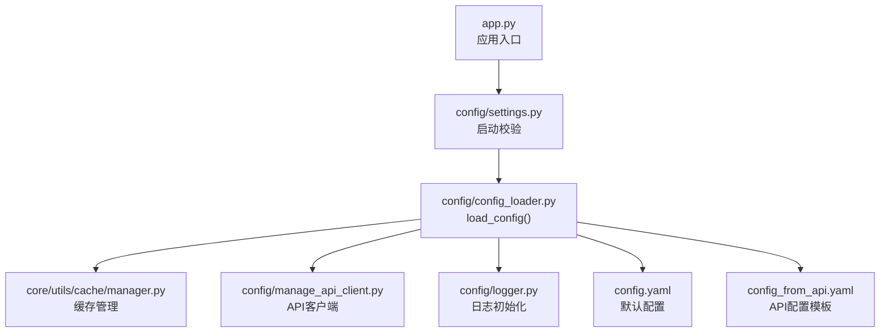
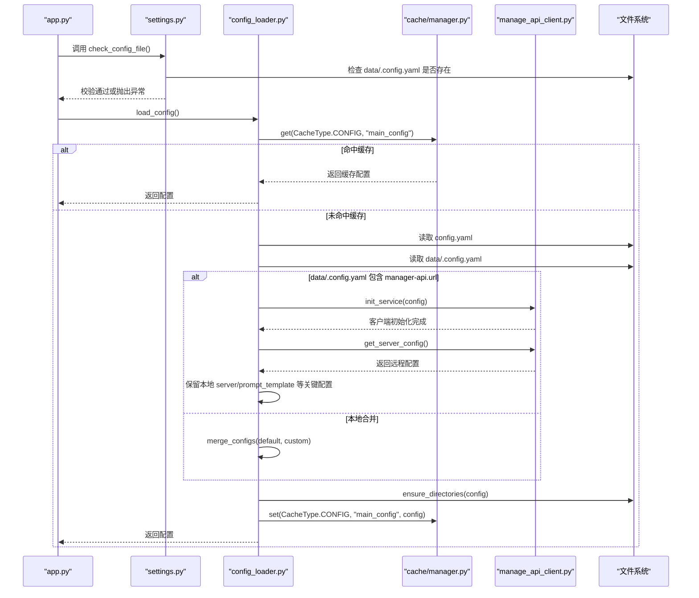
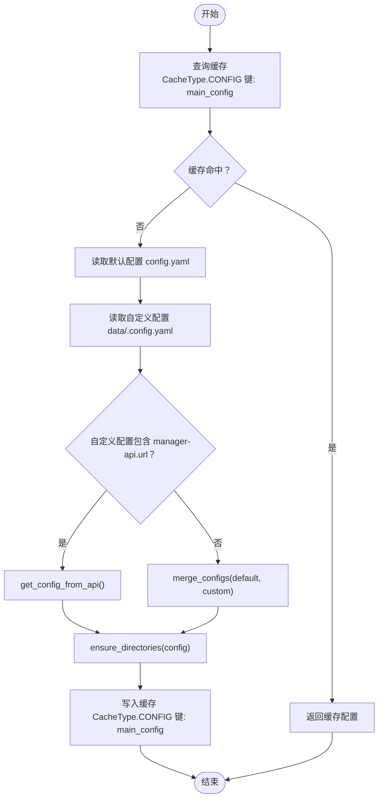
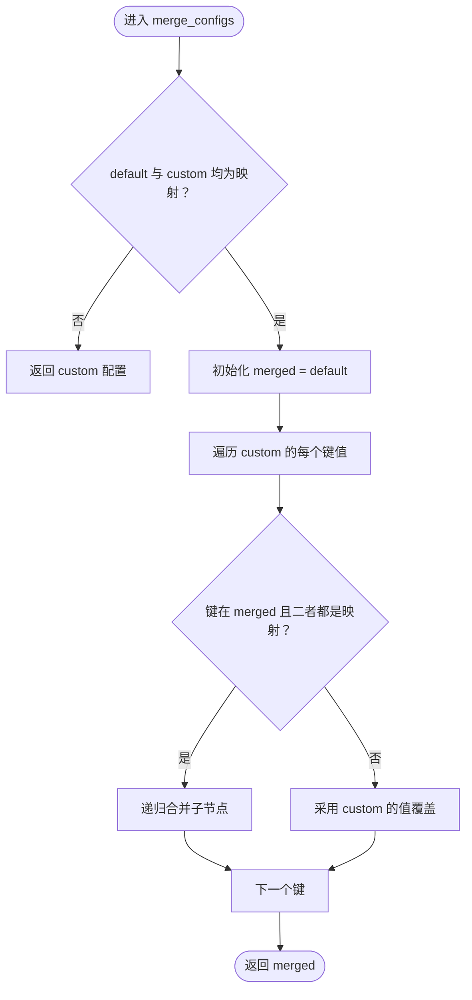
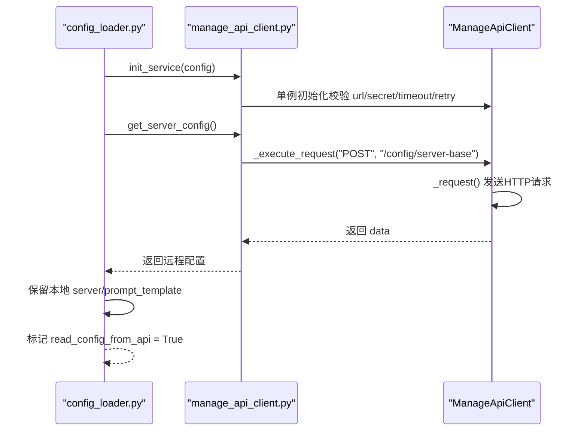
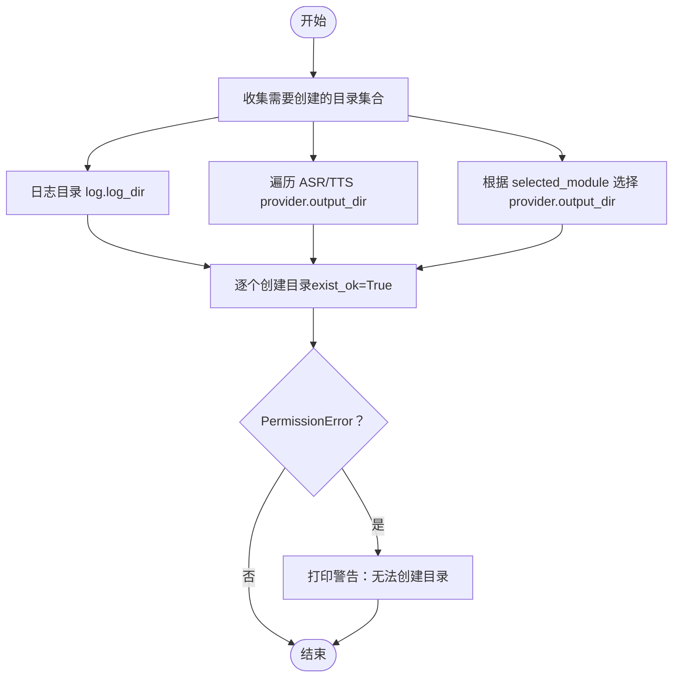
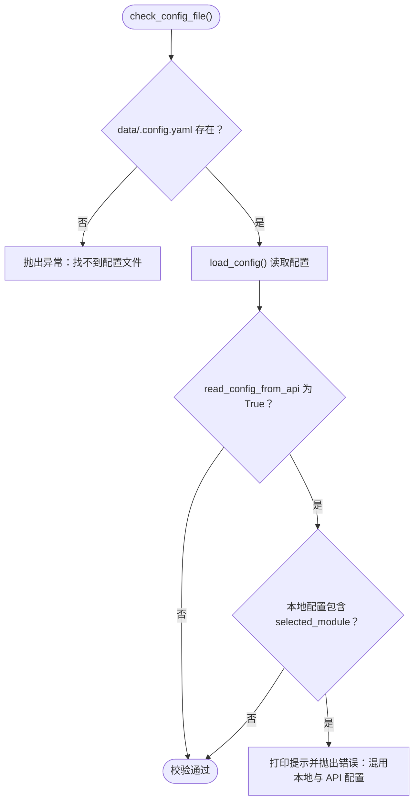
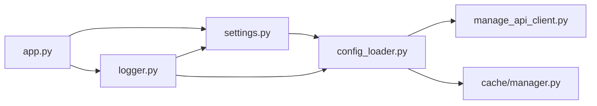

# 配置加载机制

<cite>
**本文引用的文件**
- [config_loader.py](file://config/config_loader.py)
- [settings.py](file://config/settings.py)
- [manage_api_client.py](file://config/manage_api_client.py)
- [logger.py](file://config/logger.py)
- [app.py](file://app.py)
- [config.yaml](file://config.yaml)
- [config_from_api.yaml](file://config_from_api.yaml)
- [manager.py](file://core/utils/cache/manager.py)
- [config.py](file://core/utils/cache/config.py)
</cite>

## 目录
1. [简介](#简介)
2. [项目结构](#项目结构)
3. [核心组件](#核心组件)
4. [架构总览](#架构总览)
5. [详细组件分析](#详细组件分析)
6. [依赖分析](#依赖分析)
7. [性能考量](#性能考量)
8. [故障排查指南](#故障排查指南)
9. [结论](#结论)

## 简介
本文件围绕配置加载机制展开，重点解析 config_loader.py 与 settings.py 如何协同工作，实现灵活的配置管理。内容涵盖：
- load_config() 的执行流程：缓存检查、默认与自定义配置文件定位、manager-api 配置决策、合并策略与目录确保。
- merge_configs() 的递归合并逻辑，明确用户自定义配置如何覆盖默认值。
- get_config_from_api() 的 API 客户端初始化与远程配置拉取，以及本地 server 等关键配置的保留策略。
- ensure_directories() 的目录自动创建逻辑。
- settings.py 中 check_config_file() 的启动校验流程，包括 data/.config.yaml 存在性检查、本地与 API 配置混用冲突检测与提示。

## 项目结构
配置相关的核心文件分布如下：
- config/config_loader.py：配置加载、合并、API 获取、目录确保。
- config/settings.py：启动阶段的配置文件存在性与冲突检查。
- config/manage_api_client.py：manager-api 客户端封装、请求重试与异常处理。
- config/logger.py：日志初始化与配置读取，依赖配置加载。
- app.py：应用入口，调用配置加载并进行后续初始化。
- config.yaml：默认配置模板。
- config_from_api.yaml：从 API 获取配置时的示例模板。
- core/utils/cache/manager.py 与 core/utils/cache/config.py：全局缓存管理器与缓存配置，load_config() 使用缓存提升性能。

图表来源
- [app.py](file://app.py#L1-L145)
- [settings.py](file://config/settings.py#L1-L34)
- [config_loader.py](file://config/config_loader.py#L1-L152)
- [manage_api_client.py](file://config/manage_api_client.py#L1-L194)
- [logger.py](file://config/logger.py#L1-L115)
- [config.yaml](file://config.yaml#L1-L200)
- [config_from_api.yaml](file://config_from_api.yaml#L1-L27)
- [manager.py](file://core/utils/cache/manager.py#L1-L217)
- [config.py](file://core/utils/cache/config.py#L1-L62)

章节来源
- [app.py](file://app.py#L1-L145)
- [settings.py](file://config/settings.py#L1-L34)
- [config_loader.py](file://config/config_loader.py#L1-L152)
- [manage_api_client.py](file://config/manage_api_client.py#L1-L194)
- [logger.py](file://config/logger.py#L1-L115)
- [config.yaml](file://config.yaml#L1-L200)
- [config_from_api.yaml](file://config_from_api.yaml#L1-L27)
- [manager.py](file://core/utils/cache/manager.py#L1-L217)
- [config.py](file://core/utils/cache/config.py#L1-L62)

## 核心组件
- 配置加载器（config/config_loader.py）
  - load_config()：主流程入口，负责缓存检查、文件路径确定、合并或 API 获取、目录确保与缓存写入。
  - get_config_from_api()：通过 init_service() 初始化 API 客户端，调用 get_server_config() 获取远程配置，并保留本地 server 与 prompt_template 等关键配置。
  - merge_configs()：递归合并默认配置与自定义配置，自定义项优先覆盖默认项。
  - ensure_directories()：根据配置自动创建日志、ASR/TTS 输出目录与选定模块模型输出目录。
  - read_config()、get_project_dir()：辅助函数，读取 YAML 文件与获取项目根目录。
- 启动校验器（config/settings.py）
  - check_config_file()：在首次使用配置前检查 data/.config.yaml 是否存在；若从 API 读取配置且发现本地配置混用，给出明确提示与错误。
- API 客户端（config/manage_api_client.py）
  - ManageApiClient：单例客户端，负责初始化连接池、请求重试、异常分类与业务错误处理。
  - get_server_config()、get_agent_models()：远程配置与私有模型配置获取。
  - init_service()：对外暴露的初始化入口。
- 缓存管理（core/utils/cache/manager.py、core/utils/cache/config.py）
  - GlobalCacheManager：提供 get/set/delete/clear/invalidate_pattern 等能力，load_config() 使用 CONFIG 类型缓存主配置。
  - CacheType/CacheConfig：定义缓存类型与默认配置，CONFIG 类型采用固定大小策略，便于手动失效与复用。

章节来源
- [config_loader.py](file://config/config_loader.py#L1-L152)
- [settings.py](file://config/settings.py#L1-L34)
- [manage_api_client.py](file://config/manage_api_client.py#L1-L194)
- [manager.py](file://core/utils/cache/manager.py#L1-L217)
- [config.py](file://core/utils/cache/config.py#L1-L62)

## 架构总览
配置加载的整体流程如下：
- 应用启动时，app.py 调用 load_config() 获取配置。
- load_config() 首先查询缓存，命中则直接返回；未命中则读取默认 config.yaml 与 data/.config.yaml。
- 若 data/.config.yaml 中包含 manager-api.url，则走“从 API 获取配置”分支；否则走“本地合并配置”分支。
- 无论哪种分支，最终都会确保必要目录存在，并将配置写入缓存。
- settings.check_config_file() 在日志初始化前调用，确保 data/.config.yaml 存在并进行冲突检测。

图表来源
- [app.py](file://app.py#L1-L145)
- [settings.py](file://config/settings.py#L1-L34)
- [config_loader.py](file://config/config_loader.py#L1-L152)
- [manage_api_client.py](file://config/manage_api_client.py#L1-L194)
- [manager.py](file://core/utils/cache/manager.py#L1-L217)

## 详细组件分析

### load_config() 执行流程
- 缓存检查：使用全局缓存管理器按类型 CONFIG 与键 "main_config" 查询，命中则直接返回，避免重复 IO 与网络请求。
- 文件路径确定：
  - 默认配置路径：项目根目录 config.yaml。
  - 自定义配置路径：项目根目录 data/.config.yaml。
- 合并与 API 分支：
  - 若自定义配置包含 manager-api.url，则调用 get_config_from_api() 通过 API 获取远程配置，并保留本地 server 与 prompt_template 等关键字段。
  - 否则，调用 merge_configs() 递归合并默认配置与自定义配置，自定义项优先覆盖默认项。
- 目录确保：ensure_directories() 根据配置自动创建日志目录、ASR/TTS 输出目录以及选定模块的模型输出目录。
- 缓存写入：将合并后的配置写入缓存，供后续快速读取。

图表来源
- [config_loader.py](file://config/config_loader.py#L18-L44)

章节来源
- [config_loader.py](file://config/config_loader.py#L18-L44)

### merge_configs() 递归合并逻辑
- 输入：默认配置 default_config 与自定义配置 custom_config。
- 合并规则：
  - 若任一参数不是映射类型，则返回自定义配置（自定义优先）。
  - 对自定义配置的每个键进行遍历：
    - 若键存在于默认配置且二者均为映射类型，则递归合并子节点；
    - 否则直接采用自定义配置的值（覆盖默认值）。
- 输出：合并后的配置对象，保证用户自定义配置优先级高于默认值。

图表来源
- [config_loader.py](file://config/config_loader.py#L123-L152)

章节来源
- [config_loader.py](file://config/config_loader.py#L123-L152)

### get_config_from_api() 的 API 获取流程
- 初始化 API 客户端：调用 init_service(config) 以单例方式初始化 ManageApiClient，内部校验 manager-api.url 与 secret 的有效性，并建立持久化连接池。
- 获取远程配置：调用 get_server_config() 发起请求，内部通过 _execute_request() 执行带重试的 HTTP 请求。
- 保留本地关键配置：
  - 保留本地 server 字段（ip、port、http_port、vision_explain、auth_key）。
  - 若远程配置缺失 prompt_template，则回退到本地配置。
  - 标记 read_config_from_api 为 True，用于后续流程提示与行为差异。
- 异常处理：若远程配置获取失败，抛出异常提示。

图表来源
- [config_loader.py](file://config/config_loader.py#L47-L74)
- [manage_api_client.py](file://config/manage_api_client.py#L1-L194)

章节来源
- [config_loader.py](file://config/config_loader.py#L47-L74)
- [manage_api_client.py](file://config/manage_api_client.py#L1-L194)

### ensure_directories() 目录自动创建
- 日志目录：从配置 log.log_dir 读取，确保项目根目录下存在。
- ASR/TTS 输出目录：遍历 ASR/TTS 模块配置，提取 provider.output_dir 并创建。
- 选定模块模型目录：根据 selected_module 选择对应模块与 provider，拼接项目根目录与 provider.output_dir，创建模型输出目录。
- 权限处理：创建过程中捕获权限错误并打印警告，避免因权限不足导致启动失败。

图表来源
- [config_loader.py](file://config/config_loader.py#L82-L122)

章节来源
- [config_loader.py](file://config/config_loader.py#L82-L122)

### settings.py 的启动校验流程
- 存在性检查：在首次使用配置前，检查 data/.config.yaml 是否存在，不存在则抛出异常，引导用户按教程准备配置文件。
- 冲突检测：若 load_config() 返回的配置标记 read_config_from_api 为 True，且本地配置中包含 selected_module 等字段，则判定为本地与 API 配置混用，给出明确提示并抛出错误，指导用户将根目录的 config_from_api.yaml 复制到 data 下并重命名为 .config.yaml，再按教程配置接口地址与密钥。

图表来源
- [settings.py](file://config/settings.py#L9-L34)

章节来源
- [settings.py](file://config/settings.py#L9-L34)

## 依赖分析
- 组件耦合关系
  - app.py 依赖 settings.py 的配置校验与 logger 的日志初始化。
  - settings.py 依赖 config_loader.py 的读取与加载能力。
  - config_loader.py 依赖 manage_api_client.py 的 API 客户端与 core/utils/cache/manager.py 的缓存管理。
  - logger.py 依赖 settings.py 的 check_config_file() 与 config_loader.py 的 load_config()。
- 关键依赖链
  - app.py → settings.py → config_loader.py → manage_api_client.py
  - app.py → logger.py → settings.py → config_loader.py
  - config_loader.py → core/utils/cache/manager.py

图表来源
- [app.py](file://app.py#L1-L145)
- [settings.py](file://config/settings.py#L1-L34)
- [config_loader.py](file://config/config_loader.py#L1-L152)
- [manage_api_client.py](file://config/manage_api_client.py#L1-L194)
- [manager.py](file://core/utils/cache/manager.py#L1-L217)
- [logger.py](file://config/logger.py#L1-L115)

章节来源
- [app.py](file://app.py#L1-L145)
- [settings.py](file://config/settings.py#L1-L34)
- [config_loader.py](file://config/config_loader.py#L1-L152)
- [manage_api_client.py](file://config/manage_api_client.py#L1-L194)
- [manager.py](file://core/utils/cache/manager.py#L1-L217)
- [logger.py](file://config/logger.py#L1-L115)

## 性能考量
- 缓存策略：CONFIG 类型采用固定大小策略，避免无限增长，适合主配置的频繁读取场景；同时提供 TTL 与 LRU/LRU+TTL 等策略，满足不同缓存需求。
- 重试与超时：API 客户端内置指数退避与重试机制，针对网络连接、超时与常见 HTTP 状态码进行重试，提升稳定性。
- 目录创建：ensure_directories() 统一创建，避免重复 IO；对权限错误进行降级处理，保障启动可用性。
- 启动顺序：settings.check_config_file() 在 logger.setup_logging() 前执行，确保日志初始化时已有有效配置。

章节来源
- [config.py](file://core/utils/cache/config.py#L1-L62)
- [manager.py](file://core/utils/cache/manager.py#L1-L217)
- [manage_api_client.py](file://config/manage_api_client.py#L1-L194)
- [logger.py](file://config/logger.py#L1-L115)

## 故障排查指南
- 找不到 data/.config.yaml
  - 现象：启动时报错提示找不到配置文件。
  - 处理：按教程在 data 目录创建 .config.yaml，并将 config_from_api.yaml 复制到 data 下重命名为 .config.yaml。
  - 参考：[settings.py](file://config/settings.py#L16-L20)
- 本地与 API 配置混用
  - 现象：从 API 读取配置时，本地配置仍包含 selected_module 等字段，触发冲突提示并报错。
  - 处理：将根目录的 config_from_api.yaml 复制到 data 下并重命名为 .config.yaml，按教程配置 manager-api.url 与 secret。
  - 参考：[settings.py](file://config/settings.py#L22-L33)
- API 获取失败
  - 现象：get_server_config() 返回空或抛出异常。
  - 处理：检查 manager-api.url 与 secret 是否正确；确认网络可达；查看重试日志；必要时调整超时与重试参数。
  - 参考：[config_loader.py](file://config/config_loader.py#L57-L58)、[manage_api_client.py](file://config/manage_api_client.py#L128-L131)
- 目录权限不足
  - 现象：日志或模型输出目录无法创建。
  - 处理：检查目标目录写权限；以管理员身份运行或调整目录权限。
  - 参考：[config_loader.py](file://config/config_loader.py#L117-L121)
- 缓存命中与失效
  - 现象：配置变更后未生效。
  - 处理：确认 CONFIG 类型缓存策略为固定大小且手动失效；必要时调用缓存清理或重启应用。
  - 参考：[config.py](file://core/utils/cache/config.py#L52-L54)、[manager.py](file://core/utils/cache/manager.py#L139-L183)

章节来源
- [settings.py](file://config/settings.py#L16-L33)
- [config_loader.py](file://config/config_loader.py#L47-L74)
- [manage_api_client.py](file://config/manage_api_client.py#L128-L131)
- [config_loader.py](file://config/config_loader.py#L117-L121)
- [config.py](file://core/utils/cache/config.py#L52-L54)
- [manager.py](file://core/utils/cache/manager.py#L139-L183)

## 结论
本配置加载机制通过“缓存优先 + 本地合并或 API 获取 + 目录确保”的设计，实现了灵活、健壮且高性能的配置管理：
- 本地优先：默认配置与自定义配置递归合并，用户自定义项始终覆盖默认值。
- API 友好：当存在 manager-api.url 时，自动从远端拉取配置，并保留本地关键字段，避免重复维护。
- 启动可靠：settings.check_config_file() 在日志初始化前进行严格校验，及时发现并提示配置混用问题。
- 性能优化：全局缓存管理器与 API 客户端重试机制共同保障启动与运行效率。