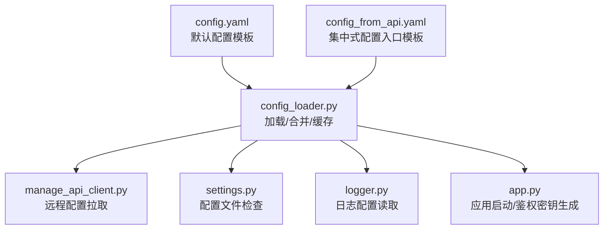
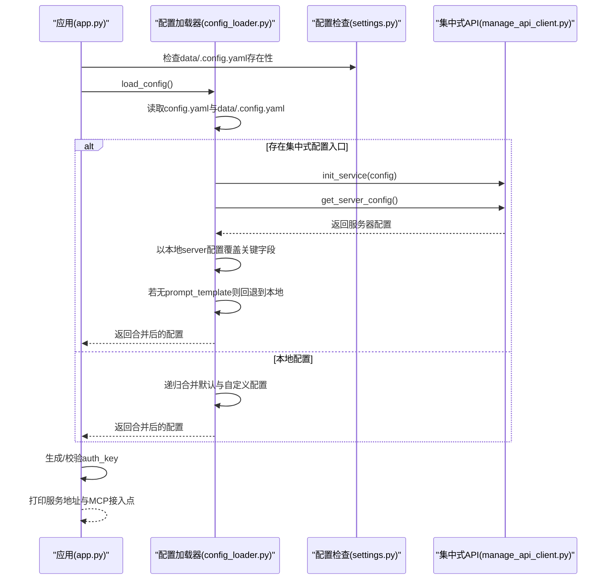
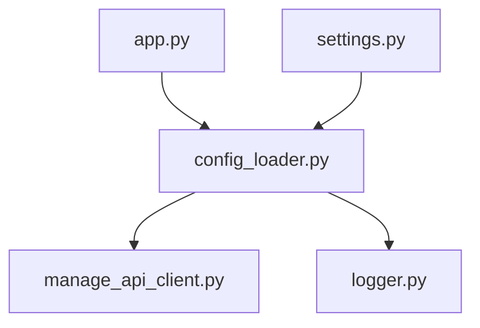

# 配置文件详解

<cite>
**本文引用的文件**
- [config.yaml](file://config.yaml)
- [config_from_api.yaml](file://config_from_api.yaml)
- [config_loader.py](file://config/config_loader.py)
- [manage_api_client.py](file://config/manage_api_client.py)
- [settings.py](file://config/settings.py)
- [app.py](file://app.py)
- [logger.py](file://config/logger.py)
</cite>

## 目录
1. [简介](#简介)
2. [项目结构](#项目结构)
3. [核心组件](#核心组件)
4. [架构总览](#架构总览)
5. [详细组件分析](#详细组件分析)
6. [依赖分析](#依赖分析)
7. [性能考虑](#性能考虑)
8. [故障排查指南](#故障排查指南)
9. [结论](#结论)
10. [附录](#附录)

## 简介
本文件围绕本项目的两大配置文件展开：config.yaml（默认/本地配置）与config_from_api.yaml（集中式配置入口）。前者提供完整的模块化配置模板，后者用于引导用户通过外部管理API动态拉取配置，实现集中式配置管理与快速部署。本文将：
- 逐项解析config.yaml中各顶级配置块的功能与参数含义（server、log、selected_module、ASR、LLM、TTS、Intent、Memory、VAD、VLLM、plugins、voiceprint、prompt、prompt_template、end_prompt、mcp_endpoint、wakeup_words、module_test、xiaozhi、exit_commands、tts_timeout、close_connection_no_voice_time、delete_audio、enable_wakeup_words_response_cache、enable_greeting、enable_stop_tts_notify、stop_tts_notify_voice、tts_audio_send_delay等）
- 说明config_from_api.yaml的作用与使用方式，以及如何通过外部API覆盖本地配置
- 对比两种配置文件的优先级与加载逻辑，明确何时优先使用API返回的配置
- 提供配置项命名规范与层级关系说明，帮助用户正确修改配置以实现功能切换或性能调优
- 给出必填项与可选项标注，并提供完整示例路径（以文件路径代替具体代码片段）

## 项目结构
本项目采用“默认配置 + 用户自定义配置”的双层配置策略，并通过集中式API实现远程配置下发与覆盖。关键文件与职责如下：
- config.yaml：默认配置模板，包含所有可用模块的配置项与注释说明
- config_from_api.yaml：集中式配置入口模板，指导用户将远程配置写入data/.config.yaml
- config/config_loader.py：配置加载与合并逻辑，负责缓存、目录初始化、API配置拉取与覆盖
- config/manage_api_client.py：集中式API客户端封装，负责鉴权、重试、错误处理
- config/settings.py：配置文件存在性检查与冲突提示
- config/logger.py：日志配置读取与格式化
- app.py：应用启动时读取配置、生成或校验鉴权密钥、打印服务地址

图表来源
- [config_loader.py](file://config/config_loader.py#L18-L75)
- [manage_api_client.py](file://config/manage_api_client.py#L128-L146)
- [settings.py](file://config/settings.py#L9-L34)
- [logger.py](file://config/logger.py#L48-L110)
- [app.py](file://app.py#L45-L118)

章节来源
- [config.yaml](file://config.yaml#L1-L120)
- [config_from_api.yaml](file://config_from_api.yaml#L1-L27)
- [config_loader.py](file://config/config_loader.py#L18-L75)
- [manage_api_client.py](file://config/manage_api_client.py#L128-L146)
- [settings.py](file://config/settings.py#L9-L34)
- [logger.py](file://config/logger.py#L48-L110)
- [app.py](file://app.py#L45-L118)

## 核心组件
- 配置加载器（config/config_loader.py）
  - 读取默认配置与用户自定义配置（data/.config.yaml），若存在集中式配置入口则优先从API拉取
  - 合并配置（用户自定义优先级高于默认）
  - 初始化日志与目录（确保输出目录存在）
  - 缓存主配置，避免重复IO
- 集中式API客户端（config/manage_api_client.py）
  - 单例模式，统一HTTP客户端与鉴权头
  - 提供重试机制与错误分类处理
  - 暴露获取服务器基础配置与代理模型配置的方法
- 配置文件检查（config/settings.py）
  - 检查data/.config.yaml是否存在
  - 若从API读取配置，提示用户避免同时包含本地与集中式配置
- 应用启动（app.py）
  - 读取配置，生成或校验鉴权密钥（auth_key）
  - 打印服务地址与MCP接入点信息

章节来源
- [config_loader.py](file://config/config_loader.py#L18-L152)
- [manage_api_client.py](file://config/manage_api_client.py#L1-L194)
- [settings.py](file://config/settings.py#L9-L34)
- [app.py](file://app.py#L45-L118)

## 架构总览
集中式配置拉取流程如下：

图表来源
- [app.py](file://app.py#L45-L118)
- [config_loader.py](file://config/config_loader.py#L18-L75)
- [manage_api_client.py](file://config/manage_api_client.py#L128-L146)
- [settings.py](file://config/settings.py#L9-L34)

## 详细组件分析

### 服务器与日志配置（server、log）
- server
  - ip/port/http_port：监听地址、WebSocket端口、HTTP端口
  - websocket/vision_explain：OTA/视觉分析对外地址（Docker/公网部署时需手动修正）
  - timezone_offset：时区偏移
  - auth.enabled/allowed_devices：认证开关与白名单
  - mqtt_gateway/mqtt_signature_key/udp_gateway：网关对接
- log
  - log_format/log_format_file：控制台与文件日志格式
  - log_level：日志级别
  - log_dir/log_file：日志目录与文件名
  - data_dir：数据目录

章节来源
- [config.yaml](file://config.yaml#L9-L57)
- [logger.py](file://config/logger.py#L48-L110)

### 通用行为与系统提示（xiaozhi、prompt、prompt_template、end_prompt、plugins、voiceprint、wakeup_words、module_test、exit_commands、tts_timeout、close_connection_no_voice_time、delete_audio、enable_wakeup_words_response_cache、enable_greeting、enable_stop_tts_notify、stop_tts_notify_voice、tts_audio_send_delay）
- xiaozhi：传输方式、音频参数（格式、采样率、声道、帧时长）
- prompt：系统提示词（可替换为模板文件）
- prompt_template：默认提示词模板文件路径
- end_prompt：结束语开关与内容
- plugins：天气、新闻、Home Assistant、音乐播放、RAG等插件配置
- voiceprint：声纹接口地址、说话人列表、相似度阈值
- wakeup_words：唤醒词列表
- module_test：模块测试语句
- exit_commands：退出命令列表
- tts_timeout：TTS请求超时
- close_connection_no_voice_time：无语音时断开连接时间
- delete_audio：使用完声音文件后删除
- enable_wakeup_words_response_cache/enable_greeting/enable_stop_tts_notify/stop_tts_notify_voice/tts_audio_send_delay：唤醒词响应缓存、开场问候、提示音、提示音文件、TTS音频发送延迟策略

章节来源
- [config.yaml](file://config.yaml#L83-L171)
- [config.yaml](file://config.yaml#L117-L171)
- [config.yaml](file://config.yaml#L172-L219)

### 选定模块与意图/记忆/VAD/VLLM（selected_module、Intent、Memory、VAD、VLLM）
- selected_module：选择各模块的适配器（VAD/ASR/LLM/TTS/Memory/Intent/VLLM）
- Intent：nointent/intent_llm/function_call三种策略，可配置独立LLM与函数插件
- Memory：mem0ai/nomem/mem_local_short三种记忆策略，可配置独立LLM
- VAD：SileroVAD阈值与模型目录
- VLLM：视觉语言模型（如ChatGLM/Qwen/讯飞Spark等）

章节来源
- [config.yaml](file://config.yaml#L201-L220)
- [config.yaml](file://config.yaml#L221-L259)
- [config.yaml](file://config.yaml#L260-L276)
- [config.yaml](file://config.yaml#L469-L476)
- [config.yaml](file://config.yaml#L611-L635)

### 语音识别（ASR）配置
- FunASR：本地模型（模型目录、输出目录）
- FunASRServer：远程FunASR服务（主机、端口、SSL、API密钥、输出目录）
- SherpaASR/SherpaParaformerASR：Sherpa-ONNX本地模型（模型目录、输出目录、模型类型）
- DoubaoASR/DoubaoStreamASR：字节跳动火山引擎ASR（appid、access_token、cluster、热词/替换词表、输出目录）
- TencentASR：腾讯云ASR（appid、secret_id、secret_key、输出目录）
- AliyunASR/AliyunStreamASR：阿里云ASR（appkey、token、access_key_id、access_key_secret、主机、断句静音、输出目录）
- BaiduASR：百度ASR（app_id、api_key、secret_key、语言参数、输出目录）
- OpenaiASR/GroqASR：OpenAI/Groq Whisper（API密钥、基础URL、模型名、输出目录）
- VoskASR：Vosk离线模型（模型路径、输出目录）
- Qwen3ASRFlash：通义千问ASR Flash（API密钥、基础URL、模型名、输出目录、LID/ITN开关、上下文）
- XunfeiStreamASR：讯飞流式ASR（APPID、APIKey、APISecret、识别领域、语言、方言、动态修正、输出目录）

章节来源
- [config.yaml](file://config.yaml#L277-L468)

### 大语言模型（LLM）配置
- AliLLM/AliAppLLM：阿里百炼（基础URL、模型名、API密钥、温度、最大token、top_p/top_k、频率惩罚、应用ID/记忆ID等）
- DoubaoLLM：字节跳动Doubao（基础URL、模型名、API密钥）
- DeepSeekLLM：DeepSeek（模型名、URL、API密钥）
- ChatGLMLLM：智谱GLM（模型名、URL、API密钥）
- OllamaLLM：Ollama（模型名、本地服务地址）
- DifyLLM：Dify（基础URL、API密钥、模式）
- GeminiLLM：Google Gemini（API密钥、模型名、代理）
- CozeLLM：Coze（bot_id、user_id、个人访问令牌）
- VolcesAiGatewayLLM：火山引擎边缘大模型网关（基础URL、模型名、API密钥）
- LMStudioLLM：LM Studio（模型名、本地服务地址、固定API Key）
- HomeAssistant：Home Assistant对话集成（基础URL、agent_id、API密钥）
- FastgptLLM：FastGPT（基础URL、API密钥、变量）
- XinferenceLLM/XinferenceSmallLLM：Xinference（模型名、本地服务地址）

章节来源
- [config.yaml](file://config.yaml#L477-L610)

### 语音合成（TTS）配置
- EdgeTTS：Edge TTS（音色、输出目录）
- DoubaoTTS：字节跳动Doubao（API URL、音色、授权、appid、access_token、cluster、速度/音量/音高比例、输出目录）
- HuoshanDoubleStreamTTS：火山引擎双向流式TTS（WS URL、appid、access_token、资源ID、说话人、语速/响度/音高）
- CosyVoiceSiliconflow：硅基流动CosyVoice2（模型、音色、输出目录、Access Token、响应格式）
- CozeCnTTS：Coze中文TTS（音色、输出目录、Access Token、响应格式）
- VolcesAiGatewayTTS：火山引擎边缘大模型网关TTS（API密钥、API URL、模型、音色、速度、输出目录）
- FishSpeech：FishSpeech（输出格式、参考音频/文本、归一化、生成参数、流式、缓存、采样率等）
- GPT_SOVITS_V2/V3：GPT-SoVITS（服务URL、文本语言/参考音频/提示文本/提示语言、top_k/p/temperature、切分/批处理/并行、重复惩罚、参考音频集合等）
- MinimaxTTSHTTPStream：Minimax流式TTS（Group ID、API密钥、模型、音色、可选音色/语速/音量/音高/情感/发音字典/音频设置）

章节来源
- [config.yaml](file://config.yaml#L635-L800)

### 集中式配置入口（config_from_api.yaml）
- 作用：指导用户将远程配置写入data/.config.yaml，从而启用集中式配置管理
- 关键项：
  - server.ip/port/http_port/vision_explain：服务器对外地址（Docker/公网部署时需修正）
  - manager-api.url/secret：管理API地址与密钥（从管理后台复制server.secret）
  - prompt_template：默认提示词模板文件（若服务器未提供则回退到本地）

章节来源
- [config_from_api.yaml](file://config_from_api.yaml#L1-L27)

### 配置加载与优先级（config/config_loader.py）
- 加载顺序与优先级
  - 读取默认配置（config.yaml）与用户自定义配置（data/.config.yaml）
  - 若用户自定义配置包含manager-api.url，则优先从API拉取服务器配置
  - 合并策略：用户自定义配置优先级高于默认配置
  - 目录初始化：确保日志与各模块输出目录存在
  - 缓存：主配置缓存于内存，避免重复IO
- API拉取覆盖规则
  - 读取API返回的服务器配置
  - 以本地server配置覆盖关键字段（ip/port/http_port/vision_explain/auth_key）
  - 若服务器未提供prompt_template，则回退到本地配置

章节来源
- [config_loader.py](file://config/config_loader.py#L18-L75)
- [config_loader.py](file://config/config_loader.py#L123-L152)

### 集中式API客户端（config/manage_api_client.py）
- 单例模式：全局唯一实例，统一HTTP客户端与鉴权头
- 鉴权：Authorization: Bearer <secret>
- 重试机制：对连接错误、超时、限流/服务异常等进行指数退避重试
- 错误处理：区分设备未找到、设备绑定异常等业务错误
- 接口：
  - /config/server-base：获取服务器基础配置
  - /config/agent-models：按设备与客户端ID获取代理模型配置

章节来源
- [manage_api_client.py](file://config/manage_api_client.py#L1-L194)

### 配置文件检查（config/settings.py）
- 检查data/.config.yaml是否存在
- 若从API读取配置，且本地配置同时包含集中式配置段，提示用户仅保留一种配置来源

章节来源
- [settings.py](file://config/settings.py#L9-L34)

### 应用启动与鉴权密钥（app.py）
- 读取配置，生成或校验auth_key（优先级：配置文件server.auth_key > manager-api.secret > 自动生成UUID）
- 打印服务地址（OTA/视觉分析/WebSocket）、MCP接入点校验与转换

章节来源
- [app.py](file://app.py#L45-L118)

## 依赖分析
- 配置加载器依赖集中式API客户端以实现远程配置拉取
- 应用启动依赖配置加载器与日志配置
- 配置检查依赖配置加载器以判断是否从API读取配置

图表来源
- [config_loader.py](file://config/config_loader.py#L18-L75)
- [manage_api_client.py](file://config/manage_api_client.py#L128-L146)
- [logger.py](file://config/logger.py#L48-L110)
- [app.py](file://app.py#L45-L118)
- [settings.py](file://config/settings.py#L9-L34)

章节来源
- [config_loader.py](file://config/config_loader.py#L18-L75)
- [manage_api_client.py](file://config/manage_api_client.py#L128-L146)
- [logger.py](file://config/logger.py#L48-L110)
- [app.py](file://app.py#L45-L118)
- [settings.py](file://config/settings.py#L9-L34)

## 性能考虑
- 配置缓存：主配置在内存中缓存，避免重复IO
- 目录预创建：确保日志与各模块输出目录存在，减少运行时IO错误
- API重试：对网络波动与服务异常进行重试，提升稳定性
- 模块选择：通过selected_module切换不同提供商，结合硬件能力与网络环境选择本地/云端/流式/非流式方案

[本节为通用建议，不涉及具体文件分析]

## 故障排查指南
- 找不到data/.config.yaml
  - 现象：启动时报错提示找不到配置文件
  - 处理：按教程在data目录创建.config.yaml（可从config_from_api.yaml复制并重命名为.config.yaml）
- 同时包含本地与集中式配置
  - 现象：从API读取配置时提示同时包含本地与集中式配置
  - 处理：仅保留一种配置来源（建议使用集中式配置）
- 集中式API鉴权失败
  - 现象：manager-api.url或secret缺失或错误
  - 处理：在管理后台复制server.secret，填入data/.config.yaml的manager-api.secret
- 设备未找到/绑定异常
  - 现象：API返回设备未找到或绑定异常
  - 处理：检查设备ID与绑定码，重新绑定
- 目录权限不足
  - 现象：无法创建日志/模型/输出目录
  - 处理：检查写入权限或调整配置中的目录路径

章节来源
- [settings.py](file://config/settings.py#L9-L34)
- [manage_api_client.py](file://config/manage_api_client.py#L1-L194)
- [config_loader.py](file://config/config_loader.py#L82-L121)

## 结论
- 本地配置（config.yaml）提供完整的模块化配置模板，适合快速上手与离线部署
- 集中式配置（config_from_api.yaml + data/.config.yaml）通过管理API实现远程下发与覆盖，适合多设备、集中管理场景
- 加载逻辑遵循“用户自定义优先”的原则，若存在集中式入口则优先拉取API配置，并以本地server配置覆盖关键字段
- 建议在生产环境中使用集中式配置，配合管理后台统一维护密钥与模型参数，降低运维成本

[本节为总结性内容，不涉及具体文件分析]

## 附录

### 配置项命名规范与层级关系
- 命名规范
  - 顶级块：server、log、selected_module、ASR、LLM、TTS、Intent、Memory、VAD、VLLM、plugins、voiceprint、prompt、prompt_template、end_prompt、mcp_endpoint、wakeup_words、module_test、xiaozhi、exit_commands、tts_timeout、close_connection_no_voice_time、delete_audio、enable_wakeup_words_response_cache、enable_greeting、enable_stop_tts_notify、stop_tts_notify_voice、tts_audio_send_delay
  - 模块块内：各模块下以具体提供商名称（如FunASR、DoubaoASR、ChatGLMLLM、EdgeTTS等）为键，内部包含type与该提供商所需的参数
- 层级关系
  - 顶级块为一级配置，模块块为二级配置
  - 模块块内部的type字段决定适配器类型，其余字段为该适配器所需参数
  - selected_module为模块选择器，其值应与对应模块块中的提供商名称一致

章节来源
- [config.yaml](file://config.yaml#L201-L220)
- [config.yaml](file://config.yaml#L277-L800)

### 必填项与可选项标注（示例路径）
- server
  - 必填：ip、port、http_port
  - 可选：websocket、vision_explain、timezone_offset、auth.enabled、auth.allowed_devices、mqtt_gateway、mqtt_signature_key、udp_gateway
- log
  - 必填：log_level、log_dir、log_file、data_dir
  - 可选：log_format、log_format_file
- selected_module
  - 必填：VAD、ASR、LLM、TTS、Memory、Intent、VLLM
  - 可选：根据Intent/Memory/LLM等模块的策略与提供商而定
- ASR提供商（示例）
  - FunASR：必填type、model_dir、output_dir
  - DoubaoASR：必填type、appid、access_token、cluster、output_dir；可选热词/替换词表
  - AliyunASR：必填type、appkey、token或access_key_id/access_key_secret、output_dir
  - OpenaiASR/GroqASR：必填type、api_key、base_url、model_name、output_dir
  - VoskASR：必填type、model_path、output_dir
  - Qwen3ASRFlash：必填type、api_key、base_url、model_name、output_dir；可选enable_lid、enable_itn、context
- LLM提供商（示例）
  - ChatGLMLLM：必填type、model_name、url、api_key
  - OllamaLLM：必填type、model_name、base_url
  - DifyLLM：必填type、base_url、api_key；可选mode
  - XinferenceLLM/XinferenceSmallLLM：必填type、model_name、base_url
- TTS提供商（示例）
  - EdgeTTS：必填type、voice、output_dir
  - DoubaoTTS：必填type、api_url、voice、authorization、appid、access_token、cluster、speed_ratio、volume_ratio、pitch_ratio、output_dir
  - VolcesAiGatewayTTS：必填type、api_key、api_url、model、voice、speed、output_dir
  - FishSpeech：必填type、output_dir、response_format、reference_id/reference_audio/reference_text、normalize、max_new_tokens、chunk_length、top_p、repetition_penalty、temperature、streaming、use_memory_cache、channels、rate、api_key、api_url
  - GPT_SOVITS_V2/V3：必填type、url、text_lang/refer_wav_path/prompt_text/prompt_lang、top_k、top_p、temperature、text_split_method、batch_size、batch_threshold、split_bucket、return_fragment、speed_factor、streaming_mode、seed、parallel_infer、repetition_penalty、aux_ref_audio_paths；V3另含text_language、inp_refs、sample_steps、if_sr等
  - MinimaxTTSHTTPStream：必填type、group_id、api_key、model、voice_id；可选voice_setting/audio_setting等
- Intent/Memory/VAD/VLLM/plugins/voiceprint/prompt/prompt_template/end_prompt/mcp_endpoint/wakeup_words/module_test/xiaozhi/exit_commands/tts_timeout/close_connection_no_voice_time/delete_audio/enable_wakeup_words_response_cache/enable_greeting/enable_stop_tts_notify/stop_tts_notify_voice/tts_audio_send_delay
  - 必填：根据具体模块与提供商而定
  - 可选：根据具体模块与提供商而定

章节来源
- [config.yaml](file://config.yaml#L9-L57)
- [config.yaml](file://config.yaml#L83-L171)
- [config.yaml](file://config.yaml#L201-L220)
- [config.yaml](file://config.yaml#L277-L800)

### 完整配置示例（以文件路径代替具体代码片段）
- 本地配置示例路径
  - 服务器与日志：[config.yaml](file://config.yaml#L9-L57)
  - 选定模块与意图/记忆/VAD/VLLM：[config.yaml](file://config.yaml#L201-L220)
  - ASR提供商示例：[config.yaml](file://config.yaml#L277-L468)
  - LLM提供商示例：[config.yaml](file://config.yaml#L477-L610)
  - TTS提供商示例：[config.yaml](file://config.yaml#L635-L800)
- 集中式配置入口示例路径
  - 集中式配置入口模板：[config_from_api.yaml](file://config_from_api.yaml#L1-L27)