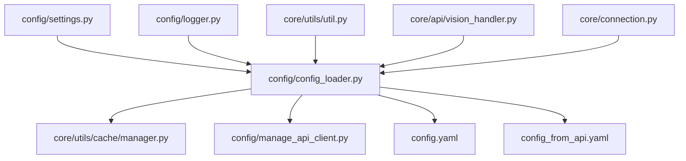
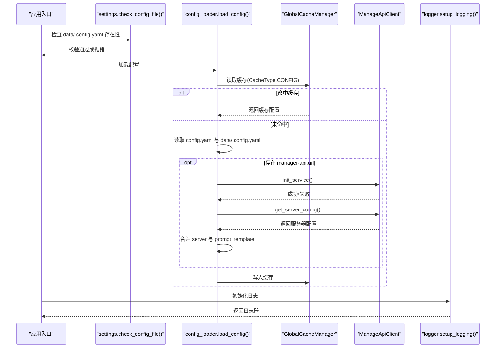
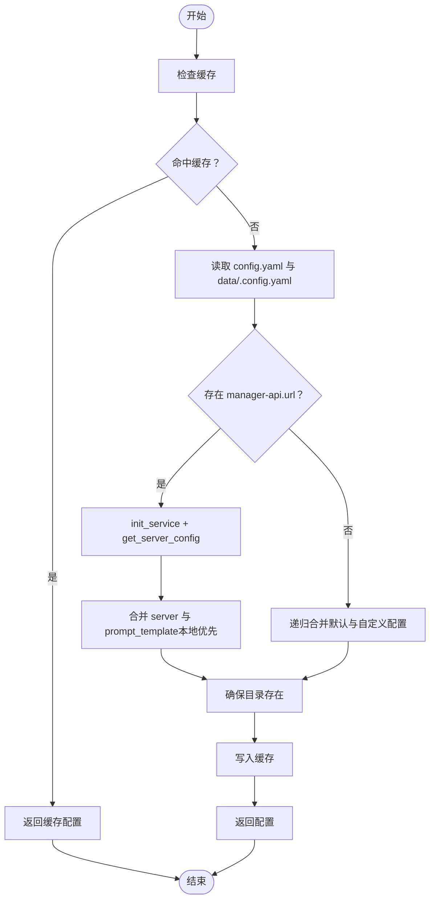
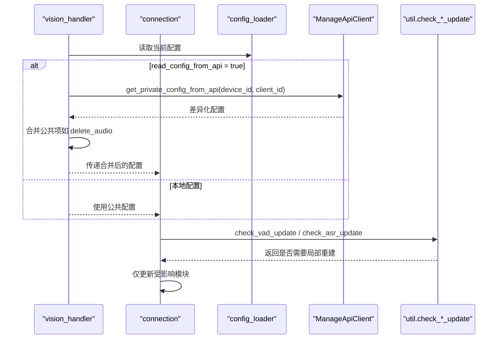
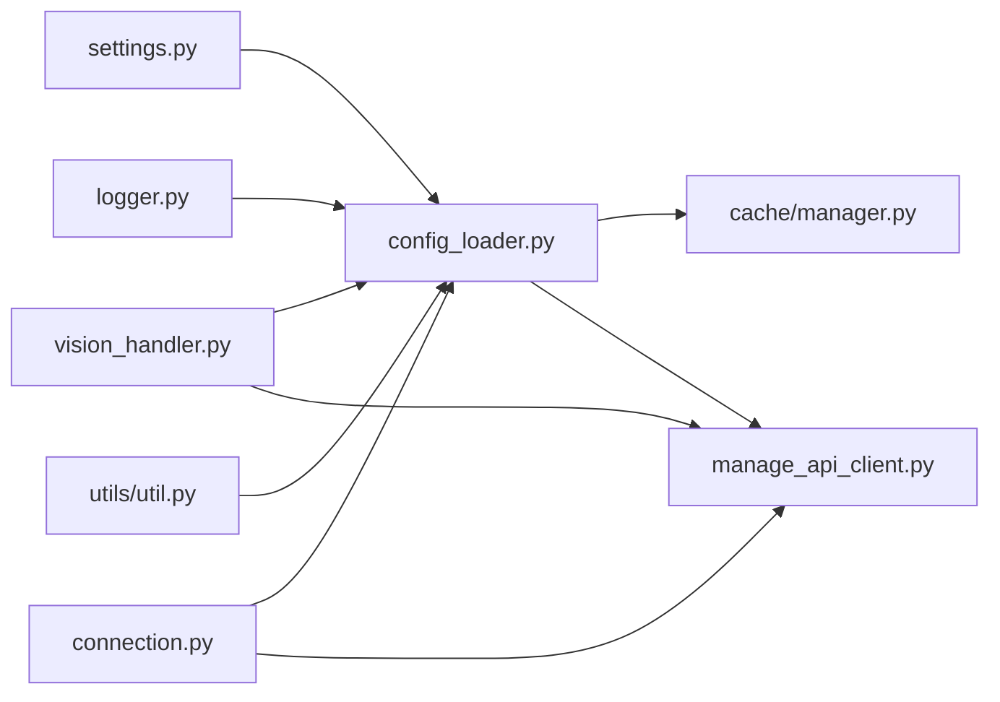

# 配置管理

<cite>
**本文引用的文件**
- [config/config_loader.py](file://config/config_loader.py)
- [config/settings.py](file://config/settings.py)
- [config/logger.py](file://config/logger.py)
- [config/manage_api_client.py](file://config/manage_api_client.py)
- [config.yaml](file://config.yaml)
- [config_from_api.yaml](file://config_from_api.yaml)
- [core/utils/cache/manager.py](file://core/utils/cache/manager.py)
- [core/utils/cache/config.py](file://core/utils/cache/config.py)
- [core/utils/cache/strategies.py](file://core/utils/cache/strategies.py)
- [core/utils/util.py](file://core/utils/util.py)
- [core/api/vision_handler.py](file://core/api/vision_handler.py)
- [core/connection.py](file://core/connection.py)
</cite>

## 目录
1. [简介](#简介)
2. [项目结构](#项目结构)
3. [核心组件](#核心组件)
4. [架构总览](#架构总览)
5. [详细组件分析](#详细组件分析)
6. [依赖关系分析](#依赖关系分析)
7. [性能考量](#性能考量)
8. [故障排查指南](#故障排查指南)
9. [结论](#结论)
10. [附录](#附录)

## 简介
本文件围绕配置管理展开，重点说明 config/ 模块如何实现灵活的配置加载与管理，涵盖 YAML 配置文件解析、配置优先级与覆盖机制、运行时热更新、类型与验证规则、日志初始化与格式化等。文档同时提供 config.yaml 的逐项详解与最佳实践建议，帮助读者在不直接粘贴代码的前提下，全面掌握配置系统的使用与扩展。

## 项目结构
配置相关的关键文件集中在 config/ 目录，并与缓存、日志、API 客户端、工具函数等模块协同工作：
- config/config_loader.py：负责读取、合并与缓存配置，支持从外部 API 动态拉取配置。
- config/settings.py：检查配置文件存在性与来源，辅助用户正确放置 data/.config.yaml。
- config/logger.py：基于配置初始化日志器，支持格式化与输出目标。
- config/manage_api_client.py：封装对外部管理 API 的访问，负责鉴权、重试与异常处理。
- config.yaml / config_from_api.yaml：默认配置与从智控台（manager-api）拉取配置的示例模板。
- core/utils/cache/*：全局缓存管理，用于配置缓存与清理。
- core/utils/util.py：提供配置变更检测（如 VAD/ASR 类型变更）与敏感信息过滤等工具。
- core/api/vision_handler.py 与 core/connection.py：演示如何在运行时按设备维度拉取差异化配置并触发局部热更新。

图表来源
- [config/config_loader.py](file://config/config_loader.py#L1-L152)
- [config/settings.py](file://config/settings.py#L1-L34)
- [config/logger.py](file://config/logger.py#L1-L115)
- [config/manage_api_client.py](file://config/manage_api_client.py#L1-L194)
- [config.yaml](file://config.yaml#L1-L1009)
- [config_from_api.yaml](file://config_from_api.yaml#L1-L27)
- [core/utils/cache/manager.py](file://core/utils/cache/manager.py#L1-L217)
- [core/utils/util.py](file://core/utils/util.py#L395-L565)
- [core/api/vision_handler.py](file://core/api/vision_handler.py#L71-L104)
- [core/connection.py](file://core/connection.py#L507-L570)

章节来源
- [config/config_loader.py](file://config/config_loader.py#L1-L152)
- [config/settings.py](file://config/settings.py#L1-L34)
- [config/logger.py](file://config/logger.py#L1-L115)
- [config/manage_api_client.py](file://config/manage_api_client.py#L1-L194)
- [config.yaml](file://config.yaml#L1-L1009)
- [config_from_api.yaml](file://config_from_api.yaml#L1-L27)
- [core/utils/cache/manager.py](file://core/utils/cache/manager.py#L1-L217)
- [core/utils/util.py](file://core/utils/util.py#L395-L565)
- [core/api/vision_handler.py](file://core/api/vision_handler.py#L71-L104)
- [core/connection.py](file://core/connection.py#L507-L570)

## 核心组件
- 配置加载与合并
  - 读取默认配置与用户自定义配置，按层级递归合并，用户自定义配置优先级更高。
  - 支持从外部管理 API 拉取配置，若本地存在 manager-api.url 则走 API 模式。
- 缓存与热更新
  - 配置通过全局缓存管理器缓存，避免重复 IO；运行时可通过 API 拉取差异化配置并触发局部热更新。
- 日志初始化
  - 基于配置中的 log 段落初始化日志器，支持控制台与文件输出、格式化、级别与轮转策略。
- 配置校验与安全
  - settings 检查 data/.config.yaml 存在性与来源冲突；util 提供敏感信息过滤与配置变更检测。

章节来源
- [config/config_loader.py](file://config/config_loader.py#L12-L152)
- [config/settings.py](file://config/settings.py#L9-L34)
- [config/logger.py](file://config/logger.py#L48-L114)
- [core/utils/util.py](file://core/utils/util.py#L395-L565)

## 架构总览
配置系统由“加载—合并—缓存—使用”构成闭环，支持本地与远程两种来源，并在运行时可按设备维度拉取差异化配置。

图表来源
- [config/settings.py](file://config/settings.py#L9-L34)
- [config/config_loader.py](file://config/config_loader.py#L18-L74)
- [config/manage_api_client.py](file://config/manage_api_client.py#L128-L146)
- [core/utils/cache/manager.py](file://core/utils/cache/manager.py#L1-L217)
- [config/logger.py](file://config/logger.py#L48-L114)

## 详细组件分析

### 配置加载与合并（config/config_loader.py）
- 项目根目录定位与路径拼接
  - 通过相对路径定位 config.yaml 与 data/.config.yaml。
- 读取与合并
  - 使用 YAML 安全加载；递归合并字典，用户自定义配置覆盖默认配置。
- API 模式
  - 若 data/.config.yaml 包含 manager-api.url，则初始化 API 客户端并拉取服务器配置；随后将本地 server 与 prompt_template 作为“本地优先”的回退。
- 目录确保
  - 根据配置中的日志目录、ASR/TTS 输出目录、selected_module 对应的模型输出目录，统一创建必要目录。
- 缓存
  - 使用全局缓存管理器，键为 "main_config"，类型为 CONFIG，策略为固定大小，手动失效。

图表来源
- [config/config_loader.py](file://config/config_loader.py#L18-L152)
- [core/utils/cache/manager.py](file://core/utils/cache/manager.py#L1-L217)

章节来源
- [config/config_loader.py](file://config/config_loader.py#L12-L152)
- [core/utils/cache/config.py](file://core/utils/cache/config.py#L1-L62)
- [core/utils/cache/manager.py](file://core/utils/cache/manager.py#L1-L217)

### 配置来源与优先级（config/settings.py 与 config_from_api.yaml）
- 来源检查
  - 若未发现 data/.config.yaml，直接抛出错误提示。
  - 若从 API 读取配置，且本地配置包含 selected_module，则提示冲突并引导用户将根目录的 config_from_api.yaml 复制到 data 下重命名为 .config.yaml。
- API 配置模板
  - config_from_api.yaml 提供 manager-api.url 与 secret 的占位示例，以及 server 基本字段与 prompt_template 的默认值。

章节来源
- [config/settings.py](file://config/settings.py#L9-L34)
- [config_from_api.yaml](file://config_from_api.yaml#L1-L27)

### 运行时热更新（core/api/vision_handler.py 与 core/connection.py）
- 视觉接口按设备维度拉取私有配置
  - 若启用 API 配置，请求 get_private_config_from_api，将返回的差异化配置与公共配置合并，保持 delete_audio 等公共项不变。
- 连接层热更新
  - 根据 VAD/ASR 类型变更检测函数，决定是否仅更新对应模块配置，避免全量重建。
  - 设备绑定异常与未找到设备时，降级为无差异化配置并记录告警。

图表来源
- [core/api/vision_handler.py](file://core/api/vision_handler.py#L71-L104)
- [core/connection.py](file://core/connection.py#L507-L570)
- [core/utils/util.py](file://core/utils/util.py#L395-L440)
- [config/manage_api_client.py](file://config/manage_api_client.py#L133-L146)

章节来源
- [core/api/vision_handler.py](file://core/api/vision_handler.py#L71-L104)
- [core/connection.py](file://core/connection.py#L507-L570)
- [core/utils/util.py](file://core/utils/util.py#L395-L440)
- [config/manage_api_client.py](file://config/manage_api_client.py#L133-L146)

### 日志初始化与格式化（config/logger.py）
- 初始化流程
  - 读取配置中的 log 段落，设置默认 extra.selected_module、日志级别、输出目录与文件名。
  - 移除默认处理器，分别添加控制台与文件处理器，支持格式化、轮转（10MB）、保留期（30天）、异步安全、回溯与诊断。
- 动态模块字符串
  - 通过 build_module_string 与 get_module_abbreviation 生成模块缩写字符串，便于区分不同模块组合。
- 过滤器
  - formatter 为每条日志注入默认 tag 与 selected_module，并将 selected_module 提升到记录顶层以支持格式化变量。

章节来源
- [config/logger.py](file://config/logger.py#L1-L115)

### 配置项层次结构与命名约定
- 层次结构
  - server：服务监听地址、端口、OTA/WebSocket/Vision 接口地址、认证开关与白名单、MQTT/UDP 网关等。
  - log：日志格式、级别、输出目录、文件名、数据目录等。
  - selected_module：VAD、ASR、LLM、VLLM、TTS、Memory、Intent 的模块选择。
  - 各模块组：ASR、VAD、LLM、VLLM、TTS、Memory、Intent、plugins 等。
- 命名约定
  - 采用点号分隔的层级命名，如 asr.provider、llm.openai.api_key、tts.doubao.appid 等，便于映射到具体 Provider 的配置键。
  - 模块组下以 Provider 名称作为键，内部包含 type、模型路径、输出目录、鉴权参数等。

章节来源
- [config.yaml](file://config.yaml#L1-L220)
- [config.yaml](file://config.yaml#L220-L1009)

### 配置类型与验证规则
- 类型与可选值
  - 字符串：如 server.ip、server.websocket、server.vision_explain、plugins.*.api_key 等。
  - 整数/浮点数：如 server.port、server.http_port、server.timezone_offset、VAD.threshold、VAD.min_silence_duration_ms 等。
  - 布尔值：如 server.auth.enabled、delete_audio、enable_wakeup_words_response_cache 等。
  - 数组/对象：如 plugins.home_assistant.devices、plugins.search_from_ragflow.dataset_ids 等。
- 验证与缺省
  - 未显式配置时，日志与服务器等关键字段提供默认值；敏感字段（如 api_key、token、secret）在日志中会被过滤显示。
- 缺失或无效值处理
  - settings 在未找到 data/.config.yaml 时直接抛错；API 客户端在缺少 manager-api.url 或 secret 时抛错；API 返回业务错误时抛出异常。

章节来源
- [config.yaml](file://config.yaml#L1-L220)
- [config/settings.py](file://config/settings.py#L9-L34)
- [config/manage_api_client.py](file://config/manage_api_client.py#L33-L61)
- [core/utils/util.py](file://core/utils/util.py#L443-L486)

### 配置项逐项详解（节选）
- server
  - ip/port/http_port/websocket/vision_explain：服务监听与接口地址；docker/公网部署时需按环境调整。
  - auth.enabled/allowed_devices：认证开关与白名单。
  - mqtt_gateway/mqtt_signature_key/udp_gateway：网关配置。
- log
  - log_format/log_format_file/log_level/log_dir/log_file/data_dir：日志格式、级别、输出目录与文件名、数据目录。
- delete_audio/close_connection_no_voice_time/tts_timeout：行为与超时控制。
- wakeup_words/exit_commands：唤醒词与退出命令列表。
- mcp_endpoint/plugins：MCP 接入点与插件配置（天气、新闻、Home Assistant、音乐、RAG 等）。
- voiceprint：声纹接口地址、说话人列表与相似度阈值。
- prompt/prompt_template/end_prompt：提示词模板与结束语。
- selected_module：模块选择（VAD/ASR/LLM/TTS/Memory/Intent/VLLM）。
- Intent：nointent/intent_llm/function_call 三种意图识别模式及其函数列表。
- Memory：mem0ai/nomem/mem_local_short 及其 llm 选择。
- ASR：FunASR/SherpaASR/DoubaoASR/TencentASR/AliyunASR/OpenaiASR/GroqASR/VoskASR/Qwen3ASRFlash/XunfeiStreamASR 等，包含 type、鉴权参数、模型路径/主机、输出目录等。
- VAD：SileroVAD，包含阈值、模型目录、静默时长等。
- LLM/VLLM：OpenAI/DeepSeek/ChatGLM/Doubao/Ollama/Dify/Gemini/Coze/VolcesAiGateway/LMStudio/HomeAssistant/Fastgpt/Xinference 等，包含 base_url、model_name、api_key、温度、最大 token 等。
- TTS：EdgeTTS/DoubaoTTS/HuoshanDoubleStreamTTS/CosyVoiceSiliconflow/CozeCnTTS/VolcesAiGatewayTTS/FishSpeech/GPT_SOVITS_V2/VLLM 等，包含 type、音色、输出目录、鉴权参数等。

章节来源
- [config.yaml](file://config.yaml#L1-L220)
- [config.yaml](file://config.yaml#L220-L1009)

### 切换服务提供商与调整参数示例
- 切换 ASR 提供商
  - 将 selected_module.ASR 从当前 Provider 名称改为新的 Provider 名称（如从 FunASR 切换到 BaiduASR），并在 ASR 组下新增或修改对应 Provider 的 type 与鉴权参数。
- 调整 VAD 阈值
  - 修改 VAD.SileroVAD.threshold 与 threshold_low，以提升/降低检测灵敏度。
- 调整 LLM 超参
  - 修改 LLM.ChatGLMLLM.temperature、max_tokens、top_p、top_k、frequency_penalty 等。
- 切换 TTS 音色
  - 修改 TTS.DoubaoTTS.voice 或 TTS.EdgeTTS.voice，以切换音色。

章节来源
- [config.yaml](file://config.yaml#L220-L1009)
- [core/utils/util.py](file://core/utils/util.py#L395-L440)

### 最佳实践与安全建议
- 敏感信息安全
  - 不要在 config.yaml 中直接存放 API 密钥；将 manager-api.secret 与各 Provider 的 api_key/access_token 等放入 data/.config.yaml，并在日志中通过过滤器隐藏。
- 配置来源分离
  - 默认配置仅保留示例与可选值；实际部署使用 data/.config.yaml 覆盖；若使用智控台，将 config_from_api.yaml 复制到 data/.config.yaml 并按指引填写。
- 运行时热更新
  - 通过 API 拉取差异化配置时，仅更新受影响模块（VAD/ASR/TTS/LLM/VLLM），避免全量重启。
- 日志规范
  - 使用统一的日志格式与轮转策略，便于问题定位与审计。

章节来源
- [config/settings.py](file://config/settings.py#L9-L34)
- [config/logger.py](file://config/logger.py#L48-L114)
- [core/utils/util.py](file://core/utils/util.py#L443-L486)
- [core/connection.py](file://core/connection.py#L507-L570)

## 依赖关系分析
- 组件耦合
  - config_loader 依赖 cache_manager 与 manage_api_client；logger 依赖 config_loader 与 settings；vision_handler 与 connection 依赖 config_loader 与 manage_api_client。
- 外部依赖
  - httpx 用于 API 访问；loguru 用于日志；yaml 用于配置解析。
- 循环依赖
  - cache_manager 在首次使用时延迟导入 logger.setup_logging，避免循环导入。

图表来源
- [config/settings.py](file://config/settings.py#L1-L34)
- [config/config_loader.py](file://config/config_loader.py#L1-L152)
- [config/logger.py](file://config/logger.py#L1-L115)
- [config/manage_api_client.py](file://config/manage_api_client.py#L1-L194)
- [core/utils/cache/manager.py](file://core/utils/cache/manager.py#L1-L217)
- [core/api/vision_handler.py](file://core/api/vision_handler.py#L71-L104)
- [core/connection.py](file://core/connection.py#L507-L570)
- [core/utils/util.py](file://core/utils/util.py#L395-L565)

章节来源
- [config/config_loader.py](file://config/config_loader.py#L1-L152)
- [config/manage_api_client.py](file://config/manage_api_client.py#L1-L194)
- [core/utils/cache/manager.py](file://core/utils/cache/manager.py#L1-L217)
- [core/utils/util.py](file://core/utils/util.py#L395-L565)
- [core/api/vision_handler.py](file://core/api/vision_handler.py#L71-L104)
- [core/connection.py](file://core/connection.py#L507-L570)

## 性能考量
- 配置缓存
  - 使用固定大小策略（CONFIG 类型），避免频繁 IO；在 API 模式下显著降低拉取成本。
- 日志轮转
  - 文件大小轮转与保留期设置合理，兼顾磁盘占用与历史追踪。
- 热更新粒度
  - 仅在 VAD/ASR 类型变更时触发局部重建，减少重启与初始化开销。

章节来源
- [core/utils/cache/config.py](file://core/utils/cache/config.py#L1-L62)
- [core/utils/cache/manager.py](file://core/utils/cache/manager.py#L1-L217)
- [config/logger.py](file://config/logger.py#L83-L106)
- [core/utils/util.py](file://core/utils/util.py#L395-L440)

## 故障排查指南
- 找不到 data/.config.yaml
  - 症状：启动时报错提示未找到配置文件。
  - 处理：将 config_from_api.yaml 复制到 data 目录并重命名为 .config.yaml，按指引填写 manager-api.url 与 secret。
- API 配置冲突
  - 症状：同时包含本地 selected_module 与从 API 拉取的配置。
  - 处理：按提示将根目录模板复制到 data/.config.yaml 并完成配置。
- API 访问失败
  - 症状：get_server_config 返回空或抛出业务错误。
  - 处理：检查 manager-api.url 与 secret 是否正确；确认服务可用与网络可达；查看重试与异常分支。
- 目录创建失败
  - 症状：日志或模型输出目录无法创建。
  - 处理：检查权限与路径有效性；确保 log_dir 与 output_dir 存在。

章节来源
- [config/settings.py](file://config/settings.py#L9-L34)
- [config/config_loader.py](file://config/config_loader.py#L47-L74)
- [config/manage_api_client.py](file://config/manage_api_client.py#L33-L61)
- [config/config_loader.py](file://config/config_loader.py#L82-L121)

## 结论
本配置管理方案通过“本地优先 + API 拉取 + 缓存 + 热更新”的组合，实现了灵活、可维护、可扩展的配置体系。配合严格的来源检查、敏感信息过滤与合理的日志策略，能够在保证安全性的同时，满足生产环境的运维需求。建议在实际部署中遵循“默认配置仅示例、私密信息放 data/.config.yaml、差异化配置走 API”的原则，并结合热更新策略实现平滑升级。

## 附录
- 常用配置键参考
  - server.ip/server.port/server.http_port/server.websocket/server.vision_explain
  - log.log_level/log.log_dir/log.log_file
  - selected_module.VAD/ASR/LLM/TTS/Memory/Intent/VLLM
  - ASR.*.type/ASR.*.api_key/ASR.*.host/ASR.*.output_dir
  - VAD.SileroVAD.threshold/VAD.SileroVAD.model_dir
  - LLM.*.base_url/LLM.*.model_name/LLM.*.api_key
  - TTS.*.type/TTS.*.voice/TTS.*.output_dir
- 示例路径
  - 配置加载与合并：[config/config_loader.py](file://config/config_loader.py#L12-L152)
  - API 客户端初始化与请求：[config/manage_api_client.py](file://config/manage_api_client.py#L128-L146)
  - 日志初始化与格式化：[config/logger.py](file://config/logger.py#L48-L114)
  - 热更新与差异化配置：[core/api/vision_handler.py](file://core/api/vision_handler.py#L71-L104), [core/connection.py](file://core/connection.py#L507-L570)
  - 敏感信息过滤：[core/utils/util.py](file://core/utils/util.py#L443-L486)