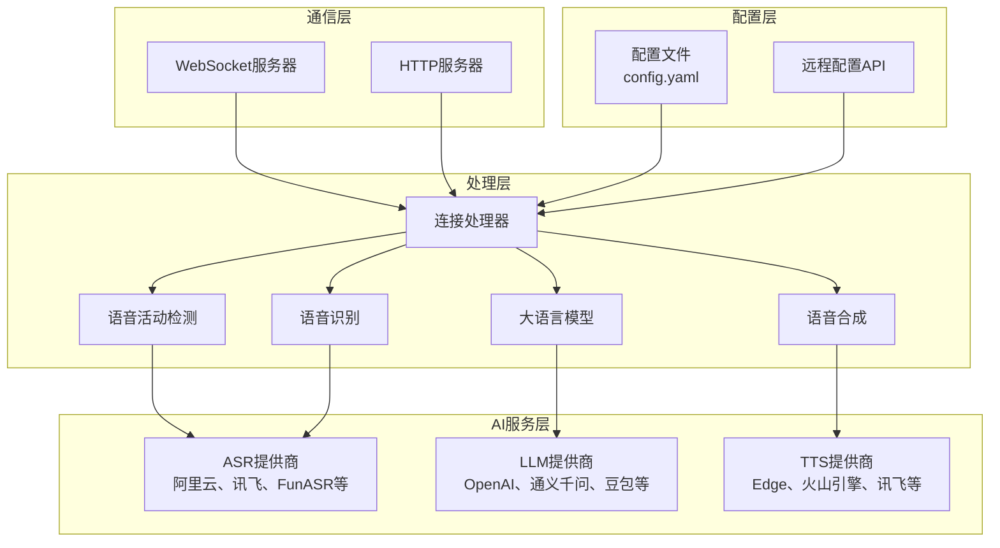
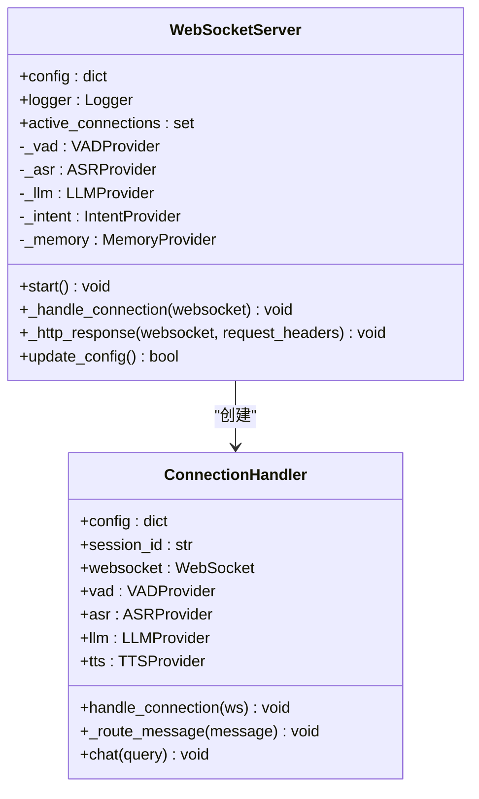

# 项目概述

<cite>
**本文档引用的文件**   
- [app.py](file://app.py)
- [config.yaml](file://config.yaml)
- [core/websocket_server.py](file://core/websocket_server.py)
- [core/http_server.py](file://core/http_server.py)
- [core/connection.py](file://core/connection.py)
- [core/providers/tools/unified_tool_handler.py](file://core/providers/tools/unified_tool_handler.py)
- [core/providers/asr/base.py](file://core/providers/asr/base.py)
- [core/providers/tts/base.py](file://core/providers/tts/base.py)
- [config/config_loader.py](file://config/config_loader.py)
- [plugins_func/loadplugins.py](file://plugins_func/loadplugins.py)
</cite>

## 目录
1. [简介](#简介)
2. [项目结构](#项目结构)
3. [核心组件](#核心组件)
4. [系统架构概览](#系统架构概览)
5. [详细组件分析](#详细组件分析)
6. [数据流路径](#数据流路径)
7. [关键术语与概念](#关键术语与概念)
8. [设计哲学](#设计哲学)
9. [启动流程](#启动流程)
10. [结论](#结论)

## 简介
xiaozhi-server项目是一个专为ESP32等嵌入式设备设计的后端语音交互服务系统。其核心目标是为智能语音助手和家庭自动化场景提供完整的语音识别（ASR）、自然语言处理（LLM）、语音合成（TTS）和设备控制功能。该项目通过WebSocket长连接与设备通信，采用模块化分层设计，支持与阿里云、OpenAI、讯飞等多家外部AI服务提供商的集成。其目标用户群体包括开发者、IoT设备制造商和技术爱好者，旨在提供一个灵活、可扩展且易于集成的语音交互解决方案。

## 项目结构
xiaozhi-server项目采用清晰的模块化目录结构，便于维护和扩展。主要目录包括：
- **config/**: 存放配置文件加载器、日志配置和全局设置。
- **core/**: 包含系统的核心逻辑，如WebSocket和HTTP服务器、API处理器、消息处理句柄、AI服务提供商接口及工具类。
- **models/**: 存放本地使用的AI模型文件，如语音活动检测（VAD）和语音识别（ASR）模型。
- **plugins_func/**: 包含可扩展的功能插件，如获取天气、新闻和控制IoT设备。
- **test/**: 提供用于测试WebSocket连接的前端HTML页面和JavaScript脚本。

这种结构体现了高内聚、低耦合的设计原则，使得各个功能模块可以独立开发和测试。

## 核心组件
项目的三大核心组件是WebSocket服务器、HTTP服务器和连接处理器。WebSocket服务器（`core/websocket_server.py`）负责处理与客户端的长连接，管理连接的生命周期，并根据配置初始化ASR、LLM、TTS等AI模块。HTTP服务器（`core/http_server.py`）提供简单的OTA（空中下载）更新接口和视觉分析接口。连接处理器（`core/connection.py`）是每个客户端连接的上下文，负责管理该连接的音频流、会话状态、记忆和工具调用。这些组件协同工作，构成了系统的基础通信和处理能力。

**Section sources**
- [core/websocket_server.py](file://core/websocket_server.py#L15-L206)
- [core/http_server.py](file://core/http_server.py#L10-L71)
- [core/connection.py](file://core/connection.py#L55-L800)

## 系统架构概览
xiaozhi-server采用分层架构，从下到上依次为：通信层、处理层、AI服务层和配置层。通信层通过WebSocket和HTTP协议与外部交互。处理层是系统的核心，由`ConnectionHandler`驱动，负责协调VAD、ASR、LLM、TTS等模块。AI服务层通过抽象基类（如`ASRProviderBase`和`TTSProviderBase`）实现了与不同提供商的解耦，支持本地和云端多种服务。配置层（`config/`）通过`config_loader.py`统一管理配置，支持从本地文件或远程API加载。这种架构确保了系统的灵活性和可维护性。

**Diagram sources**
- [core/websocket_server.py](file://core/websocket_server.py#L15-L206)
- [core/http_server.py](file://core/http_server.py#L10-L71)
- [core/connection.py](file://core/connection.py#L55-L800)

## 详细组件分析
### WebSocket服务器分析
WebSocket服务器是系统的主要入口，负责处理所有客户端的实时通信。它在启动时会根据配置初始化所有选定的AI模块（如VAD、ASR、LLM），并为每个新连接创建一个独立的`ConnectionHandler`实例。服务器还实现了基于JWT的认证机制，确保连接的安全性。

#### 对于通信组件：

**Diagram sources**
- [core/websocket_server.py](file://core/websocket_server.py#L15-L206)
- [core/connection.py](file://core/connection.py#L55-L800)

### 连接处理器分析
`ConnectionHandler`是每个客户端会话的核心。它管理着从音频接收、语音识别到文本生成和语音合成的完整流程。该处理器通过线程池异步执行耗时的AI任务，并维护会话的对话历史和记忆。它还负责处理来自设备的文本和音频消息，并将结果通过WebSocket发送回设备。

**Section sources**
- [core/connection.py](file://core/connection.py#L55-L800)

## 数据流路径
系统的数据流遵循一个清晰的处理管道：
1.  **设备音频输入**: ESP32设备通过WebSocket发送Opus编码的音频流。
2.  **VAD检测**: `ConnectionHandler`使用VAD模块（如SileroVAD）检测音频中的语音活动，确定语音的开始和结束。
3.  **ASR转录**: 当检测到语音结束时，累积的音频数据被送入ASR模块（如FunASR或阿里云ASR）进行转录，生成文本。
4.  **意图识别与LLM响应**: 生成的文本首先可能经过意图识别模块（如function_call），然后被送入LLM（如通义千问）生成响应。LLM的响应可以触发工具调用（如查询天气）。
5.  **TTS语音合成**: LLM生成的文本响应被送入TTS模块（如EdgeTTS）转换为语音。
6.  **返回设备播放**: 合成的语音（Opus编码）通过WebSocket流式发送回设备，设备播放给用户。

这个流程实现了从声音到智能响应的完整闭环。

**Section sources**
- [core/connection.py](file://core/connection.py#L265-L280)
- [core/providers/asr/base.py](file://core/providers/asr/base.py#L74-L179)
- [core/providers/tts/base.py](file://core/providers/tts/base.py#L276-L317)

## 关键术语与概念
- **MCP协议**: MCP（Model Context Protocol）是一种用于在客户端和服务器之间交换模型上下文信息的协议。在本项目中，它用于实现设备与服务器之间的工具调用和功能扩展。服务器通过`unified_tool_handler.py`统一管理MCP工具。
- **流式处理**: 指数据在生成的同时就被处理和传输，而不是等待全部数据生成完毕。本项目在ASR和TTS中广泛使用流式处理，以降低延迟，提供更自然的交互体验。
- **工具调用**: 指LLM在生成响应时，能够调用预定义的函数或API来获取额外信息或执行操作。例如，当用户询问天气时，LLM会调用`get_weather`工具。这通过`plugins_func/`目录下的插件实现。

## 设计哲学
项目的设计哲学体现在其高度的抽象化和可扩展性上。通过在`core/providers/`目录下定义抽象基类（如`base.py`），项目实现了对不同AI服务提供商的统一接口。这使得开发者可以轻松地添加新的ASR、LLM或TTS提供商，而无需修改核心处理逻辑。例如，`ASRProviderBase`定义了`speech_to_text`的抽象方法，所有具体的ASR实现（如`aliyun.py`、`xunfei_stream.py`）都必须继承并实现此方法。此外，通过`plugins_func/`和`unified_tool_handler.py`，系统支持动态加载和管理功能插件，极大地增强了其灵活性和适应性。

**Section sources**
- [core/providers/asr/base.py](file://core/providers/asr/base.py#L25-L239)
- [core/providers/tts/base.py](file://core/providers/tts/base.py#L31-L216)
- [core/providers/tools/unified_tool_handler.py](file://core/providers/tools/unified_tool_handler.py#L18-L236)

## 启动流程
系统的启动流程始于`app.py`文件：
1.  **入口**: 程序从`app.py`的`main()`函数开始执行。
2.  **初始化**: 检查FFmpeg是否安装，然后通过`config/settings.py`加载配置文件`config.yaml`。
3.  **认证密钥**: 生成或验证用于JWT认证的`auth_key`。
4.  **启动服务器**: 创建`WebSocketServer`和`SimpleHttpServer`的实例，并分别启动它们。
5.  **日志输出**: 将WebSocket、OTA和视觉分析接口的地址输出到日志，供用户连接。
6.  **等待信号**: 程序进入阻塞状态，等待退出信号（如Ctrl+C），在此期间处理所有客户端请求。

这个流程确保了服务器能够正确初始化所有依赖项并开始监听连接。

**Section sources**
- [app.py](file://app.py#L45-L145)
- [config/settings.py](file://config/settings.py#L1-L34)

## 结论
xiaozhi-server项目是一个功能完备、架构清晰的语音交互后端系统。它成功地将复杂的AI技术（ASR、LLM、TTS）与嵌入式设备的通信需求相结合，通过模块化设计和抽象接口，实现了高度的灵活性和可扩展性。其对MCP协议和工具调用的支持，为构建功能丰富的智能语音助手提供了坚实的基础。对于开发者而言，该项目提供了一个优秀的参考实现，展示了如何构建一个高效、可靠的物联网语音服务。